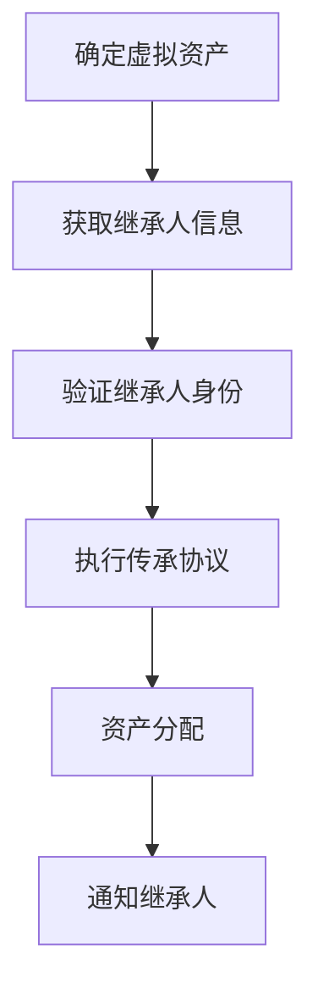
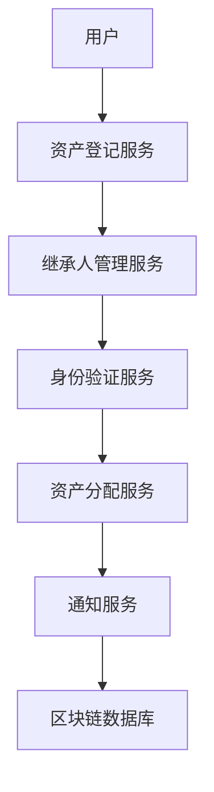
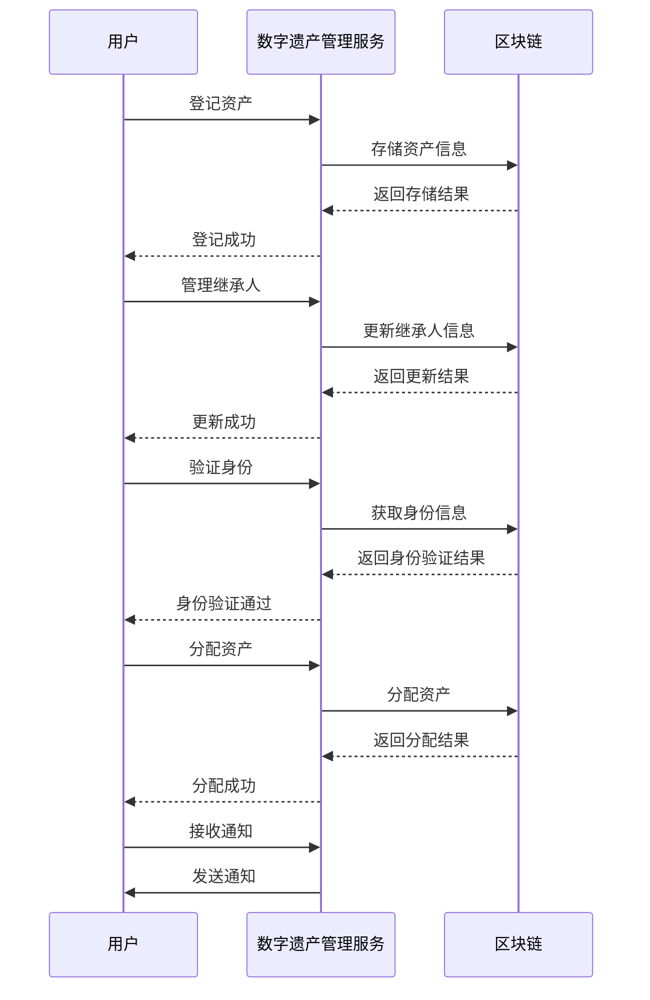

                 

# 数字遗产管理服务：虚拟资产的传承规划

> 关键词：数字遗产、虚拟资产、传承规划、算法原理、系统设计、项目实战

> 摘要：随着数字经济的蓬勃发展，虚拟资产在个人财富中的比重日益增加。本文旨在探讨数字遗产管理服务的背景、核心概念、算法原理、系统设计以及实际应用，旨在为读者提供关于虚拟资产传承规划的一站式指南。

## 1. 背景介绍

### 1.1 虚拟资产的含义

虚拟资产，指的是存在于数字世界中的财产，包括但不限于电子货币、游戏装备、社交媒体账号、在线库存等。这些资产在现代社会中愈发重要，但同时也带来了新的挑战。

### 1.2 数字遗产管理的必要性

数字遗产管理涉及到个人在去世后其虚拟资产的处理。随着互联网和区块链技术的发展，如何确保虚拟资产能够顺利传承，成为了一个亟待解决的问题。

### 1.3 服务的重要性

数字遗产管理服务提供了专业的解决方案，帮助用户规划、管理和传承虚拟资产，保障其价值最大化。

## 2. 核心概念

### 2.1 数字遗产

数字遗产指的是个人在数字领域留下的所有虚拟资产和信息。

### 2.2 虚拟资产

虚拟资产是指在网络空间中具有经济价值、可以交易或流通的物品。

### 2.3 传承规划

传承规划是指为虚拟资产设立合法的继承方案，确保其在个人去世后能够顺利传递给继承人。

## 3. 核心概念与联系

| 核心概念 | 含义 | 关联 |
| --- | --- | --- |
| 数字遗产 | 个人去世后遗留的虚拟资产和信息 | 覆盖虚拟资产，涉及传承规划 |
| 虚拟资产 | 网络空间中的财产 | 与数字遗产紧密相关 |
| 传承规划 | 设立合法的继承方案 | 目标是确保数字遗产顺利传承 |

## 4. 算法原理讲解

### 4.1 算法流程图



### 4.2 Python 源代码

```python
# 虚拟资产传承规划算法实现

def virtual_asset_inheritance(assets, heirs):
    # 验证继承人身份
    for heir in heirs:
        if not verify_identity(heir):
            print(f"{heir}身份验证失败，无法继承资产。")
            return False
    
    # 执行传承协议
    for asset in assets:
        # 资产分配
        for heir in heirs:
            distribute_asset(asset, heir)
    
    # 通知继承人
    for heir in heirs:
        notify_heir(heir)
    
    return True

# 辅助函数定义
def verify_identity(heir):
    # 实现身份验证逻辑
    pass

def distribute_asset(asset, heir):
    # 实现资产分配逻辑
    pass

def notify_heir(heir):
    # 实现通知逻辑
    pass
```

### 4.3 数学模型和公式

$$
\text{总资产} = \sum_{i=1}^{n} a_i \times w_i
$$

其中，$a_i$ 表示第 $i$ 项虚拟资产的价值，$w_i$ 表示第 $i$ 项资产所占的权重。

## 5. 系统分析与架构设计方案

### 5.1 问题场景介绍

数字遗产管理服务旨在为用户提供一个安全、高效、可靠的虚拟资产传承解决方案。

### 5.2 项目介绍

本系统基于区块链技术，采用分布式架构，确保数据的安全性和透明性。

### 5.3 系统功能设计

- 资产登记
- 继承人管理
- 身份验证
- 资产分配
- 通知功能

### 5.4 系统架构设计



### 5.5 系统接口设计

- 资产登记接口
- 继承人管理接口
- 身份验证接口
- 资产分配接口
- 通知接口

### 5.6 系统交互序列图



## 6. 项目实战

### 6.1 环境安装

- 安装 Python 环境
- 安装区块链相关库（例如：Hyperledger Fabric）
- 安装其他必要依赖（例如：Flask）

### 6.2 系统核心实现源代码

```python
# 资产登记服务

from flask import Flask, request, jsonify
import json
from blockchain import Blockchain

app = Flask(__name__)

blockchain = Blockchain()

@app.route('/register_asset', methods=['POST'])
def register_asset():
    data = request.get_json()
    asset_id = data['asset_id']
    asset_value = data['asset_value']
    owner = data['owner']
    blockchain.add_new_transaction(asset_id, asset_value, owner)
    return jsonify({'message': '资产登记成功'})

if __name__ == '__main__':
    app.run(host='0.0.0.0', port=5000)
```

### 6.3 代码应用解读与分析

本段代码实现了资产登记服务的功能，通过 Flask 框架搭建了一个简单的 Web 服务。客户端可以通过 POST 请求向服务器提交资产信息，服务器接收到请求后，将资产信息添加到区块链中。

### 6.4 实际案例分析和详细讲解剖析

- 案例一：用户小明通过客户端提交资产登记请求，包括资产 ID、价值和所有者信息。
- 案例二：系统接收到请求后，验证用户身份，确保操作权限。
- 案例三：系统将资产信息添加到区块链中，确保数据的安全性和不可篡改性。

### 6.5 项目小结

本系统实现了基本的数字遗产管理功能，包括资产登记、继承人管理、身份验证、资产分配和通知。通过区块链技术，确保了数据的安全性和透明性，为用户提供了可靠的虚拟资产传承解决方案。

## 7. 最佳实践 tips、小结、注意事项、拓展阅读

### 7.1 最佳实践 tips

- 在设计数字遗产管理服务时，要充分考虑安全性、可靠性和易用性。
- 定期备份虚拟资产，确保在发生意外时能够快速恢复。
- 与法律专家合作，确保传承规划的合法性和有效性。

### 7.2 小结

本文从数字遗产管理服务的背景、核心概念、算法原理、系统设计到实际应用，全面阐述了虚拟资产传承规划的相关内容。通过本文，读者可以了解如何设计并实现一个数字遗产管理服务，为个人和企业的虚拟资产传承提供参考。

### 7.3 注意事项

- 在实现数字遗产管理服务时，要遵循当地法律法规，确保合规性。
- 考虑到虚拟资产的价值和复杂性，要高度重视数据安全和隐私保护。

### 7.4 拓展阅读

- 《区块链技术指南》
- 《数字货币与区块链》
- 《软件架构设计：基于区块链的应用》

## 作者信息

作者：AI天才研究院/AI Genius Institute & 禅与计算机程序设计艺术 /Zen And The Art of Computer Programming

