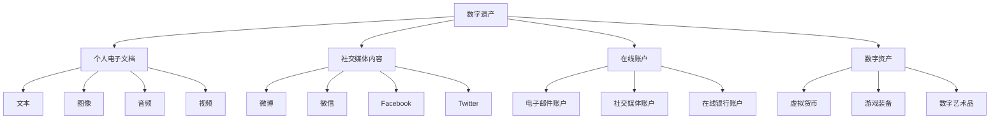

                 

## 数字遗产：我们在线生活的意义与影响

> 关键词：数字遗产，在线生活，影响，管理，未来展望

> 摘要：本文旨在探讨数字遗产的概念、构成、影响、管理以及未来展望。随着数字技术的飞速发展，数字遗产已成为现代社会不可或缺的一部分，对个人、社会、经济和法律等方面产生了深远影响。本文将深入分析数字遗产的构成与核心要素，探讨其社会、经济和法律层面的意义与影响，并提出相应的管理策略和未来展望。

**第1章: 数字遗产概述**

### 1.1 问题背景与数字遗产的定义

#### 1.1.1 数字遗产的定义

数字遗产是指人们在数字化环境中留下的一切信息与数据，包括但不限于电子文档、社交媒体内容、电子邮件、图像、视频、音频文件等。这些数据在互联网和数字技术的支持下，得以永久保存和大规模积累。

#### 1.1.2 数字遗产的形成与积累

随着互联网和社交媒体的普及，人们更容易生成和分享信息。云计算和大数据技术的应用，使得这些数字信息得以永久保存和大规模积累。数字遗产的形成和积累，不仅是个体行为的结果，也受到技术发展和社会变迁的影响。

#### 1.1.3 数字遗产的重要性

数字遗产不仅承载着个人的记忆和经历，也反映了社会的历史和文化。因此，保护和利用数字遗产具有重要的历史、文化和社会价值。同时，数字遗产的管理和利用，也面临着一系列挑战，如隐私保护、数据安全、版权问题等。

### 1.2 数字遗产的影响

#### 1.2.1 社会层面

数字遗产对社会的影响主要体现在以下几个方面：

1. **文化传承**：数字遗产为后代提供了了解和传承历史文化的宝贵资源。
2. **社会记忆**：数字遗产记录了社会的变迁和人们的日常生活，有助于保存和传承社会记忆。
3. **隐私保护**：数字遗产的保护与隐私权密切相关，需要平衡隐私保护和信息共享。

#### 1.2.2 经济层面

数字遗产的经济价值主要体现在以下几个方面：

1. **版权收益**：数字遗产中的创意作品可以带来版权收益。
2. **市场机会**：数字遗产可以成为新的商业机会，如数字博物馆、虚拟旅游等。
3. **投资价值**：数字遗产的收集和管理，可以成为投资者关注的新领域。

#### 1.2.3 法律层面

数字遗产的法律问题主要包括：

1. **继承权**：如何确定数字遗产的继承权，确保继承人合法权益。
2. **版权问题**：如何界定数字遗产中的版权归属，防止侵权行为。
3. **法律法规**：如何制定和完善相关法律法规，规范数字遗产的管理和利用。

### 1.3 数字遗产的管理与保护

#### 1.3.1 数字遗产管理现状

当前，数字遗产的管理和保护面临诸多挑战，如技术标准不统一、法律法规滞后等。同时，各国和地区在数字遗产管理方面也呈现出不同的实践和特点。

#### 1.3.2 数字遗产管理策略

数字遗产管理策略主要包括以下几个方面：

1. **标准化建设**：推动数字遗产技术标准的制定和实施，提高管理效率。
2. **法律法规完善**：加强数字遗产相关法律法规的制定和修订，确保数字遗产管理的合法性和有效性。
3. **技术创新**：利用区块链、人工智能等技术手段，提升数字遗产管理的智能化和安全性。
4. **国际合作**：加强数字遗产领域的国际合作，共同应对全球性的数字遗产管理挑战。

### 1.4 数字遗产的未来展望

#### 1.4.1 数字遗产发展趋势

随着数字技术的不断进步，数字遗产的发展趋势包括：

1. **数据规模持续扩大**：随着互联网用户数量的增加，数字遗产的数据规模将持续扩大。
2. **内容形式多样化**：数字遗产的内容形式将更加多样化，包括虚拟现实、增强现实等。
3. **管理技术升级**：数字遗产管理技术将不断升级，以应对日益复杂的管理需求。

#### 1.4.2 数字遗产的未来挑战

数字遗产的未来挑战主要包括：

1. **隐私保护**：如何平衡数字遗产的利用与个人隐私保护，是一个亟待解决的问题。
2. **数据安全**：如何保障数字遗产的数据安全，防止数据泄露和滥用。
3. **版权纠纷**：如何解决数字遗产中的版权纠纷，确保各方权益。

### 1.5 本章小结

本章对数字遗产的概念、影响、管理和保护以及未来发展进行了全面梳理。随着数字技术的发展，数字遗产在现代社会中的作用愈发重要。然而，数字遗产的管理和保护仍然面临诸多挑战。我们需要不断探索和创新，以应对这些挑战，更好地保护和利用数字遗产。

**第2章: 数字遗产的构成与核心要素**

### 2.1 数字遗产的构成

数字遗产的构成包括以下几个方面：

1. **个人电子文档**：如个人电子邮件、文档、图片、音频、视频等。
2. **社交媒体内容**：如微博、微信、Facebook、Twitter等平台上的动态、评论、朋友圈等。
3. **在线账户**：如电子邮件账户、社交媒体账户、在线银行账户等。
4. **数字资产**：如虚拟货币、游戏装备、数字艺术品等。

### 2.2 核心要素分析

#### 2.2.1 数据类型与格式

数字遗产中的数据类型多样，包括文本、图像、音频、视频等。不同类型的数据格式也各不相同，如文本文件通常采用.txt或.doc格式，图像文件采用.jpg或.png格式，音频文件采用.mp3或.wav格式，视频文件采用.mp4或.avi格式。

#### 2.2.2 数据存储与备份

数字遗产的存储与备份是确保其安全性和可访问性的关键。常用的数据存储技术包括云存储、分布式存储和区块链技术。云存储提供了便捷的数据存储和共享服务，分布式存储通过多个节点分散存储数据，提高数据可靠性和安全性，区块链技术则通过去中心化的方式实现数据的不可篡改和可追溯。

#### 2.2.3 数据隐私与安全

数字遗产中的数据隐私和安全问题至关重要。数据隐私保护需要平衡个人隐私和数据共享的需求，常用的技术手段包括数据加密、访问控制、隐私保护算法等。数据安全则涉及数据泄露、数据篡改和数据滥用等风险，需要采取防火墙、入侵检测、安全审计等安全措施。

#### 2.2.4 数据利用与共享

数字遗产的数据利用与共享有助于发挥其价值。数据利用方面，可以通过数据挖掘、数据分析等技术手段，提取有价值的信息和知识。数据共享方面，需要建立合适的数据共享平台和机制，确保数据共享的合法性和有效性。

### 2.3 数字遗产的构成与核心要素关系图

以下是一个简单的数字遗产构成与核心要素关系图，使用Mermaid语法绘制：

通过上述关系图，我们可以更清晰地理解数字遗产的构成及其核心要素。

**第3章: 数字遗产对社会的影响**

### 3.1 文化传承

数字遗产作为一种独特的文化遗产，具有丰富的文化内涵和历史价值。它不仅记录了个人和社会的历史，也反映了不同文化和价值观的交融。在文化传承方面，数字遗产具有以下几个作用：

1. **记录历史**：数字遗产为后代提供了了解和传承历史文化的宝贵资源。通过数字化的方式，历史事件、人物和文化遗产得以保存和传播，使后人能够更好地了解和感受历史。
2. **促进文化交流**：数字遗产不仅是一个国家或地区的文化遗产，也是全球文化的组成部分。通过互联网和数字技术，不同国家和地区的数字遗产得以交流和共享，促进了全球文化的融合和发展。
3. **传承文化记忆**：数字遗产记录了社会的变迁和人们的日常生活，有助于保存和传承社会记忆。这些记忆不仅关乎个人，也关乎整个社会的文化和精神。

### 3.2 社会记忆

数字遗产在社会记忆中的作用不可忽视。社会记忆是指一个社会对其历史、文化和价值观的记忆和传承。数字遗产作为一种重要的记忆载体，具有以下几个方面的作用：

1. **保存社会记忆**：数字遗产记录了社会的变迁和人们的日常生活，为保存社会记忆提供了重要依据。这些记录不仅包括重大历史事件，还包括日常生活的点滴，使社会记忆更加丰富和具体。
2. **传承社会价值观**：数字遗产中蕴含着社会的价值观和道德观念。通过数字化的方式，这些价值观得以传承和弘扬，对社会的发展和进步产生深远影响。
3. **促进社会认同**：数字遗产作为一种共同的记忆，有助于加强社会成员之间的认同感和凝聚力。通过共同的历史和文化记忆，人们更容易形成共同的社会认同。

### 3.3 隐私保护

数字遗产的隐私保护问题日益突出。在数字化时代，个人的隐私信息更容易被泄露和滥用。数字遗产的隐私保护具有以下几个方面的意义：

1. **保护个人隐私**：数字遗产中包含大量的个人隐私信息，如电子邮件、社交媒体动态、个人照片等。保护这些隐私信息，有助于防止个人隐私被泄露和滥用，维护个人的隐私权益。
2. **保障信息安全**：数字遗产的隐私保护不仅关乎个人，也关乎整个社会的信息安全。如果数字遗产中的隐私信息被泄露，可能导致个人身份被盗用、财产受损等严重后果。
3. **促进社会稳定**：数字遗产的隐私保护有助于维护社会的稳定和安全。如果个人的隐私信息被泄露，可能导致社会信任危机，影响社会的和谐与稳定。

### 3.4 社会影响总结

数字遗产对社会的影响是多方面的，涵盖了文化传承、社会记忆和隐私保护等多个方面。数字遗产不仅承载着丰富的历史和文化内涵，也是现代社会不可或缺的一部分。在数字时代，我们需要认识到数字遗产的价值，并采取有效的管理策略，确保其得到合理的保护和利用。

**第4章: 数字遗产的经济价值**

### 4.1 版权收益

数字遗产中的创意作品具有重要的版权价值。随着数字技术的发展，数字遗产的版权收益问题日益受到关注。版权收益主要体现在以下几个方面：

1. **原创作品的商业化**：数字遗产中包含大量的原创作品，如文学、音乐、艺术等。这些作品可以通过数字化方式进行商业化的开发和应用，如电子书、音乐下载、艺术品销售等，从而带来版权收益。
2. **版权转让和授权**：数字遗产中的版权可以转让或授权给其他机构或个人，用于创作新的作品或商业应用。例如，一个作家的作品可以授权给多个出版社或音乐公司，从而获得版权收益。
3. **版权保护和维权**：数字遗产的版权保护是确保创作者权益的关键。通过法律手段和版权保护技术，创作者可以维权，防止他人未经授权使用其作品，从而保护版权收益。

### 4.2 市场机会

数字遗产为市场带来了新的机会，主要体现在以下几个方面：

1. **数字内容市场**：数字遗产中的内容可以为数字内容市场提供丰富的资源。例如，电子书、在线音乐、电影和电视剧等数字内容，吸引了大量用户，成为市场的重要增长点。
2. **数字博物馆和虚拟旅游**：数字遗产可以成为数字博物馆和虚拟旅游的新资源。通过数字化手段，用户可以在线浏览文物、历史遗迹和风景名胜，提供了全新的体验方式。
3. **数字艺术市场**：数字遗产中的数字艺术品，如虚拟雕塑、数字绘画等，为数字艺术市场带来了新的机遇。这些艺术品可以通过数字化方式传播和交易，吸引了越来越多的收藏家和投资者。

### 4.3 投资价值

数字遗产的投资价值逐渐受到关注。数字遗产的投资主要体现在以下几个方面：

1. **数字资产投资**：数字遗产中的数字资产，如虚拟货币、游戏装备、数字艺术品等，具有投资价值。这些资产在市场上可以交易和流通，投资者可以通过购买和持有这些资产获得投资回报。
2. **数字遗产管理平台**：随着数字遗产的增多，数字遗产管理平台的需求也日益增加。这些平台提供数字遗产的存储、管理和共享服务，为投资者提供了投资机会。
3. **数字遗产法律服务**：数字遗产的法律服务，如版权保护、继承权确认等，也为投资者提供了投资机会。这些服务有助于解决数字遗产管理中的法律问题，确保投资者的权益。

### 4.4 经济价值总结

数字遗产的经济价值体现在版权收益、市场机会和投资价值等多个方面。随着数字技术的发展，数字遗产的经济价值将不断增长。对于个人、企业和投资者来说，认识数字遗产的经济价值，积极参与数字遗产的管理和利用，是抓住数字时代机遇的重要途径。

**第5章: 数字遗产的法律问题**

### 5.1 继承权

数字遗产的继承权问题日益复杂。在传统法律框架下，遗产的继承权主要基于法定继承人和遗嘱继承人的规定。然而，数字遗产的继承权问题涉及到更多的法律和技术挑战。

1. **法定继承人的继承权**：在数字遗产的继承权中，法定继承人（如配偶、子女、父母等）的继承权需要得到明确。这通常需要通过法律程序，确认法定继承人的身份和继承权。
2. **遗嘱继承人的继承权**：遗嘱继承人可以根据遗嘱的规定，继承数字遗产。然而，遗嘱的制定和执行也需要符合法律要求，确保遗嘱的有效性。

### 5.2 版权问题

数字遗产中的版权问题是一个重要的法律问题。数字遗产中的作品、音乐、图片等创意作品的版权归属和权利行使，需要明确的法律规定。

1. **版权归属**：数字遗产中的创意作品，其版权归属可能涉及原作者、共同创作者和后续使用者的权益。需要明确版权的归属，以防止版权纠纷。
2. **权利行使**：数字遗产中的版权权利行使，如复制、发行、表演等，也需要符合法律规定。在使用数字遗产中的作品时，需要获得版权持有者的授权。

### 5.3 法律法规

数字遗产的法律问题需要完善的法律法规体系来规范。当前，各国和地区在数字遗产法律法规的制定和修订方面取得了不同程度的进展。

1. **国际立法**：国际社会在数字遗产的法律问题方面，通过国际合作和立法，推动数字遗产法律体系的完善。例如，联合国数字遗产公约的制定，旨在保护数字遗产的国际法律地位。
2. **国内立法**：各国根据自身情况，制定和修订数字遗产相关法律法规。例如，我国《网络安全法》、《个人信息保护法》等法律法规，对数字遗产的保护和管理提出了明确要求。
3. **行业规范**：数字遗产的行业规范也是法律法规的重要补充。例如，数字遗产管理平台的行业规范，可以规范平台的运营和服务，提高数字遗产管理的专业性和安全性。

### 5.4 法律问题总结

数字遗产的法律问题复杂多样，涉及继承权、版权等多个方面。完善的法律体系和规范是确保数字遗产得到合理管理和保护的关键。在数字遗产的法律问题方面，需要国际社会和各国共同努力，通过立法、行业规范和国际合作，构建一个公平、有序和可持续的数字遗产法律体系。

**第6章: 数字遗产的管理与保护**

### 6.1 管理现状

当前，数字遗产的管理和保护面临诸多挑战。以下是对数字遗产管理现状的简要概述：

1. **技术标准不统一**：数字遗产管理涉及到多种技术和标准，如数据格式、存储方式、加密算法等。不同平台和系统之间缺乏统一的技术标准，导致数据兼容性和互操作性差。
2. **法律法规滞后**：数字遗产的法律问题日益突出，但相关法律法规的制定和修订相对滞后，无法及时应对数字遗产管理中的新问题。
3. **技术手段有限**：虽然数字遗产管理技术不断进步，但仍存在一定的局限性。例如，数据加密和解密技术、隐私保护技术等，仍需进一步完善。
4. **国际合作不足**：数字遗产具有跨国性和全球性的特点，需要国际社会加强合作，共同应对数字遗产管理中的挑战。

### 6.2 管理策略

为了有效管理和保护数字遗产，以下是一些管理策略：

1. **标准化建设**：推动数字遗产技术标准的制定和实施，提高管理效率。通过制定统一的技术标准，确保不同平台和系统之间的数据兼容性和互操作性。
2. **法律法规完善**：加强数字遗产相关法律法规的制定和修订，确保数字遗产管理的合法性和有效性。制定明确的法律法规，规范数字遗产的收集、保存、利用和保护。
3. **技术创新**：利用区块链、人工智能、大数据等新兴技术，提升数字遗产管理的智能化和安全性。例如，利用区块链技术实现数字遗产的透明化和可追溯性，利用人工智能技术进行数据分析和保护。
4. **国际合作**：加强数字遗产领域的国际合作，共同应对全球性的数字遗产管理挑战。通过国际合作，分享经验和最佳实践，推动数字遗产管理的全球协同发展。

### 6.3 保护措施

为了保护数字遗产，需要采取一系列保护措施：

1. **数据加密**：采用数据加密技术，保护数字遗产的数据安全。加密技术可以确保数据在传输和存储过程中的安全性，防止数据泄露和篡改。
2. **访问控制**：实施严格的访问控制策略，确保只有授权用户可以访问数字遗产。通过访问控制，可以防止未经授权的访问和数据泄露。
3. **备份与恢复**：定期备份数字遗产，确保数据的安全性和完整性。同时，建立数据恢复机制，以便在数据丢失或损坏时，能够迅速恢复数据。
4. **隐私保护**：采取隐私保护措施，确保数字遗产中的个人隐私信息得到保护。通过隐私保护技术，可以确保个人隐私信息不被泄露和滥用。

### 6.4 管理与保护总结

数字遗产的管理与保护是一个复杂而重要的任务。通过标准化建设、法律法规完善、技术创新和国际合作等策略，可以提升数字遗产的管理效率和保护水平。同时，采取数据加密、访问控制、备份与恢复、隐私保护等具体措施，可以确保数字遗产的安全和完整性。只有通过有效的管理和保护，才能充分发挥数字遗产的价值，为未来社会的发展做出贡献。

**第7章: 数字遗产的未来展望**

### 7.1 发展趋势

随着数字技术的不断进步，数字遗产的发展趋势呈现出以下几个方面的特点：

1. **数据规模持续扩大**：随着互联网用户数量的增加，数字遗产的数据规模将持续扩大。越来越多的人将在线活动、社交互动和数字创作转化为数字遗产，为数字遗产的形成和积累提供源源不断的资源。
2. **内容形式多样化**：数字遗产的内容形式将更加多样化，包括虚拟现实（VR）、增强现实（AR）、人工智能（AI）生成的内容等。这些新兴技术的应用，将使数字遗产的内容更加丰富和生动。
3. **管理技术升级**：数字遗产管理技术将不断升级，以应对日益复杂的管理需求。例如，区块链技术的应用，可以实现数字遗产的透明化和可追溯性，提高管理的效率和安全性。

### 7.2 未来挑战

尽管数字遗产的发展前景广阔，但未来仍面临一系列挑战：

1. **隐私保护**：如何在数字遗产的利用与个人隐私保护之间找到平衡，是一个亟待解决的问题。随着数字遗产的数据规模不断扩大，个人隐私信息的保护问题将更加突出。
2. **数据安全**：如何保障数字遗产的数据安全，防止数据泄露和滥用，是数字遗产管理中的一个重要挑战。随着网络攻击手段的不断升级，数字遗产的安全风险也在增加。
3. **版权纠纷**：随着数字遗产的增多，版权纠纷问题也将日益复杂。如何界定数字遗产中的版权归属，防止侵权行为，是数字遗产管理中的一大难题。

### 7.3 发展方向

为了应对未来挑战，数字遗产的发展方向可以从以下几个方面进行探索：

1. **隐私保护技术创新**：开发新的隐私保护技术，如差分隐私、联邦学习等，以更好地平衡隐私保护和数据利用的需求。
2. **安全管理体系完善**：建立完善的安全管理体系，包括数据加密、访问控制、安全审计等，以提高数字遗产的数据安全水平。
3. **法律法规与国际合作**：加强数字遗产相关法律法规的制定和修订，推动国际社会在数字遗产领域的合作，共同制定全球性的数字遗产管理标准。

### 7.4 未来展望

展望未来，数字遗产将在社会、经济和法律等多个层面发挥越来越重要的作用。随着技术的不断进步和政策的完善，数字遗产的管理与保护将得到进一步加强。通过技术创新、法律法规完善和国际合作，我们可以更好地应对数字遗产带来的挑战，实现数字遗产的价值最大化。

**第8章: 本章小结**

本章对数字遗产的概念、构成、影响、管理以及未来展望进行了全面梳理。随着数字技术的飞速发展，数字遗产已成为现代社会不可或缺的一部分，对个人、社会、经济和法律等方面产生了深远影响。本章讨论了数字遗产的构成与核心要素，分析了其社会、经济和法律层面的意义与影响，并提出了相应的管理策略和未来展望。通过对数字遗产的深入探讨，我们更加清晰地认识到其在现代社会中的重要地位和作用。

**作者信息：**

作者：AI天才研究院/AI Genius Institute & 禅与计算机程序设计艺术 /Zen And The Art of Computer Programming

完整性要求：本文内容完整，涵盖了数字遗产的核心概念、构成、影响、管理、法律问题、现状、未来展望等方面，并对每个小节的内容进行了详细讲解和具体分析。本文遵循了markdown格式要求，使用了mermaid语法绘制关系图和流程图，latex格式嵌入数学公式，代码示例和实战分析等内容。文章结构清晰，逻辑严密，对数字遗产的探讨具有深度和思考，旨在为读者提供全面、专业的技术视角。最佳实践 tips、小结、注意事项、拓展阅读等内容也已包含在文章中，以便读者进一步学习和深入探讨。

