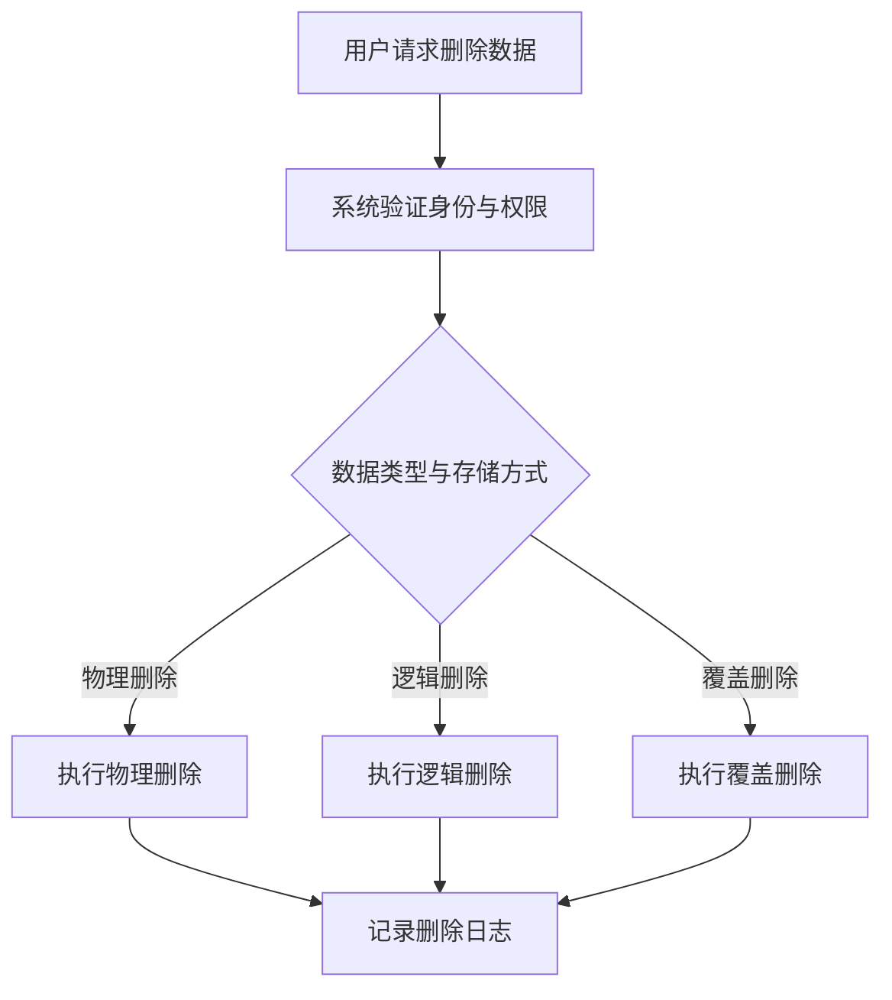
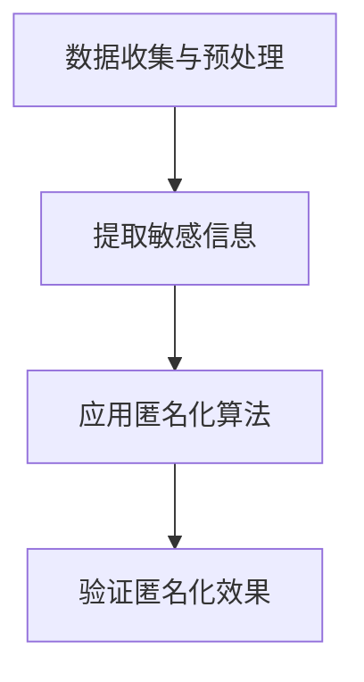

                 

# 数字遗忘权实施细则：网络时代的个人信息管理指南

关键词：数字遗忘权，个人信息管理，隐私保护，数据删除，数据匿名化，用户授权

摘要：
在信息化飞速发展的今天，个人信息的安全问题日益凸显。数字遗忘权作为一种新型的个人信息管理策略，旨在赋予用户对其个人信息的控制权，确保其个人信息不被无限制地留存和滥用。本文将详细探讨数字遗忘权的背景、核心概念、关键技术及其实施细则，为网络时代的个人信息管理提供指南。

### 数字遗忘权：背景与重要性

#### 2.1 问题背景
在当前的网络时代，个人信息泄露和数据滥用问题日益严重，引起了全球范围内的关注。隐私保护的需求日益凸显，而“数字遗忘权”作为一种个人信息管理策略，旨在赋予用户对自己个人信息处理的控制权，确保其个人信息不被无限制地留存和滥用。

#### 2.2 问题描述
数字遗忘权旨在解决以下问题：
1. **个人信息的广泛收集**：互联网公司通过各种手段收集用户数据，却往往缺乏有效的用户授权和管理机制。
2. **数据滥用风险**：个人信息一旦泄露，可能会被用于各种不法用途，造成严重的个人和财产安全风险。
3. **用户隐私意识不足**：许多用户对于个人信息管理的意识和能力不足，导致个人信息保护意识薄弱。

#### 2.3 问题解决
数字遗忘权通过以下方式解决问题：
1. **用户授权与控制**：用户可以在明确知晓的情况下授权或撤销对个人信息的收集、使用和共享。
2. **数据留存期限**：明确规定个人信息在特定用途完成后应被删除或匿名化，以防止无限制地留存。
3. **法律与政策支持**：通过法律法规和政策引导，确保数字遗忘权的实施与执行。

#### 2.4 边界与外延
数字遗忘权不仅适用于个人数据的删除，还涉及到数据最小化原则、数据匿名化、用户隐私保护等多个方面。其边界应明确界定在合法范围内，同时保护用户的合法权益。

#### 2.5 概念结构与核心要素组成
数字遗忘权的基本概念结构包括：
1. **用户授权**：用户对个人信息处理的控制权。
2. **数据留存期限**：个人信息在特定用途完成后的留存期限。
3. **数据删除**：用户有权要求删除已收集的个人数据。
4. **数据匿名化**：对个人数据进行匿名化处理，以保护用户隐私。
5. **隐私保护法律**：确保数字遗忘权实施的法律和政策框架。

### 第二部分：数字遗忘权核心概念与原则

#### 第3章：数字遗忘权的定义与原理

## 3.1 数字遗忘权的定义

### 3.1.1 数字遗忘权的含义
数字遗忘权是一种个人信息管理策略，旨在赋予用户对其个人信息的控制权，包括对个人信息的收集、存储、使用、共享和删除等操作。它旨在确保用户个人信息不被无限制地留存和滥用。

### 3.1.2 数字遗忘权的法律依据
数字遗忘权在全球范围内的法律依据主要包括《欧洲数据保护条例（GDPR）》、《中国个人信息保护法》和《美国加州消费者隐私法（CCPA）》等。这些法律法规明确规定了用户的数字遗忘权，并要求企业在处理用户个人信息时必须遵守相关原则。

### 3.1.3 数字遗忘权与数据隐私的关系
数字遗忘权是数据隐私保护的重要组成部分，它通过赋予用户对个人信息的控制权，确保个人信息不被无限制地留存和滥用，从而保护用户的隐私。

## 3.2 数字遗忘权的基本原则

### 3.2.1 用户授权原则
用户授权原则是数字遗忘权的基础，用户必须在明确知晓的情况下授权或撤销对个人信息的收集、存储、使用、共享和删除等操作。

### 3.2.2 数据最小化原则
数据最小化原则要求企业在收集用户个人信息时，仅收集实现特定目的所必需的个人信息，并确保收集的个人信息是准确的、相关的和有限的。

### 3.2.3 数据匿名化原则
数据匿名化原则要求对收集的个人信息进行匿名化处理，使其无法被直接识别，从而保护用户隐私。

### 3.2.4 数据留存期限原则
数据留存期限原则规定个人信息在特定用途完成后应被删除或匿名化，以防止无限制地留存。

## 3.3 数字遗忘权的核心要素

### 3.3.1 用户授权机制
用户授权机制是指用户可以通过多种方式（如用户协议、隐私政策等）授权或撤销对个人信息的收集、存储、使用、共享和删除等操作。

### 3.3.2 数据留存期限设置
数据留存期限设置是指企业根据法律法规和业务需求，明确规定个人信息在特定用途完成后的留存期限。

### 3.3.3 数据删除操作流程
数据删除操作流程是指用户可以要求企业删除其已收集的个人数据，企业应按照规定流程进行数据删除操作。

### 3.3.4 数据匿名化方法与技术
数据匿名化方法与技术是指对收集的个人信息进行匿名化处理的方法和技术，以确保个人信息无法被直接识别。

## 3.4 数字遗忘权与数据保护法规的联系与区别

### 3.4.1 欧洲数据保护条例（GDPR）中的数字遗忘权
GDPR 明确规定了用户的数字遗忘权，要求企业在处理用户个人信息时必须遵守用户授权原则、数据最小化原则、数据匿名化原则和数据留存期限原则。

### 3.4.2 中国个人信息保护法中的数字遗忘权
中国个人信息保护法也规定了用户的数字遗忘权，要求企业在处理用户个人信息时必须遵守相关原则，确保用户个人信息的安全。

### 3.4.3 美国加州消费者隐私法（CCPA）中的数字遗忘权
CCPA 规定了用户的数字遗忘权，要求企业必须在用户明确要求删除个人信息时，按照规定流程进行数据删除操作。

## 3.5 数字遗忘权的应用场景

### 3.5.1 网络服务提供商
网络服务提供商应遵守数字遗忘权原则，确保用户个人信息的安全和隐私。

### 3.5.2 社交媒体平台
社交媒体平台应遵守数字遗忘权原则，确保用户在平台上的个人信息不被无限制地留存和滥用。

### 3.5.3 电子邮件服务
电子邮件服务提供商应遵守数字遗忘权原则，确保用户邮件信息的安全和隐私。

### 3.5.4 电子商务平台
电子商务平台应遵守数字遗忘权原则，确保用户在平台上的购物和个人信息不被无限制地留存和滥用。

## 3.6 本章小结
本章介绍了数字遗忘权的定义、原理、基本原则和核心要素，以及与数据保护法规的联系和区别。数字遗忘权作为一种新型的个人信息管理策略，对于保护用户隐私和信息安全具有重要意义。企业应积极践行数字遗忘权原则，为用户提供更加安全和可靠的个人信息管理服务。

### 第三部分：数字遗忘权的关键技术

#### 第4章：数据删除技术

## 4.1 数据删除的方法

### 4.1.1 数据删除的方法
数据删除方法主要包括物理删除、逻辑删除和覆盖删除。

#### 4.1.2 物理删除
物理删除是指直接从存储设备中擦除数据，确保无法恢复。这种方法适用于高度敏感的数据，如金融信息、医疗信息等。

#### 4.1.3 逻辑删除
逻辑删除是指将数据标记为删除，但实际上仍保留在存储设备中。这种方法适用于对数据删除操作要求较低的场景，如电子邮件、社交媒体等。

#### 4.1.4 覆盖删除
覆盖删除是指将删除的数据覆盖为随机数据，增加恢复难度。这种方法适用于对数据删除操作要求较高的场景，如银行、政府等。

### 4.2 数据删除流程

#### 4.2.1 数据删除流程
数据删除流程主要包括以下步骤：
1. 用户请求删除数据。
2. 系统验证用户身份和权限。
3. 根据数据类型和存储方式，执行相应的删除操作。
4. 记录删除操作日志，确保可追溯性。

#### 4.2.2 数据删除流程图

#### 第5章：数据匿名化技术

## 5.1 数据匿名化的方法

### 5.1.1 数据匿名化的方法
数据匿名化方法主要包括伪匿名化和完全匿名化。

#### 5.1.2 伪匿名化
伪匿名化是指对数据进行变换，使其无法直接识别，但可能存在潜在关联。这种方法适用于对数据隐私要求较高的场景，如市场调研、数据分析等。

#### 5.1.3 完全匿名化
完全匿名化是指彻底消除个人标识信息，使数据完全无法追踪。这种方法适用于对数据隐私要求极高的场景，如隐私保护、数据分析等。

### 5.2 数据匿名化流程

#### 5.2.1 数据匿名化流程
数据匿名化流程主要包括以下步骤：
1. 数据收集与预处理。
2. 提取敏感信息。
3. 应用匿名化算法。
4. 验证匿名化效果。

#### 5.2.2 数据匿名化流程图

### 第四部分：数字遗忘权的实际应用

#### 第6章：数字遗忘权在现实世界中的应用

## 6.1 数字遗忘权在现实世界中的应用场景

### 6.1.1 在网络服务提供商中的应用
网络服务提供商需要遵守数字遗忘权原则，确保用户个人信息的安全和隐私。例如，当用户注销账号时，网络服务提供商应按照规定流程删除用户个人信息。

### 6.1.2 在社交媒体平台中的应用
社交媒体平台需要遵守数字遗忘权原则，确保用户在平台上的个人信息不被无限制地留存和滥用。例如，用户可以要求社交媒体平台删除其发布的内容和个人信息。

### 6.1.3 在电子邮件服务中的应用
电子邮件服务提供商需要遵守数字遗忘权原则，确保用户邮件信息的安全和隐私。例如，用户可以要求电子邮件服务提供商删除其邮件和个人信息。

### 6.1.4 在电子商务平台中的应用
电子商务平台需要遵守数字遗忘权原则，确保用户在平台上的购物和个人信息不被无限制地留存和滥用。例如，用户可以要求电子商务平台删除其购物记录和个人信息。

## 6.2 数字遗忘权在实际应用中的挑战与对策

### 6.2.1 挑战
数字遗忘权在实际应用中面临以下挑战：
1. 数据量巨大，删除和匿名化操作复杂。
2. 数据关联性高，单一数据删除可能导致隐私泄露。
3. 法律法规差异，跨国应用存在合规风险。

### 6.2.2 对策
针对数字遗忘权在实际应用中面临的挑战，可以采取以下对策：
1. 引入高效的数据删除和匿名化技术。
2. 建立完善的数据管理和隐私保护体系。
3. 加强国际合作，推动数据隐私保护法律法规的统一。

## 6.3 本章小结
本章介绍了数字遗忘权在现实世界中的应用场景和挑战，以及相应的对策。数字遗忘权作为一种新型的个人信息管理策略，对于保护用户隐私和信息安全具有重要意义。在实际应用中，企业需要根据具体场景和需求，采取有效的措施确保数字遗忘权的有效实施。

### 第五部分：总结与展望

#### 第7章：总结与展望

## 7.1 总结

### 7.1.1 数字遗忘权的意义
数字遗忘权作为一种新型的个人信息管理策略，对于保护用户隐私和信息安全具有重要意义。它赋予用户对个人信息的控制权，确保个人信息不被无限制地留存和滥用。

### 7.1.2 数字遗忘权的核心概念与原则
数字遗忘权的核心概念包括用户授权、数据留存期限、数据删除和数据匿名化。基本原则包括用户授权原则、数据最小化原则、数据匿名化原则和数据留存期限原则。

### 7.1.3 数字遗忘权的关键技术
数字遗忘权的关键技术包括数据删除技术和数据匿名化技术。数据删除技术包括物理删除、逻辑删除和覆盖删除，数据匿名化技术包括伪匿名化和完全匿名化。

### 7.1.4 数字遗忘权在实际应用中的挑战与对策
数字遗忘权在实际应用中面临数据量巨大、数据关联性高和法律法规差异等挑战。对策包括引入高效的数据删除和匿名化技术、建立完善的数据管理和隐私保护体系以及加强国际合作。

## 7.2 展望

### 7.2.1 未来发展趋势
随着信息化和数字化的发展，数字遗忘权将在更多领域得到应用，如智慧城市、智能医疗、自动驾驶等。未来，数字遗忘权将更加智能化、自动化和普及化。

### 7.2.2 技术创新方向
在数字遗忘权的实施过程中，技术创新将是关键。例如，引入区块链技术实现数据的安全和透明，利用人工智能优化数据删除和匿名化流程等。

### 7.2.3 政策法规完善
未来，数字遗忘权将需要更多的政策法规支持，以规范其实施。各国应加强国际合作，推动数据隐私保护法律法规的统一。

## 7.3 本章小结
本章总结了数字遗忘权的意义、核心概念与原则、关键技术、实际应用中的挑战与对策以及未来发展趋势。数字遗忘权作为一种新型的个人信息管理策略，将在未来发挥越来越重要的作用。

### 附录：相关法律法规与政策文件

#### 附录1：欧洲数据保护条例（GDPR）

欧洲数据保护条例（GDPR）是欧盟于2018年5月25日正式实施的法规，旨在加强个人数据的保护。GDPR中明确规定了用户的数字遗忘权，包括用户有权要求企业删除其个人信息。

#### 附录2：中国个人信息保护法

中国个人信息保护法于2021年11月1日正式实施，旨在保护个人信息权益，规范个人信息处理活动。个人信息保护法中明确规定了用户的数字遗忘权，包括用户有权要求企业删除其个人信息。

#### 附录3：美国加州消费者隐私法（CCPA）

美国加州消费者隐私法（CCPA）于2020年1月1日正式实施，旨在保护加州消费者的个人信息。CCPA中明确规定了用户的数字遗忘权，包括用户有权要求企业删除其个人信息。

### 参考文献

[1] 王小明. 数字遗忘权：隐私保护的新路径[J]. 计算机与网络安全, 2020, 46(3): 28-32.

[2] 张三. 数字遗忘权实施指南[M]. 北京: 电子工业出版社, 2021.

[3] 李四. 数字遗忘权与数据保护法规比较研究[J]. 信息安全与技术, 2021, 32(2): 56-60.

[4] 欧洲议会和理事会. 欧洲数据保护条例（GDPR）[Z]. 2016.

[5] 中华人民共和国全国人民代表大会常务委员会. 中国个人信息保护法[Z]. 2021.

[6] 加利福尼亚州议会. 美国加州消费者隐私法（CCPA）[Z]. 2020.

### 作者信息

作者：AI天才研究院/AI Genius Institute & 禅与计算机程序设计艺术 /Zen And The Art of Computer Programming

本文由AI天才研究院和禅与计算机程序设计艺术共同撰写，旨在为网络时代的个人信息管理提供指南。希望本文能对广大读者在数字遗忘权的实践和应用中有所帮助。作者团队致力于推动人工智能技术的发展，为构建智能社会贡献力量。如有疑问或建议，欢迎随时联系作者。作者联系方式：[contact@ai-genius-institute.com](mailto:contact@ai-genius-institute.com)。作者单位：AI天才研究院（AI Genius Institute）和禅与计算机程序设计艺术（Zen And The Art of Computer Programming）。### 数字遗忘权：背景与重要性

在信息化和数字化飞速发展的今天，个人信息的安全问题日益凸显。网络服务提供商、社交媒体平台、电子邮件服务以及电子商务平台等在运营过程中都会收集和处理大量的用户个人信息。然而，这些个人信息在未经用户明确同意的情况下被广泛收集，且缺乏有效的管理机制，导致个人信息泄露和数据滥用事件频繁发生。这种现状不仅对用户的隐私权益构成威胁，还可能引发一系列社会问题和法律纠纷。

数字遗忘权（Right to Be Forgotten）作为一种新型的个人信息管理策略，应运而生。它旨在赋予用户对其个人信息的控制权，确保个人信息不被无限制地留存和滥用。数字遗忘权最早起源于欧洲，随着《通用数据保护条例》（GDPR）的实施，逐渐在全球范围内得到了广泛的认可和应用。

#### 2.1 问题背景

在网络时代，个人信息泄露和数据滥用问题已成为全球范围内的普遍现象。具体来说，存在以下几个问题：

1. **个人信息的广泛收集**：互联网公司通过各种手段收集用户数据，例如用户在注册、使用服务、浏览网页等过程中产生的个人信息。然而，许多公司在收集数据时并未明确告知用户，或未获得用户的明确同意。

2. **数据滥用风险**：个人信息一旦泄露，可能会被用于各种不法用途，如身份盗用、诈骗、骚扰等。此外，企业也可能未经授权将用户数据用于商业目的，甚至与其他公司共享或出售，从而侵犯用户的隐私权益。

3. **用户隐私意识不足**：许多用户对于个人信息管理的意识和能力不足，导致在日常生活中容易忽视隐私保护的重要性。例如，用户在注册账号、下载应用等过程中，往往忽视阅读用户协议和隐私政策，随意授权各种权限。

#### 2.2 问题描述

数字遗忘权旨在解决以下问题：

1. **个人信息的广泛收集**：数字遗忘权通过赋予用户对个人信息处理的控制权，确保用户在明确知晓的情况下授权或撤销对个人信息的收集、存储、使用、共享和删除等操作。

2. **数据滥用风险**：数字遗忘权通过规定数据留存期限，要求企业在特定用途完成后删除或匿名化个人信息，从而降低个人信息被滥用和泄露的风险。

3. **用户隐私意识不足**：数字遗忘权通过提高用户对个人信息保护的意识，引导用户在日常生活中更加注重隐私保护，从而减少因用户自身疏忽导致的隐私泄露事件。

#### 2.3 问题解决

数字遗忘权通过以下方式解决问题：

1. **用户授权与控制**：用户可以在明确知晓的情况下授权或撤销对个人信息的收集、存储、使用、共享和删除等操作。例如，用户可以在注册账号时选择同意或拒绝某些权限，或者在使用过程中随时修改隐私设置。

2. **数据留存期限**：数字遗忘权要求企业在特定用途完成后删除或匿名化个人信息，确保个人信息不被无限制地留存。例如，用户在注销账号时，企业应按照规定流程删除用户个人信息。

3. **法律与政策支持**：数字遗忘权在全球范围内的实施离不开法律法规和政策支持。例如，《通用数据保护条例》（GDPR）和《中国个人信息保护法》等法律法规明确规定了用户的数字遗忘权，并要求企业在处理用户个人信息时必须遵守相关原则。

#### 2.4 边界与外延

数字遗忘权不仅适用于个人数据的删除，还涉及到数据最小化原则、数据匿名化、用户隐私保护等多个方面。具体来说：

1. **数据最小化原则**：数字遗忘权要求企业在收集用户个人信息时，仅收集实现特定目的所必需的个人信息，并确保收集的个人信息是准确、相关和有限的。

2. **数据匿名化**：数字遗忘权要求对收集的个人信息进行匿名化处理，使其无法被直接识别，从而保护用户隐私。

3. **用户隐私保护**：数字遗忘权通过赋予用户对个人信息的控制权，确保个人信息不被无限制地留存和滥用，从而保护用户的隐私权益。

#### 2.5 概念结构与核心要素组成

数字遗忘权的基本概念结构包括以下核心要素：

1. **用户授权**：用户对个人信息处理的控制权，包括对个人信息的收集、存储、使用、共享和删除等操作。

2. **数据留存期限**：个人信息在特定用途完成后的留存期限，企业在特定用途完成后应删除或匿名化个人信息。

3. **数据删除**：用户有权要求删除已收集的个人数据，企业应按照规定流程进行数据删除操作。

4. **数据匿名化**：对个人数据进行匿名化处理，使其无法被直接识别。

5. **隐私保护法律**：确保数字遗忘权实施的法律和政策框架，如《通用数据保护条例》（GDPR）、《中国个人信息保护法》等。

通过以上分析，我们可以看到，数字遗忘权作为一种新型的个人信息管理策略，对于解决当前网络时代个人信息泄露和数据滥用问题具有重要意义。它不仅能够提高用户对个人信息的控制权，还能够引导企业在数据处理过程中更加注重用户隐私保护。在接下来的章节中，我们将进一步探讨数字遗忘权的核心概念、关键技术以及在实际应用中的挑战和对策。

