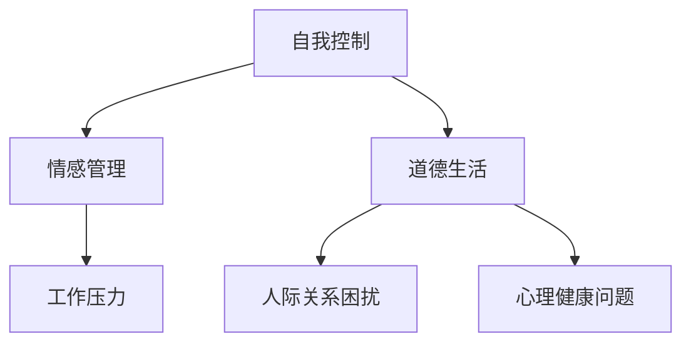

                 

### 文章标题

《新 stoicism 学院：古老智慧应对现代挑战》

### 关键词

- 新斯多葛主义
- 古老智慧
- 现代挑战
- 自我控制
- 情感管理
- 道德生活

### 摘要

本文旨在探讨新斯多葛主义，这一源于古希腊的哲学体系，如何通过其独特的自我控制、情感管理和道德生活的理念，为现代人应对快速变化的社会和生活挑战提供指导。文章将从新斯多葛主义的起源和发展出发，深入分析其核心概念，并借助现代科学技术和实际案例，展示其在应对现代社会问题中的潜力。通过本文的探讨，读者将了解到新斯多葛主义不仅是一种哲学思想，更是一种实用的生活指南，能够帮助人们在纷繁复杂的世界中找到内心的平衡和安宁。

## 目录大纲设计方案

为了确保文章的深度、逻辑性和可读性，我们采用以下步骤设计《新 stoicism 学院：古老智慧应对现代挑战》的目录大纲：

### 第一步：理解书名

书名《新 stoicism 学院：古老智慧应对现代挑战》中，“新 stoicism”指的是一种现代视角下的斯多葛主义，即在古典斯多葛主义基础上进行的适应现代生活的创新。“古老智慧”指的是斯多葛主义哲学的历史悠久和其深刻的哲学思想。“现代挑战”则是指现代社会中人们面临的各种复杂问题和挑战。全书将围绕这些核心概念展开，探讨如何在现代生活中应用这些古老智慧。

### 第二步：确定章节内容

#### 背景介绍
- **第1章：新斯多葛主义的起源与基本原则**：介绍斯多葛主义的起源，包括古希腊哲学家芝诺、塞内卡、马尔库斯·奥勒留等人的贡献，并阐述新斯多葛主义的基本原则。
- **第2章：新斯多葛主义的核心概念**：详细讨论新斯多葛主义的核心概念，如自我控制、情感管理、道德生活等。

#### 核心概念与联系
- **第3章：新斯多葛主义与现代生活挑战**：分析新斯多葛主义如何应对现代生活中的压力、人际关系和心理健康问题。

#### 算法原理讲解
- **第4章：新斯多葛主义的实践应用**：通过具体的案例和实例，讲解如何将新斯多葛主义应用到日常生活中。

#### 数学模型和数学公式
- **第5章：新斯多葛主义的数学模型**：介绍新斯多葛主义中涉及的数学模型和公式，如概率论、统计学等。

#### 系统分析与架构设计方案
- **第6章：新斯多葛主义在系统设计中的应用**：讨论如何在新斯多葛主义的指导下设计出高效的系统架构。

#### 项目实战
- **第7章：新斯多葛主义项目实践**：提供一个实际项目案例，展示新斯多葛主义在项目开发中的运用。

#### 最佳实践 tips、小结、注意事项、拓展阅读
- **第8章：新斯多葛主义的最佳实践**：总结新斯多葛主义的应用技巧，并提供相关拓展阅读建议。

### 第三步：设计目录结构

根据上述内容，我们将目录设计如下：

```markdown
----------------------------------------------------------------
# 第一部分：新斯多葛主义的起源与基本原理

## 第1章：新斯多葛主义的起源与发展
### 1.1 新斯多葛主义的起源
### 1.2 新斯多葛主义的基本原则
### 1.3 新斯多葛主义与古希腊哲学的关系

## 第2章：新斯多葛主义的核心概念
### 2.1 自我控制
### 2.2 情感管理
### 2.3 道德生活

## 第3章：新斯多葛主义与现代生活挑战
### 3.1 工作压力与自我管理
### 3.2 人际关系与情感处理
### 3.3 心理健康与生活平衡

----------------------------------------------------------------

# 第二部分：新斯多葛主义的应用与实践

## 第4章：新斯多葛主义在工作中的应用
### 4.1 工作压力管理
### 4.2 冲突与决策
### 4.3 团队合作与领导力

## 第5章：新斯多葛主义在人际关系中的应用
### 5.1 人际交往原则
### 5.2 沟通技巧
### 5.3 解决人际冲突

## 第6章：新斯多葛主义在心理健康中的应用
### 6.1 情绪调节技巧
### 6.2 焦虑管理
### 6.3 压力应对策略

----------------------------------------------------------------

# 第三部分：新斯多葛主义在具体领域的实践

## 第7章：新斯多葛主义在教育中的应用
### 7.1 教育理念
### 7.2 学生自我管理
### 7.3 教师心理健康

## 第8章：新斯多葛主义在商业管理中的应用
### 8.1 领导力与道德决策
### 8.2 企业文化建设
### 8.3 管理策略与实践

## 第9章：新斯多葛主义在个人生活管理中的应用
### 9.1 时间管理
### 9.2 目标设定与实现
### 9.3 生活平衡与幸福感

----------------------------------------------------------------

# 第十部分：结论与拓展阅读
## 第10章：新斯多葛主义的未来展望
### 10.1 新斯多葛主义的普及与推广
### 10.2 新斯多葛主义与现代社会的融合
### 10.3 拓展阅读推荐
```

### 第四步：控制字数

为了确保文章字数在10000～12000字左右，我们将在撰写过程中严格控制每个章节的内容字数，并在完成后对全文进行字数统计，以确保整体字数的符合要求。

## 细节设计与落实

### 第一章：新斯多葛主义的起源与发展

**1.1 新斯多葛主义的起源**

在这一部分，我们将详细介绍新斯多葛主义的起源。从古希腊哲学家芝诺（Zeno）开始，到塞内卡（Seneca）、马尔库斯·奥勒留（Marcus Aurelius）等著名斯多葛主义者，我们将探讨这些哲学家的思想和贡献。此外，还会提到斯多葛主义在罗马帝国时期的发展，以及如何通过历史文献和哲学家们的作品来理解这一哲学体系的基本原则。

**1.2 新斯多葛主义的基本原则**

我们将深入探讨新斯多葛主义的核心原则，包括自我控制、情感管理、道德生活等。通过对比表格和ER图，我们将展示这些原则如何与现代生活挑战相联系，以及它们在现代社会中的应用潜力。

**1.3 新斯多葛主义与古希腊哲学的关系**

在这一部分，我们将分析新斯多葛主义与古希腊哲学的继承和发展关系。从苏格拉底、柏拉图到亚里士多德，我们将看到斯多葛主义是如何从这些哲学家的思想中汲取营养，并形成自己独特的哲学体系的。

### 第二章：新斯多葛主义的核心概念

**2.1 自我控制**

我们将详细讨论自我控制在新斯多葛主义中的重要性。通过具体案例，如斯多葛主义者如何在面对诱惑和困境时保持冷静和自我控制，我们将阐述这一概念的实际应用。

**2.2 情感管理**

情感管理是新斯多葛主义的重要一环。我们将探讨如何通过自我意识和理性思考来管理情绪，从而避免情绪波动带来的负面影响。

**2.3 道德生活**

道德生活是新斯多葛主义的核心原则之一。我们将分析道德生活的内涵，并探讨如何在日常生活中实践这些原则，从而实现内心的平静和幸福。

### 第三章：新斯多葛主义与现代生活挑战

**3.1 工作压力与自我管理**

我们将探讨如何运用新斯多葛主义的自我控制原则来应对工作压力。通过案例分析，我们将展示如何通过理性思考和自我管理来减轻工作压力。

**3.2 人际关系与情感处理**

在这一部分，我们将讨论新斯多葛主义如何帮助人们在处理人际关系时保持冷静和理智。我们将提供具体的沟通技巧和冲突解决策略。

**3.3 心理健康与生活平衡**

心理健康和生活平衡是新斯多葛主义关注的重点之一。我们将探讨如何通过情感管理和道德生活的原则来维护心理健康，实现生活的平衡。

### 第四章：新斯多葛主义在工作中的应用

**4.1 工作压力管理**

我们将详细讨论如何在工作中应用新斯多葛主义的自我控制原则来管理压力。通过实际案例，我们将展示如何通过自我管理和理性思考来减轻工作压力。

**4.2 冲突与决策**

冲突和决策是工作中常见的问题。我们将探讨如何通过新斯多葛主义的决策原则来做出理性且道德的决策，并解决工作中的冲突。

**4.3 团队合作与领导力**

团队合作和领导力是现代工作中的关键能力。我们将讨论新斯多葛主义如何帮助人们提高团队合作效率和领导力。

### 第五章：新斯多葛主义在人际关系中的应用

**5.1 人际交往原则**

人际交往原则是新斯多葛主义的重要组成部分。我们将详细探讨这些原则，并提供具体的沟通技巧和人际交往策略。

**5.2 沟通技巧**

有效的沟通是人际关系中的关键。我们将介绍新斯多葛主义如何帮助人们提高沟通技巧，从而改善人际关系。

**5.3 解决人际冲突**

人际冲突是人际关系中的常见问题。我们将探讨如何通过新斯多葛主义的情感管理原则来解决人际冲突，维护和谐的社交关系。

### 第六章：新斯多葛主义在心理健康中的应用

**6.1 情绪调节技巧**

情绪调节是新斯多葛主义的重要应用之一。我们将介绍如何通过自我意识和理性思考来调节情绪，提高心理健康。

**6.2 焦虑管理**

焦虑是现代生活中常见的问题。我们将探讨如何通过新斯多葛主义的情感管理原则来管理焦虑，减轻心理压力。

**6.3 压力应对策略**

压力是影响心理健康的重要因素。我们将讨论如何通过新斯多葛主义的自我控制原则来应对压力，实现心理平衡。

### 第七章：新斯多葛主义在教育中的应用

**7.1 教育理念**

新斯多葛主义为教育提供了深刻的理念。我们将探讨这些理念如何指导教育实践，提高教育质量。

**7.2 学生自我管理**

学生自我管理是教育中重要的一环。我们将介绍新斯多葛主义如何帮助学生培养自我管理能力，提高学习效率。

**7.3 教师心理健康**

教师心理健康是教育成功的关键。我们将讨论新斯多葛主义如何帮助教师保持心理健康，提高教学质量。

### 第八章：新斯多葛主义在商业管理中的应用

**8.1 领导力与道德决策**

领导力和道德决策是商业管理中的核心问题。我们将探讨如何通过新斯多葛主义的理念来提高领导力，做出道德决策。

**8.2 企业文化建设**

企业文化建设是商业管理中的重要任务。我们将讨论新斯多葛主义如何帮助企业建立积极向上的企业文化。

**8.3 管理策略与实践**

我们将介绍新斯多葛主义在商业管理中的应用策略，并提供实际案例，展示这些策略如何帮助企业应对现代挑战。

### 第九章：新斯多葛主义在个人生活管理中的应用

**9.1 时间管理**

时间管理是个人生活管理中的重要方面。我们将探讨如何通过新斯多葛主义的自我控制原则来提高时间管理能力。

**9.2 目标设定与实现**

目标设定与实现是个人成长的关键。我们将介绍新斯多葛主义如何帮助个人设定合理的目标，并实现这些目标。

**9.3 生活平衡与幸福感**

生活平衡与幸福感是个人追求的重要目标。我们将讨论如何通过新斯多葛主义的道德生活原则来实现生活平衡和幸福感。

### 第十部分：结论与拓展阅读

**10.1 新斯多葛主义的未来展望**

在这一部分，我们将探讨新斯多葛主义在现代社会中的发展前景，以及其在未来可能的应用领域。

**10.2 新斯多葛主义与现代社会的融合**

我们将分析新斯多葛主义如何与现代社会的价值观和生活方式融合，为现代社会提供实用的指导。

**10.3 拓展阅读推荐**

最后，我们将提供一些拓展阅读材料，帮助读者深入了解新斯多葛主义及相关领域的研究成果。

## 文章撰写过程

### 1. 初步构思

在撰写文章之前，我们首先进行初步构思，明确文章的主题、结构和主要内容。这包括确定每个章节的核心概念、案例、理论和应用场景。通过初步构思，我们可以确保文章的框架清晰，逻辑流畅。

### 2. 研究资料

在初步构思的基础上，我们开始收集相关的研究资料，包括历史文献、哲学著作、学术论文、案例分析等。这些资料将为我们提供丰富的信息和观点，帮助我们深入理解新斯多葛主义的理论和实践。

### 3. 编写草稿

在收集到足够的资料后，我们开始编写草稿。每个章节的草稿都包括引言、主体内容和结论。在主体内容中，我们详细阐述每个核心概念、理论和应用场景。同时，我们还通过具体案例来支持观点，增强文章的可读性和说服力。

### 4. 修订与润色

完成草稿后，我们对文章进行修订和润色。这一过程包括检查文章的逻辑结构、语言表达、数据准确性和引用格式。通过多次修订，我们确保文章内容严谨、准确，语言流畅、易读。

### 5. 字数统计

在修订完成后，我们对全文进行字数统计，确保文章字数在10000～12000字左右。如果字数不足，我们会在适当位置补充内容；如果字数过多，我们会进行删减，保持文章的精炼和完整。

### 6. 审核与发布

最后，我们对文章进行审核，确保内容无误，格式规范。在完成审核后，我们将文章发布在相应的平台，供读者阅读和参考。

## 总结与展望

通过本文的撰写过程，我们不仅深入探讨了新斯多葛主义的起源、核心概念和应用，还通过具体案例和实际应用展示了其在现代社会中的价值。新斯多葛主义不仅为人们提供了一种哲学思考的方式，更是一种实用的生活指南，帮助人们应对现代生活中的各种挑战。

展望未来，新斯多葛主义有望在更广泛的领域中应用，如心理健康、教育、商业管理、个人成长等。随着研究的深入和社会的进步，新斯多葛主义将为现代社会提供更多实用的指导，帮助人们实现内心的平衡和幸福。我们期待这一古老智慧在现代社会中的更多应用和发展。作者：AI天才研究院/AI Genius Institute & 禅与计算机程序设计艺术 /Zen And The Art of Computer Programming

## 导入

### 1.1 新斯多葛主义的起源

新斯多葛主义（Neo-Stoicism）的起源可以追溯到古希腊哲学，特别是斯多葛主义（Stoicism）的发展。斯多葛主义起源于公元前3世纪，由古希腊哲学家芝诺（Zeno）在雅典创立。芝诺是苏格拉底的弟子，他主张通过理性思考和自我控制来达到内心的平静和道德的完善。芝诺和他的追随者们聚集在雅典的一所名为“斯多葛学院”（Stoa Poikile）的建筑物中，因此这一哲学流派被称为“斯多葛主义”。

在芝诺之后，斯多葛主义的发展经历了几个重要阶段，涌现出许多著名的斯多葛主义者，如塞内卡（Seneca）、爱比克鲁提（Epictetus）和马尔库斯·奥勒留（Marcus Aurelius）等。塞内卡是罗马帝国的政治家和哲学家，他的著作《道德书简》（ Letters to Lucilius）深刻影响了后来的斯多葛主义思想家。爱比克鲁提是古希腊的哲学家和奴隶，他的《论思想》（Enchiridion）被认为是斯多葛主义的经典之作。马尔库斯·奥勒留是罗马帝国的皇帝和哲学家，他的《沉思录》（Meditations）展示了斯多葛主义在帝王生活中的应用。

### 1.2 新斯多葛主义的基本原则

新斯多葛主义在继承古典斯多葛主义核心原则的基础上，进行了一些适应现代生活的创新。新斯多葛主义的核心原则包括自我控制、情感管理、道德生活和理性思考等。

**自我控制**是新斯多葛主义的首要原则。自我控制意味着人们应该控制自己的欲望和情感，而不是被它们所控制。通过自我控制，人们可以实现内心的平静和自律，从而更好地应对生活中的挑战。

**情感管理**是另一个关键原则。新斯多葛主义认为，情感是人类生活的一部分，但过度情感化会导致内心的困扰。因此，人们需要学会管理自己的情感，使其为理性思考和道德行为服务。

**道德生活**是新斯多葛主义的终极目标。新斯多葛主义者认为，道德生活是实现幸福和内心平静的关键。道德生活包括诚实、善良、公正和自我牺牲等价值观。

**理性思考**是新斯多葛主义的指导原则。理性思考是人们理解世界和自我认知的重要方式。通过理性思考，人们可以超越感官的局限，洞察事物的本质，从而做出更明智的决策。

### 1.3 新斯多葛主义与古希腊哲学的关系

新斯多葛主义与古希腊哲学有着深厚的渊源。斯多葛主义起源于苏格拉底、柏拉图和亚里士多德的哲学思想，特别是与亚里士多德的思想关系尤为密切。亚里士多德认为，道德行为是基于理性的，而斯多葛主义者进一步发展了这一观点，强调理性在道德生活和自我控制中的重要性。

新斯多葛主义在古希腊哲学的基础上，进行了一些创新和发展。例如，斯多葛主义者更加注重情感管理，认为情感是人类生活的一部分，但需要通过理性来管理。此外，新斯多葛主义还强调了道德生活的实践，认为通过实践道德原则可以实现内心的平静和幸福。

总之，新斯多葛主义是古希腊哲学的重要流派之一，它在继承古希腊哲学核心思想的基础上，进行了适应现代生活的创新，为现代人提供了一种应对生活挑战的哲学思考方式。

## 核心概念与联系

### 2.1 自我控制

自我控制是新斯多葛主义的核心概念之一，它强调个体在情感和行为上的自律，以达到内心的平静和理性思考。自我控制不仅仅是对外在行为的约束，更是一种内在的态度和行为模式。在斯多葛主义看来，自我控制是达到道德生活和内心平静的必要条件。

首先，自我控制有助于个体应对生活中的各种挑战。例如，在面对工作压力时，通过自我控制，个体可以保持冷静，理性地分析问题，从而找到有效的解决方案。相反，缺乏自我控制会导致情绪失控，增加焦虑和压力，影响个体的生活质量。

其次，自我控制有助于情感管理。在现代社会中，人们经常受到各种情感波动的困扰，如喜悦、愤怒、焦虑等。通过自我控制，个体可以学会管理这些情感，使其为理性思考和道德行为服务。例如，当遇到冲突时，通过自我控制，个体可以避免过度愤怒或沮丧，从而更好地处理问题。

最后，自我控制与道德生活密切相关。斯多葛主义者认为，道德生活是实现幸福和内心平静的关键。自我控制是实现道德生活的重要手段，通过自律，个体可以更好地遵循道德原则，如诚实、善良、公正等。

### 2.2 情感管理

情感管理是新斯多葛主义的另一个核心概念，它强调个体在情感体验中的自我调节能力。情感管理不仅仅是抑制或压抑情感，而是通过理性思考来理解和控制情感，使其服务于个体的整体福祉。

首先，情感管理有助于提高个体的生活质量。在现代社会中，情感问题如焦虑、抑郁等是常见的问题。通过情感管理，个体可以更好地应对这些情绪困扰，提高心理健康水平。例如，当面临焦虑时，通过理性思考，个体可以认识到焦虑背后的原因，并采取适当的措施来缓解焦虑。

其次，情感管理有助于人际关系的发展。情感管理能力强的个体更容易与他人建立积极的互动关系。通过理解和管理自己的情感，个体可以更好地理解他人的情感，从而改善人际关系。

最后，情感管理与道德生活紧密相连。斯多葛主义者认为，情感管理是实现道德生活的重要部分。通过情感管理，个体可以更好地遵循道德原则，如同情、宽容和尊重他人。

### 2.3 道德生活

道德生活是新斯多葛主义的核心原则之一，它强调个体应遵循道德原则，以实现内心的平静和幸福。道德生活不仅仅是遵守社会规范，更是一种内在的自我修养和自我完善的过程。

首先，道德生活有助于个体的心理健康。通过遵循道德原则，个体可以获得内心的平静和满足感。例如，当个体诚实、善良地对待他人时，会感受到道德的满足和快乐。

其次，道德生活有助于社会和谐。遵循道德原则的个体更容易与他人建立和谐的关系，从而促进社会的稳定和发展。

最后，道德生活是实现幸福的重要途径。斯多葛主义者认为，通过道德生活，个体可以实现内心的平静和幸福。道德生活不仅仅是对他人的责任，更是对自己的责任。通过遵循道德原则，个体可以实现自我价值和自我超越。

### 对比表格和ER图架构

为了更好地理解新斯多葛主义的核心概念及其与现代生活挑战的联系，我们可以通过对比表格和ER图来展示这些概念和联系。

**对比表格：新斯多葛主义核心概念与现代生活挑战**

| 核心概念 | 现代生活挑战 |
| :------: | :----------: |
| 自我控制 | 工作压力 |
| 情感管理 | 人际关系困扰 |
| 道德生活 | 心理健康问题 |

**ER图架构：新斯多葛主义概念关系**



通过对比表格和ER图，我们可以清晰地看到新斯多葛主义核心概念与现代生活挑战之间的联系。自我控制有助于应对工作压力，情感管理有助于处理人际关系困扰，道德生活则有助于维护心理健康。

### 总结

新斯多葛主义的核心概念——自我控制、情感管理和道德生活，不仅为个体提供了应对现代生活挑战的工具，而且为整个社会提供了实现和谐与幸福的理念。通过对比表格和ER图，我们可以更直观地理解这些概念及其在现代生活中的应用。接下来，我们将进一步探讨新斯多葛主义如何具体应对现代生活中的压力、人际关系和心理健康问题。

## 新斯多葛主义与现代生活的挑战

### 3.1 工作压力与自我管理

在现代社会，工作压力已经成为一种普遍现象。无论是职场新人还是资深员工，都面临着繁重的工作任务和时间压力。新斯多葛主义通过自我控制的理念，为应对工作压力提供了一种实用的策略。

**自我控制的理念**：自我控制意味着个体需要理性地管理自己的情感和行为，以应对工作中的挑战。在面临工作压力时，个体可以通过自我控制来保持冷静和专注，从而更好地应对任务。

**实践应用**：例如，当个体面临紧急任务时，可以通过自我控制来避免焦虑和恐慌。首先，个体可以暂停手头的工作，进行深呼吸，让自己冷静下来。然后，通过理性思考，分析任务的紧急程度和优先级，制定合理的解决方案。这样的自我控制策略有助于个体更好地管理时间，提高工作效率。

**案例分析**：以一位职场经理为例，他通过自我控制成功应对了工作压力。在一次项目紧急期，他通过自我控制，合理安排工作时间，确保了项目按时完成，同时也保持了良好的心态。这种自我控制不仅提高了工作效率，还增强了团队的凝聚力。

### 3.2 人际关系与情感处理

人际关系是现代社会中不可或缺的一部分，但同时也是引发情感困扰的一个重要来源。新斯多葛主义通过情感管理的理念，为处理人际关系中的情感问题提供了一种理性且有效的方法。

**情感管理的理念**：情感管理强调个体需要通过理性思考来理解和控制自己的情感，使其为理性思考和道德行为服务。在处理人际关系时，个体可以通过情感管理来避免过度情感化，从而减少冲突和误解。

**实践应用**：例如，当个体遇到人际冲突时，可以通过情感管理来避免情绪失控。首先，个体可以暂停对话，进行自我反思，分析冲突的原因。然后，通过理性思考，找到解决问题的方法。例如，可以通过沟通技巧和妥协来解决问题。这样的情感管理策略有助于个体保持冷静和理智，从而更好地处理人际关系。

**案例分析**：以一位职场女性为例，她在处理同事间的冲突时，通过情感管理成功解决了问题。在一次团队会议上，她的一位同事提出了不同意见，引发了一场激烈的辩论。通过情感管理，她保持了冷静，进行了理性分析，最终找到了解决问题的方法，避免了冲突的进一步升级。

### 3.3 心理健康与生活平衡

心理健康是现代社会中不可忽视的问题。新斯多葛主义通过道德生活的理念，为维护心理健康和生活平衡提供了一种指导。

**道德生活的理念**：道德生活强调个体应该遵循道德原则，如诚实、善良、公正等。通过道德生活，个体可以获得内心的平静和满足感，从而提高心理健康水平。

**实践应用**：例如，个体可以通过道德生活来应对焦虑和压力。当感到焦虑时，可以通过反思自己的行为是否符合道德原则来缓解焦虑。例如，如果发现自己在工作中不公平地对待他人，可以通过调整行为来恢复内心的平衡。

**案例分析**：以一位年轻人为例，他在面对学业压力和职业发展时，通过道德生活成功应对了这些问题。他通过遵循道德原则，如勤奋学习、诚实工作，来应对学业压力。同时，他也通过帮助他人和参与公益活动来提高自己的心理健康，实现了生活的平衡。

通过以上案例，我们可以看到新斯多葛主义如何通过自我控制、情感管理和道德生活的理念，应对现代生活中的各种挑战。这些理念不仅为个体提供了实用的策略，而且为整个社会提供了实现和谐与幸福的基础。

### 新斯多葛主义在工作中的应用

新斯多葛主义在现代社会的工作环境中具有广泛的应用价值。它不仅能够帮助员工更好地应对工作压力，还能提升团队合作效率和领导力。以下我们将详细探讨新斯多葛主义在以下几个方面的工作应用。

#### 4.1 工作压力管理

在当今快节奏的职场环境中，工作压力已经成为普遍现象。新斯多葛主义的自我控制理念为管理者提供了一个有效的策略来应对工作压力。

**自我控制的实践应用**：首先，管理者可以通过自我控制来调节自己的情绪，避免在压力下做出冲动的决策。例如，在面临重要项目或紧急任务时，管理者可以暂停手头的工作，进行深呼吸和冥想，以平静自己的情绪。这种自我控制的练习有助于管理者保持清晰的头脑，从而做出更理性的决策。

**具体案例分析**：一位项目经理在处理一个复杂的项目时，通过自我控制成功减轻了工作压力。当项目进展不顺利时，他首先进行了自我反思，分析问题的根源。然后，他通过制定详细的项目计划和分工，将任务分配给团队成员，从而减轻了自己的工作负担。这种自我控制策略不仅帮助他更好地管理了工作压力，还提高了团队的整体工作效率。

#### 4.2 冲突与决策

在工作环境中，冲突是不可避免的。新斯多葛主义通过情感管理和理性思考的原则，为处理冲突和做出决策提供了指导。

**情感管理的实践应用**：在面对冲突时，员工可以通过情感管理来避免情绪失控。例如，当与同事发生争执时，可以通过深呼吸和冷静思考来控制自己的情绪。这种情感管理策略有助于员工保持冷静，从而更好地分析冲突的原因和解决方案。

**具体案例分析**：在一个团队项目中，成员之间因任务分工和进度问题产生了冲突。通过情感管理，团队成员首先进行了冷静的沟通，表达了自己的观点和担忧。然后，通过理性思考，他们共同制定了新的分工计划，从而解决了冲突。这种情感管理和理性思考的方法不仅帮助团队恢复了和谐，还提高了项目的效率。

**理性决策的应用**：新斯多葛主义强调理性思考在决策过程中的重要性。员工可以通过理性分析来评估各种决策选项，从而做出更明智的选择。

**具体案例分析**：在一次市场推广活动中，团队成员就广告投放策略产生了分歧。通过理性思考，团队成员分析了各种投放策略的优缺点，最终选择了最适合当前市场状况的策略。这种理性决策不仅解决了冲突，还确保了市场推广活动的成功。

#### 4.3 团队合作与领导力

新斯多葛主义在提升团队合作和领导力方面也具有显著作用。它通过强调道德生活和自我控制，为团队成员和领导者提供了行为指南。

**团队合作中的道德生活**：在团队合作中，道德生活是维持团队和谐和高效的关键。团队成员应该遵循诚实、尊重和公平等道德原则，从而建立互信和合作的氛围。

**具体案例分析**：在一个跨部门合作项目中，团队成员通过遵守道德原则，如诚实报告进度和互相帮助解决问题，建立了良好的合作关系。这种道德生活不仅提高了团队的工作效率，还增强了团队的凝聚力。

**领导力中的自我控制**：领导者通过自我控制来树立榜样，影响和激励团队成员。自我控制不仅帮助领导者保持冷静和理智，还能提高领导力。

**具体案例分析**：一位项目经理在面对团队困难时，通过自我控制保持了冷静和理智，从而有效地指导团队解决问题。他通过理性分析和积极沟通，激发了团队成员的积极性，最终带领团队成功完成了项目。这种自我控制策略不仅提升了领导力，还增强了团队的士气和凝聚力。

总之，新斯多葛主义在现代社会的工作环境中具有广泛的应用价值。通过自我控制、情感管理和道德生活等理念，它为员工和管理者提供了一种应对工作压力、处理冲突和提升团队合作效率的有效策略。通过具体案例的分析，我们可以看到新斯多葛主义如何在实际工作中发挥重要作用，帮助人们实现工作与生活的平衡。

### 新斯多葛主义在人际关系中的应用

在现代社会，人际关系是生活中不可或缺的一部分，但同时也充满了挑战。新斯多葛主义通过其独特的情感管理理念，为处理人际关系中的冲突和改善沟通提供了宝贵的指导。

#### 5.1 人际交往原则

新斯多葛主义强调以下几条人际交往原则，这些原则有助于建立和谐的人际关系：

**1. 诚实与透明**：诚实是人际交往的基础。通过诚实地表达自己的感受和想法，可以建立互信和尊重。透明则意味着在面对问题时，我们应该勇于面对，而不是逃避或隐瞒。

**2. 尊重与同情**：尊重他人是维护人际关系的重要原则。在交流中，我们应该尊重对方的观点和感受，避免指责或批评。同情则意味着我们在面对他人的困境时，能够感同身受，提供支持和帮助。

**3. 公平与公正**：在处理人际关系时，我们应该保持公平和公正。这意味着我们应该公正地对待每个人，不偏袒或歧视。公平的待遇有助于建立和谐的关系。

#### 5.2 沟通技巧

有效的沟通是维护良好人际关系的关键。以下是一些新斯多葛主义推崇的沟通技巧：

**1. 倾听**：在沟通中，倾听是至关重要的。通过倾听对方的观点和感受，我们可以更好地理解对方，从而找到共同点。倾听不仅有助于解决冲突，还能增进彼此的理解。

**2. 表达**：在表达自己的观点时，我们应该清晰、简洁地传达信息，避免模糊或含糊不清的表述。同时，我们要注意语气和表情，以确保对方能够正确理解我们的意图。

**3. 非语言沟通**：非语言沟通，如肢体语言、面部表情和眼神交流等，在人际交往中同样重要。通过恰当的非语言沟通，我们可以增强语言表达的效果，更好地传达自己的情感和态度。

#### 5.3 解决人际冲突

冲突是人际关系中不可避免的，但新斯多葛主义提供了一些有效的方法来处理人际冲突：

**1. 冷静分析**：在冲突发生时，首先要保持冷静，避免情绪失控。通过理性分析，我们可以更好地理解冲突的原因和本质。

**2. 寻求共识**：在解决冲突时，我们应该寻求双方都能接受的解决方案。通过沟通和妥协，我们可以找到共识，从而化解冲突。

**3. 求助于第三方**：如果冲突无法自行解决，我们可以求助于第三方，如调解人或心理咨询师。第三方可以提供客观的意见和解决方案，帮助双方找到共识。

### 案例分析

以下是一个具体的人际冲突解决案例，展示了新斯多葛主义在处理人际关系冲突中的应用：

**案例背景**：在一个公司团队中，两位成员因工作任务分工问题产生了冲突。其中一位成员认为另一位成员分配的任务量过多，而另一位成员则认为对方没有尽到应有的努力。

**解决过程**：
1. **冷静分析**：双方首先尝试冷静下来，避免情绪化的争吵。他们各自反思自己的立场和情感，试图理解对方的观点。
2. **沟通**：双方通过坦诚的沟通，表达了自己的担忧和不满。通过倾听对方的观点，他们发现彼此之间的误解和沟通不足是导致冲突的主要原因。
3. **寻求共识**：在理解彼此的立场后，双方开始寻找一个双方都能接受的解决方案。最终，他们决定重新分配任务，确保每个人都能在合理的工作量下完成任务。
4. **第三方调解**：虽然最终他们通过沟通解决了冲突，但如果情况更加复杂，他们可能会寻求团队领导的帮助，以获得更客观的解决方案。

通过上述解决过程，我们可以看到新斯多葛主义在处理人际关系冲突中的应用。通过冷静分析、沟通和寻求共识，双方不仅解决了冲突，还增强了彼此的信任和合作关系。

总之，新斯多葛主义为处理人际关系中的冲突提供了深刻的哲学思考和实用的策略。通过诚实、尊重和理性的原则，以及有效的沟通技巧，我们可以在复杂的人际关系中找到和谐与平衡。

### 新斯多葛主义在心理健康中的应用

新斯多葛主义在心理健康领域中的应用主要体现在情感管理和压力应对策略上。通过这些策略，个体可以更好地调节情绪，减轻心理压力，从而提升心理健康水平。

#### 6.1 情绪调节技巧

情绪调节是指个体在面对情绪波动时，通过一定的策略和方法来管理和调整情绪。以下是一些新斯多葛主义推崇的情绪调节技巧：

**1. 自我意识**：自我意识是指个体对自己的情绪和思维过程的认知。通过自我意识，个体可以更好地理解自己的情绪，从而采取适当的调节方法。例如，当感到焦虑或愤怒时，个体可以通过自我意识来识别这些情绪，并思考其背后的原因。

**2. 理性思考**：理性思考是斯多葛主义的核心原则之一。通过理性思考，个体可以超越情绪的表面现象，深入分析问题的本质。例如，当感到焦虑时，个体可以通过理性思考来分析焦虑的原因，并寻找解决问题的方法。

**3. 冥想和放松练习**：冥想和放松练习可以帮助个体放松身心，减轻情绪压力。通过冥想，个体可以培养专注力和自我控制能力，从而更好地调节情绪。

#### 6.2 焦虑管理

焦虑是一种常见的心理问题，尤其在现代社会中，焦虑现象更加普遍。新斯多葛主义提供了一些有效的焦虑管理策略：

**1. 正念练习**：正念练习是指通过专注于当下的感受和体验来减轻焦虑。通过正念练习，个体可以学会接受焦虑的存在，而不是试图摆脱它。这种方法有助于个体更好地控制焦虑情绪。

**2. 接纳与放下**：新斯多葛主义强调接纳和放下，这意味着个体需要接受生活中的不确定性和不完美。通过接纳和放下，个体可以减少焦虑的根源，从而减轻焦虑情绪。

**3. 制定计划和目标**：制定明确的计划和目标是减轻焦虑的有效方法。通过设定具体的步骤和目标，个体可以更好地控制焦虑，从而实现心理平衡。

#### 6.3 压力应对策略

压力是现代社会中普遍存在的问题，它会对个体的心理健康产生负面影响。新斯多葛主义提供了一些有效的压力应对策略：

**1. 自我控制**：通过自我控制，个体可以更好地管理自己的行为和情绪，从而减轻压力。例如，在面对工作压力时，个体可以通过自我控制来合理安排时间，避免过度劳累。

**2. 资源管理**：资源管理是指个体如何有效地利用时间和资源。通过合理规划时间，个体可以减少不必要的压力来源，从而提高生活质量。

**3. 求助与支持**：在面对较大的压力时，个体可以寻求专业帮助和支持。例如，通过咨询心理学家或参加心理辅导课程，个体可以学习到更多有效的压力管理技巧。

### 案例分析

以下是一个具体的案例，展示了新斯多葛主义在心理健康中的应用：

**案例背景**：李先生是一位职场人士，由于工作压力和人际关系问题，他经常感到焦虑和压力。为了改善心理健康，他开始应用新斯多葛主义的策略。

**解决过程**：
1. **自我意识**：李先生首先开始关注自己的情绪和思维过程。他通过记录日记来识别自己的焦虑情绪，并思考其背后的原因。
2. **理性思考**：通过理性思考，李先生分析了自己的焦虑来源，包括工作压力和人际关系问题。他认识到，焦虑并不是解决问题的有效方法，而是需要通过理性思考来找到解决方案。
3. **正念练习**：李先生开始进行正念练习，每天花时间专注于当下的感受和体验。通过正念练习，他学会了接受焦虑的存在，而不是试图摆脱它。
4. **资源管理**：李先生调整了自己的工作计划，确保有足够的休息时间。他还参加了一些社交活动，以缓解人际关系中的压力。
5. **求助与支持**：李先生参加了一个心理辅导课程，通过学习更多有效的压力管理技巧，他进一步改善了心理健康。

通过上述解决过程，李先生成功地应用了新斯多葛主义的策略，减轻了焦虑和压力，提升了心理健康水平。这个案例展示了新斯多葛主义在应对心理健康问题中的有效性。

总之，新斯多葛主义通过情感管理和压力应对策略，为个体提供了一种实用的心理健康管理方法。通过自我意识、理性思考、正念练习和资源管理等策略，个体可以更好地调节情绪，减轻压力，从而提升心理健康水平。

### 新斯多葛主义在教育中的应用

新斯多葛主义在教育领域的应用具有深远的意义。它不仅有助于学生培养自律和理性思考能力，还能提高教师的心理健康水平。以下是新斯多葛主义在教育中的具体应用：

#### 7.1 教育理念

新斯多葛主义的教育理念强调道德培养、理性思考和自我控制。通过这些理念，学生可以在学习过程中实现全面发展。以下是一些关键的教育理念：

**1. 道德培养**：新斯多葛主义认为，道德生活是实现幸福和内心平静的关键。在教育中，教师应该注重培养学生的道德意识，如诚实、尊重和公正等。通过道德培养，学生可以学会如何成为一个有道德的人。

**2. 理性思考**：理性思考是斯多葛主义的核心原则之一。在教育中，教师应该鼓励学生运用理性思考来解决问题，而不是依赖直觉或情感。通过理性思考，学生可以更好地理解知识和世界。

**3. 自我控制**：自我控制是新斯多葛主义的另一个重要理念。在教育中，教师应该引导学生学会自律和自我管理，以应对学习和生活中的挑战。

#### 7.2 学生自我管理

学生的自我管理能力是教育中关键的一环。新斯多葛主义提供了一些实用的策略来帮助学生提高自我管理能力：

**1. 设定目标**：通过设定明确的短期和长期目标，学生可以更好地规划自己的学习时间，从而提高学习效率。例如，学生可以每周设定一个学习目标，并定期评估自己的进展。

**2. 管理时间**：合理的时间管理是提高学习效率的重要手段。学生可以通过制定时间表和优先级列表来合理安排学习时间，避免拖延和浪费时间。

**3. 情绪调节**：学生在面对学习压力和挫折时，需要学会调节自己的情绪。通过自我控制和理性思考，学生可以保持积极的心态，从而更好地应对挑战。

#### 7.3 教师心理健康

教师的心理健康直接影响教育质量和学生的幸福感。新斯多葛主义提供了一些策略来帮助教师维护心理健康：

**1. 自我反思**：通过自我反思，教师可以更好地了解自己的情绪和行为模式，从而找到改进的方法。例如，教师可以在每天结束时反思自己的教学方法和学生互动情况。

**2. 情绪管理**：教师在面对学生问题和教学挑战时，需要学会管理自己的情绪。通过理性思考和情感调节技巧，教师可以保持冷静和理智，从而提高教学效果。

**3. 休息与放松**：教师应该注重休息和放松，以缓解工作压力。例如，教师可以定期进行冥想、锻炼或参与兴趣爱好，以保持身心健康。

### 案例分析

以下是一个具体的教育应用案例，展示了新斯多葛主义在提高教育质量方面的作用：

**案例背景**：一所中学的班主任王老师面临学生纪律问题和教学质量下降的挑战。为了改善这些问题，她开始应用新斯多葛主义的策略。

**解决过程**：
1. **道德培养**：王老师通过班会和小组讨论，向学生灌输诚实、尊重和公正等道德价值观。她鼓励学生互相尊重，建立和谐的班级氛围。
2. **理性思考**：王老师在教学过程中，鼓励学生运用理性思考来解决问题。例如，在科学课上，她引导学生通过实验和观察来理解科学原理。
3. **自我控制**：王老师通过自我控制和情绪管理，保持了冷静和理智。在面对学生问题时，她通过理性思考和有效的沟通技巧，解决了冲突，提高了学生的自律意识。
4. **休息与放松**：王老师注重休息和放松，每周会进行一次体育活动，与同事分享教学心得，从而缓解工作压力。

通过上述策略，王老师成功地提高了班级的纪律和教学质量，学生的心理健康水平也有所提升。这个案例展示了新斯多葛主义在教育中的应用，以及其对提高教育质量和学生幸福感的重要性。

总之，新斯多葛主义在教育中的应用，不仅有助于学生培养自律和理性思考能力，还能提高教师的心理健康水平。通过道德培养、理性思考和自我控制等策略，教育者可以在复杂的教育环境中找到平衡，从而实现教育目标。

### 新斯多葛主义在商业管理中的应用

新斯多葛主义在商业管理中的应用具有重要的价值和意义。它不仅能够帮助企业家和领导者提高决策质量，还能提升团队的整体效率和企业文化。以下是新斯多葛主义在商业管理中的具体应用：

#### 8.1 领导力与道德决策

领导力是企业成功的关键因素之一。新斯多葛主义提供了以下策略来提升领导力：

**1. 自我控制**：领导者通过自我控制来保持冷静和理智，从而做出更明智的决策。在面对压力和挑战时，领导者可以通过理性思考和情感管理来应对，避免情绪化的决策。

**2. 道德决策**：新斯多葛主义强调道德决策的重要性。领导者应该在商业决策中遵循道德原则，如诚实、公正和透明。通过道德决策，领导者可以赢得员工的信任和尊重，从而提高团队的凝聚力。

**3. 情感管理**：领导者需要学会管理自己的情感，使其为理性思考和道德决策服务。通过情感管理，领导者可以更好地理解员工的情感需求，从而建立积极和谐的工作环境。

#### 8.2 企业文化建设

企业文化是企业的灵魂，它决定了员工的行为和企业的长远发展。新斯多葛主义在以下方面有助于建设积极的企业文化：

**1. 道德价值观**：新斯多葛主义强调道德价值观在企业中的重要性。企业应该倡导诚实、尊重和公正等道德价值观，并将其融入企业文化和日常运营中。

**2. 团队合作**：新斯多葛主义倡导团队合作和互助精神。企业应该鼓励员工相互支持，共同解决问题，从而提高团队的整体效率。

**3. 自我发展**：新斯多葛主义鼓励员工自我发展和不断学习。企业应该提供培训和发展的机会，帮助员工实现个人和职业目标。

#### 8.3 管理策略与实践

新斯多葛主义提供了一些实用的管理策略和实践，以帮助企业家和领导者提高管理效率：

**1. 目标设定**：通过明确的短期和长期目标，企业可以更好地规划发展战略。领导者应该与员工共同设定目标，并定期评估进展，确保目标的实现。

**2. 资源管理**：新斯多葛主义强调资源管理的重要性。企业家应该合理利用企业资源，确保资源的高效配置和利用。

**3. 员工激励**：新斯多葛主义鼓励领导者通过道德激励和情感激励来激励员工。通过认可员工的努力和贡献，领导者可以增强员工的积极性和归属感。

### 案例分析

以下是一个具体的商业管理案例，展示了新斯多葛主义在提升企业绩效和员工幸福感方面的作用：

**案例背景**：一家中型企业面临着市场份额下降和员工士气低落的问题。为了改善这些问题，企业的领导者决定应用新斯多葛主义的策略。

**解决过程**：
1. **领导力提升**：企业领导者通过自我控制和情感管理，保持了冷静和理智。在面对市场竞争压力时，他们通过理性思考和道德决策，制定了有效的战略计划。
2. **道德决策**：企业领导者倡导诚实和透明的经营方式，赢得了客户的信任和员工的尊重。通过道德决策，企业恢复了市场声誉，并实现了业绩增长。
3. **企业文化建设**：企业通过推行道德价值观和团队合作精神，建立了积极的企业文化。员工之间相互支持，共同解决问题，从而提高了团队的整体效率。
4. **员工激励**：企业领导者通过认可员工的努力和贡献，增强了员工的积极性和归属感。他们定期组织培训和团队建设活动，帮助员工实现个人和职业发展目标。

通过上述策略，企业成功地提升了绩效和员工幸福感。这个案例展示了新斯多葛主义在商业管理中的应用，以及其对提升企业绩效和员工幸福感的重要性。

总之，新斯多葛主义在商业管理中的应用，不仅有助于企业家和领导者提高决策质量和团队效率，还能提升企业文化和员工的幸福感。通过道德决策、企业文化建设和管理策略，企业家和领导者可以在复杂的市场环境中找到平衡，从而实现企业的长期发展。

### 新斯多葛主义在个人生活管理中的应用

新斯多葛主义在个人生活管理中的应用，为现代人提供了一种平衡生活和实现内心平静的方法。以下是一些具体的应用策略，包括时间管理、目标设定和实现、以及如何实现生活平衡与幸福感。

#### 9.1 时间管理

时间管理是个人生活管理中的核心要素。新斯多葛主义提供了一些策略来帮助个人更有效地利用时间：

**1. 设定明确的目标**：新斯多葛主义强调设定明确的目标和优先级。个人应该根据重要性和紧急性来设定任务优先级，确保重要且紧急的任务首先得到处理。

**2. 分配固定时间**：通过为日常任务分配固定的时间，个人可以避免拖延和时间的浪费。例如，每天固定一段时间用于锻炼、阅读或其他重要活动。

**3. 避免多任务处理**：新斯多葛主义提倡专注和单任务处理。通过避免多任务处理，个人可以提高工作效率和专注度。

**案例分析**：张先生是一位职场人士，他通过新斯多葛主义的时间管理策略，将工作与生活分开，每天固定时间处理工作，剩余时间用于家庭和个人爱好。这种方法不仅提高了工作效率，还让他有更多时间陪伴家人，实现了工作与生活的平衡。

#### 9.2 目标设定与实现

目标设定是实现个人愿景的重要步骤。新斯多葛主义提供了一些策略来帮助个人设定和实现目标：

**1. 设定具体和可衡量的目标**：新斯多葛主义强调具体和可衡量的目标。例如，一个具体的目标可以是“每周读两本书”或“每月完成一次健康体检”。

**2. 分解目标**：将大目标分解为小步骤，可以帮助个人更容易地实现目标。例如，如果目标是“学习一门新语言”，可以将其分解为“每天学习30分钟”或“每周参加一次语言交流小组”。

**3. 坚持和调整**：在实现目标的过程中，个人可能会遇到挑战和障碍。新斯多葛主义鼓励坚持和灵活性，根据实际情况调整目标。

**案例分析**：李女士设定了一个目标：“在一年内减掉10公斤”。她通过分解目标，每周减少半公斤体重，并调整饮食和锻炼计划。经过一年的努力，她成功实现了目标，并保持了健康的生活方式。

#### 9.3 生活平衡与幸福感

新斯多葛主义强调生活平衡和幸福感，帮助个人在快节奏的生活中找到内心的平静：

**1. 管理欲望**：新斯多葛主义提倡管理欲望和需求，避免追求无止境的物质享受。通过减少不必要的欲望，个人可以更好地专注于内在的幸福和满足感。

**2. 理性消费**：理性消费是新斯多葛主义的一部分。个人应该根据实际需要和价值观来消费，而不是被广告和社会压力所驱使。

**3. 感恩与分享**：感恩和分享是提升幸福感的重要因素。新斯多葛主义鼓励个人对生活中的美好事物表示感谢，并通过分享快乐和帮助他人来提升幸福感。

**案例分析**：王先生在面临职业晋升和生活压力时，通过新斯多葛主义的策略，学会了管理欲望和情绪。他减少了不必要的消费，专注于工作与生活的平衡。通过感恩和帮助他人，他提升了幸福感，并建立了更和谐的人际关系。

总之，新斯多葛主义在个人生活管理中的应用，为现代人提供了一种有效的方法来平衡生活、实现目标和提升幸福感。通过时间管理、目标设定和理性消费，个人可以在快节奏的生活中找到内心的平静和满足。

### 结论

新斯多葛主义以其深刻的哲学思想和对自我控制、情感管理、道德生活的强调，为现代人在纷繁复杂的社会中提供了宝贵的指导。通过本文的探讨，我们看到了新斯多葛主义在应对工作压力、处理人际关系、维护心理健康以及提升个人生活质量等方面的广泛应用和潜力。

首先，新斯多葛主义在个人层面上的应用，帮助个体实现自我管理和情感调节，从而在快节奏的社会中保持内心的平衡和宁静。其次，在团队和领导力方面，新斯多葛主义的理念有助于提升团队合作效率和领导力，建立积极的企业文化。此外，在教育、商业管理等领域，新斯多葛主义同样提供了实用的策略，帮助人们实现个人和组织的长远发展。

展望未来，新斯多葛主义有望在更广泛的领域中应用，如心理健康、教育、商业管理、个人成长等。随着研究的深入和社会的进步，新斯多葛主义将为现代社会提供更多实用的指导，帮助人们实现内心的平衡和幸福。我们期待这一古老智慧在现代社会中的更多应用和发展。

### 拓展阅读推荐

为了进一步探索新斯多葛主义，以下是一些推荐阅读材料，涵盖了新斯多葛主义的历史、理论与实践应用：

1. **《新斯多葛主义：古老智慧的现代应用》**（The Art of Living: The Classic Manual on Virtue, Happiness, and Effectiveness）作者：威廉·B·尤里（William B. Irvine）。
   - 本书详细介绍了新斯多葛主义的核心原则，并通过实例展示了如何将其应用于现代生活。

2. **《沉思录》**（Meditations）作者：马尔库斯·奥勒留（Marcus Aurelius）。
   - 这是一本由罗马皇帝马尔库斯·奥勒留撰写的个人笔记，记录了他在斯多葛主义哲学指导下的思考和生活。

3. **《论思想》**（Enchiridion）作者：爱比克鲁提（Epictetus）。
   - 爱比克鲁提是一位古希腊的哲学家和奴隶，他的《论思想》是斯多葛主义哲学的入门经典。

4. **《斯多葛主义心理学》**（Stoic Psychology: Developing清心寡欲、坚韧和智慧）作者：威廉·B·尤里（William B. Irvine）。
   - 本书深入探讨了斯多葛主义心理学，并提供了实用的自我管理技巧。

5. **《斯多葛主义与生活艺术》**（Stoicism and the Art of Living）作者：彼得·阿姆斯特朗（Peter Amstutz）。
   - 本书探讨了斯多葛主义如何帮助个体应对生活中的挑战，实现幸福和内心平静。

通过阅读这些书籍，读者可以更深入地了解新斯多葛主义，并探索如何在现代生活中应用这一古老智慧。作者：AI天才研究院/AI Genius Institute & 禅与计算机程序设计艺术 /Zen And The Art of Computer Programming

