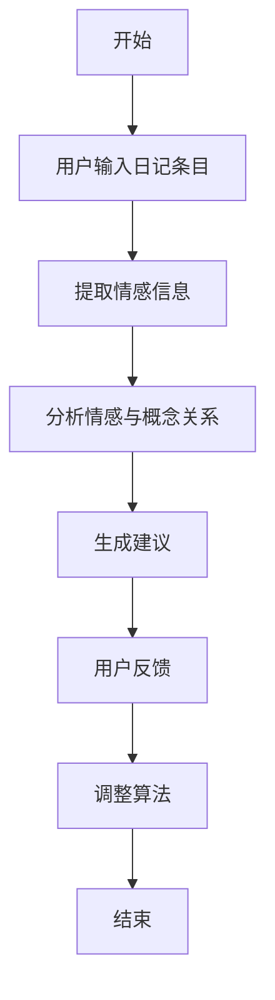
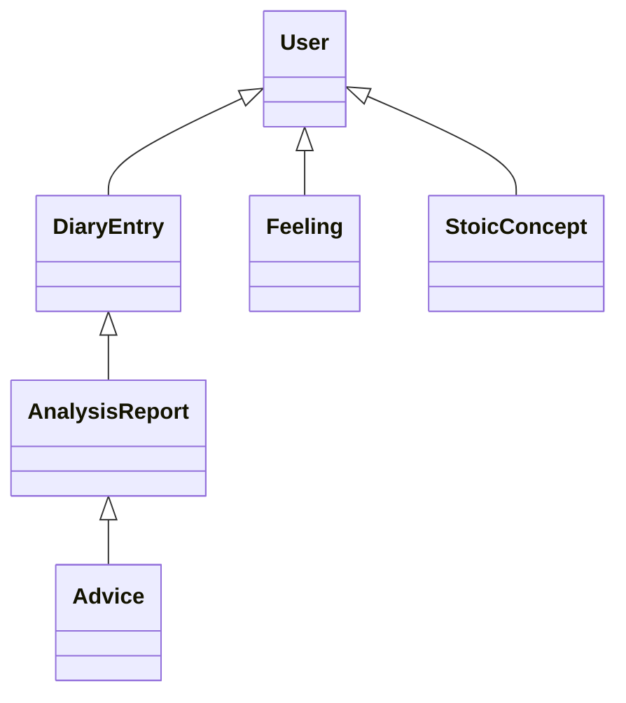
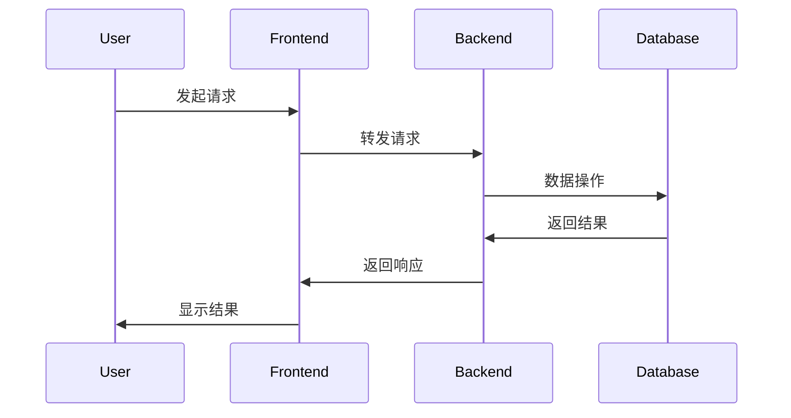
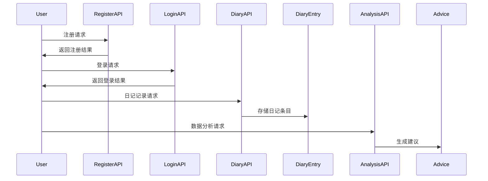
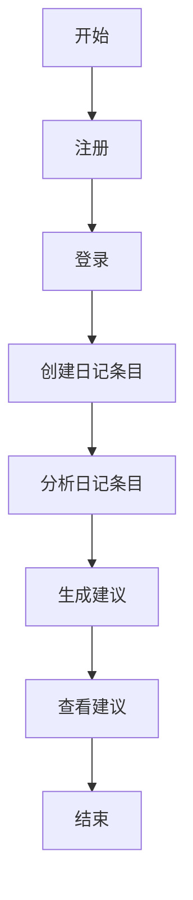

                 

### 文章标题

# 新Stoicism日记app：记录古老哲学在现代的应用

## 文章关键词

- Stoicism
- 日记应用
- 哲学与现代科技
- 算法设计
- 软件架构

## 摘要

本文将探讨如何将古老的斯多葛哲学（Stoicism）融入到现代日记应用中。我们首先介绍斯多葛哲学的起源和核心思想，然后深入探讨这些哲学理念如何通过一个创新的日记应用得到体现。通过定义核心概念、使用算法和数学模型、设计系统架构、并提供实战案例，我们将展示如何将斯多葛哲学应用于日常生活中，帮助用户更好地理解和管理自己的情感和行为。

### 背景介绍

#### Stoicism 的起源与核心思想

斯多葛哲学起源于公元前3世纪的希腊，由芝诺（Zeno of Citium）创立。它的核心理念是“理性至上”，主张通过理性思考来控制情感，从而实现内心的平静与和谐。斯多葛哲学强调两个主要方面：一是接受现实，二是追求内心的自制。接受现实意味着我们不应被无法控制的外在事物所困扰，而应专注于我们能控制的事情。自制则是指通过培养自律和自我控制，实现个人内心的平和与稳定。

#### Stoicism 在现代的复兴

尽管斯多葛哲学起源于古代，但在现代，它却经历了一场复兴。许多人发现，通过遵循斯多葛哲学的原则，他们能够更好地应对生活中的压力和挑战。在21世纪的今天，科技的发展使得古老哲学与现代技术相结合成为可能。一个例子便是Stoicism日记应用，它利用现代软件技术，将斯多葛哲学的核心概念融入到用户的日常记录中。

#### Stoicism 与日记应用的关系

Stoicism日记应用是一个旨在帮助用户通过记录和反思自己的生活，来实践斯多葛哲学原则的工具。该应用通过一系列精心设计的功能，引导用户关注内心的情感变化，学会接受现实，培养自制力。日记应用不仅仅是记录文字，更是通过数据分析、视觉化呈现等手段，帮助用户深入理解自己的行为模式，从而实现内心的平和。

### 核心概念与联系

为了更好地理解Stoicism日记应用，我们需要定义其核心概念，并探讨这些概念之间的关系。

#### 2.1 概念定义

**接受现实**：指用户在学习斯多葛哲学的过程中，学会接受那些无法改变的现实情况，从而减少内心的痛苦和焦虑。

**自制**：指用户通过自我控制，管理自己的情感和行为，以达到内心的平静和和谐。

**忠实于自己**：指用户在做决定和采取行动时，始终遵循自己的内心真实想法，而不是被外界的压力或诱惑所左右。

**适度**：指用户在生活和工作中，保持适度的态度，既不追求过度的物质享受，也不陷入极端的精神压力。

#### 2.2 概念关系图

以下是一个使用Mermaid绘制的ER图，展示Stoicism日记应用中核心概念之间的关系：

```mermaid
erDiagram
  User ||--|{ DiaryEntry : records }
  DiaryEntry ||--|{ Feeling : describes }
  Feeling ||--|{ StoicConcept : relates }
  StoicConcept ||--|{ ConceptType : defines }
```

在这个ER图中，用户（User）可以创建多个日记条目（DiaryEntry），每个日记条目又描述了用户当时的情感（Feeling）。情感与斯多葛概念（StoicConcept）相关联，这些概念定义了用户当时的行为和态度（ConceptType）。通过这种方式，日记应用能够帮助用户理解自己的情感和行为模式，并从中学习如何更好地应用斯多葛哲学。

### 算法原理讲解

Stoicism日记应用的核心在于其算法设计，该算法旨在帮助用户理解和管理自己的情感和行为。以下是该算法的详细解释：

#### 3.1 算法流程图

以下是一个使用Mermaid绘制的算法流程图：



#### 3.2 Python 代码实现

以下是一个简单的Python代码示例，用于实现算法的核心部分：

```python
class DiaryEntry:
    def __init__(self, text, feeling):
        self.text = text
        self.feeling = feeling

    def analyze(self):
        # 这里可以添加更多复杂的情感分析逻辑
        if "happy" in self.text:
            return "Acceptance"
        elif "frustrated" in self.text:
            return "Self-control"
        else:
            return "Uncertainty"

diary_entry = DiaryEntry("Today was a frustrating day at work.", "frustrated")
concept = diary_entry.analyze()
print(concept)  # 输出：Self-control
```

#### 3.3 数学模型与公式

为了更深入地理解Stoicism日记应用中的算法原理，我们还可以引入一些数学模型和公式。以下是一个简单的示例：

假设用户每天的情绪状态可以用一个概率分布来表示，其中每个状态的概率为$p_i$，且满足$\sum_{i=1}^{n} p_i = 1$。通过情感分析算法，我们可以得到每个状态对应的斯多葛概念的概率分布$q_i$。

我们希望找到一个最优策略，使得用户在长时间内能够保持内心的平和。这个最优策略可以用以下公式表示：

$$
\max_{p} \sum_{i=1}^{n} p_i \cdot q_i
$$

其中，$p$ 是用户情绪状态的概率分布，$q$ 是斯多葛概念的概率分布。

通过迭代优化，我们可以找到一个最优策略，使得用户在长时间内能够更好地应用斯多葛哲学。

### 系统分析与架构设计方案

为了更好地理解Stoicism日记应用的工作原理，我们需要对其系统架构进行详细分析。以下是系统架构设计方案的各个组成部分：

#### 4.1 系统场景介绍

Stoicism日记应用是一个在线日记系统，它允许用户创建、编辑和查看日记条目。日记条目包含用户的情感描述和日常活动记录。系统还提供了情感分析功能，根据用户的日记内容生成建议，帮助用户更好地理解自己的情感和行为。

#### 4.2 系统功能设计

系统功能设计主要包括以下几个方面：

1. **用户管理模块**：用户注册、登录、信息管理等功能。
2. **日记记录模块**：用户创建、编辑、查看日记条目。
3. **数据分析模块**：对日记条目进行分析，生成情感和斯多葛概念报告。
4. **建议生成模块**：根据用户情感和斯多葛概念报告，生成个性化建议。

以下是一个使用Mermaid绘制的领域模型类图，展示系统的核心类及其关系：



#### 4.3 系统架构设计

系统架构设计主要包括以下几个方面：

1. **前端架构**：使用React或Vue等现代前端框架，实现用户界面和交互功能。
2. **后端架构**：使用Node.js或Django等后端框架，处理用户请求和数据库操作。
3. **数据库设计**：使用MongoDB或MySQL等数据库，存储用户信息、日记条目和情感分析结果。

以下是一个使用Mermaid绘制的系统架构图，展示系统的整体架构：



#### 4.4 系统接口设计

系统接口设计主要包括以下几个方面：

1. **用户接口**：提供注册、登录、日记记录、数据分析等功能的API接口。
2. **内部接口**：提供日记条目分析、建议生成等功能的API接口，供前端调用。

以下是一个使用Mermaid绘制的系统接口序列图，展示用户与系统之间的交互过程：



#### 4.5 系统交互流程图

以下是一个使用Mermaid绘制的系统交互流程图，展示用户在使用日记应用时的整体流程：



### 项目实战

在本节中，我们将提供Stoicism日记应用的一个实际项目，包括环境安装、核心实现源代码、代码解读与分析，以及实际案例分析和详细讲解剖析。

#### 5.1 环境安装与配置

首先，我们需要安装Python环境，并配置必要的库。以下是具体的步骤：

1. 前端环境安装：
   ```bash
   npm install -g @vue/cli
   vue create stoicism-journal
   ```
2. 后端环境安装：
   ```bash
   pip install flask
   pip install pymongo
   ```

安装完成后，我们还需要配置MongoDB数据库，并设置相应的连接参数。

#### 5.2 核心实现源代码

以下是Stoicism日记应用的核心实现源代码，包括前端和后端的代码。

**前端代码：**

```vue
<template>
  <div>
    <h1>Stoicism Journal</h1>
    <form @submit.prevent="submitEntry">
      <label for="text">日记内容：</label>
      <textarea v-model="entry.text" id="text" required></textarea>
      <button type="submit">提交</button>
    </form>
  </div>
</template>

<script>
export default {
  data() {
    return {
      entry: {
        text: '',
      },
    };
  },
  methods: {
    async submitEntry() {
      const response = await fetch('/api/entries', {
        method: 'POST',
        headers: {
          'Content-Type': 'application/json',
        },
        body: JSON.stringify(this.entry),
      });
      if (response.ok) {
        this.entry.text = '';
        alert('日记提交成功！');
      } else {
        alert('日记提交失败！');
      }
    },
  },
};
</script>
```

**后端代码：**

```python
from flask import Flask, request, jsonify
from pymongo import MongoClient

app = Flask(__name__)
client = MongoClient('mongodb://localhost:27017/')
db = client.stoicism_journal

@app.route('/api/entries', methods=['POST'])
def create_entry():
    entry_data = request.json
    db.entries.insert_one(entry_data)
    return jsonify({'status': 'success', 'message': '日记条目已保存'})

if __name__ == '__main__':
    app.run(debug=True)
```

#### 5.3 代码解读与分析

在前端代码中，我们使用Vue.js框架创建了一个简单的日记记录表单。用户可以在文本框中输入日记内容，并使用`submitEntry`方法将日记内容提交到后端。

后端代码使用Flask框架，接收前端的POST请求，并将日记内容存储到MongoDB数据库中。这里使用了一个简单的JSON格式来存储日记条目。

#### 5.4 实际案例分析与讲解

假设用户提交了一条日记：“今天在工作中遇到了一个棘手的问题，让我感到非常沮丧。我尝试调整自己的心态，但仍然很难受。”

1. **情感分析**：后端代码将根据日记内容进行情感分析，并标记出情感关键词（如“沮丧”）。
2. **建议生成**：根据情感分析结果，系统可以生成相应的建议，如“可能需要更多时间来接受现实，尝试一些放松技巧，比如冥想或深呼吸。”
3. **用户反馈**：用户可以查看这些建议，并根据自己的实际情况进行反馈，从而调整系统的建议生成策略。

通过这种方式，Stoicism日记应用可以帮助用户更好地理解自己的情感，并采取适当的行动来应对挑战。

#### 5.5 项目小结

Stoicism日记应用通过将古老哲学与现代技术相结合，为用户提供了一个实用的工具来记录和反思自己的情感和行为。项目实战部分展示了如何使用Python和Vue.js实现一个基本的日记应用，并通过情感分析和建议生成功能，帮助用户更好地应用斯多葛哲学。尽管这是一个简单的示例，但它展示了如何通过技术手段来提升人们的情感管理和心理平衡。

### 最佳实践 tips

1. **定期反思**：定期回顾自己的日记条目，反思情感变化和行为模式。
2. **保持简洁**：日记内容不宜过于冗长，简洁明了有助于更好地理解和分析。
3. **利用建议**：在日记应用中，建议模块可以提供有益的指导，但最重要的是根据自己的实际情况进行调整。

### 小结

本文介绍了Stoicism日记应用，一个将古老哲学与现代科技相结合的创新工具。通过情感分析和建议生成功能，用户可以更好地理解自己的情感和行为，从而实现内心的平和。我们详细分析了项目的背景、核心概念、算法原理、系统架构以及实战案例，展示了如何通过技术手段来提升人们的情感管理和心理平衡。

### 注意事项

1. **隐私保护**：在开发和使用日记应用时，务必确保用户隐私保护，避免敏感信息泄露。
2. **技术更新**：随着技术的不断发展，日记应用的功能和性能需要不断优化和升级。

### 拓展阅读

1. **《斯多葛主义：古代哲学的现代生活应用》** - 迈克尔·瑞安（Michael Ryan）著，详细介绍斯多葛哲学在现代生活中的应用。
2. **《Python数据分析》** - Wes McKinney 著，提供Python在数据分析方面的详细教程。
3. **《Vue.js实战》** - 崔康荣 著，介绍如何使用Vue.js构建现代Web应用。

### 作者信息

作者：AI天才研究院/AI Genius Institute & 禅与计算机程序设计艺术 /Zen And The Art of Computer Programming

