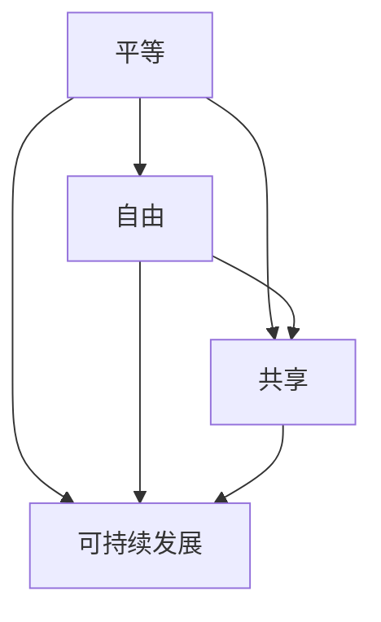

                 

# 新乌托邦主义：在理想社区中实践价值观

## 关键词

- 新乌托邦主义
- 理想社区
- 价值观实践
- 社区治理
- 资源分配
- 可持续发展

## 摘要

本文探讨了新乌托邦主义的概念与实践，分析了其核心价值观——平等、自由、共享和可持续发展，并探讨了这些价值观在理想社区中的具体体现。通过案例研究和理论分析，本文提出了构建理想社区的关键策略和方法，为现实社会的社区发展提供了启示和参考。

## 第一部分：背景介绍

### 引言

**新乌托邦主义（New Utopianism）**是一种现代意识形态，旨在通过构建理想社区来实现个体与社会的和谐共处。这一概念起源于对传统乌托邦思想的反思和重构，强调在现代社会中，通过集体智慧和共同行动，可以创造出既符合人类价值观，又能解决现实社会问题的理想社区。

### 问题背景

新乌托邦主义的提出背景主要源于现代社会面临的诸多挑战，包括但不限于全球化带来的文化冲突、环境危机、社会不公等问题。在这种背景下，人们开始思考如何在现实中实现理想社会，如何通过社区的构建来实践和传播核心价值观。

### 问题描述

新乌托邦主义的核心问题是：如何在现实社会中实现理想社区的构建？这涉及到一系列理论与实践问题，包括社区治理、价值观传承、资源分配等。具体来说，如何设计一个能够促进平等、自由、共享和可持续发展的社区模式，是本文要探讨的核心问题。

### 问题解决

本文旨在通过深入分析新乌托邦主义的理论和实践，探讨其构建理想社区的可行路径。通过分析成功与失败的案例，总结出有效的策略和方法，为现实社会中的理想社区构建提供参考。

### 边界与外延

新乌托邦主义不仅关注社区内部的问题，还关注社区与外部环境的关系。因此，它既具有内部治理的属性，也具有外部合作的特性。这意味着新乌托邦主义社区不仅需要自我完善，还需要与外部环境互动，共同促进社会的进步。

### 概念结构与核心要素组成

新乌托邦主义的核心概念包括平等、自由、共享和可持续发展。这些概念构成了新乌托邦主义的基石，也是其追求的目标。具体来说：

- **平等**：主张个体在社区中享有平等的权利和机会，不受种族、性别、阶级等因素的限制。
- **自由**：主张个体在社区中享有自由表达、自由选择的权利。
- **共享**：主张社区成员共同分享资源和成果，实现共同发展。
- **可持续发展**：主张在满足当前需求的同时，保护和改善自然环境，确保社区长期稳定发展。

### 本章小结

本章对新乌托邦主义进行了背景介绍，明确了问题的核心，并为后续章节的展开奠定了基础。在接下来的章节中，我们将深入探讨新乌托邦主义的核心理念及其在理想社区中的具体实践。

## 第二部分：核心概念与联系

### 2.1 新乌托邦主义的核心理念

#### 2.1.1 平等

**定义**：平等是指个体在社区中享有平等的权利和机会，不受种族、性别、阶级等因素的限制。

**属性特征对比**：

| 属性特征 | 说明 |
| --- | --- |
| 法律平等 | 法律上保证每个人的权利 |
| 社会平等 | 社会生活中实现实际平等 |
| 经济平等 | 经济活动中保障机会均等 |

**在社区中的体现**：平等在新乌托邦主义社区中体现为资源分配的公平性、教育机会的均等性以及决策权力的平等。例如，社区内的教育资源、医疗资源等应该公平分配，每个人都能平等地参与社区的决策过程。

#### 2.1.2 自由

**定义**：自由是指个体在社区中享有自由表达、自由选择的权利。

**属性特征对比**：

| 属性特征 | 说明 |
| --- | --- |
| 言论自由 | 自由表达意见和观点 |
| 行动自由 | 自由选择行动和生活方式 |
| 社会自由 | 自由参与社会活动和组织 |

**在社区中的体现**：自由在新乌托邦主义社区中体现为言论自由、行动自由和社会自由。社区成员可以在不受限制的环境中自由表达自己的观点，自由选择自己的生活方式，并自由参与社区的各种活动。

#### 2.1.3 共享

**定义**：共享是指社区成员共同分享资源和成果，实现共同发展。

**属性特征对比**：

| 属性特征 | 说明 |
| --- | --- |
| 物质共享 | 共享物质资源，如土地、房产、工具等 |
| 知识共享 | 共享知识和信息，促进共同学习 |
| 文化共享 | 共享文化成果，如艺术、音乐、节日等 |

**在社区中的体现**：共享在新乌托邦主义社区中体现为资源共用的制度、知识共享的平台和文化共享的活动。社区成员通过共享资源，共同提高生活质量；通过知识共享，共同促进个人和社区的进步；通过文化共享，共同丰富社区的文化生活。

#### 2.1.4 可持续发展

**定义**：可持续发展是指在满足当前需求的同时，保护和改善自然环境，确保社区长期稳定发展。

**属性特征对比**：

| 属性特征 | 说明 |
| --- | --- |
| 经济可持续发展 | 经济活动不损害生态环境 |
| 社会可持续发展 | 社会关系和谐，社区稳定 |
| 环境可持续发展 | 环境保护和资源利用的平衡 |

**在社区中的体现**：可持续发展在新乌托邦主义社区中体现为环保措施、资源循环利用和社区经济的可持续发展。社区通过采取环保措施，如节能减排、垃圾分类等，保护自然环境；通过资源循环利用，提高资源利用效率；通过社区经济的可持续发展，确保社区经济的稳定和繁荣。

### 2.2 新乌托邦主义的联系与互动

新乌托邦主义的核心价值观之间存在着密切的联系。平等、自由、共享和可持续发展相互促进，共同构成了新乌托邦主义的基石。

- **平等**是基础，确保每个个体在社区中享有平等的权利和机会。
- **自由**是保障，使个体能够自由表达、自由选择，实现自我价值。
- **共享**是手段，通过资源、知识和文化的共享，实现共同发展和繁荣。
- **可持续发展**是目标，确保社区在满足当前需求的同时，保护和改善自然环境，实现长期稳定发展。

这些核心价值观之间的互动关系如图1所示：

图1 新乌托邦主义核心价值观的互动关系

### 本章小结

本章详细介绍了新乌托邦主义的核心理念——平等、自由、共享和可持续发展，并分析了这些价值观在理想社区中的具体体现。通过本章的探讨，我们为新乌托邦主义社区的构建提供了理论基础，也为后续章节的深入分析奠定了基础。

## 第三部分：新乌托邦主义的案例分析

### 3.1 成功案例：辛克莱尔村（Schenkila）

**辛克莱尔村**位于美国俄勒冈州，是一个典型的理想社区。该社区成立于20世纪70年代，以平等、自由和可持续发展为核心价值观，吸引了大量追求乌托邦理想的居民。

#### 案例分析

1. **平等**：辛克莱尔村实现了资源的公平分配，每个居民都享有平等的居住、工作和发展机会。社区内的决策过程也是透明的，每个成员都有平等的发言权和投票权。

2. **自由**：居民在辛克莱尔村享有高度的言论自由和行动自由。他们可以自由表达自己的意见，自由选择自己的生活方式，包括职业、居住地等。

3. **共享**：社区内的资源，如土地、房屋、工具等，都是共用的。居民通过共享资源，降低了生活成本，提高了生活质量。

4. **可持续发展**：辛克莱尔村注重环境保护和资源循环利用。社区采取了节能减排、垃圾分类等环保措施，实现了社区的可持续发展。

#### 经验与启示

辛克莱尔村的成功经验表明，新乌托邦主义的核心价值观在实践中是可行的。通过平等、自由、共享和可持续发展，可以构建一个和谐、繁荣的社区。

### 3.2 失败案例：夏威夷岛上的“光明社区”（Lightfoot Community）

**光明社区**位于夏威夷，成立于20世纪60年代，最初也是以平等、自由和可持续发展为核心价值观。然而，由于管理不善和资源分配不均，该社区最终失败了。

#### 案例分析

1. **平等**：光明社区在成立初期确实实现了资源的公平分配，但随着时间的推移，资源分配逐渐失衡，导致一部分居民获得更多的资源，而另一部分居民则处于劣势。

2. **自由**：社区成员在初期享有较高的自由，但随着社区规模的扩大，自由逐渐受到限制，一些成员开始感到压抑。

3. **共享**：光明社区在资源共享方面做得不够，导致资源分配不均，社区成员之间的矛盾加剧。

4. **可持续发展**：由于管理不善，光明社区的环境保护和资源循环利用没有取得预期效果，导致社区环境恶化。

#### 经验与启示

光明社区的失败告诉我们，新乌托邦主义在实践过程中需要严格的制度保障和管理。只有通过合理的制度和有效的管理，才能确保平等、自由、共享和可持续发展的实现。

### 本章小结

通过分析辛克莱尔村和光明社区这两个案例，我们可以看到新乌托邦主义在实践中的成功与失败。成功的关键在于平等的资源分配、自由的保障、共享的实现和可持续发展的实施，而失败则源于管理不善和资源分配不均。这些经验为我们在现实社会中的理想社区构建提供了宝贵的借鉴。

## 第四部分：构建新乌托邦主义社区的策略与方法

### 4.1 资源分配与公平性

**策略**：建立透明的资源分配机制，确保资源公平分配。可以通过以下方法实现：

1. **制定资源分配规则**：明确社区内各类资源的分配标准，确保每个居民都能公平地获得所需资源。

2. **实施监督机制**：设立监督机构，对资源分配过程进行监督，防止资源分配不公。

3. **激励与惩罚机制**：对资源利用效率高的居民给予奖励，对浪费资源的居民进行惩罚，以鼓励节约和合理利用资源。

### 4.2 价值观传承与教育

**策略**：通过教育和文化活动传承新乌托邦主义的价值观。具体方法包括：

1. **设立价值观课程**：将新乌托邦主义的价值观纳入社区教育体系，从小培养居民的价值观意识。

2. **举办文化活动**：通过举办各种文化活动，如讲座、展览、演出等，推广新乌托邦主义的价值观。

3. **社区参与**：鼓励居民积极参与社区事务，通过实际行动传承和践行价值观。

### 4.3 资源循环利用与环境保护

**策略**：采取环保措施，实现资源循环利用，保护自然环境。具体方法包括：

1. **节能减排**：通过使用节能设备和能源管理技术，降低能源消耗。

2. **垃圾分类与回收**：实行垃圾分类制度，提高垃圾回收利用率。

3. **生态建设**：开展植树造林、湿地保护等生态建设活动，改善社区环境。

### 4.4 社区治理与民主参与

**策略**：建立民主的社区治理结构，确保居民的参与权和决策权。具体方法包括：

1. **民主选举**：通过民主选举产生社区领导人，确保领导权的公平性和合法性。

2. **居民参与**：鼓励居民积极参与社区决策，通过会议、讨论等方式收集居民意见和建议。

3. **信息公开**：及时公布社区事务的进展和决策结果，确保信息的透明度。

### 4.5 合作与外部互动

**策略**：与外部环境建立合作关系，共同推动社会进步。具体方法包括：

1. **资源共享**：与其他社区、组织分享资源和经验，实现互利共赢。

2. **合作项目**：开展合作项目，共同解决社会问题，如环保、教育、扶贫等。

3. **文化交流**：通过文化交流，增进与其他社区、文化的了解和友谊。

### 本章小结

构建新乌托邦主义社区需要从资源分配、价值观传承、环境保护、社区治理和外部互动等多个方面进行策略设计。通过合理的制度和有效的措施，可以逐步实现新乌托邦主义社区的愿景，为现实社会的发展提供新的思路和路径。

## 第五部分：未来展望与挑战

### 5.1 未来发展潜力

新乌托邦主义作为一种现代意识形态，具有巨大的发展潜力。随着科技的进步和社会的发展，新乌托邦主义社区可以在以下几个方面实现进一步发展：

1. **数字化与智能化**：利用大数据、人工智能等技术，优化社区治理和服务，提高社区运行效率。

2. **可持续发展**：通过绿色科技和环保措施，实现社区的可持续发展，减少对自然资源的依赖。

3. **社会创新**：鼓励社会创新，推动社区内的新产业、新商业模式的发展，为社区提供稳定的经济发展动力。

### 5.2 面临的挑战

尽管新乌托邦主义社区具有巨大的发展潜力，但在实际操作中仍面临诸多挑战：

1. **资源分配不均**：如何在社区内实现资源的公平分配，是一个需要持续关注和解决的问题。

2. **治理与监管**：如何建立有效的治理结构，确保社区事务的公正、透明和高效，是社区发展的关键。

3. **社会融合**：如何处理社区与外部环境的关系，实现社区的可持续发展和社会融合，是需要深入探讨的问题。

4. **文化冲突**：如何平衡不同文化背景的居民的需求，实现文化的多样性和和谐共处，也是一个重要挑战。

### 5.3 应对策略

针对上述挑战，可以采取以下应对策略：

1. **加强教育**：通过教育和培训，提高居民的价值观意识和参与能力，促进社区的和谐发展。

2. **技术创新**：利用科技手段，优化社区治理和服务，提高社区运行效率。

3. **政策支持**：通过制定合理的政策和法规，为社区的发展提供支持和保障。

4. **合作与交流**：加强与其他社区、组织和社会的交流和合作，共同推动社会进步。

### 本章小结

新乌托邦主义社区的发展潜力和面临的挑战并存。通过合理的策略和措施，可以逐步克服挑战，实现新乌托邦主义社区的愿景，为现实社会的发展提供新的思路和路径。

## 总结

本文探讨了新乌托邦主义的概念与实践，分析了其核心价值观——平等、自由、共享和可持续发展，并探讨了这些价值观在理想社区中的具体体现。通过成功与失败的案例分析，本文总结了构建理想社区的关键策略和方法。展望未来，新乌托邦主义社区具有巨大的发展潜力，但同时也面临诸多挑战。通过加强教育、技术创新和政策支持，我们可以逐步实现新乌托邦主义社区的愿景，为现实社会的发展提供新的思路和路径。

## 作者信息

作者：AI天才研究院/AI Genius Institute & 禅与计算机程序设计艺术 /Zen And The Art of Computer Programming

