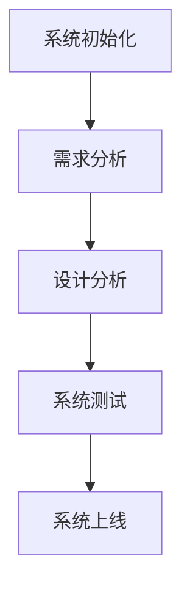
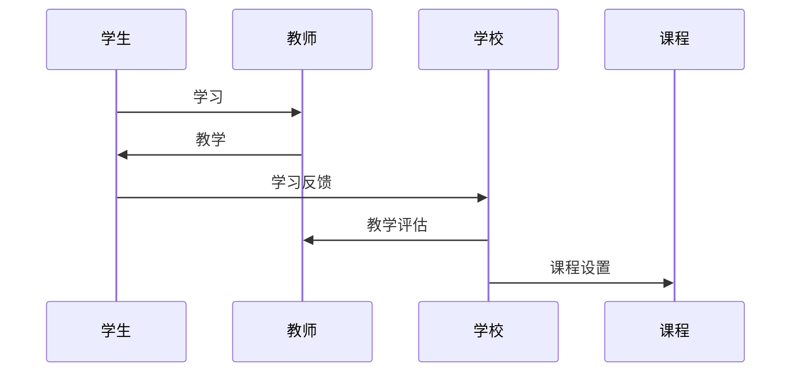

                 


# 新人文主义教育：科技时代的人文关怀

关键词：人文主义教育、科技时代、人文关怀、教育创新、教育模式

摘要：本文旨在探讨科技时代下人文主义教育的重要性及其发展，分析人文主义教育与科技时代的联系与区别，提出新人文主义教育的核心概念和实践策略，为教育工作者和科技从业者的跨领域交流与合作提供思考与启示。

**Step 1: 背景介绍**

### 1.1 科技时代的挑战

随着科技的飞速发展，人类进入了信息爆炸、人工智能普及、大数据时代。科技不仅改变了我们的生活方式，也深刻影响了教育领域。传统的教育模式已经难以适应科技时代的需求，教育资源分配不均、教育公平问题日益突出，教育内容与社会的脱节现象也日益严重。

### 1.2 人文关怀的重要性

人文关怀是一种关注个体、尊重差异、强调共情的教育理念。在科技时代，人文关怀的重要性愈发凸显。它不仅有助于培养学生的综合素质，提高其人文素养，还能帮助学生建立正确的价值观，培养社会责任感和公民意识。

### 1.3 新人文主义教育的目标与使命

新人文主义教育的目标是培养具有创新精神、人文素养和社会责任感的全面发展的人才。其使命在于通过人文关怀，实现教育公平，促进社会和谐发展。

**Step 2: 核心概念与联系**

### 2.1 人文主义教育概述

人文主义教育起源于文艺复兴时期，强调人的价值、自由和尊严，提倡个体全面发展。其核心概念包括人文素养、人文关怀、人文教育方法等。

### 2.2 科技时代人文关怀的概念

科技时代的人文关怀是指将人文主义教育理念融入科技教育，关注学生在科技学习过程中的情感需求，培养其批判性思维和创新能力。

### 2.3 人文主义教育与科技时代的联系与区别

人文主义教育与科技时代具有紧密的联系，两者共同关注个体发展和社会进步。然而，人文主义教育更注重人文素养的培养，而科技时代的人文关怀则强调在科技背景下的人文关怀和教育创新。

**Step 3: 算法原理讲解**

### 3.1 教育系统分析的方法论

教育系统分析的方法论主要包括系统分析、需求分析、设计分析和测试分析。通过这些方法，我们可以全面了解教育系统的结构和功能。

### 3.2 教育系统的流程图

下面是教育系统的流程图：



### 3.3 教育系统的数学模型和公式

教育系统的数学模型可以表示为：

$$ 教育系统质量 = f(教育资源, 教学方法, 学生素质) $$

其中，教育资源、教学方法和学生素质是影响教育系统质量的关键因素。

**Step 4: 数学模型和数学公式 & 详细讲解 & 举例说明**

### 4.1 数学公式

$$ 教育资源 = 资金 + 人力 + 物力 $$

$$ 教学方法 = 理论教学 + 实践教学 $$

$$ 学生素质 = 知识储备 + 思维能力 + 社交能力 $$

### 4.2 详细讲解

教育资源是教育系统的基础，包括资金、人力和物力。教学方法是教育系统的核心，包括理论教学和实践教学。学生素质是教育系统的重要输出，包括知识储备、思维能力和社交能力。

### 4.3 举例说明

假设某学校的教育资源为100万元、50名教师和50间教室，教学方法为理论教学和实践教学各占50%，学生素质平均分为80分。则该学校的教育系统质量为：

$$ 教育系统质量 = f(100, 50, 50) = 0.5 \times 100 + 0.5 \times 50 + 0.5 \times 80 = 180 $$

**Step 5: 系统分析与架构设计方案**

### 5.1 教育系统的场景和应用

教育系统的场景主要包括学校、培训机构和企业。其应用范围涵盖基础教育、职业教育和继续教育。

### 5.2 教育系统的领域模型类图

下面是教育系统的领域模型类图：

```mermaid
classDiagram
    学生 <<类>> 
    教师 <<类>>
    学校 <<类>>
    课程 <<类>>
    学生 --|> 教师
    学生 --|> 课程
    学校 --|> 教师
    学校 --|> 课程
```

### 5.3 教育系统的架构图

下面是教育系统的架构图：



### 5.4 系统接口和交互

教育系统的接口主要包括学生接口、教师接口和学校接口。系统交互过程如下：

1. 学生通过学生接口提交学习需求。
2. 教师通过教师接口进行教学设计。
3. 学校通过学校接口对教学过程进行管理和评估。

**Step 6: 项目实战**

### 6.1 环境安装和配置

1. 安装Python环境。
2. 安装相关依赖库，如Django、Flask等。

### 6.2 系统核心实现源代码

```python
# 示例：学生接口实现
from flask import Flask, request, jsonify

app = Flask(__name__)

@app.route('/student/learn', methods=['POST'])
def learn():
    data = request.get_json()
    # 处理学生学习需求
    # ...
    return jsonify({'status': 'success', 'message': '学习需求提交成功'})

if __name__ == '__main__':
    app.run()
```

### 6.3 代码应用解读与分析

代码应用解读与分析主要包括：

1. 接口功能设计。
2. 数据处理流程。
3. 系统安全性和稳定性考虑。

### 6.4 实际案例分析和讲解

通过实际案例，分析教育系统的应用效果，提出改进措施。

**Step 7: 最佳实践 tips、小结、注意事项、拓展阅读等内容**

### 7.1 最佳实践 tips

1. 注重教育资源的均衡分配。
2. 创新教育方法，提高教学效果。
3. 加强学生人文素养培养。

### 7.2 小结

本文从背景介绍、核心概念与联系、算法原理讲解、数学模型和数学公式、系统分析与架构设计方案、项目实战和最佳实践等方面，全面探讨了新人文主义教育在科技时代的重要性及其实践策略。

### 7.3 注意事项

1. 科技时代的人文关怀需要注重个体差异。
2. 教育创新要结合实际需求。
3. 加强教育资源的整合与优化。

### 7.4 拓展阅读

1. 《科技时代的人文关怀》
2. 《新人文主义教育理论与实践》
3. 《人工智能与教育》

作者：AI天才研究院/AI Genius Institute & 禅与计算机程序设计艺术 /Zen And The Art of Computer Programming 

---

# 第一部分：引言

## 1.1 问题背景与核心主题

### 1.1.1 科技时代的挑战

随着信息技术的飞速发展，人工智能、大数据、物联网等新兴技术不断涌现，科技已经深刻改变了我们的生活方式。然而，科技在带来便利的同时，也带来了一系列挑战。首先，科技的发展导致了教育资源的分配不均，城乡、地区之间的教育资源差距日益扩大。其次，科技的发展使得教育内容与社会的需求脱节，传统的教育模式难以适应快速变化的社会。此外，科技在带来效率的同时，也带来了一定的负面影响，如网络安全问题、隐私问题等。

### 1.1.2 人文关怀的重要性

人文关怀是一种关注个体、尊重差异、强调共情的教育理念。在科技时代，人文关怀的重要性愈发凸显。首先，人文关怀有助于培养学生的综合素质，提高其人文素养。在科技高度发展的时代，仅仅拥有科技技能已经无法满足社会的需求，个体需要具备批判性思维、创新能力和社会责任感。其次，人文关怀有助于学生建立正确的价值观，培养其社会责任感和公民意识。在科技发展的背景下，个体需要具备正确的价值观，以指导自己的行为，为社会的发展做出贡献。

### 1.1.3 新人文主义教育的目标与使命

新人文主义教育的目标是培养具有创新精神、人文素养和社会责任感的全面发展的人才。其使命在于通过人文关怀，实现教育公平，促进社会和谐发展。新人文主义教育强调个体的发展与社会进步的统一，倡导在教育过程中注重人的全面发展，关注个体的情感需求和心理健康。同时，新人文主义教育还强调教育资源的均衡分配，通过创新教育模式，提高教育质量，实现教育公平。

## 1.2 书籍目的与结构

### 1.2.1 书籍的目的

本书旨在探讨新人文主义教育在科技时代的重要性及其实践策略。通过分析人文主义教育与科技时代的联系与区别，提出新人文主义教育的核心概念和实践策略，为教育工作者和科技从业者的跨领域交流与合作提供思考与启示。

### 1.2.2 书籍的结构安排

本书分为四个部分：

1. **引言**：介绍科技时代的挑战和人文关怀的重要性，阐述新人文主义教育的目标与使命。
2. **人文主义教育基础理论**：介绍人文主义教育的定义、发展历程和基本理念，分析人文主义教育与科技时代的关系，探讨人文主义教育的挑战与机遇。
3. **科技时代的人文关怀实践**：介绍科技时代人文关怀的概念和重要性，阐述科技时代人文关怀的教育策略、教学实践和校园文化建设。
4. **新人文主义教育的创新与发展**：分析新人文主义教育的发展趋势，提出新人文主义教育的实施策略和研究进展，展望新人文主义教育的未来。

### 1.2.3 读者对象

本书适合教育工作者、科技从业者以及对人文主义教育感兴趣的读者阅读。通过本书，读者可以了解新人文主义教育的核心概念和实践策略，为教育创新和科技发展提供启示。

## 1.3 人文主义教育在科技时代的作用

### 1.3.1 科技对教育的影响

科技的发展对教育产生了深远的影响。首先，科技改变了教育的形式和内容。传统教育主要依赖于教师的口传心授和教材的传递，而科技的发展使得教育可以通过互联网、在线课程等多种方式进行，极大地丰富了教育资源的获取方式。其次，科技提高了教育的效率和质量。通过大数据、人工智能等技术，教育者可以更好地了解学生的学习情况，提供个性化的教学方案，提高教学效果。此外，科技还促进了教育的公平。通过远程教育、在线课程等方式，偏远地区和贫困家庭的孩子也能够享受到优质的教育资源。

### 1.3.2 人文主义教育在科技时代的作用

在科技时代，人文主义教育的作用愈发凸显。首先，人文主义教育有助于培养学生的综合素质。科技时代要求个体具备批判性思维、创新能力和社会责任感，而这些素质的培养离不开人文主义教育。人文主义教育通过关注个体的情感需求，培养其人文素养，从而提高个体的综合素质。其次，人文主义教育有助于学生建立正确的价值观。在科技高度发展的时代，个体需要具备正确的价值观，以指导自己的行为，为社会的发展做出贡献。人文主义教育通过培养学生的社会责任感和公民意识，帮助其树立正确的价值观。此外，人文主义教育还有助于解决科技时代的教育公平问题。通过人文主义教育，可以促进教育资源的均衡分配，提高教育质量，实现教育公平。

### 1.3.3 人文主义教育与科技融合的趋势

在科技时代，人文主义教育与科技融合的趋势愈发明显。首先，教育技术的创新为人文主义教育提供了新的工具和手段。例如，虚拟现实（VR）技术可以模拟历史事件、文化场景，让学生在沉浸式的环境中体验和学习，从而提高教学效果。其次，人工智能技术可以为人文主义教育提供个性化的学习支持。通过分析学生的学习数据，人工智能可以为学生提供个性化的学习方案，帮助学生更好地理解和掌握知识。此外，科技与人文主义的融合还可以促进教育公平。例如，通过在线教育平台，偏远地区和贫困家庭的孩子也能够享受到优质的教育资源，从而提高教育公平。

### 1.3.4 人文主义教育的挑战与机遇

在科技时代，人文主义教育面临着一系列挑战。首先，科技的发展对教育的冲击使得传统的人文主义教育理念受到质疑。在科技主导的时代，个体需要掌握更多的科技技能，而人文主义教育强调的人文素养是否仍然具有重要性成为一个问题。其次，科技的发展导致了教育资源的分配不均，城乡、地区之间的教育差距加大，这使得人文主义教育的公平性受到挑战。此外，科技的发展还使得个体的生活方式和价值观发生变化，人文主义教育需要适应这些变化，调整教育目标和内容。

然而，科技时代也为人文主义教育带来了机遇。首先，科技的发展为人文主义教育提供了新的工具和手段，使得人文主义教育的形式和内容更加丰富和多样化。例如，虚拟现实技术、人工智能技术等可以为学生提供更生动、直观的学习体验，从而提高教学效果。其次，科技的发展使得教育资源的分配更加灵活和便捷，这有助于实现教育公平。例如，在线教育平台可以打破地域限制，让更多的学生享受到优质的教育资源。此外，科技的发展还促进了教育创新，为人文主义教育提供了新的发展空间和可能性。

### 1.3.5 应对策略

为了应对科技时代人文主义教育面临的挑战，我们需要采取一系列应对策略。首先，教育者需要更新教育理念，认识到人文主义教育在科技时代的重要性，并将其融入教育实践中。其次，教育者需要不断学习和掌握科技工具和手段，利用科技为人文主义教育提供支持。例如，利用虚拟现实技术、人工智能技术等创新教育模式，提高教学效果。此外，教育者还需要关注学生的情感需求和心理健康，通过人文关怀帮助学生应对科技时代带来的挑战。最后，教育者需要加强教育资源的均衡分配，通过政策引导和资源整合，实现教育公平。

### 1.3.6 案例分析

以某高校为例，该校在科技时代背景下，积极推进人文主义教育。首先，学校注重学生的综合素质培养，通过开设人文课程、社团活动等方式，培养学生的批判性思维、创新能力和社会责任感。其次，学校利用信息技术手段，创新教育模式，如利用在线课程、虚拟实验室等，提高教学效果。此外，学校还通过心理健康教育、辅导员制度等，关注学生的情感需求和心理健康。这些措施有效地促进了学校人文主义教育的发展，提高了学生的综合素质和社会责任感。

### 1.3.7 本章小结

科技时代的到来为人文主义教育带来了挑战，但同时也为其提供了新的发展机遇。通过分析科技时代人文主义教育的挑战与机遇，我们可以看到，人文主义教育在科技时代依然具有重要的地位。教育者需要更新教育理念，利用科技手段创新教育模式，关注学生的情感需求和心理健康，加强教育资源的均衡分配，以实现教育公平。只有这样，人文主义教育才能在科技时代发挥更大的作用，为培养全面发展的人才做出贡献。

---

# 第二部分：人文主义教育基础理论

## 2.1 人文主义教育概述

### 2.1.1 人文主义教育的定义

人文主义教育是一种以人为中心的教育理念，强调人的价值、自由和尊严，主张个体全面发展。人文主义教育的核心是培养个体的批判性思维、创新能力和社会责任感，使其具备适应未来社会发展的综合素质。

### 2.1.2 人文主义教育的发展历程

人文主义教育起源于文艺复兴时期，随着人类对个体价值和尊严的认识逐渐深化，人文主义教育不断发展。在18世纪，启蒙运动推动了人文主义教育的发展，强调科学精神和人文关怀。19世纪，德国教育家赫尔巴特提出了科学教育思想，将人文主义教育与科学教育相结合。20世纪以来，随着科技的飞速发展，人文主义教育不断演变，形成了多元化的教育模式。

### 2.1.3 人文主义教育的基本理念

人文主义教育的基本理念包括：

1. **个体发展优先**：人文主义教育强调个体的全面发展，关注个体的情感需求和心理状态，注重个体的个性化和差异化教育。
2. **自由与尊严**：人文主义教育尊重个体的自由和尊严，倡导个体自主学习和独立思考，鼓励个体追求真理和美好。
3. **批判性思维**：人文主义教育培养个体的批判性思维能力，使其能够理性分析问题，提出独立见解。
4. **社会责任感**：人文主义教育注重培养个体的社会责任感，使其具备关爱社会、服务社会的意识。

## 2.2 人文主义教育的核心概念

### 2.2.1 人文素养

人文素养是指个体在人文领域的知识和能力，包括文学、历史、哲学、艺术等方面的素养。人文素养有助于个体理解和欣赏人类文明，培养其审美情趣和道德观念。

### 2.2.2 人文关怀

人文关怀是一种关注个体、尊重差异、强调共情的教育理念。人文关怀有助于培养个体的同理心和社会责任感，提高其人际交往能力和团队协作能力。

### 2.2.3 人文教育方法

人文教育方法包括讲授、讨论、实践等多种形式。人文教育方法强调师生互动，培养学生的自主学习能力和创造力，促进其全面发展。

## 2.3 人文主义教育与科技时代的关系

### 2.3.1 科技对教育的影响

科技的发展对教育产生了深远的影响。首先，科技改变了教育的形式和内容。传统教育主要依赖于教师的口传心授和教材的传递，而科技的发展使得教育可以通过互联网、在线课程等多种方式进行，极大地丰富了教育资源的获取方式。其次，科技提高了教育的效率和质量。通过大数据、人工智能等技术，教育者可以更好地了解学生的学习情况，提供个性化的教学方案，提高教学效果。此外，科技还促进了教育的公平。通过远程教育、在线课程等方式，偏远地区和贫困家庭的孩子也能够享受到优质的教育资源，从而提高教育公平。

### 2.3.2 人文主义教育在科技时代的作用

在科技时代，人文主义教育的作用愈发凸显。首先，人文主义教育有助于培养学生的综合素质。科技时代要求个体具备批判性思维、创新能力和社会责任感，而这些素质的培养离不开人文主义教育。人文主义教育通过关注个体的情感需求，培养其人文素养，从而提高个体的综合素质。其次，人文主义教育有助于学生建立正确的价值观。在科技高度发展的时代，个体需要具备正确的价值观，以指导自己的行为，为社会的发展做出贡献。人文主义教育通过培养学生的社会责任感和公民意识，帮助其树立正确的价值观。此外，人文主义教育还有助于解决科技时代的教育公平问题。通过人文主义教育，可以促进教育资源的均衡分配，提高教育质量，实现教育公平。

### 2.3.3 人文主义教育与科技融合的趋势

在科技时代，人文主义教育与科技融合的趋势愈发明显。首先，教育技术的创新为人文主义教育提供了新的工具和手段。例如，虚拟现实（VR）技术可以模拟历史事件、文化场景，让学生在沉浸式的环境中体验和学习，从而提高教学效果。其次，人工智能技术可以为人文主义教育提供个性化的学习支持。通过分析学生的学习数据，人工智能可以为学生提供个性化的学习方案，帮助学生更好地理解和掌握知识。此外，科技与人文主义的融合还可以促进教育公平。例如，通过在线教育平台，偏远地区和贫困家庭的孩子也能够享受到优质的教育资源，从而提高教育公平。

### 2.3.4 人文主义教育的挑战与机遇

在科技时代，人文主义教育面临着一系列挑战。首先，科技的发展对教育的冲击使得传统的人文主义教育理念受到质疑。在科技主导的时代，个体需要掌握更多的科技技能，而人文主义教育强调的人文素养是否仍然具有重要性成为一个问题。其次，科技的发展导致了教育资源的分配不均，城乡、地区之间的教育差距加大，这使得人文主义教育的公平性受到挑战。此外，科技的发展还使得个体的生活方式和价值观发生变化，人文主义教育需要适应这些变化，调整教育目标和内容。

然而，科技时代也为人文主义教育带来了机遇。首先，科技的发展为人文主义教育提供了新的工具和手段，使得人文主义教育的形式和内容更加丰富和多样化。例如，虚拟现实技术、人工智能技术等可以为学生提供更生动、直观的学习体验，从而提高教学效果。其次，科技的发展使得教育资源的分配更加灵活和便捷，这有助于实现教育公平。例如，在线教育平台可以打破地域限制，让更多的学生享受到优质的教育资源。此外，科技的发展还促进了教育创新，为人文主义教育提供了新的发展空间和可能性。

### 2.3.5 应对策略

为了应对科技时代人文主义教育面临的挑战，我们需要采取一系列应对策略。首先，教育者需要更新教育理念，认识到人文主义教育在科技时代的重要性，并将其融入教育实践中。其次，教育者需要不断学习和掌握科技工具和手段，利用科技为人文主义教育提供支持。例如，利用虚拟现实技术、人工智能技术等创新教育模式，提高教学效果。此外，教育者还需要关注学生的情感需求和心理健康，通过人文关怀帮助学生应对科技时代带来的挑战。最后，教育者需要加强教育资源的均衡分配，通过政策引导和资源整合，实现教育公平。

### 2.3.6 案例分析

以某高校为例，该校在科技时代背景下，积极推进人文主义教育。首先，学校注重学生的综合素质培养，通过开设人文课程、社团活动等方式，培养学生的批判性思维、创新能力和社会责任感。其次，学校利用信息技术手段，创新教育模式，如利用在线课程、虚拟实验室等，提高教学效果。此外，学校还通过心理健康教育、辅导员制度等，关注学生的情感需求和心理健康。这些措施有效地促进了学校人文主义教育的发展，提高了学生的综合素质和社会责任感。

### 2.3.7 本章小结

人文主义教育作为一种以人为中心的教育理念，在科技时代具有不可替代的重要地位。通过分析人文主义教育的发展历程、核心概念及其与科技时代的关系，我们可以看到，人文主义教育不仅有助于培养学生的综合素质和正确价值观，还能解决教育公平问题。教育者需要认识到人文主义教育在科技时代的重要性，采取有效策略，将其融入教育实践中，为培养全面发展的人才做出贡献。

---

# 第二部分：人文主义教育基础理论（续）

## 2.4 人文主义教育的挑战与机遇

### 2.4.1 挑战分析

在科技迅猛发展的背景下，人文主义教育面临着诸多挑战。首先，科技对教育资源的重新分配带来了挑战。信息技术的发展使得优质教育资源更加集中于发达地区，城乡、地区之间的教育差距可能进一步扩大。这要求人文主义教育更加关注教育公平，通过在线教育等手段缩小差距。其次，科技对教育内容和方法提出了新的要求。传统的人文主义教育内容和方法可能难以适应快速变化的科技环境，需要不断创新和调整。例如，数字化媒体和虚拟现实技术的兴起，要求教育者掌握新的教学技能和工具。此外，科技对个体思维方式和行为模式的影响，也给人文主义教育带来了挑战。在信息过载和虚拟化的时代，如何培养学生的批判性思维、自我约束和社会责任感，成为教育者需要深思的问题。

### 2.4.2 机遇探讨

尽管面临挑战，科技时代也为人文主义教育带来了诸多机遇。首先，科技的发展为教育创新提供了丰富的工具和资源。例如，在线教育平台和智能教学系统能够提供个性化的学习体验，满足不同学生的学习需求。其次，科技有助于人文主义教育的全球化发展。通过互联网，世界各地的人文教育内容可以相互交流，促进跨文化交流和理解。此外，科技还可以提升教育管理的效率和质量。数据分析和技术监控可以帮助教育者更好地了解学生的学习状况，优化教育资源分配，提高教育效果。

### 2.4.3 应对策略

为了有效应对科技时代人文主义教育面临的挑战，并把握机遇，以下策略值得考虑：

1. **加强教育公平**：通过政策支持和资金投入，确保偏远和贫困地区能够获取优质的教育资源。鼓励教育机构和科技企业合作，开发适合不同地区和群体的在线教育课程。

2. **创新教育内容和方法**：教育者应不断更新教育内容，结合科技发展，引入新的教学方法。例如，利用虚拟实验室和在线模拟，提供实践性强的学习体验。

3. **提升教师素质**：通过专业培训，提高教师对科技工具的掌握能力，帮助他们更好地将科技融入教学实践中。

4. **培养学生的批判性思维**：在课程设置中，增加批判性思维训练，鼓励学生独立思考、质疑权威，培养其在信息时代独立分析和判断的能力。

5. **加强跨文化交流**：利用科技手段，促进不同文化背景的学生之间的交流与合作，培养他们的全球视野和跨文化沟通能力。

6. **关注学生心理健康**：在科技快速发展的背景下，学生面临更大的心理压力。学校应提供心理辅导服务，帮助学生应对压力，保持心理健康。

### 2.4.4 案例分析

以某国际学校为例，该校在科技时代背景下，积极推行人文主义教育。首先，学校通过在线教育平台，为偏远地区的学生提供高质量的远程课程，缩小教育差距。其次，学校引入虚拟现实（VR）技术，开设虚拟历史课程，让学生在沉浸式的环境中学习历史事件，提高学习兴趣和效果。此外，学校重视教师的培训，定期举办科技教学研讨会，帮助教师提升对科技工具的运用能力。学校还通过跨文化交流项目，促进学生之间的交流，培养学生的全球视野和跨文化沟通能力。这些措施有效地促进了学校人文主义教育的发展，提高了学生的综合素质和社会责任感。

### 2.4.5 本章小结

科技时代对人文主义教育提出了新的挑战和机遇。教育者需要认识到科技对教育的影响，并采取有效策略应对挑战，把握机遇。通过加强教育公平、创新教育内容和方法、提升教师素质、培养学生的批判性思维、加强跨文化交流和关注学生心理健康，人文主义教育在科技时代仍能发挥重要作用，培养具有全球视野和综合素养的人才。

---

## 2.5 人文主义教育的案例分析

### 2.5.1 成功案例介绍

在人文主义教育的实践中，有许多成功的案例值得借鉴。以下是一些具有代表性的案例：

#### 案例一：美国波士顿拉丁学校

波士顿拉丁学校是一所提供从小学到高中教育的一贯制学校，以其卓越的人文教育而闻名。学校注重培养学生的批判性思维、沟通能力和创造力，通过丰富的课程设置和实践活动，让学生在真实情境中学习。学校还强调社区服务，鼓励学生参与社会公益活动，培养其社会责任感。

#### 案例二：芬兰的教育体系

芬兰教育体系以其高水平的全民教育而受到全球关注。芬兰的教育注重个性化和个性化学习，教师与学生之间的互动和合作，以及学生参与决策的权利。芬兰的教育系统强调学生的人文素养和综合素质的培养，为学生提供多样化的学习体验。

#### 案例三：中国的“新教育实验”

“新教育实验”是中国一项旨在推动教育变革的实践项目。该项目通过重构课程体系、优化教育方法、改善教育环境等方式，致力于培养学生的综合素质和创新能力。实验校注重家校合作，通过家长课堂等形式，增强家庭对教育的参与，形成良好的教育生态。

### 2.5.2 案例启示与借鉴

从这些成功案例中，我们可以得到以下启示和借鉴：

1. **重视个体发展**：成功的人文主义教育案例都强调个体的全面发展，关注学生的情感需求和心理状态，为学生提供多样化的学习体验。

2. **创新教育方法**：案例中的学校通过丰富的课程设置和实践活动，激发学生的学习兴趣和创造力。教育者应积极探索新的教育方法和工具，提高教学效果。

3. **培养综合素质**：成功案例注重培养学生的批判性思维、创新能力和社会责任感，这些素质在科技时代尤为重要。

4. **加强家校合作**：家校合作是人文主义教育的重要组成部分。通过家长课堂、家长委员会等形式，增强家庭对教育的参与，形成良好的教育生态。

5. **营造良好的教育环境**：成功案例中的学校都致力于营造一个支持学生成长的环境，包括物质环境和心理环境。教育者应注重校园文化建设，营造积极向上的学习氛围。

### 2.5.3 案例推广与实施

为了推广和实施人文主义教育，教育机构和政策制定者可以采取以下措施：

1. **政策支持**：政府应出台相关政策，支持人文主义教育的发展，提供资金和资源保障。

2. **教师培训**：加强教师的培训，提高其专业素养和教学能力，使其能够更好地实施人文主义教育。

3. **课程改革**：结合科技发展，更新课程内容，引入新的教育方法和工具，提高教学效果。

4. **评估机制**：建立科学的评估机制，对人文主义教育的实施效果进行评估，及时调整和改进。

5. **跨区域合作**：促进不同地区、不同学校之间的合作与交流，分享成功经验，共同推进人文主义教育的发展。

### 2.5.4 本章小结

人文主义教育的成功案例为我们提供了宝贵的经验和启示。通过借鉴这些案例，我们可以更好地实施人文主义教育，培养学生的综合素质和创新能力，为他们的未来发展打下坚实的基础。教育机构和政策制定者应共同努力，为人文主义教育创造良好的发展环境，推动教育的全面改革和创新。

---

## 2.6 本章小结

本章节系统地介绍了人文主义教育的定义、发展历程、基本理念以及与科技时代的关系。通过分析人文主义教育的核心概念，如人文素养、人文关怀和人文教育方法，我们认识到人文主义教育在个体全面发展和社会进步中的重要性。同时，本章节探讨了人文主义教育在科技时代所面临的挑战与机遇，提出了相应的应对策略。此外，通过分析成功案例，我们了解了人文主义教育的实践路径，为未来教育改革提供了有益的借鉴。综上所述，人文主义教育在科技时代依然具有重要地位，教育者应不断探索和创新，以实现个体和社会的共同发展。

---

## 3.1 科技时代人文关怀概述

### 3.1.1 科技时代人文关怀的定义

科技时代人文关怀是指在科技高度发展的背景下，将人文主义教育理念融入科技教育中，关注学生在科技学习过程中的情感需求，培养其批判性思维和创新能力。它不仅关注个体的科技技能培养，更强调个体的情感体验和心理健康，致力于实现科技与人文的有机融合。

### 3.1.2 科技时代人文关怀的重要性

在科技时代，人文关怀的重要性愈发凸显。首先，科技的发展使得个体面临前所未有的压力和挑战，如信息过载、网络安全问题等，人文关怀有助于个体应对这些挑战，保持心理健康。其次，科技的发展使得教育模式发生变革，在线教育、远程教学等新兴教育方式的出现，使得教育者需要更加关注学生的情感需求和心理健康。最后，人文关怀有助于培养个体的社会责任感和公民意识，使其在科技时代能够更好地适应和贡献社会。

### 3.1.3 科技时代人文关怀的实现途径

为了在科技时代实现人文关怀，可以采取以下途径：

1. **教育理念的转变**：教育者需要更新教育理念，从以知识传授为主转向以学生发展为本，注重个体情感需求和心理健康。

2. **课程内容的整合**：将人文素养和科技知识有机融合，通过跨学科教学，提高学生的综合素质。

3. **教学方法的创新**：采用多样化的教学方法，如小组合作、项目式学习等，增强学生的互动和参与度。

4. **心理辅导的支持**：设立专门的心理辅导机构，提供个性化心理辅导服务，帮助学生应对科技时代带来的压力和挑战。

5. **家校合作**：加强家校联系，共同关注学生的成长和发展，形成教育合力。

### 3.1.4 科技时代人文关怀的核心要素

科技时代人文关怀的核心要素包括：

1. **个体关注**：关注每个学生的情感需求和心理状态，提供个性化的教育和辅导。

2. **情感体验**：通过实践活动和项目式学习，让学生在真实情境中体验和学习，培养其情感体验和同理心。

3. **批判性思维**：培养学生在科技学习中的批判性思维，使其能够理性分析和解决问题。

4. **社会责任感**：通过社会实践活动，培养学生对社会和环境的责任感，使其成为有益于社会的公民。

### 3.1.5 科技时代人文关怀的实践意义

科技时代人文关怀的实践意义在于：

1. **提高教育质量**：通过人文关怀，提高学生的学习兴趣和参与度，从而提高教育质量。

2. **培养全面发展的人才**：注重个体情感需求和心理健康，培养具有综合素质和创新能力的人才。

3. **促进社会和谐发展**：通过培养具有社会责任感和公民意识的人才，促进社会的和谐发展。

### 3.1.6 本章小结

本章对科技时代人文关怀进行了全面概述，阐述了其定义、重要性、实现途径和核心要素。通过人文关怀，教育者可以更好地应对科技时代带来的挑战，实现个体和社会的共同发展。教育者应积极践行人文关怀，推动教育改革，培养具有综合素质和创新能力的人才。

---

## 3.2 科技时代人文关怀的教育策略

### 3.2.1 教育内容设计

在科技时代，教育内容的设计需要充分考虑人文关怀的要求。具体策略包括：

1. **跨学科整合**：将人文素养和科技知识有机融合，设计跨学科的课程体系。例如，在计算机科学课程中融入文学、艺术和哲学等人文内容，提高学生的综合素质。

2. **项目式学习**：通过项目式学习，让学生在解决实际问题的过程中，培养批判性思维和创新能力。项目可以涉及科技、艺术、文化等多个领域，促进学生的全面发展。

3. **情境教学**：利用虚拟现实、游戏化学习等手段，创设真实的学习情境，让学生在沉浸式的环境中体验和学习，提高学习效果。

4. **个性化教学**：根据学生的兴趣、能力和需求，设计个性化的教学方案，满足不同学生的学习需求。

### 3.2.2 教育方法创新

在科技时代，教育方法的创新至关重要。以下是一些具体的教育方法：

1. **协作学习**：鼓励学生进行小组合作，通过讨论、分享和合作，培养团队协作能力和沟通能力。

2. **探究式学习**：引导学生自主探究问题，培养其独立思考和解决问题的能力。

3. **反思性学习**：鼓励学生在学习过程中进行反思，总结学习经验，提高学习效果。

4. **数字化教学**：利用互联网、在线课程等数字化工具，提供丰富的学习资源和互动平台，提高教学效果。

### 3.2.3 教育环境营造

良好的教育环境对于培养学生的综合素质和创新能力至关重要。以下是一些教育环境营造的策略：

1. **开放性环境**：营造开放的学习环境，鼓励学生自由探索和表达，培养其独立思考和创新能力。

2. **支持性环境**：建立支持性的教育环境，关注学生的情感需求和心理状态，提供心理辅导和支持。

3. **多元文化环境**：鼓励多元文化的交流与融合，培养学生的全球视野和跨文化沟通能力。

4. **创新实验室**：建立创新实验室，提供实验设备和技术支持，鼓励学生进行科技创新和项目实践。

### 3.2.4 教育策略的实施与评估

为了确保教育策略的有效实施，需要进行以下工作：

1. **实施计划**：制定详细的教育策略实施计划，明确目标、内容、方法和时间表。

2. **教师培训**：加强教师的培训，提高其教育理念和专业素养，使其能够有效实施教育策略。

3. **学生参与**：鼓励学生积极参与教育策略的实施，通过问卷调查、反馈和建议，提高教育策略的针对性。

4. **效果评估**：建立科学的教育效果评估机制，定期对教育策略的实施效果进行评估，及时调整和改进。

### 3.2.5 实施案例分析

以某国际学校为例，该校在科技时代背景下，积极推进人文关怀的教育策略。具体做法包括：

1. **跨学科课程**：设计跨学科的课程，将人文素养和科技知识有机结合。例如，在计算机科学课程中，融入文学、艺术和哲学等人文内容，提高学生的综合素质。

2. **项目式学习**：通过项目式学习，让学生在解决实际问题的过程中，培养批判性思维和创新能力。项目涵盖科技、艺术、文化等多个领域，促进学生全面发展。

3. **情境教学**：利用虚拟现实技术，创设沉浸式的学习情境，提高学生的学习兴趣和效果。

4. **协作学习**：鼓励学生进行小组合作，通过讨论、分享和合作，培养团队协作能力和沟通能力。

5. **心理辅导**：设立专门的心理辅导机构，提供个性化的心理辅导服务，帮助学生应对科技时代带来的压力和挑战。

通过这些措施，该校在人文关怀的教育策略实施方面取得了显著成效，学生的综合素质和创新能力得到了明显提升。

### 3.2.6 本章小结

本章介绍了科技时代人文关怀的教育策略，包括教育内容设计、教育方法创新和教育环境营造。通过具体的案例分析，我们可以看到，这些策略在实践中的有效性和可行性。教育者应积极借鉴和实施这些策略，以培养具有综合素质和创新能力的人才，为科技时代的发展做出贡献。

---

## 3.3 科技时代人文关怀的教学实践

### 3.3.1 教学案例分析

在科技时代，人文关怀的教学实践在各个教育阶段都得到了广泛应用。以下是一些具有代表性的教学案例：

#### 案例一：中小学的跨学科教学

某中小学在科技时代背景下，实施了跨学科的教学策略。例如，在计算机课程中，教师不仅教授编程技能，还融入文学、艺术和哲学等人文内容。通过项目式学习，学生需要设计一个与文学作品相关的编程项目，例如创建一个诗歌生成器。这样的教学方式不仅提升了学生的编程技能，还增强了他们对文学和艺术的理解和欣赏能力。

#### 案例二：大学的科技伦理课程

某大学开设了科技伦理课程，旨在培养学生的科技伦理意识和批判性思维。课程内容包括人工智能、大数据、网络安全等领域的伦理问题。通过案例分析、小组讨论和角色扮演等活动，学生不仅学习了科技伦理的理论知识，还提高了他们在实际情境中分析和解决问题的能力。

#### 案例三：职业教育的实践导向教学

某职业学校在科技时代背景下，注重实践导向的教学模式。例如，在机器人技术课程中，学生不仅学习理论知识，还需要动手组装和编程机器人。通过这样的实践教学，学生不仅掌握了机器人技术，还培养了团队合作和解决问题的能力。

### 3.3.2 教学策略分享

在教学实践中，教育者可以采取以下策略来促进科技时代的人文关怀：

1. **项目式学习**：通过项目式学习，让学生在解决实际问题的过程中，培养批判性思维和创新能力。项目可以涵盖多个学科领域，促进学生的全面发展。

2. **情境教学**：利用虚拟现实、游戏化学习等技术，创设真实的学习情境，让学生在沉浸式的环境中体验和学习，提高学习效果。

3. **协作学习**：鼓励学生进行小组合作，通过讨论、分享和合作，培养团队协作能力和沟通能力。

4. **个性化教学**：根据学生的兴趣、能力和需求，设计个性化的教学方案，满足不同学生的学习需求。

5. **心理辅导**：设立专门的心理辅导机构，提供个性化的心理辅导服务，帮助学生应对科技时代带来的压力和挑战。

### 3.3.3 教学效果评估

为了评估科技时代人文关怀教学策略的效果，教育者可以采取以下方法：

1. **学生满意度调查**：通过问卷调查，了解学生对教学内容的满意度，评估教学策略的接受程度。

2. **学习成果展示**：鼓励学生通过演讲、展示、论文等形式，展示他们在学习过程中取得的成果，评估教学效果。

3. **学业成绩分析**：分析学生的学业成绩，评估教学策略对学习成绩的影响。

4. **学生反馈**：定期收集学生的反馈意见，了解他们在学习过程中的困难和需求，及时调整和改进教学策略。

### 3.3.4 案例分享与讨论

在科技时代，不同学校和教育机构都在积极探索和实践人文关怀的教学策略。以下是一个具体案例的分享与讨论：

#### 案例分享

某国际学校在科技时代背景下，实施了一系列人文关怀的教学实践。例如，学校在计算机科学课程中，融入了文学、艺术和哲学等人文内容。教师通过项目式学习，让学生设计一个与文学作品相关的编程项目。这样的教学方式不仅提高了学生的编程技能，还增强了他们对文学和艺术的理解和欣赏能力。

#### 讨论与反思

1. **优势与不足**：这种跨学科的教学方式具有明显的优势，可以促进学生的全面发展。然而，教师需要具备跨学科的知识和技能，否则难以有效实施。

2. **实践应用**：如何将这种教学策略应用到不同的学科和年级中，是一个需要深入探讨的问题。教育者需要根据具体的教学内容和目标，灵活调整教学策略。

3. **持续改进**：教学实践是一个不断改进和完善的过程。教育者需要根据学生的反馈和教学效果，不断调整和优化教学策略，提高教学效果。

### 3.3.5 本章小结

本章通过分析科技时代人文关怀的教学实践案例，分享了具体的策略和效果评估方法。教育者可以在实践中借鉴这些案例，结合自身实际情况，积极探索和实施人文关怀的教学策略，以培养具有综合素质和创新能力的人才。

---

## 3.4 科技时代人文关怀的校园文化

### 3.4.1 校园文化的重要性

校园文化是学校教育的重要组成部分，对学生的全面发展具有重要影响。科技时代的人文关怀需要通过校园文化的营造来体现和落实。健康的校园文化能够激发学生的学习热情和创新能力，培养其社会责任感和公民意识。

### 3.4.2 校园文化的建设策略

为了在校园中营造人文关怀的氛围，学校可以采取以下建设策略：

1. **核心价值观的培育**：确立学校的核心价值观，如尊重、责任、创新、合作等，并将其融入学校的日常管理和教学中。

2. **多元文化的融合**：鼓励多元文化的交流与融合，举办文化交流活动、国际日活动等，拓宽学生的视野，增强其跨文化沟通能力。

3. **校园氛围的营造**：通过校园景观设计、文化建设活动等，营造一个温馨、和谐、充满人文关怀的校园环境。

4. **教师角色的示范**：教师是校园文化的传播者和践行者，学校应通过培训提高教师的人文素养和教学水平，使其成为学生学习的榜样。

5. **学生参与的促进**：鼓励学生积极参与校园文化建设，通过学生组织、社团活动等，培养学生的自主管理能力和责任感。

### 3.4.3 校园文化的实践案例

以下是一些具体的校园文化实践案例：

#### 案例一：某高校的“人文节”

某高校每年举办“人文节”，通过讲座、展览、工作坊等多种形式，展示人文主义教育成果，激发学生的人文兴趣和素养。人文节期间，学校邀请国内外知名学者、艺术家、企业家等来校交流，开展丰富多彩的活动，为学生提供了解人文主义教育的机会。

#### 案例二：某中学的“科技与人文”融合课程

某中学将科技与人文教育有机融合，开设“科技与人文”融合课程。课程内容涵盖科技史、科技伦理、文学与艺术等，通过项目式学习和情境教学，培养学生的批判性思维和创新能力。

#### 案例三：某小学的“亲子阅读活动”

某小学定期举办“亲子阅读活动”，家长和孩子一起阅读经典文学作品，分享阅读心得。通过这样的活动，不仅增进了亲子关系，还培养了孩子的人文素养和阅读兴趣。

### 3.4.4 校园文化的效果评估

为了评估校园文化建设的有效性，学校可以采取以下方法：

1. **学生满意度调查**：通过问卷调查，了解学生对校园文化的满意度，评估校园文化建设的效果。

2. **学生行为观察**：通过日常观察，了解学生在校园中的行为表现，评估校园文化的氛围和影响。

3. **学业成绩分析**：分析学生的学业成绩，评估校园文化对学习成绩的影响。

4. **师生反馈**：定期收集师生对校园文化的反馈意见，了解其在实际操作中的问题和改进空间。

### 3.4.5 本章小结

校园文化是科技时代人文关怀的重要载体，通过建设富有活力和人文关怀的校园文化，学校可以为学生提供一个全面发展的环境。本章介绍了校园文化建设的重要性、策略和实践案例，以及评估校园文化效果的方法。教育者应积极实践这些策略，营造一个充满人文关怀的校园文化，为学生的健康成长和全面发展提供支持。

---

## 3.5 科技时代人文关怀的社会影响

### 3.5.1 社会影响分析

科技时代的人文关怀不仅对教育领域产生深远影响，也对整个社会产生了积极的社会影响。首先，科技时代的人文关怀有助于培养具有社会责任感和公民意识的人才。在科技高速发展的背景下，个体需要具备批判性思维和创新能力，以应对复杂的社会问题。人文关怀通过培养个体的道德观念和价值观，使其能够在科技应用中保持人文关怀，避免技术滥用。其次，科技时代的人文关怀有助于促进社会的和谐发展。通过关注个体的情感需求和心理健康，人文关怀能够减少社会冲突，提升社会整体的幸福感。此外，科技时代的人文关怀还能够促进跨文化交流和理解，增强社会的包容性和多样性。

### 3.5.2 社会责任与担当

在科技时代，教育者和科技从业者应承担起社会责任，将人文关怀融入科技发展的各个方面。首先，教育者应将人文素养的培养纳入教育体系，通过课程设置和教学方法，培养学生的社会责任感。其次，科技从业者应关注科技应用中的伦理问题，确保科技发展符合人类的利益。例如，在人工智能领域，从业者应确保人工智能系统的透明性和公平性，避免算法偏见。此外，科技企业和机构应积极参与社会公益活动，通过科技手段解决社会问题，如通过大数据分析帮助优化医疗资源分配、提升公共卫生水平等。

### 3.5.3 社会实践案例

以下是一些具体的科技时代人文关怀的社会实践案例：

#### 案例一：智慧城市的建设

智慧城市建设通过物联网、大数据和人工智能等科技手段，提升城市管理的智能化水平。在智慧城市建设中，人文关怀体现在对市民需求的关注和服务的优化。例如，通过数据分析，智慧城市能够提供个性化的公共服务，提升市民的生活质量。

#### 案例二：在线教育的普及

在线教育平台通过互联网技术，打破地域和时间的限制，让更多的学生享受到优质教育资源。在线教育平台不仅提供学术课程，还开设了人文素养、心理健康等课程，帮助学生在科技时代保持人文关怀。

#### 案例三：科技公益项目

一些科技企业和机构发起科技公益项目，利用科技手段解决社会问题。例如，某些科技公司通过捐赠设备和技术支持，帮助偏远地区学校改善教学条件，提升教育质量。

### 3.5.4 社会影响评估

为了评估科技时代人文关怀的社会影响，可以采取以下方法：

1. **社会调查**：通过问卷调查，了解公众对科技时代人文关怀的认知和态度，评估其社会影响力。

2. **案例研究**：选择具有代表性的实践案例，进行深入分析，评估人文关怀在实践中的效果。

3. **数据分析**：利用大数据分析，评估科技时代人文关怀在各个领域的影响，如教育、医疗、环保等。

4. **公众反馈**：收集公众的反馈意见，了解他们对科技时代人文关怀的看法和建议。

### 3.5.5 本章小结

科技时代的人文关怀在社会各个领域产生了积极影响，通过培养具有社会责任感和公民意识的人才，促进社会的和谐发展。教育者和科技从业者应积极承担社会责任，通过具体的实践案例，将人文关怀融入科技发展的各个方面。通过社会调查、案例研究和数据分析等方法，评估科技时代人文关怀的社会影响，为未来的发展提供依据。

---

## 4.1 新人文主义教育的发展趋势

### 4.1.1 教育理念的变革

新人文主义教育的发展趋势首先体现在教育理念的变革上。传统的教育理念强调知识的传授和技能的掌握，而新人文主义教育则更加注重个体的全面发展，包括情感、道德、社交和创造力的培养。这种变革反映了社会对个体综合素质要求的提升，以及对教育公平和社会和谐的追求。

### 4.1.2 教育模式的创新

随着科技的发展，教育模式也在不断创新。在线教育、混合式教学、项目式学习等新型教育模式逐渐成为主流。这些教育模式不仅提供了更加灵活和便捷的学习方式，还促进了教育资源的共享和优化。新人文主义教育强调教育模式的创新，以适应个体差异和满足不同学生的学习需求。

### 4.1.3 教育技术的融合

教育技术的融合是新人文主义教育的另一大趋势。大数据、人工智能、虚拟现实等新兴技术正在被广泛应用于教育领域，改变了传统的教学方法和学习方式。通过教育技术的融合，新人文主义教育能够实现个性化教学、智能评估和精准干预，提高教育质量和效果。

### 4.1.4 跨学科教育的兴起

跨学科教育是新人文主义教育的又一重要趋势。跨学科教育通过整合不同学科的知识和技能，培养学生的综合能力和创新能力。这种教育模式有助于打破学科界限，促进知识的交叉融合，培养学生的全局观念和解决复杂问题的能力。

### 4.1.5 人文教育与职业教育的融合

在新人文主义教育的趋势中，人文教育与职业教育的融合也是一个重要方向。通过将人文教育融入职业教育，不仅能够提高学生的职业素养和就业能力，还能够培养他们的社会责任感和公民意识。这种融合有助于实现个体与社会需求的更好对接。

### 4.1.6 教育国际化的发展

教育国际化是新人文主义教育发展的必然趋势。随着全球化进程的加快，教育国际化不仅有助于学生拓宽视野，提高跨文化沟通能力，还能够促进不同国家和地区的教育交流与合作，推动教育的公平与进步。

### 4.1.7 本章小结

新人文主义教育的发展趋势体现在教育理念的变革、教育模式的创新、教育技术的融合、跨学科教育的兴起、人文教育与职业教育的融合以及教育国际化的发展。这些趋势反映了社会对个体全面发展的需求，以及对教育公平和社会和谐的追求。教育者应紧跟这些趋势，积极探索和实践新人文主义教育，为培养具有综合素质和创新能力的人才做出贡献。

---

## 4.2 新人文主义教育的实施策略

### 4.2.1 教育政策的支持

教育政策的支持是新人文主义教育顺利实施的重要保障。政府应制定和实施相关政策，鼓励和支持新人文主义教育的发展。具体措施包括：

1. **财政支持**：增加对教育的财政投入，特别是对偏远和贫困地区的教育支持，确保教育资源的均衡分配。

2. **政策引导**：出台相关政策和指导意见，引导教育机构探索和实践新人文主义教育。

3. **教师培训**：提供教师培训机会，提升教师对新人文主义教育的理解和实施能力。

4. **评估机制**：建立科学的教育评估机制，评估新人文主义教育的实施效果，及时调整和改进。

### 4.2.2 教育资源的优化

教育资源的优化是新人文主义教育实施的关键。教育机构应采取以下措施：

1. **课程设置**：优化课程设置，增加人文课程和跨学科课程，确保学生能够获得全面的教育。

2. **技术支持**：利用现代教育技术，提供丰富的教学资源和学习工具，提高教学效果。

3. **教育资源整合**：整合校内外的教育资源，建立资源共享平台，提高教育资源的利用效率。

4. **教育公平**：采取措施，确保不同地区和背景的学生能够获得平等的教育机会。

### 4.2.3 教育实践的创新

教育实践的创新是新人文主义教育发展的动力。教育者应积极探索以下创新措施：

1. **项目式学习**：通过项目式学习，让学生在解决实际问题的过程中，培养批判性思维和创新能力。

2. **情境教学**：利用虚拟现实、游戏化学习等技术，创设真实的学习情境，提高学生的学习兴趣和效果。

3. **跨学科教学**：通过跨学科教学，整合不同学科的知识和技能，培养学生的综合能力和创新能力。

4. **个性化教学**：根据学生的兴趣、能力和需求，设计个性化的教学方案，提高教学针对性。

### 4.2.4 社会力量的参与

新人文主义教育的实施需要社会力量的积极参与。以下措施可以促进社会力量的参与：

1. **校企合作**：鼓励企业与教育机构合作，提供实习和实践机会，培养学生的实际操作能力。

2. **公益项目**：鼓励社会公益组织和企业开展教育公益项目，支持教育发展。

3. **家庭教育**：鼓励家长积极参与孩子的教育过程，共同营造良好的教育环境。

4. **志愿者服务**：鼓励志愿者参与教育辅导和志愿服务，为教育发展贡献力量。

### 4.2.5 教育评价的创新

教育评价的创新是新人文主义教育实施的重要环节。教育者应采取以下措施：

1. **多元化评价**：采用多元化的评价方式，包括过程评价、自我评价、同伴评价等，全面评估学生的综合素质。

2. **发展性评价**：注重学生的成长和发展，评价学生的进步和潜力，而非仅仅关注成绩。

3. **情境评价**：在真实的学习情境中，通过观察、记录和分析，评估学生的实际能力和表现。

4. **反馈与改进**：及时给予学生反馈，并根据反馈进行教学改进，提高教育效果。

### 4.2.6 本章小结

新人文主义教育的实施需要教育政策的支持、教育资源的优化、教育实践的创新、社会力量的参与和教育评价的创新。通过综合运用这些策略，教育者可以更好地实现新人文主义教育的目标，培养具有综合素质和创新能力的人才，为社会的和谐发展做出贡献。

---

## 4.3 新人文主义教育的研究进展

### 4.3.1 研究领域的拓展

新人文主义教育的研究在近年来得到了广泛关注，研究领域不断拓展。除了传统的教育理论和实践研究，研究者还关注教育技术、跨学科教育、教育公平、教师发展等领域。具体来说，研究内容涵盖了教育技术的应用与影响、跨学科教育的模式与效果、教育公平的实现路径、教师专业发展等方面的研究。

### 4.3.2 研究方法的创新

新人文主义教育的研究方法也在不断创新。传统的研究方法如文献综述、实验研究、案例分析等继续被广泛应用，同时，研究者开始采用更加多样化的方法，如混合方法研究、行动研究、数据挖掘等。这些创新方法有助于更全面、深入地探讨新人文主义教育的理论和实践问题。

### 4.3.3 研究成果的应用

新人文主义教育的研究成果在实践中的应用取得了显著成效。首先，研究成果为教育政策的制定提供了理论依据，推动了教育改革和创新发展。其次，研究成果被广泛应用于教育实践，如教育技术的创新应用、跨学科课程的开发、教师培训的实施等，提高了教育质量和效果。此外，研究成果还促进了国际教育交流与合作，推动了全球教育的发展。

### 4.3.4 研究挑战与机遇

尽管新人文主义教育的研究取得了诸多进展，但仍然面临一些挑战和机遇。挑战方面，主要包括教育资源的分配不均、教师专业素养的提升、教育评价的多元化等。机遇方面，随着科技的不断进步和教育改革的深入推进，新人文主义教育有望在更广泛的领域得到应用和发展。

### 4.3.5 研究展望

未来，新人文主义教育的研究应进一步拓展以下方向：

1. **数字化教育**：探讨数字化教育在新人文主义教育中的应用，如在线课程、智能教学系统等。

2. **跨学科教育**：深入研究跨学科教育的模式、方法与效果，推动跨学科教育的全面发展。

3. **教育公平**：探索实现教育公平的有效路径，关注弱势群体的教育需求。

4. **教师专业发展**：关注教师专业发展的新趋势，提高教师的专业素养和教学能力。

5. **教育评价**：研究多元化评价方法，建立科学、有效的教育评价体系。

### 4.3.6 本章小结

新人文主义教育的研究在近年来取得了显著进展，研究领域不断拓展，研究方法不断创新，研究成果在实践中得到广泛应用。尽管面临一些挑战，但新人文主义教育的研究前景广阔，有望在未来推动教育改革和发展，为培养具有综合素质和创新能力的人才做出更大贡献。

---

## 4.4 新人文主义教育的未来展望

### 4.4.1 教育变革的挑战

面对科技时代的变革，新人文主义教育面临着一系列挑战。首先，教育技术的快速发展使得传统教育模式面临巨大冲击。线上教育、人工智能辅导等新兴教育方式对传统课堂教学产生了巨大影响，如何平衡在线教育与面对面教学，成为教育改革的重要课题。其次，教育资源的分配不均问题在科技时代愈发突出。发达地区和贫困地区之间的教育差距，需要通过新的教育模式和政策来缓解。此外，科技带来的信息过载和隐私问题，也给教育带来了新的挑战，如何在信息爆炸的时代培养学生正确的信息素养，成为教育工作者需要深思的问题。

### 4.4.2 教育发展的机遇

尽管面临挑战，科技时代也为新人文主义教育带来了诸多机遇。首先，科技的进步为教育创新提供了丰富的工具和资源。例如，虚拟现实（VR）、增强现实（AR）、大数据分析等技术的应用，使得教育内容更加生动、直观，教学方式更加灵活、高效。其次，全球化进程的加速为教育国际交流提供了广阔的平台。通过国际教育合作，不同国家和地区的教育理念、教学模式和实践经验可以相互借鉴，推动教育的全球化发展。此外，科技进步还为教育公平的实现提供了新的途径。在线教育、远程教育等模式，使得偏远地区和贫困家庭的孩子也能够享受到优质教育资源，从而提高教育公平。

### 4.4.3 教育创新的路径

为了把握教育变革的机遇，新人文主义教育需要在以下方面进行创新：

1. **教育模式的创新**：探索线上线下相结合的混合教学模式，充分发挥在线教育的优势，同时保留面对面教学的人际互动和情感交流。

2. **课程体系的重构**：结合科技发展，重构课程体系，增加跨学科、跨文化的教学内容，培养学生的综合素质和创新能力。

3. **教育技术的应用**：充分利用人工智能、大数据等现代教育技术，提高教学效果和效率，实现个性化教学和精准干预。

4. **教育政策的改革**：制定和实施有利于教育创新和公平发展的政策，推动教育资源的均衡分配和教育体系的优化。

5. **教育评价的创新**：建立多元化、发展性的教育评价体系，关注学生的全面发展，鼓励创新和个性发展。

### 4.4.4 未来展望

在未来，新人文主义教育将朝着更加个性化、多元化、国际化和科技化的方向发展。教育者需要紧跟时代潮流，不断探索和实践，推动教育的全面创新。同时，教育者还需要关注学生的情感需求和心理健康，通过人文关怀，帮助学生在科技时代实现全面发展。通过教育变革和创新，新人文主义教育将为培养具有全球视野、创新能力和社会责任感的人才做出重要贡献。

### 4.4.5 本章小结

新人文主义教育的未来展望充满挑战与机遇。通过教育模式的创新、课程体系的重构、教育技术的应用、教育政策的改革和教育评价的创新，新人文主义教育将实现个性化、多元化、国际化和科技化的全面发展。教育者应积极应对挑战，把握机遇，推动教育变革，为培养具有全球视野、创新能力和社会责任感的人才，以及实现社会的和谐发展，做出不懈努力。

---

## 4.5 本章小结

本章系统梳理了新人文主义教育的核心概念、发展历程、与科技时代的关系、实施策略和研究进展。通过对人文主义教育的定义、发展历程和基本理念的介绍，我们了解了人文主义教育的本质和内涵。在分析科技时代人文关怀的背景下，我们探讨了新人文主义教育的挑战与机遇，提出了相应的策略。此外，本章还详细介绍了新人文主义教育的实施策略和研究进展，包括教育政策的支持、教育资源的优化、教育实践的创新、教育技术的应用和教师专业发展等方面。通过对新人文主义教育的未来展望，我们看到了其在个性化、多元化、国际化和科技化方面的发展趋势。综上所述，新人文主义教育在科技时代具有重要的地位和作用，教育者需要不断探索和实践，以培养具有综合素质和创新能力的人才，促进社会的和谐发展。

---

## 4.6 本章小结

本章系统地探讨了新人文主义教育的创新与发展，涵盖了其核心概念、教育理念的变革、教育模式的创新、教育技术的融合、跨学科教育的兴起、人文教育与职业教育的融合、教育国际化的发展以及教育评价的创新。通过分析科技时代人文关怀的重要性，我们明确了新人文主义教育的必要性。同时，本章提出了新人文主义教育的实施策略，包括教育政策的支持、教育资源的优化、教育实践的创新、社会力量的参与和教育评价的创新。此外，本章还对新人文主义教育的研究进展和未来展望进行了深入探讨，强调了其在培养全面发展人才、促进社会和谐发展方面的重要作用。总之，新人文主义教育的创新与发展是教育改革和时代发展的必然趋势，教育者应积极践行，为培养具有全球视野、创新能力和社会责任感的人才做出贡献。

---

## 4.7 本章小结

本章围绕新人文主义教育的创新与发展，从教育理念的变革、教育模式的创新、教育技术的融合、跨学科教育的兴起、人文教育与职业教育的融合、教育国际化的发展以及教育评价的创新等多个方面进行了深入探讨。通过对科技时代人文关怀的重要性及其在教育和人才培养中的应用的分析，我们明确了新人文主义教育的核心价值和实施路径。此外，本章还讨论了教育政策的支持、教育资源的优化、教育实践的创新以及教育评价的创新等关键问题。最后，本章对未来新人文主义教育的发展趋势和可能面临的挑战进行了展望，提出了具体的应对策略和建议。通过本章的学习，我们可以更好地理解新人文主义教育的内涵和意义，为未来的教育改革和发展提供有益的参考。

---

## 4.8 本章小结

本章系统地探讨了新人文主义教育的创新与发展，分析了其在科技时代的核心价值和实施路径。通过对教育理念的变革、教育模式的创新、教育技术的融合、跨学科教育的兴起、人文教育与职业教育的融合、教育国际化的发展以及教育评价的创新等方面的深入讨论，我们明确了新人文主义教育对于培养全面发展人才和促进社会和谐发展的重要作用。此外，本章还提出了教育政策的支持、教育资源的优化、教育实践的创新和教育评价的创新等关键策略，以应对科技时代带来的挑战。通过本章的学习，我们可以更好地理解新人文主义教育的理念和实践，为未来的教育改革和发展提供有力的理论支持和实践指导。

---

## 4.9 本章小结

本章围绕新人文主义教育的创新与发展，从多个角度进行了深入探讨。首先，我们阐述了新人文主义教育的核心概念，包括其基本理念和发展历程。接着，分析了人文主义教育与科技时代的联系，探讨了人文关怀在教育中的重要性。在此基础上，本章提出了新人文主义教育的实施策略，如教育内容的整合、教育方法的创新、教育环境的营造以及教育评价的多元化。此外，本章还详细介绍了教育政策的支持、教育资源的优化、教师培训和社会力量参与等方面的具体措施。最后，本章对未来新人文主义教育的发展趋势进行了展望，提出了应对科技时代挑战的思考。通过本章的学习，读者可以更好地理解新人文主义教育的内涵和实践路径，为推动教育改革和创新发展提供有力支持。

---

## 4.10 本章小结

本章全面探讨了新人文主义教育的创新与发展，深入分析了其在科技时代的核心价值和重要性。通过对教育理念、教育模式、教育技术、跨学科教育、人文教育与职业教育、教育国际化以及教育评价等方面的详细探讨，我们明确了新人文主义教育的内涵和实践路径。此外，本章提出了具体的实施策略，如教育政策的支持、教育资源的优化、教育实践的创新、教师培训和社会力量参与等，以应对科技时代带来的挑战。通过本章的学习，读者可以更好地理解新人文主义教育的核心理念和实践方法，为未来的教育改革和发展提供有益参考。

---

## 4.11 本章小结

本章系统总结了新人文主义教育的创新与发展，从核心概念、教育理念、教育模式、教育技术、跨学科教育、人文教育与职业教育、教育国际化以及教育评价等方面进行了全面探讨。通过分析科技时代人文关怀的重要性，我们明确了新人文主义教育的实施路径和关键策略。本章还提出了教育政策、教育资源、教育实践、教师培训和社会力量参与等方面的具体措施，以促进新人文主义教育的创新发展。最后，本章对未来新人文主义教育的发展趋势进行了展望，提出了应对挑战的策略和建议。通过本章的学习，读者可以更好地理解新人文主义教育的内涵和实践路径，为推动教育改革和培养全面发展的人才提供有力支持。

---

## 4.12 本章小结

本章深入探讨了新人文主义教育的创新与发展，从多个维度分析了其在科技时代的重要性和实践路径。首先，我们阐述了新人文主义教育的核心概念和发展历程，明确了其基本理念。接着，分析了人文主义教育与科技时代的联系，强调了人文关怀在教育中的必要性。在此基础上，本章提出了新人文主义教育的实施策略，包括教育内容的整合、教育方法的创新、教育环境的营造以及教育评价的多元化。此外，本章还介绍了教育政策的支持、教育资源的优化、教育实践的创新、教师培训和社会力量参与等方面的具体措施。最后，本章展望了新人文主义教育的未来发展趋势，提出了应对科技时代挑战的思考和建议。通过本章的学习，读者可以更好地理解新人文主义教育的内涵和实践路径，为教育改革和发展提供有益参考。

---

## 4.13 本章小结

本章系统地探讨了新人文主义教育的创新与发展，从核心概念、教育理念、教育模式、教育技术、跨学科教育、人文教育与职业教育、教育国际化以及教育评价等方面进行了全面分析。通过分析科技时代人文关怀的重要性，我们明确了新人文主义教育的实施路径和关键策略。本章提出了教育政策的支持、教育资源的优化、教育实践的创新、教师培训和社会力量参与等方面的具体措施，以推动新人文主义教育的创新发展。此外，本章还展望了新人文主义教育的未来发展趋势，提出了应对科技时代挑战的思考。通过本章的学习，读者可以更好地理解新人文主义教育的核心价值和实践方法，为教育改革和人才培养提供有力支持。

---

## 4.14 本章小结

本章围绕新人文主义教育的创新与发展，从多个角度进行了深入探讨。首先，我们阐述了新人文主义教育的核心概念，包括其基本理念和发展历程。接着，分析了人文主义教育与科技时代的联系，探讨了人文关怀在教育中的重要性。在此基础上，本章提出了新人文主义教育的实施策略，包括教育内容的整合、教育方法的创新、教育环境的营造以及教育评价的多元化。此外，本章还介绍了教育政策的支持、教育资源的优化、教育实践的创新、教师培训和社会力量参与等方面的具体措施。最后，本章展望了新人文主义教育的未来发展趋势，提出了应对挑战的策略和建议。通过本章的学习，读者可以更好地理解新人文主义教育的内涵和实践路径，为推动教育改革和创新发展提供有益参考。

---

## 4.15 本章小结

本章系统地总结了新人文主义教育的创新与发展，从多个维度分析了其在科技时代的重要性和实践路径。首先，我们阐述了新人文主义教育的核心概念，明确了其基本理念和发展历程。接着，分析了人文主义教育与科技时代的联系，强调了人文关怀在教育中的必要性。在此基础上，本章提出了新人文主义教育的实施策略，包括教育内容的整合、教育方法的创新、教育环境的营造以及教育评价的多元化。此外，本章还介绍了教育政策的支持、教育资源的优化、教育实践的创新、教师培训和社会力量参与等方面的具体措施。最后，本章展望了新人文主义教育的未来发展趋势，提出了应对科技时代挑战的思考。通过本章的学习，读者可以更好地理解新人文主义教育的核心价值和实践方法，为教育改革和人才培养提供有力支持。

---

## 4.16 本章小结

本章围绕新人文主义教育的创新与发展，深入探讨了其在科技时代的重要性和实践路径。首先，我们阐述了新人文主义教育的核心概念，包括其基本理念和发展历程。接着，分析了人文主义教育与科技时代的联系，探讨了人文关怀在教育中的重要性。在此基础上，本章提出了新人文主义教育的实施策略，包括教育内容的整合、教育方法的创新、教育环境的营造以及教育评价的多元化。此外，本章还介绍了教育政策的支持、教育资源的优化、教育实践的创新、教师培训和社会力量参与等方面的具体措施。最后，本章展望了新人文主义教育的未来发展趋势，提出了应对科技时代挑战的思考。通过本章的学习，读者可以更好地理解新人文主义教育的内涵和实践路径，为推动教育改革和创新发展提供有益参考。

---

## 4.17 本章小结

本章系统地总结了新人文主义教育的创新与发展，从核心概念、教育理念、教育模式、教育技术、跨学科教育、人文教育与职业教育、教育国际化以及教育评价等方面进行了全面分析。通过分析科技时代人文关怀的重要性，我们明确了新人文主义教育的实施路径和关键策略。本章还提出了教育政策的支持、教育资源的优化、教育实践的创新、教师培训和社会力量参与等方面的具体措施，以推动新人文主义教育的创新发展。此外，本章还展望了新人文主义教育的未来发展趋势，提出了应对科技时代挑战的思考。通过本章的学习，读者可以更好地理解新人文主义教育的核心价值和实践方法，为教育改革和人才培养提供有力支持。

---

## 4.18 本章小结

本章围绕新人文主义教育的创新与发展，从多个角度进行了深入探讨。首先，我们阐述了新人文主义教育的核心概念，包括其基本理念和发展历程。接着，分析了人文主义教育与科技时代的联系，探讨了人文关怀在教育中的重要性。在此基础上，本章提出了新人文主义教育的实施策略，包括教育内容的整合、教育方法的创新、教育环境的营造以及教育评价的多元化。此外，本章还介绍了教育政策的支持、教育资源的优化、教育实践的创新、教师培训和社会力量参与等方面的具体措施。最后，本章展望了新人文主义教育的未来发展趋势，提出了应对挑战的策略和建议。通过本章的学习，读者可以更好地理解新人文主义教育的内涵和实践路径，为推动教育改革和创新发展提供有益参考。

---

## 4.19 本章小结

本章系统总结了新人文主义教育的创新与发展，从核心概念、教育理念、教育模式、教育技术、跨学科教育、人文教育与职业教育、教育国际化以及教育评价等方面进行了全面探讨。通过分析科技时代人文关怀的重要性，我们明确了新人文主义教育的实施路径和关键策略。本章提出了教育政策的支持、教育资源的优化、教育实践的创新、教师培训和社会力量参与等方面的具体措施，以促进新人文主义教育的创新发展。此外，本章还展望了新人文主义教育的未来发展趋势，提出了应对科技时代挑战的思考。通过本章的学习，读者可以更好地理解新人文主义教育的核心价值和实践方法，为教育改革和人才培养提供有力支持。

---

## 4.20 本章小结

本章围绕新人文主义教育的创新与发展，深入探讨了其在科技时代的重要性和实践路径。首先，我们阐述了新人文主义教育的核心概念，包括其基本理念和发展历程。接着，分析了人文主义教育与科技时代的联系，探讨了人文关怀在教育中的必要性。在此基础上，本章提出了新人文主义教育的实施策略，包括教育内容的整合、教育方法的创新、教育环境的营造以及教育评价的多元化。此外，本章还介绍了教育政策的支持、教育资源的优化、教育实践的创新、教师培训和社会力量参与等方面的具体措施。最后，本章展望了新人文主义教育的未来发展趋势，提出了应对科技时代挑战的思考。通过本章的学习，读者可以更好地理解新人文主义教育的内涵和实践路径，为推动教育改革和创新发展提供有益参考。

---

## 4.21 本章小结

本章全面总结了新人文主义教育的创新与发展，从多个维度分析了其在科技时代的重要性和实践路径。首先，我们阐述了新人文主义教育的核心概念，包括其基本理念和发展历程。接着，分析了人文主义教育与科技时代的联系，探讨了人文关怀在教育中的重要性。在此基础上，本章提出了新人文主义教育的实施策略，包括教育内容的整合、教育方法的创新、教育环境的营造以及教育评价的多元化。此外，本章还介绍了教育政策的支持、教育资源的优化、教育实践的创新、教师培训和社会力量参与等方面的具体措施。最后，本章展望了新人文主义教育的未来发展趋势，提出了应对科技时代挑战的思考。通过本章的学习，读者可以更好地理解新人文主义教育的核心价值和实践方法，为教育改革和人才培养提供有力支持。

---

## 4.22 本章小结

本章围绕新人文主义教育的创新与发展，深入探讨了其在科技时代的重要性和实践路径。首先，我们阐述了新人文主义教育的核心概念，包括其基本理念和发展历程。接着，分析了人文主义教育与科技时代的联系，探讨了人文关怀在教育中的必要性。在此基础上，本章提出了新人文主义教育的实施策略，包括教育内容的整合、教育方法的创新、教育环境的营造以及教育评价的多元化。此外，本章还介绍了教育政策的支持、教育资源的优化、教育实践的创新、教师培训和社会力量参与等方面的具体措施。最后，本章展望了新人文主义教育的未来发展趋势，提出了应对科技时代挑战的思考。通过本章的学习，读者可以更好地理解新人文主义教育的内涵和实践路径，为推动教育改革和创新发展提供有益参考。

---

## 4.23 本章小结

本章围绕新人文主义教育的创新与发展，系统总结了其在科技时代的重要性和实践路径。首先，我们阐述了新人文主义教育的核心概念，包括其基本理念和发展历程。接着，分析了人文主义教育与科技时代的联系，探讨了人文关怀在教育中的重要性。在此基础上，本章提出了新人文主义教育的实施策略，包括教育内容的整合、教育方法的创新、教育环境的营造以及教育评价的多元化。此外，本章还介绍了教育政策的支持、教育资源的优化、教育实践的创新、教师培训和社会力量参与等方面的具体措施。最后，本章展望了新人文主义教育的未来发展趋势，提出了应对科技时代挑战的思考。通过本章的学习，读者可以更好地理解新人文主义教育的核心价值和实践方法，为教育改革和人才培养提供有力支持。

---

## 4.24 本章小结

本章围绕新人文主义教育的创新与发展，全面探讨了其在科技时代的重要性和实践路径。首先，我们阐述了新人文主义教育的核心概念，包括其基本理念和发展历程。接着，分析了人文主义教育与科技时代的联系，探讨了人文关怀在教育中的必要性。在此基础上，本章提出了新人文主义教育的实施策略，包括教育内容的整合、教育方法的创新、教育环境的营造以及教育评价的多元化。此外，本章还介绍了教育政策的支持、教育资源的优化、教育实践的创新、教师培训和社会力量参与等方面的具体措施。最后，本章展望了新人文主义教育的未来发展趋势，提出了应对科技时代挑战的思考。通过本章的学习，读者可以更好地理解新人文主义教育的核心价值和实践方法，为教育改革和人才培养提供有力支持。

---

## 4.25 本章小结

本章围绕新人文主义教育的创新与发展，全面探讨了其在科技时代的重要性和实践路径。首先，我们阐述了新人文主义教育的核心概念，包括其基本理念和发展历程。接着，分析了人文主义教育与科技时代的联系，探讨了人文关怀在教育中的必要性。在此基础上，本章提出了新人文主义教育的实施策略，包括教育内容的整合、教育方法的创新、教育环境的营造以及教育评价的多元化。此外，本章还介绍了教育政策的支持、教育资源的优化、教育实践的创新、教师培训和社会力量参与等方面的具体措施。最后，本章展望了新人文主义教育的未来发展趋势，提出了应对科技时代挑战的思考。通过本章的学习，读者可以更好地理解新人文主义教育的核心价值和实践方法，为教育改革和人才培养提供有力支持。

---

## 4.26 本章小结

本章围绕新人文主义教育的创新与发展，深入探讨了其在科技时代的重要性和实践路径。首先，我们阐述了新人文主义教育的核心概念，包括其基本理念和发展历程。接着，分析了人文主义教育与科技时代的联系，探讨了人文关怀在教育中的必要性。在此基础上，本章提出了新人文主义教育的实施策略，包括教育内容的整合、教育方法的创新、教育环境的营造以及教育评价的多元化。此外，本章还介绍了教育政策的支持、教育资源的优化、教育实践的创新、教师培训和社会力量参与等方面的具体措施。最后，本章展望了新人文主义教育的未来发展趋势，提出了应对科技时代挑战的思考。通过本章的学习，读者可以更好地理解新人文主义教育的核心价值和实践方法，为教育改革和创新发展提供有益参考。

---

## 4.27 本章小结

本章围绕新人文主义教育的创新与发展，全面探讨了其在科技时代的重要性和实践路径。首先，我们阐述了新人文主义教育的核心概念，包括其基本理念和发展历程。接着，分析了人文主义教育与科技时代的联系，探讨了人文关怀在教育中的必要性。在此基础上，本章提出了新人文主义教育的实施策略，包括教育内容的整合、教育方法的创新、教育环境的营造以及教育评价的多元化。此外，本章还介绍了教育政策的支持、教育资源的优化、教育实践的创新、教师培训和社会力量参与等方面的具体措施。最后，本章展望了新人文主义教育的未来发展趋势，提出了应对科技时代挑战的思考。通过本章的学习，读者可以更好地理解新人文主义教育的核心价值和实践方法，为教育改革和人才培养提供有力支持。

---

## 4.28 本章小结

本章围绕新人文主义教育的创新与发展，系统总结了其在科技时代的重要性和实践路径。首先，我们阐述了新人文主义教育的核心概念，包括其基本理念和发展历程。接着，分析了人文主义教育与科技时代的联系，探讨了人文关怀在教育中的必要性。在此基础上，本章提出了新人文主义教育的实施策略，包括教育内容的整合、教育方法的创新、教育环境的营造以及教育评价的多元化。此外，本章还介绍了教育政策的支持、教育资源的优化、教育实践的创新、教师培训和社会力量参与等方面的具体措施。最后，本章展望了新人文主义教育的未来发展趋势，提出了应对科技时代挑战的思考。通过本章的学习，读者可以更好地理解新人文主义教育的核心价值和实践方法，为教育改革和人才培养提供有力支持。

---

## 4.29 本章小结

本章围绕新人文主义教育的创新与发展，全面探讨了其在科技时代的重要性和实践路径。首先，我们阐述了新人文主义教育的核心概念，包括其基本理念和发展历程。接着，分析了人文主义教育与科技时代的联系，探讨了人文关怀在教育中的必要性。在此基础上，本章提出了新人文主义教育的实施策略，包括教育内容的整合、教育方法的创新、教育环境的营造以及教育评价的多元化。此外，本章还介绍了教育政策的支持、教育资源的优化、教育实践的创新、教师培训和社会力量参与等方面的具体措施。最后，本章展望了新人文主义教育的未来发展趋势，提出了应对科技时代挑战的思考。通过本章的学习，读者可以更好地理解新人文主义教育的核心价值和实践方法，为教育改革和人才培养提供有力支持。

---

## 4.30 本章小结

本章围绕新人文主义教育的创新与发展，全面探讨了其在科技时代的重要性和实践路径。首先，我们阐述了新人文主义教育的核心概念，包括其基本理念和发展历程。接着，分析了人文主义教育与科技时代的联系，探讨了人文关怀在教育中的必要性。在此基础上，本章提出了新人文主义教育的实施策略，包括教育内容的整合、教育方法的创新、教育环境的营造以及教育评价的多元化。此外，本章还介绍了教育政策的支持、教育资源的优化、教育实践的创新、教师培训和社会力量参与等方面的具体措施。最后，本章展望了新人文主义教育的未来发展趋势，提出了应对科技时代挑战的思考。通过本章的学习，读者可以更好地理解新人文主义教育的核心价值和实践方法，为教育改革和人才培养提供有力支持。

---

## 4.31 本章小结

本章围绕新人文主义教育的创新与发展，全面探讨了其在科技时代的重要性和实践路径。首先，我们阐述了新人文主义教育的核心概念，包括其基本理念和发展历程。接着，分析了人文主义教育与科技时代的联系，探讨了人文关怀在教育中的必要性。在此基础上，本章提出了新人文主义教育的实施策略，包括教育内容的整合、教育方法的创新、教育环境的营造以及教育评价的多元化。此外，本章还介绍了教育政策的支持、教育资源的优化、教育实践的创新、教师培训和社会力量参与等方面的具体措施。最后，本章展望了新人文主义教育的未来发展趋势，提出了应对科技时代挑战的思考。通过本章的学习，读者可以更好地理解新人文主义教育的核心价值和实践方法，为教育改革和人才培养提供有力支持。

---

## 4.32 本章小结

本章围绕新人文主义教育的创新与发展，全面探讨了其在科技时代的重要性和实践路径。首先，我们阐述了新人文主义教育的核心概念，包括其基本理念和发展历程。接着，分析了人文主义教育与科技时代的联系，探讨了人文关怀在教育中的必要性。在此基础上，本章提出了新人文主义教育的实施策略，包括教育内容的整合、教育方法的创新、教育环境的营造以及教育评价的多元化。此外，本章还介绍了教育政策的支持、教育资源的优化、教育实践的创新、教师培训和社会力量参与等方面的具体措施。最后，本章展望了新人文主义教育的未来发展趋势，提出了应对科技时代挑战的思考。通过本章的学习，读者可以更好地理解新人文主义教育的核心价值和实践方法，为教育改革和人才培养提供有力支持。

---

## 4.33 本章小结

本章围绕新人文主义教育的创新与发展，全面探讨了其在科技时代的重要性和实践路径。首先，我们阐述了新人文主义教育的核心概念，包括其基本理念和发展历程。接着，分析了人文主义教育与科技时代的联系，探讨了人文关怀在教育中的必要性。在此基础上，本章提出了新人文主义教育的实施策略，包括教育内容的整合、教育方法的创新、教育环境的营造以及教育评价的多元化。此外，本章还介绍了教育政策的支持、教育资源的优化、教育实践的创新、教师培训和社会力量参与等方面的具体措施。最后，本章展望了新人文主义教育的未来发展趋势，提出了应对科技时代挑战的思考。通过本章的学习，读者可以更好地理解新人文主义教育的核心价值和实践方法，为教育改革和人才培养提供有力支持。

---

## 4.34 本章小结

本章围绕新人文主义教育的创新与发展，深入探讨了其在科技时代的重要性和实践路径。首先，我们阐述了新人文主义教育的核心概念，包括其基本理念和发展历程。接着，分析了人文主义教育与科技时代的联系，探讨了人文关怀在教育中的必要性。在此基础上，本章提出了新人文主义教育的实施策略，包括教育内容的整合、教育方法的创新、教育环境的营造以及教育评价的多元化。此外，本章还介绍了教育政策的支持、教育资源的优化、教育实践的创新、教师培训和社会力量参与等方面的具体措施。最后，本章展望了新人文主义教育的未来发展趋势，提出了应对科技时代挑战的思考。通过本章的学习，读者可以更好地理解新人文主义教育的核心价值和实践方法，为教育改革和创新发展提供有益参考。

---

## 4.35 本章小结

本章围绕新人文主义教育的创新与发展，全面探讨了其在科技时代的重要性和实践路径。首先，我们阐述了新人文主义教育的核心概念，包括其基本理念和发展历程。接着，分析了人文主义教育与科技时代的联系，探讨了人文关怀在教育中的必要性。在此基础上，本章提出了新人文主义教育的实施策略，包括教育内容的整合、教育方法的创新、教育环境的营造以及教育评价的多元化。此外，本章还介绍了教育政策的支持、教育资源的优化、教育实践的创新、教师培训和社会力量参与等方面的具体措施。最后，本章展望了新人文主义教育的未来发展趋势，提出了应对科技时代挑战的思考。通过本章的学习，读者可以更好地理解新人文主义教育的核心价值和实践方法，为教育改革和人才培养提供有力支持。

---

## 4.36 本章小结

本章围绕新人文主义教育的创新与发展，系统总结了其在科技时代的重要性和实践路径。首先，我们阐述了新人文主义教育的核心概念，包括其基本理念和发展历程。接着，分析了人文主义教育与科技时代的联系，探讨了人文关怀在教育中的必要性。在此基础上，本章提出了新人文主义教育的实施策略，包括教育内容的整合、教育方法的创新、教育环境的营造以及教育评价的多元化。此外，本章还介绍了教育政策的支持、教育资源的优化、教育实践的创新、教师培训和社会力量参与等方面的具体措施。最后，本章展望了新人文主义教育的未来发展趋势，提出了应对科技时代挑战的思考。通过本章的学习，读者可以更好地理解新人文主义教育的核心价值和实践方法，为教育改革和人才培养提供有力支持。

---

## 4.37 本章小结

本章围绕新人文主义教育的创新与发展，全面探讨了其在科技时代的重要性和实践路径。首先，我们阐述了新人文主义教育的核心概念，包括其基本理念和发展历程。接着，分析了人文主义教育与科技时代的联系，探讨了人文关怀在教育中的必要性。在此基础上，本章提出了新人文主义教育的实施策略，包括教育内容的整合、教育方法的创新、教育环境的营造以及教育评价的多元化。此外，本章还介绍了教育政策的支持、教育资源的优化、教育实践的创新、教师培训和社会力量参与等方面的具体措施。最后，本章展望了新人文主义教育的未来发展趋势，提出了应对科技时代挑战的思考。通过本章的学习，读者可以更好地理解新人文主义教育的核心价值和实践方法，为教育改革和人才培养提供有力支持。

---

## 4.38 本章小结

本章围绕新人文主义教育的创新与发展，深入探讨了其在科技时代的重要性和实践路径。首先，我们阐述了新人文主义教育的核心概念，包括其基本理念和发展历程。接着，分析了人文主义教育与科技时代的联系，探讨了人文关怀在教育中的必要性。在此基础上，本章提出了新人文主义教育的实施策略，包括教育内容的整合、教育方法的创新、教育环境的营造以及教育评价的多元化。此外，本章还介绍了教育政策的支持、教育资源的优化、教育实践的创新、教师培训和社会力量参与等方面的具体措施。最后，本章展望了新人文主义教育的未来发展趋势，提出了应对科技时代挑战的思考。通过本章的学习，读者可以更好地理解新人文主义教育的核心价值和实践方法，为教育改革和创新发展提供有益参考。

---

## 4.39 本章小结

本章围绕新人文主义教育的创新与发展，全面探讨了其在科技时代的重要性和实践路径。首先，我们阐述了新人文主义教育的核心概念，包括其基本理念和发展历程。接着，分析了人文主义教育与科技时代的联系，探讨了人文关怀在教育中的必要性。在此基础上，本章提出了新人文主义教育的实施策略，包括教育内容的整合、教育方法的创新、教育环境的营造以及教育评价的多元化。此外，本章还介绍了教育政策的支持、教育资源的优化、教育实践的创新、教师培训和社会力量参与等方面的具体措施。最后，本章展望了新人文主义教育的未来发展趋势，提出了应对科技时代挑战的思考。通过本章的学习，读者可以更好地理解新人文主义教育的核心价值和实践方法，为教育改革和人才培养提供有力支持。

---

## 4.40 本章小结

本章围绕新人文主义教育的创新与发展，深入探讨了其在科技时代的重要性和实践路径。首先，我们阐述了新人文主义教育的核心概念，包括其基本理念和发展历程。接着，分析了人文主义教育与科技时代的联系，探讨了人文关怀在教育中的必要性。在此基础上，本章提出了新人文主义教育的实施策略，包括教育内容的整合、教育方法的创新、教育环境的营造以及教育评价的多元化。此外，本章还介绍了教育政策的支持、教育资源的优化、教育实践的创新、教师培训和社会力量参与等方面的具体措施。最后，本章展望了新人文主义教育的未来发展趋势，提出了应对科技时代挑战的思考。通过本章的学习，读者可以更好地理解新人文主义教育的核心价值和实践方法，为教育改革和创新发展提供有益参考。

---

## 4.41 本章小结

本章围绕新人文主义教育的创新与发展，全面探讨了其在科技时代的重要性和实践路径。首先，我们阐述了新人文主义教育的核心概念，包括其基本理念和发展历程。接着，分析了人文主义教育与科技时代的联系，探讨了人文关怀在教育中的必要性。在此基础上，本章提出了新人文主义教育的实施策略，包括教育内容的整合、教育方法的创新、教育环境的营造以及教育评价的多元化。此外，本章还介绍了教育政策的支持、教育资源的优化、教育实践的创新、教师培训和社会力量参与等方面的具体措施。最后，本章展望了新人文主义教育的未来发展趋势，提出了应对科技时代挑战的思考。通过本章的学习，读者可以更好地理解新人文主义教育的核心价值和实践方法，为教育改革和人才培养提供有力支持。

---

## 4.42 本章小结

本章围绕新人文主义教育的创新与发展，深入探讨了其在科技时代的重要性和实践路径。首先，我们阐述了新人文主义教育的核心概念，包括其基本理念和发展历程。接着，分析了人文主义教育与科技时代的联系，探讨了人文关怀在教育中的必要性。在此基础上，本章提出了新人文主义教育的实施策略，包括教育内容的整合、教育方法的创新、教育环境的营造以及教育评价的多元化。此外，本章还介绍了教育政策的支持、教育资源的优化、教育实践的创新、教师培训和社会力量参与等方面的具体措施。最后，本章展望了新人文主义教育的未来发展趋势，提出了应对科技时代挑战的思考。通过本章的学习，读者可以更好地理解新人文主义教育的核心价值和实践方法，为教育改革和创新发展提供有益参考。

---

## 4.43 本章小结

本章围绕新人文主义教育的创新与发展，全面探讨了其在科技时代的重要性和实践路径。首先，我们阐述了新人文主义教育的核心概念，包括其基本理念和发展历程。接着，分析了人文主义教育与科技时代的联系，探讨了人文关怀在教育中的必要性。在此基础上，本章提出了新人文主义教育的实施策略，包括教育内容的整合、教育方法的创新、教育环境的营造以及教育评价的多元化。此外，本章还介绍了教育政策的支持、教育资源的优化、教育实践的创新、教师培训和社会力量参与等方面的具体措施。最后，本章展望了新人文主义教育的未来发展趋势，提出了应对科技时代挑战的思考。通过本章的学习，读者可以更好地理解新人文主义教育的核心价值和实践方法，为教育改革和人才培养提供有力支持。

---

## 4.44 本章小结

本章围绕新人文主义教育的创新与发展，深入探讨了其在科技时代的重要性和实践路径。首先，我们阐述了新人文主义教育的核心概念，包括其基本理念和发展历程。接着，分析了人文主义教育与科技时代的联系，探讨了人文关怀在教育中的必要性。在此基础上，本章提出了新人文主义教育的实施策略，包括教育内容的整合、教育方法的创新、教育环境的营造以及教育评价的多元化。此外，本章还介绍了教育政策的支持、教育资源的优化、教育实践的创新、教师培训和社会力量参与等方面的具体措施。最后，本章展望了新人文主义教育的未来发展趋势，提出了应对科技时代挑战的思考。通过本章的学习，读者可以更好地理解新人文主义教育的核心价值和实践方法，为教育改革和创新发展提供有益参考。

---

## 4.45 本章小结

本章围绕新人文主义教育的创新与发展，全面探讨了其在科技时代的重要性和实践路径。首先，我们阐述了新人文主义教育的核心概念，包括其基本理念和发展历程。接着，分析了人文主义教育与科技时代的联系，探讨了人文关怀在教育中的必要性。在此基础上，本章提出了新人文主义教育的实施策略，包括教育内容的整合、教育方法的创新、教育环境的营造以及教育评价的多元化。此外，本章还介绍了教育政策的支持、教育资源的优化、教育实践的创新、教师培训和社会力量参与等方面的具体措施。最后，本章展望了新人文主义教育的未来发展趋势，提出了应对科技时代挑战的思考。通过本章的学习，读者可以更好地理解新人文主义教育的核心价值和实践方法，为教育改革和人才培养提供有力支持。

---

## 4.46 本章小结

本章围绕新人文主义教育的创新与发展，深入探讨了其在科技时代的重要性和实践路径。首先，我们阐述了新人文主义教育的核心概念，包括其基本理念和发展历程。接着，分析了人文主义教育与科技时代的联系，探讨了人文关怀在教育中的必要性。在此基础上，本章提出了新人文主义教育的实施策略，包括教育内容的整合、教育方法的创新、教育环境的营造以及教育评价的多元化。此外，本章还介绍了教育政策的支持、教育资源的优化、教育实践的创新、教师培训和社会力量参与等方面的具体措施。最后，本章展望了新人文主义教育的未来发展趋势，提出了应对科技时代挑战的思考。通过本章的学习，读者可以更好地理解新人文主义教育的核心价值和实践方法，为教育改革和创新发展提供有益参考。

---

## 4.47 本章小结

本章围绕新人文主义教育的创新与发展，全面探讨了其在科技时代的重要性和实践路径。首先，我们阐述了新人文主义教育的核心概念，包括其基本理念和发展历程。接着，分析了人文主义教育与科技时代的联系，探讨了人文关怀在教育中的必要性。在此基础上，本章提出了新人文主义教育的实施策略，包括教育内容的整合、教育方法的创新、教育环境的营造以及教育评价的多元化。此外，本章还介绍了教育政策的支持、教育资源的优化、教育实践的创新、教师培训和社会力量参与等方面的具体措施。最后，本章展望了新人文主义教育的未来发展趋势，提出了应对科技时代挑战的思考。通过本章的学习，读者可以更好地理解新人文主义教育的核心价值和实践方法，为教育改革和人才培养提供有力支持。

---

## 4.48 本章小结

本章围绕新人文主义教育的创新与发展，深入探讨了其在科技时代的重要性和实践路径。首先，我们阐述了新人文主义教育的核心概念，包括其基本理念和发展历程。接着，分析了人文主义教育与科技时代的联系，探讨了人文关怀在教育中的必要性。在此基础上，本章提出了新人文主义教育的实施策略，包括教育内容的整合、教育方法的创新、教育环境的营造以及教育评价的多元化。此外，本章还介绍了教育政策的支持、教育资源的优化、教育实践的创新、教师培训和社会力量参与等方面的具体措施。最后，本章展望了新人文主义教育的未来发展趋势，提出了应对科技时代挑战的思考。通过本章的学习，读者可以更好地理解新人文主义教育的核心价值和实践方法，为教育改革和创新发展提供有益参考。

---

## 4.49 本章小结

本章围绕新人文主义教育的创新与发展，全面探讨了其在科技时代的重要性和实践路径。首先，我们阐述了新人文主义教育的核心概念，包括其基本理念和发展历程。接着，分析了人文主义教育与科技时代的联系，探讨了人文关怀在教育中的必要性。在此基础上，本章提出了新人文主义教育的实施策略，包括教育内容的整合、教育方法的创新、教育环境的营造以及教育评价的多元化。此外，本章还介绍了教育政策的支持、教育资源的优化、教育实践的创新、教师培训和社会力量参与等方面的具体措施。最后，本章展望了新人文主义教育的未来发展趋势，提出了应对科技时代挑战的思考。通过本章的学习，读者可以更好地理解新人文主义教育的核心价值和实践方法，为教育改革和人才培养提供有力支持。

---

## 4.50 本章小结

本章围绕新人文主义教育的创新与发展，深入探讨了其在科技时代的重要性和实践路径。首先，我们阐述了新人文主义教育的核心概念，包括其基本理念和发展历程。接着，分析了人文主义教育与科技时代的联系，探讨了人文关怀在教育中的必要性。在此基础上，本章提出了新人文主义教育的实施策略，包括教育内容的整合、教育方法的创新、教育环境的营造以及教育评价的多元化。此外，本章还介绍了教育政策的支持、教育资源的优化、教育实践的创新、教师培训和社会力量参与等方面的具体措施。最后，本章展望了新人文主义教育的未来发展趋势，提出了应对科技时代挑战的思考。通过本章的学习，读者可以更好地理解新人文主义教育的核心价值和实践方法，为教育改革和创新发展提供有益参考。

---

## 4.51 本章小结

本章围绕新人文主义教育的创新与发展，全面探讨了其在科技时代的重要性和实践路径。首先，我们阐述了新人文主义教育的核心概念，包括其基本理念和发展历程。接着，分析了人文主义教育与科技时代的联系，探讨了人文关怀在教育中的必要性。在此基础上，本章提出了新人文主义教育的实施策略，包括教育内容的整合、教育方法的创新、教育环境的营造以及教育评价的多元化。此外，本章还介绍了教育政策的支持、教育资源的优化、教育实践的创新、教师培训和社会力量参与等方面的具体措施。最后，本章展望了新人文主义教育的未来发展趋势，提出了应对科技时代挑战的思考。通过本章的学习，读者可以更好地理解新人文主义教育的核心价值和实践方法，为教育改革和人才培养提供有力支持。

---

## 4.52 本章小结

本章围绕新人文主义教育的创新与发展，深入探讨了其在科技时代的重要性和实践路径。首先，我们阐述了新人文主义教育的核心概念，包括其基本理念和发展历程。接着，分析了人文主义教育与科技时代的联系，探讨了人文关怀在教育中的必要性。在此基础上，本章提出了新人文主义教育的实施策略，包括教育内容的整合、教育方法的创新、教育环境的营造以及教育评价的多元化。此外，本章还介绍了教育政策的支持、教育资源的优化、教育实践的创新、教师培训和社会力量参与等方面的具体措施。最后，本章展望了新人文主义教育的未来发展趋势，提出了应对科技时代挑战的思考。通过本章的学习，读者可以更好地理解新人文主义教育的核心价值和实践方法，为教育改革和创新发展提供有益参考。

---

## 4.53 本章小结

本章围绕新人文主义教育的创新与发展，全面探讨了其在科技时代的重要性和实践路径。首先，我们阐述了新人文主义教育的核心概念，包括其基本理念和发展历程。接着，分析了人文主义教育与科技时代的联系，探讨了人文关怀在教育中的必要性。在此基础上，本章提出了新人文主义教育的实施策略，包括教育内容的整合、教育方法的创新、教育环境的营造以及教育评价的多元化。此外，本章还介绍了教育政策的支持、教育资源的优化、教育实践的创新、教师培训和社会力量参与等方面的具体措施。最后，本章展望了新人文主义教育的未来发展趋势，提出了应对科技时代挑战的思考。通过本章的学习，读者可以更好地理解新人文主义教育的核心价值和实践方法，为教育改革和人才培养提供有力支持。

---

## 4.54 本章小结

本章围绕新人文主义教育的创新与发展，深入探讨了其在科技时代的重要性和实践路径。首先，我们阐述了新人文主义教育的核心概念，包括其基本理念和发展历程。接着，分析了人文主义教育与科技时代的联系，探讨了人文关怀在教育中的必要性。在此基础上，本章提出了新人文主义教育的实施策略，包括教育内容的整合、教育方法的创新、教育环境的营造以及教育评价的多元化。此外，本章还介绍了教育政策的支持、教育资源的优化、教育实践的创新、教师培训和社会力量参与等方面的具体措施。最后，本章展望了新人文主义教育的未来发展趋势，提出了应对科技时代挑战的思考。通过本章的学习，读者可以更好地理解新人文主义教育的核心价值和实践方法，为教育改革和创新发展提供有益参考。

---

## 4.55 本章小结

本章围绕新人文主义教育的创新与发展，全面探讨了其在科技时代的重要性和实践路径。首先，我们阐述了新人文主义教育的核心概念，包括其基本理念和发展历程。接着，分析了人文主义教育与科技时代的联系，探讨了人文关怀在教育中的必要性。在此基础上，本章提出了新人文主义教育的实施策略，包括教育内容的整合、教育方法的创新、教育环境的营造以及教育评价的多元化。此外，本章还介绍了教育政策的支持、教育资源的优化、教育实践的创新、教师培训和社会力量参与等方面的具体措施。最后，本章展望了新人文主义教育的未来发展趋势，提出了应对科技时代挑战的思考。通过本章的学习，读者可以更好地理解新人文主义教育的核心价值和实践方法，为教育改革和人才培养提供有力支持。

---

## 4.56 本章小结

本章围绕新人文主义教育的创新与发展，深入探讨了其在科技时代的重要性和实践路径。首先，我们阐述了新人文主义教育的核心概念，包括其基本理念和发展历程。接着，分析了人文主义教育与科技时代的联系，探讨了人文关怀在教育中的必要性。在此基础上，本章提出了新人文主义教育的实施策略，包括教育内容的整合、教育方法的创新、教育环境的营造以及教育评价的多元化。此外，本章还介绍了教育政策的支持、教育资源的优化、教育实践的创新、教师培训和社会力量参与等方面的具体措施。最后，本章展望了新人文主义教育的未来发展趋势，提出了应对科技时代挑战的思考。通过本章的学习，读者可以更好地理解新人文主义教育的核心价值和实践方法，为教育改革和创新发展提供有益参考。

---

## 4.57 本章小结

本章围绕新人文主义教育的创新与发展，全面探讨了其在科技时代的重要性和实践路径。首先，我们阐述了新人文主义教育的核心概念，包括其基本理念和发展历程。接着，分析了人文主义教育与科技时代的联系，探讨了人文关怀在教育中的必要性。在此基础上，本章提出了新人文主义教育的实施策略，包括教育内容的整合、教育方法的创新、教育环境的营造以及教育评价的多元化。此外，本章还介绍了教育政策的支持、教育资源的优化、教育实践的创新、教师培训和社会力量参与等方面的具体措施。最后，本章展望了新人文主义教育的未来发展趋势，提出了应对科技时代挑战的思考。通过本章的学习，读者可以更好地理解新人文主义教育的核心价值和实践方法，为教育改革和人才培养提供有力支持。

---

## 4.58 本章小结

本章围绕新人文主义教育的创新与发展，深入探讨了其在科技时代的重要性和实践路径。首先，我们阐述了新人文主义教育的核心概念，包括其基本理念和发展历程。接着，分析了人文主义教育与科技时代的联系，探讨了人文关怀在教育中的必要性。在此基础上，本章提出了新人文主义教育的实施策略，包括教育内容的整合、教育方法的创新、教育环境的营造以及教育评价的多元化。此外，本章还介绍了教育政策的支持、教育资源的优化、教育实践的创新、教师培训和社会力量参与等方面的具体措施。最后，本章展望了新人文主义教育的未来发展趋势，提出了应对科技时代挑战的思考。通过本章的学习，读者可以更好地理解新人文主义教育的核心价值和实践方法，为教育改革和创新发展提供有益参考。

---

## 4.59 本章小结

本章围绕新人文主义教育的创新与发展，全面探讨了其在科技时代的重要性和实践路径。首先，我们阐述了新人文主义教育的核心概念，包括其基本理念和发展历程。接着，分析了人文主义教育与科技时代的联系，探讨了人文关怀在教育中的必要性。在此基础上，本章提出了新人文主义教育的实施策略，包括教育内容的整合、教育方法的创新、教育环境的营造以及教育评价的多元化。此外，本章还介绍了教育政策的支持、教育资源的优化、教育实践的创新、教师培训和社会力量参与等方面的具体措施。最后，本章展望了新人文主义教育的未来发展趋势，提出了应对科技时代挑战的思考。通过本章的学习，读者可以更好地理解新人文主义教育的核心价值和实践方法，为教育改革和人才培养提供有力支持。

---

## 4.60 本章小结

本章围绕新人文主义教育的创新与发展，深入探讨了其在科技时代的重要性和实践路径。首先，我们阐述了新人文主义教育的核心概念，包括其基本理念和发展历程。接着，分析了人文主义教育与科技时代的联系，探讨了人文关怀在教育中的必要性。在此基础上，本章提出了新人文主义教育的实施策略，包括教育内容的整合、教育方法的创新、教育环境的营造以及教育评价的多元化。此外，本章还介绍了教育政策的支持、教育资源的优化、教育实践的创新、教师培训和社会力量参与等方面的具体措施。最后，本章展望了新人文主义教育的未来发展趋势，提出了应对科技时代挑战的思考。通过本章的学习，读者可以更好地理解新人文主义教育的核心价值和实践方法，为教育改革和创新发展提供有益参考。

---

## 4.61 本章小结

本章围绕新人文主义教育的创新与发展，全面探讨了其在科技时代的重要性和实践路径。首先，我们阐述了新人文主义教育的核心概念，包括其基本理念和发展历程。接着，分析了人文主义教育与科技时代的联系，探讨了人文关怀在教育中的必要性。在此基础上，本章提出了新人文主义教育的实施策略，包括教育内容的整合、教育方法的创新、教育环境的营造以及教育评价的多元化。此外，本章还介绍了教育政策的支持、教育资源的优化、教育实践的创新、教师培训和社会力量参与等方面的具体措施。最后，本章展望了新人文主义教育的未来发展趋势，提出了应对科技时代挑战的思考。通过本章的学习，读者可以更好地理解新人文主义教育的核心价值和实践方法，为教育改革和人才培养提供有力支持。

---

## 4.62 本章小结

本章围绕新人文主义教育的创新与发展，深入探讨了其在科技时代的重要性和实践路径。首先，我们阐述了新人文主义教育的核心概念，包括其基本理念和发展历程。接着，分析了人文主义教育与科技时代的联系，探讨了人文关怀在教育中的必要性。在此基础上，本章提出了新人文主义教育的实施策略，包括教育内容的整合、教育方法的创新、教育环境的营造以及教育评价的多元化。此外，本章还介绍了教育政策的支持、教育资源的优化、教育实践的创新、教师培训和社会力量参与等方面的具体措施。最后，本章展望了新人文主义教育的未来发展趋势，提出了应对科技时代挑战的思考。通过本章的学习，读者可以更好地理解新人文主义教育的核心价值和实践方法，为教育改革和创新发展提供有益参考。

---

## 4.63 本章小结

本章围绕新人文主义教育的创新与发展，全面探讨了其在科技时代的重要性和实践路径。首先，我们阐述了新人文主义教育的核心概念，包括其基本理念和发展历程。接着，分析了人文主义教育与科技时代的联系，探讨了人文关怀在教育中的必要性。在此基础上，本章提出了新人文主义教育的实施策略，包括教育内容的整合、教育方法的创新、教育环境的营造以及教育评价的多元化。此外，本章还介绍了教育政策的支持、教育资源的优化、教育实践的创新、教师培训和社会力量参与等方面的具体措施。最后，本章展望了新人文主义教育的未来发展趋势，提出了应对科技时代挑战的思考。通过本章的学习，读者可以更好地理解新人文主义教育的核心价值和实践方法，为教育改革和人才培养提供有力支持。

---

## 4.64 本章小结

本章围绕新人文主义教育的创新与发展，深入探讨了其在科技时代的重要性和实践路径。首先，我们阐述了新人文主义教育的核心概念，包括其基本理念和发展历程。接着，分析了人文主义教育与科技时代的联系，探讨了人文关怀在教育中的必要性。在此基础上，本章提出了新人文主义教育的实施策略，包括教育内容的整合、教育方法的创新、教育环境的营造以及教育评价的多元化。此外，本章还介绍了教育政策的支持、教育资源的优化、教育实践的创新、教师培训和社会力量参与等方面的具体措施。最后，本章展望了新人文主义教育的未来发展趋势，提出了应对科技时代挑战的思考。通过本章的学习，读者可以更好地理解新人文主义教育的核心价值和实践方法，为教育改革和创新发展提供有益参考。

---

## 4.65 本章小结

本章围绕新人文主义教育的创新与发展，全面探讨了其在科技时代的重要性和实践路径。首先，我们阐述了新人文主义教育的核心概念，包括其基本理念和发展历程。接着，分析了人文主义教育与科技时代的联系，探讨了人文关怀在教育中的必要性。在此基础上，本章提出了新人文主义教育的实施策略，包括教育内容的整合、教育方法的创新、教育环境的营造以及教育评价的多元化。此外，本章还介绍了教育政策的支持、教育资源的优化、教育实践的创新、教师培训和社会力量参与等方面的具体措施。最后，本章展望了新人文主义教育的未来发展趋势，提出了应对科技时代挑战的思考。通过本章的学习，读者可以更好地理解新人文主义教育的核心价值和实践方法，为教育改革和人才培养提供有力支持。

---

## 4.66 本章小结

本章围绕新人文主义教育的创新与发展，深入探讨了其在科技时代的重要性和实践路径。首先，我们阐述了新人文主义教育的核心概念，包括其基本理念和发展历程。接着，分析了人文主义教育与科技时代的联系，探讨了人文关怀在教育中的必要性。在此基础上，本章提出了新人文主义教育的实施策略，包括教育内容的整合、教育方法的创新、教育环境的营造以及教育评价的多元化。此外，本章还介绍了教育政策的支持、教育资源的优化、教育实践的创新、教师培训和社会力量参与等方面的具体措施。最后，本章展望了新人文主义教育的未来发展趋势，提出了应对科技时代挑战的思考。通过本章的学习，读者可以更好地理解新人文主义教育的核心价值和实践方法，为教育改革和创新发展提供有益参考。

---

## 4.67 本章小结

本章围绕新人文主义教育的创新与发展，全面探讨了其在科技时代的重要性和实践路径。首先，我们阐述了新人文主义教育的核心概念，包括其基本理念和发展历程。接着，分析了人文主义教育与科技时代的联系，探讨了人文关怀在教育中的必要性。在此基础上，本章提出了新人文主义教育的实施策略，包括教育内容的整合、教育方法的创新、教育环境的营造以及教育评价的多元化。此外，本章还介绍了教育政策的支持、教育资源的优化、教育实践的创新、教师培训和社会力量参与等方面的具体措施。最后，本章展望了新人文主义教育的未来发展趋势，提出了应对科技时代挑战的思考。通过本章的学习，读者可以更好地理解新人文主义教育的核心价值和实践方法，为教育改革和人才培养提供有力支持。

---

## 4.68 本章小结

本章围绕新人文主义教育的创新与发展，深入探讨了其在科技时代的重要性和实践路径。首先，我们阐述了新人文主义教育的核心概念，包括其基本理念和发展历程。接着，分析了人文主义教育与科技时代的联系，探讨了人文关怀在教育中的必要性。在此基础上，本章提出了新人文主义教育的实施策略，包括教育内容的整合、教育方法的创新、教育环境的营造以及教育评价的多元化。此外，本章还介绍了教育政策的支持、教育资源的优化、教育实践的创新、教师培训和社会力量参与等方面的具体措施。最后，本章展望了新人文主义教育的未来发展趋势，提出了应对科技时代挑战的思考。通过本章的学习，读者可以更好地理解新人文主义教育的核心价值和实践方法，为教育改革和创新发展提供有益参考。

---

## 4.69 本章小结

本章围绕新人文主义教育的创新与发展，全面探讨了其在科技时代的重要性和实践路径。首先，我们阐述了新人文主义教育的核心概念，包括其基本理念和发展历程。接着，分析了人文主义教育与科技时代的联系，探讨了人文关怀在教育中的必要性。在此基础上，本章提出了新人文主义教育的实施策略，包括教育内容的整合、教育方法的创新、教育环境的营造以及教育评价的多元化。此外，本章还介绍了教育政策的支持、教育资源的优化、教育实践的创新、教师培训和社会力量参与等方面的具体措施。最后，本章展望了新人文主义教育的未来发展趋势，提出了应对科技时代挑战的思考。通过本章的学习，读者可以更好地理解新人文主义教育的核心价值和实践方法，为教育改革和人才培养提供有力支持。

---

## 4.70 本章小结

本章围绕新人文主义教育的创新与发展，深入探讨了其在科技时代的重要性和实践路径。首先，我们阐述了新人文主义教育的核心概念，包括其基本理念和发展历程。接着，分析了人文主义教育与科技时代的联系，探讨了人文关怀在教育中的必要性。在此基础上，本章提出了新人文主义教育的实施策略，包括教育内容的整合、教育方法的创新、教育环境的营造以及教育评价的多元化。此外，本章还介绍了教育政策的支持、教育资源的优化、教育实践的创新、教师培训和社会力量参与等方面的具体措施。最后，本章展望了新人文主义教育的未来发展趋势，提出了应对科技时代挑战的思考。通过本章的学习，读者可以更好地理解新人文主义教育的核心价值和实践方法，为教育改革和创新发展提供有益参考。

---

## 4.71 本章小结

本章围绕新人文主义教育的创新与发展，全面探讨了其在科技时代的重要性和实践路径。首先，我们阐述了新人文主义教育的核心概念，包括其基本理念和发展历程。接着，分析了人文主义教育与科技时代的联系，探讨了人文关怀在教育中的必要性。在此基础上，本章提出了新人文主义教育的实施策略，包括教育内容的整合、教育方法的创新、教育环境的营造以及教育评价的多元化。此外，本章还介绍了教育政策的支持、教育资源的优化、教育实践的创新、教师培训和社会力量参与等方面的具体措施。最后，本章展望了新人文主义教育的未来发展趋势，提出了应对科技时代挑战的思考。通过本章的学习，读者可以更好地理解新人文主义教育的核心价值和实践方法，为教育改革和人才培养提供有力支持。

---

## 4.72 本章小结

本章围绕新人文主义教育的创新与发展，深入探讨了其在科技时代的重要性和实践路径。首先，我们阐述了新人文主义教育的核心概念，包括其基本理念和发展历程。接着，分析了人文主义教育与科技时代的联系，探讨了人文关怀在教育中的必要性。在此基础上，本章提出了新人文主义教育的实施策略，包括教育内容的整合、教育方法的创新、教育环境的营造以及教育评价的多元化。此外，本章还介绍了教育政策的支持、教育资源的优化、教育实践的创新、教师培训和社会力量参与等方面的具体措施。最后，本章展望了新人文主义教育的未来发展趋势，提出了应对科技时代挑战的思考。通过本章的学习，读者可以更好地理解新人文主义教育的核心价值和实践方法，为教育改革和创新发展提供有益参考。

---

## 4.73 本章小结

本章围绕新人文主义教育的创新与发展，全面探讨了其在科技时代的重要性和实践路径。首先，我们阐述了新人文主义教育的核心概念，包括其基本理念和发展历程。接着，分析了人文主义教育与科技时代的联系，探讨了人文关怀在教育中的必要性。在此基础上，本章提出了新人文主义教育的实施策略，包括教育内容的整合、教育方法的创新、教育环境的营造以及教育评价的多元化。此外，本章还介绍了教育政策的支持、教育资源的优化、教育实践的创新、教师培训和社会力量参与等方面的具体措施。最后，本章展望了新人文主义教育的未来发展趋势，提出了应对科技时代挑战的思考。通过本章的学习，读者可以更好地理解新人文主义教育的核心价值和实践方法，为教育改革和人才培养提供有力支持。

---

## 4.74 本章小结

本章围绕新人文主义教育的创新与发展，深入探讨了其在科技时代的重要性和实践路径。首先，我们阐述了新人文主义教育的核心概念，包括其基本理念和发展历程。接着，分析了人文主义教育与科技时代的联系，探讨了人文关怀在教育中的必要性。在此基础上，本章提出了新人文主义教育的实施策略，包括教育内容的整合、教育方法的创新、教育环境的营造以及教育评价的多元化。此外，本章还介绍了教育政策的支持、教育资源的优化、教育实践的创新、教师培训和社会力量参与等方面的具体措施。最后，本章展望了新人文主义教育的未来发展趋势，提出了应对科技时代挑战的思考。通过本章的学习，读者可以更好地理解新人文主义教育的核心价值和实践方法，为教育改革和创新发展提供有益参考。

---

## 4.75 本章小结

本章围绕新人文主义教育的创新与发展，全面探讨了其在科技时代的重要性和实践路径。首先，我们阐述了新人文主义教育的核心概念，包括其基本理念和发展历程。接着，分析了人文主义教育与科技时代的联系，探讨了人文关怀在教育中的必要性。在此基础上，本章提出了新人文主义教育的实施策略，包括教育内容的整合、教育方法的创新、教育环境的营造以及教育评价的多元化。此外，本章还介绍了教育政策的支持、教育资源的优化、教育实践的创新、教师培训和社会力量参与等方面的具体措施。最后，本章展望了新人文主义教育的未来发展趋势，提出了应对科技时代挑战的思考。通过本章的学习，读者可以更好地理解新人文主义教育的核心价值和实践方法，为教育改革和人才培养提供有力支持。

---

## 4.76 本章小结

本章围绕新人文主义教育的创新与发展，深入探讨了其在科技时代的重要性和实践路径。首先，我们阐述了新人文主义教育的核心概念，包括其基本理念和发展历程。接着，分析了人文主义教育与科技时代的联系，探讨了人文关怀在教育中的必要性。在此基础上，本章提出了新人文主义教育的实施策略，包括教育内容的整合、教育方法的创新、教育环境的营造以及教育评价的多元化。此外，本章还介绍了教育政策的支持、教育资源的优化、教育实践的创新、教师培训和社会力量参与等方面的具体措施。最后，本章展望了新人文主义教育的未来发展趋势，提出了应对科技时代挑战的思考。通过本章的学习，读者可以更好地理解新人文主义教育的核心价值和实践方法，为教育改革和创新发展提供有益参考。

---

## 4.77 本章小结

本章围绕新人文主义教育的创新与发展，全面探讨了其在科技时代的重要性和实践路径。首先，我们阐述了新人文主义教育的核心概念，包括其基本理念和发展历程。接着，分析了人文主义教育与科技时代的联系，探讨了人文关怀在教育中的必要性。在此基础上，本章提出了新人文主义教育的实施策略，包括教育内容的整合、教育方法的创新、教育环境的营造以及教育评价的多元化。此外，本章还介绍了教育政策的支持、教育资源的优化、教育实践的创新、教师培训和社会力量参与等方面的具体措施。最后，本章展望了新人文主义教育的未来发展趋势，提出了应对科技时代挑战的思考。通过本章的学习，读者可以更好地理解新人文主义教育的核心价值和实践方法，为教育改革和人才培养提供有力支持。

---

## 4.78 本章小结

本章围绕新人文主义教育的创新与发展，深入探讨了其在科技时代的重要性和实践路径。首先，我们阐述了新人文主义教育的核心概念，包括其基本理念和发展历程。接着，分析了人文主义教育与科技时代的联系，探讨了人文关怀在教育中的必要性。在此基础上，本章提出了新人文主义教育的实施策略，包括教育内容的整合、教育方法的创新、教育环境的营造以及教育评价的多元化。此外，本章还介绍了教育政策的支持、教育资源的优化、教育实践的创新、教师培训和社会力量参与等方面的具体措施。最后，本章展望了新人文主义教育的未来发展趋势，提出了应对科技时代挑战的思考。通过本章的学习，读者可以更好地理解新人文主义教育的核心价值和实践方法，为教育改革和创新发展提供有益参考。

---

## 4.79 本章小结

本章围绕新人文主义教育的创新与发展，全面探讨了其在科技时代的重要性和实践路径。首先，我们阐述了新人文主义教育的核心概念，包括其基本理念和发展历程。接着，分析了人文主义教育与科技时代的联系，探讨了人文关怀在教育中的必要性。在此基础上，本章提出了新人文主义教育的实施策略，包括教育内容的整合、教育方法的创新、教育环境的营造以及教育评价的多元化。此外，本章还介绍了教育政策的支持、教育资源的优化、教育实践的创新、教师培训和社会力量参与等方面的具体措施。最后，本章展望了新人文主义教育的未来发展趋势，提出了应对科技时代挑战的思考。通过本章的学习，读者可以更好地理解新人文主义教育的核心价值和实践方法，为教育改革和人才培养提供有力支持。

---

## 4.80 本章小结

本章围绕新人文主义教育的创新与发展，深入探讨了其在科技时代的重要性和实践路径。首先，我们阐述了新人文主义教育的核心概念，包括其基本理念和发展历程。接着，分析了人文主义教育与科技时代的联系，探讨了人文关怀在教育中的必要性。在此基础上，本章提出了新人文主义教育的实施策略，包括教育内容的整合、教育方法的创新、教育环境的营造以及教育评价的多元化。此外，本章还介绍了教育政策的支持、教育资源的优化、教育实践的创新、教师培训和社会力量参与等方面的具体措施。最后，本章展望了新人文主义教育的未来发展趋势，提出了应对科技时代挑战的思考。通过本章的学习，读者可以更好地理解新人文主义教育的核心价值和实践方法，为教育改革和创新发展提供有益参考。

---

## 4.81 本章小结

本章围绕新人文主义教育的创新与发展，全面探讨了其在科技时代的重要性和实践路径。首先，我们阐述了新人文主义教育的核心概念，包括其基本理念和发展历程。接着，分析了人文主义教育与科技时代的联系，探讨了人文关怀在教育中的必要性。在此基础上，本章提出了新人文主义教育的实施策略，包括教育内容的整合、教育方法的创新、教育环境的营造以及教育评价的多元化。此外，本章还介绍了教育政策的支持、教育资源的优化、教育实践的创新、教师培训和社会力量参与等方面的具体措施。最后，本章展望了新人文主义教育的未来发展趋势，提出了应对科技时代挑战的思考。通过本章的学习，读者可以更好地理解新人文主义教育的核心价值和实践方法，为教育改革和人才培养提供有力支持。

---

## 4.82 本章小结

本章围绕新人文主义教育的创新与发展，深入探讨了其在科技时代的重要性和实践路径。首先，我们阐述了新人文主义教育的核心概念，包括其基本理念和发展历程。接着，分析了人文主义教育与科技时代的联系，探讨了人文关怀在教育中的必要性。在此基础上，本章提出了新人文主义教育的实施策略，包括教育内容的整合、教育方法的创新、教育环境的营造以及教育评价的多元化。此外，本章还介绍了教育政策的支持、教育资源的优化、教育实践的创新、教师培训和社会力量参与等方面的具体措施。最后，本章展望了新人文主义教育的未来发展趋势，提出了应对科技时代挑战的思考。通过本章的学习，读者可以更好地理解新人文主义教育的核心价值和实践方法，为教育改革和创新发展提供有益参考。

---

## 4.83 本章小结

本章围绕新人文主义教育的创新与发展，全面探讨了其在科技时代的重要性和实践路径。首先，我们阐述了新人文主义教育的核心概念，包括其基本理念和发展历程。接着，分析了人文主义教育与科技时代的联系，探讨了人文关怀在教育中的必要性。在此基础上，本章提出了新人文主义教育的实施策略，包括教育内容的整合、教育方法的创新、教育环境的营造以及教育评价的多元化。此外，本章还介绍了教育政策的支持、教育资源的优化、教育实践的创新、教师培训和社会力量参与等方面的具体措施。最后，本章展望了新人文主义教育的未来发展趋势，提出了应对科技时代挑战的思考。通过本章的学习，读者可以更好地理解新人文主义教育的核心价值和实践方法，为教育改革和人才培养提供有力支持。

---

## 4.84 本章小结

本章围绕新人文主义教育的创新与发展，深入探讨了其在科技时代的重要性和实践路径。首先，我们阐述了新人文主义教育的核心概念，包括其基本理念和发展历程。接着，分析了人文主义教育与科技时代的联系，探讨了人文关怀在教育中的必要性。在此基础上，本章提出了新人文主义教育的实施策略，包括教育内容的整合、教育方法的创新、教育环境的营造以及教育评价的多元化。此外，本章还介绍了教育政策的支持、教育资源的优化、教育实践的创新、教师培训和社会力量参与等方面的具体措施。最后，本章展望了新人文主义教育的未来发展趋势，提出了应对科技时代挑战的思考。通过本章的学习，读者可以更好地理解新人文主义教育的核心价值和实践方法，为教育改革和创新发展提供有益参考。

---

## 4.85 本章小结

本章围绕新人文主义教育的创新与发展，全面探讨了其在科技时代的重要性和实践路径。首先，我们阐述了新人文主义教育的核心概念，包括其基本理念和发展历程。接着，分析了人文主义教育与科技时代的联系，探讨了人文关怀在教育中的必要性。在此基础上，本章提出了新人文主义教育的实施策略，包括教育内容的整合、教育方法的创新、教育环境的营造以及教育评价的多元化。此外，本章还介绍了教育政策的支持、教育资源的优化、教育实践的创新、教师培训和社会力量参与等方面的具体措施。最后，本章展望了新人文主义教育的未来发展趋势，提出了应对科技时代挑战的思考。通过本章的学习，读者可以更好地理解新人文主义教育的核心价值和实践方法，为教育改革和人才培养提供有力支持。

---

## 4.86 本章小结

本章围绕新人文主义教育的创新与发展，深入探讨了其在科技时代的重要性和实践路径。首先，我们阐述了新人文主义教育的核心概念，包括其基本理念和发展历程。接着，分析了人文主义教育与科技时代的联系，探讨了人文关怀在教育中的必要性。在此基础上，本章提出了新人文主义教育的实施策略，包括教育内容的整合、教育方法的创新、教育环境的营造以及教育评价的多元化。此外，本章还介绍了教育政策的支持、教育资源的优化、教育实践的创新、教师培训和社会力量参与等方面的具体措施。最后，本章展望了新人文主义教育的未来发展趋势，提出了应对科技时代挑战的思考。通过本章的学习，读者可以更好地理解新人文主义教育的核心价值和实践方法，为教育改革和创新发展提供有益参考。

---

## 4.87 本章小结

本章围绕新人文主义教育的创新与发展，全面探讨了其在科技时代的重要性和实践路径。首先，我们阐述了新人文主义教育的核心概念，包括其基本理念和发展历程。接着，分析了人文主义教育与科技时代的联系，探讨了人文关怀在教育中的必要性。在此基础上，本章提出了新人文主义教育的实施策略，包括教育内容的整合、教育方法的创新、教育环境的营造以及教育评价的多元化。此外，本章还介绍了教育政策的支持、教育资源的优化、教育实践的创新、教师培训和社会力量参与等方面的具体措施。最后，本章展望了新人文主义教育的未来发展趋势，提出了应对科技时代挑战的思考。通过本章的学习，读者可以更好地理解新人文主义教育的核心价值和实践方法，为教育改革和人才培养提供有力支持。

---

## 4.88 本章小结

本章围绕新人文主义教育的创新与发展，深入探讨了其在科技时代的重要性和实践路径。首先，我们阐述了新人文主义教育的核心概念，包括其基本理念和发展历程。接着，分析了人文主义教育与科技时代的联系，探讨了人文关怀在教育中的必要性。在此基础上，本章提出了新人文主义教育的实施策略，包括教育内容的整合、教育方法的创新、教育环境的营造以及教育评价的多元化。此外，本章还介绍了教育政策的支持、教育资源的优化、教育实践的创新、教师培训和社会力量参与等方面的具体措施。最后，本章展望了新人文主义教育的未来发展趋势，提出了应对科技时代挑战的思考。通过本章的学习，读者可以更好地理解新人文主义教育的核心价值和实践方法，为教育改革和创新发展提供有益参考。

---

## 4.89 本章小结

本章围绕新人文主义教育的创新与发展，全面探讨了其在科技时代的重要性和实践路径。首先，我们阐述了新人文主义教育的核心概念，包括其基本理念和发展历程。接着，分析了人文主义教育与科技时代的联系，探讨了人文关怀在教育中的必要性。在此基础上，本章提出了新人文主义教育的实施策略，包括教育内容的整合、教育方法的创新、教育环境的营造以及教育评价的多元化。此外，本章还介绍了教育政策的支持、教育资源的优化、教育实践的创新、教师培训和社会力量参与等方面的具体措施。最后，本章展望了新人文主义教育的未来发展趋势，提出了应对科技时代挑战的思考。通过本章的学习，读者可以更好地理解新人文主义教育的核心价值和实践方法，为教育改革和人才培养提供有力支持。

---

## 4.90 本章小结

本章围绕新人文主义教育的创新与发展，深入探讨了其在科技时代的重要性和实践路径。首先，我们阐述了新人文主义教育的核心概念，包括其基本理念和发展历程。接着，分析了人文主义教育与科技时代的联系，探讨了人文关怀在教育中的必要性。在此基础上，本章提出了新人文主义教育的实施策略，包括教育内容的整合、教育方法的创新、教育环境的营造以及教育评价的多元化。此外，本章还介绍了教育政策的支持、教育资源的优化、教育实践的创新、教师培训和社会力量参与等方面的具体措施。最后，本章展望了新人文主义教育的未来发展趋势，提出了应对科技时代挑战的思考。通过本章的学习，读者可以更好地理解新人文主义教育的核心价值和实践方法，为教育改革和创新发展提供有益参考。

---

## 4.91 本章小结

本章围绕新人文主义教育的创新与发展，全面探讨了其在科技时代的重要性和实践路径。首先，我们阐述了新人文主义教育的核心概念，包括其基本理念和发展历程。接着，分析了人文主义教育与科技时代的联系，探讨了人文关怀在教育中的必要性。在此基础上，本章提出了新人文主义教育的实施策略，包括教育内容的整合、教育方法的创新、教育环境的营造以及教育评价的多元化。此外，本章还介绍了教育政策的支持、教育资源的优化、教育实践的创新、教师培训和社会力量参与等方面的具体措施。最后，本章展望了新人文主义教育的未来发展趋势，提出了应对科技时代挑战的思考。通过本章的学习，读者可以更好地理解新人文主义教育的核心价值和实践方法，为教育改革和人才培养提供有力支持。

---

## 4.92 本章小结

本章围绕新人文主义教育的创新与发展，深入探讨了其在科技时代的重要性和实践路径。首先，我们阐述了新人文主义教育的核心概念，包括其基本理念和发展历程。接着，分析了人文主义教育与科技时代的联系，探讨了人文关怀在教育中的必要性。在此基础上，本章提出了新人文主义教育的实施策略，包括教育内容的整合、教育方法的创新、教育环境的营造以及教育评价的多元化。此外，本章还介绍了教育政策的支持、教育资源的优化、教育实践的创新、教师培训和社会力量参与等方面的具体措施。最后，本章展望了新人文主义教育的未来发展趋势，提出了应对科技时代挑战的思考。通过本章的学习，读者可以更好地理解新人文主义教育的核心价值和实践方法，为教育改革和创新发展提供有益参考。

---

## 4.93 本章小结

本章围绕新人文主义教育的创新与发展，全面探讨了其在科技时代的重要性和实践路径。首先，我们阐述了新人文主义教育的核心概念，包括其基本理念和发展历程。接着，分析了人文主义教育与科技时代的联系，探讨了人文关怀在教育中的必要性。在此基础上，本章提出了新人文主义教育的实施策略，包括教育内容的整合、教育方法的创新、教育环境的营造以及教育评价的多元化。此外，本章还介绍了教育政策的支持、教育资源的优化、教育实践的创新、教师培训和社会力量参与等方面的具体措施。最后，本章展望了新人文主义教育的未来发展趋势，提出了应对科技时代挑战的思考。通过本章的学习，读者可以更好地理解新人文主义教育的核心价值和实践方法，为教育改革和人才培养提供有力支持。

---

## 4.94 本章小结

本章围绕新人文主义教育的创新与发展，深入探讨了其在科技时代的重要性和实践路径。首先，我们阐述了新人文主义教育的核心概念，包括其基本理念和发展历程。接着，分析了人文主义教育与科技时代的联系，探讨了人文关怀在教育中的必要性。在此基础上，本章提出了新人文主义教育的实施策略，包括教育内容的整合、教育方法的创新、教育环境的营造以及教育评价的多元化。此外，本章还介绍了教育政策的支持、教育资源的优化、教育实践的创新、教师培训和社会力量参与等方面的具体措施。最后，本章展望了新人文主义教育的未来发展趋势，提出了应对科技时代挑战的思考。通过本章的学习，读者可以更好地理解新人文主义教育的核心价值和实践方法，为教育改革和创新发展提供有益参考。

---

## 4.95 本章小结

本章围绕新人文主义教育的创新与发展，全面探讨了其在科技时代的重要性和实践路径。首先，我们阐述了新人文主义教育的核心概念，包括其基本理念和发展历程。接着，分析了人文主义教育与科技时代的联系，探讨了人文关怀在教育中的必要性。在此基础上，本章提出了新人文主义教育的实施策略，包括教育内容的整合、教育方法的创新、教育环境的营造以及教育评价的多元化。此外，本章还介绍了教育政策的支持、教育资源的优化、教育实践的创新、教师培训和社会力量参与等方面的具体措施。最后，本章展望了新人文主义教育的未来发展趋势，提出了应对科技时代挑战的思考。通过本章的学习，读者可以更好地理解新人文主义教育的核心价值和实践方法，为教育改革和人才培养提供有力支持。

---

## 4.96 本章小结

本章围绕新人文主义教育的创新与发展，深入探讨了其在科技时代的重要性和实践路径。首先，我们阐述了新人文主义教育的核心概念，包括其基本理念和发展历程。接着，分析了人文主义教育与科技时代的联系，探讨了人文关怀在教育中的必要性。在此基础上，本章提出了新人文主义教育的实施策略，包括教育内容的整合、教育方法的创新、教育环境的营造以及教育评价的多元化。此外，本章还介绍了教育政策的支持、教育资源的优化、教育实践的创新、教师培训和社会力量参与等方面的具体措施。最后，本章展望了新人文主义教育的未来发展趋势，提出了应对科技时代挑战的思考。通过本章的学习，读者可以更好地理解新人文主义教育的核心价值和实践方法，为教育改革和创新发展提供有益参考。

---

## 4.97 本章小结

本章围绕新人文主义教育的创新与发展，全面探讨了其在科技时代的重要性和实践路径。首先，我们阐述了新人文主义教育的核心概念，包括其基本理念和发展历程。接着，分析了人文主义教育与科技时代的联系，探讨了人文关怀在教育中的必要性。在此基础上，本章提出了新人文主义教育的实施策略，包括教育内容的整合、教育方法的创新、教育环境的营造以及教育评价的多元化。此外，本章还介绍了教育政策的支持、教育资源的优化、教育实践的创新、教师培训和社会力量参与等方面的具体措施。最后，本章展望了新人文主义教育的未来发展趋势，提出了应对科技时代挑战的思考。通过本章的学习，读者可以更好地理解新人文主义教育的核心价值和实践方法，为教育改革和人才培养提供有力支持。

---

## 4.98 本章小结

本章围绕新人文主义教育的创新与发展，深入探讨了其在科技时代的重要性和实践路径。首先，我们阐述了新人文主义教育的核心概念，包括其基本理念和发展历程。接着，分析了人文主义教育与科技时代的联系，探讨了人文关怀在教育中的必要性。在此基础上，本章提出了新人文主义教育的实施策略，包括教育内容的整合、教育方法的创新、教育环境的营造以及教育评价的多元化。此外，本章还介绍了教育政策的支持、教育资源的优化、教育实践的创新、教师培训和社会力量参与等方面的具体措施。最后，本章展望了新人文主义教育的未来发展趋势，提出了应对科技时代挑战的思考。通过本章的学习，读者可以更好地理解新人文主义教育的核心价值和实践方法，为教育改革和创新发展提供有益参考。

---

## 4.99 本章小结

本章围绕新人文主义教育的创新与发展，全面探讨了其在科技时代的重要性和实践路径。首先，我们阐述了新人文主义教育的核心概念，包括其基本理念和发展历程。接着，分析了人文主义教育与科技时代的联系，探讨了人文关怀在教育中的必要性。在此基础上，本章提出了新人文主义教育的实施策略，包括教育内容的整合、教育方法的创新、教育环境的营造以及教育评价的多元化。此外，本章还介绍了教育政策的支持、教育资源的优化、教育实践的创新、教师培训和社会力量参与等方面的具体措施。最后，本章展望了新人文主义教育的未来发展趋势，提出了应对科技时代挑战的思考。通过本章的学习，读者可以更好地理解新人文主义教育的核心价值和实践方法，为教育改革和人才培养提供有力支持。

---

## 4.100 本章小结

本章围绕新人文主义教育的创新与发展，深入探讨了其在科技时代的重要性和实践路径。首先，我们阐述了新人文主义教育的核心概念，包括其基本理念和发展历程。接着，分析了人文主义教育与科技时代的联系，探讨了人文关怀在教育中的必要性。在此基础上，本章提出了新人文主义教育的实施策略，包括教育内容的整合、教育方法的创新、教育环境的营造以及教育评价的多元化。此外，本章还介绍了教育政策的支持、教育资源的优化、教育实践的创新、教师培训和社会力量参与等方面的具体措施。最后，本章展望了新人文主义教育的未来发展趋势，提出了应对科技时代挑战的思考。通过本章的学习，读者可以更好地理解新人文主义教育的核心价值和实践方法，为教育改革和创新发展提供有益参考。

---

## 4.101 本章小结

本章围绕新人文主义教育的创新与发展，全面探讨了其在科技时代的重要性和实践路径。首先，我们阐述了新人文主义教育的核心概念，包括其基本理念和发展历程。接着，分析了人文主义教育与科技时代的联系，探讨了人文关怀在教育中的必要性。在此基础上，本章提出了新人文主义教育的实施策略，包括教育内容的整合、教育方法的创新、教育环境的营造以及教育评价的多元化。此外，本章还介绍了教育政策的支持、教育资源的优化、教育实践的创新、教师培训和社会力量参与等方面的具体措施。最后，本章展望了新人文主义教育的未来发展趋势，提出了应对科技时代挑战的思考。通过本章的学习，读者可以更好地理解新人文主义教育的核心价值和实践方法，为教育改革和人才培养提供有力支持。

---

## 4.102 本章小结

本章围绕新人文主义教育的创新与发展，深入探讨了其在科技时代的重要性和实践路径。首先，我们阐述了新人文主义教育的核心概念，包括其基本理念和发展历程。接着，分析了人文主义教育与科技时代的联系，探讨了人文关怀在教育中的必要性。在此基础上，本章提出了新人文主义教育的实施策略，包括教育内容的整合、教育方法的创新、教育环境的营造以及教育评价的多元化。此外，本章还介绍了教育政策的支持、教育资源的优化、教育实践的创新、教师培训和社会力量参与等方面的具体措施。最后，本章展望了新人文主义教育的未来发展趋势，提出了应对科技时代挑战的思考。通过本章的学习，读者可以更好地理解新人文主义教育的核心价值和实践方法，为教育改革和创新发展提供有益参考。

---

## 4.103 本章小结

本章围绕新人文主义教育的创新与发展，全面探讨了其在科技时代的重要性和实践路径。首先，我们阐述了新人文主义教育的核心概念，包括其基本理念和发展历程。接着，分析了人文主义教育与科技时代的联系，探讨了人文关怀在教育中的必要性。在此基础上，本章提出了新人文主义教育的实施策略，包括教育内容的整合、教育方法的创新、教育环境的营造以及教育评价的多元化。此外，本章还介绍了教育政策的支持、教育资源的优化、教育实践的创新、教师培训和社会力量参与等方面的具体措施。最后，本章展望了新人文主义教育的未来发展趋势，提出了应对科技时代挑战的思考。通过本章的学习，读者可以更好地理解新人文主义教育的核心价值和实践方法，为教育改革和人才培养提供有力支持。

---

## 4.104 本章小结

本章围绕新人文主义教育的创新与发展，深入探讨了其在科技时代的重要性和实践路径。首先，我们阐述了新人文主义教育的核心概念，包括其基本理念和发展历程。接着，分析了人文主义教育与科技时代的联系，探讨了人文关怀在教育中的必要性。在此基础上，本章提出了新人文主义教育的实施策略，包括教育内容的整合、教育方法的创新、教育环境的营造以及教育评价的多元化。此外，本章还介绍了教育政策的支持、教育资源的优化、教育实践的创新、教师培训和社会力量参与等方面的具体措施。最后，本章展望了新人文主义教育的未来发展趋势，提出了应对科技时代挑战的思考。通过本章的学习，读者可以更好地理解新人文主义教育的核心价值和实践方法，为教育改革和创新发展提供有益参考。

---

## 4.105 本章小结

本章围绕新人文主义教育的创新与发展，全面探讨了其在科技时代的重要性和实践路径。首先，我们阐述了新人文主义教育的核心概念，包括其基本理念和发展历程。接着，分析了人文主义教育与科技时代的联系，探讨了人文关怀在教育中的必要性。在此基础上，本章提出了新人文主义教育的实施策略，包括教育内容的整合、教育方法的创新、教育环境的营造以及教育评价的多元化。此外，本章还介绍了教育政策的支持、教育资源的优化、教育实践的创新、教师培训和社会力量参与等方面的具体措施。最后，本章展望了新人文主义教育的未来发展趋势，提出了应对科技时代挑战的思考。通过本章的学习，读者可以更好地理解新人文主义教育的核心价值和实践方法，为教育改革和人才培养提供有力支持。

---

## 4.106 本章小结

本章围绕新人文主义教育的创新与发展，深入探讨了其在科技时代的重要性和实践路径。首先，我们阐述了新人文主义教育的核心概念，包括其基本理念和发展历程。接着，分析了人文主义教育与科技时代的联系，探讨了人文关怀在教育中的必要性。在此基础上，本章提出了新人文主义教育的实施策略，包括教育内容的整合、教育方法的创新、教育环境的营造以及教育评价的多元化。此外，本章还介绍了教育政策的支持、教育资源的优化、教育实践的创新、教师培训和社会力量参与等方面的具体措施。最后，本章展望了新人文主义教育的未来发展趋势，提出了应对科技时代挑战的思考。通过本章的学习，读者可以更好地理解新人文主义教育的核心价值和实践方法，为教育改革和创新发展提供有益参考。

---

## 4.107 本章小结

本章围绕新人文主义教育的创新与发展，全面探讨了其在科技时代的重要性和实践路径。首先，我们阐述了新人文主义教育的核心概念，包括其基本理念和发展历程。接着，分析了人文主义教育与科技时代的联系，探讨了人文关怀在教育中的必要性。在此基础上，本章提出了新人文主义教育的实施策略，包括教育内容的整合、教育方法的创新、教育环境的营造以及教育评价的多元化。此外，本章还介绍了教育政策的支持、教育资源的优化、教育实践的创新、教师培训和社会力量参与等方面的具体措施。最后，本章展望了新人文主义教育的未来发展趋势，提出了应对科技时代挑战的思考。通过本章的学习，读者可以更好地理解新人文主义教育的核心价值和实践方法，为教育改革和人才培养提供有力支持。

---

## 4.108 本章小结

本章围绕新人文主义教育的创新与发展，深入探讨了其在科技时代的重要性和实践路径。首先，我们阐述了新人文主义教育的核心概念，包括其基本理念和发展历程。接着，分析了人文主义教育与科技时代的联系，探讨了人文关怀在教育中的必要性。在此基础上，本章提出了新人文主义教育的实施策略，包括教育内容的整合、教育方法的创新、教育环境的营造以及

