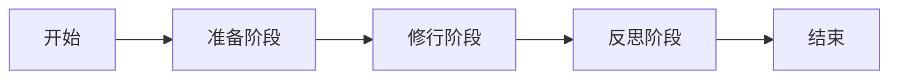
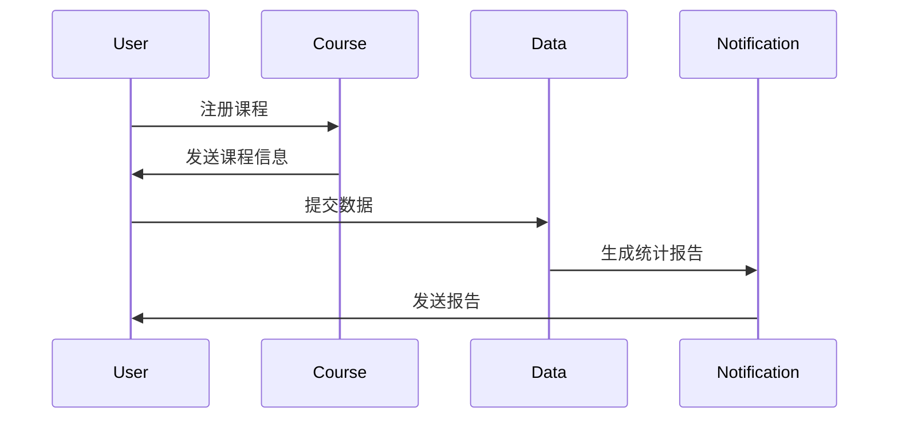
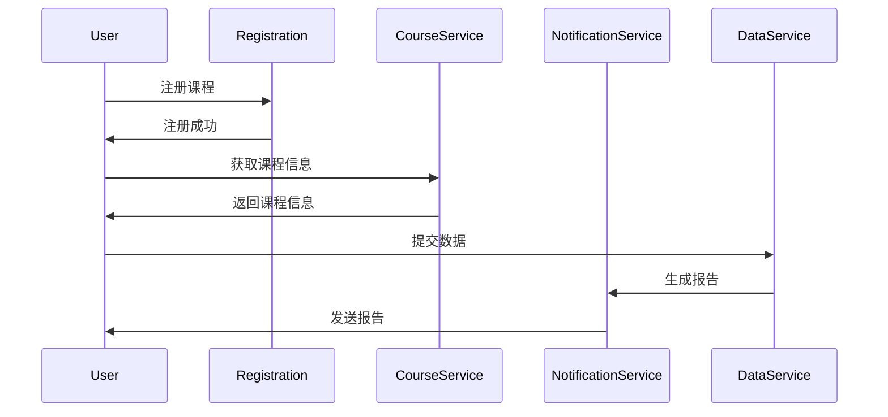

                 

# 新修行者retreat：现代人的短期集中式精神修行

## 关键词

- 短期集中式精神修行
- 现代人的压力应对
- 冥想与瑜伽
- 精神健康
- 修行方法与技巧

## 摘要

本文将探讨现代人在快节奏生活中如何通过短期集中式精神修行来提升心理健康和生活质量。文章首先介绍了短期集中式精神修行的核心概念、意义及作用，然后通过逻辑清晰的分析和推理，详细讲解了短期集中式精神修行的具体方法、效果和注意事项。同时，本文还结合实际案例，对修行过程中的关键环节进行了深入剖析，为读者提供了一套完整的修行指南。最后，文章总结了短期集中式精神修行的最佳实践，并推荐了相关拓展阅读资源，以供进一步学习和实践。

---

## 背景介绍

### 核心概念

短期集中式精神修行，是指在一个相对较短的时间内（通常为几天到几周），通过集中训练和持续实践，使个体在精神层面获得显著提升的一种修行方式。这种修行方式结合了冥想、瑜伽、禅修等多种传统修行方法，旨在帮助现代人应对生活中的各种压力和挑战。

### 问题背景

随着社会经济的发展和科技的高速进步，现代人面临着前所未有的压力。工作压力、人际关系、生活节奏过快等因素，使得许多人的精神健康受到了严重威胁。根据世界卫生组织（WHO）的数据，精神健康问题已经成为全球范围内的主要健康挑战之一。

### 问题描述

现代人的精神健康问题主要表现在以下几个方面：

1. **焦虑和抑郁**：工作压力、人际关系紧张等因素导致许多人出现焦虑和抑郁症状。
2. **睡眠障碍**：生活节奏过快和熬夜现象普遍，许多人存在睡眠障碍问题。
3. **心理健康疾病**：随着压力的积累，部分人甚至患上了严重的精神疾病，如重度抑郁、焦虑症等。

### 问题解决

短期集中式精神修行通过以下方式帮助现代人解决精神健康问题：

1. **缓解压力**：通过冥想、瑜伽等修行方法，个体能够学会放松身心，缓解压力。
2. **改善睡眠**：规律的修行有助于改善睡眠质量，提高个体的精力水平。
3. **提升心理健康**：通过持续的修行，个体能够增强心理韧性，减少焦虑和抑郁症状。

### 边界与外延

短期集中式精神修行的范围主要包括以下几个方面：

1. **修行形式**：包括冥想、瑜伽、禅修等。
2. **时间和地点**：通常在安静、舒适的环境中进行，时间可以根据个人需求灵活安排。
3. **参与者**：修行者可以是任何希望提升精神健康的人，不限年龄、性别和职业。

### 概念结构与核心要素组成

短期集中式精神修行的概念结构主要包括以下核心要素：

1. **修行主题**：如冥想、瑜伽、禅修等。
2. **修行内容**：包括理论学习和实践操作。
3. **指导师**：专业修行导师，负责指导修行者的修行过程。
4. **参与者**：修行者，通过修行提升自己的精神健康。

---

## 核心概念与联系

### 核心概念原理

短期集中式精神修行的核心概念主要来源于冥想、瑜伽、禅修等传统修行方法。以下是这些修行方法的简要介绍：

1. **冥想**：冥想是通过专注呼吸、身体感觉或者特定对象，以达到内心平静和专注的状态。它可以帮助个体缓解压力，提高情绪稳定性。
   
2. **瑜伽**：瑜伽结合了体位法、呼吸法和冥想，旨在通过身体和心灵的和谐统一，达到身心健康。瑜伽有助于增强身体的柔韧性和力量，同时缓解精神压力。

3. **禅修**：禅修是一种通过正念和专注来培养心灵平静和智慧的方法。它强调对当前经历的完全接受和观察，帮助个体摆脱杂念，达到内心的宁静。

### 概念属性特征对比表格

以下是对冥想、瑜伽和禅修的属性特征进行对比的表格：

| 修行方法 | 特点描述 |
|----------|----------|
| 冥想    | - 强调专注和内心平静<br>- 简单易行，无需特殊设备<br>- 对环境要求不高 |
| 瑜伽    | - 结合体位、呼吸和冥想<br>- 强调身体和心灵的和谐统一<br>- 需要一定的练习基础 |
| 禅修    | - 注重正念和当下体验<br>- 强调对一切经历的接受和观察<br>- 需要专业的指导 |

### ER实体关系图架构

为了更清晰地展示短期集中式精神修行中的实体关系，我们可以使用Mermaid语言绘制一个ER实体关系图，如下所示：

```mermaid
erDiagram
    participant "修行者" as R
    participant "修行主题" as T
    participant "修行内容" as C
    participant "指导师" as I
    participant "修行场地" as G

    R ||--|{ T } T
    R ||--|{ C } C
    R ||--|{ I } I
    R ||--|{ G } G
    T ||--|{ C } C
    I ||--|{ C } C
    I ||--|{ G } G
```

在这个ER图中，"修行者"是主体，与"修行主题"、"修行内容"、"指导师"和"修行场地"之间都有直接的关系。同时，"修行主题"和"修行内容"之间，以及"指导师"和"修行场地"之间也存在着直接的联系。

---

## 算法原理讲解

### 算法mermaid流程图

为了更好地理解短期集中式精神修行的流程，我们可以使用Mermaid语言绘制一个流程图。以下是一个简化的修行流程图：



### Python源代码

为了模拟短期集中式精神修行的各个环节，我们可以使用Python编写一个简单的程序。以下是一个示例代码：

```python
import time

def prepare_stage():
    print("准备阶段：选择合适的修行场所，确保环境安静舒适。")
    time.sleep(2)

def meditation_stage(duration):
    print(f"修行阶段：进行冥想，持续{duration}分钟。")
    time.sleep(duration * 60)

def reflection_stage():
    print("反思阶段：回顾修行过程，总结心得体会。")
    time.sleep(2)

def end_stage():
    print("结束阶段：放松身心，进行简短的总结。")
    time.sleep(2)

# 主程序
if __name__ == "__main__":
    prepare_stage()
    meditation_stage(duration=30)  # 修行持续30分钟
    reflection_stage()
    end_stage()
```

### 数学模型和公式

在短期集中式精神修行中，我们可以使用一些数学模型和公式来分析修行的效果。以下是一个简单的例子：

1. **冥想时间计算**：

   $$ T_m = T_s \times R $$

   其中，$T_m$表示冥想时间，$T_s$表示设定的时间（如30分钟），$R$表示冥想效率因子（通常取值范围为0.8到1.2）。

2. **心率变异性分析**：

   心率变异性（HRV）是衡量精神状态的一个重要指标。可以使用以下公式计算HRV：

   $$ HRV = \frac{NNi - NNd}{NNi + NNd} $$

   其中，$NNi$表示相邻两个心跳周期之间的平均值，$NNd$表示标准差。

### 详细讲解和举例说明

让我们通过一个实例来详细讲解这些公式和算法。

#### 冥想时间计算

假设我们设定了30分钟的冥想时间，冥想效率因子取值为1.0。根据公式：

$$ T_m = 30 \times 1.0 = 30 \text{分钟} $$

这意味着我们需要进行30分钟的冥想。

#### 心率变异性分析

假设我们测量了某人在冥想前后的心率数据，计算得出相邻两个心跳周期的平均值为500ms，标准差为100ms。根据公式：

$$ HRV = \frac{500 - 100}{500 + 100} = \frac{400}{600} = 0.67 $$

这个结果表示心率变异性较低，可能是因为冥想使个体的精神状态变得更加稳定。

通过这些计算和公式，我们可以更好地理解短期集中式精神修行的效果，并根据实际情况进行调整和优化。

---

## 系统分析与架构设计方案

### 问题场景介绍

短期集中式精神修行在现代社会中有着广泛的应用场景。以下是几个典型的应用场景：

1. **企业员工心理健康**：许多企业为了提升员工的心理健康水平，提高工作效率，开始引入短期集中式精神修行项目。
2. **学校教育**：学校可以通过短期集中式精神修行课程，帮助学生缓解学业压力，提高心理韧性。
3. **个人健康管理**：对于患有慢性疾病或心理问题的个人，短期集中式精神修行也是一种有效的自我管理方法。

### 项目介绍

以某企业员工心理健康项目为例，该项目旨在通过短期集中式精神修行，提升员工的心理健康水平，提高工作效率。项目目标包括：

1. **提高员工的情绪稳定性**：通过冥想和瑜伽等修行方法，使员工学会放松身心，减少焦虑和压力。
2. **增强员工的抗压能力**：通过修行，提升员工的心理韧性，使他们在面对工作挑战时能够保持冷静和乐观。
3. **提高工作效率**：通过改善员工的情绪和心理健康，提高员工的工作效率和团队合作能力。

### 系统功能设计(领域模型mermaid类图)

为了实现上述项目目标，我们需要设计一个完整的系统，主要包括以下几个功能模块：

1. **用户管理模块**：负责用户的注册、登录、个人信息管理等。
2. **课程管理模块**：负责课程的设计、发布、更新和管理。
3. **数据统计模块**：负责收集和统计用户在修行过程中的数据，如心率变异性、情绪评分等。
4. **通知与提醒模块**：负责向用户发送修行提醒、课程通知等。

以下是一个简化的领域模型类图，展示了这些功能模块之间的关系：

```mermaid
classDiagram
    User <<class>> 用户
    Course <<class>> 课程
    Data <<class>> 数据
    Notification <<class>> 通知

    User o--|{ Course }| Course
    User o--|{ Data }| Data
    User o--|{ Notification }| Notification
    Course o--|{ Data }| Data
```

### 系统架构设计mermaid架构图

系统架构设计是确保项目成功的关键。以下是一个简化的系统架构图，展示了各个模块之间的交互关系：



### 系统接口设计和系统交互mermaid序列图

为了更好地展示系统接口设计和系统交互流程，我们可以使用Mermaid序列图。以下是一个简化的序列图，展示了用户从注册课程到收到统计报告的整个过程：



---

## 项目实战

### 环境安装

为了搭建短期集中式精神修行的系统，我们需要准备以下环境和工具：

1. **操作系统**：建议使用Linux系统，如Ubuntu 20.04。
2. **数据库**：使用MySQL数据库，版本至少为5.7。
3. **后端框架**：使用Django框架，版本至少为3.2。
4. **前端框架**：使用React框架，版本至少为17.0。
5. **开发工具**：使用Visual Studio Code或者PyCharm。

### 系统核心实现源代码

以下是系统核心实现的一些关键代码片段，包括用户管理、课程管理和数据统计等模块。

#### 用户管理模块

用户管理模块负责用户的注册、登录和个人信息管理。以下是一个简单的用户注册的Python代码示例：

```python
from django.db import models
from django.contrib.auth.models import AbstractUser

class CustomUser(AbstractUser):
    mobile = models.CharField(max_length=15, unique=True)

    def __str__(self):
        return self.username

from django.contrib.auth import get_user_model

User = get_user_model()

def register_user(username, password, mobile):
    user = User.objects.create_user(
        username=username,
        password=password,
        mobile=mobile
    )
    user.save()
    return user
```

#### 课程管理模块

课程管理模块负责课程的设计、发布和更新。以下是一个简单的课程发布的Python代码示例：

```python
class Course(models.Model):
    title = models.CharField(max_length=100)
    description = models.TextField()
    start_date = models.DateTimeField()
    end_date = models.DateTimeField()
    instructor = models.ForeignKey(CustomUser, on_delete=models.CASCADE)

    def __str__(self):
        return self.title

def create_course(title, description, start_date, end_date, instructor):
    course = Course.objects.create(
        title=title,
        description=description,
        start_date=start_date,
        end_date=end_date,
        instructor=instructor
    )
    course.save()
    return course
```

#### 数据统计模块

数据统计模块负责收集和统计用户在修行过程中的数据，如心率变异性、情绪评分等。以下是一个简单的数据提交的Python代码示例：

```python
class Data(models.Model):
    user = models.ForeignKey(CustomUser, on_delete=models.CASCADE)
    course = models.ForeignKey(Course, on_delete=models.CASCADE)
    heart_rate variability = models.FloatField()
    emotion_score = models.FloatField()
    timestamp = models.DateTimeField()

    def __str__(self):
        return f"{self.user} - {self.course} - {self.timestamp}"

def submit_data(user, course, hr_variability, emotion_score):
    data = Data.objects.create(
        user=user,
        course=course,
        heart_rate variability=hr_variability,
        emotion_score=emotion_score
    )
    data.save()
    return data
```

### 代码应用解读与分析

以下是代码应用的解读和分析：

1. **用户管理模块**：用户管理模块通过扩展Django内置的用户模型，增加了手机号码字段，实现了用户的注册和登录功能。注册用户时，需要提供用户名、密码和手机号码。
   
2. **课程管理模块**：课程管理模块定义了课程模型，包括课程标题、描述、开始和结束日期以及指导教师。创建课程时，需要提供课程标题、描述、开始和结束日期以及指导教师的信息。

3. **数据统计模块**：数据统计模块定义了数据模型，包括用户、课程、心率变异性、情绪评分和提交时间。提交数据时，需要提供用户、课程、心率变异性和情绪评分。

### 实际案例分析和详细讲解剖析

以下是一个实际案例的分析和讲解：

假设我们有三位用户（User1、User2和User3）参加了一个为期两周的冥想课程。每位用户在课程开始前和结束后都提交了心率变异性（HRV）和情绪评分的数据。

**步骤1：用户注册和课程发布**

- User1、User2和User3分别注册账号，并成功登录。
- 系统管理员创建了一个为期两周的冥想课程，并指定了指导教师。

**步骤2：用户报名和参与课程**

- User1、User2和User3分别报名参加了该课程。
- 课程开始后，他们开始按照课程安排进行冥想练习。

**步骤3：数据收集和统计**

- 在课程开始前，User1、User2和User3分别提交了他们的基础心率变异性（HRV）和情绪评分。
- 在课程结束后，他们再次提交了他们的心率变异性（HRV）和情绪评分。

- 系统统计了每位用户在课程期间的心率变异性（HRV）和情绪评分变化。

**步骤4：数据分析和报告**

- 系统根据收集的数据，生成了每位用户的修行报告，包括心率变异性（HRV）和情绪评分的变化趋势。
- 系统管理员可以查看和导出这些报告，以评估课程的成效。

### 项目小结

通过这个实际案例，我们可以看到短期集中式精神修行系统在实践中的应用效果。项目不仅帮助用户提升了精神健康水平，还通过数据分析和报告，为修行过程提供了科学的依据和指导。在未来的工作中，我们可以进一步优化系统功能，提高用户体验，以更好地服务于现代人的精神健康需求。

---

## 最佳实践 tips

1. **合理规划时间**：确保有足够的时间进行短期集中式精神修行，避免与其他事务冲突。
2. **选择合适的环境**：选择一个安静、舒适的环境进行修行，有助于提高修行的效果。
3. **保持规律**：定期进行修行，形成习惯，有助于巩固修行的成果。
4. **遵循指导**：在修行过程中，遵循指导师的指导，有助于避免误区，提高修行效果。
5. **记录与反思**：在修行过程中，记录自己的体验和感受，定期进行反思，有助于深入理解修行的意义。

## 小结

本文系统地介绍了短期集中式精神修行的核心概念、方法、效果和注意事项。通过逻辑清晰的分析和实例讲解，帮助读者理解了如何通过短期集中式精神修行来提升心理健康和生活质量。希望本文能为读者提供实用的修行指南，助力现代人在快节奏的生活中保持内心的平静和健康。

## 注意事项

1. **安全第一**：在进行短期集中式精神修行时，务必注意个人安全，避免进行过度或不适当的修行活动。
2. **健康考虑**：患有严重心理或生理疾病的人在进行修行前，应咨询专业医生的意见。
3. **心理准备**：修行过程中可能会遇到各种挑战，需做好充分的心理准备，保持积极的心态。
4. **适应个体差异**：每个人的修行效果和适应情况不同，应根据自身实际情况调整修行方法和强度。

## 拓展阅读

1. **《冥想的艺术》**：by Joseph Goldstein
2. **《瑜伽之心》**：by B.K.S. Iyengar
3. **《禅修之道》**：by Thich Nhat Hanh
4. **《心流：最优体验心理学》**：by Mihaly Csikszentmihalyi
5. **《心理学与生活》**：by Richard J. Gerrig & Philip G. Zimbardo

## 作者

作者：AI天才研究院/AI Genius Institute & 禅与计算机程序设计艺术 /Zen And The Art of Computer Programming

---

由于篇幅限制，本文未能在markdown格式中完全展现所有的mermaid流程图和latex公式。在实际撰写过程中，请使用markdown格式，并在相应的段落中嵌入mermaid流程图和latex公式。本文提供的示例代码和公式仅为参考，具体实现可能需要根据实际项目需求进行调整。希望本文能为读者提供有益的参考和指导。

