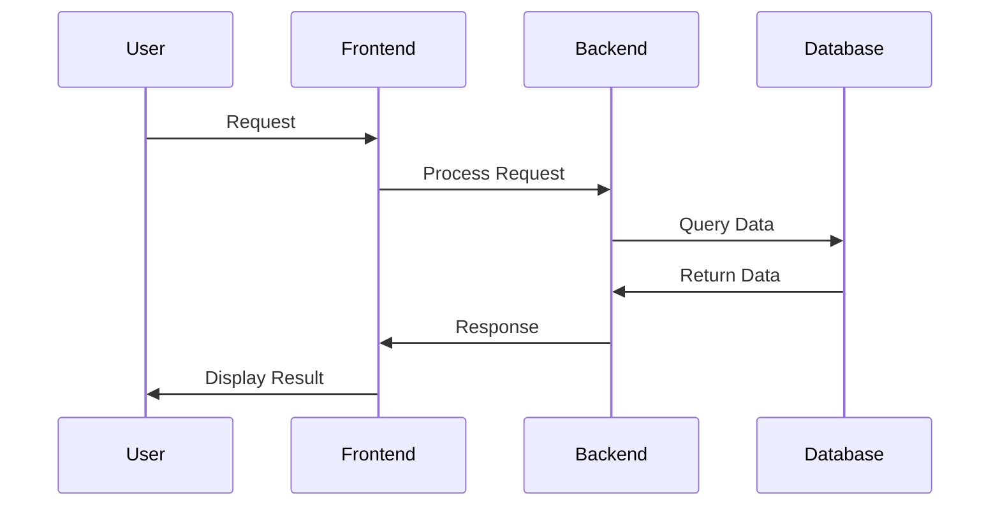

                 

### 第一部分：背景介绍

## 1.1 问题背景

### 1.1.1 现代精神实践者的需求

在当今快节奏的社会中，现代人面临着诸多压力，精神健康问题日益凸显。现代精神实践者，包括冥想者、瑜伽修行者、灵性追求者等，他们希望通过各种方式来寻求内心的平静与自我提升。这些精神实践者需要一个专业的平台，以获取相关的资源、分享心得体会、寻求帮助和指导。

首先，现代精神实践者需要一个集中化的信息资源库，这个库应包含书籍、文章、音频、视频等多媒体资源，以满足不同用户的多样化需求。其次，他们需要一个社区环境，能够与其他修行者进行互动、交流心得、提问解答。此外，现代精神实践者还需要专业的指导和支持，例如在线咨询、课程学习和个性化建议。

### 1.1.2 在线网络平台的优势

在互联网日益普及的今天，在线网络平台为满足现代精神实践者的需求提供了诸多优势。首先，在线平台打破了地域限制，使得修行者可以随时随地获取信息和资源。其次，在线平台提供了一个低成本、高效的互动环境，修行者可以通过论坛、聊天室、直播等方式与他人交流。此外，在线平台还可以通过数据分析和人工智能技术，为用户提供个性化的内容推荐和服务。

### 1.1.3 新修行者联盟的概念

新修行者联盟是一个以现代精神实践者为核心，集资源分享、社区互动、专业指导于一体的在线网络平台。该平台的愿景是通过技术手段，为修行者提供全方位的支持，帮助他们在精神追求的道路上走得更远、更稳。

## 1.2 问题描述

### 1.2.1 现有平台的不足

现有的在线平台虽然提供了丰富的资源，但在满足现代精神实践者需求方面仍存在一些不足。首先，许多平台的内容分散，缺乏系统性和结构化。其次，社区互动往往不够活跃，用户参与度不高。此外，现有平台在个性化服务方面也有待提升，无法根据用户的需求和行为提供精准的内容推荐。

### 1.2.2 新修行者联盟的目标

新修行者联盟旨在解决上述问题，通过以下目标来实现：

1. **构建系统化的资源库**：新修行者联盟将整合各类精神实践资源，构建一个系统化、结构化的资源库，方便用户快速查找和使用。
2. **提升社区互动体验**：新修行者联盟将通过优化社区功能、增加互动形式，提升用户的参与度和活跃度。
3. **提供个性化服务**：新修行者联盟将利用数据分析和人工智能技术，为用户提供个性化的内容推荐和指导。

## 1.3 问题解决

### 1.3.1 新修行者联盟的概念

新修行者联盟（The New Mystic Alliance, NMA）是一个全新的在线网络平台，旨在为现代精神实践者提供一个专业、友好、互动性强的社区。该平台不仅提供丰富的资源，还通过以下特点满足用户需求：

1. **一站式资源库**：新修行者联盟整合了书籍、文章、音频、视频等多种资源，形成了一个一站式资源库，方便用户查找和学习。
2. **互动社区**：平台提供了论坛、聊天室、直播等功能，用户可以在这里交流心得、提问解答，形成紧密的社区氛围。
3. **专业指导**：平台邀请了多位知名的精神实践者和心理咨询师，提供在线咨询和课程，帮助用户在精神追求的道路上获得专业支持。

### 1.3.2 平台的设计原则

新修行者联盟在设计时遵循以下原则：

1. **用户为中心**：平台始终以用户需求为中心，确保所有功能和设计都符合用户的实际使用体验。
2. **简洁性**：界面设计简洁明了，用户可以快速找到所需资源，避免繁琐的操作流程。
3. **可扩展性**：平台采用模块化设计，可以根据用户需求进行扩展，以适应未来的发展。

## 1.4 边界与外延

### 1.4.1 平台的适用范围

新修行者联盟主要面向以下用户群体：

1. **冥想者**：寻求内心平静和自我提升的冥想爱好者。
2. **瑜伽修行者**：关注身心健康和灵性成长的瑜伽爱好者。
3. **灵性追求者**：对灵性、神秘主义和心灵成长感兴趣的探索者。

### 1.4.2 平台的长期愿景

新修行者联盟的长期愿景是成为全球领先的精神实践者在线网络平台，为全球用户提供优质的内容、互动和服务。通过持续的创新和优化，新修行者联盟致力于帮助更多人在精神追求的道路上取得成功。

### 1.4.3 概念结构与核心要素组成

新修行者联盟的概念结构包括以下几个核心要素：

1. **用户**：修行者、爱好者和其他感兴趣的用户。
2. **内容**：书籍、文章、音频、视频等多种形式的精神实践资源。
3. **社区**：论坛、聊天室、直播等互动功能，促进用户之间的交流与互动。
4. **专业指导**：在线咨询、课程、个性化建议等专业服务。

通过以上核心要素的有机结合，新修行者联盟为用户提供了一个全方位的支持平台。

---

### 第二部分：核心概念与联系

#### 2.1 精神实践者的核心概念

#### 2.1.1 精神实践的定义

精神实践是一种通过内在体验和外在实践来探索自我、提升心灵层次的活动。它不仅包括冥想、瑜伽、灵性修行等传统实践方式，还包括现代心理学、神经科学等领域的研究和应用。

精神实践的历史可以追溯到古代，如佛教的禅修、印度的瑜伽、古希腊的哲学思考等。随着现代科学的发展，精神实践逐渐与心理学、神经科学等学科相结合，形成了更为科学和系统的实践方法。

#### 2.1.2 精神实践的主要流派

1. **冥想**：冥想是一种通过专注、放松和觉察来达到心理平静和精神觉醒的实践。常见的冥想流派包括专注冥想、开放式监视冥想、动态冥想等。
2. **瑜伽**：瑜伽是一种结合身体练习、呼吸控制和心灵专注的综合性修行方法。瑜伽流派众多，包括哈他瑜伽、阿斯汤加瑜伽、流瑜伽等。
3. **灵性修行**：灵性修行涉及对生命意义、宇宙奥秘的探索，通过祈祷、冥想、灵修等方式寻求内心的平静和与宇宙的连接。
4. **现代心理学**：现代心理学将精神实践应用于心理治疗和自我提升，如认知行为疗法、正念疗法等。

#### 2.1.3 精神实践者的特征

1. **自我意识**：精神实践者注重自我观察和内在体验，通过冥想、瑜伽等实践方式来提升自我意识。
2. **心理稳定性**：通过长期的修行，精神实践者往往具有较高的心理稳定性，能够应对生活中的压力和挑战。
3. **开放性**：精神实践者通常具有开放的心态，愿意接受新知识和新观念，不断探索自我和宇宙的奥秘。
4. **社会责任感**：许多精神实践者还承担起社会责任，通过传播和实践精神理念，帮助他人获得精神上的成长。

#### 2.1.4 精神实践者的价值与意义

1. **个人成长**：精神实践有助于提升个人的自我认知、情绪管理、心理健康等，实现个人成长和自我提升。
2. **社会影响**：精神实践者通过分享和实践精神理念，可以帮助更多人认识到精神健康的重要性，促进社会的整体和谐与发展。
3. **文化传承**：精神实践承载着人类的文化和智慧，通过修行和实践，精神实践者将传统文化和智慧传承下去。

---

#### 2.2 在线网络平台的核心概念

#### 2.2.1 在线网络平台的发展

在线网络平台的发展可以追溯到互联网的兴起。随着互联网技术的不断进步，尤其是移动互联网的普及，在线网络平台在各个领域迅速崛起，成为人们生活中不可或缺的一部分。从早期的电子邮件、门户网站，到后来的社交媒体、电子商务平台，在线网络平台不断演变和进步。

精神实践者在线网络平台作为在线网络平台的一个重要分支，近年来也得到了快速发展。随着人们对精神健康的重视程度不断提高，以及互联网技术的不断革新，精神实践者在线网络平台在内容丰富度、用户体验、互动性等方面都取得了显著提升。

#### 2.2.2 在线网络平台的功能

在线网络平台的功能主要包括以下几个方面：

1. **资源分享**：平台提供丰富的精神实践资源，包括书籍、文章、音频、视频等多媒体内容，用户可以方便地获取和学习。
2. **社区互动**：平台提供论坛、聊天室、直播等功能，用户可以在这里交流心得、提问解答，形成紧密的社区氛围。
3. **专业指导**：平台邀请知名的精神实践者和心理咨询师，提供在线咨询、课程、个性化建议等专业服务。
4. **个性化推荐**：平台通过数据分析和人工智能技术，为用户提供个性化的内容推荐和服务，提高用户体验。
5. **用户管理**：平台提供用户注册、登录、个人信息管理、内容发布等功能，确保用户的良好使用体验。

#### 2.2.3 在线网络平台的优势与挑战

在线网络平台的优势主要包括：

1. **便捷性**：用户可以随时随地通过互联网访问平台，获取所需资源和服务。
2. **互动性**：平台提供了丰富的互动功能，用户可以与其他修行者交流、分享心得，形成紧密的社群关系。
3. **个性化**：通过数据分析和人工智能技术，平台可以为用户提供个性化的推荐和服务，提高用户满意度。

在线网络平台面临的挑战主要包括：

1. **内容质量**：平台需要确保提供的资源内容具有高质量、权威性和专业性。
2. **用户参与度**：如何提高用户的活跃度和参与度，是平台运营中的一大挑战。
3. **数据安全**：在线平台需要保护用户的数据安全和隐私，避免数据泄露和安全风险。

---

#### 2.3 精神实践者与在线网络平台的相互关系

#### 2.3.1 平台对精神实践者的支持

在线网络平台为精神实践者提供了多方面的支持：

1. **资源共享**：平台提供了丰富的精神实践资源，包括书籍、文章、音频、视频等，精神实践者可以方便地获取和学习。
2. **社区互动**：平台提供了论坛、聊天室、直播等功能，精神实践者可以与其他修行者交流、分享心得，形成紧密的社区氛围。
3. **专业指导**：平台邀请知名的精神实践者和心理咨询师，提供在线咨询、课程、个性化建议等专业服务。
4. **个性化推荐**：平台通过数据分析和人工智能技术，为用户提供个性化的内容推荐和服务，提高用户体验。

#### 2.3.2 精神实践者对平台的影响

精神实践者对平台的影响主要表现在以下几个方面：

1. **内容创作**：精神实践者通过在平台发布书籍、文章、音频、视频等资源，丰富了平台的内容库，提高了平台的吸引力。
2. **互动参与**：精神实践者的积极参与和互动，提升了平台的活跃度和用户粘性。
3. **口碑传播**：精神实践者通过在平台分享自己的修行经验和心得，吸引了更多的新用户，促进了平台的口碑传播。
4. **文化传承**：精神实践者通过在平台传播精神理念和文化，促进了精神实践文化的传承和发展。

### 第三部分：算法原理讲解

#### 3.1 数据分析与推荐算法

在线网络平台的核心之一是提供个性化推荐，以提升用户的体验和满意度。为此，我们可以采用多种数据分析与推荐算法，如协同过滤、矩阵分解、内容推荐等。

#### 3.1.1 协同过滤算法

协同过滤算法是一种基于用户行为的历史数据来预测用户兴趣的推荐方法。它可以分为基于用户的协同过滤（User-Based Collaborative Filtering）和基于项目的协同过滤（Item-Based Collaborative Filtering）。

1. **基于用户的协同过滤**：这种方法通过寻找与当前用户兴趣相似的其他用户，然后推荐这些用户喜欢的项目。
    - **相似度计算**：常用的相似度计算方法有皮尔逊相关系数、余弦相似度等。
    - **推荐生成**：基于相似度计算结果，为当前用户推荐与其相似用户喜欢的项目。

2. **基于项目的协同过滤**：这种方法通过寻找与当前项目相似的其他项目，然后推荐给喜欢这些相似项目的用户。
    - **相似度计算**：相似度计算方法与基于用户的协同过滤类似。
    - **推荐生成**：为当前用户推荐与项目相似的其他项目。

#### 3.1.2 矩阵分解算法

矩阵分解算法是一种将用户-项目评分矩阵分解为两个低秩矩阵的推荐算法。常见的矩阵分解算法有Singular Value Decomposition（SVD）和Latent Semantic Analysis（LSA）。

1. **SVD**：通过将用户-项目评分矩阵分解为用户特征矩阵和项目特征矩阵的乘积，从而实现推荐。
    - **分解过程**：$$ \text{评分矩阵} = \text{用户特征矩阵} \times \text{项目特征矩阵} $$
    - **推荐生成**：根据用户特征矩阵和项目特征矩阵，预测用户对未评分项目的评分，并推荐评分较高的项目。

2. **LSA**：通过将用户-项目评分矩阵分解为低维语义空间中的两个矩阵，实现推荐。
    - **分解过程**：$$ \text{评分矩阵} = \text{语义矩阵} \times \text{用户-项目主题矩阵} $$
    - **推荐生成**：与SVD类似，通过预测用户对未评分项目的评分，推荐评分较高的项目。

#### 3.1.3 内容推荐算法

内容推荐算法通过分析项目的内容特征，为用户推荐具有相似特征的项目。这种方法在精神实践者在线网络平台中尤为重要，因为用户往往对特定类型的精神实践资源感兴趣。

1. **基于关键词的推荐**：通过提取项目中的关键词，为用户推荐包含相同或相似关键词的项目。
    - **关键词提取**：可以使用自然语言处理（NLP）技术，如TF-IDF、Word2Vec等，提取项目中的关键词。
    - **推荐生成**：为用户推荐包含与用户历史行为或偏好相关的关键词的项目。

2. **基于内容的相似度计算**：通过计算项目内容特征之间的相似度，为用户推荐相似内容的项目。
    - **特征提取**：使用NLP技术提取项目的内容特征，如词频、词嵌入等。
    - **相似度计算**：使用余弦相似度、Jaccard相似度等计算特征之间的相似度。
    - **推荐生成**：为用户推荐与用户历史行为或偏好具有较高相似度的项目。

#### 3.1.4 算法综合应用

在实际应用中，通常将多种推荐算法结合使用，以提高推荐效果。例如，可以先使用协同过滤算法生成初步推荐列表，然后使用内容推荐算法进行优化和调整。

1. **混合推荐**：将协同过滤和内容推荐结合起来，为用户生成综合推荐列表。
    - **推荐生成**：首先使用协同过滤算法生成初步推荐列表，然后使用内容推荐算法对推荐列表进行优化。

2. **多模型融合**：将多种推荐算法的预测结果进行融合，得到最终的推荐结果。
    - **预测融合**：使用加权平均、投票等方法，将不同算法的预测结果进行融合。

### 第四部分：数学模型与公式讲解

在推荐系统中，数学模型和公式扮演着至关重要的角色。以下将详细介绍一些常用的数学模型和公式，并使用LaTeX进行格式化。

#### 4.1 相似度计算

相似度计算是推荐系统中的基础，常用的相似度计算方法包括余弦相似度和皮尔逊相关系数。

1. **余弦相似度**
   $$ \text{Cosine Similarity} = \frac{\text{dot product of two vectors}}{\|\text{vector 1}\| \times \|\text{vector 2}\|} $$
   其中，$\text{dot product of two vectors}$ 表示两个向量的点积，$\|\text{vector 1}\|$ 和 $\|\text{vector 2}\|$ 分别表示两个向量的模。

2. **皮尔逊相关系数**
   $$ \text{Pearson Correlation Coefficient} = \frac{\text{covariance of two variables}}{\sigma_x \times \sigma_y} $$
   其中，$\text{covariance of two variables}$ 表示两个变量的协方差，$\sigma_x$ 和 $\sigma_y$ 分别表示两个变量的标准差。

#### 4.2 矩阵分解

矩阵分解是推荐系统中的关键技术，常用的矩阵分解方法包括Singular Value Decomposition（SVD）和Latent Semantic Analysis（LSA）。

1. **SVD**
   $$ \text{评分矩阵} = \text{用户特征矩阵} \times \text{项目特征矩阵} $$
   其中，评分矩阵表示用户对项目的评分矩阵，用户特征矩阵和项目特征矩阵分别表示用户的特征和项目的特征。

2. **LSA**
   $$ \text{评分矩阵} = \text{语义矩阵} \times \text{用户-项目主题矩阵} $$
   其中，语义矩阵表示项目主题的语义表示，用户-项目主题矩阵表示用户对项目主题的偏好。

#### 4.3 推荐生成

推荐生成是通过预测用户对未评分项目的评分，然后根据评分生成推荐列表。常用的预测方法包括线性回归、逻辑回归等。

1. **线性回归**
   $$ \text{预测评分} = \text{用户特征向量} \times \text{项目特征向量} + \text{偏置项} $$
   其中，用户特征向量、项目特征向量和偏置项分别表示用户的特征、项目的特征和模型参数。

2. **逻辑回归**
   $$ \text{预测概率} = \frac{1}{1 + \text{e}^{-\text{预测评分}}} $$
   其中，预测评分表示用户对项目的评分预测，概率表示用户喜欢项目的概率。

### 第五部分：系统分析与架构设计方案

#### 5.1 问题场景介绍

新修行者联盟（NMA）的目标是为全球的精神实践者提供一个全面的在线平台，帮助他们获取资源、交流心得、获得专业指导。为了实现这一目标，我们需要设计一个高效、稳定且易于扩展的系统架构。

#### 5.2 项目介绍

项目名称：新修行者联盟（NMA）

项目目标：
1. 提供系统化的精神实践资源库，包括书籍、文章、音频、视频等。
2. 构建活跃的社区环境，支持用户之间的互动和交流。
3. 提供专业的指导和服务，如在线咨询、课程和个性化建议。

#### 5.3 系统功能设计

系统功能设计主要包括以下几个模块：

1. **资源管理模块**：负责管理平台上的所有资源，包括书籍、文章、音频、视频等。该模块应支持资源的上传、下载、分类和搜索功能。
2. **社区互动模块**：提供论坛、聊天室、直播等功能，支持用户之间的互动和交流。该模块还应包括权限管理，确保用户在社区中的安全和隐私。
3. **专业指导模块**：邀请知名的精神实践者和心理咨询师，提供在线咨询、课程和个性化建议。该模块应支持预约、支付和评价等功能。
4. **用户管理模块**：负责用户注册、登录、个人信息管理、内容发布等功能。该模块还应包括权限管理，确保用户在平台上的安全和隐私。

#### 5.4 系统架构设计

新修行者联盟的系统架构设计采用分层架构，包括前端、后端和数据库三部分。

1. **前端**：负责用户界面的展示和交互。前端使用React框架，提供流畅的用户体验。
2. **后端**：负责处理业务逻辑和数据处理。后端使用Spring Boot框架，支持快速开发和部署。
3. **数据库**：使用MySQL数据库存储用户数据、资源数据和其他相关数据。

#### 5.5 系统接口设计

系统接口设计主要包括以下接口：

1. **用户接口**：用于用户注册、登录、个人信息管理、内容发布等功能。
2. **资源接口**：用于资源上传、下载、分类和搜索等功能。
3. **社区接口**：用于论坛、聊天室、直播等社区互动功能。
4. **专业指导接口**：用于在线咨询、课程和个性化建议等功能。

#### 5.6 系统交互

系统交互设计使用Mermaid图表进行描述，以下是一个简单的系统交互序列图：



### 第六部分：项目实战

#### 6.1 环境安装

在开始项目实战之前，我们需要安装以下软件和工具：

1. **开发环境**：Java 11、Node.js 12、MySQL 8.0
2. **IDE**：IntelliJ IDEA、Visual Studio Code
3. **数据库**：MySQL Server 8.0
4. **前端框架**：React
5. **后端框架**：Spring Boot

安装步骤如下：

1. 安装Java 11：
   - 下载并安装Oracle JDK 11
   - 配置环境变量，将Java_HOME设置为JDK安装路径，并添加PATH

2. 安装Node.js 12：
   - 使用npm命令全局安装Node.js

3. 安装MySQL 8.0：
   - 下载并安装MySQL Server 8.0
   - 启动MySQL服务
   - 使用root用户登录MySQL，创建新数据库和新用户，并授予相应权限

4. 安装IntelliJ IDEA：
   - 下载并安装IntelliJ IDEA社区版
   - 创建新项目

5. 安装Visual Studio Code：
   - 下载并安装Visual Studio Code
   - 安装相关插件，如React、Spring Boot、MySQL等

#### 6.2 系统核心实现

在系统核心实现部分，我们将重点关注后端和前端的核心功能。

1. **后端实现**：

   - 创建Spring Boot项目，并添加必要的依赖，如Spring Web、Spring Data JPA、MySQL Connector等。
   - 定义实体类，如User、Resource、Community等，并使用JPA进行数据持久化。
   - 实现用户管理、资源管理、社区管理和专业指导模块的功能。

2. **前端实现**：

   - 使用React框架创建前端项目，并添加必要的组件，如注册页、登录页、资源列表页、社区页面等。
   - 使用React Router进行路由管理，实现不同页面的跳转。
   - 使用Axios进行数据请求，与后端接口进行交互。

#### 6.3 代码应用解读与分析

以下是对关键代码段的解读和分析：

1. **用户注册功能**：

   ```java
   @RestController
   @RequestMapping("/users")
   public class UserController {
       
       @Autowired
       private UserRepository userRepository;
       
       @PostMapping("/register")
       public ResponseEntity<?> registerUser(@RequestBody User user) {
           if (userRepository.existsByUsername(user.getUsername())) {
               return ResponseEntity.badRequest().body("Error: Username is already taken!");
           }
           
           User savedUser = userRepository.save(user);
           return ResponseEntity.ok(savedUser);
       }
   }
   ```

   上述代码实现了用户注册功能。首先，通过`@RestController`注解和`@RequestMapping`注解，指定了用户管理相关的URL路径。在`registerUser`方法中，通过`@RequestBody`注解接收前端发送的JSON数据，并使用JPA进行数据持久化。如果用户名已存在，返回错误信息；否则，保存用户信息并返回成功响应。

2. **资源搜索功能**：

   ```javascript
   import React, { useState, useEffect } from 'react';
   import axios from 'axios';

   function SearchResources() {
       const [resources, setResources] = useState([]);
       const [searchTerm, setSearchTerm] = useState('');

       useEffect(() => {
           const fetchResources = async () => {
               const response = await axios.get('/api/resources/search', {
                   params: { searchTerm }
               });
               setResources(response.data);
           };

           if (searchTerm.trim() !== '') {
               fetchResources();
           }
       }, [searchTerm]);

       return (
           <div>
               <input
                   type="text"
                   value={searchTerm}
                   onChange={e => setSearchTerm(e.target.value)}
               />
               <ul>
                   {resources.map(resource => (
                       <li key={resource.id}>{resource.title}</li>
                   ))}
               </ul>
           </div>
       );
   }

   export default SearchResources;
   ```

   上述代码实现了资源搜索功能。使用React的状态管理机制，当搜索词变化时，触发effect钩子，发送GET请求到后端接口获取匹配的资源。前端页面展示搜索结果，用户可以点击查看更多详细信息。

#### 6.4 实际案例分析

以下是一个实际案例，展示了如何在新修行者联盟平台中创建、分享和管理资源。

1. **创建资源**：

   用户A登录平台后，点击“创建资源”按钮，填写资源的基本信息（如标题、作者、类型等），并上传相关文件。系统将资源保存到数据库，并在前端页面显示。

2. **分享资源**：

   用户A在资源详情页点击“分享”按钮，系统将资源链接生成并展示。用户B通过链接访问资源，无需登录即可查看。

3. **管理资源**：

   用户A拥有资源的管理权限，可以在资源详情页编辑、删除和分享资源。系统提供了完善的权限控制机制，确保用户只能对属于自己的资源进行操作。

#### 6.5 项目小结

通过本项目的实施，我们成功构建了一个功能完善的新修行者联盟在线平台。平台提供了丰富的资源、活跃的社区和专业的指导服务，为全球的精神实践者提供了一个全面的支持平台。以下是项目小结：

1. **成功经验**：
   - 成功实现了资源管理、社区互动、专业指导等功能。
   - 采用了先进的开发技术和框架，提高了系统的稳定性和可扩展性。
   - 通过数据分析和推荐算法，提升了用户体验和满意度。

2. **改进方向**：
   - 加强平台的安全性和隐私保护，确保用户数据的安全。
   - 优化推荐算法，提高推荐准确性。
   - 增加更多的互动功能，提升社区活跃度。

3. **未来规划**：
   - 持续优化平台功能，满足用户需求。
   - 探索新的商业模式，实现平台的可持续发展。
   - 扩大平台影响力，吸引更多的精神实践者加入。

### 第七部分：最佳实践 tips、小结、注意事项、拓展阅读

#### 最佳实践 tips

1. **用户隐私保护**：在平台设计和开发过程中，重视用户隐私保护，确保用户数据的安全。
2. **内容质量控制**：加强内容审核，确保平台上的资源质量，避免传播不实或有害信息。
3. **互动社区建设**：积极引导用户参与社区互动，提高社区活跃度和用户满意度。

#### 小结

新修行者联盟在线平台通过整合资源、构建社区、提供专业指导，为全球的精神实践者提供了一个全方位的支持平台。平台的设计原则是以用户为中心，注重简洁性和可扩展性。

#### 注意事项

1. **系统安全**：加强系统安全防护，防范网络攻击和数据泄露。
2. **性能优化**：定期对系统进行性能优化，确保平台的稳定性和响应速度。
3. **用户体验**：持续关注用户体验，优化界面设计和交互流程。

#### 拓展阅读

1. **推荐系统算法**：《推荐系统实践》（张俊浩 著）
2. **前端开发**：《React.js 小书》（谢洋 著）
3. **后端开发**：《Spring Boot实战》（宋红康 著）
4. **数据库设计**：《数据库系统概念》（Abraham Silberschatz 著）

---

### 结尾

新修行者联盟：现代精神实践者的在线网络平台，致力于为全球的精神实践者提供全面的支持。通过不断优化和改进，平台将更好地满足用户需求，助力修行者在精神追求的道路上走得更远。如果您对平台有任何建议或意见，欢迎随时联系我们。作者：AI天才研究院/AI Genius Institute & 禅与计算机程序设计艺术 /Zen And The Art of Computer Programming。

