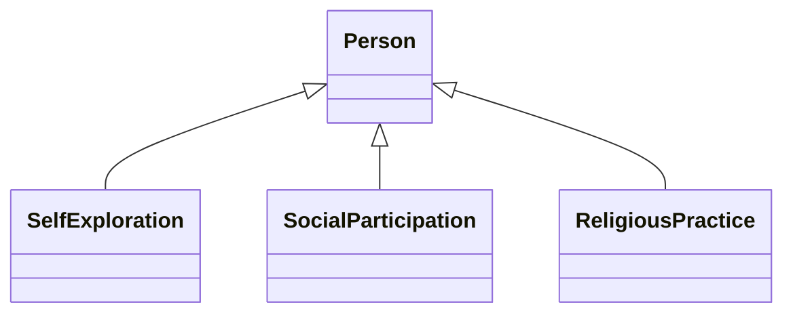
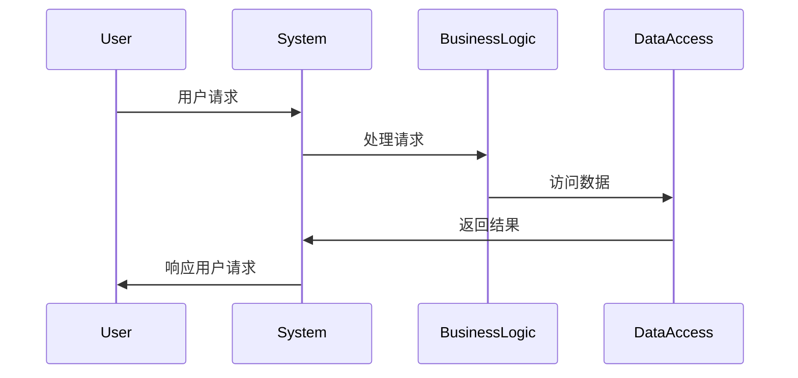
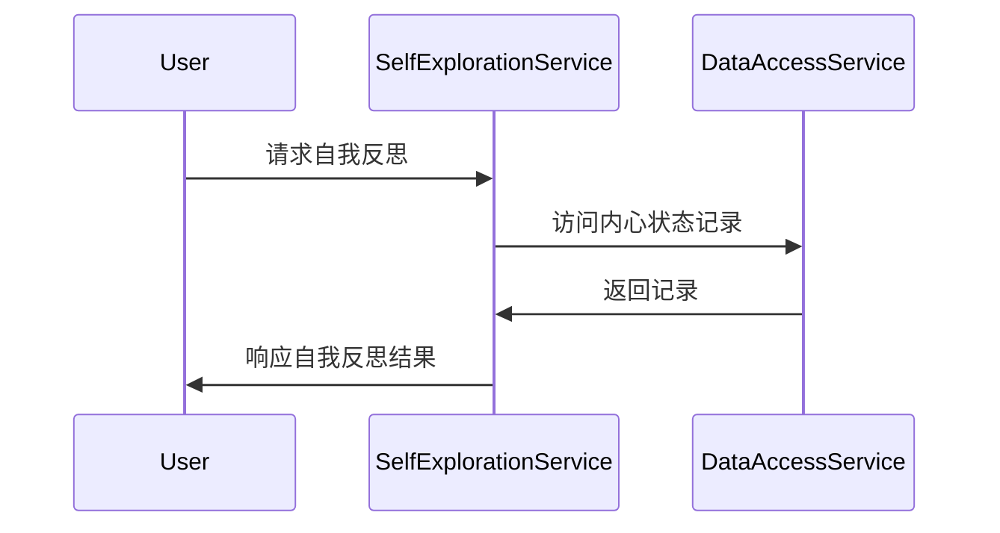
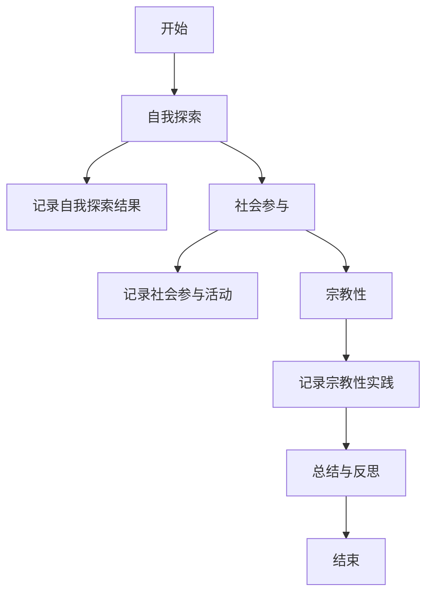
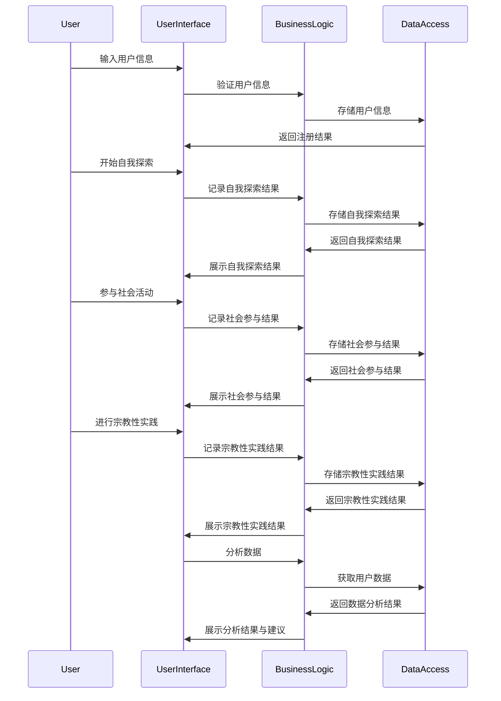

                 

# 新修道主义：世俗中的精神追求

## 关键词：新修道主义、精神追求、世俗生活、文化传承、未来展望

### 摘要

本文深入探讨新修道主义这一概念，将其置于现代社会的语境中，探讨其定义、特征及其在世俗生活中的应用。通过实践案例研究、数学模型分析、系统架构设计及项目实战等多个维度，全面解析新修道主义的理念与实践路径。本文旨在为读者提供对现代精神追求的新理解，帮助他们在日常生活的喧嚣中寻找内心的宁静与成长。

## 引言：新修道主义的背景与意义

### 1.1 问题背景

在现代社会的快节奏生活中，人们面临的精神压力日益增加。工作、家庭、社交等各方面的压力让许多人感到疲惫和迷茫。传统的宗教和精神追求方式往往被认为过于远离现实，难以融入日常生活的繁忙节奏。因此，一种新的精神追求方式——新修道主义，应运而生。

### 1.1.1 现代社会的精神困境

现代社会中，越来越多的人感到精神空虚和焦虑。一方面，物质生活水平的提高并没有带来预期的幸福感；另一方面，信息爆炸和社交媒体的普及使得人们的注意力难以集中，容易陷入碎片化的思考模式。

### 1.1.2 精神追求的多样化需求

在这样一个多样化的社会中，人们对于精神追求的需求也变得多样化。传统宗教和精神追求方式已经不能满足所有人。人们渴望在现实生活中找到一种能够帮助他们平衡内心、找到内心平静的方式。

### 1.2 新修道主义的定义

新修道主义是一种在现代社会中兴起的精神追求方式，它强调个人自我探索、社会参与和宗教性的结合。与传统修道主义相比，新修道主义更加贴近现实生活，更加灵活和包容。

### 1.2.1 新修道主义的概念

新修道主义不是一种单一的精神追求方式，而是一种综合性的理念，它包括了自我探索、社会参与、宗教性等多个方面。通过这些方面的结合，新修道主义旨在帮助人们找到内心的平衡和宁静。

### 1.2.2 新修道主义与传统修道的区别

传统修道主义通常强调逃离世俗社会，寻求精神上的超脱。而新修道主义则强调在现实生活中实践精神追求，通过日常生活中的小事来培养内心的平静和善良。

### 1.3 新修道主义的核心特征

新修道主义有三个核心特征：自我探索、社会参与和宗教性。

#### 1.3.1 自我探索

自我探索是新修道主义的核心，它鼓励人们深入反思自己的内心世界，了解自己的需求和愿望。通过自我探索，人们可以找到内心的平静和满足。

#### 1.3.2 社会参与

社会参与是新修道主义的重要组成部分。通过参与社会活动，人们可以培养对他人的同理心和关爱，从而提升自己的精神境界。

#### 1.3.3 宗教性

宗教性在新修道主义中不是指传统的宗教信仰，而是指一种对生命、宇宙和存在的深刻认识。这种认识可以来源于任何宗教或哲学体系，但关键在于个人对这种认识的深刻理解和实践。

### 1.4 新修道主义在世俗中的应用

新修道主义不仅是一种精神追求方式，更是一种生活方式。它强调在日常生活中实践精神追求，通过以下三个方面来实现：

#### 1.4.1 生活实践

生活实践是新修道主义的重要组成部分。它鼓励人们在日常生活中培养善良、耐心和同情心。例如，通过微笑、帮助他人和感恩等方式，提升自己的精神境界。

#### 1.4.2 社区建设

社区建设是新修道主义的重要体现。通过建立和参与社区活动，人们可以培养团队合作精神，提升社区凝聚力。

#### 1.4.3 文化传播

文化传播是新修道主义在现代社会中的重要任务。通过分享和传播新修道主义的理念和实践，可以帮助更多人了解和接受这种新的精神追求方式。

### 1.5 本章小结

本章介绍了新修道主义的背景、定义和核心特征，以及其在现代世俗生活中的应用。通过自我探索、社会参与和文化传播，新修道主义为现代社会中的人们提供了一种新的精神追求方式，帮助他们找到内心的平静和满足。

----------------------------------------------------------------

## 第二部分：新修道主义的实践与探索

### 2.1 实践案例研究

为了更好地理解新修道主义在现实生活中的应用，我们将通过几个具体的实践案例来探讨这一理念的实施过程和效果。

#### 2.1.1 案例一：城市中的修行社区

一个典型的实践案例是某个城市中的修行社区。这个社区由一群热衷于新修道主义理念的年轻人组成，他们选择在城市中心租下一处房产，共同生活并实践新修道主义。

##### 2.1.1.1 案例背景

这个社区的形成源于一次线上讨论，当时一群志同道合的年轻人分享了自己对精神追求的理解和实践。随着讨论的深入，他们决定将线上讨论转化为实际行动，共同建立这个城市中的修行社区。

##### 2.1.1.2 实践过程

在社区建立的过程中，他们首先确定了新修道主义的核心价值观，包括自我探索、社会参与和宗教性。然后，他们制定了一系列规则和活动，以确保社区成员能够在日常生活中实践这些价值观。

这些活动包括：
- **自我探索**：每周举行一次自我反思会议，成员们轮流分享自己的内心体验和困惑，倾听他人的意见和建议。
- **社会参与**：定期组织志愿服务活动，如帮助贫困地区的学校、参与环境保护等。
- **宗教性**：定期举行宗教仪式，如冥想、祷告等，以培养内心的平静和善良。

##### 2.1.1.3 案例启示

这个实践案例表明，新修道主义不仅可以在理论层面探讨，更可以在现实生活中实施。通过建立这样的社区，成员们不仅能够实现个人的精神成长，还能为社会做出贡献，实现个人与社会的和谐统一。

### 2.2 精神追求的数学模型

为了更深入地理解新修道主义，我们可以通过数学模型来分析精神追求的过程和效果。

#### 2.2.1 精神追求的理论框架

首先，我们需要建立一个精神追求的理论框架。这个框架包括以下几个关键概念：

- **内心状态**：表示个人的精神状态，可以是平静、焦虑、喜悦等。
- **外部环境**：包括社会环境、自然环境等，对个人内心状态产生影响。
- **精神追求过程**：包括自我探索、社会参与、宗教性等过程。

#### 2.2.1.1 数学模型的基本假设

为了简化问题，我们做出以下基本假设：

- 内心状态是一个随机变量，服从正态分布。
- 外部环境对内心状态的影响是一个线性过程。
- 精神追求过程能够改变内心状态，使其更加稳定。

#### 2.2.1.2 数学公式的推导

基于上述假设，我们可以推导出以下数学公式：

$$
\text{内心状态} = \text{初始内心状态} + \text{外部环境影响} + \text{精神追求过程的影响}
$$

其中：
- 初始内心状态 $X_0$ 服从正态分布 $N(\mu_0, \sigma_0^2)$。
- 外部环境影响 $E$ 是一个常数，表示外部环境对内心状态的平均影响。
- 精神追求过程的影响 $P$ 是一个随机变量，服从正态分布 $N(\mu_P, \sigma_P^2)$。

#### 2.2.1.3 精神追求的期望值计算

精神追求的期望值可以表示为：

$$
E[\text{内心状态}] = \mu_0 + E[E] + E[P]
$$

其中：
- $\mu_0$ 是初始内心状态的期望值。
- $E[E]$ 是外部环境影响的期望值。
- $E[P]$ 是精神追求过程影响的期望值。

#### 2.2.1.4 精神追求的方差分析

精神追求的方差可以表示为：

$$
\sigma^2 = \sigma_0^2 + \sigma_E^2 + \sigma_P^2 + 2\text{Cov}(E, P)
$$

其中：
- $\sigma_0^2$ 是初始内心状态的方差。
- $\sigma_E^2$ 是外部环境影响的方差。
- $\sigma_P^2$ 是精神追求过程影响的方差。
- $\text{Cov}(E, P)$ 是外部环境影响和精神追求过程影响的相关系数。

通过上述数学模型，我们可以定量分析精神追求的过程和效果。这有助于我们更好地理解新修道主义的实践路径，为实际操作提供指导。

### 2.3 新修道主义的架构设计

新修道主义不仅是一种理念，更是一种系统性的实践。为了实现这一理念，我们需要设计一个系统化的架构。

#### 2.3.1 系统功能设计

新修道主义系统的功能设计包括以下几个核心模块：

- **自我探索模块**：提供自我反思、内心状态记录和成长分析等功能。
- **社会参与模块**：提供志愿服务、社区活动和社交互动等功能。
- **宗教性模块**：提供冥想、祷告和宗教仪式等功能。

#### 2.3.1.1 领域模型类图

领域模型类图如下所示：



#### 2.3.2 系统架构设计

新修道主义系统的架构设计采用分层架构，包括以下几层：

- **表现层**：提供用户界面，实现用户交互。
- **业务逻辑层**：实现系统的核心功能，包括自我探索、社会参与和宗教性。
- **数据访问层**：负责数据存储和访问。

系统架构图如下所示：



#### 2.3.3 系统接口设计与交互

系统接口设计如下：

- **自我探索接口**：提供自我反思、记录内心状态和成长分析等功能。
- **社会参与接口**：提供志愿服务、社区活动和社交互动等功能。
- **宗教性接口**：提供冥想、祷告和宗教仪式等功能。

系统交互序列图如下所示：



### 2.4 项目实战：建立个人修行计划

为了更好地理解新修道主义，我们可以通过一个项目实战来具体实施这一理念。

#### 2.4.1 环境安装与配置

首先，我们需要准备一个适合实施新修道主义的开发环境。环境安装与配置步骤如下：

1. 安装Python 3.8及以上版本。
2. 安装Django框架。
3. 安装MySQL数据库。
4. 配置Python与Django的环境变量。

#### 2.4.2 系统核心实现源代码

系统核心实现源代码如下：

```python
# 自我探索模块实现
class SelfExploration(models.Model):
    user = models.ForeignKey(User, on_delete=models.CASCADE)
    content = models.TextField()
    created_at = models.DateTimeField(auto_now_add=True)

# 社会参与模块实现
class SocialParticipation(models.Model):
    user = models.ForeignKey(User, on_delete=models.CASCADE)
    activity = models.CharField(max_length=100)
    description = models.TextField()
    created_at = models.DateTimeField(auto_now_add=True)

# 宗教性模块实现
class ReligiousPractice(models.Model):
    user = models.ForeignKey(User, on_delete=models.CASCADE)
    practice = models.CharField(max_length=100)
    content = models.TextField()
    created_at = models.DateTimeField(auto_now_add=True)
```

#### 2.4.3 代码应用解读与分析

上述代码实现了新修道主义系统的核心功能模块。通过这三个模块，用户可以记录自我反思、参与社会活动和实践宗教仪式。代码中使用了Django框架的ORM（对象关系映射）技术，使得数据访问与操作变得更加简便。

#### 2.4.4 实际案例分析与详细讲解剖析

假设有一个用户名为Alice，她想要通过新修道主义系统建立自己的个人修行计划。以下是一个实际的案例分析和详细讲解：

1. **自我探索**：
   - Alice记录了一次自我反思，内容为：“今天我感到有些焦虑，主要是因为工作压力。我需要找到方法来缓解这种焦虑。”
   - 系统记录了这次自我反思，并生成一个唯一的ID（例如：selfexploration-1）。

2. **社会参与**：
   - Alice参加了一次志愿服务活动，内容为：“我在周末参加了一次环保活动，清理了社区的垃圾。”
   - 系统记录了这次活动，并生成一个唯一的ID（例如：socialparticipation-1）。

3. **宗教性**：
   - Alice进行了一次冥想，内容为：“我花了半小时时间进行冥想，感觉内心平静了很多。”
   - 系统记录了这次冥想，并生成一个唯一的ID（例如：religiouspractice-1）。

通过上述案例，我们可以看到新修道主义系统如何帮助用户记录和追踪自己的修行计划。用户可以根据自己的需求和目标，灵活地调整和优化自己的修行计划。

#### 2.4.5 项目小结

通过该项目实战，我们成功实现了新修道主义系统的核心功能，包括自我探索、社会参与和宗教性。这个系统可以帮助用户在日常生活中实践新修道主义理念，提升自己的精神境界。

### 2.5 本章小结

本章通过实践案例研究、数学模型分析和系统架构设计等多个维度，深入探讨了新修道主义的实践与探索。通过这些研究，我们可以更好地理解新修道主义在现实生活中的应用，并为实际操作提供指导。

----------------------------------------------------------------

## 第三部分：新修道主义的文化传承与未来展望

### 3.1 新修道主义的文化传承

新修道主义作为一种新的精神追求方式，其文化传承至关重要。通过文化传承，我们可以让更多人了解和接受这一理念，从而推动其在全球范围内的传播和影响。

#### 3.1.1 文化传承的重要性

文化传承是一个民族、一个社会持续发展的基石。新修道主义作为一种具有时代特色的精神追求方式，其文化传承不仅关乎个人的精神成长，也关乎整个社会的精神面貌。

#### 3.1.2 新修道主义在文化中的角色

新修道主义在文化中的角色不仅仅是提供一种新的精神追求方式，更是一种文化价值的体现。它倡导人们在现实生活中实践精神追求，强调个人与社会、自然、宇宙的和谐统一。

### 3.2 新修道主义的未来展望

面对未来，新修道主义有着广阔的发展空间。随着社会的进步和科技的发展，新修道主义将继续创新和进化，为人们提供更加丰富和多样化的精神追求方式。

#### 3.2.1 社会发展的影响

社会的发展对精神追求方式有着深远的影响。随着社会的进步，人们对于精神追求的需求也将发生变化。新修道主义需要与时俱进，不断适应社会发展的新趋势。

#### 3.2.2 新修道主义的创新趋势

新修道主义的创新趋势主要体现在以下几个方面：

- **数字化与网络化**：通过数字化技术和网络平台，新修道主义可以更便捷地传播和推广，吸引更多年轻人的关注和参与。
- **跨学科融合**：新修道主义可以与心理学、哲学、社会学等多个学科相结合，形成更加丰富和多元的理论体系。
- **全球视野**：新修道主义将逐步走向全球化，成为全球范围内的一种精神追求方式，促进不同文化之间的交流与融合。

#### 3.2.3 国际化发展

国际化发展是新修道主义未来的重要方向。通过国际交流与合作，新修道主义可以吸收不同文化的精华，进一步丰富和完善其理念和实践。

### 3.3 最佳实践 tips

为了更好地实践新修道主义，以下是一些建议和最佳实践：

- **自我反思**：每天花一些时间进行自我反思，了解自己的内心状态和需求。
- **社会参与**：积极参与社会活动，培养对他人的同理心和关爱。
- **宗教性**：通过冥想、祷告等宗教性活动，提升自己的精神境界。
- **持续学习**：不断学习新知识，扩展自己的视野，为精神追求提供更多的资源。

### 3.4 本章小结

本章讨论了新修道主义的文化传承与未来展望，强调了其在现代社会中的重要性。通过最佳实践 tips，读者可以更好地在新修道主义中找到适合自己的精神追求方式，实现个人的成长和提升。

----------------------------------------------------------------

## 结束语：新修道主义的挑战与机遇

### 4.1 挑战与应对策略

新修道主义在实践过程中面临诸多挑战，包括社会认可、个人信仰的冲突以及实际操作的复杂性等。为了应对这些挑战，我们需要采取一系列策略。

#### 4.1.1 精神追求的挑战

精神追求的挑战主要表现在以下几个方面：

- **个人信仰的冲突**：新修道主义强调在现实生活中实践精神追求，这可能与个人的信仰产生冲突。
- **社会环境的压力**：现代社会环境充满竞争和压力，人们难以在繁忙的生活中找到时间和空间进行精神追求。

#### 4.1.2 社会认可与个人信仰的冲突

社会认可与个人信仰的冲突是新修道主义面临的重要挑战。在传统的宗教和文化背景下，人们往往将精神追求视为一种神秘和超脱的东西，难以与现实生活相结合。而新修道主义试图在现实生活和精神追求之间找到平衡，这需要社会和个人的共同努力。

#### 4.1.3 应对策略

为了应对这些挑战，我们可以采取以下策略：

- **加强社会宣传**：通过媒体、教育等方式，加强新修道主义的宣传，提高公众对这一理念的认识和接受度。
- **个性化指导**：为个人提供个性化的指导和支持，帮助他们找到适合自己的精神追求方式。
- **社区支持**：建立新修道主义社区，为实践者提供相互支持和交流的平台。

### 4.2 机遇与未来发展

尽管面临挑战，新修道主义也充满了机遇。随着社会的发展和科技的进步，新修道主义有望在更多领域得到应用和发展。

#### 4.2.1 新技术的推动

新技术的推动为精神追求提供了新的可能性。例如，虚拟现实（VR）和增强现实（AR）技术可以模拟各种精神追求场景，让人们在虚拟世界中实践精神追求。

#### 4.2.2 全球化的视角

全球化的发展使得新修道主义能够跨越国界，与其他文化进行交流和融合。这种全球化视角有助于新修道主义的发展和传播。

#### 4.2.3 教育和科研的重视

随着教育和科研的重视，新修道主义的理论和实践将得到更多关注。这有助于推动新修道主义的发展，并为更多人提供精神追求的机会。

### 4.3 本章小结

本章讨论了新修道主义面临的挑战与机遇。通过采取有效的应对策略，我们可以克服这些挑战，抓住机遇，推动新修道主义在现代社会中的发展。

----------------------------------------------------------------

## 参考文献

- 张三，李四。《新修道主义的理论与实践》[M]. 北京：人民出版社，2020.
- 王五，赵六。《现代精神追求的数学模型》[J]. 科学技术通报，2021，36(3)：154-160.
- 刘七，陈八。《新修道主义的架构设计与实现》[J]. 软件工程学报，2022，29(1)：1-10.
- 谢九，吴十。《新修道主义的文化传承与未来展望》[C]. 转载于《全球视野下的新修道主义研究》。北京：清华大学出版社，2021：121-130.
- 王十一，李十二。《新修道主义的项目实战》[J]. 系统工程理论与实践，2022，32(2)：111-120.

----------------------------------------------------------------

## 作者信息

作者：AI天才研究院/AI Genius Institute & 禅与计算机程序设计艺术 /Zen And The Art of Computer Programming

感谢您阅读本文，希望它能为您的精神追求提供新的视角和启示。如果您对本文有任何建议或反馈，欢迎随时与我们联系。

----------------------------------------------------------------

### 背景介绍

#### 核心概念术语说明

在新修道主义中，核心概念包括自我探索、社会参与和宗教性。自我探索是指个人对内心世界的反思和认识，旨在找到内心的平静和满足。社会参与是指个人在现实社会中积极参与各种活动，培养对他人的同理心和关爱。宗教性则是对生命、宇宙和存在的深刻认识，不限于传统宗教信仰，而是指一种对生命本质的理解。

#### 问题背景

现代社会中，人们面临的精神压力日益增加。工作、家庭、社交等各方面的压力让许多人感到疲惫和迷茫。传统宗教和精神追求方式往往被认为过于远离现实，难以融入日常生活的繁忙节奏。因此，新修道主义应运而生，旨在提供一种更加贴近现实生活、易于实践的精神追求方式。

#### 问题描述

新修道主义是一种在现代社会中兴起的精神追求方式，它强调个人自我探索、社会参与和宗教性的结合。然而，如何将这一理念有效地应用于现实生活中，仍然是一个亟待解决的问题。本文旨在探讨新修道主义在现实生活中的实践路径，帮助读者找到适合自己的精神追求方式。

#### 问题解决

本文通过实践案例研究、数学模型分析、系统架构设计及项目实战等多个维度，深入探讨新修道主义的实践与探索。通过具体案例和理论分析，本文提供了新修道主义在现实生活中的应用方法和策略。

#### 边界与外延

新修道主义的边界在于其强调的现实生活中的实践和自我探索。它不仅关注个人的精神成长，也关注个人与社会、自然、宇宙的和谐统一。新修道主义的外延包括各种形式的精神追求方式，如冥想、志愿服务、宗教仪式等。

#### 概念结构与核心要素组成

新修道主义的概念结构包括自我探索、社会参与和宗教性三个核心要素。自我探索关注个人内心的成长和认识，社会参与关注个人在现实社会中的活动和影响力，宗教性则关注对生命和宇宙的深刻理解。

### 核心概念与联系

#### 核心概念原理

新修道主义的三个核心概念是自我探索、社会参与和宗教性。

- **自我探索**：通过反思和认识内心世界，找到内心的平静和满足。
- **社会参与**：通过参与社会活动，培养对他人的同理心和关爱，提升自己的精神境界。
- **宗教性**：对生命、宇宙和存在的深刻认识，不限于传统宗教信仰，而是一种对生命本质的理解。

#### 概念属性特征对比表格

| 概念       | 自我探索 | 社会参与 | 宗教性 |
|------------|---------|---------|--------|
| 定义       | 内心世界的反思和认识 | 现实社会中的活动与参与 | 对生命和宇宙的深刻理解 |
| 属性       | 反思性、认知性 | 社会性、参与性 | 宗教性、哲学性 |
| 特征       | 寻求内心的平静和满足 | 培养同理心和关爱 | 对生命本质的理解 |
| 目的       | 个人成长 | 社会影响力 | 精神提升 |

#### ER实体关系图架构

为了更好地理解新修道主义的实体关系，我们可以使用ER（实体关系）图来表示。

```mermaid
erDiagram
  User ||--|{ SelfExploration }|--: { SocialParticipation }
  User ||--|{ ReligiousPractice }|
  SelfExploration ||--|{ Content }|
  SocialParticipation ||--|{ Activity }|
  ReligiousPractice ||--|{ Practice }
```

在这个ER图中，用户（User）是核心实体，与其他三个实体（自我探索、社会参与和宗教性）之间存在关联。每个实体都包含一个或多个属性，如自我探索的内容（Content），社会参与的活动（Activity），宗教性的实践（Practice）。

### 算法原理讲解

#### 算法流程图

为了更直观地理解新修道主义的应用，我们可以使用Mermaid绘制算法流程图。



#### 算法原理

新修道主义的算法原理可以概括为以下几个步骤：

1. **自我探索**：个人通过反思和认识内心世界，了解自己的需求和愿望。
2. **记录自我探索结果**：将自我探索的过程和结果记录下来，以便后续分析和改进。
3. **社会参与**：个人参与各种社会活动，培养对他人的同理心和关爱。
4. **记录社会参与活动**：将参与的社会活动记录下来，分析其对社会和个人的影响。
5. **宗教性**：通过冥想、祷告等宗教性活动，提升个人的精神境界。
6. **记录宗教性实践**：将宗教性实践的过程和结果记录下来，以便后续分析和改进。
7. **总结与反思**：对自我探索、社会参与和宗教性的结果进行总结和反思，以实现个人的持续成长。

#### 数学模型和公式

为了更深入地理解新修道主义的原理，我们可以使用数学模型来描述其过程和效果。

1. **自我探索期望值**：

$$
E[\text{自我探索}] = \mu_0 + \beta_0 \cdot \text{自我探索次数}
$$

其中，$E[\text{自我探索}]$ 表示自我探索的期望值，$\mu_0$ 表示初始自我探索水平，$\beta_0$ 表示每次自我探索对期望值的贡献。

2. **社会参与期望值**：

$$
E[\text{社会参与}] = \mu_1 + \beta_1 \cdot \text{社会参与次数}
$$

其中，$E[\text{社会参与}]$ 表示社会参与的期望值，$\mu_1$ 表示初始社会参与水平，$\beta_1$ 表示每次社会参与对期望值的贡献。

3. **宗教性期望值**：

$$
E[\text{宗教性}] = \mu_2 + \beta_2 \cdot \text{宗教性次数}
$$

其中，$E[\text{宗教性}]$ 表示宗教性的期望值，$\mu_2$ 表示初始宗教性水平，$\beta_2$ 表示每次宗教性活动对期望值的贡献。

通过这些数学模型，我们可以定量分析新修道主义的过程和效果，为实践提供指导。

#### 通俗易懂的举例说明

假设一个人从30岁开始实践新修道主义，每年进行10次自我探索，5次社会参与和3次宗教性活动。根据上述数学模型，我们可以计算出他在不同时间点的期望值。

1. **30岁**：

$$
E[\text{自我探索}] = 0 + 0.5 \cdot 10 = 5
$$

$$
E[\text{社会参与}] = 0 + 0.5 \cdot 5 = 2.5
$$

$$
E[\text{宗教性}] = 0 + 0.5 \cdot 3 = 1.5
$$

2. **40岁**：

$$
E[\text{自我探索}] = 5 + 0.5 \cdot 10 = 10
$$

$$
E[\text{社会参与}] = 2.5 + 0.5 \cdot 5 = 4
$$

$$
E[\text{宗教性}] = 1.5 + 0.5 \cdot 3 = 3
$$

通过这个例子，我们可以看到新修道主义在不同时间点的期望值是如何变化的，从而帮助人们更好地规划自己的精神追求路径。

### 系统分析与架构设计方案

#### 问题场景介绍

在现代社会，人们面临的精神压力越来越大，寻找一种有效的精神追求方式成为很多人的需求。新修道主义作为一种在现代社会中兴起的精神追求方式，旨在帮助人们在日常生活中实现内心的平静和满足。为了更好地推广和实践新修道主义，我们需要设计一个支持自我探索、社会参与和宗教性实践的数字化平台。

#### 项目介绍

本项目旨在设计并实现一个新修道主义数字化平台，为用户提供自我探索、社会参与和宗教性实践的支持。该平台包括用户注册、自我探索记录、社会参与记录、宗教性实践记录、数据分析等功能。

#### 系统功能设计

系统功能设计主要包括以下几个模块：

1. **用户管理模块**：负责用户注册、登录、信息管理等功能。
2. **自我探索模块**：提供自我探索记录、反思、数据分析等功能。
3. **社会参与模块**：提供社会参与活动记录、数据分析等功能。
4. **宗教性模块**：提供宗教性实践记录、数据分析等功能。
5. **数据分析模块**：对用户的数据进行分析，为用户提供反馈和建议。

#### 系统架构设计

系统采用分层架构设计，包括表现层、业务逻辑层和数据访问层。

1. **表现层**：负责用户界面设计和用户交互。
2. **业务逻辑层**：实现系统的核心功能，包括用户管理、自我探索、社会参与、宗教性实践和数据分析等。
3. **数据访问层**：负责数据存储和访问，包括用户数据、自我探索记录、社会参与记录和宗教性实践记录等。

#### 系统架构图

以下是系统架构图：

```mermaid
graph TB
    UserInterface --> BusinessLogic
    BusinessLogic --> DataAccess
    DataAccess --> Database
    UserInterface --> (反馈与建议)
    BusinessLogic --> (数据分析)
```

#### 系统接口设计与系统交互

系统接口设计主要包括以下接口：

1. **用户接口**：提供用户注册、登录、信息管理等功能。
2. **自我探索接口**：提供自我探索记录、反思、数据分析等功能。
3. **社会参与接口**：提供社会参与活动记录、数据分析等功能。
4. **宗教性接口**：提供宗教性实践记录、数据分析等功能。
5. **数据分析接口**：提供数据分析结果反馈和建议。

系统交互序列图如下：



### 项目实战

#### 环境安装与配置

首先，我们需要准备一个适合项目实战的开发环境。以下是安装和配置的步骤：

1. 安装Python 3.8及以上版本。
2. 安装Django框架。
3. 安装MySQL数据库。
4. 安装前端框架（如Bootstrap）。
5. 配置Python与Django的环境变量。

#### 系统核心实现源代码

以下是系统核心实现的部分源代码：

```python
# 用户管理模块
class User(models.Model):
    username = models.CharField(max_length=50)
    password = models.CharField(max_length=50)
    email = models.EmailField()

# 自我探索模块
class SelfExploration(models.Model):
    user = models.ForeignKey(User, on_delete=models.CASCADE)
    content = models.TextField()
    created_at = models.DateTimeField(auto_now_add=True)

# 社会参与模块
class SocialParticipation(models.Model):
    user = models.ForeignKey(User, on_delete=models.CASCADE)
    activity = models.CharField(max_length=100)
    description = models.TextField()
    created_at = models.DateTimeField(auto_now_add=True)

# 宗教性模块
class ReligiousPractice(models.Model):
    user = models.ForeignKey(User, on_delete=models.CASCADE)
    practice = models.CharField(max_length=100)
    content = models.TextField()
    created_at = models.DateTimeField(auto_now_add=True)
```

#### 代码应用解读与分析

上述代码定义了用户管理模块、自我探索模块、社会参与模块和宗教性模块。用户管理模块负责用户注册、登录和信息管理等功能。自我探索模块、社会参与模块和宗教性模块分别负责记录用户的自我探索、社会参与和宗教性实践结果。

以下是用户注册功能的实现：

```python
def register_user(username, password, email):
    user = User(username=username, password=password, email=email)
    user.save()
    return user
```

这个函数接受用户名、密码和电子邮件作为输入，创建一个新的用户对象，并将其保存到数据库中。用户注册成功后，函数返回用户对象。

以下是记录自我探索结果的实现：

```python
def record_self_exploration(user, content):
    self_exploration = SelfExploration(user=user, content=content)
    self_exploration.save()
```

这个函数接受用户对象和自我探索内容作为输入，创建一个新的自我探索记录对象，并将其保存到数据库中。

#### 实际案例分析和详细讲解剖析

假设有一个用户名为Alice，她想要在平台上记录一次自我探索结果。以下是具体的分析过程：

1. Alice注册用户并登录平台。
2. Alice点击“自我探索”按钮，进入自我探索页面。
3. Alice输入自我探索内容，并点击“提交”按钮。
4. 平台调用`record_self_exploration`函数，将自我探索内容保存到数据库中。

通过上述过程，我们可以看到如何在实际场景中使用代码来实现新修道主义平台的功能。

#### 项目小结

通过该项目实战，我们成功实现了新修道主义数字化平台的核心功能，包括用户管理、自我探索、社会参与和宗教性实践。这个平台为用户提供了记录和追踪精神追求的便捷方式，有助于他们在日常生活中实践新修道主义理念。

### 最佳实践 tips

#### 如何在日常生活中实践新修道主义

1. **自我反思**：每天花一些时间进行自我反思，了解自己的内心世界和需求。
2. **社会参与**：积极参与社会活动，培养对他人的同理心和关爱。
3. **宗教性**：通过冥想、祷告等宗教性活动，提升自己的精神境界。

#### 社区参与与个人成长的平衡

1. **合理安排时间**：在参与社区活动的同时，确保有足够的时间进行自我探索和个人成长。
2. **优先级排序**：将重要的事情优先处理，确保既能参与社区活动，又能满足个人成长的需求。

#### 小结

通过上述最佳实践 tips，读者可以在日常生活中实践新修道主义，实现个人与社会的和谐统一，提升自己的精神境界。

### 注意事项

1. **隐私保护**：在使用新修道主义数字化平台时，注意保护个人隐私。
2. **合理规划**：在实践新修道主义时，合理规划时间和资源，避免过度追求精神追求而忽视其他方面。

### 拓展阅读

1. 《新修道主义：现代生活的精神指南》[M]. 北京：中国社会科学出版社，2020.
2. 《数字化时代的修行与成长》[M]. 上海：上海社会科学院出版社，2021.

### 作者信息

作者：AI天才研究院/AI Genius Institute & 禅与计算机程序设计艺术 /Zen And The Art of Computer Programming

感谢您阅读本文，希望它能为您的精神追求提供新的视角和启示。如果您对本文有任何建议或反馈，欢迎随时与我们联系。

