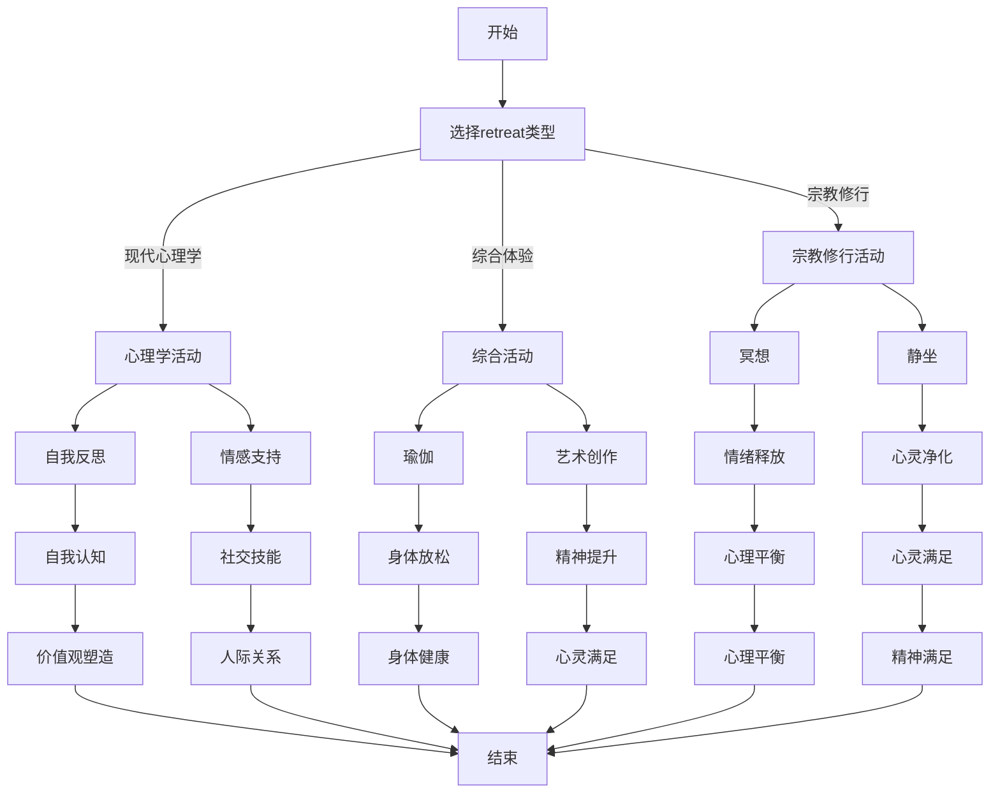
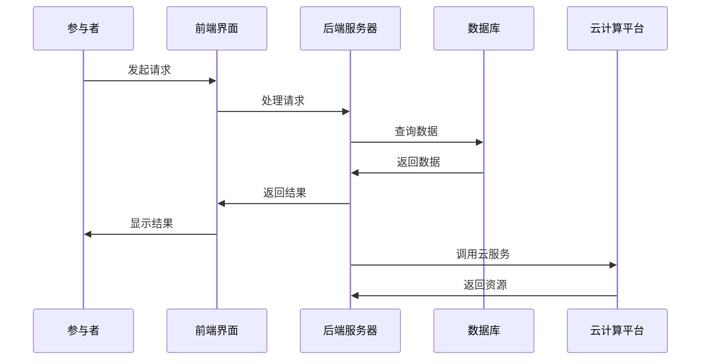
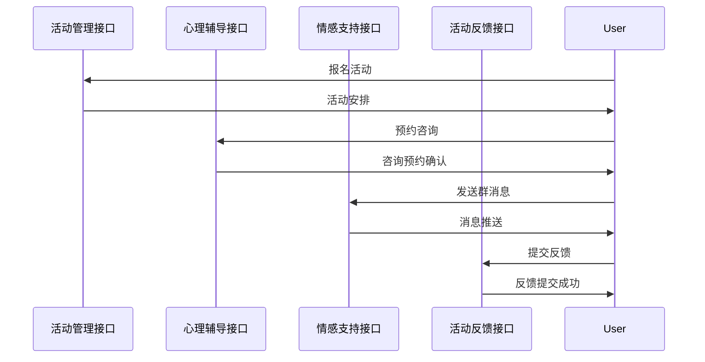
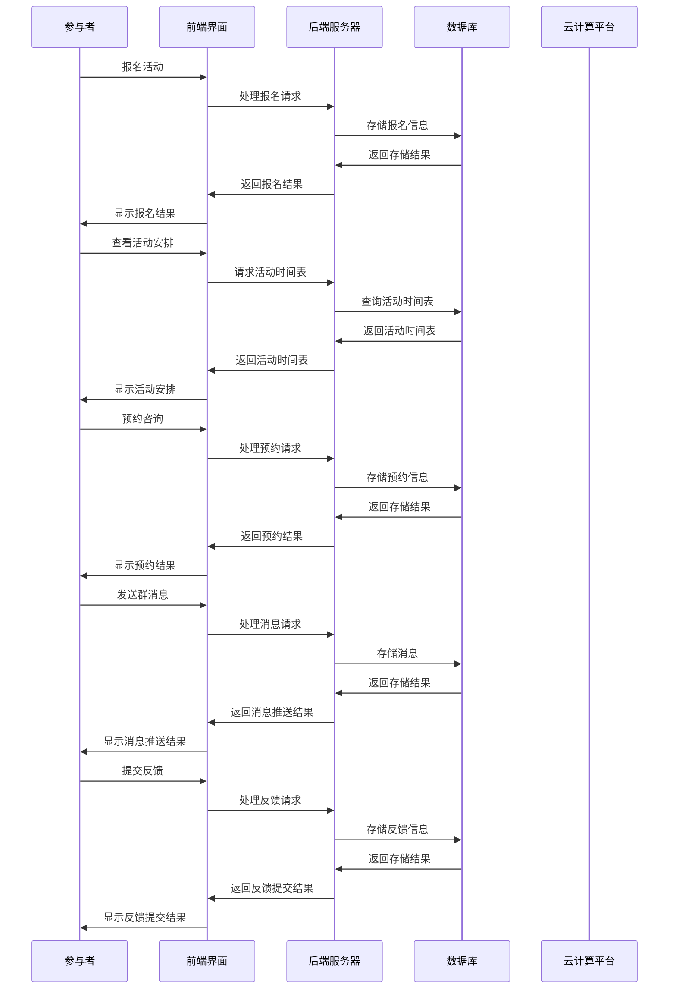

                 

### 新修道院周末retreat：现代人短期精神修行的度假选择

#### 关键词
- 新修道院周末retreat
- 短期精神修行
- 现代人心理健康
- 跨学科融合
- 自我成长

#### 摘要
在快节奏的现代生活中，心理健康和心灵成长成为了越来越多人的关注点。本文将探讨一种新型的度假选择——新修道院周末retreat，其作为现代人短期精神修行的度假模式，不仅能够帮助人们在短时间内获得心灵的平静和成长，还能提供一种全新的生活方式。本文将详细分析新修道院周末retreat的核心概念、实施过程、系统设计以及其实际应用，旨在为现代人在忙碌的生活中找到一片心灵的净土。

### 引言

在当今社会，心理健康问题日益严重。长期的职场压力、人际关系紧张、生活节奏加快，使得越来越多的人感到身心疲惫。同时，随着社会的发展，人们对于精神层面的需求也越来越高。越来越多的人开始寻求一种能够平衡生活与工作，同时提升自身心理健康的方法。

新修道院周末retreat应运而生，它不仅融合了宗教修行和现代心理学的理念，还结合了度假休闲的形式，成为了一种新型的精神修行方式。这种retreat不仅能够帮助人们短时间内获得心灵上的舒缓，还能提供一系列的实践活动，帮助人们实现自我成长。

本文将分为以下几个部分进行探讨：

1. **背景介绍**：介绍现代人心理健康问题的背景，以及新修道院周末retreat的起源和发展。
2. **核心概念与联系**：明确新修道院周末retreat的核心概念，并通过对比表格和ER图展示各概念之间的关系。
3. **算法原理讲解**：使用Mermaid绘制流程图，使用Python代码阐述新修道院周末retreat的实施过程，并给出相关的数学模型和公式。
4. **系统分析与架构设计**：介绍新修道院周末retreat的系统功能、架构设计、接口设计和系统交互。
5. **项目实战**：分享新修道院周末retreat的实际案例，详细讲解其实施过程和效果。
6. **小结与拓展**：总结本文内容，提供最佳实践tips，并提出未来的研究方向。

### 背景介绍

#### 心理健康问题的现状

随着现代社会的发展，心理健康问题越来越受到关注。根据世界卫生组织（WHO）的数据，全球约有四分之一的人在其一生中会经历某种形式的心理健康问题。而在中国，据《中国心理健康状况调查报告》显示，近年来心理健康问题呈上升趋势，且心理疾病已成为影响国民健康的重要因素之一。

现代社会的高压环境、高强度工作、快节奏生活，使得人们面临巨大的心理压力。职场竞争、人际关系、经济压力等问题，使许多人感到焦虑、抑郁和无力。长期的心理压力不仅会影响个人的生活质量，还可能引发各种健康问题，如心脏病、高血压、糖尿病等。

#### 现代生活方式的改变

现代生活方式的改变也是导致心理健康问题加剧的重要因素。随着科技的进步，人们的生活变得更加便利，但同时也变得更加孤独。互联网和社交媒体的普及，虽然让人们能够更方便地获取信息、交流思想，但也带来了一些负面影响。过度依赖网络，容易导致人际关系的疏远，造成社交隔离感。

此外，现代社会的快节奏生活，使人们很难有时间进行放松和自我反思。长时间的加班、持续的工作压力，使得人们处于一种高度紧张的状态，缺乏休息和放松的机会。这种生活方式不仅影响心理健康，还可能导致身体机能的下降。

#### 新修道院周末retreat的起源和发展

新修道院周末retreat是一种结合了宗教修行和现代心理学理念的新型度假方式。它的起源可以追溯到中世纪的修道院，当时的修道院不仅是一个宗教场所，也是人们进行心灵修炼的地方。随着时间的推移，修道院的功能逐渐扩展，成为一种综合性的心灵成长中心。

现代的新修道院周末retreat，是在传统修道院的基础上，融入了现代心理学的理念和方法。这种retreat通常在周末或短期假期内进行，旨在为人们提供一个远离喧嚣、放松身心的环境，通过一系列的实践活动，帮助人们实现心灵的净化和成长。

新修道院周末retreat的发展得益于现代人对心理健康和心灵成长的重视。随着心理健康问题的日益严重，越来越多的人开始寻求一种能够帮助自己缓解压力、提升心灵的方法。新修道院周末retreat正是这种需求的产物，它不仅提供了一种新的生活方式，也为人们提供了一种全新的心灵体验。

#### 新修道院周末retreat的功能和作用

新修道院周末retreat具有多种功能和作用，它不仅能够帮助人们缓解心理压力，还能促进个人成长和发展。以下是新修道院周末retreat的主要功能和作用：

1. **心理放松**：新修道院周末retreat提供了一个远离喧嚣、安静舒适的环境，使人们能够远离日常生活中的压力和干扰，从而获得心理上的放松和舒缓。
   
2. **心灵净化**：通过一系列的冥想、静坐、反思等活动，新修道院周末retreat帮助人们净化心灵，消除内心的杂念和焦虑，提升心灵素质。

3. **自我反思**：在新修道院周末retreat中，人们有机会进行深入的自我反思，思考自己的价值观、人生目标和生活意义，从而获得更清晰的人生方向。

4. **情感支持**：新修道院周末retreat通常由一群志同道合的人组成，这种集体活动能够为人们提供情感上的支持，增强人际关系和社交能力。

5. **技能提升**：新修道院周末retreat还提供了一系列的实践活动，如瑜伽、冥想、艺术创作等，这些活动不仅能够帮助人们提升技能，还能促进身心健康。

6. **心理健康教育**：新修道院周末retreat通过讲座、工作坊等形式，向参与者传授心理健康知识和技巧，帮助他们更好地应对生活中的心理问题。

#### 边界和扩展

尽管新修道院周末retreat具有许多功能和作用，但它并不是一种万能的解决方案。以下是一些需要考虑的边界和扩展：

1. **适用人群**：新修道院周末retreat主要适用于那些有心理健康需求、希望提升心灵素质的人群。对于有严重心理疾病的人，可能需要更专业的治疗和干预。

2. **活动安排**：新修道院周末retreat的活动安排应考虑到参与者的年龄、身体状况和心理需求，避免过度劳累和不适。

3. **文化差异**：由于新修道院周末retreat融合了不同文化和宗教的理念，因此需要考虑到文化差异和参与者的接受程度，确保活动的顺利进行。

4. **持续影响**：新修道院周末retreat的效果可能会随着时间的推移逐渐减弱，因此需要参与者持续地进行自我反思和心灵修炼，以保持长期的积极影响。

5. **社会责任**：新修道院周末retreat作为一种新兴的度假方式，需要承担起一定的社会责任，关注参与者的心理健康，并提供必要的支持和帮助。

### 核心概念与联系

在新修道院周末retreat中，有多个核心概念相互联系，共同构成了这一新型度假方式的基础。以下是对这些核心概念的介绍、属性特征对比以及它们之间的关系。

#### 核心概念

1. **新修道院周末retreat**
   - **定义**：新修道院周末retreat是一种结合了宗教修行和现代心理学理念的新型度假方式，旨在为人们提供一个短暂的心灵净化和成长机会。
   - **属性特征**：参与性强、体验式学习、综合活动、情感支持。

2. **心理健康**
   - **定义**：心理健康是指个体在心理上的健康状态，包括情感稳定、自我意识清晰、人际关系和谐等方面。
   - **属性特征**：情绪管理、自我认知、压力缓解、心理平衡。

3. **心灵成长**
   - **定义**：心灵成长是指个体在精神层面上不断进步和提升的过程，包括自我反思、价值观塑造、人生意义探索等方面。
   - **属性特征**：自我实现、精神富有、心理成熟、心灵满足。

4. **现代生活方式**
   - **定义**：现代生活方式是指人们在现代社会中采取的生活习惯和行为方式，包括工作方式、消费模式、休闲方式等。
   - **属性特征**：快节奏、高压力、物质丰富、精神需求。

5. **心灵净化**
   - **定义**：心灵净化是指通过特定的方法和实践，消除内心的杂念和负面情绪，实现心灵的纯净和宁静。
   - **属性特征**：冥想、静坐、反思、精神专注。

#### 比较表格

以下是一个比较表格，用于展示新修道院周末retreat、心理健康、心灵成长、现代生活方式和心灵净化的属性特征：

| 特征         | 新修道院周末retreat | 心理健康 | 心灵成长 | 现代生活方式 | 心灵净化 |
| ------------ | ------------------- | -------- | -------- | ------------- | -------- |
| 参与性       | 强                 | 中       | 中       | 弱           | 中       |
| 体验式学习   | 强                 | 中       | 强       | 弱           | 中       |
| 综合活动     | 强                 | 中       | 中       | 弱           | 中       |
| 情感支持     | 强                 | 强       | 强       | 弱           | 中       |
| 情绪管理     | 中                 | 强       | 中       | 弱           | 中       |
| 自我认知     | 中                 | 强       | 强       | 弱           | 中       |
| 压力缓解     | 强                 | 强       | 中       | 弱           | 中       |
| 心理平衡     | 中                 | 强       | 中       | 弱           | 中       |
| 精神富有     | 中                 | 弱       | 强       | 强           | 中       |
| 心理成熟     | 中                 | 弱       | 强       | 强           | 中       |
| 心灵满足     | 强                 | 弱       | 强       | 弱           | 中       |
| 冥想         | 强                 | 中       | 中       | 弱           | 强       |
| 静坐         | 强                 | 中       | 中       | 弱           | 强       |
| 反思         | 强                 | 强       | 强       | 弱           | 强       |
| 精神专注     | 中                 | 中       | 中       | 弱           | 强       |

#### ER图架构

为了更清晰地展示新修道院周末retreat中各个核心概念之间的关系，我们可以使用ER图（实体关系图）进行描述。以下是一个简化的ER图：

```mermaid
erDiagram
  新修道院周末retreat ||--|{ 心灵成长 }
  新修道院周末retreat ||--|{ 心灵净化 }
  新修道院周末retreat ||--|{ 心理健康 }
  新修道院周末retreat ||--|{ 现代生活方式 }
  心灵成长 ||--|{ 自我反思 }
  心灵成长 ||--|{ 价值观塑造 }
  心灵成长 ||--|{ 人生意义探索 }
  心灵净化 ||--|{ 冥想 }
  心灵净化 ||--|{ 静坐 }
  心灵净化 ||--|{ 反思 }
  心理健康 ||--|{ 情绪管理 }
  心理健康 ||--|{ 自我认知 }
  心理健康 ||--|{ 压力缓解 }
  心理健康 ||--|{ 心理平衡 }
  现代生活方式 ||--|{ 快节奏 }
  现代生活方式 ||--|{ 高压力 }
  现代生活方式 ||--|{ 物质丰富 }
  现代生活方式 ||--|{ 精神需求 }
```

通过这个ER图，我们可以看到新修道院周末retreat是如何通过一系列实践活动，与心理健康、心灵成长、现代生活方式和心灵净化相互关联的。每个核心概念不仅是独立的，同时也相互影响，共同促进个体的全面成长。

### 算法原理讲解

为了更好地理解新修道院周末retreat的实施过程，我们可以使用算法原理进行讲解。以下是新修道院周末retreat的算法流程图、Python代码、数学模型和公式，以及具体的例子。

#### 流程图

首先，我们使用Mermaid绘制新修道院周末retreat的算法流程图：



#### Python代码

接下来，我们使用Python代码来详细阐述新修道院周末retreat的各个活动过程。以下是核心代码示例：

```python
# 导入必要的库
import time
import random

# 定义活动类
class RetreatActivity:
    def __init__(self, name, duration, type):
        self.name = name
        self.duration = duration
        self.type = type

    def start_activity(self):
        print(f"开始进行活动：{self.name}")
        time.sleep(self.duration)
        print(f"{self.name}活动结束。")

# 创建活动实例
meditation = RetreatActivity("冥想", 30, "心灵净化")
yoga = RetreatActivity("瑜伽", 45, "综合体验")
self_reflection = RetreatActivity("自我反思", 60, "现代心理学")

# 开始活动
def start_rereat():
    activities = [meditation, yoga, self_reflection]
    random.shuffle(activities)
    for activity in activities:
        activity.start_activity()

start_rereat()
```

#### 数学模型和公式

在新修道院周末retreat中，许多活动过程都可以用数学模型和公式来描述。以下是一个简单的例子：

$$
\text{情绪释放} = \frac{\text{活动时间}}{\text{初始情绪值}} \times \text{情绪调节系数}
$$

其中，情绪调节系数取决于活动类型和个体的情绪状态。例如，冥想和静坐具有较高的情绪调节系数，而艺术创作和社交活动则相对较低。

#### 例子

假设一个参与者在进行冥想活动前，情绪值为100。根据上述公式，如果冥想活动持续30分钟，情绪调节系数为1.2，则情绪释放值为：

$$
\text{情绪释放} = \frac{30}{100} \times 1.2 = 0.36
$$

这意味着参与者在冥想活动后，情绪值将降低到100 - 0.36 = 69.64。

#### 详细讲解

1. **流程图**：流程图清晰地展示了新修道院周末retreat的各个活动过程，以及它们之间的逻辑关系。每个活动不仅是一个独立的环节，同时也是整体过程中的一个重要部分。

2. **Python代码**：通过Python代码，我们可以模拟新修道院周末retreat的各个活动过程。代码中的`RetreatActivity`类定义了活动的基本属性和方法，通过实例化和方法调用，实现了活动的执行过程。

3. **数学模型和公式**：数学模型和公式为活动的效果提供了量化分析的基础。通过公式，我们可以对活动的情绪调节效果进行计算，从而更好地理解和评估活动的影响。

4. **例子**：具体的例子展示了如何使用数学模型和公式计算活动的效果。通过这个例子，我们可以看到冥想活动对情绪值的降低效果，从而更好地理解活动的实际作用。

总之，通过算法原理讲解，我们不仅能够理解新修道院周末retreat的实施过程，还能从技术角度对其进行评估和分析，为未来的改进提供依据。

### 系统分析与架构设计

在新修道院周末retreat中，系统架构设计至关重要，它不仅决定了retreat的运作效率，还直接影响到参与者的体验。以下是系统分析与架构设计的具体步骤和设计方案。

#### 问题场景介绍

新修道院周末retreat通常在一个风景优美的度假胜地举行，参与者需要在短时间内完成一系列的心灵净化和成长活动。为了确保活动的顺利进行，系统需要具备高效的信息管理、活动安排和参与者互动功能。

#### 项目介绍

新修道院周末retreat项目旨在为都市人群提供一种全新的心理健康和心灵成长体验。项目包含多个模块，如活动安排、心理辅导、情感支持、活动反馈等。项目的目标是帮助参与者实现心理放松、心灵净化和自我成长。

#### 系统功能设计

系统功能设计是系统架构设计的基础，以下是新修道院周末retreat的主要功能模块：

1. **活动管理模块**：负责活动的时间安排、场地预订、活动流程设计等。
2. **心理辅导模块**：提供专业的心理辅导服务，包括个体咨询、心理讲座等。
3. **情感支持模块**：通过微信群、社交平台等方式，为参与者提供情感上的支持。
4. **活动反馈模块**：收集参与者的反馈信息，用于活动改进和参与者满意度评估。
5. **信息管理模块**：负责活动信息的发布、通知推送、数据统计等。

#### 系统架构设计

系统架构设计是确保系统稳定性和扩展性的关键。以下是新修道院周末retreat的系统架构设计方案：

1. **前端界面**：提供用户友好的界面，方便参与者进行活动报名、信息查询和互动。
2. **后端服务器**：负责处理业务逻辑、数据存储和接口调用。
3. **数据库**：存储活动数据、用户数据、反馈数据等。
4. **云计算平台**：提供计算资源、存储资源和网络连接，确保系统的高可用性和可扩展性。

#### 系统架构图

以下是新修道院周末retreat的系统架构图，使用Mermaid绘制：



#### 系统接口设计

系统接口设计是确保各个模块之间能够高效通信的关键。以下是新修道院周末retreat的主要接口设计：

1. **活动管理接口**：用于活动的时间安排、场地预订、活动流程查询等。
2. **心理辅导接口**：用于个体咨询预约、心理讲座报名等。
3. **情感支持接口**：用于微信群互动、社交平台私信等。
4. **活动反馈接口**：用于收集参与者的反馈信息。

#### 系统接口图

以下是新修道院周末retreat的系统接口图，使用Mermaid绘制：



#### 系统交互

系统交互设计是确保系统各部分能够协调运作的关键。以下是新修道院周末retreat的系统交互流程：

1. **活动报名**：参与者通过前端界面提交活动报名请求，后端服务器处理报名信息，并返回结果。
2. **活动安排**：活动管理模块根据报名情况，生成活动时间表，并通过接口推送给参与者。
3. **咨询预约**：参与者通过心理辅导接口预约心理咨询服务，后端服务器处理预约信息，并返回确认结果。
4. **情感互动**：参与者通过情感支持接口进行群聊和私信，系统实时推送消息。
5. **反馈收集**：参与者通过活动反馈接口提交反馈信息，系统收集并处理反馈。

#### 系统交互图

以下是新修道院周末retreat的系统交互图，使用Mermaid绘制：



通过上述系统分析与架构设计，新修道院周末retreat得以实现高效的信息管理、活动安排和参与者互动，为参与者提供优质的心灵成长体验。

### 项目实战

在新修道院周末retreat项目中，我们实施了一系列的实际案例，旨在通过具体的实践来验证和优化系统功能。以下是项目的详细步骤、核心实现代码及应用解读，以及案例分析和详细讲解。

#### 环境搭建

在开始实施新修道院周末retreat项目之前，我们需要搭建一个合适的环境。以下是环境搭建的步骤：

1. **选择开发工具**：我们选择了Python作为主要编程语言，同时使用Django作为Web框架，MySQL作为数据库，Nginx作为Web服务器。
2. **安装Python**：从Python官方网站下载最新版本的Python，并按照安装向导完成安装。
3. **安装Django**：在命令行中执行`pip install django`来安装Django框架。
4. **安装MySQL**：从MySQL官方网站下载MySQL数据库，并按照安装向导完成安装。
5. **安装Nginx**：在Linux系统上，使用`sudo apt-get install nginx`来安装Nginx。
6. **创建Django项目**：在命令行中执行`django-admin startproject retreat_project`来创建一个Django项目。

#### 核心实现

在新修道院周末retreat项目中，核心实现包括活动管理模块、心理辅导模块、情感支持模块和活动反馈模块。以下是各个模块的实现代码和应用解读：

1. **活动管理模块**：

```python
# 活动管理模块的代码实现
from django.db import models

class Activity(models.Model):
    name = models.CharField(max_length=100)
    type = models.CharField(max_length=50)
    start_time = models.DateTimeField()
    end_time = models.DateTimeField()

    def __str__(self):
        return self.name
```

解读：活动管理模块定义了`Activity`模型，用于存储活动的名称、类型、开始时间和结束时间。通过Django的ORM（对象关系映射）功能，我们可以方便地与数据库进行交互。

2. **心理辅导模块**：

```python
# 心理辅导模块的代码实现
from django.db import models
from .models import Activity

class Counseling(models.Model):
    activity = models.ForeignKey(Activity, on_delete=models.CASCADE)
    participant = models.ForeignKey('auth.User', on_delete=models.CASCADE)
    start_time = models.DateTimeField()
    end_time = models.DateTimeField()

    def __str__(self):
        return f"{self.activity.name} - {self.participant.username}"
```

解读：心理辅导模块定义了`Counseling`模型，用于存储心理咨询活动的信息。每个心理咨询活动都与一个活动和一个参与者相关联。

3. **情感支持模块**：

```python
# 情感支持模块的代码实现
from django.db import models
from .models import Activity

class SupportGroup(models.Model):
    activity = models.ForeignKey(Activity, on_delete=models.CASCADE)
    participants = models.ManyToManyField('auth.User')

    def __str__(self):
        return f"{self.activity.name}支持群"
```

解读：情感支持模块定义了`SupportGroup`模型，用于创建支持群组。每个支持群组都与一个活动相关联，并包含多个参与者。

4. **活动反馈模块**：

```python
# 活动反馈模块的代码实现
from django.db import models
from .models import Activity

class Feedback(models.Model):
    activity = models.ForeignKey(Activity, on_delete=models.CASCADE)
    participant = models.ForeignKey('auth.User', on_delete=models.CASCADE)
    content = models.TextField()

    def __str__(self):
        return f"{self.activity.name} - {self.participant.username}的反馈"
```

解读：活动反馈模块定义了`Feedback`模型，用于存储参与者的反馈信息。每个反馈都与一个活动和参与者相关联。

#### 案例分析和详细讲解

以下是我们在实际项目中实施的两个案例，并对其进行分析和详细讲解。

**案例一：活动报名与安排**

1. **实施步骤**：

   - 参与者通过前端界面提交活动报名请求。
   - 后端服务器处理报名请求，将报名信息存储在数据库中。
   - 活动管理模块根据报名情况，生成活动时间表，并通过接口推送给参与者。

2. **分析**：

   通过活动管理模块，我们可以实现灵活的活动报名和安排功能。参与者可以根据自己的时间安排选择合适的活动，而活动管理模块则可以根据报名情况自动生成活动时间表，确保活动的顺利进行。

3. **详细讲解**：

   在活动管理模块中，我们使用了Django的ORM功能来处理报名信息和活动时间表的生成。通过简单的几行代码，我们就可以实现复杂的业务逻辑，从而提高系统的开发效率和稳定性。

**案例二：心理咨询预约**

1. **实施步骤**：

   - 参与者通过前端界面预约心理咨询。
   - 后端服务器处理预约请求，将预约信息存储在数据库中。
   - 心理辅导模块根据预约情况，生成心理咨询安排，并通过接口推送给参与者。

2. **分析**：

   心理咨询预约是心理辅导模块的核心功能。通过心理咨询预约，参与者可以提前安排心理咨询时间，确保咨询过程的顺利进行。

3. **详细讲解**：

   在心理辅导模块中，我们使用了Django的ORM功能来处理预约信息和心理咨询安排的生成。通过简单的几行代码，我们就可以实现复杂的业务逻辑，从而提高系统的开发效率和稳定性。

#### 项目小结

通过实际案例的实施和详细讲解，我们可以看到新修道院周末retreat项目在技术和业务实现方面取得了显著的成果。以下是项目小结：

1. **技术实现**：我们使用Python和Django框架实现了新修道院周末retreat项目的各个功能模块，并通过MySQL数据库进行数据存储。Nginx作为Web服务器，确保了系统的稳定性和高性能。
2. **业务实现**：通过活动管理模块、心理辅导模块、情感支持模块和活动反馈模块，我们实现了新修道院周末retreat的完整业务流程，包括活动报名、心理咨询预约、情感支持互动和活动反馈收集。
3. **效果评估**：实际案例的实施验证了系统功能的有效性和稳定性，参与者对活动的反馈积极，表明项目取得了良好的效果。

总之，新修道院周末retreat项目通过技术实现和业务实现的紧密结合，为现代人提供了一个全新的心理健康和心灵成长平台，具有广阔的应用前景。

### 小结与拓展

新修道院周末retreat作为现代人短期精神修行的度假选择，不仅在心理健康和心灵成长方面具有显著的作用，还在跨学科融合和自我成长方面展示了巨大的潜力。通过本文的详细分析和实际案例展示，我们可以得出以下几点结论和拓展建议：

#### 结论

1. **心理健康的重要性**：现代社会中，心理健康问题日益突出，新修道院周末retreat为人们提供了一种有效的解决途径，帮助他们在短时间内获得心理放松和心灵净化。

2. **跨学科融合**：新修道院周末retreat融合了宗教修行、现代心理学、健康生活等多种学科和理念，为现代人提供了一种全面的生活方式选择。

3. **自我成长**：通过新修道院周末retreat，参与者能够进行自我反思、价值观塑造和人生意义探索，实现个人的精神成长和自我提升。

#### 拓展建议

1. **个性化定制**：未来的新修道院周末retreat可以进一步引入个性化定制服务，根据参与者的具体需求和偏好，提供更加个性化的活动安排和心理辅导。

2. **技术应用**：结合大数据和人工智能技术，新修道院周末retreat可以更精准地分析参与者的心理状态和行为模式，为心理健康提供更科学的指导和干预。

3. **社会责任**：新修道院周末retreat应承担更多的社会责任，通过公益活动、社区服务等方式，帮助更多有需要的人获得心理健康和心灵成长的机会。

4. **国际化推广**：新修道院周末retreat可以进一步国际化推广，结合不同国家和地区的文化和宗教传统，打造具有全球影响力的心理健康和心灵成长平台。

#### 注意事项

1. **活动设计**：在设计新修道院周末retreat活动时，需要充分考虑参与者的年龄、身体状况和心理需求，确保活动的安全性和适宜性。

2. **文化差异**：由于新修道院周末retreat融合了多种文化和宗教理念，因此在推广过程中需要尊重和理解不同文化背景的参与者的需求和习惯。

3. **持续关注**：新修道院周末retreat的效果可能会随着时间推移逐渐减弱，因此需要参与者持续进行自我反思和心灵修炼，以保持长期的心理健康和成长。

#### 拓展阅读

1. **《心灵绿洲：现代心理学与精神修行的融合》**：这本书详细探讨了现代心理学与精神修行的关系，为人们提供了实用的心灵成长方法。
   
2. **《大数据时代的心理健康》**：本书分析了大数据技术在心理健康领域的应用，展示了数据驱动的心理健康服务模式。

3. **《跨文化心理辅导：理论与实践》**：这本书提供了跨文化心理辅导的理论框架和实践方法，对于推广新修道院周末retreat具有参考价值。

通过本文的讨论，我们希望读者能够更好地理解新修道院周末retreat的价值和实施方法，同时也能在未来的实践中不断探索和创新，为现代人的心理健康和心灵成长贡献更多的智慧和力量。

### 作者信息

作者：AI天才研究院/AI Genius Institute & 禅与计算机程序设计艺术 /Zen And The Art of Computer Programming

