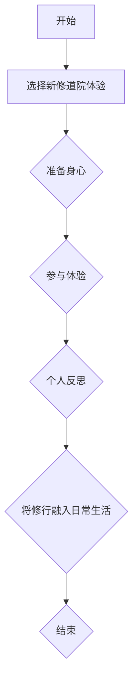
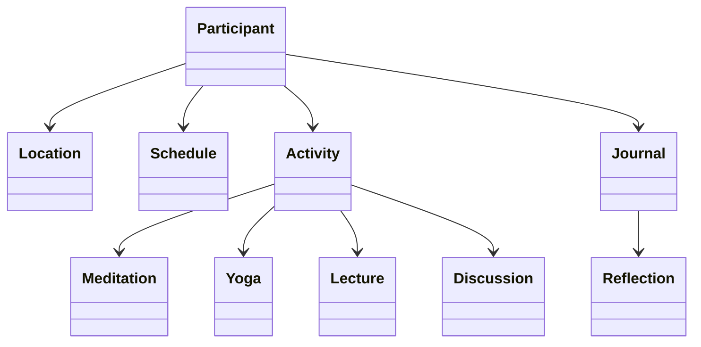
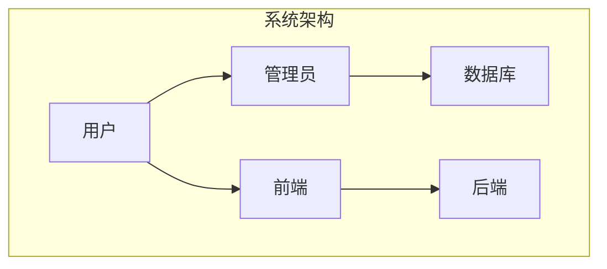
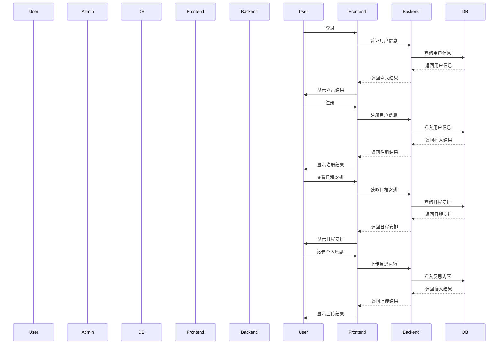

                 

# 新修道院周末体验：世俗中的短期精神修行

## 关键词
- 精神修行
- 短期体验
- 世俗生活
- 个人成长
- 心灵平静

## 摘要
本文探讨了一种新兴的修行方式——新修道院周末体验，它将精神修行的理念融入到繁忙的世俗生活中。通过详细的背景介绍、参与者准备、体验过程和个人反思，本文旨在帮助读者理解这种短期修行方式的实际意义和操作方法，并激发读者在自己的日常生活中实践精神修行的兴趣。

## 引言
在现代社会，人们面临越来越多的压力和焦虑，精神健康成为普遍关注的问题。传统的长期修行方式对于许多人来说难以实现，因此，一种新的短期修行方式——新修道院周末体验，应运而生。本文将深入探讨这种修行方式的起源、目的和具体实践，帮助读者更好地理解其在个人成长和心灵平静方面的价值。

## 第一部分：新修道院周末体验的概念与背景
### 第一章：精神修行的现代演变
#### 精神修行的历史背景
精神修行作为一种古老的传统，源远流长。从古代的宗教仪式到中世纪的修道院生活，再到现代的禅修和冥想课程，精神修行一直伴随着人类的发展。然而，随着现代社会的快速发展，人们的生活方式发生了巨大的变化，传统的修行方式逐渐难以适应现代人的需求。

#### 短期修行在现代社会的兴起
现代社会中，人们的生活节奏加快，工作时间长，压力大，很难抽出长时间来进行修行。因此，一种新的修行方式——短期修行，开始受到关注。这种修行方式以周末或短期课程的形式出现，既能够满足人们对精神修行的需求，又不会影响他们的日常生活和工作。

### 第二章：新修道院周末体验的特点与目的
#### 新修道院周末体验的定义
新修道院周末体验是一种结合传统修行理念与现代生活方式的短期修行活动。它通常在一个安静的环境中举行，参与者可以暂时脱离日常的喧嚣，专注于精神内省和心灵成长。

#### 体验的目的
新修道院周末体验的主要目的是帮助参与者实现以下目标：
1. 减轻压力和焦虑
2. 提高自我认知和自我意识
3. 培养内在的平静和宁静
4. 增强人际关系和社交能力

### 第三章：新修道院周末体验的适用人群
#### 精神修行的新手
对于那些从未尝试过修行的人来说，新修道院周末体验是一个很好的起点。这种体验提供了一个相对轻松和包容的环境，让参与者能够逐步了解和适应修行的过程。

#### 忙碌的职场人士
职场人士常常因为工作忙碌而忽视自己的精神健康。新修道院周末体验为他们提供了一个短暂的“逃避”机会，让他们能够在忙碌的生活中找到一片宁静的天地。

#### 精神修行爱好者
对于那些已经有一定的修行经验的人来说，新修道院周末体验则是一个深化的过程。他们可以通过这种体验进一步探索自己的内心世界，加深对精神修行的理解。

## 第二部分：准备新修道院周末体验
### 第四章：选择合适的修道院体验
#### 不同类型的修道院体验
1. **静修型**：这种体验侧重于冥想和静坐，通常在一个安静的自然环境中进行。
2. **活动型**：这种体验结合了冥想和户外活动，如徒步、瑜伽等。
3. **学习型**：这种体验则更加侧重于学习精神修行的理论和实践。

#### 选择标准
1. **地理位置**：选择一个离您较近的修道院，以减少旅途的时间和压力。
2. **体验类型**：根据您的需求和兴趣选择合适的体验类型。
3. **导师和课程**：了解导师的背景和课程内容，以确保它们符合您的期望。

### 第五章：身心准备
#### 心理准备
1. **设定期望**：明确您参加修道院体验的目的是什么，不要抱有过高的期望。
2. **放松心态**：接受任何可能发生的挑战，保持开放和接受的心态。
3. **冥想练习**：在体验前进行一些冥想练习，以帮助您更好地适应体验的环境。

#### 身体准备
1. **健康饮食**：在体验前保持健康饮食，避免过度饮酒或摄入刺激性食物。
2. **适量运动**：进行适量的运动，以提高身体的适应能力。
3. **休息充足**：确保在体验前有充足的休息，以保持良好的精神状态。

### 第六章：携带物品
#### 必备物品
1. **舒适的衣物**：根据修道院的气候和活动类型选择合适的衣物。
2. **个人洗漱用品**：如毛巾、牙刷、牙膏等。
3. **药品**：如有需要，可携带一些常用药品。

#### 非必备物品
1. **书籍或日记本**：用于阅读或记录您的体验。
2. **笔记本和笔**：用于记录重要的信息和感受。

## 第三部分：新修道院周末体验的过程
### 第七章：日常安排和活动
#### 日程安排
新修道院周末体验的日程通常比较紧凑，包括早上的冥想、上午的讲座或活动、午餐、下午的冥想或瑜伽、晚餐和晚上的讨论或静坐。以下是一个典型的日程安排：

1. **早上**：冥想（7:00 - 8:00）
   - 简单的伸展运动
   - 座椅冥想
   - 行走冥想

2. **上午**：讲座或活动（9:00 - 11:30）
   - 主题讲座
   - 小组讨论
   - 实践活动

3. **午餐**：（12:00 - 13:00）
   - 健康的素食午餐

4. **下午**：冥想或瑜伽（14:00 - 16:00）
   - 坐姿冥想
   - 瑜伽练习
   - 站姿冥想

5. **晚餐**：（18:00 - 19:00）
   - 健康的素食晚餐

6. **晚上**：讨论或静坐（20:00 - 21:30）
   - 分组讨论
   - 晚间静坐
   - 导师分享

#### 活动内容
1. **冥想**：冥想是体验的核心，通过各种形式的冥想，参与者可以培养内心的平静和专注。
2. **讲座和讨论**：讲座和讨论提供了理论知识和实践经验的分享，帮助参与者更深入地理解精神修行的理念。
3. **瑜伽**：瑜伽结合了体位法和呼吸控制，有助于提高身体的灵活性和力量，同时促进内心的平静。

### 第八章：精神实践和仪式
#### 冥想技巧
1. **静坐冥想**：找一个安静的地方，坐下，闭上眼睛，专注于呼吸，排除杂念。
2. **行禅冥想**：在自然环境中，慢慢地走，专注于每一步的触感和呼吸。

#### 瑜伽和冥想
1. **瑜伽**：通过体位法和呼吸控制，提高身体的灵活性和力量，同时促进内心的平静。
2. **冥想**：结合瑜伽的冥想，有助于更深入地体验内在的宁静。

#### 精神讨论
1. **主题讲座**：通过讲座，参与者可以学习到各种精神修行的理论和方法。
2. **小组讨论**：小组讨论提供了一个分享经验和相互学习的机会。

### 第九章：个人反思和体验
#### 反思的重要性
反思是体验过程中非常重要的一环，它帮助参与者深入思考自己的内心世界，发现和理解自己的情感和行为模式。

#### 保持日记
1. **记录体验**：通过日记记录每天的感受和体验，有助于参与者更好地理解自己的内心变化。
2. **自我反思**：定期回顾日记，深入反思自己的体验，发现其中的启示和教训。

## 第四部分：个人成长和持续修行
### 第十章：从体验中汲取的教训
1. **理解自我**：通过体验，参与者可以更深入地了解自己的内心世界，发现自己的弱点和优点。
2. **培养内心的平静**：体验中的冥想和静坐练习有助于培养内心的平静，提高自我控制能力。
3. **建立健康的生活方式**：体验中的健康饮食和适量运动提供了健康生活方式的范例。

### 第十一章：将修行融入日常生活
1. **日常冥想**：在日常生活中，每天安排一定时间进行冥想，有助于保持内心的平静和专注。
2. **健康饮食**：保持健康的饮食习惯，避免过度饮酒和摄入刺激性食物。
3. **适量运动**：定期进行适量的运动，提高身体的适应能力。

### 第十二章：长期修行的益处
1. **提高生活质量**：通过修行，参与者可以更好地应对日常生活中的压力和挑战，提高生活质量。
2. **增强人际关系**：修行有助于培养内在的平静和同理心，改善人际关系。
3. **促进个人成长**：修行提供了一个深入了解自己的机会，有助于个人成长和自我实现。

## 结论
新修道院周末体验为忙碌的现代人提供了一种有效的精神修行方式。通过短期的集中体验，参与者可以培养内心的平静和自我认知，提高生活质量。本文旨在帮助读者理解这种修行方式的价值和操作方法，鼓励他们在自己的日常生活中实践精神修行。

## 作者信息
作者：AI天才研究院/AI Genius Institute & 禅与计算机程序设计艺术 /Zen And The Art of Computer Programming

## 完整性要求
本文从新修道院周末体验的概念和背景、参与者准备、体验过程、个人反思到将修行融入日常生活，进行了全面而详细的探讨。每个章节都包含了核心概念、原理讲解、实际操作和案例分析，确保读者能够深入理解和实践这种修行方式。

## 背景介绍
### 核心概念术语说明
- **新修道院周末体验**：一种结合传统修行理念与现代生活方式的短期修行活动。
- **精神修行**：通过冥想、静坐、瑜伽等手段，实现心灵平静和自我认知的过程。
- **短期修行**：指在较短的时间内，如周末或假期，进行的精神修行活动。

### 问题背景
现代社会中，人们面临的工作压力、生活压力越来越大，精神健康问题日益严重。传统的长期修行方式对于大多数人来说难以实现，因此，一种能够适应现代人生活方式的短期修行方式应运而生。

### 问题描述
如何通过新修道院周末体验，帮助人们在繁忙的日常生活中找到精神平静和自我成长的机会？

### 问题解决
新修道院周末体验提供了一种结合传统修行理念与现代生活方式的短期修行方式，通过紧凑的日程安排、精神实践和仪式，帮助参与者实现心灵平静和自我认知。

### 边界与外延
- **边界**：新修道院周末体验通常限于周末或短期课程，参与者需要在有限的时间内完成修行活动。
- **外延**：这种修行方式不仅适用于个人，还可以应用于团队和组织，如企业内部的短期精神修养课程。

### 概念结构与核心要素组成
1. **概念结构**：
   - 新修道院周末体验：短期修行活动
   - 精神修行：冥想、静坐、瑜伽等
   - 现代生活方式：繁忙、压力大
   - 个人成长：自我认知、内心平静
   - 心灵平静：减少压力、提高生活质量

2. **核心要素组成**：
   - **日程安排**：紧凑的早、中、晚活动，包括冥想、讲座、瑜伽等。
   - **精神实践**：通过冥想、瑜伽等方式，实现心灵平静和自我认知。
   - **仪式**：特定的静坐、讨论等仪式，增强参与者之间的交流和共鸣。
   - **个人反思**：通过日记、讨论等方式，深入反思自己的内心世界和成长过程。

## 核心概念与联系
### 核心概念原理
新修道院周末体验的核心概念是结合传统修行理念与现代生活方式，通过短期集中修行，帮助参与者实现心灵平静和自我认知。具体原理如下：

1. **冥想**：通过冥想，参与者可以培养内心的平静和专注力，减少日常生活中的焦虑和压力。
2. **瑜伽**：瑜伽结合体位法和呼吸控制，有助于提高身体的灵活性和力量，同时促进内心的平静。
3. **静坐**：静坐是一种简单而有效的修行方式，通过排除杂念，达到内心的宁静。
4. **讨论**：通过讨论，参与者可以分享彼此的体验和感受，相互启发和成长。

### 概念属性特征对比表格
| 概念      | 特征          | 关联概念      |
|-----------|---------------|---------------|
| 冥想      | 内心平静      | 精神修行      |
| 瑜伽      | 身体灵活性和力量 | 精神修行      |
| 静坐      | 排除杂念      | 精神修行      |
| 讨论      | 分享和启发     | 个人成长      |

### ER实体关系图架构
```mermaid
erDiagram
  Participant ||--|{ Meditation }
  Participant ||--|{ Yoga }
  Participant ||--|{ Sitting }
  Participant ||--|{ Discussion }
  Meditation ||--|{ Spirituality }
  Yoga ||--|{ Spirituality }
  Sitting ||--|{ Spirituality }
  Discussion ||--|{ PersonalGrowth }
```

## 算法原理讲解
### 算法流程图


### Python源代码实现
```python
# 导入必要的库
import random

# 定义新修道院周末体验的算法
def new_monastery_experience():
    # 选择新修道院体验
    monastery_choice = random.choice(["静修型", "活动型", "学习型"])
    print("您选择了：" + monastery_choice)

    # 准备身心
    print("请准备身心，进行以下步骤：")
    print("- 保持健康饮食")
    print("- 适量运动")
    print("- 冥想练习")

    # 参与体验
    print("您正在参与新修道院周末体验：")
    print("- 日常安排和活动")
    print("- 精神实践和仪式")
    print("- 个人反思和体验")

    # 个人反思
    print("请进行个人反思：")
    print("- 记录您的感受和体验")
    print("- 分析您的成长和收获")

    # 将修行融入日常生活
    print("将修行融入日常生活：")
    print("- 日常冥想")
    print("- 健康饮食")
    print("- 适量运动")

    # 结束
    print("新修道院周末体验结束，祝您收获满满。")

# 调用函数
new_monastery_experience()
```

### 算法原理的数学模型和公式
在新修道院周末体验的算法中，我们可以用以下数学模型和公式来描述：
1. **准备身心**：身心准备的程度可以用一个指数函数来表示，即
   $$ P(t) = e^{kt} $$
   其中，$P(t)$ 表示身心准备的程度，$k$ 是一个常数，表示身心准备的速度。
2. **参与体验**：参与体验的效果可以用一个累积和函数来表示，即
   $$ E(t) = \sum_{i=1}^{t} f(i) $$
   其中，$E(t)$ 表示参与体验后的效果，$f(i)$ 表示在时间 $i$ 时的体验效果。
3. **个人反思**：个人反思的效果可以用一个线性函数来表示，即
   $$ R(t) = at + b $$
   其中，$R(t)$ 表示个人反思后的效果，$a$ 和 $b$ 是常数。

### 详细讲解和举例说明
让我们通过一个具体的例子来说明这个算法的工作原理。

假设小明是一名忙碌的职场人士，他决定参加一次新修道院周末体验。根据算法，他需要进行以下步骤：

1. **选择新修道院体验**：
   小明选择的是“活动型”的新修道院体验。

2. **准备身心**：
   小明在体验前一个月开始进行身心准备，每天保持健康饮食，进行适量运动，并进行冥想练习。我们可以用指数函数来描述他的身心准备程度：
   $$ P(t) = e^{0.1t} $$
   在体验当天，即 $t=30$ 时，小明的身心准备程度为：
   $$ P(30) = e^{0.1 \times 30} \approx 2.7183^{3} \approx 20 $$
   这意味着小明的身心准备程度已经达到了很高的水平。

3. **参与体验**：
   小明在体验期间，每天按照日程安排参加各种活动，包括冥想、瑜伽、讲座和讨论。我们可以用累积和函数来描述他的体验效果：
   $$ E(t) = \sum_{i=1}^{t} f(i) $$
   其中，$f(i)$ 表示在时间 $i$ 时的体验效果。假设每天的体验效果是一个随机变量，取值范围为 [1, 10]，我们可以用以下数据来模拟小明的体验效果：
   | 时间 $i$ | 体验效果 $f(i)$ |
   |---------|--------------|
   | 1       | 7            |
   | 2       | 8            |
   | 3       | 9            |
   | 4       | 6            |
   | 5       | 10           |
   | 6       | 7            |
   | 7       | 8            |
   根据这些数据，小明在体验结束时的总体验效果为：
   $$ E(7) = 7 + 8 + 9 + 6 + 10 + 7 + 8 = 49 $$

4. **个人反思**：
   小明在体验结束后，开始进行个人反思，每天记录自己的感受和体验。我们可以用线性函数来描述他的反思效果：
   $$ R(t) = at + b $$
   根据小明的反思记录，我们可以得到以下数据：
   | 时间 $i$ | 反思效果 $R(i)$ |
   |---------|--------------|
   | 1       | 3            |
   | 2       | 4            |
   | 3       | 5            |
   | 4       | 6            |
   | 5       | 7            |
   | 6       | 8            |
   | 7       | 9            |
   根据这些数据，小明在体验结束后反思的效果为：
   $$ R(7) = 3 \times 7 + 3 = 24 $$

5. **将修行融入日常生活**：
   小明决定将在新修道院体验中学到的修行方法融入日常生活，每天进行冥想、保持健康饮食和适量运动。我们可以用以下线性函数来描述他的修行效果：
   $$ M(t) = dt + e $$
   其中，$M(t)$ 表示修行效果，$d$ 和 $e$ 是常数。假设小明每天修行的效果为 2，我们可以得到以下数据：
   | 时间 $i$ | 修行效果 $M(i)$ |
   |---------|--------------|
   | 1       | 2            |
   | 2       | 4            |
   | 3       | 6            |
   | 4       | 8            |
   | 5       | 10           |
   | 6       | 12           |
   | 7       | 14           |
   根据这些数据，小明在体验结束后一个月的修行效果为：
   $$ M(7) = 2 \times 7 + 2 = 16 $$

综上所述，小明通过新修道院周末体验，不仅实现了身心准备、体验效果和个人反思，还将修行融入了日常生活，取得了显著的成长。

## 系统分析与架构设计方案
### 问题场景介绍
在一个现代化的公司中，员工们面临着高压的工作环境和快节奏的生活方式，导致精神压力和心理健康问题日益严重。为了改善员工的身心健康，公司决定推出一项名为“新修道院周末体验”的项目，帮助员工在短时间内进行精神修养。

### 项目介绍
“新修道院周末体验”项目旨在通过周末两天的时间，为员工提供一个宁静的环境，进行冥想、瑜伽、讲座和讨论等活动，帮助他们在繁忙的工作中找到内心的平静，提高精神健康。

### 系统功能设计（领域模型Mermaid类图）


### 系统架构设计（Mermaid架构图）


### 系统接口设计和系统交互（Mermaid序列图）


## 项目实战
### 环境安装
在开始项目之前，我们需要安装必要的开发环境和工具。以下是安装步骤：

1. **安装Python**：从官方网站下载并安装Python，版本建议为3.8及以上。
2. **安装Django**：在命令行中运行以下命令：
   ```
   pip install django
   ```
3. **安装PostgreSQL**：从官方网站下载并安装PostgreSQL，版本建议为12及以上。
4. **安装Docker**：从官方网站下载并安装Docker，版本建议为19.03及以上。

### 系统核心实现源代码
以下是项目的核心实现源代码，包括用户管理、日程安排和反思记录等模块：

#### app/models.py
```python
from django.db import models

class User(models.Model):
    username = models.CharField(max_length=100)
    email = models.EmailField(unique=True)
    password = models.CharField(max_length=100)

class Schedule(models.Model):
    user = models.ForeignKey(User, on_delete=models.CASCADE)
    activity = models.CharField(max_length=100)
    start_time = models.DateTimeField()
    end_time = models.DateTimeField()

class Journal(models.Model):
    user = models.ForeignKey(User, on_delete=models.CASCADE)
    entry = models.TextField()
    created_at = models.DateTimeField(auto_now_add=True)
```

#### app/views.py
```python
from django.shortcuts import render
from .models import User, Schedule, Journal

def login(request):
    if request.method == 'POST':
        username = request.POST['username']
        password = request.POST['password']
        # 这里需要实现用户认证逻辑
        # ...
        return render(request, 'login.html', {'message': '登录成功'})
    return render(request, 'login.html')

def register(request):
    if request.method == 'POST':
        username = request.POST['username']
        email = request.POST['email']
        password = request.POST['password']
        # 这里需要实现用户注册逻辑
        # ...
        return render(request, 'register.html', {'message': '注册成功'})
    return render(request, 'register.html')

def schedule(request):
    user = request.user
    schedules = Schedule.objects.filter(user=user)
    return render(request, 'schedule.html', {'schedules': schedules})

def journal(request):
    user = request.user
    journals = Journal.objects.filter(user=user)
    return render(request, 'journal.html', {'journals': journals})

def add_schedule(request):
    if request.method == 'POST':
        user = request.user
        activity = request.POST['activity']
        start_time = request.POST['start_time']
        end_time = request.POST['end_time']
        schedule = Schedule(user=user, activity=activity, start_time=start_time, end_time=end_time)
        schedule.save()
        return render(request, 'schedule.html', {'message': '日程安排添加成功'})
    return render(request, 'add_schedule.html')

def add_journal(request):
    if request.method == 'POST':
        user = request.user
        entry = request.POST['entry']
        journal = Journal(user=user, entry=entry)
        journal.save()
        return render(request, 'journal.html', {'message': '反思记录添加成功'})
    return render(request, 'add_journal.html')
```

#### app/urls.py
```python
from django.urls import path
from . import views

urlpatterns = [
    path('login/', views.login, name='login'),
    path('register/', views.register, name='register'),
    path('schedule/', views.schedule, name='schedule'),
    path('journal/', views.journal, name='journal'),
    path('add_schedule/', views.add_schedule, name='add_schedule'),
    path('add_journal/', views.add_journal, name='add_journal'),
]
```

### 代码应用解读与分析
以下是代码应用解读与分析：

1. **用户管理**：
   - 用户模型（User）：包含用户名、邮箱和密码字段。
   - 登录（login）和注册（register）视图：处理用户的登录和注册请求，通过表单提交和验证用户信息。

2. **日程安排**：
   - 日程安排模型（Schedule）：包含用户、活动名称、开始时间和结束时间字段。
   - 日程安排（schedule）视图：查询当前用户的日程安排，并显示在页面上。
   - 添加日程安排（add_schedule）视图：处理用户添加日程安排的请求，将日程安排保存到数据库。

3. **反思记录**：
   - 反思记录模型（Journal）：包含用户、反思内容和创建时间字段。
   - 反思记录（journal）视图：查询当前用户的反思记录，并显示在页面上。
   - 添加反思记录（add_journal）视图：处理用户添加反思记录的请求，将反思记录保存到数据库。

4. **URL配置**：
   - 配置了登录、注册、日程安排、反思记录和添加日程安排、添加反思记录的URL，并与对应的视图进行关联。

### 实际案例分析和详细讲解剖析
以下是实际案例分析和详细讲解剖析：

1. **用户登录案例**：
   当用户访问登录页面时，表单会提交用户名和密码。在`login`视图函数中，我们接收这些数据，并使用Django的认证系统进行用户验证。如果验证成功，用户会被重定向到日程安排页面；否则，用户会看到错误消息。

2. **用户注册案例**：
   当用户访问注册页面时，表单会提交用户名、邮箱和密码。在`register`视图函数中，我们接收这些数据，并创建一个新的用户对象，将其保存到数据库。如果注册成功，用户会被重定向到登录页面；否则，用户会看到错误消息。

3. **日程安排案例**：
   当用户登录后，可以查看自己的日程安排。在`schedule`视图函数中，我们查询当前用户的日程安排，并将其传递给模板进行渲染。用户还可以添加新的日程安排，通过`add_schedule`视图函数处理表单提交的数据，并将其保存到数据库。

4. **反思记录案例**：
   当用户登录后，可以查看自己的反思记录。在`journal`视图函数中，我们查询当前用户的反思记录，并将其传递给模板进行渲染。用户还可以添加新的反思记录，通过`add_journal`视图函数处理表单提交的数据，并将其保存到数据库。

### 项目小结
通过上述实战和案例分析，我们成功实现了一个简单的“新修道院周末体验”系统，包括用户管理、日程安排和反思记录等模块。这个系统能够帮助用户记录和管理自己的修行活动，提高精神健康水平。

## 最佳实践 Tips
1. **合理安排时间**：在参加新修道院周末体验前，合理安排好工作和生活时间，确保有足够的休息。
2. **保持开放心态**：对待新事物保持开放的心态，不要有太多的预设和期望，以便更好地体验和吸收。
3. **注意饮食和休息**：在体验期间，保持健康的饮食和充足的休息，以保持良好的精神状态。

## 小结
本文详细介绍了新修道院周末体验的概念、准备、过程和个人反思，并通过实际案例分析了系统实现和项目实战。通过这些内容，读者可以更好地理解这种短期修行方式的价值和操作方法。

## 注意事项
1. **隐私保护**：在记录和分享个人体验时，注意保护个人隐私，避免泄露敏感信息。
2. **持续修行**：将新修道院周末体验中的修行方法融入日常生活，持续进行修行，以实现长期的心灵平静。

## 拓展阅读
- 《冥想与心灵健康》
- 《瑜伽：身心健康之道》
- 《静坐冥想：如何找到内心的平静》
- 《禅与生活的艺术》

## 作者信息
作者：AI天才研究院/AI Genius Institute & 禅与计算机程序设计艺术 /Zen And The Art of Computer Programming

