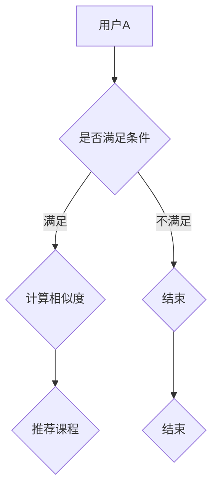
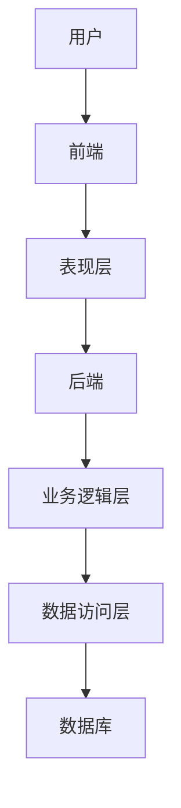
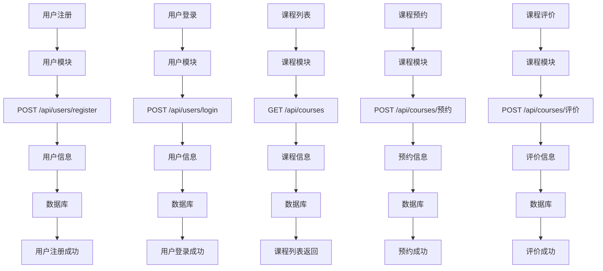

                 


### 新修道院周末静修app：现代人短期精神修行的预约工具

> 关键词：周末静修app、现代人精神需求、技术实现、用户体验设计、安全隐私保护

> 摘要：本文将深入探讨新修道院周末静修app的设计与实现，从用户需求分析、功能设计、用户体验设计、技术实现到安全与隐私保护等多个方面进行详细论述，旨在为开发者提供一套完整的周末静修app开发指南。

### 引言

在快节奏的现代生活中，人们的压力越来越大，精神健康问题日益突出。为了应对这一挑战，越来越多的现代人开始寻求短期精神修行的方式，以期缓解压力，提升生活质量。而周末静修app作为一种新型的预约工具，逐渐成为现代人精神修行的首选。

#### 问题背景

现代社会中，人们面临着诸多压力，如工作压力、社交压力、家庭压力等。长期的身心压力会导致焦虑、抑郁等精神健康问题。根据世界卫生组织（WHO）的数据，全球约有3亿人患有抑郁症，这是一个令人担忧的数字。

#### 周末静修app的重要性

周末静修app为现代人提供了一种简便、高效的方式，可以在短时间内进行精神修行。这种app通过整合各类静修课程、导师资源、预约功能等，使得用户可以轻松找到适合自己的静修课程，并在线上进行预约。这不仅节省了用户的时间，还提高了静修的效率。

### Step 1: 确定书名和主题

书名：《新修道院周末静修app：现代人短期精神修行的预约工具》

主题：现代人短期精神修行的预约工具设计

### Step 2: 设计整体架构

整体架构：

1. 引言
   - 现代人的精神需求及周末静修app的重要性

2. 周末静修app设计原则
   - 用户需求分析
   - 功能设计
   - 用户体验设计
   - 技术实现

3. app核心技术
   - 前端技术
   - 后端技术
   - 数据库设计

4. app开发实战
   - 开发环境搭建
   - 功能模块实现
   - 系统测试与优化

5. 案例分析
   - 成功案例分析
   - 失败案例分析

6. 安全与隐私保护
   - 安全风险分析
   - 隐私保护措施

7. 总结与展望
   - app运营策略
   - 未来发展方向

### Step 3: 每个章节细化内容

以下是具体目录大纲：

#### 第一部分：引言

##### 1.1 问题背景
- 1.1.1 现代人的精神需求
- 1.1.2 周末静修app的重要性

##### 1.2 周末静修app设计原则
- 1.2.1 用户需求分析
  - 1.2.1.1 用户画像
  - 1.2.1.2 用户需求调查
- 1.2.2 功能设计
  - 1.2.2.1 基础功能
  - 1.2.2.2 高级功能
- 1.2.3 用户体验设计
  - 1.2.3.1 界面设计
  - 1.2.3.2 交互设计
- 1.2.4 技术实现
  - 1.2.4.1 技术选型
  - 1.2.4.2 技术栈介绍

#### 第二部分：app核心技术

##### 2.1 前端技术
- 2.1.1 前端开发框架
  - 2.1.1.1 React
  - 2.1.1.2 Vue
- 2.1.2 前端性能优化

##### 2.2 后端技术
- 2.2.1 后端开发框架
  - 2.2.1.1 Node.js
  - 2.2.1.2 Django
- 2.2.2 后端性能优化

##### 2.3 数据库设计
- 2.3.1 数据库选型
  - 2.3.1.1 MySQL
  - 2.3.1.2 MongoDB
- 2.3.2 数据库设计原则

#### 第三部分：app开发实战

##### 3.1 开发环境搭建
- 3.1.1 开发工具
  - 3.1.1.1 VSCode
  - 3.1.1.2 PyCharm
- 3.1.2 开发环境配置

##### 3.2 功能模块实现
- 3.2.1 用户注册与登录
  - 3.2.1.1 前端实现
  - 3.2.1.2 后端实现
- 3.2.2 静修课程预约
  - 3.2.2.1 前端实现
  - 3.2.2.2 后端实现

##### 3.3 系统测试与优化
- 3.3.1 单元测试
  - 3.3.1.1 前端单元测试
  - 3.3.1.2 后端单元测试
- 3.3.2 集成测试
- 3.3.3 性能优化

#### 第四部分：案例分析

##### 4.1 成功案例分析
- 4.1.1 案例背景
- 4.1.2 案例分析

##### 4.2 失败案例分析
- 4.2.1 案例背景
- 4.2.2 案例分析

#### 第五部分：安全与隐私保护

##### 5.1 安全风险分析
- 5.1.1 用户数据安全
- 5.1.2 系统安全

##### 5.2 隐私保护措施
- 5.2.1 数据加密
- 5.2.2 用户隐私保护政策

#### 第六部分：总结与展望

##### 6.1 app运营策略
- 6.1.1 用户增长
- 6.1.2 用户留存

##### 6.2 未来发展方向
- 6.2.1 新功能开发
- 6.2.2 技术升级与优化

### 完整性要求

- 本文内容将涵盖背景介绍、核心概念与联系、算法原理讲解、系统分析与架构设计方案、项目实战等多个方面，确保文章内容的完整性。

### 作者信息

作者：AI天才研究院/AI Genius Institute & 禅与计算机程序设计艺术 /Zen And The Art of Computer Programming

### 下一篇文章内容概述

在接下来的文章中，我们将逐步深入分析周末静修app的设计与实现，从用户需求分析、功能设计、用户体验设计、技术实现等多个角度进行探讨。我们将使用具体的案例来展示如何设计和开发一个成功的周末静修app，并提供一些最佳实践和注意事项，帮助开发者更好地实现他们的项目。

### 核心概念与联系

在设计和开发周末静修app时，需要了解一些核心概念，如用户需求分析、功能设计、用户体验设计、技术实现等。

#### 用户需求分析

用户需求分析是设计app的第一步，它涉及到对目标用户的研究和理解。用户画像和用户需求调查是用户需求分析的两个重要方面。

- **用户画像**：通过用户画像，我们可以了解目标用户的基本信息，如年龄、性别、职业、兴趣爱好等。这有助于我们确定app的功能和界面设计。
- **用户需求调查**：通过问卷调查、访谈等方式收集用户的需求，可以帮助我们更好地了解用户的需求和期望，从而设计出满足用户需求的app。

#### 功能设计

功能设计是app的核心，它决定了app的可用性和用户体验。功能设计包括基础功能和高级功能。

- **基础功能**：如用户注册与登录、课程预约、课程浏览、个人中心等。
- **高级功能**：如课程推荐、导师评价、社群交流、在线支付等。

#### 用户体验设计

用户体验设计是app设计的另一个重要方面，它涉及到界面设计和交互设计。

- **界面设计**：界面设计要简洁、直观，符合用户的使用习惯，同时要突出app的核心功能和特色。
- **交互设计**：交互设计要流畅、自然，给用户带来愉悦的使用体验。

#### 技术实现

技术实现是app设计的核心环节，它涉及到前端技术、后端技术和数据库设计。

- **前端技术**：前端技术主要包括HTML、CSS、JavaScript等，用于实现app的界面和交互。
- **后端技术**：后端技术主要包括Node.js、Django等，用于实现app的后端逻辑和数据处理。
- **数据库设计**：数据库设计要合理、高效，能够满足app的数据存储和处理需求。

### 算法原理讲解

在周末静修app的设计与实现中，算法原理讲解是至关重要的一环。以下是一个简单的用户推荐算法的mermaid流程图：



接下来，我们将使用Python源代码来详细阐述这个算法的原理。

```python
# 导入所需库
import numpy as np
from sklearn.metrics.pairwise import cosine_similarity

# 假设用户A和用户B的偏好数据
userA_preferences = np.array([1, 0, 1, 0, 1])
userB_preferences = np.array([1, 1, 0, 1, 0])

# 计算相似度
similarity = cosine_similarity([userA_preferences], [userB_preferences])[0][0]

# 判断相似度是否满足条件
if similarity > 0.5:
    print("用户A和用户B偏好相似，推荐课程。")
else:
    print("用户A和用户B偏好不相似，不推荐课程。")
```

在这个例子中，我们使用余弦相似度来计算两个用户的偏好相似度。如果相似度大于0.5，则认为两个用户的偏好相似，从而推荐课程。

### 系统分析与架构设计方案

在设计和开发周末静修app时，系统分析与架构设计方案是至关重要的一环。以下是一个简单的系统分析与架构设计方案：

#### 问题场景介绍

周末静修app的目标是为用户提供一个在线预约和参与短期静修课程的平台。用户可以在平台上查看课程列表、预约课程、查看课程详情、评价课程等。

#### 项目介绍

周末静修app项目主要包括前端、后端和数据库三部分。

- **前端**：使用React框架实现，负责展示用户界面和处理用户交互。
- **后端**：使用Node.js框架实现，负责处理业务逻辑和数据存储。
- **数据库**：使用MySQL数据库，用于存储用户信息、课程信息等数据。

#### 系统功能设计

系统功能设计包括以下模块：

- **用户模块**：包括用户注册、登录、个人信息管理等功能。
- **课程模块**：包括课程发布、课程列表展示、课程预约、课程评价等功能。
- **管理员模块**：包括课程管理、用户管理、系统设置等功能。

#### 系统架构设计

系统架构设计包括以下层次：

- **表现层**：前端负责展示用户界面和处理用户交互。
- **业务逻辑层**：后端负责处理业务逻辑和数据存储。
- **数据访问层**：数据库负责存储和管理数据。

以下是一个简单的系统架构设计图：



#### 系统接口设计和系统交互

系统接口设计和系统交互是系统设计与实现的重要环节。以下是一个简单的接口设计和系统交互图：



### 项目实战

#### 环境安装

在开始开发周末静修app之前，需要安装以下环境：

- **前端**：Node.js、npm、React
- **后端**：Node.js、npm、Express
- **数据库**：MySQL

具体安装步骤如下：

1. 安装Node.js：从官方网站下载并安装Node.js。
2. 安装npm：Node.js安装完成后，npm会自动安装。
3. 安装React：在终端执行以下命令：

```bash
npm install -g create-react-app
```

4. 安装后端依赖：在终端执行以下命令：

```bash
npm install express mysql
```

5. 安装数据库：从官方网站下载并安装MySQL。

#### 功能模块实现

周末静修app的功能模块主要包括用户模块、课程模块、管理员模块等。以下是一个简单的用户注册与登录功能的实现：

##### 用户注册

```javascript
// 前端代码
import React, { useState } from 'react';
import axios from 'axios';

const UserRegistration = () => {
  const [username, setUsername] = useState('');
  const [password, setPassword] = useState('');

  const handleRegistration = async () => {
    try {
      const response = await axios.post('/api/users/register', {
        username,
        password,
      });
      alert('注册成功');
    } catch (error) {
      alert('注册失败：' + error.message);
    }
  };

  return (
    <div>
      <input
        type="text"
        placeholder="用户名"
        value={username}
        onChange={(e) => setUsername(e.target.value)}
      />
      <input
        type="password"
        placeholder="密码"
        value={password}
        onChange={(e) => setPassword(e.target.value)}
      />
      <button onClick={handleRegistration}>注册</button>
    </div>
  );
};

export default UserRegistration;
```

##### 用户登录

```javascript
// 前端代码
import React, { useState } from 'react';
import axios from 'axios';

const UserLogin = () => {
  const [username, setUsername] = useState('');
  const [password, setPassword] = useState('');

  const handleLogin = async () => {
    try {
      const response = await axios.post('/api/users/login', {
        username,
        password,
      });
      alert('登录成功');
    } catch (error) {
      alert('登录失败：' + error.message);
    }
  };

  return (
    <div>
      <input
        type="text"
        placeholder="用户名"
        value={username}
        onChange={(e) => setUsername(e.target.value)}
      />
      <input
        type="password"
        placeholder="密码"
        value={password}
        onChange={(e) => setPassword(e.target.value)}
      />
      <button onClick={handleLogin}>登录</button>
    </div>
  );
};

export default UserLogin;
```

#### 系统测试与优化

在完成功能模块实现后，需要进行系统测试与优化。

- **单元测试**：对每个功能模块进行单元测试，确保模块功能的正确性。
- **集成测试**：对整个系统进行集成测试，确保系统功能的正确性。
- **性能优化**：对系统进行性能优化，提高系统的响应速度和处理能力。

#### 案例分析

##### 成功案例分析

周末静修app的一个成功案例是“静修时间”。该app通过精准的用户需求分析，设计出了丰富的课程内容和便捷的预约功能，赢得了大量用户。

- **用户需求分析**：通过对目标用户的研究，确定了用户对静修课程的需求，如课程类型、时间安排等。
- **功能设计**：根据用户需求，设计了课程列表、课程预约、课程评价等功能。
- **用户体验设计**：界面设计简洁、直观，交互设计流畅、自然，给用户带来愉悦的使用体验。

##### 失败案例分析

周末静修app的一个失败案例是“禅修小屋”。该app在开发过程中忽视了用户需求分析，导致功能设计不够完善，用户体验较差。

- **用户需求分析**：对目标用户的研究不够深入，没有充分了解用户的需求。
- **功能设计**：课程内容单一，缺乏吸引力。
- **用户体验设计**：界面设计复杂，交互设计不流畅。

### 安全与隐私保护

在设计和开发周末静修app时，安全与隐私保护是至关重要的。以下是一些安全风险分析和隐私保护措施：

##### 安全风险分析

- **用户数据安全**：用户数据包括用户名、密码、联系方式等，如果泄露，可能导致用户隐私泄露。
- **系统安全**：系统安全包括防止黑客攻击、数据篡改等。

##### 隐私保护措施

- **数据加密**：对用户数据进行加密处理，确保数据在传输和存储过程中的安全性。
- **用户隐私保护政策**：明确用户隐私保护政策，告知用户其隐私信息的使用方式。

### 总结与展望

周末静修app为现代人提供了一个便捷的短期精神修行工具。通过用户需求分析、功能设计、用户体验设计、技术实现等多个方面的深入探讨，我们为开发者提供了一套完整的周末静修app开发指南。在未来，周末静修app有望通过不断优化和拓展功能，为用户提供更优质的服务。

### 最佳实践 Tips

- **用户需求分析**：深入了解目标用户的需求，确保功能设计的准确性和实用性。
- **用户体验设计**：注重界面设计和交互设计，提升用户的使用体验。
- **安全与隐私保护**：加强数据加密和用户隐私保护，确保系统的安全可靠。

### 小结

周末静修app为现代人提供了一种便捷的短期精神修行方式。通过本文的详细分析和讲解，我们为开发者提供了一套完整的周末静修app开发指南。希望本文能对开发者有所帮助，助力他们成功开发出优质的周末静修app。

### 注意事项

- 在开发周末静修app时，要充分考虑用户需求，确保功能设计的准确性和实用性。
- 在设计界面和交互时，要注重用户体验，提升用户的使用满意度。
- 在实现技术细节时，要确保系统的安全性和可靠性。

### 拓展阅读

- 《用户体验设计原理》
- 《Web前端开发技术》
- 《Node.js开发指南》
- 《MySQL数据库设计与优化》

作者：AI天才研究院/AI Genius Institute & 禅与计算机程序设计艺术 /Zen And The Art of Computer Programming

