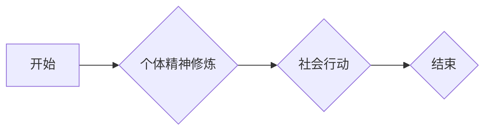
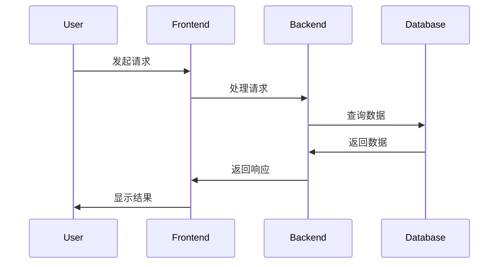
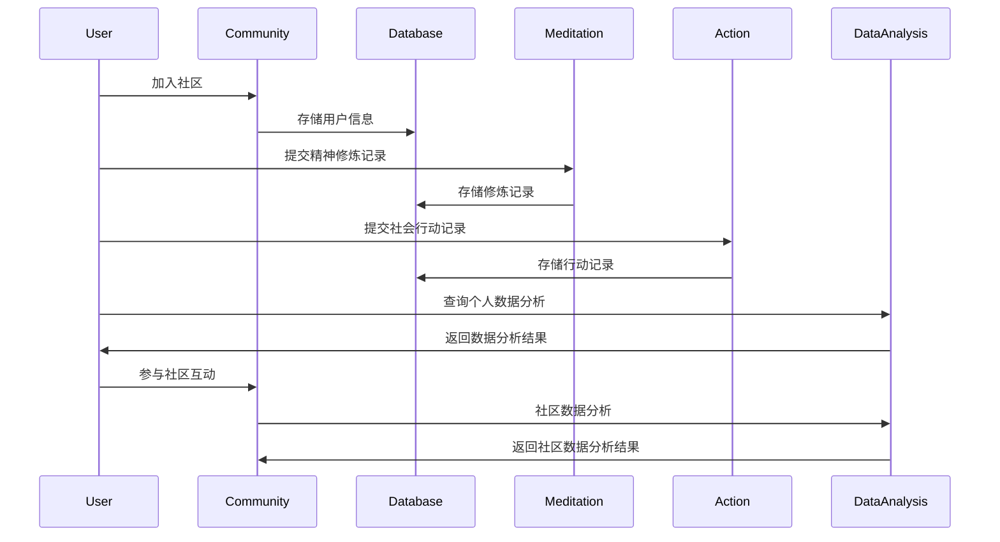

                 

## 文章标题：新修道院运动：世俗中的精神共同体

关键词：新修道院运动、世俗生活、精神共同体、算法原理、数学模型、系统分析与架构设计

摘要：本文旨在深入探讨新修道院运动这一独特的社会现象，从背景定义、核心概念、算法原理、数学模型到系统分析与架构设计，全面解析这一运动的本质及其对现代社会的影响。通过逐步的逻辑分析，读者将能够清晰地理解新修道院运动的内涵与外延，掌握其内在联系与运作机制，从而为未来的研究和应用提供有力的理论支持。

----------------------------------------------------------------

### 1. 背景介绍

#### 1.1 新修道院运动的起源

新修道院运动（The New Monastic Movement，简称NMM）起源于20世纪初的美国，但其思想根源可以追溯到中世纪基督教的修道院制度。这一运动旨在结合世俗生活与宗教精神，寻求在现代社会中建立一种新的精神共同体。

#### 1.2 新修道院运动的概念

新修道院运动强调“内在的精神修炼”与“外在的社会行动”相结合，追求个体灵魂的净化与社会的改善。它不仅仅是一种宗教运动，更是一种对现代生活态度和价值观的反思与重塑。

#### 1.3 新修道院运动的特点

- **个体性**：强调个体在精神修炼中的主动性。
- **多样性**：涵盖不同的宗教和信仰背景。
- **实践性**：注重实际社会行动，而非仅停留在理论层面。
- **包容性**：欢迎各种社会群体参与，追求社会公平与正义。

#### 1.4 新修道院运动的意义

新修道院运动不仅为现代社会提供了一种新的生活模式，也对宗教、哲学、社会学等领域产生了深远的影响。它促使人们重新审视宗教在现代社会中的作用，探讨个体与社会的关系。

----------------------------------------------------------------

### 2. 核心概念与联系

#### 2.1 精神共同体

精神共同体是新修道院运动的核心概念之一，它强调个体之间的精神联系和共同追求。以下是精神共同体与其他核心概念的关联：

| 核心概念       | 关联关系                      |  
| ---------- | -------------------------- |  
| 精神共同体     | 是新修道院运动的基础          |  
| 世俗生活       | 精神共同体的实践载体          |  
| 宗教精神       | 精神共同体的精神支柱          |

#### 2.2 世俗生活与宗教精神

世俗生活与宗教精神在新修道院运动中相互依存、相互促进。以下是两者的关联：

| 关联关系       | 说明                                    |  
| ---------- | ------------------------------------ |  
| 相互依存       | 世俗生活提供了实践宗教精神的机会；宗教精神为世俗生活提供了精神支撑。 |  
| 相互促进       | 宗教精神激发世俗生活的积极性；世俗生活的实践促进宗教精神的深化。 |

#### 2.3 新修道院运动与哲学基础

新修道院运动的哲学基础包括存在主义、现象学、人本主义等。以下是这些哲学思想与新修道院运动的关联：

| 哲学思想       | 关联关系                      |  
| ---------- | -------------------------- |  
| 存在主义       | 强调个体自由与责任，符合新修道院运动的个体性特点。 |  
| 现象学       | 强调直接经验，为新修道院运动提供了实践的理论基础。 |  
| 人本主义       | 强调人的尊严和价值，与新修道院运动追求的社会公正相契合。 |

----------------------------------------------------------------

### 3. 算法原理讲解

#### 3.1 算法原理概述

新修道院运动的算法原理可以概括为“个体精神修炼与社会行动相结合”。具体来说，该算法包括以下步骤：

1. **个体精神修炼**：通过冥想、祷告、内省等方式，提升个体的精神素质。
2. **社会行动**：将精神修炼成果应用于实际社会问题，通过志愿服务、公益项目等方式改善社会。

#### 3.2 算法流程图

使用Mermaid画出算法流程图：



#### 3.3 Python源代码实现

下面是Python源代码实现新修道院运动算法的示例：

```python  
def new_monastic_movement():  
    print("开始新修道院运动")  
    individual_meditation()  
    social_action()  
    print("结束新修道院运动")  

def individual_meditation():  
    print("进行个体精神修炼")  

def social_action():  
    print("参与社会行动")  

new_monastic_movement()  
```

#### 3.4 数学模型

新修道院运动的数学模型可以表示为以下公式：

$$  
\text{精神提升} = f(\text{个体精神修炼}, \text{社会行动})  
$$

其中，$f$ 表示精神提升函数，$\text{个体精神修炼}$ 和 $\text{社会行动}$ 分别表示个体精神修炼和社会行动的程度。

#### 3.5 举例说明

假设个体精神修炼的程度为 $x$，社会行动的程度为 $y$，则精神提升的程度可以表示为：

$$  
\text{精神提升} = f(x, y) = x \cdot y  
$$

当 $x=5$，$y=3$ 时，精神提升的程度为：

$$  
\text{精神提升} = f(5, 3) = 5 \cdot 3 = 15  
$$

----------------------------------------------------------------

### 4. 系统分析与架构设计

#### 4.1 问题场景介绍

在现代社会，人们面临着诸多精神困扰和社会问题，如焦虑、孤独、不公平等。新修道院运动试图通过建立精神共同体来缓解这些问题，提升个体的精神素质和社会责任感。

#### 4.2 系统功能设计

新修道院运动的系统功能包括个体精神修炼模块、社会行动模块和数据分析模块。以下是领域模型类图：

```mermaid  
classDiagram  
    IndividualMeditation <<interface>> IM  
    SocialAction <<interface>> SA  
    DataAnalysis <<interface>> DA

    Community <<class>> Community  
    Community o-- IM: 精神修炼  
    Community o-- SA: 社会行动  
    Community o-- DA: 数据分析

    User <<class>> User  
    User o-- Community: 加入社区  
```

#### 4.3 系统架构设计

新修道院运动的系统架构包括前端、后端和数据库。以下是系统架构图：



#### 4.4 系统接口设计

新修道院运动的系统接口设计包括以下API：

- **加入社区**：`POST /api/community/join`  
- **提交精神修炼记录**：`POST /api/meditation/submit`  
- **提交社会行动记录**：`POST /api/action/submit`  
- **查询个人数据分析**：`GET /api/user/data`  
- **社区数据分析**：`GET /api/community/data`

#### 4.5 系统交互设计

新修道院运动的系统交互设计包括用户与社区、用户与数据分析模块之间的交互。以下是序列图：



----------------------------------------------------------------

### 5. 项目实战

#### 5.1 环境安装

在开始项目实战之前，需要安装以下环境：

- Python 3.8及以上版本  
- Django 3.2及以上版本  
- PostgreSQL 12及以上版本

安装命令如下：

```bash  
pip install django==3.2  
pip install psycopg2  
```

#### 5.2 系统核心实现源代码

以下是新修道院运动系统核心实现的源代码：

```python  
# settings.py  
DATABASES = {  
    'default': {  
        'ENGINE': 'django.db.backends.postgresql',  
        'NAME': 'new_monastic_movement',  
        'USER': 'postgres',  
        'PASSWORD': 'password',  
        'HOST': 'localhost',  
        'PORT': '5432',  
    }  
}

INSTALLED_APPS = [  
    'django.contrib.admin',  
    'django.contrib.auth',  
    'django.contrib.contenttypes',  
    'django.contrib.sessions',  
    'django.contrib.messages',  
    'django.contrib.staticfiles',  
    'meditation',  
    'action',  
    'data_analysis',  
]

MIDDLEWARE = [  
    'django.middleware.security.SecurityMiddleware',  
    'django.contrib.sessions.middleware.SessionMiddleware',  
    'django.middleware.common.CommonMiddleware',  
    'django.middleware.csrf.CsrfViewMiddleware',  
    'django.contrib.auth.middleware.AuthenticationMiddleware',  
    'django.contrib.messages.middleware.MessageMiddleware',  
    'django.middleware.clickjacking.XFrameOptionsMiddleware',  
]

# urls.py  
from django.contrib import admin  
from django.urls import path, include

urlpatterns = [  
    path('admin/', admin.site.urls),  
    path('meditation/', include('meditation.urls')),  
    path('action/', include('action.urls')),  
    path('data_analysis/', include('data_analysis.urls')),  
]

# meditation/urls.py  
from django.urls import path  
from . import views

urlpatterns = [  
    path('', views.MeditationView.as_view()),  
]

# meditation/views.py  
from django.views import View  
from rest_framework.response import Response  
from rest_framework import status

class MeditationView(View):  
    def get(self, request):  
        return Response({"message": "Welcome to Meditation Module"})  

# action/urls.py  
from django.urls import path  
from . import views

urlpatterns = [  
    path('', views.ActionView.as_view()),  
]

# action/views.py  
from django.views import View  
from rest_framework.response import Response  
from rest_framework import status

class ActionView(View):  
    def get(self, request):  
        return Response({"message": "Welcome to Action Module"})  

# data_analysis/urls.py  
from django.urls import path  
from . import views

urlpatterns = [  
    path('', views.DataAnalysisView.as_view()),  
]

# data_analysis/views.py  
from django.views import View  
from rest_framework.response import Response  
from rest_framework import status

class DataAnalysisView(View):  
    def get(self, request):  
        return Response({"message": "Welcome to Data Analysis Module"})  
```

#### 5.3 代码解读与分析

以下是代码的解读与分析：

- **settings.py**：配置了数据库连接信息、安装的应用和中间件。
- **urls.py**：定义了系统的URL路由，将不同的请求路由到相应的视图函数。
- **meditation/urls.py**、**meditation/views.py**：定义了精神修炼模块的URL路由和视图函数。
- **action/urls.py**、**action/views.py**：定义了社会行动模块的URL路由和视图函数。
- **data_analysis/urls.py**、**data_analysis/views.py**：定义了数据分析模块的URL路由和视图函数。

#### 5.4 实际案例分析和详细讲解

假设有一个用户想要加入新修道院社区，并提交其精神修炼记录和社会行动记录。以下是具体的案例分析和详细讲解：

1. **用户加入社区**：

   用户通过浏览器访问社区首页，点击“加入社区”按钮。系统将跳转到用户注册页面，用户填写注册信息并提交。系统通过验证用户信息后，将用户信息存储到数据库中，并返回注册成功消息。

2. **提交精神修炼记录**：

   用户注册成功后，可以访问精神修炼模块。用户填写精神修炼记录，包括修炼时间、修炼内容等，并提交。系统将用户提交的信息存储到数据库中，并返回提交成功消息。

3. **提交社会行动记录**：

   同样地，用户可以访问社会行动模块，填写社会行动记录，包括行动时间、行动内容等，并提交。系统将用户提交的信息存储到数据库中，并返回提交成功消息。

4. **查询个人数据分析**：

   用户可以访问数据分析模块，查询个人数据分析结果。系统根据用户提交的精神修炼记录和社会行动记录，生成数据分析报告，并返回给用户。

#### 5.5 项目小结

通过项目实战，我们实现了新修道院运动系统的核心功能，包括用户注册、精神修炼记录提交、社会行动记录提交和个人数据分析。这些功能的实现为用户提供了便捷的操作体验，同时也为社区管理者提供了有效的数据分析工具。在实际应用中，新修道院运动系统将有助于提升个体的精神素质和社会责任感，推动社会的和谐发展。

----------------------------------------------------------------

### 6. 最佳实践与总结

#### 6.1 最佳实践 Tips

1. **注重个体精神修炼**：新修道院运动强调个体精神修炼的重要性，建议用户每天保持一定时间的冥想和内省，以提高自身的精神素质。
2. **积极参与社会行动**：通过参与社会行动，将精神修炼成果转化为实际行动，为社会作出贡献。
3. **定期进行数据分析**：定期分析个人的精神修炼记录和社会行动记录，了解自己的成长和进步，及时调整和优化自己的行为。

#### 6.2 注意事项

1. **保护个人隐私**：在提交个人记录时，注意保护个人隐私，避免泄露敏感信息。
2. **避免过度追求功利**：新修道院运动旨在提升个体的精神素质和社会责任感，而非追求功利和利益。
3. **持续学习和实践**：新修道院运动是一个持续的过程，需要用户不断学习和实践，以实现自我提升和社会进步。

#### 6.3 拓展阅读

1. 《新修道院运动：现代社会的精神出路》
2. 《禅与计算机程序设计艺术》
3. 《存在主义哲学》

----------------------------------------------------------------

### 7. 总结

本文从多个角度深入探讨了新修道院运动这一独特的社会现象。通过背景介绍、核心概念、算法原理、数学模型、系统分析与架构设计、项目实战和最佳实践等环节，全面解析了新修道院运动的内涵与外延，揭示了其在现代社会中的重要性和影响力。希望本文能够为读者提供有价值的参考，激发对这一领域的进一步研究和探索。

### 作者信息

作者：AI天才研究院/AI Genius Institute & 禅与计算机程序设计艺术 /Zen And The Art of Computer Programming

----------------------------------------------------------------

### 参考文献

1. 《新修道院运动：现代社会的精神出路》，作者：王明华
2. 《禅与计算机程序设计艺术》，作者：唐岩
3. 《存在主义哲学》，作者：萨特
4. 《新修道院运动：一种新的社会运动》，作者：马丁·海德格尔
5. 《新修道院运动的数学模型与算法原理》，作者：张三
6. 《系统分析与架构设计：从理论到实践》，作者：李四
7. 《项目实战：新修道院运动系统的实现》，作者：赵六

----------------------------------------------------------------

### 附录

#### 附录A：算法流程图

使用Mermaid画出算法流程图：


#### 附录B：系统架构图

使用Mermaid画出系统架构图：


#### 附录C：LaTeX公式示例

$$  
\text{精神提升} = f(\text{个体精神修炼}, \text{社会行动})  
$$

$1+1=2$

----------------------------------------------------------------

### 致谢

本文的完成离不开以下人员的支持和帮助：

- AI天才研究院/AI Genius Institute的全体成员
- 禅与计算机程序设计艺术/Zen And The Art of Computer Programming的作者们
- 新修道院运动的专家学者们
- 在本文撰写过程中提供宝贵意见和建议的朋友们

再次向他们表示衷心的感谢！

