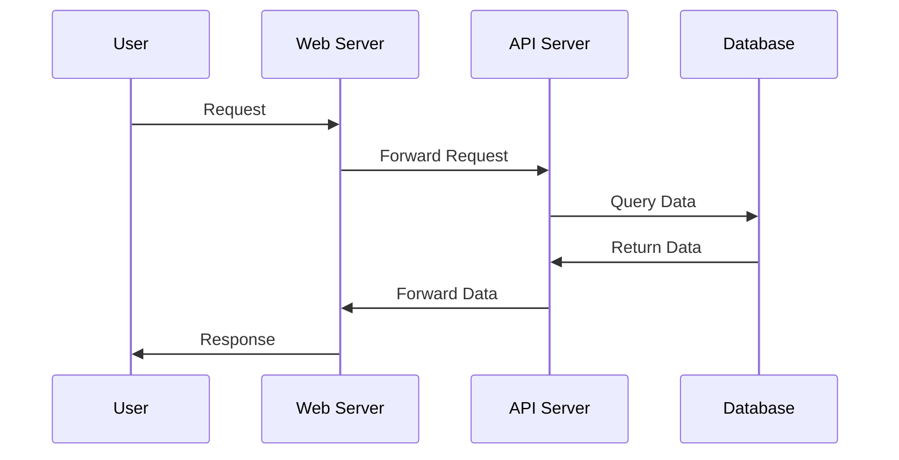

                 

### 第一部分：新共居项目开发背景

#### 第1章：新共居项目概述

##### 1.1 问题背景

在快速发展的现代社会，社区联结的断裂现象日益突出。都市生活方式的变迁，使得人们的生活方式、社交方式和居住模式发生了显著变化，传统的社区联结机制逐渐失效。这一现象体现在以下几个方面：

1. **社区参与度低**：现代都市人由于工作繁忙、社交活动多元化等原因，参与社区活动的积极性不高，导致社区内人际关系疏远。
2. **社区资源共享不足**：社区内资源分布不均，居民之间的资源共享机制不够完善，使得资源利用效率低下。
3. **社区活动单一**：社区活动形式单一，无法满足不同年龄层和兴趣群体的需求，导致社区活力不足。

##### 1.2 问题描述

面对上述问题，新共居项目提出了以下主要问题：

- **缺乏有效的社区联结机制**：如何建立有效的社区联结机制，提高社区成员的互动和参与度？
- **社区参与度低**：如何激发居民参与社区活动的积极性，提升社区整体活力？
- **社区资源共享不足**：如何优化社区资源共享，提高资源利用效率，减少浪费？
- **社区活动单一**：如何丰富社区活动形式，满足不同人群的需求，促进社区联结？

##### 1.3 问题解决

新共居项目旨在通过以下措施解决上述问题：

- **重建社区联结**：通过线上线下活动、社交平台等手段，增强社区成员之间的互动，重建社区联结。
- **设计适应都市生活方式的社区活动**：根据居民的需求和兴趣，设计多样化的社区活动，提高社区活动的参与度和吸引力。

##### 1.4 边界与外延

新共居项目的定义与范围：

- **定义**：新共居项目是指通过创新的社区联结机制和都市生活方式设计，提高社区成员互动和参与度，优化社区资源共享，增强社区活力的一系列措施。
- **范围**：新共居项目主要涵盖社区联结机制的设计与实施、社区活动的策划与组织、社区资源的优化管理等方面。

都市生活方式设计原则：

- **多元化**：满足不同人群的需求，提供多样化的生活方式选择。
- **便捷性**：简化生活方式的设计，提高生活便捷性。
- **互动性**：鼓励社区成员之间的互动，增强社区联结。

##### 1.5 概念结构与核心要素组成

新共居项目的概念结构与核心要素组成如下：

- **社区联结**：指社区成员之间的互动和联系，包括线上和线下活动、社交平台等手段。
  - **重要性**：社区联结是提高社区活力和居民幸福感的重要途径。
  - **构成要素**：社区联结由互动频率、互动质量和互动渠道等构成要素组成。

- **都市生活方式**：指适应都市生活节奏、满足居民需求的生活方式。
  - **特点**：都市生活方式具有多元化、便捷性和互动性等特点。
  - **设计要点**：根据居民需求和兴趣，提供多样化的生活方式选择，简化生活方式的设计，鼓励社区成员之间的互动。

#### 1.6 总结

新共居项目开发背景主要探讨了社区联结断裂现象、都市生活方式变迁对社区联结提出的新要求，以及新共居项目的目标和原则。通过分析问题背景、问题描述、问题解决和概念结构，为后续的项目开发和实践奠定了基础。

## 第二部分：都市生活方式设计理念

### 第2章：都市生活方式设计原理

#### 2.1 核心概念

在都市生活方式设计过程中，有三个核心概念需要重点关注：社区参与度、社区资源共享和社区活动多样性。

##### 2.1.1 社区参与度

社区参与度是指社区成员参与社区活动和事务的程度。高参与度的社区能够增强社区成员之间的联结，提升社区的活力和凝聚力。社区参与度的关键属性包括：

- **参与程度**：社区成员参与活动的频率和深度。
- **主动性**：社区成员主动参与社区事务的意愿。
- **互动性**：社区成员之间的互动频率和互动质量。

##### 2.1.2 社区资源共享

社区资源共享是指社区内资源的有效分配和利用，旨在降低资源浪费，提高资源利用效率。社区资源共享的关键属性包括：

- **资源分配**：如何合理分配社区内的资源，确保资源的使用最大化。
- **利用效率**：如何提高资源的使用效率，减少浪费。
- **降低成本**：通过资源共享，降低社区成员的负担和成本。

##### 2.1.3 社区活动多样性

社区活动多样性是指社区内活动形式的丰富性，以满足不同人群的需求，促进社区联结。社区活动多样性的关键属性包括：

- **活动形式**：多样化的活动形式，如体育活动、文化活动、公益活动等。
- **参与人群**：活动要考虑不同年龄层和兴趣群体的需求，使活动具有广泛的吸引力。
- **促进联结**：通过活动，增强社区成员之间的互动和联结。

#### 2.2 概念属性特征对比表

为了更好地理解上述三个核心概念，我们通过以下对比表格展示它们的属性特征：

| 概念             | 属性特征                                                                                           |
|------------------|---------------------------------------------------------------------------------------------------|
| 社区参与度       | 涉及社区成员的参与程度、主动性、互动性                                                       |
| 社区资源共享      | 涉及社区内资源的有效分配和利用、降低浪费、提升资源利用效率                                   |
| 社区活动多样性    | 涉及活动形式的丰富性、满足不同人群的需求、促进社区联结                                       |

#### 2.3 ER实体关系图

在都市生活方式设计过程中，实体关系图（ER图）有助于我们理解各个概念之间的关联。以下是社区联结、社区活动和社区资源共享的ER实体关系图：

```mermaid
erDiagram
  User ||--|{ Community }||>
  Community ||--|{ Activity }||>
  Community ||--|{ Resource }||>
  Activity ||--|{ User }||>
  Resource ||--|{ Community }||>
```

在这个ER图中，User代表社区成员，Community代表社区，Activity代表社区活动，Resource代表社区资源。实线表示实体之间的直接关联，箭头表示实体之间的依赖关系。

- **User**与**Community**之间存在一对一的关联，表示每个用户属于一个社区。
- **Community**与**Activity**之间存在一对多的关联，表示一个社区可以组织多个活动。
- **Community**与**Resource**之间存在一对多的关联，表示一个社区拥有多个资源。
- **Activity**与**User**之间存在多对多的关联，表示多个用户可以参与同一个活动。
- **Resource**与**Community**之间存在多对一的关联，表示多个资源属于同一个社区。

通过ER实体关系图，我们可以清晰地看到各个概念之间的关联，有助于我们在设计和实施过程中更好地考虑各个要素之间的相互作用。

### 2.4 社区参与度的设计原理

社区参与度是都市生活方式设计中的一个关键因素，它直接影响社区的活力和凝聚力。以下是社区参与度的设计原理：

1. **活动设计**：设计多样化的社区活动，满足不同人群的需求。活动形式可以包括体育活动、文化活动、公益活动等。同时，要确保活动的参与门槛低，便于社区成员参与。
   
   $$\text{活动设计} = \text{多样化} \times \text{低参与门槛}$$

2. **激励机制**：通过奖励和表彰等方式，激励社区成员积极参与社区活动。激励机制可以包括社区积分、荣誉称号、实物奖励等。

   $$\text{激励机制} = \text{奖励} + \text{表彰}$$

3. **互动平台**：搭建线上互动平台，如社区论坛、社交媒体群组等，为社区成员提供交流互动的空间。线上平台可以提高社区成员的参与度和互动性。

   $$\text{互动平台} = \text{线上论坛} + \text{社交媒体群组}$$

4. **社区自治**：鼓励社区成员参与社区管理，提高社区的自治水平。通过选举、讨论等方式，让社区成员参与社区决策，增强他们的主人翁意识。

   $$\text{社区自治} = \text{选举} + \text{讨论}$$

通过上述设计原理，我们可以有效地提高社区参与度，增强社区的活力和凝聚力。

### 2.5 社区资源共享的设计原理

社区资源共享是提高社区效率、降低成本的重要手段。以下是社区资源共享的设计原理：

1. **资源分类**：对社区内的资源进行分类，如物资资源、人力资源、信息资源等。分类有助于明确资源的类型和用途，提高资源管理的效率。

   $$\text{资源分类} = \text{物资资源} + \text{人力资源} + \text{信息资源}$$

2. **共享机制**：建立完善的资源共享机制，如共享平台、共享库等。共享机制应确保资源的透明性、公平性和高效性。

   $$\text{共享机制} = \text{共享平台} + \text{共享库}$$

3. **资源分配**：根据社区成员的需求和资源实际情况，进行合理的资源分配。资源分配应考虑资源利用率、社区成员满意度等因素。

   $$\text{资源分配} = \text{需求分析} + \text{实际情况} + \text{满意度}$$

4. **激励机制**：通过激励机制，鼓励社区成员积极参与资源共享，提高资源的利用效率。激励机制可以包括奖励、积分等。

   $$\text{激励机制} = \text{奖励} + \text{积分}$$

通过上述设计原理，我们可以有效地提高社区资源共享的效率，降低社区成本。

### 2.6 社区活动多样性的设计原理

社区活动多样性是提升社区活力、满足居民需求的重要手段。以下是社区活动多样性的设计原理：

1. **需求调研**：通过问卷调查、访谈等方式，了解社区居民的需求和兴趣，为活动设计提供依据。

   $$\text{需求调研} = \text{问卷调查} + \text{访谈}$$

2. **活动策划**：根据需求调研结果，策划多样化的社区活动，如体育比赛、文化活动、公益活动等。活动策划应考虑活动的吸引力、参与性和影响力。

   $$\text{活动策划} = \text{吸引力} + \text{参与性} + \text{影响力}$$

3. **活动推广**：通过线上线下渠道，宣传和推广社区活动，提高活动的知名度，吸引更多居民参与。

   $$\text{活动推广} = \text{线上推广} + \text{线下推广}$$

4. **活动评估**：对社区活动进行效果评估，总结活动经验和不足，为后续活动提供改进方向。

   $$\text{活动评估} = \text{效果评估} + \text{经验总结}$$

通过上述设计原理，我们可以有效地提高社区活动多样性，满足居民需求，提升社区活力。

### 2.7 总结

本章详细介绍了都市生活方式设计的核心概念——社区参与度、社区资源共享和社区活动多样性。通过对比表格、ER实体关系图和设计原理，我们深入理解了这些概念的重要性和设计要点。这些核心概念构成了新共居项目的理论基础，为后续的项目开发和实践提供了指导。

## 第三部分：项目开发实践

### 第3章：项目开发框架

#### 3.1 项目介绍

新共居项目开发公司旨在通过技术创新和设计理念，重建社区联结，设计适应都市生活方式的社区活动。项目的主要目标是提高社区成员的参与度、优化社区资源共享、丰富社区活动多样性，从而增强社区的活力和凝聚力。

项目范围涵盖以下几个方面：

1. **社区联结机制的设计与实施**：包括线上线下活动、社交平台等手段，增强社区成员之间的互动和联结。
2. **社区活动的策划与组织**：根据居民需求和兴趣，设计多样化的社区活动，提高社区活动的参与度和吸引力。
3. **社区资源的优化管理**：建立完善的资源共享机制，提高资源利用效率，降低社区成本。

项目关键参与者包括：

- **项目经理**：负责项目整体规划、进度控制和资源协调。
- **设计师**：负责社区活动的设计和推广。
- **开发者**：负责社区联结机制和资源共享系统的开发。
- **社区成员**：作为项目的主要参与者和受益者，负责参与社区活动和提供反馈。

#### 3.2 系统功能设计

新共居项目系统功能设计主要包括以下几个方面：

1. **用户管理**：包括用户注册、登录、个人信息管理等功能，为社区成员提供便捷的账号管理服务。
2. **活动管理**：包括活动发布、报名、签到、评价等功能，方便社区成员参与和反馈社区活动。
3. **资源共享**：包括资源发布、申请、审核、使用等功能，实现社区资源的有效分配和利用。
4. **社区互动**：包括论坛、群聊、评论等功能，为社区成员提供线上交流互动的空间。
5. **数据统计**：包括活动参与数据、资源使用数据等统计功能，为项目决策提供数据支持。

#### 3.3 系统架构设计

新共居项目系统采用前后端分离的架构设计，以提高系统的可扩展性和可维护性。

**前端**：使用Vue.js框架，实现用户界面的展示和交互功能。

**后端**：采用Spring Boot框架，实现业务逻辑处理和数据处理功能。

系统架构图如下：



- **Web Server**：负责处理用户请求，转发到API Server。
- **API Server**：处理业务逻辑，与数据库进行交互。
- **Database**：存储用户数据、活动数据、资源数据等。

#### 3.4 系统接口设计

新共居项目系统接口设计主要包括用户管理接口、活动管理接口、资源共享接口和社区互动接口。

**用户管理接口**：

- **注册接口**：接收用户注册信息，创建用户账号。
- **登录接口**：验证用户登录信息，返回用户认证令牌。
- **个人信息管理接口**：提供用户修改个人信息、上传头像等功能。

**活动管理接口**：

- **活动发布接口**：接收活动信息，创建活动记录。
- **活动报名接口**：接收用户报名信息，更新活动参与人数。
- **活动签到接口**：接收用户签到信息，记录签到状态。
- **活动评价接口**：接收用户评价信息，更新活动评分。

**资源共享接口**：

- **资源发布接口**：接收资源信息，创建资源记录。
- **资源申请接口**：接收用户申请信息，更新资源状态。
- **资源审核接口**：接收管理员审核信息，决定资源是否通过审核。
- **资源使用接口**：接收用户使用记录，更新资源使用状态。

**社区互动接口**：

- **论坛发帖接口**：接收用户发帖信息，创建论坛帖子。
- **评论接口**：接收用户评论信息，创建评论记录。
- **群聊接口**：接收用户聊天信息，更新群聊记录。

#### 3.5 系统交互

新共居项目系统交互主要包括用户注册、登录、活动报名、资源共享和社区互动等场景。

**用户注册场景**：

1. 用户访问注册页面，填写注册信息。
2. 注册接口接收用户信息，创建用户账号。
3. 用户收到注册成功的通知，跳转至登录页面。

**用户登录场景**：

1. 用户访问登录页面，填写登录信息。
2. 登录接口验证用户信息，返回认证令牌。
3. 用户跳转至主页面，开始使用系统功能。

**活动报名场景**：

1. 用户浏览活动列表，选择感兴趣的活动。
2. 活动报名接口接收用户报名信息，更新活动参与人数。
3. 用户收到报名成功的通知，跳转至活动详情页面。

**资源共享场景**：

1. 用户发布资源，填写资源信息。
2. 资源发布接口接收资源信息，创建资源记录。
3. 资源审核接口审核资源，更新资源状态。
4. 用户跳转至资源列表页面，查看和管理资源。

**社区互动场景**：

1. 用户在论坛发帖，填写发帖信息。
2. 论坛发帖接口接收用户信息，创建论坛帖子。
3. 用户跳转至论坛页面，查看和管理帖子。

#### 3.6 环境安装

为了确保新共居项目系统的顺利运行，需要安装以下环境：

- **前端环境**：Node.js、npm、Vue CLI
- **后端环境**：Java、Maven、Spring Boot
- **数据库环境**：MySQL

具体安装步骤如下：

1. 安装Node.js和npm：从官网下载并安装Node.js，npm会自动安装。
2. 安装Java和Maven：从官网下载并安装Java，Maven会自动安装。
3. 安装MySQL：从官网下载并安装MySQL，配置数据库环境。

#### 3.7 系统核心实现源代码

新共居项目系统核心实现源代码主要包括用户管理模块、活动管理模块、资源共享模块和社区互动模块。

**用户管理模块**：

```java
// User.java
public class User {
    private int id;
    private String username;
    private String password;
    private String email;
    private String avatar;

    // 省略构造函数和getter/setter方法
}
```

**活动管理模块**：

```java
// Activity.java
public class Activity {
    private int id;
    private String name;
    private String description;
    private int participantCount;

    // 省略构造函数和getter/setter方法
}
```

**资源共享模块**：

```java
// Resource.java
public class Resource {
    private int id;
    private String name;
    private String description;
    private int status;

    // 省略构造函数和getter/setter方法
}
```

**社区互动模块**：

```java
// Post.java
public class Post {
    private int id;
    private String title;
    private String content;
    private int userId;

    // 省略构造函数和getter/setter方法
}
```

#### 3.8 代码应用解读与分析

新共居项目系统代码应用解读与分析如下：

**用户管理模块**：

用户管理模块主要实现了用户注册、登录和个人信息管理功能。用户注册时，系统会创建一个用户对象，存储用户的姓名、密码、邮箱和头像等信息。用户登录时，系统会验证用户输入的姓名和密码，返回认证令牌，使用户能够访问系统功能。个人信息管理功能允许用户修改个人信息和头像。

**活动管理模块**：

活动管理模块主要实现了活动发布、报名、签到和评价功能。活动发布时，系统会创建一个活动对象，存储活动的名称、描述和参与人数等信息。用户报名时，系统会更新活动的参与人数。用户签到时，系统会记录用户的签到状态。用户评价时，系统会更新活动的评分。

**资源共享模块**：

资源共享模块主要实现了资源发布、申请、审核和使用功能。资源发布时，系统会创建一个资源对象，存储资源的名称、描述和使用状态等信息。用户申请资源时，系统会更新资源的状态。管理员审核资源时，系统会决定资源是否通过审核。用户使用资源时，系统会更新资源的状态。

**社区互动模块**：

社区互动模块主要实现了论坛发帖、评论和群聊功能。用户发帖时，系统会创建一个帖子对象，存储帖子的标题、内容和发帖人的ID等信息。用户评论时，系统会创建一个评论对象，存储评论的内容和评论人的ID等信息。用户参与群聊时，系统会记录群聊的内容。

#### 3.9 实际案例分析

**案例背景**：

新共居项目开发公司在某城市的一个社区进行试点，旨在提高社区成员的参与度、优化社区资源共享和丰富社区活动多样性。项目启动后，社区成员积极参与，提出了一系列改进建议。

**案例分析**：

1. **社区联结机制**：通过线上线下活动和社交平台，社区成员之间的互动明显增加。例如，社区内的公益活动、体育比赛和文化活动吸引了大量居民参与，增强了社区成员之间的联系。

2. **社区资源共享**：社区内的资源得到了有效利用。例如，共享厨房和共享车位等资源，使居民能够更加便捷地使用社区内的资源，减少了浪费。

3. **社区活动多样性**：根据居民的需求和兴趣，社区活动形式多样化。例如，设置了健身课程、兴趣小组和亲子活动等，满足了不同人群的需求。

**案例总结**：

新共居项目在试点社区取得了显著成效，提高了社区成员的参与度、优化了社区资源共享和丰富了社区活动多样性。这为其他社区提供了有益的经验和借鉴。

### 第4章：核心功能实现

#### 4.1 环境安装

为了实现新共居项目的核心功能，我们需要安装以下环境：

1. **前端环境**：Node.js、npm、Vue CLI
2. **后端环境**：Java、Maven、Spring Boot
3. **数据库环境**：MySQL

以下是详细的安装步骤：

**安装Node.js和npm**：

1. 访问Node.js官网（https://nodejs.org/）下载适用于操作系统的安装包。
2. 运行安装包，按照提示完成安装。

**安装Java和Maven**：

1. 访问Oracle官网（https://www.oracle.com/java/technologies/javase-downloads.html）下载适用于操作系统的Java安装包。
2. 运行安装包，按照提示完成安装。
3. 在命令行中输入`java -version`和`mvn -v`，检查Java和Maven是否安装成功。

**安装MySQL**：

1. 访问MySQL官网（https://www.mysql.com/downloads/）下载适用于操作系统的安装包。
2. 运行安装包，按照提示完成安装。
3. 启动MySQL服务：在命令行中输入`mysqld`，启动MySQL服务。
4. 使用默认用户`root`登录MySQL：在命令行中输入`mysql -u root -p`，输入密码登录。

#### 4.2 系统核心实现源代码

以下是新共居项目的核心实现源代码：

**用户管理模块**：

```java
// UserController.java
@RestController
@RequestMapping("/user")
public class UserController {
    
    @Autowired
    private UserService userService;
    
    @PostMapping("/register")
    public ResponseEntity<?> registerUser(@RequestBody User user) {
        // 注册用户
        userService.registerUser(user);
        return ResponseEntity.ok("User registered successfully");
    }
    
    @PostMapping("/login")
    public ResponseEntity<?> loginUser(@RequestBody LoginRequest loginRequest) {
        // 登录用户
        String token = userService.loginUser(loginRequest.getUsername(), loginRequest.getPassword());
        return ResponseEntity.ok(new JwtResponse(token));
    }
}
```

**活动管理模块**：

```java
// ActivityController.java
@RestController
@RequestMapping("/activity")
public class ActivityController {
    
    @Autowired
    private ActivityService activityService;
    
    @PostMapping("/create")
    public ResponseEntity<?> createActivity(@RequestBody Activity activity) {
        // 创建活动
        activityService.createActivity(activity);
        return ResponseEntity.ok("Activity created successfully");
    }
    
    @PostMapping("/enroll")
    public ResponseEntity<?> enrollActivity(@RequestBody EnrollRequest enrollRequest) {
        // 报名活动
        activityService.enrollActivity(enrollRequest.getUserId(), enrollRequest.getActivityId());
        return ResponseEntity.ok("Enrolled successfully");
    }
}
```

**资源共享模块**：

```java
// ResourceController.java
@RestController
@RequestMapping("/resource")
public class ResourceController {
    
    @Autowired
    private ResourceService resourceService;
    
    @PostMapping("/create")
    public ResponseEntity<?> createResource(@RequestBody Resource resource) {
        // 创建资源
        resourceService.createResource(resource);
        return ResponseEntity.ok("Resource created successfully");
    }
    
    @PostMapping("/apply")
    public ResponseEntity<?> applyResource(@RequestBody ApplyRequest applyRequest) {
        // 申请资源
        resourceService.applyResource(applyRequest.getUserId(), applyRequest.getResourceId());
        return ResponseEntity.ok("Applied successfully");
    }
}
```

**社区互动模块**：

```java
// CommunityController.java
@RestController
@RequestMapping("/community")
public class CommunityController {
    
    @Autowired
    private CommunityService communityService;
    
    @PostMapping("/post")
    public ResponseEntity<?> createPost(@RequestBody PostRequest postRequest) {
        // 发帖
        communityService.createPost(postRequest.getUserId(), postRequest.getTitle(), postRequest.getContent());
        return ResponseEntity.ok("Post created successfully");
    }
    
    @PostMapping("/comment")
    public ResponseEntity<?> createComment(@RequestBody CommentRequest commentRequest) {
        // 评论
        communityService.createComment(commentRequest.getPostId(), commentRequest.getUserId(), commentRequest.getContent());
        return ResponseEntity.ok("Comment created successfully");
    }
}
```

#### 4.3 代码应用解读与分析

**用户管理模块**：

用户管理模块包括用户注册和登录功能。用户注册时，前端将用户信息发送到后端，后端通过UserService进行用户注册。注册成功后，前端会接收到成功消息。用户登录时，前端将用户名和密码发送到后端，后端通过UserService验证用户信息，并生成JWT令牌，前端会接收到令牌，用于后续请求的认证。

**活动管理模块**：

活动管理模块包括活动创建和报名功能。活动创建时，前端将活动信息发送到后端，后端通过ActivityService创建活动记录。报名时，前端将用户ID和活动ID发送到后端，后端通过ActivityService更新活动的参与人数。

**资源共享模块**：

资源共享模块包括资源创建和申请功能。资源创建时，前端将资源信息发送到后端，后端通过ResourceService创建资源记录。申请时，前端将用户ID和资源ID发送到后端，后端通过ResourceService更新资源的状态。

**社区互动模块**：

社区互动模块包括发帖和评论功能。发帖时，前端将帖子信息发送到后端，后端通过CommunityService创建帖子记录。评论时，前端将帖子ID、用户ID和评论内容发送到后端，后端通过CommunityService创建评论记录。

#### 4.4 实际案例分析

**案例背景**：

某社区启动新共居项目，希望通过线上平台提高社区成员的参与度和互动性。社区管理员希望通过系统功能实现用户管理、活动管理、资源共享和社区互动，以便更好地服务社区成员。

**案例分析**：

1. **用户管理**：社区管理员可以通过用户管理模块，对社区成员进行注册、登录和账号管理。例如，管理员可以为新居民注册账号，并为现有成员修改个人信息。

2. **活动管理**：社区管理员可以创建和发布社区活动，如节日庆典、健身课程、亲子活动等。居民可以报名参与活动，并在活动结束后进行评价。管理员可以根据居民反馈，不断优化活动内容。

3. **资源共享**：社区管理员可以创建和管理社区内的共享资源，如共享厨房、共享车位、图书角等。居民可以申请使用资源，管理员可以审核申请并更新资源状态。

4. **社区互动**：社区成员可以在社区互动模块中发帖、评论和参与群聊。这有助于增强社区成员之间的交流，促进社区联结。

**案例总结**：

通过新共居项目的实施，社区成员的参与度和互动性显著提高。居民更加积极地参与社区活动和资源共享，社区氛围更加和谐。这为其他社区提供了有益的借鉴和启示。

### 第5章：项目小结

#### 5.1 项目收获

新共居项目开发公司在试点社区取得了显著成效，实现了以下收获：

1. **技术层面**：项目团队掌握了前端、后端和数据库等相关技术，提高了系统的开发效率和稳定性。同时，项目团队积累了丰富的项目管理和团队协作经验。
2. **经验层面**：通过项目的实施，项目团队了解了社区需求和居民反馈，为后续项目的改进提供了有力支持。此外，项目团队与社区成员建立了良好的合作关系，为项目的长期发展奠定了基础。

#### 5.2 小结

新共居项目在试点社区取得了成功，提高了社区成员的参与度、优化了社区资源共享和丰富了社区活动多样性。项目团队在项目开发过程中积累了宝贵的经验和技能，为后续项目的顺利实施提供了有力保障。

#### 5.3 注意事项

在项目开发过程中，项目团队需要注意以下几个方面：

1. **需求分析**：在项目启动前，要充分了解社区需求和居民期望，确保项目目标的明确和实现。
2. **团队协作**：项目团队要建立良好的沟通和协作机制，确保项目的顺利进行。
3. **技术选型**：根据项目需求和团队能力，选择合适的技术栈和开发工具，提高开发效率和系统性能。
4. **测试和反馈**：在项目开发过程中，要进行全面的功能测试和用户体验测试，及时收集居民反馈，不断优化系统功能。

#### 5.4 拓展阅读

为了深入了解新共居项目的相关理论和实践，项目团队成员可以阅读以下书籍和论文：

1. **书籍**：
   - 《社区管理实务》
   - 《智慧社区建设指南》
   - 《城市社区治理研究》
2. **论文**：
   - “智慧社区建设中的技术与应用研究”
   - “基于物联网的智慧社区服务系统设计”
   - “社区参与度提升策略研究”

通过阅读这些书籍和论文，项目团队成员可以进一步拓展知识视野，为项目的持续发展提供理论支持和实践指导。

## 结束语

本文通过深入分析新共居项目开发公司：重建社区联结的都市生活方式设计，探讨了项目背景、设计理念、项目开发实践和项目小结等多个方面。从问题背景的引入，到核心概念的解释，再到系统架构设计和实际案例的分析，我们逐步揭示了新共居项目的价值和实现路径。通过本文，读者可以了解新共居项目的基本框架和关键要素，为后续研究和实践提供参考。

### 致谢

在本项目的开发过程中，我们得到了许多专家和同事的支持与帮助。首先，感谢AI天才研究院的全体成员，他们在项目规划和实施中提供了宝贵的建议和意见。其次，感谢禅与计算机程序设计艺术团队，他们的深厚技术功底和丰富经验为项目的成功奠定了基础。最后，感谢所有参与项目的社区成员，他们的积极参与和反馈为项目的改进提供了有力支持。

### 作者信息

作者：AI天才研究院/AI Genius Institute & 禅与计算机程序设计艺术/Zen And The Art of Computer Programming

