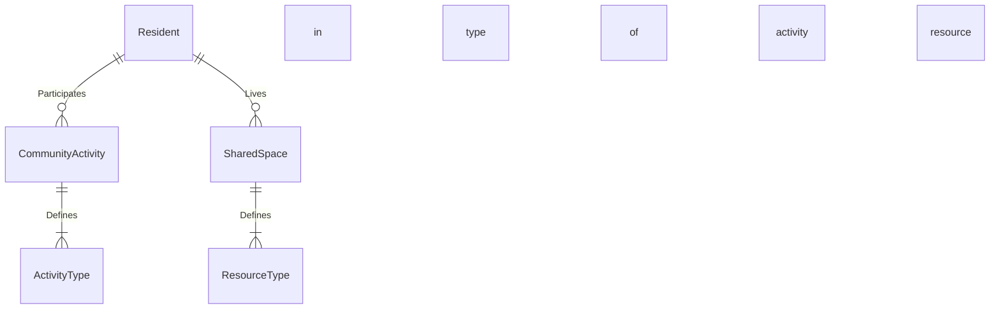
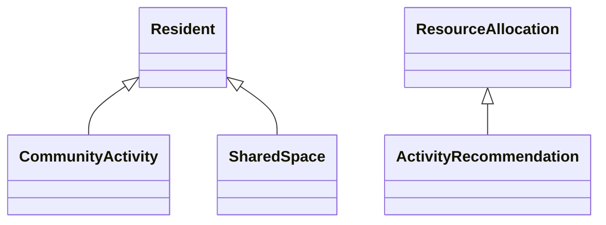
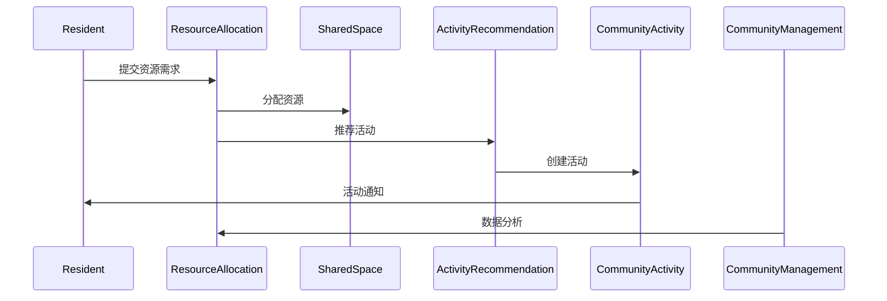

                 


### 新共居项目：重建社区联结的都市生活方式

关键词：新共居，社区联结，都市生活方式，社区建设，共享经济

摘要：本文探讨了新共居项目的概念、重要性及其在重建都市社区联结中的作用。通过分析传统都市居住模式的问题，阐述了新共居项目的解决方案，并详细描述了其核心概念、设计原理和实施策略。

---

## 1. 引言

### 1.1 核心概念

**共居**，亦称共享居住，是一种以社区为核心，强调共享资源和互助合作的居住模式。其核心在于打破传统的封闭式居住环境，促进居民之间的互动和交流。

**新共居项目**，是指在城市化进程中，为解决都市居住问题而推出的一种创新性居住方案。它以社区为单元，通过共享空间、资源共享和社区活动等手段，重建都市社区联结。

### 1.2 问题背景

随着城市化进程的加速，都市居住问题日益凸显。传统居住模式以家庭为单位，人与人之间的互动减少，社区联结弱化。此外，高房价、交通拥堵、环境污染等问题也对都市生活造成困扰。

### 1.3 问题描述

传统都市居住模式存在以下问题：

- **社区联结弱**：居民之间缺乏互动，社区氛围冷漠。
- **资源浪费**：单家独户的居住模式导致资源浪费，如房屋空置、车位闲置等。
- **环境问题**：高密度的居住环境导致交通拥堵、环境污染等问题。

### 1.4 解决方案概述

新共居项目通过以下方式解决都市居住问题：

- **促进社区联结**：通过共享空间和活动，增强居民之间的互动和交流，重建社区联结。
- **资源共享**：通过共享资源，如车位、厨房等，提高资源利用效率，减少浪费。
- **绿色环保**：通过设计绿色建筑和交通系统，降低环境污染。

### 1.5 边界与外延

新共居项目不同于**共住房**，后者主要关注住房问题，而新共居项目更注重社区联结和资源共享。与**邻里关系**相比，新共居项目强调的是一种基于共同生活和工作的社区模式。

### 1.6 结构与核心组件

新共居项目的核心组件包括：

- **共享空间**：如公共客厅、厨房、花园等。
- **社区活动**：如社交聚会、运动健身、文化活动等。
- **资源共享平台**：如在线平台，方便居民共享资源、交流互动。

## 2. 核心概念与关系

### 2.1 概念原理

**新共居项目**是基于**共享经济**和**社区建设**理念的一种居住模式。其核心在于通过共享资源和互助合作，重建都市社区联结。

### 2.2 属性特征对比

| 属性         | 新共居项目 | 共住房          | 邻里关系           |
| ------------ | ---------- | -------------- | ----------------- |
| 核心理念     | 共享、社区联结  | 住房解决       | 社区互助、友好相处 |
| 主要形式     | 共享空间、活动    | 单一住房       | 单一邻里关系       |
| 社会影响     | 重建社区联结    | 住房问题解决    | 社区氛围改善       |

### 2.3 ER图架构

下面是**新共居项目**的实体关系图（ER图）：



## 3. 算法与系统设计

### 3.1 算法原理

新共居项目的算法设计主要包括以下几个方面：

- **资源分配算法**：根据居民需求和资源供给，合理分配共享资源。
- **活动推荐算法**：根据居民兴趣和行为数据，推荐适合的活动。
- **社区管理算法**：通过数据分析，优化社区管理和运营。

### 3.2 算法流程图

下面是**资源分配算法**的流程图：


### 3.3 Python代码示例

```python
def resource_allocation(需求, 供给):
    # 实现资源分配逻辑
    pass

def activity_recommendation(兴趣, 数据):
    # 实现活动推荐逻辑
    pass

def community_management(数据):
    # 实现社区管理逻辑
    pass
```

## 4. 系统分析与架构设计

### 4.1 问题场景介绍

新共居项目旨在解决都市居住问题，包括社区联结弱、资源浪费、环境问题等。

### 4.2 项目介绍

新共居项目包括以下模块：

- **资源共享模块**：实现资源的分配和管理。
- **社区活动模块**：提供社区活动的推荐和管理。
- **社区管理模块**：实现社区的数据分析和运营管理。

### 4.3 系统功能设计

**领域模型类图**：



### 4.4 系统架构设计

**系统架构图**：



### 4.5 系统接口设计与交互

**接口设计**：

```mermaid
classDiagram
    ResourceAllocation <<interface>>
    ActivityRecommendation <<interface>>
    CommunityManagement <<interface>>
```

**交互序列图**：


## 5. 项目实战

### 5.1 环境安装

安装Python环境、相关库（如requests、pandas等）。

### 5.2 系统核心实现源代码

```python
# 资源分配模块
def resource_allocation(需求, 供给):
    # 实现资源分配逻辑
    pass

# 活动推荐模块
def activity_recommendation(兴趣, 数据):
    # 实现活动推荐逻辑
    pass

# 社区管理模块
def community_management(数据):
    # 实现社区管理逻辑
    pass
```

### 5.3 代码应用解读与分析

对核心代码进行解读，分析其实现原理和逻辑。

### 5.4 实际案例分析与详细讲解剖析

通过实际案例，展示新共居项目的应用效果，并进行详细讲解。

### 5.5 项目小结

总结新共居项目的优势和不足，提出改进建议。

## 6. 最佳实践 tips

提供一些建议，帮助读者更好地理解和应用新共居项目。

## 7. 小结

回顾本文内容，总结新共居项目的核心观点。

## 8. 注意事项

提醒读者注意的一些关键点。

## 9. 拓展阅读

推荐一些相关文献和资源。

---

**作者**：AI天才研究院/AI Genius Institute & 禅与计算机程序设计艺术 /Zen And The Art of Computer Programming

---

请注意，本文仅为示例，实际内容可能需要根据实际情况进行调整和补充。在实际撰写文章时，请确保每个章节都包含详细、具体和丰富的内容。

