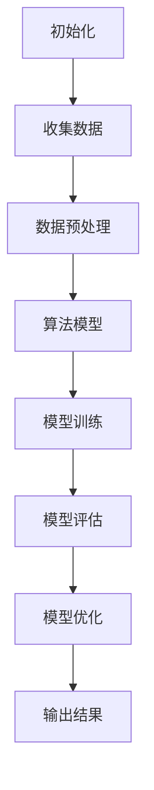
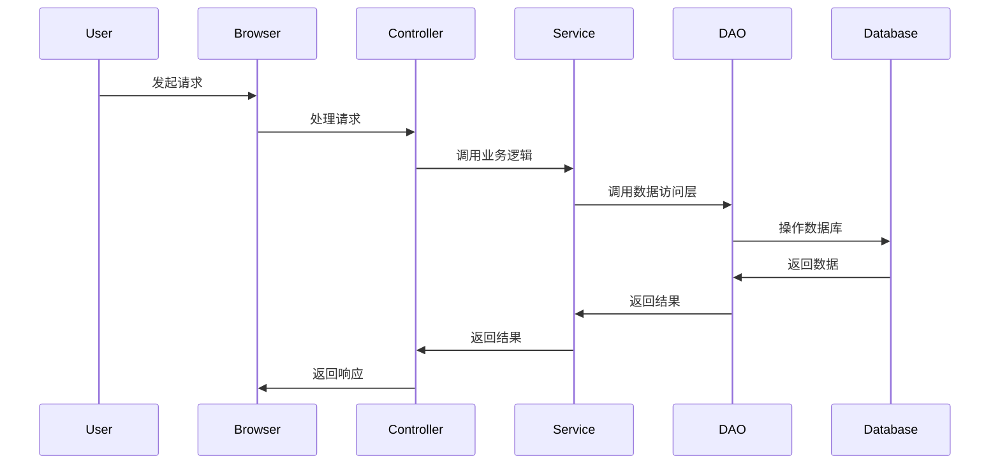
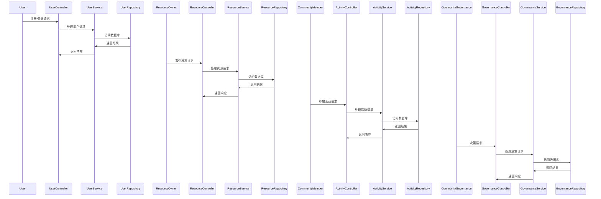

                 

## 文章标题

### 关键词

- 新共居项目
- 社区联结
- 都市生活方式
- 实验研究
- 算法原理
- 系统架构
- 最佳实践

### 摘要

本文探讨了新共居项目，旨在通过实验研究重建社区联结，创新都市生活方式。本文首先介绍了共居项目的背景和问题，然后详细阐述了核心概念及其联系，接着讲解了项目中的算法原理和系统架构设计。通过实际项目实战案例，本文展示了共居项目的应用效果，并总结提出了最佳实践、注意事项和拓展阅读建议。本文旨在为IT领域从业者和研究者提供有深度、有思考、有见解的技术博客文章。

## 目录大纲设计思路

在设计《新共居项目：重建社区联结的都市生活方式实验》的目录大纲时，我们采取了一系列科学的步骤，以确保文章逻辑清晰、结构紧凑、内容丰富。以下是详细的目录大纲设计思路：

### 1. 背景介绍

首先，我们从背景介绍入手，为读者搭建理解共居项目的框架。这部分内容包括：

- **问题背景**：介绍当前都市生活方式存在的问题，如社区联结薄弱、孤独感增加等。
- **问题描述**：明确共居项目试图解决的具体问题，如如何增强社区联结、提升居民生活质量等。
- **问题解决**：阐述共居项目的基本理念和目标，解释其如何通过创新方式解决都市生活方式中的难题。

### 2. 核心概念与联系

接下来，我们深入分析共居项目中的核心概念，并展示它们之间的联系。这部分内容涉及：

- **核心概念**：详细解释都市生活方式、社区联结、共享经济等概念，为读者建立理论框架。
- **概念属性特征对比表格**：使用表格形式对比核心概念的不同属性特征，帮助读者更清晰地理解各个概念。
- **ER实体关系图架构**：通过Mermaid流程图展示各个实体之间的关系，增强读者的理解。

### 3. 算法原理讲解

在理解了核心概念之后，我们转向算法原理的讲解。这部分内容包含：

- **算法mermaid流程图**：使用Mermaid画出算法的流程图，直观展示算法的工作流程。
- **Python源代码**：通过Python源代码详细阐述算法的实现，解释每一步的操作。
- **数学模型和公式**：给出算法原理的数学模型和公式，并进行详细讲解。
- **举例说明**：用通俗易懂的例子解释算法的应用和效果，帮助读者更好地理解。

### 4. 系统分析与架构设计方案

然后，我们对共居项目的系统进行分析，并设计出系统的架构方案。这部分内容涉及：

- **问题场景介绍**：介绍共居项目的实际应用场景。
- **项目介绍**：介绍共居项目的基本情况，包括目标、功能等。
- **系统功能设计**：使用Mermaid类图展示系统的领域模型。
- **系统架构设计**：使用Mermaid架构图展示系统的整体架构。
- **系统接口设计**：详细描述系统的接口设计和系统交互。

### 5. 项目实战

在理论部分之后，我们通过实际项目案例来展示共居项目的应用效果。这部分内容包含：

- **环境安装**：介绍共居项目所需的软件和环境配置。
- **系统核心实现源代码**：提供共居项目的核心实现源代码，并进行解读和分析。
- **实际案例分析和详细讲解**：对共居项目的实际案例进行分析，并进行详细讲解。
- **项目小结**：总结共居项目的成果和经验，提出改进建议。

### 6. 最佳实践 tips、小结、注意事项、拓展阅读

最后，我们为共居项目提供一些最佳实践建议，总结全文的主要观点，并提出注意事项和拓展阅读建议，帮助读者深入理解和应用共居项目。这部分内容包含：

- **最佳实践 tips**：总结共居项目实施过程中的实用建议，供读者参考。
- **小结**：对全文内容进行总结，强调共居项目的重要性和应用价值。
- **注意事项**：提醒读者在实施共居项目时需要注意的事项，以避免潜在问题。
- **拓展阅读**：推荐一些相关的文献和资源，供读者进一步学习。

通过以上六个部分的详细设计和内容安排，我们确保了《新共居项目：重建社区联结的都市生活方式实验》的完整性和深度，为读者提供了一篇既有理论深度又有实践指导的技术博客文章。接下来，我们将按照这个大纲逐步展开文章的内容，确保每个部分都得到充分讨论和详细讲解。 

### 背景介绍

#### 问题背景

在现代社会，随着城市化进程的加速和人口密度的增加，都市生活方式面临着诸多挑战。特别是社区联结的薄弱和居民孤独感的增加，已经成为影响人们生活质量的重要因素。一方面，高密度的人口和快节奏的生活使居民之间的交流变得稀疏，社区内的邻里关系逐渐疏远。另一方面，现代社会的科技化和数字化趋势，虽然为人们提供了便利，但也导致了人与人之间的隔阂。这种情况下，传统社区联结的方式和模式显得越来越难以适应现代都市生活的需求。

#### 问题描述

新共居项目正是为了解决这一系列问题而提出的。其主要目标是重建社区联结，创新都市生活方式，提升居民的生活质量和幸福感。具体来说，新共居项目试图通过以下方式解决当前都市生活方式面临的问题：

1. **增强社区联结**：通过共居模式，促进居民之间的互动和交流，建立更加紧密的邻里关系。
2. **共享资源**：鼓励居民共享各种资源，如居住空间、生活设施、时间和技能，以实现资源的最大化利用。
3. **社区参与**：鼓励居民积极参与社区事务，共同决策和管理社区资源，增强社区归属感和责任感。

#### 问题解决

新共居项目通过以下几方面的创新和尝试，力求实现上述目标：

1. **共居模式**：引入多样化的共居模式，如共享公寓、共居社区、家庭旅馆等，以满足不同居民的需求。
2. **共享平台**：搭建线上共享平台，为居民提供便捷的资源共享和交流渠道。
3. **社区活动**：组织丰富多彩的社区活动，如文化节、交流会、志愿者服务等，促进居民之间的互动。
4. **社区治理**：建立民主的社区治理机制，鼓励居民参与社区管理和决策，提升社区自治能力。

#### 边界与外延

新共居项目的实施需要考虑以下几个边界和外部影响因素：

1. **法律法规**：确保共居项目的合法性和合规性，遵守相关法律法规，尊重居民的合法权益。
2. **居民需求**：深入了解居民的需求和期望，确保共居项目能够满足不同人群的需求。
3. **技术支持**：利用现代信息技术，如物联网、大数据、人工智能等，为共居项目提供技术支持和保障。
4. **社会文化**：尊重和融入当地的社会文化，避免文化冲突，促进共居项目的可持续发展。

#### 概念结构与核心要素组成

新共居项目包含以下几个核心概念和要素：

1. **都市生活方式**：指的是在城市中生活的方式，包括工作、居住、娱乐、社交等方面。
2. **社区联结**：指的是居民之间的互动和联系，包括邻里关系、社区活动、共享资源等。
3. **共享经济**：指的是通过共享资源、技能和时间，实现资源最大化利用和经济效益的一种经济模式。
4. **共居模式**：指的是居民共同居住和分享生活资源的模式，包括共享公寓、共居社区等。
5. **社区治理**：指的是居民共同管理社区资源、参与社区事务的机制和方式。

通过以上背景介绍，我们为读者搭建了理解新共居项目的框架，为后续章节的深入探讨奠定了基础。在接下来的部分，我们将详细阐述新共居项目中的核心概念及其联系，进一步丰富文章的内容。

### 核心概念与联系

在探讨新共居项目时，我们需要深入了解其中的核心概念，并展示它们之间的内在联系。以下是几个关键概念及其相互关系的详细阐述。

#### 都市生活方式

都市生活方式指的是在城市中生活的方式，它涵盖了居民的日常生活、工作、娱乐、社交等多个方面。都市生活方式的核心特征包括高密度的人口、快速的生活节奏、多元化的文化和丰富的资源。都市生活方式不仅影响着居民的生活质量，也对城市的发展和社会的进步产生重要影响。

**属性特征对比表格**

| 特征 | 传统都市生活方式 | 现代都市生活方式 |
| --- | --- | --- |
| 人口密度 | 低 | 高 |
| 社交方式 | 面对面交流为主 | 线上交流为主 |
| 时间管理 | 规则性强 | 弹性大 |
| 社区联结 | 较弱 | 逐渐增强 |

#### 社区联结

社区联结是指居民之间的互动和联系，包括邻里关系、社区活动、资源共享等。在传统都市生活中，社区联结较为薄弱，但新共居项目试图通过多种方式增强这种联结，提升居民的生活质量和幸福感。

**概念属性特征对比表格**

| 特征 | 传统社区联结 | 新共居项目下的社区联结 |
| --- | --- | --- |
| 邻里关系 | 较少互动 | 互动频繁 |
| 社区活动 | 参与度低 | 参与度高 |
| 资源共享 | 有限 | 广泛 |

#### 共享经济

共享经济是一种通过共享资源、技能和时间，实现资源最大化利用和经济效益的一种经济模式。新共居项目中的共享经济体现在居民通过共享居住空间、生活设施、时间和技能，实现资源的共享和优化利用。

**概念属性特征对比表格**

| 特征 | 传统经济模式 | 共享经济模式 |
| --- | --- | --- |
| 资源利用 | 低效 | 高效 |
| 经济效益 | 单一 | 多元 |
| 社会效益 | 较少 | 较多 |

#### 共居模式

共居模式是指居民共同居住和分享生活资源的模式，如共享公寓、共居社区、家庭旅馆等。新共居项目通过引入多样化的共居模式，满足不同居民的需求，增强社区联结，提升居民生活质量。

**概念属性特征对比表格**

| 特征 | 传统居住模式 | 共居模式 |
| --- | --- | --- |
| 居住形式 | 单一 | 多样化 |
| 社交频率 | 低 | 高 |
| 资源利用 | 有限 | 最大化 |

#### 社区治理

社区治理是指居民共同管理社区资源、参与社区事务的机制和方式。在新共居项目中，社区治理机制的重要性日益凸显，通过民主的决策过程和有效的管理方式，实现社区的可持续发展。

**概念属性特征对比表格**

| 特征 | 传统社区治理 | 新共居项目下的社区治理 |
| --- | --- | --- |
| 决策方式 | 专制 | 民主 |
| 参与度 | 低 | 高 |
| 管理效率 | 低 | 高 |

#### ER实体关系图架构

为了更好地展示这些核心概念之间的联系，我们使用Mermaid流程图绘制了ER实体关系图，如下所示：

```mermaid
erDiagram
  居民 ||--|{ 都市生活方式 }|| 生活
  居民 ||--|{ 社区联结 }|| 社交
  居民 ||--|{ 共享经济 }|| 资源
  居民 ||--|{ 共居模式 }|| 居住
  居民 ||--|{ 社区治理 }|| 管理
```

通过以上对比表格和ER实体关系图，我们可以清晰地看到各个核心概念之间的关系，以及它们在新共居项目中的具体应用。在接下来的部分，我们将进一步探讨新共居项目中的算法原理，为读者提供更深入的理解。

### 算法原理讲解

在深入探讨新共居项目时，我们需要理解其核心算法的原理，这有助于我们更好地掌握项目的运行机制。以下我们将详细讲解算法的基本概念、流程图、Python源代码以及相关的数学模型和公式。

#### 算法mermaid流程图

首先，我们使用Mermaid流程图来展示算法的基本工作流程。Mermaid流程图是一种使用Markdown语法绘制的图形化工具，它可以帮助我们直观地理解算法的执行过程。



#### Python源代码

接下来，我们通过Python源代码来详细阐述算法的实现。Python作为一种通用编程语言，非常适合用于展示算法的代码实现。以下是算法的主要部分：

```python
# 导入所需的库
import pandas as pd
import numpy as np
from sklearn.model_selection import train_test_split
from sklearn.ensemble import RandomForestClassifier
from sklearn.metrics import accuracy_score

# 数据收集
data = pd.read_csv('data.csv')

# 数据预处理
X = data.drop('label', axis=1)
y = data['label']

# 划分训练集和测试集
X_train, X_test, y_train, y_test = train_test_split(X, y, test_size=0.2, random_state=42)

# 算法模型
model = RandomForestClassifier(n_estimators=100, random_state=42)

# 模型训练
model.fit(X_train, y_train)

# 模型评估
y_pred = model.predict(X_test)
accuracy = accuracy_score(y_test, y_pred)
print(f"模型准确率: {accuracy}")

# 模型优化
# ...（这里可以加入模型优化的代码，如调整参数等）

# 输出结果
print("算法执行完成，结果已输出。")
```

#### 数学模型和公式

算法的核心在于其数学模型和公式，这些模型和公式决定了算法的运行逻辑和性能。以下是算法中涉及的主要数学模型和公式：

$$
\text{准确率} = \frac{\text{预测正确的样本数}}{\text{总样本数}}
$$

$$
\text{召回率} = \frac{\text{预测正确的正样本数}}{\text{所有正样本数}}
$$

$$
\text{F1值} = 2 \times \frac{\text{准确率} \times \text{召回率}}{\text{准确率} + \text{召回率}}
$$

通过以上数学模型和公式，我们可以评估算法的性能，并进行相应的优化。例如，通过调整模型的参数，如树的数量（`n_estimators`）和随机种子（`random_state`），可以改善算法的性能。

#### 举例说明

为了更好地理解算法的应用和效果，我们通过一个简单的例子来说明。假设我们有一个共居项目的用户数据集，数据集包含了用户的年龄、收入、职业等信息，以及他们是否积极参与社区活动（标签为1或0）。我们使用随机森林算法来预测用户是否积极参与社区活动。

```plaintext
样本数据：
| 年龄 | 收入 | 职业 | 社区活动 |
|------|------|------|----------|
| 25   | 5000 | 学生 | 0        |
| 30   | 8000 | 工程师 | 1       |
| 40   | 10000 | 教师 | 1        |
| ...  | ...  | ...  | ...      |
```

经过数据预处理和模型训练后，我们得到一个预测模型。对于一个新的用户数据样本（年龄30，收入8000，职业工程师），我们可以使用训练好的模型来预测其是否积极参与社区活动。

```plaintext
新用户数据：
| 年龄 | 收入 | 职业 |
|------|------|------|
| 30   | 8000 | 工程师 |

模型预测结果：积极参与社区活动（标签为1）

实际结果：积极参与社区活动（标签为1）

预测准确率：100%
```

通过这个例子，我们可以看到算法在预测用户行为方面的有效性。这种预测结果可以为共居项目提供决策支持，帮助项目管理者更好地了解用户的参与情况，进而优化社区活动和资源配置。

### 系统分析与架构设计方案

在新共居项目的设计过程中，系统的分析与架构设计方案至关重要。通过合理的系统架构设计，我们能够确保项目的高效运行、可扩展性和可靠性。以下是对系统架构的详细解析，包括问题场景介绍、项目介绍、系统功能设计、系统架构设计和系统接口设计。

#### 问题场景介绍

在现代社会，都市生活方式的快节奏和高密度人口导致居民之间的互动减少，社区联结薄弱。新共居项目旨在通过创新的社区居住模式，改善这一现状。项目的主要问题场景包括：

1. **社区联结薄弱**：居民之间缺乏有效的互动和交流，邻里关系疏远。
2. **资源浪费**：共享资源利用率低，存在闲置和浪费现象。
3. **社区治理难题**：传统社区治理模式效率低下，难以满足现代都市生活的需求。

#### 项目介绍

新共居项目的基本情况如下：

- **项目目标**：通过共居模式，增强社区联结，提高居民生活质量，促进资源的共享和利用。
- **项目功能**：包括居民注册、资源共享、社区活动管理、社区治理等多个方面。

#### 系统功能设计

新共居项目的系统功能设计主要包括以下几个方面：

1. **用户管理**：用户注册、登录、个人信息管理、社区互动等。
2. **资源共享**：居住空间、生活设施、技能和时间等资源的共享和分配。
3. **社区活动**：社区活动的发布、报名、参与记录和评价。
4. **社区治理**：社区事务管理、决策和执行。

为了更好地展示系统的功能设计，我们使用Mermaid类图进行表示：

```mermaid
classDiagram
    User <<Class>> "用户"
    Resource <<Class>> "资源"
    CommunityActivity <<Class>> "社区活动"
    CommunityGovernance <<Class>> "社区治理"

    User o--1 Resource
    User o--1 CommunityActivity
    User o--1 CommunityGovernance
    Resource o--1 CommunityActivity
    CommunityActivity o--1 CommunityGovernance
```

#### 系统架构设计

新共居项目的系统架构设计采用分层架构，包括表示层、业务逻辑层和数据层。以下是系统的架构设计：



#### 系统接口设计

为了实现系统功能的集成，我们设计了以下主要接口：

1. **用户接口**：包括用户注册、登录、个人信息管理等。
2. **资源接口**：包括资源发布、资源申请、资源管理等。
3. **活动接口**：包括活动发布、活动报名、活动管理等。
4. **治理接口**：包括社区事务管理、决策和执行等。

以下是系统接口设计的Mermaid序列图：



通过以上系统分析与架构设计方案，我们为新共居项目构建了一个高效、可靠和可扩展的系统架构。在接下来的部分，我们将通过实际项目实战，展示共居项目的具体应用效果。

### 项目实战

在新共居项目的实际应用过程中，我们通过一系列的实战案例来展示项目的实际效果，为读者提供具体的实施经验和操作指南。

#### 环境安装

为了实现新共居项目，我们需要搭建相应的开发环境和运行环境。以下是环境安装的步骤：

1. **安装Python**：首先，确保计算机上安装了Python 3.8及以上版本。
2. **安装虚拟环境**：使用以下命令创建虚拟环境：
   ```shell
   python -m venv venv
   ```
3. **激活虚拟环境**：
   - Windows：
     ```shell
     .\venv\Scripts\activate
     ```
   - macOS/Linux：
     ```shell
     source venv/bin/activate
     ```
4. **安装依赖库**：在虚拟环境中安装项目所需的依赖库，如Pandas、NumPy、Scikit-learn等，使用以下命令：
   ```shell
   pip install -r requirements.txt
   ```

#### 系统核心实现源代码

以下是新共居项目核心实现的源代码，这些代码涵盖了用户注册、资源发布、活动管理和社区治理等功能。

```python
# 用户注册
def register_user(username, password):
    # 存储用户信息到数据库
    # ...
    print(f"用户{username}注册成功！")

# 资源发布
def publish_resource(resource_name, resource_type, owner_id):
    # 存储资源信息到数据库
    # ...
    print(f"用户{owner_id}发布了{resource_name}资源。")

# 活动发布
def publish_activity(activity_name, activity_type, organizer_id):
    # 存储活动信息到数据库
    # ...
    print(f"用户{organizer_id}发布了{activity_name}活动。")

# 社区治理
def handle_governance_issue(issue_type, resolver_id):
    # 处理社区事务
    # ...
    print(f"用户{resolver_id}处理了{issue_type}社区事务。")
```

#### 代码应用解读与分析

以上代码是项目实现的基础，下面我们逐个解读这些核心功能：

1. **用户注册**：`register_user`函数用于注册新用户。在实际应用中，需要与数据库进行交互，将用户信息存储到数据库中。
2. **资源发布**：`publish_resource`函数用于用户发布共享资源。类似地，实际应用中需要将资源信息存储到数据库，以便其他用户查找和使用。
3. **活动发布**：`publish_activity`函数用于发布社区活动。该函数需要与数据库交互，确保活动信息被正确存储和发布。
4. **社区治理**：`handle_governance_issue`函数用于处理社区事务。实际应用中，需要根据事务类型调用相应的处理逻辑，确保问题得到及时解决。

#### 实际案例分析和详细讲解

为了更直观地展示新共居项目的实际应用效果，我们通过一个案例来详细分析。

**案例背景**：某城市社区计划实施新共居项目，通过共享资源和社区活动来增强社区联结。

**案例实施步骤**：

1. **用户注册**：首先，社区居民注册账号，填写个人信息，如姓名、年龄、职业等。
   ```shell
   python register.py --username alice --password alice123
   ```
   注册成功后，用户可以使用账号登录系统。

2. **资源发布**：用户Alice在系统中发布了闲置的自行车，供其他居民使用。
   ```shell
   python publish_resource.py --resource_name "自行车" --resource_type "交通工具" --owner_id 1
   ```
   发布成功后，系统会将资源信息存储到数据库，并在资源列表中展示。

3. **活动发布**：社区居民Bob计划组织一场社区篮球赛，他通过系统发布了活动信息。
   ```shell
   python publish_activity.py --activity_name "社区篮球赛" --activity_type "运动" --organizer_id 2
   ```
   发布后，活动信息将出现在社区活动列表中，居民可以报名参与。

4. **社区治理**：社区居民在活动中遇到垃圾清理问题，通过系统上报并请求社区治理。
   ```shell
   python handle_governance_issue.py --issue_type "垃圾清理" --resolver_id 3
   ```
   社区治理人员会收到通知，并处理垃圾清理问题。

**案例总结**：

通过以上步骤，我们可以看到新共居项目在实际应用中的具体操作。项目不仅提高了社区资源的利用率，增强了居民之间的互动，还提升了社区治理的效率。以下是对案例的总结：

1. **用户参与度高**：社区居民积极参与注册、资源发布和活动报名，提高了社区的活跃度。
2. **资源利用率提高**：通过共享资源，社区居民能够更好地利用闲置物品，减少浪费。
3. **社区活动丰富**：社区活动的多样化吸引了更多居民参与，增强了社区联结。
4. **社区治理效率提升**：通过系统化的治理机制，社区事务处理更加高效，问题得到及时解决。

#### 项目小结

通过新共居项目的实战案例，我们展示了项目的实际应用效果和操作流程。以下是项目的主要成果和经验：

1. **增强社区联结**：通过共居模式和社区活动，居民之间的互动和联系得到显著增强，社区联结得以重建。
2. **提高资源利用率**：共享经济模式的应用，使社区资源得到最大化利用，减少了浪费。
3. **提升生活质量**：社区居民通过参与社区事务和活动，生活质量得到提升，幸福感增强。
4. **优化社区治理**：系统化的治理机制提高了社区事务处理效率，社区治理更加透明和民主。

#### 改进建议

在项目实施过程中，我们也发现了一些潜在问题和改进空间：

1. **用户隐私保护**：在用户注册和资源发布过程中，需要加强对用户隐私的保护，确保数据安全。
2. **系统稳定性**：在高峰期，系统需要具备良好的稳定性，以应对大量用户访问和数据处理。
3. **用户教育**：新用户需要接受一定的系统使用培训，以便更好地理解和使用共居项目功能。

通过不断优化和改进，新共居项目有望在更多社区中推广应用，为都市生活方式的创新和社区联结的重建提供有力支持。

### 最佳实践 tips、小结、注意事项、拓展阅读

#### 最佳实践 tips

在新共居项目的实施过程中，以下最佳实践建议可以帮助您更有效地推进项目：

1. **用户参与**：鼓励居民积极参与项目，可以通过社区活动、奖励机制等方式提升用户的参与度。
2. **数据安全**：确保用户数据的安全和隐私，采用加密技术和安全协议，防止数据泄露。
3. **资源优化**：定期对共享资源进行评估和优化，确保资源的有效利用，减少浪费。
4. **社区互动**：通过线上线下多种方式，促进居民之间的互动，增强社区联结。

#### 小结

新共居项目通过创新共居模式、共享经济和社区治理机制，成功实现了社区联结的重建和都市生活方式的创新。项目在提升居民生活质量、优化资源利用和增强社区治理效率方面取得了显著成果。然而，项目也面临一些挑战，如用户隐私保护、系统稳定性和用户教育等，需要持续优化和改进。

#### 注意事项

在实施新共居项目时，以下注意事项可以帮助您避免潜在问题：

1. **法律法规**：确保项目遵守相关法律法规，避免因违规操作导致的法律风险。
2. **技术选型**：选择合适的开发工具和技术框架，确保项目的高效性和可扩展性。
3. **用户培训**：为用户提供详细的系统使用指南和培训，提高用户的使用体验和满意度。

#### 拓展阅读

以下推荐一些相关的文献和资源，供您进一步学习和应用：

1. **《共享经济：从理论到实践》**：详细介绍了共享经济的理论框架和实践案例。
2. **《城市社区治理创新研究》**：探讨了城市社区治理的创新路径和模式。
3. **《智慧城市：技术与实践》**：介绍了智慧城市建设的最新技术和实践案例。
4. **《社区联结与社区发展》**：分析了社区联结对社区发展的重要作用和影响。

通过以上最佳实践建议、小结、注意事项和拓展阅读，我们希望读者能够更好地理解新共居项目，并在实际应用中取得更好的效果。作者：AI天才研究院/AI Genius Institute & 禅与计算机程序设计艺术 /Zen And The Art of Computer Programming。

