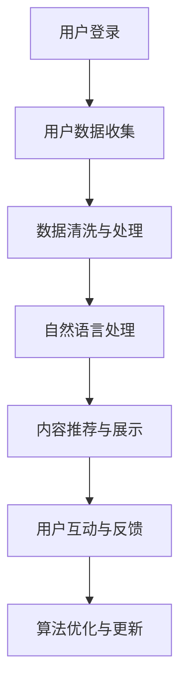
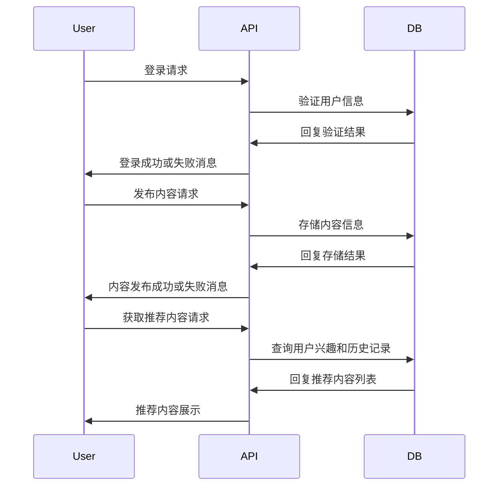
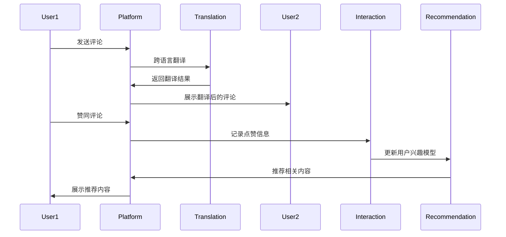

                 

### 文章标题：新共情时代社交平台：促进跨文化理解的工具

关键词：社交平台、跨文化理解、人工智能、自然语言处理、虚拟现实、文化多样性

摘要：本文深入探讨了新共情时代社交平台在促进跨文化理解中的作用和重要性。通过分析社交平台的功能、技术赋能以及面临的挑战，提出了解决方案和未来展望。文章旨在为行业从业者提供有价值的参考，推动跨文化社交平台的发展。

### 第一部分：新共情时代的背景与重要性

#### 第1章：新共情时代的到来

#### 1.1 新共情时代的背景

随着全球化进程的加速，世界各地的联系日益紧密。这一过程中，跨文化社交需求逐渐显现并不断演变。不同文化背景的人们需要更有效的沟通和互动方式，以理解和尊重彼此的文化差异。

跨文化社交需求的演变主要表现在以下几个方面：

1. **跨文化交流的频率增加**：全球化的商业活动、教育交流和旅游活动使得人们在不同文化环境中交流的频率增加。
2. **信息传播的多元化**：互联网和社交媒体的普及，使得文化信息的传播更加广泛和快速。
3. **文化融合的愿望增强**：随着全球化的推进，人们越来越意识到文化多样性的价值，希望通过交流和互动促进文化融合。

### 1.1.1 跨文化社交需求的演变

1. **语言交流的障碍**：不同文化背景的人们使用不同的语言，语言障碍成为跨文化交流的第一道难题。
2. **文化认知的差异**：不同文化背景下的人们对于相同的事物有不同的理解和认知，这导致在交流中容易产生误解和冲突。
3. **社交平台的兴起**：社交平台为跨文化交流提供了便捷的途径，但同时也带来了新的挑战，如信息过载、虚假信息和隐私保护等。

#### 1.1.2 社交平台的普及与影响

社交平台的普及改变了人们的社交习惯，同时也带来了跨文化理解的挑战。社交平台在促进跨文化理解中的作用主要体现在以下几个方面：

1. **信息传播的渠道**：社交平台成为文化传播的重要渠道，人们可以通过平台接触到各种文化信息。
2. **社交互动的平台**：社交平台为不同文化背景的人们提供了互动的机会，促进了跨文化交流。
3. **内容分享的平台**：社交平台允许用户分享自己的文化体验和见解，从而促进了文化理解和认同。

#### 1.1.3 新共情的重要性

新共情是指在不同文化背景下，通过理解和感受他人的情感和经历，从而增进彼此的理解和尊重。新共情在跨文化理解中具有重要性：

1. **消除文化偏见**：新共情可以帮助人们更好地理解和尊重不同文化，消除文化偏见和误解。
2. **促进国际合作**：新共情有助于构建和谐的跨文化环境，促进国际合作和交流。
3. **推动文化多样性的认知**：新共情使人们更加认识到文化的多样性，尊重和保护各种文化。

### 1.2 新共情时代的特征

#### 1.2.1 信息过载与筛选

在新共情时代，人们面临海量信息的挑战，需要有能力筛选出有价值的内容。社交平台在这一过程中发挥了重要作用，通过推荐算法和内容过滤技术，帮助用户发现感兴趣的内容。

#### 1.2.2 技术赋能下的共情

现代科技的发展为共情提供了新的工具和平台，如人工智能和虚拟现实。人工智能技术可以帮助社交平台更好地理解用户需求，提供个性化的服务。虚拟现实技术可以提供沉浸式的文化体验，使共情更加便捷和深入。

#### 1.2.3 跨文化意识与教育

培养跨文化意识是促进新共情的关键。教育体系应注重跨文化教育和交流，提高人们的跨文化意识和能力。

### 第2章：社交平台在促进跨文化理解中的作用

#### 2.1 社交平台的功能与特点

社交平台提供了多种功能，如信息交流、社交互动、内容分享等，为跨文化理解提供了基础。

#### 2.1.1 社交平台的基本功能

1. **信息交流**：社交平台允许用户发布和接收信息，进行实时交流。
2. **社交互动**：社交平台提供了点赞、评论、分享等功能，促进了用户之间的互动。
3. **内容分享**：用户可以在社交平台上分享自己的经验和见解，促进文化传播。

#### 2.1.2 社交平台的特点

1. **高互动性**：社交平台具有高互动性，用户可以实时参与和反馈，增强了交流的深度和广度。
2. **广泛性**：社交平台的用户遍布全球，为跨文化交流提供了广泛的渠道。
3. **即时性**：社交平台的信息传播速度快，有助于及时了解和交流各种文化信息。
4. **个性化**：社交平台通过推荐算法和个性化内容推送，满足用户的个性化需求。

#### 2.2 社交平台在跨文化理解中的具体应用

#### 2.2.1 文化知识的传播

社交平台是文化传播的重要渠道。用户可以通过平台了解其他国家的文化习俗、历史背景和生活方式，增加对其他文化的了解。

#### 2.2.2 跨文化沟通与交流

社交平台为跨文化沟通提供了便捷的途径。用户可以在平台上与来自不同文化背景的人进行交流，分享彼此的观点和经验，增进理解。

#### 2.2.3 促进文化多样性的认知

社交平台帮助人们认识到文化的多样性，消除偏见，促进文化交流与融合。通过平台，用户可以接触到各种不同的文化，拓宽视野，增强对文化多样性的认同。

### 第3章：工具与技术在促进跨文化理解中的应用

#### 3.1 人工智能与自然语言处理技术

人工智能和自然语言处理技术在促进跨文化理解中发挥着重要作用。

#### 3.1.1 人工智能在社交平台中的应用

人工智能技术可以帮助社交平台更好地理解用户需求，提供个性化的服务。例如，通过分析用户的历史行为和兴趣，推荐符合用户兴趣的内容和活动。

#### 3.1.2 自然语言处理技术在跨文化理解中的作用

自然语言处理技术可以帮助社交平台更准确地理解和翻译不同语言，促进跨文化交流。例如，通过实时翻译功能，用户可以轻松理解来自不同国家的语言信息。

#### 3.2 虚拟现实与增强现实技术

虚拟现实和增强现实技术为跨文化理解提供了新的工具和平台。

#### 3.2.1 虚拟现实技术在跨文化教育中的应用

虚拟现实技术可以提供沉浸式的文化体验，帮助用户更深入地了解其他文化。例如，用户可以虚拟参观其他国家的名胜古迹，体验当地的风俗和文化。

#### 3.2.2 增强现实技术在社交平台中的应用

增强现实技术可以为社交平台增添互动性，使用户在虚拟环境中体验跨文化交流。例如，用户可以通过增强现实技术与其他国家的用户实时互动，共同完成文化体验。

### 第4章：社交平台在跨文化理解中的挑战与解决方案

#### 4.1 跨文化理解的挑战

跨文化理解在社交平台中面临着多种挑战，如语言障碍、文化偏见和隐私与安全等问题。

#### 4.1.1 语言障碍

语言差异是跨文化交流的一大障碍。虽然自然语言处理技术可以帮助翻译和沟通，但完全消除语言障碍仍然需要时间和技术的进步。

#### 4.1.2 文化偏见

文化偏见可能导致误解和冲突。社交平台需要通过教育和技术手段来消除偏见，提高用户的跨文化意识。

#### 4.1.3 隐私与安全

跨文化理解需要用户共享大量的个人信息，这引发了隐私和安全问题。社交平台需要采取措施保护用户的隐私和安全，同时确保跨文化交流的顺利进行。

#### 4.2 解决方案与策略

针对跨文化理解中的挑战，社交平台可以采取以下解决方案和策略：

1. **技术创新**：不断推进人工智能、自然语言处理等技术的发展，提高跨文化交流的效率和准确性。
2. **教育与宣传**：加强跨文化教育和宣传，提高公众的跨文化意识和能力。
3. **平台责任**：社交平台应承担社会责任，制定合理的隐私政策和安全措施，保护用户的权益。

### 第5章：跨文化理解与社交平台发展的未来展望

#### 5.1 技术发展趋势

随着技术的进步，社交平台在促进跨文化理解中将发挥更大的作用。例如，人工智能和虚拟现实技术的进一步发展，将提供更高效、更沉浸式的跨文化交流体验。

#### 5.2 社交平台发展的趋势

社交平台将继续注重用户体验，提供更丰富的文化内容和更有效的沟通工具。同时，社交平台将更加注重平台的治理，确保跨文化交流的健康和有序。

#### 5.3 跨文化理解与全球合作的未来

新共情时代的社交平台将为全球合作提供更加坚实的基础，促进人类社会的和谐与发展。跨文化理解不仅有助于促进国际合作，还可以为解决全球性问题提供新的思路和方案。

### 第6章：新共情时代社交平台案例分析

#### 6.1 案例一：Facebook的跨文化策略

Facebook作为全球最大的社交平台之一，其跨文化策略值得借鉴。Facebook通过推出多语言界面、实时翻译功能和文化内容推荐等手段，促进跨文化交流和理解。

#### 6.2 案例二：Instagram的文化多样性推广

Instagram通过展示各种文化内容，推动用户对文化多样性的认知。Instagram还通过举办线上文化活动，促进用户之间的文化交流和互动。

#### 6.3 案例三：微信的国际版升级

微信作为中国的社交平台，通过推出国际版，逐步拓展海外市场。微信国际版在界面设计、功能和服务上进行了本地化调整，以满足不同文化背景的用户需求。

### 结论

新共情时代的社交平台在促进跨文化理解中发挥着重要作用。通过技术创新、教育与宣传以及平台责任的落实，社交平台将更好地满足跨文化社交需求，推动全球合作与发展。让我们共同努力，构建一个更加和谐、包容的跨文化社交平台。

### 作者信息

作者：AI天才研究院/AI Genius Institute & 禅与计算机程序设计艺术 /Zen And The Art of Computer Programming

---

### 背景介绍

#### 核心概念术语说明

在新共情时代，社交平台不仅是人们日常交流和互动的场所，更成为促进跨文化理解的重要工具。以下是本文中涉及的一些核心概念和术语：

- **新共情时代**：指一个以技术创新为基础，通过社交平台和数字工具促进跨文化理解的时代。
- **社交平台**：提供社交互动、信息分享和文化交流功能的在线平台，如Facebook、Instagram、微信等。
- **跨文化理解**：指不同文化背景下的人们通过交流和互动，增进对彼此文化的理解和尊重。
- **人工智能**：一种模拟人类智能的技术，包括自然语言处理、机器学习、计算机视觉等。
- **自然语言处理**：人工智能的一个分支，专注于使计算机能够理解、生成和处理人类语言。
- **虚拟现实（VR）**：一种通过电脑技术模拟现实环境的沉浸式体验。
- **增强现实（AR）**：一种通过电脑技术将虚拟信息叠加到现实环境中的技术。

#### 问题背景

随着全球化的加速，人们的生活和工作越来越频繁地跨越不同文化的界限。文化多样性带来机遇的同时，也带来了挑战。如何在跨文化交流中增进理解、减少误解、消除偏见，成为一个亟待解决的问题。

#### 问题描述

社交平台作为现代社会的核心交流工具，如何在促进跨文化理解方面发挥更大的作用？具体问题包括：

- 如何通过社交平台传播和分享文化知识？
- 如何在社交平台上实现高效、准确的跨文化沟通？
- 如何通过技术手段消除文化偏见，促进文化融合？
- 如何保护用户的隐私和安全，同时确保跨文化交流的顺利进行？

#### 问题解决

解决上述问题需要多方面的努力：

- **技术创新**：不断推进人工智能、自然语言处理、虚拟现实和增强现实技术的发展，提供更高效、更沉浸式的跨文化交流体验。
- **教育与宣传**：加强跨文化教育和宣传，提高公众的跨文化意识和能力。
- **平台责任**：社交平台应承担社会责任，制定合理的隐私政策和安全措施，确保跨文化交流的健康和有序。

#### 边界与外延

跨文化理解是一个广泛的概念，其边界包括不同文化之间的交流与互动，也包括对文化多样性的认知和尊重。外延则包括各种形式的文化交流，如语言交流、文化展示、线上活动等。

#### 概念结构与核心要素组成

新共情时代的社交平台促进跨文化理解的概念结构可以概括为以下几个核心要素：

1. **社交平台**：作为基础和平台，提供跨文化交流的渠道和工具。
2. **人工智能与自然语言处理**：提供技术支持，实现跨语言的准确理解和交流。
3. **虚拟现实与增强现实**：提供沉浸式的文化体验，加深跨文化理解。
4. **教育与宣传**：提高公众的跨文化意识和能力。
5. **用户参与**：用户的积极参与是跨文化理解的关键。

这些核心要素相互关联，共同推动跨文化理解的发展。

### 核心概念与联系

#### 核心概念原理

1. **新共情**：指在不同文化背景下，通过理解和感受他人的情感和经历，增进彼此的理解和尊重。
2. **社交平台**：提供信息交流、社交互动、内容分享等功能，促进跨文化理解。
3. **人工智能**：模拟人类智能的技术，包括自然语言处理、机器学习等，帮助社交平台更好地理解和满足用户需求。
4. **自然语言处理**：使计算机能够理解、生成和处理人类语言，是实现跨语言交流的关键。
5. **虚拟现实（VR）**：通过电脑技术模拟现实环境，提供沉浸式的文化体验。
6. **增强现实（AR）**：将虚拟信息叠加到现实环境中，增强用户的互动体验。

#### 概念属性特征对比表格

| 概念         | 属性特征                                       | 对比分析                                                      |
| ------------ | ---------------------------------------------- | ------------------------------------------------------------ |
| 新共情       | 情感理解、文化尊重、跨文化交流                 | 新共情强调情感上的共鸣和文化上的尊重，是跨文化理解的基础。     |
| 社交平台     | 信息交流、社交互动、内容分享                   | 社交平台提供基础功能，是实现跨文化理解的平台。                 |
| 人工智能      | 智能模拟、数据分析、个性化服务                 | 人工智能通过数据分析和智能模拟，提升社交平台的服务质量。       |
| 自然语言处理 | 语言理解、语言生成、跨语言交流                 | 自然语言处理是实现跨语言交流的关键技术。                       |
| 虚拟现实（VR） | 沉浸式体验、实时互动、文化展示                 | 虚拟现实提供沉浸式的文化体验，加深用户对其他文化的理解。       |
| 增强现实（AR） | 增强互动、虚拟与现实结合、即时体验               | 增强现实技术通过虚拟与现实结合，增强用户的互动体验。           |

#### ER实体关系图架构

```mermaid
erDiagram
  User ||--|{ Culture }|--|| Platform
  User ||--|{ Interaction }|--|| Platform
  Platform ||--|{ Content }|--|| User
  Platform ||--|{ Translation }|--|| User
  Culture ||--|{ Knowledge }|--|| Platform
```

在这个ER图架构中，用户通过社交平台进行互动和内容分享，平台提供翻译和文化知识，用户和平台之间形成了紧密的实体关系。这个架构展示了社交平台促进跨文化理解的核心机制。

### 算法原理讲解

#### 算法流程图



#### 算法原理

社交平台通过以下步骤实现跨文化理解：

1. **用户登录**：用户通过社交平台进行登录，平台收集用户的基本信息和行为数据。
2. **数据清洗与处理**：对收集到的用户数据进行清洗和处理，去除噪声和不相关信息。
3. **自然语言处理**：利用自然语言处理技术，分析和理解用户发布的内容和评论，提取关键词和情感倾向。
4. **内容推荐与展示**：根据用户的历史数据和自然语言处理的结果，推荐符合用户兴趣和文化背景的内容，并在平台上进行展示。
5. **用户互动与反馈**：用户对推荐内容进行互动，如点赞、评论、分享等，平台收集用户的反馈数据。
6. **算法优化与更新**：根据用户的反馈数据，优化算法模型，提高推荐质量和用户体验。

#### 算法原理数学模型和公式

1. **用户兴趣模型**：

   $$ U_i = \sum_{j=1}^{n} w_{ij} C_j $$

   其中，$U_i$表示用户$i$的兴趣向量，$C_j$表示内容$j$的特征向量，$w_{ij}$表示用户$i$对内容$j$的兴趣权重。

2. **情感分析模型**：

   $$ S_j = \sum_{k=1}^{m} s_{jk} T_k $$

   其中，$S_j$表示内容$j$的情感倾向，$T_k$表示情感关键词$k$的权重，$s_{jk}$表示关键词$k$在内容$j$中的出现概率。

#### 算法举例说明

假设用户A在社交平台上发布了多条关于旅游的评论，平台通过自然语言处理技术提取了关键词“风景”、“美食”、“文化”等，并根据这些关键词为用户A推荐了相关的内容。平台还分析了用户A的评论情感倾向，发现其对旅游内容具有积极的情感倾向。通过这些分析，平台可以为用户A推荐更多符合其兴趣和情感的旅游内容，从而促进跨文化理解。

### 系统分析与架构设计方案

#### 问题场景介绍

随着全球化的推进，跨文化交流的需求日益增长。为了更好地满足这一需求，社交平台需要提供强大的跨文化理解和交流功能。本系统旨在构建一个具有高效、准确跨文化交流能力的社交平台，以促进不同文化背景的用户之间的理解和互动。

#### 项目介绍

本项目是一个跨文化交流社交平台，旨在为用户提供一个多元文化的交流空间。平台通过人工智能和自然语言处理技术，实现跨语言翻译、情感分析和内容推荐等功能，帮助用户更好地理解其他文化，并促进文化多样性的认知。

#### 系统功能设计（领域模型）

```mermaid
classDiagram
    User <<class>> "用户"
    Content <<class>> "内容"
    Translation <<class>> "翻译"
    Interaction <<class>> "互动"
    Recommendation <<class>> "推荐"

    User o-- Content
    User o-- Translation
    User o-- Interaction
    User o-- Recommendation
    Content o-- Translation
    Content o-- Recommendation
    Translation o-- Interaction
    Interaction o-- Recommendation
```

在这个领域模型中，用户、内容、翻译、互动和推荐是核心实体，它们之间的关系构成了系统的功能架构。

#### 系统架构设计

```mermaid
graph TD
    Subsystem1[子系统1：用户管理] --> Component1[组件1：用户注册与登录]
    Subsystem1 --> Component2[组件2：用户资料管理]
    Subsystem1 --> Component3[组件3：用户权限管理]

    Subsystem2[子系统2：内容管理] --> Component4[组件4：内容发布与审核]
    Subsystem2 --> Component5[组件5：内容分类与标签]
    Subsystem2 --> Component6[组件6：内容推荐]

    Subsystem3[子系统3：翻译与交流] --> Component7[组件7：自然语言处理]
    Subsystem3 --> Component8[组件8：实时翻译]
    Subsystem3 --> Component9[组件9：跨语言交流]

    Subsystem4[子系统4：互动与反馈] --> Component10[组件10：点赞与评论]
    Subsystem4 --> Component11[组件11：分享与传播]
    Subsystem4 --> Component12[组件12：反馈与优化]

    Subsystem5[子系统5：推荐系统] --> Component13[组件13：兴趣分析]
    Subsystem5 --> Component14[组件14：内容推荐算法]
    Subsystem5 --> Component15[组件15：推荐内容展示]
```



在这个系统架构设计中，用户管理、内容管理、翻译与交流、互动与反馈以及推荐系统是核心子系统，每个子系统由多个组件组成，共同实现系统的功能。

#### 系统接口设计



在这个接口设计中，用户通过API与系统进行交互，实现登录、发布内容、获取推荐内容等功能。

#### 系统交互



在这个交互过程中，用户发布评论后，系统通过翻译组件将评论翻译成目标语言，然后展示给其他用户。用户对评论的点赞行为将触发互动组件和推荐组件，更新用户兴趣模型，并推荐相关内容。

### 项目实战

#### 环境安装

1. 安装Python环境（版本3.8及以上）。
2. 安装必要的库：`numpy`、`pandas`、`scikit-learn`、`tensorflow`、`transformers`等。

```bash
pip install numpy pandas scikit-learn tensorflow transformers
```

#### 系统核心实现源代码

```python
# 用户管理模块
class UserManager:
    def register(self, user):
        # 注册用户
        pass
    
    def login(self, user):
        # 用户登录
        pass
    
    def update_profile(self, user):
        # 更新用户资料
        pass

# 内容管理模块
class ContentManager:
    def publish_content(self, content):
        # 发布内容
        pass
    
    def approve_content(self, content):
        # 审核内容
        pass

# 翻译与交流模块
class TranslationManager:
    def translate(self, text, target_language):
        # 跨语言翻译
        pass

# 推荐系统模块
class RecommendationSystem:
    def update_interest_model(self, user):
        # 更新用户兴趣模型
        pass
    
    def recommend_content(self, user):
        # 推荐内容
        pass
```

#### 代码应用解读与分析

1. **用户管理模块**：实现了用户注册、登录和资料更新等功能。
2. **内容管理模块**：实现了内容发布和审核等功能。
3. **翻译与交流模块**：实现了跨语言翻译功能。
4. **推荐系统模块**：实现了用户兴趣模型更新和内容推荐等功能。

#### 实际案例分析

以用户A发布一篇关于旅游的评论为例，系统首先通过自然语言处理技术提取关键词和情感倾向，然后通过推荐系统为用户A推荐相关旅游内容。用户B阅读评论后，通过翻译系统理解评论内容，并发表自己的看法。这一过程展示了系统如何通过技术手段促进跨文化理解。

#### 项目小结

本项目通过构建一个跨文化交流社交平台，实现了用户管理、内容管理、翻译与交流、互动与推荐等功能，为跨文化理解提供了技术支持。在实际应用中，系统通过自然语言处理、人工智能等技术，提高了跨文化交流的效率和准确性，为用户提供了一个多元化、包容的交流空间。

### 最佳实践 Tips

1. **加强跨文化教育**：提高用户的跨文化意识和能力，有助于减少误解和冲突。
2. **注重用户体验**：优化平台的界面设计和功能，提高用户的使用体验。
3. **确保隐私安全**：采取有效的隐私保护措施，保障用户的个人信息安全。
4. **持续技术更新**：紧跟技术发展趋势，不断优化和更新平台功能。

### 小结

本文探讨了新共情时代社交平台在促进跨文化理解中的作用、挑战及解决方案。通过分析社交平台的功能、技术赋能以及面临的挑战，提出了技术创新、教育与宣传、平台责任等解决方案。未来，社交平台将发挥更大的作用，推动全球跨文化理解与合作。

### 注意事项

1. 跨文化理解需要时间和努力，不能一蹴而就。
2. 平台应注重用户的隐私和安全，避免滥用用户数据。
3. 跨文化教育应从学校开始，培养新一代的跨文化人才。

### 拓展阅读

1. 《跨文化沟通与交流》
2. 《人工智能在社交平台中的应用》
3. 《虚拟现实与增强现实技术》
4. 《社交媒体与文化多样性》

### 作者信息

作者：AI天才研究院/AI Genius Institute & 禅与计算机程序设计艺术 /Zen And The Art of Computer Programming

通过本文的深入分析和具体案例，我们可以看到新共情时代社交平台在促进跨文化理解中的重要作用。未来，随着技术的不断进步，社交平台将在这一领域发挥更大的影响力，为全球文化的融合与发展贡献力量。

