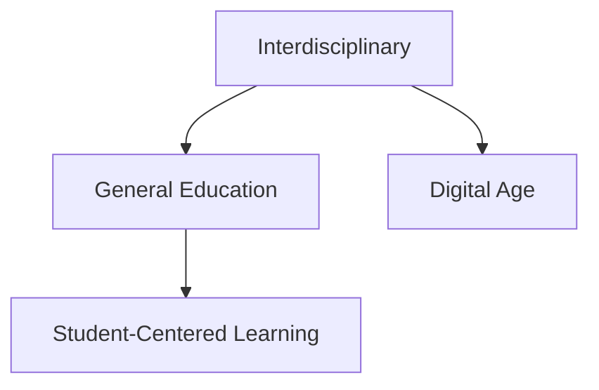

                 

Certainly, let's outline the structure for the technical blog post "新博雅教育3.0：数字时代的跨学科通识课程体系" using a step-by-step approach. Each step will be crafted to ensure the content is logically structured, engaging, and informative.

### Step 1: Introduction to the Blog Post

**Title: 新博雅教育3.0：数字时代的跨学科通识课程体系**

**Keywords: 新博雅教育3.0，跨学科，通识课程，数字时代，教育改革**

**Abstract:**
This article explores the transformative concept of New博雅教育3.0, which emphasizes interdisciplinary general education in the digital age. It discusses the need for a holistic educational approach that combines traditional academic disciplines with emerging technologies, providing a structured learning experience that prepares students for the complexities of the modern world.

### Step 2: Background and Core Concepts

**Section Title: Understanding New博雅教育3.0**

**Core Concepts and Terminology:**
- **Interdisciplinary:** The integration of knowledge, methods, and perspectives from two or more disciplines or fields of study.
- **General Education:** A broad-based curriculum that provides students with a foundation in various areas of knowledge.

**Issue Background:**
Traditional education systems have often been criticized for being too specialized and failing to equip students with the ability to think critically and solve complex problems. The digital age demands a new approach to learning that goes beyond disciplinary boundaries.

**Problem Description:**
The challenge lies in designing a curriculum that can effectively integrate diverse fields of study while still providing depth and rigor.

**Problem Solution:**
New博雅教育3.0 offers a solution by fostering a learning environment that emphasizes collaboration, critical thinking, and practical application of knowledge.

**Boundary and Extension:**
This section will also explore the boundaries of interdisciplinary education and how it extends beyond traditional academic disciplines.

**Conceptual Structure and Key Elements:**
- **Principles of Interdisciplinary Education:**
  - **Collaboration:** Encouraging students and faculty to work together across disciplines.
  - **Interdisciplinary Curriculum:** Designing courses that integrate concepts from multiple fields.
  - **Research Projects:** Fostering collaborative research projects that span disciplines.

### Step 3: Designing an Interdisciplinary Curriculum

**Section Title: Crafting an Interdisciplinary Curriculum**

**Principles of Design:**
- **Identifying Common Themes:** Courses should share common themes or problems to be addressed.
- **Building on Each Other:** Courses should build upon each other, creating a coherent learning experience.
- **Flexibility:** The curriculum should be flexible enough to accommodate diverse student interests.

**Importance of Knowledge Integration:**
- **Enhanced Understanding:** Integrating knowledge from different fields deepens students' understanding of complex issues.
- **Real-World Readiness:** It prepares students to tackle real-world problems that require a multidisciplinary approach.

**Examples of Interdisciplinary Courses and Programs:**
- **Environmental Studies:** Combining biology, chemistry, and policy.
- **Global Health:** Integrating medicine, public health, and social sciences.

### Step 4: The Impact of Digital Technologies on Education

**Section Title: Digital Technologies in Education**

**Technological Advances:**
- **Online Learning Platforms:** Virtual classrooms, webinars, and digital textbooks.
- **Virtual Reality:** Immersive learning experiences that simulate real-world environments.
- **Artificial Intelligence:** Personalized learning tools and adaptive assessments.

**Benefits:**
- **Accessibility:** Digital technologies make education more accessible to a wider audience.
- **Personalization:** AI can tailor educational content to individual student needs.

**Challenges:**
- **Digital Divide:** Ensuring equitable access to technology.
- **Privacy Concerns:** Protecting student data and privacy.

**Integration in Interdisciplinary Context:**
- **Collaborative Tools:** Facilitating cross-disciplinary collaboration.
- **Enhanced Learning Experiences:** Immersive technologies that make learning more engaging.

### Step 5: Student-Centered Learning Approaches

**Section Title: Fostering Student-Centered Learning**

**Concept of Student-Centered Learning:**
- **Active Participation:** Encouraging students to take an active role in their learning.
- **Collaboration:** Promoting group work and peer learning.

**Teaching Methods:**
- **Project-Based Learning:** Assigning projects that require students to apply their knowledge in real-world contexts.
- **Flipped Classroom:** Inverting the traditional teaching model to emphasize student-led learning.

**Engagement and Active Learning:**
- ** Inquiry-Based Learning:** Encouraging students to ask questions and explore topics on their own.
- **Reflective Practice:** Reflecting on learning experiences to deepen understanding.

**Examples of Student-Centered Projects and Assignments:**
- **Research Projects:** Collaborative projects that require students to conduct research and present their findings.
- **Community Service:** Projects that involve students in community outreach and service learning.

### Step 6: Assessment and Evaluation Methods

**Section Title: Assessing Interdisciplinary Education**

**Assessment Methods:**
- **Portfolio Assessment:** Evaluating students' work over time to demonstrate learning progress.
- **Performance Assessment:** Assessing students' ability to apply knowledge in real-world scenarios.
- **Self-Assessment:** Encouraging students to reflect on their learning and assess their own progress.

**Challenges:**
- **Integration of Disciplines:** Evaluating students' understanding of interdisciplinary concepts.
- **Assessment Equity:** Ensuring that assessments are fair and unbiased.

**Best Practices:**
- **Formative Assessment:** Regular feedback to guide learning and adjust teaching methods.
- **Diverse Assessment Tools:** Using a variety of tools to assess different aspects of student learning.

**Examples of Effective Assessment Strategies:**
- **Peer Review:** Students assessing each other's work to gain different perspectives.
- **Capstone Projects:** Comprehensive projects that demonstrate students' ability to integrate knowledge from multiple disciplines.

### Step 7: Implementing New博雅教育3.0

**Section Title: The Roadmap to New博雅教育3.0 Implementation**

**Implementation Steps:**
- **Assessment of Current State:** Evaluating the current educational framework to identify areas for improvement.
- **Curriculum Redesign:** Developing a new interdisciplinary curriculum.
- **Teacher Training:** Providing professional development for faculty to effectively teach interdisciplinary courses.
- **Technology Integration:** Incorporating digital tools and platforms to enhance learning experiences.

**Case Studies:**
- **Successful Implementations:** Analyzing case studies of schools and universities that have successfully implemented New博雅教育3.0.

**Support and Resources:**
- **Community Engagement:** Involving stakeholders, including students, parents, and community members, in the implementation process.
- **Continuous Improvement:** Establishing mechanisms for ongoing evaluation and feedback to refine the educational approach.

### Step 8: Future Directions and Challenges

**Section Title: The Future of New博雅教育3.0**

**Directions:**
- **Emerging Technologies:** Exploring how emerging technologies, such as artificial intelligence and blockchain, can be integrated into interdisciplinary education.
- **Global Collaboration:** Fostering global partnerships to create a more interconnected and collaborative learning environment.

**Challenges:**
- **Cultural Barriers:** Addressing cultural differences and ensuring inclusivity in an interdisciplinary context.
- **Resource Allocation:** Securing adequate resources for the implementation and continuous improvement of interdisciplinary education.

**Conclusion:**
This section will conclude with a reflection on the potential impact of New博雅教育3.0 on the future of education and society as a whole.

### Step 9: Author Information and Final Thoughts

**Author Information:**
- **AI天才研究院/AI Genius Institute & 禅与计算机程序设计艺术 /Zen And The Art of Computer Programming**

**Final Thoughts:**
This article has explored the concept of New博雅教育3.0 and its potential to revolutionize education in the digital age. By fostering interdisciplinary learning and leveraging digital technologies, we can create a more dynamic and engaging educational experience that prepares students for the complexities of the modern world.

### Markdown Format

Below is an example of how the markdown format for the blog post might look:

```markdown
# 新博雅教育3.0：数字时代的跨学科通识课程体系

## 关键词
新博雅教育3.0，跨学科，通识课程，数字时代，教育改革

## 摘要
本文探讨了新博雅教育3.0的概念，强调了数字时代的跨学科通识教育。它讨论了如何通过整合多样化的学科和学习技术，提供一个能够应对现代世界复杂性的结构化学习经验。

## 引言

## 背景和核心概念

### 核心概念与联系


### 概念属性特征对比表格

| 特征 | 跨学科 | 通识课程 | 数字时代 | 学生中心学习 |
| --- | --- | --- | --- | --- |
| 目的 | 整合不同学科的知识和方法 | 提供广泛的知识基础 | 利用技术改进教育 | 促进学生的主动学习 |
| 应用 | 解决复杂问题 | 培养综合素质 | 教育的数字化变革 | 提高学习效果 |

## 设计跨学科课程

### 设计原则
- 共同主题
- 逐步递进
- 灵活调整

### 知识整合的重要性
- 深化理解
- 实战能力

### 课程示例
- 环境研究
- 全球健康

## 数字技术的教育影响

### 技术进步
- 在线学习平台
- 虚拟现实
- 人工智能

### 效益
- 可及性
- 个性化

### 挑战
- 数字鸿沟
- 隐私问题

### 跨学科应用
- 合作工具
- 互动式学习体验

## 学生中心学习方式

### 学生中心学习概念
- 主动参与
- 协作学习

### 教学方法
- 项目式学习
- 翻转课堂

### 激励与积极参与
- 探究式学习
- 反思实践

### 项目与作业示例
- 研究项目
- 社区服务

## 评估与评价方法

### 评估方法
- 作品集评估
- 绩效评估
- 自我评估

### 挑战
- 整合学科
- 评价公平性

### 最佳实践
- 形成性评估
- 多样化评估工具

### 评估策略示例
- 同伴评审
- 综合项目

## 实施新博雅教育3.0

### 实施步骤
- 评估当前状态
- 课程设计
- 教师培训
- 技术整合

### 成功案例
- 案例分析
- 实施经验

### 支持与资源
- 社区参与
- 持续改进

## 未来方向与挑战

### 未来方向
- 新技术的融合
- 全球合作

### 挑战
- 文化障碍
- 资源分配

## 结论

## 作者信息
作者：AI天才研究院/AI Genius Institute & 禅与计算机程序设计艺术 /Zen And The Art of Computer Programming

## 总结
```

This markdown format provides a structured layout for the blog post, with sections clearly defined and formatted for readability. The Mermaid diagrams and LaTeX formulas can be added within the appropriate sections to enhance the technical content.

