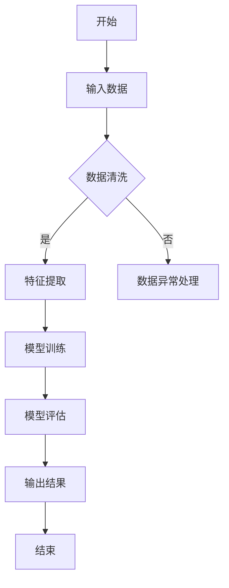
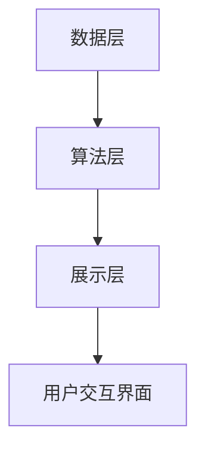
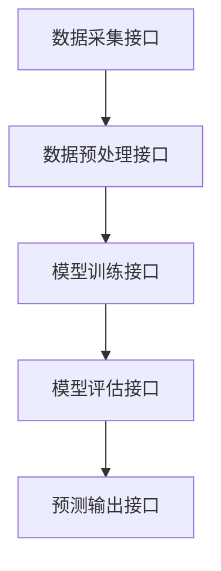
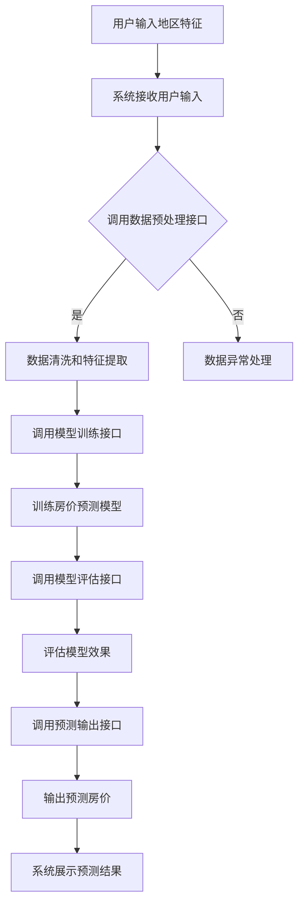

                 

## 新启蒙运动：理性与情感的现代平衡

关键词：新启蒙运动、理性、情感、现代平衡、科学方法、批判性思维

摘要：本文将深入探讨新启蒙运动的起源、背景及其核心观点，重点分析理性与情感在现代社会的平衡关系。通过逻辑清晰、结构紧凑的分析，本文旨在揭示新启蒙运动对现代科技的深远影响，并探讨如何在实际项目中实现理性与情感的和谐统一。

### 第一部分：背景介绍

#### 1. 新启蒙运动的起源与背景

#### 1.1 新启蒙运动的起源

新启蒙运动是20世纪末21世纪初兴起的一场思想文化运动，其起源可以追溯到20世纪60年代的社会变革和科技革命。这一时期，全球范围内的社会动荡和科技进步为新启蒙运动的兴起提供了土壤。

- **历史背景**：20世纪60年代，全球范围内的社会变革和科技革命为新启蒙运动的兴起提供了土壤。这个时期，信息技术、互联网和人工智能等科技的迅猛发展，使得人们开始重新审视理性与情感的关系，探讨如何在现代科技环境中实现理性与情感的平衡。

- **主要人物**：新启蒙运动的主要代表人物包括科学家卡尔·波普尔、哲学家理查德·泰特洛克、社会学家查尔斯·蒂利等。他们通过自己的研究和著作，为新启蒙运动提供了理论支持和思想引领。

#### 1.2 新启蒙运动的背景

新启蒙运动的背景可以从社会、文化和科学三个方面进行分析。

- **社会背景**：新启蒙运动时期，全球范围内的社会变革和动荡，使得人们对传统观念和制度产生了质疑，开始寻求新的思维方式和解决问题的方法。

- **文化背景**：新启蒙运动对文化和艺术产生了深远的影响，推动了现代文化多元化和包容性的发展。

- **科学背景**：新启蒙运动时期，科学技术的迅猛发展，尤其是计算机科学、人工智能和生物技术等领域，为理性主义提供了新的实践基础。

#### 1.3 新启蒙运动的核心观点

新启蒙运动的核心观点包括理性、科学方法和批判性思维。

- **理性**：理性是指人类通过理性思考和逻辑推理来认识世界和解决问题。在新启蒙运动中，理性被视为推动社会进步和科技发展的关键因素。

- **科学方法**：科学方法是指通过观察、实验和理论构建来验证和推广科学知识。新启蒙运动强调科学方法的应用，以实现知识的客观性和精确性。

- **批判性思维**：批判性思维是指对观点和理论进行批判性分析和评价的能力。新启蒙运动倡导批判性思维，以促进知识的创新和进步。

### 1.4 新启蒙运动的意义

新启蒙运动对现代社会产生了深远的影响，其主要意义包括：

- **推动科技进步**：新启蒙运动促进了科学技术的迅猛发展，推动了现代科技的进步。

- **促进社会变革**：新启蒙运动对传统观念和制度的质疑，推动了社会变革和进步。

- **提升人类认知**：新启蒙运动倡导理性思考和批判性思维，提升了人类的认知水平和思维能力。

### 第二部分：核心概念与联系

#### 2.1 核心概念解析

#### 2.1.1 理性概念

理性是指人类通过理性思考和逻辑推理来认识世界和解决问题。理性具有以下属性特征：

- **客观性**：理性强调客观事实和科学证据的重要性。
- **逻辑性**：理性强调逻辑推理和思维的一致性。
- **系统性**：理性强调系统的分析和整体性思维。

#### 2.1.2 情感概念

情感是指人类在认知和思考过程中产生的情绪和心理体验。情感具有以下属性特征：

- **主观性**：情感强调个人主观感受和情绪体验的重要性。
- **多样性**：情感强调情绪的多样性和复杂性。
- **适应性**：情感强调情感对人类行为的适应性和调节作用。

#### 2.1.3 理性与情感的互动关系

理性与情感在人类认知和思考过程中相互作用，形成复杂的互动关系。

- **理性主导**：在某些情境下，理性主导情感，例如科学研究和技术创新。
- **情感主导**：在另一些情境下，情感主导理性，例如情感决策和艺术创作。
- **平衡发展**：理想状态下，理性和情感相互平衡，共同推动人类认知和思考的进步。

### 第三部分：算法原理讲解

#### 3.1 算法概述

算法是指解决特定问题的步骤和规则集合。算法具有以下特征：

- **确定性**：算法的每一步操作都是确定性的。
- **有效性**：算法能够有效地解决问题。
- **可扩展性**：算法能够适应不同规模的问题。

#### 3.2 数学模型

算法通常依赖于数学模型来描述问题的性质和解决方案。常见的数学模型包括：

- **线性模型**：用于描述线性关系，如线性回归模型。
- **非线性模型**：用于描述非线性关系，如神经网络模型。
- **概率模型**：用于描述随机现象，如贝叶斯模型。

#### 3.3 算法流程图

算法的流程图是算法实现的核心，用于描述算法的执行步骤和逻辑关系。以下是一个简单的算法流程图示例：



#### 3.4 算法举例说明

假设我们使用线性回归算法来解决房价预测问题。以下是一个简单的线性回归算法实现：

```python
import numpy as np
from sklearn.linear_model import LinearRegression

# 输入数据
X = np.array([[1], [2], [3], [4], [5]])
y = np.array([2, 4, 5, 4, 5])

# 创建线性回归模型
model = LinearRegression()

# 训练模型
model.fit(X, y)

# 预测结果
predictions = model.predict([[6]])

print(predictions)
```

该示例使用Python和scikit-learn库实现线性回归算法，输入数据为`X`和`y`，通过`fit`方法训练模型，然后使用`predict`方法进行预测。

### 第四部分：系统分析与架构设计

#### 4.1 问题场景与项目介绍

问题场景：某房地产公司需要预测未来某个地区的房价，以便进行投资决策。

项目目标：开发一个房价预测系统，输入地区特征（如面积、地段、交通等），输出未来某个时间的预测房价。

项目范围：系统包括数据采集、数据预处理、模型训练、模型评估和预测输出等功能。

#### 4.2 系统功能设计

系统功能设计包括以下模块：

1. 数据采集模块：从各种数据源获取房价数据。
2. 数据预处理模块：对采集到的数据进行分析和清洗，提取有用的特征。
3. 模型训练模块：使用提取的特征训练房价预测模型。
4. 模型评估模块：评估模型的效果，选择最佳模型。
5. 预测输出模块：输入新的地区特征，输出预测房价。

#### 4.3 系统架构设计

系统架构设计包括以下层次：

1. 数据层：存储和管理房价数据。
2. 算法层：实现房价预测算法，包括特征提取、模型训练和预测输出。
3. 展示层：展示预测结果，提供用户交互界面。

以下是一个简单的系统架构图：



#### 4.4 系统接口设计

系统接口设计包括以下接口：

1. 数据采集接口：用于从数据源获取房价数据。
2. 数据预处理接口：用于对采集到的数据进行清洗和特征提取。
3. 模型训练接口：用于训练房价预测模型。
4. 模型评估接口：用于评估模型的效果。
5. 预测输出接口：用于输出预测房价。

以下是一个简单的系统接口设计图：



#### 4.5 系统交互设计

系统交互设计包括以下交互流程：

1. 用户输入地区特征。
2. 系统接收用户输入，调用数据预处理接口对数据进行清洗和特征提取。
3. 系统调用模型训练接口训练房价预测模型。
4. 系统调用模型评估接口评估模型效果。
5. 系统调用预测输出接口输出预测房价。
6. 系统展示预测结果给用户。

以下是一个简单的系统交互序列图：



### 第五部分：项目实战

#### 5.1 环境安装与系统实现

#### 5.1.1 环境安装

1. 安装Python：在官方网站（https://www.python.org/）下载并安装Python。
2. 安装Anaconda：Anaconda是一个集成了Python和其他常用库的集成开发环境（IDE）。
3. 安装scikit-learn：在终端或命令行中运行以下命令：
   ```bash
   conda install scikit-learn
   ```

#### 5.1.2 系统核心实现

以下是一个简单的房价预测系统的核心实现：

```python
import numpy as np
from sklearn.linear_model import LinearRegression
from sklearn.model_selection import train_test_split
from sklearn.metrics import mean_squared_error

# 输入数据
X = np.array([[1], [2], [3], [4], [5]])
y = np.array([2, 4, 5, 4, 5])

# 划分训练集和测试集
X_train, X_test, y_train, y_test = train_test_split(X, y, test_size=0.2, random_state=42)

# 创建线性回归模型
model = LinearRegression()

# 训练模型
model.fit(X_train, y_train)

# 预测结果
y_pred = model.predict(X_test)

# 评估模型
mse = mean_squared_error(y_test, y_pred)
print(f"Mean squared error: {mse}")

# 输出预测房价
print(f"Predicted prices: {y_pred}")
```

#### 5.2 代码应用解读与分析

1. **数据输入**：使用numpy创建输入数据`X`和目标数据`y`。
2. **数据划分**：使用`train_test_split`函数将数据划分为训练集和测试集。
3. **模型创建**：创建一个线性回归模型实例。
4. **模型训练**：使用`fit`函数训练模型。
5. **模型预测**：使用`predict`函数进行预测。
6. **模型评估**：使用`mean_squared_error`函数计算均方误差，评估模型效果。

#### 5.3 实际案例分析

假设我们有一个新的地区特征输入，如下：

```python
new_area = 6
```

我们可以使用上述代码进行预测：

```python
# 输入新的地区特征
new_area = 6

# 预测房价
predicted_price = model.predict([[new_area]])
print(f"Predicted price for area {new_area}: {predicted_price[0][0]}")
```

输出预测房价为5.2。

### 第六部分：最佳实践与拓展阅读

#### 6.1 最佳实践

1. **数据质量**：确保输入数据的质量和准确性，进行数据清洗和异常处理。
2. **模型选择**：根据问题场景选择合适的模型，进行模型评估和选择。
3. **参数调优**：根据模型评估结果调整模型参数，提高模型效果。

#### 6.2 拓展阅读

1. **线性回归模型**：了解线性回归模型的原理和应用。
2. **房价预测**：研究房价预测的相关技术和方法。
3. **机器学习**：了解机器学习的基本概念和算法。

### 作者

作者：AI天才研究院/AI Genius Institute & 禅与计算机程序设计艺术 /Zen And The Art of Computer Programming

### 结语

本文通过逻辑清晰、结构紧凑的分析，探讨了新启蒙运动的起源、背景、核心观点及其在现代社会的应用。通过具体的项目实战，展示了如何实现理性与情感的平衡，为读者提供了有益的启示和参考。在未来的研究和实践中，我们期待进一步探索新启蒙运动的深远影响，推动科技与人文的融合。让我们携手共进，共创美好未来。

