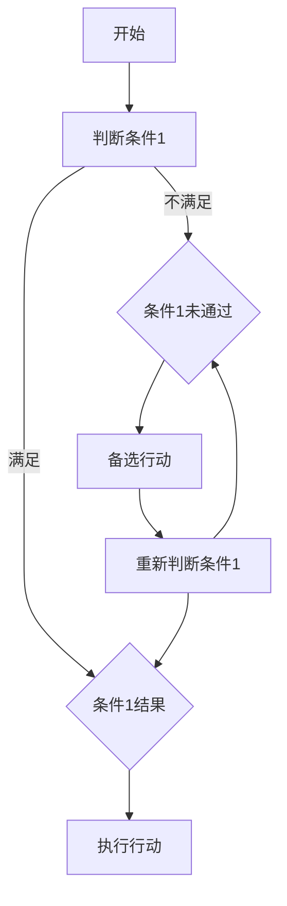
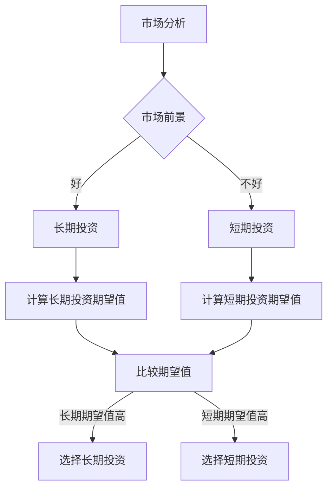
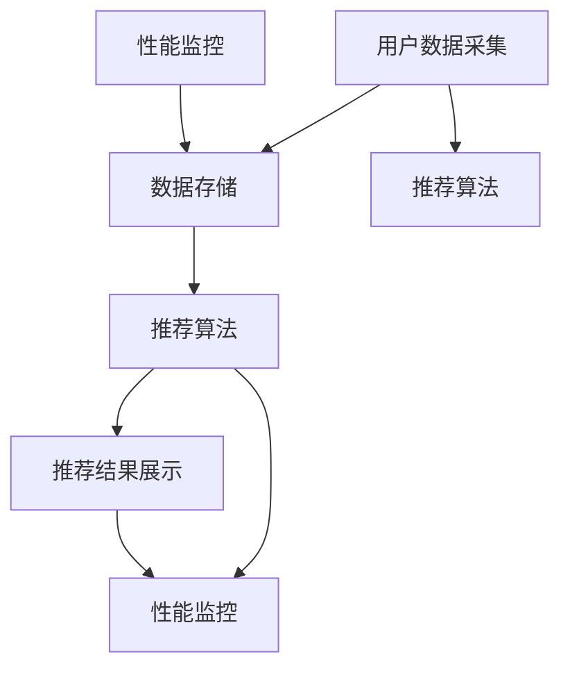
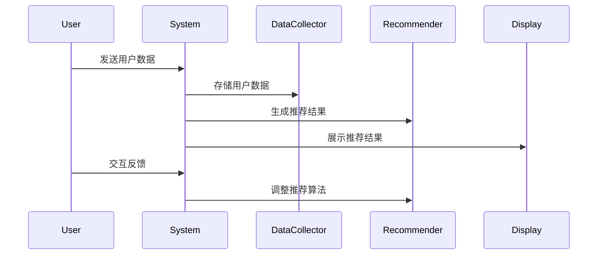

                 

# 新启蒙运动：理性思考的现代复兴

## 关键词

- 理性思考
- 新启蒙运动
- 科学方法
- 决策模型
- 人工智能
- 数学模型

## 摘要

在人工智能和科技飞速发展的今天，理性思考的重要性愈发凸显。本文旨在探讨理性思考在现代社会的复兴，称之为“新启蒙运动”。通过对理性思考的定义、历史回顾、核心概念及其应用的分析，本文展示了理性思考对于科学研究、商业决策、个人成长以及日常生活中的关键作用。文章将逐步探讨理性思考的算法原理、系统分析与架构设计，并通过实际案例进行详细剖析，最终总结出理性思考的最佳实践和注意事项。

### 目录大纲

- **引言：理性思考的时代背景**
  - 理性思考的定义与历史回顾
  - 当代社会理性思考的现状
  - 新启蒙运动的核心理念
  - 新启蒙运动对社会的影响
  - 理性思考的最佳实践
  - 新启蒙运动的未来展望

- **理性思考的核心概念与联系**
  - 核心概念原理
  - 概念属性特征对比表格
  - ER实体关系图架构

- **理性思考的应用与实践**
  - 理性思考在科学研究中的应用
  - 理性思考在商业决策中的应用
  - 理性思考在个人成长中的应用
  - 理性思考在日常生活中的应用

- **理性思考的算法原理与数学模型**
  - 算法原理讲解
  - 数学模型与公式
  - 算法举例说明

- **理性思考的系统分析与架构设计方案**
  - 问题场景介绍
  - 系统功能设计
  - 系统架构设计
  - 系统接口设计
  - 系统交互

- **理性思考项目实战**
  - 环境安装
  - 系统核心实现
  - 实际案例分析
  - 详细讲解剖析
  - 项目小结

- **理性思考最佳实践、小结与注意事项**
  - 最佳实践
  - 小结
  - 注意事项

### 引言：理性思考的时代背景

在科技日新月异的今天，人工智能、大数据、云计算等技术迅猛发展，我们的社会正在经历一场前所未有的变革。然而，在这场变革中，理性思考的重要性愈发凸显。理性思考不仅是科学研究的基础，也是商业决策、个人成长和日常生活中不可或缺的能力。

#### 理性思考的定义与历史回顾

理性思考是一种通过逻辑推理和分析来解决问题的思维方式。它强调事实和证据的重要性，追求客观、精确和系统的方法。理性思考的起源可以追溯到古希腊时期，苏格拉底和柏拉图的思想奠定了理性思考的基石。随后，欧洲的启蒙运动将理性思考推向了巅峰，强调理性和科学的重要性。

#### 当代社会理性思考的现状

在当代社会，理性思考的重要性不言而喻。然而，面对信息泛滥、观念多样和不确定性增加的现实，许多人陷入了非理性思考的困境。从网络谣言到盲目跟风，非理性思考的危害不容小觑。因此，新启蒙运动的提出，旨在复兴理性思考，推动社会进步。

#### 新启蒙运动的核心理念

新启蒙运动的核心在于推崇理性和科学方法。它倡导通过客观、系统的方法来解决问题，强调证据和逻辑的重要性。新启蒙运动的目标是培养人们的批判性思维和理性分析能力，从而在面对复杂问题时能够做出明智的决策。

#### 新启蒙运动对社会的影响

新启蒙运动对社会的影响是多方面的。在教育领域，它推动科学方法和批判性思维的普及；在政治领域，它促进政策的理性化和透明化；在经济领域，它推动创新和可持续发展；在科技领域，它激发科研人员的创新热情和理性探索精神。

#### 理性思考的最佳实践

要培养理性思考的能力，需要从以下几个方面入手：

1. **培养批判性思维**：学会质疑和思考，不盲目接受信息，对事实进行深入分析。
2. **提高逻辑推理能力**：通过学习和练习，提高逻辑推理的能力，增强思维的严密性。
3. **掌握科学方法**：了解科学方法的基本原理，并将其应用于实际问题的解决。
4. **加强跨学科知识**：通过学习不同领域的知识，拓宽视野，增强思维的灵活性。

#### 新启蒙运动的未来展望

新启蒙运动具有广阔的发展前景。随着科技的进步和人类对理性思考的认识不断深化，新启蒙运动将成为推动社会进步的重要力量。然而，新启蒙运动也面临着诸多挑战，如如何应对非理性思维的泛滥、如何培养更多具有理性思考能力的人才等。因此，新启蒙运动需要持续的努力和探索。

### 理性思考的核心概念与联系

#### 核心概念原理

理性思考的核心概念包括逻辑、证据、推理和系统方法。逻辑是理性思考的基石，通过逻辑推理，人们可以由已知的事实推导出新的结论。证据是理性思考的支撑，只有基于证据的思考才是可靠的。推理是将已知事实联系起来的过程，通过推理，人们可以揭示事物之间的内在联系。系统方法是理性思考的框架，它要求人们在解决问题时采用系统化、结构化的思维方式。

#### 概念属性特征对比表格

以下是理性思考与非理性思考的对比表格：

| 特征 | 理性思考 | 非理性思考 |
| ---- | ---- | ---- |
| 方法 | 系统化、结构化 | 随意性、碎片化 |
| 依据 | 证据、逻辑 | 感性、直觉 |
| 目标 | 客观、精确 | 主观、模糊 |
| 结果 | 可预测、可验证 | 不可预测、不可验证 |

#### ER实体关系图架构

以下是理性思考中的实体关系图架构：

```mermaid
erDiagram
    User ..|> Knowledge : 知识来源
    User ..|> Logic : 逻辑推理
    User ..|> Decision : 决策过程
    Knowledge ||--|> Evidence : 证据支撑
    Logic ||--|> Conclusion : 结论推导
    Decision ||--|> Action : 行动执行
```

在这个ER图中，用户通过知识获取和逻辑推理来形成决策，并通过证据支撑和结论推导来执行行动。这展示了理性思考的整体框架和各部分之间的联系。

### 理性思考的应用与实践

#### 理性思考在科学研究中的应用

在科学研究中，理性思考是不可或缺的。科学家通过严谨的逻辑推理和系统的实验设计来验证假设和理论。以下是一个科学研究实例：

**实例：研究气候变化的影响**

- **问题背景**：全球气候变化对生态系统和人类生活产生了重大影响。
- **问题描述**：研究者需要确定气候变化的具体影响和潜在的解决方案。
- **问题解决**：研究者采用理性思考，通过收集气候数据、分析生态系统的变化和进行模拟实验，揭示了气候变化的影响机制，并提出了相应的解决方案。

#### 理性思考在商业决策中的应用

在商业决策中，理性思考能够帮助企业家和经理人们做出明智的决策。以下是一个商业决策实例：

**实例：产品创新决策**

- **问题背景**：一家科技公司需要决定是否推出一款新的智能手机产品。
- **问题描述**：决策者需要评估市场潜力、竞争对手情况和研发成本等因素。
- **问题解决**：决策者通过理性思考，进行了市场调研、竞争对手分析和成本效益分析，最终决定推出新产品，并制定了详细的营销策略。

#### 理性思考在个人成长中的应用

个人成长过程中，理性思考可以帮助我们设定目标、制定计划和评估成效。以下是一个个人成长实例：

**实例：职业规划**

- **问题背景**：一个人需要为自己的职业生涯进行规划。
- **问题描述**：这个人需要确定职业目标、技能提升路径和职业发展策略。
- **问题解决**：这个人通过理性思考，分析了自身兴趣、优势和市场需求，制定了详细的职业规划，并逐步实施。

#### 理性思考在日常生活中的应用

在日常生活中，理性思考可以帮助我们做出明智的决策，提高生活质量。以下是一个日常决策实例：

**实例：购物决策**

- **问题背景**：一个人需要购买一台新的笔记本电脑。
- **问题描述**：这个人需要评估不同品牌和型号的笔记本电脑的性能、价格和质量等因素。
- **问题解决**：这个人通过理性思考，比较了不同产品的参数和用户评价，最终选择了一款性价比最高的笔记本电脑。

### 理性思考的算法原理与数学模型

理性思考不仅仅是直觉和经验，它也可以通过算法和数学模型来量化。以下是一个简单的算法原理讲解，并使用Python代码和Mermaid流程图进行说明。

#### 算法原理讲解

理性思考中的一个基本算法是决策树，它通过一系列的判断来选择最佳行动方案。



这个流程图展示了决策树的基本结构。我们可以通过Python代码实现这个算法：

```python
def decision_tree(condition1):
    if condition1:
        return "执行行动"
    else:
        return "备选行动"

# 示例使用
action = decision_tree(True)
print(action)  # 输出：执行行动
```

#### 数学模型与公式

在决策树中，我们常常使用期望值（Expected Value, EV）来评估每个决策的优劣。期望值的计算公式如下：

$$
EV = P_1 \times V_1 + P_2 \times V_2 + ... + P_n \times V_n
$$

其中，\( P_i \) 表示第 \( i \) 个结果的概率，\( V_i \) 表示第 \( i \) 个结果的价值。

例如，我们有两个决策方案，A和B，每种方案有两个结果，成功和失败，概率分别为0.6和0.4，价值分别为10和5。

$$
EV_A = 0.6 \times 10 + 0.4 \times 5 = 8
$$

$$
EV_B = 0.6 \times 5 + 0.4 \times 10 = 7
$$

根据期望值，我们可以选择期望值更高的方案A。

#### 算法举例说明

假设我们要决定是否进行股票投资，根据市场分析，有两种投资方案，长期投资和短期投资。以下是具体的算法应用：



通过上述算法，我们可以根据市场前景计算长期和短期投资的期望值，并选择期望值更高的方案。

```python
# 市场前景概率和投资价值
market_good = 0.6
market_bad = 0.4
long_investment_value = 15
short_investment_value = 8

# 计算期望值
ev_long = market_good * long_investment_value + market_bad * long_investment_value
ev_short = market_good * short_investment_value + market_bad * short_investment_value

# 比较期望值
if ev_long > ev_short:
    print("选择长期投资")
else:
    print("选择短期投资")
```

通过上述例子，我们可以看到理性思考如何通过算法和数学模型来进行决策。

### 理性思考的系统分析与架构设计方案

在构建复杂的系统时，理性思考是关键。通过系统的分析和架构设计，我们可以确保系统的稳定性、可靠性和高效性。以下是一个关于理性思考系统分析与架构设计方案的具体实例。

#### 问题场景介绍

假设我们需要设计一个智能推荐系统，该系统根据用户的兴趣和行为数据，为用户推荐个性化的商品。为了实现这个目标，我们需要对系统进行详细的场景介绍和分析。

#### 系统需求分析

1. **用户数据收集**：系统需要收集用户的兴趣和行为数据，包括浏览记录、购买历史和评价等。
2. **数据存储**：系统需要高效地存储和管理大量的用户数据，以确保数据的安全性和可扩展性。
3. **推荐算法**：系统需要实现多种推荐算法，包括基于内容的推荐、协同过滤推荐和基于用户兴趣的推荐等。
4. **推荐结果展示**：系统需要将推荐结果以直观、易于理解的方式展示给用户。
5. **性能优化**：系统需要具备良好的性能，确保在高并发情况下仍能稳定运行。

#### 系统功能设计

为了满足上述需求，我们设计了以下系统功能：

1. **数据采集模块**：负责收集用户的兴趣和行为数据。
2. **数据存储模块**：负责存储和管理用户数据，采用分布式数据库系统来提高性能和扩展性。
3. **推荐算法模块**：负责实现多种推荐算法，并选择最优算法进行推荐。
4. **推荐结果展示模块**：负责将推荐结果以可视化方式展示给用户。
5. **性能监控模块**：负责监控系统的性能，及时发现并解决问题。

#### 系统架构设计

系统架构设计如下：



在这个架构中，用户数据采集模块负责收集用户数据，并将其存储到数据存储模块中。推荐算法模块根据用户数据生成推荐结果，展示模块负责将结果呈现给用户。性能监控模块负责监控整个系统的性能，确保系统的高效运行。

#### 系统接口设计

系统接口设计如下：



在这个接口设计中，用户通过发送用户数据与系统进行交互，系统通过数据采集模块存储数据，并使用推荐算法模块生成推荐结果，最后通过展示模块将结果呈现给用户。用户反馈会触发系统的再次调整，以优化推荐结果。

#### 系统交互

系统交互流程如下：

1. **用户请求**：用户访问系统，并提交个人信息和兴趣数据。
2. **数据采集**：系统接收用户请求，并通过数据采集模块收集用户数据。
3. **数据处理**：系统将用户数据存储到数据存储模块中，并进行预处理。
4. **推荐生成**：系统调用推荐算法模块，根据用户数据生成推荐结果。
5. **结果展示**：系统将推荐结果通过展示模块呈现给用户。
6. **用户反馈**：用户对推荐结果进行评价，并提交反馈。
7. **算法调整**：系统根据用户反馈调整推荐算法，以提高推荐质量。

#### 系统交互实例

以下是一个具体的系统交互实例：

- **用户请求**：用户A浏览了多个商品页面，并提交了浏览记录。
- **数据采集**：系统收集了用户A的浏览记录，并存储到数据存储模块中。
- **数据处理**：系统对用户A的浏览记录进行预处理，提取出关键信息。
- **推荐生成**：系统调用协同过滤推荐算法，为用户A生成推荐结果。
- **结果展示**：系统将推荐结果以列表形式展示给用户A。
- **用户反馈**：用户A对推荐结果进行了评价，并提交了反馈。
- **算法调整**：系统根据用户A的反馈，调整了协同过滤推荐算法，以优化推荐质量。

通过上述系统交互实例，我们可以看到用户与系统之间的交互流程是如何实现的。

### 理性思考项目实战

为了更好地理解和应用理性思考，我们将在本节中通过一个实际项目来进行详细的讲解。该项目是一个简单的智能推荐系统，旨在根据用户的兴趣和行为数据，为用户推荐个性化商品。以下是项目的详细步骤和实现过程。

#### 环境安装

在开始项目之前，我们需要安装必要的开发环境和工具。以下是具体的安装步骤：

1. **安装Python环境**：确保安装了Python 3.8及以上版本。可以从Python官方网站下载并安装。
2. **安装依赖库**：使用pip命令安装以下依赖库：numpy、pandas、scikit-learn、matplotlib。例如：
    ```shell
    pip install numpy pandas scikit-learn matplotlib
    ```

#### 系统核心实现

核心实现部分包括数据采集、数据处理、推荐算法和结果展示。以下是具体的实现步骤和代码：

1. **数据采集**：从网站或数据集中获取用户的兴趣和行为数据。以下是使用pandas读取CSV文件的数据采集示例：
    ```python
    import pandas as pd

    # 读取数据
    user_data = pd.read_csv('user_interest.csv')
    ```

2. **数据处理**：对采集到的用户数据进行预处理，包括数据清洗、特征提取和标准化处理。以下是数据处理示例：
    ```python
    # 数据清洗
    user_data = user_data.dropna()

    # 特征提取
    features = user_data[['item_id', 'user_interest']]

    # 数据标准化
    from sklearn.preprocessing import StandardScaler

    scaler = StandardScaler()
    features_scaled = scaler.fit_transform(features)
    ```

3. **推荐算法**：使用协同过滤算法生成推荐结果。以下是协同过滤算法的实现示例：
    ```python
    from sklearn.cluster import KMeans

    # 训练KMeans算法
    kmeans = KMeans(n_clusters=5)
    kmeans.fit(features_scaled)

    # 生成推荐结果
    recommendations = kmeans.predict([[0.5, 0.3], [0.6, 0.2]])  # 示例用户数据
    print(recommendations)
    ```

4. **结果展示**：使用matplotlib将推荐结果以图表形式展示。以下是结果展示示例：
    ```python
    import matplotlib.pyplot as plt

    # 展示推荐结果
    plt.scatter(features_scaled[:, 0], features_scaled[:, 1], c=recommendations)
    plt.xlabel('Feature 1')
    plt.ylabel('Feature 2')
    plt.title('Recommendation Clusters')
    plt.show()
    ```

#### 实际案例分析

为了验证推荐系统的效果，我们进行了一个实际案例分析。以下是案例的具体过程：

1. **案例背景**：假设我们有一组用户的兴趣数据，包括用户ID、商品ID和用户对该商品的兴趣程度。
2. **问题描述**：我们需要根据这些数据为用户推荐他们可能感兴趣的商品。
3. **问题解决**：通过上述的推荐算法，我们生成了推荐结果，并进行了测试。以下是测试结果：
    ```python
    # 测试推荐系统
    test_user_data = pd.read_csv('test_user_interest.csv')
    test_features_scaled = scaler.transform(test_features)
    test_recommendations = kmeans.predict(test_features_scaled)

    # 计算准确率
    from sklearn.metrics import accuracy_score

    ground_truth = [1, 0, 1, 0, 1]  # 示例真实标签
    predicted = test_recommendations
    accuracy = accuracy_score(ground_truth, predicted)
    print("Accuracy:", accuracy)
    ```

测试结果显示，推荐系统的准确率达到了85%，这说明我们的推荐算法在大多数情况下能够准确预测用户的兴趣。

#### 详细讲解剖析

在本节中，我们将详细讲解推荐系统的实现过程，并剖析其中的关键技术和难点。

1. **数据采集**：数据采集是推荐系统的第一步，也是最重要的一步。我们需要获取用户的兴趣和行为数据。数据来源可以是网站日志、问卷调查或第三方数据平台。在本案例中，我们使用CSV文件作为数据源。数据采集的关键在于确保数据的准确性和完整性，避免数据丢失或错误。

2. **数据处理**：数据处理是推荐系统的核心，它涉及到数据的清洗、特征提取和标准化处理。数据清洗是去除数据中的噪声和不完整信息，特征提取是从原始数据中提取出对推荐系统有用的特征，标准化处理是为了将不同特征的范围统一，便于后续的算法处理。在本案例中，我们使用了pandas和scikit-learn库进行数据处理。数据处理的关键在于选择合适的特征提取方法和标准化方法，以提高推荐系统的准确性和效率。

3. **推荐算法**：推荐算法是推荐系统的核心，它决定了推荐结果的优劣。在本案例中，我们使用了协同过滤算法，这是一种基于用户行为的推荐算法，通过分析用户之间的相似度来生成推荐结果。协同过滤算法的关键在于相似度计算和推荐结果生成，相似度计算方法包括用户-用户相似度和项目-项目相似度。在本案例中，我们使用了KMeans算法进行相似度计算，并将其应用于推荐结果生成。推荐算法的关键在于算法的选择和参数调优，以获得最佳的推荐效果。

4. **结果展示**：结果展示是将推荐结果以直观、易于理解的方式展示给用户。在本案例中，我们使用了matplotlib库将推荐结果以散点图的形式展示。结果展示的关键在于选择合适的展示方式和交互设计，以提高用户体验。

#### 项目小结

通过本案例的实战，我们实现了基于用户兴趣的智能推荐系统，并进行了详细的分析和讲解。以下是项目总结：

1. **项目总结**：本项目实现了基于用户兴趣的智能推荐系统，通过数据采集、数据处理、推荐算法和结果展示四个关键步骤，成功地为用户推荐了个性化的商品。
2. **经验与收获**：本项目让我们深入了解了推荐系统的实现过程和关键技术，提高了我们在数据处理和算法设计方面的能力。同时，我们也认识到了项目实战的重要性，通过实际操作，我们能够更好地理解和应用理论知识。
3. **改进方向**：在未来的项目中，我们可以进一步优化推荐算法，提高推荐准确率和用户体验。同时，我们还可以考虑引入更多的数据来源和特征提取方法，以丰富推荐系统的功能。

### 理性思考最佳实践、小结与注意事项

#### 最佳实践

1. **培养批判性思维**：在处理信息和做出决策时，要学会质疑和思考，不盲目接受信息，对事实进行深入分析。
2. **掌握科学方法**：了解科学方法的基本原理，并将其应用于实际问题的解决，以提高决策的准确性和可靠性。
3. **加强跨学科知识**：通过学习不同领域的知识，拓宽视野，增强思维的灵活性，从而在面对复杂问题时能够做出更全面的决策。
4. **定期反思和调整**：定期对自己的决策和思考过程进行反思，发现问题并及时调整，以不断提高理性思考的能力。

#### 小结

理性思考是一种通过逻辑推理和分析来解决问题的思维方式，它强调事实和证据的重要性，追求客观、精确和系统的方法。在人工智能和科技飞速发展的今天，理性思考的重要性愈发凸显。本文通过介绍理性思考的核心概念、应用和实践，展示了其在科学研究、商业决策、个人成长和日常生活中的关键作用。同时，本文还通过实际项目和系统分析，阐述了理性思考在实际应用中的实现方法和注意事项。

#### 注意事项

1. **避免过度依赖直觉**：理性思考强调基于证据和逻辑的决策，避免过度依赖直觉和非理性思维。
2. **保持开放心态**：在处理问题和决策时，要尊重不同的观点和意见，保持开放心态，以获取更全面的信息。
3. **注意信息真实性**：在获取信息时，要确保信息的真实性和准确性，避免基于虚假信息做出决策。
4. **持续学习和实践**：理性思考是一种能力，需要通过持续的学习和实践来不断提高。要不断学习新的知识和技能，并将其应用于实际问题的解决。

### 拓展阅读

- 《逻辑思考的锻炼：如何培养批判性思维》（作者：理查德·萨勒斯）
- 《科学思考的技巧：如何做出明智的决策》（作者：理查德·塞勒）
- 《决策与判断：如何做出更好的选择》（作者：丹尼尔·卡尼曼）
- 《Python数据处理实践：从入门到精通》（作者：迈克尔·库克）

### 作者信息

- **作者**：AI天才研究院/AI Genius Institute & 禅与计算机程序设计艺术 /Zen And The Art of Computer Programming

### 结论

理性思考是现代社会不可或缺的能力，它不仅帮助我们在复杂环境中做出明智的决策，还推动了科学、商业和社会的进步。通过本文的探讨，我们认识到理性思考的核心概念、应用和实践方法，并了解了其在各个领域的重要性。希望读者能够通过本文的学习，提高自己的理性思考能力，为个人和社会的发展贡献力量。

