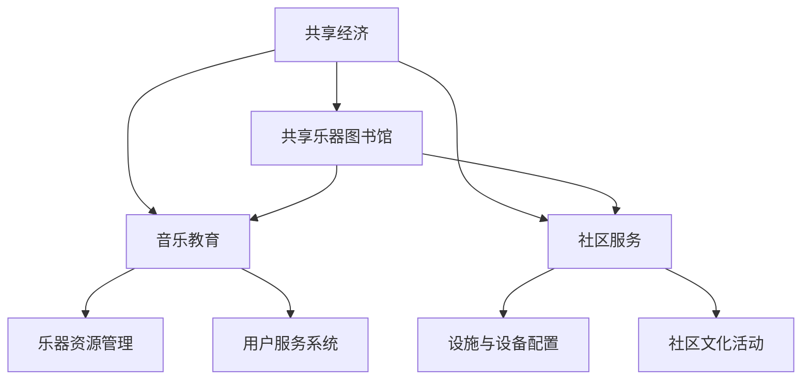

                 

### 第一部分: 城市共享乐器图书馆的背景

#### 第1章: 问题背景与核心概念

##### 1.1 新型城市共享乐器图书馆的提出

随着城市化进程的不断加快，城市居民的生活节奏也在不断加快，人们对文化娱乐和教育的需求日益增加。传统的公共图书馆和音乐教育机构在提供音乐教育资源和设备方面存在一些局限。首先，公共图书馆中通常缺乏足够的乐器资源，尤其是专业乐器，这限制了人们获取音乐学习资源的途径。其次，音乐教育机构往往价格较高，且地点固定，不利于居民的便捷使用。

为了解决这些问题，新型城市共享乐器图书馆的概念应运而生。共享乐器图书馆通过引入共享经济的理念，将乐器资源进行整合和优化配置，让更多的居民能够方便地使用专业乐器，享受到高质量的音乐教育。

共享乐器图书馆的起源可以追溯到共享经济的兴起。共享经济是一种基于互联网和信息技术的新型经济模式，通过共享闲置资源，提高资源利用效率，满足人们的多样化需求。共享单车、共享充电宝等共享经济模式已经在多个领域取得了成功，为人们提供了便捷的服务。

在城市文化教育领域，共享乐器图书馆作为共享经济的一种创新形式，通过提供共享乐器服务，不仅可以解决乐器资源不足的问题，还可以促进音乐文化的普及与发展。共享乐器图书馆的提出，不仅是对传统公共图书馆和音乐教育机构的有力补充，更是对城市文化服务体系的一次升级。

##### 1.2 问题背景与需求分析

城市居民对音乐教育及文化娱乐的需求日益增加。音乐作为一种艺术形式，不仅能够丰富人们的精神生活，还能够培养人的审美能力和创造力。然而，当前城市中存在以下几方面的问题：

1. **乐器资源不足**：许多公共图书馆和音乐教育机构由于场地和经费限制，无法提供足够的乐器资源，特别是专业乐器，这限制了居民的日常学习和实践。

2. **服务成本高**：音乐教育机构通常收费较高，使得很多居民难以承担长期的学习费用，尤其是专业乐器的购买和维护费用。

3. **使用不便**：音乐教育机构往往位于市区，且营业时间固定，居民在使用上存在一定的不便。

4. **文化娱乐需求多样**：随着人们生活水平的提高，居民对于文化娱乐的需求日益多样化，共享乐器图书馆可以提供多种乐器和丰富的音乐活动，满足居民的不同需求。

共享乐器图书馆旨在解决这些问题，通过共享经济模式，将乐器资源进行优化配置，降低使用成本，提高服务便捷性，从而更好地满足居民对音乐教育及文化娱乐的需求。

##### 1.3 核心概念界定与结构分析

在探讨共享乐器图书馆之前，我们需要明确几个核心概念的定义和它们之间的结构关系。

**共享经济**：共享经济是指通过互联网平台，整合闲置资源，让资源拥有者和需求者之间进行共享，从而实现资源利用的最大化。在音乐教育领域，共享经济可以通过共享乐器，让更多人能够以较低的成本接触和使用专业乐器。

**共享乐器图书馆**：共享乐器图书馆是一种基于共享经济模式的文化设施，通过提供共享乐器服务，满足居民对音乐教育和文化娱乐的需求。它包括乐器资源管理、用户服务系统、设施与设备配置等组成部分。

**音乐教育**：音乐教育是指通过音乐理论和实践教育，培养学生的音乐素养和技能。在共享乐器图书馆中，音乐教育不仅是核心服务之一，也是推广音乐文化的重要途径。

**社区服务**：社区服务是指为社区成员提供各种形式的服务，旨在提升社区成员的生活质量。共享乐器图书馆作为社区服务的一部分，可以为社区居民提供便利的音乐学习资源和活动平台。

**核心概念关系分析**：

- **共享经济**是共享乐器图书馆的基础，通过整合和优化乐器资源，实现资源的共享和高效利用。
- **共享乐器图书馆**是音乐教育的载体，通过提供便捷的乐器使用服务，促进音乐教育的普及和发展。
- **音乐教育**和**社区服务**共同构成了共享乐器图书馆的服务内容，既满足了居民对音乐教育的需求，也丰富了社区的文化生活。

以下是核心概念关系的Mermaid流程图：

通过以上分析，我们可以看到，共享乐器图书馆作为一种新型的文化设施，不仅解决了乐器资源不足、服务成本高、使用不便等问题，还通过共享经济的模式，实现了音乐教育和社区服务的有机融合，为城市居民提供了更加丰富和便捷的文化娱乐选择。接下来，我们将进一步探讨共享乐器图书馆的运行机制、核心概念及其社会价值。

#### 第2章: 共享乐器图书馆的运行机制

##### 2.1 图书馆的运营模式

共享乐器图书馆的运营模式基于共享经济的原则，通过整合乐器资源，提供灵活、便捷的乐器使用服务。其运营模式主要包括以下几个关键环节：

1. **资源整合**：共享乐器图书馆首先需要整合各种乐器资源，包括专业乐器、乐器配件以及相关的教学设备。这些资源可以来源于捐赠、购置、租赁等多种途径。资源整合是共享乐器图书馆能够提供丰富乐器选择的基础。

2. **预约管理**：为了提高乐器资源的利用效率，共享乐器图书馆通常会采用在线预约系统。用户可以通过图书馆的官方网站或移动应用进行乐器预约，系统会根据用户的预约时间和乐器类型进行匹配，确保乐器资源的高效分配。

3. **服务提供**：在预约成功后，用户可以到图书馆使用乐器。图书馆通常会提供多种服务模式，如自助式服务、教练辅导服务、音乐活动等。自助式服务方便用户随时使用乐器，而教练辅导服务则有助于提高用户的学习效果。

4. **费用结算**：共享乐器图书馆通常会采用按时长或按次收费的模式，用户在预约使用乐器时需要支付相应的费用。费用结算可以通过线上支付或线下支付方式进行，确保服务的便捷性和安全性。

5. **维护与管理**：为了保证乐器的良好状态和使用安全，共享乐器图书馆需要建立完善的维护和管理制度。这包括定期的设备检查、维修和更新，以及严格的借用和归还流程，确保乐器资源的长期可用性。

通过上述运营模式，共享乐器图书馆不仅能够高效地分配和管理乐器资源，还能够提供多样化的服务，满足不同用户的需求。

##### 2.2 设施与设备配置

共享乐器图书馆的设施与设备配置是保证其正常运行和服务质量的关键。以下是一些关键设施和设备：

1. **乐器种类**：共享乐器图书馆应配备多种类型的乐器，包括弦乐器（如吉他、小提琴、大提琴等）、键盘乐器（如钢琴、电子琴等）、打击乐器（如鼓、打击板等）以及其他特殊乐器。乐器的种类和数量应满足不同用户的需求。

2. **音响设备**：为了提供优质的听觉体验，图书馆应配备专业的音响设备，包括音响、麦克风和调音台。这些设备不仅用于音乐教学，还可以用于举办小型音乐会和其他音乐活动。

3. **练习房间**：共享乐器图书馆应设有专门的练习房间，房间内应配备必要的隔音设施，确保不影响其他用户。练习房间应提供充足的光线和舒适的氛围，以便用户进行长时间的练习。

4. **教学设备**：图书馆还应配备一些教学设备，如乐器教学软件、音乐理论教材、乐器配件（如拨片、琴弓等）等。这些设备有助于用户更有效地学习和使用乐器。

5. **网络设施**：为了支持在线预约和管理，共享乐器图书馆需要配备高速稳定的网络设施。此外，图书馆还应提供无线网络覆盖，以便用户在使用过程中能够随时查看预约信息和进行在线互动。

6. **安全设施**：为了保证用户的人身和财产安全，图书馆应配备安全摄像头、消防设备以及应急装置。这些设施能够提高图书馆的安全性，为用户提供一个放心的学习环境。

通过合理的设施与设备配置，共享乐器图书馆能够提供高质量的服务，满足用户对音乐学习和文化娱乐的需求。

##### 2.3 用户服务与互动机制

共享乐器图书馆的用户服务与互动机制是其运营成功的重要因素。为了确保用户能够方便、高效地使用图书馆资源，并提升用户满意度，以下是一些关键服务与互动机制：

1. **在线预约系统**：用户可以通过图书馆官方网站或移动应用程序进行乐器预约。系统应提供清晰的预约流程，用户可以选择乐器类型、时间以及预约时长。预约系统还应具备实时更新功能，以便用户及时了解预约状态。

2. **会员制度**：图书馆可以设立会员制度，会员享受一定的优惠和服务。会员可以享受优先预约权、免费参与音乐活动、积分兑换等福利。通过会员制度，图书馆可以吸引和保留更多忠实用户。

3. **培训课程**：图书馆可以定期开设各类音乐培训课程，包括乐器基础课程、音乐理论课程等。这些课程由专业教师授课，有助于提高用户的音乐素养和技能。培训课程可以通过线上或线下方式进行，方便不同需求的用户参与。

4. **社区活动**：图书馆可以组织各类社区活动，如音乐会、音乐沙龙、乐器展示等。这些活动不仅丰富了社区的文化生活，也为用户提供了交流和展示的平台。通过社区活动，图书馆可以增强用户之间的互动，提升用户黏性。

5. **用户反馈机制**：图书馆应建立完善的用户反馈机制，鼓励用户对图书馆的服务提出意见和建议。通过收集和分析用户反馈，图书馆可以不断改进服务质量，满足用户的个性化需求。

6. **用户互动平台**：图书馆可以设立在线互动平台，如社交媒体群组、论坛等，用户可以在平台上分享学习心得、交流音乐经验。通过用户互动平台，图书馆可以构建一个良好的社区氛围，增强用户归属感。

通过上述用户服务与互动机制，共享乐器图书馆不仅能够提供便捷、高效的服务，还能够促进用户之间的互动和社区文化建设。这不仅提升了图书馆的服务质量，也为城市居民提供了一个丰富、有意义的音乐学习与文化交流平台。

#### 第3章: 共享乐器图书馆的核心概念

##### 3.1 共享经济原理

共享经济是一种基于互联网和信息技术的新型经济模式，通过整合和优化闲置资源，实现资源的高效利用和共享。其核心原理包括以下几个方面：

**1. 碎片化资源整合**：共享经济将原本分散、碎片化的资源进行整合，使其能够集中化、规模化地利用。例如，共享单车将城市中闲置的自行车资源整合起来，提供便捷的共享服务。

**2. 技术驱动**：互联网和移动通信技术的发展为共享经济提供了技术支撑。通过在线平台和移动应用，用户可以方便地获取资源和服务，资源拥有者也可以轻松地分享资源。

**3. 信任机制**：共享经济需要建立信任机制，确保用户和资源拥有者之间的信任关系。评价系统、保证金制度等都是常见的信任机制，可以有效降低交易风险。

**4. 高效匹配**：共享经济通过大数据和算法技术，实现资源需求与供给的高效匹配。例如，共享住宿平台Airbnb利用算法为用户提供最佳的住宿选择。

在音乐教育领域，共享经济可以通过以下方式应用：

- **乐器资源共享**：通过共享乐器图书馆，居民可以低成本地获取和使用专业乐器，满足音乐学习的需求。
- **培训资源共享**：共享乐器图书馆可以提供各类音乐培训课程，通过互联网平台进行推广和预约，提高培训资源的利用率。
- **活动资源共享**：图书馆可以组织各类音乐活动，如音乐会、音乐沙龙等，用户可以免费或低成本参与，丰富音乐文化生活。

##### 3.2 音乐教育理念

音乐教育理念是指通过音乐理论和实践教育，培养人的音乐素养和技能。音乐教育不仅仅是技能的传授，更是文化传承和审美教育的过程。以下是一些核心的音乐教育理念：

**1. 基础教育**：音乐基础教育是音乐教育的起点，旨在培养学生的基本音乐素养，包括听音、识谱、演奏等技能。

**2. 全面发展**：音乐教育不仅要注重技能的培养，还要关注学生的全面发展，包括情感、态度、价值观等方面。

**3. 个性化教育**：每个学生都有自己的特点和需求，音乐教育应注重个性化，根据学生的兴趣和特长，制定个性化的学习计划。

**4. 实践性教育**：音乐教育应注重实践，通过实际演奏和创作，让学生体验音乐的魅力，提高音乐技能。

**5. 终身教育**：音乐教育不仅仅是学龄期的教育，而应贯穿人的一生。终身教育理念强调持续学习和音乐实践的重要性。

共享乐器图书馆在推广音乐教育方面具有独特的优势：

- **普及性**：通过共享乐器图书馆，更多居民可以低成本地接触和使用专业乐器，提高音乐教育的普及率。
- **便捷性**：共享乐器图书馆提供了便捷的音乐学习资源，居民可以在家中或社区内随时练习，不受时间和地点限制。
- **多样性**：共享乐器图书馆提供了丰富的乐器种类和学习资源，满足不同年龄段、不同兴趣用户的音乐学习需求。

##### 3.3 社区服务的特点与作用

社区服务是指为社区成员提供各种形式的服务，旨在提升社区成员的生活质量和幸福感。社区服务的特点包括：

**1. 本地性**：社区服务通常在居民所在的社区内提供，具有很强的本地性，能够满足居民的日常生活需求。

**2. 综合性**：社区服务内容丰富多样，包括文化、教育、卫生、体育等方面，为居民提供全面的生活支持。

**3. 社区参与**：社区服务注重居民的参与和互动，鼓励居民积极参与社区事务，增强社区凝聚力。

共享乐器图书馆作为社区服务的一部分，具有以下重要作用：

- **提升文化素养**：通过共享乐器图书馆，居民可以更便捷地接触和参与音乐活动，提升文化素养和审美能力。
- **促进社会融合**：共享乐器图书馆为不同背景、不同年龄段的居民提供了一个共同的交流平台，有助于促进社会融合和和谐。
- **丰富社区生活**：共享乐器图书馆组织各类音乐活动，丰富了社区的文化生活，提高了居民的幸福感。

总之，共享乐器图书馆不仅是一种音乐教育资源的共享模式，更是一种社区服务的创新形式，对提升城市居民的文化素养和社区生活质量具有重要意义。

#### 第4章: 共享乐器图书馆的社会价值

##### 4.1 推广音乐教育的意义

推广音乐教育对于社会的全面发展具有重要意义。首先，音乐教育有助于培养人的全面发展。音乐不仅仅是艺术的表现形式，它还能促进人的情感、认知和社交能力的发展。通过音乐教育，学生可以学会如何表达自己的情感，提高审美能力和创造力，培养良好的团队合作精神。

其次，音乐教育有助于提升社会的文化素养。音乐是一种独特的文化载体，它能够跨越国界和语言，传递人类文明的精髓。通过推广音乐教育，可以让更多的人了解和欣赏不同文化和艺术形式，增进文化交流和理解，从而促进社会的和谐与发展。

共享乐器图书馆在推广音乐教育方面具有独特的优势。首先，共享乐器图书馆通过提供丰富的乐器资源，降低了音乐教育的门槛，使得更多居民能够低成本地接触和使用专业乐器，从而提高音乐教育的普及率。其次，共享乐器图书馆通过开设各类音乐培训和活动，为居民提供了多样化的学习机会，满足了不同年龄段和不同兴趣用户的需求。此外，共享乐器图书馆还通过社区互动平台，促进了居民之间的交流和合作，形成了良好的音乐学习氛围。

具体来说，共享乐器图书馆在推广音乐教育方面的贡献体现在以下几个方面：

1. **普及音乐教育**：通过共享乐器图书馆，更多居民可以便捷地获取音乐学习资源，无需支付高昂的乐器购买费用，从而大大降低了音乐教育的门槛。

2. **促进音乐文化传播**：共享乐器图书馆为不同文化背景的居民提供了一个共享和交流的平台，有助于促进不同音乐文化的融合和传播，提升社会的文化多样性。

3. **提升居民音乐素养**：通过共享乐器图书馆提供的各类音乐培训和活动，居民可以不断丰富自己的音乐知识和技能，提高音乐素养和审美能力。

4. **培养音乐人才**：共享乐器图书馆不仅为普通居民提供了音乐学习的机会，也为音乐人才提供了成长的土壤。通过专业培训和指导，一些有天赋的年轻人可以得到更好的发展，从而为音乐事业做出更大的贡献。

综上所述，共享乐器图书馆在推广音乐教育方面具有重要的社会价值，它不仅提高了音乐教育的普及率，丰富了社会的文化生活，还培养了一批又一批的音乐人才，为社会的全面发展做出了积极贡献。

##### 4.2 社区文化建设的贡献

社区文化建设是社会整体文化发展的重要组成部分，其目标是提升居民的文化素养、增强社区凝聚力、促进社会和谐。共享乐器图书馆作为社区文化设施的一种创新形式，对社区文化建设做出了重要贡献。

首先，共享乐器图书馆通过提供丰富的音乐资源和多样化的音乐活动，丰富了社区的文化生活。音乐作为一种独特的艺术形式，具有强大的感染力和凝聚力，能够激发居民的兴趣和热情。通过共享乐器图书馆，居民可以便捷地参与到各种音乐活动中，如音乐会、音乐讲座、音乐沙龙等，这些活动不仅丰富了居民的文化生活，也增强了居民对社区的认同感和归属感。

其次，共享乐器图书馆促进了社区成员之间的交流和互动。音乐活动是居民之间交流的平台，通过参与音乐活动，居民可以结识新朋友，分享音乐心得，增进彼此的了解和信任。这种交流和互动不仅有助于提高居民的社会交往能力，还能增强社区的凝聚力，促进社区的和谐发展。

此外，共享乐器图书馆还有助于培养社区的文化氛围。通过定期举办音乐培训和活动，共享乐器图书馆为居民提供了学习和提升音乐素养的机会。这种文化氛围不仅有助于提高居民的文化素养，还能激发居民对文化活动的参与热情，进一步推动社区文化的繁荣发展。

具体来说，共享乐器图书馆对社区文化建设的贡献体现在以下几个方面：

1. **丰富社区文化生活**：通过提供丰富的音乐资源和多样化的音乐活动，共享乐器图书馆为居民提供了丰富多彩的文化体验，丰富了社区的文化生活。

2. **促进社区成员交流**：音乐活动是居民之间交流的桥梁，共享乐器图书馆通过音乐活动促进了居民之间的交流和互动，增强了社区的凝聚力。

3. **培养社区文化氛围**：共享乐器图书馆通过举办各类音乐培训和活动，为居民提供了学习和提升音乐素养的机会，培养了社区的文化氛围。

4. **提升居民文化素养**：通过参与共享乐器图书馆提供的音乐活动和学习资源，居民可以不断提高自己的音乐素养和审美能力，从而提升整体社区的文化素养。

综上所述，共享乐器图书馆在社区文化建设中发挥了重要作用，它不仅丰富了社区的文化生活，促进了社区成员之间的交流和互动，还提升了社区的文化氛围和居民的文化素养。通过共享乐器图书馆，社区不仅变得更加和谐美好，也更具活力和凝聚力。

##### 4.3 对城市可持续发展的影响

共享乐器图书馆对城市可持续发展的影响是多方面的，涵盖了经济、社会和环境等多个维度。以下是具体的分析：

**1. 经济效益**：共享乐器图书馆通过提供共享音乐资源，降低了居民的音乐学习成本，促进了音乐教育市场的发展。此外，图书馆还通过举办音乐会、音乐沙龙等活动，吸引了大量参与者，带动了相关产业的发展，如音乐器材销售、音乐培训服务等。这些活动不仅增加了城市的文化消费，也为城市创造了更多的就业机会，促进了经济增长。

**2. 社会效益**：共享乐器图书馆作为社区文化设施，为居民提供了一个学习、交流和娱乐的平台，增强了社区的凝聚力。通过音乐活动，居民之间的互动增加，社会关系得到强化，社区的和谐氛围得以提升。此外，共享乐器图书馆还促进了音乐文化的普及和传承，培养了更多音乐爱好者，丰富了城市的文化生活。

**3. 环境效益**：共享乐器图书馆通过共享机制，提高了乐器资源的利用效率，减少了乐器购置和废弃带来的资源浪费。同时，共享乐器图书馆通常采用环保材料和节能设备，减少了能源消耗和碳排放。这些措施有助于实现城市的可持续发展目标，降低对环境的负面影响。

**具体措施**：

- **推广共享经济理念**：通过宣传共享经济模式的优势，提高居民对共享乐器图书馆的认知和接受度，促进共享资源的普及。

- **加强政策支持**：政府可以通过财政补贴、税收优惠等措施，鼓励和支持共享乐器图书馆的发展，提供政策保障。

- **提升服务质量**：共享乐器图书馆应不断提升服务质量，通过优化设施配置、完善服务流程、提高用户满意度，吸引更多居民参与。

- **开展环保措施**：共享乐器图书馆应采用环保材料和节能设备，降低能耗和碳排放，实现可持续发展。

综上所述，共享乐器图书馆在推动城市可持续发展方面具有显著的作用。通过经济效益的提升、社会效益的增强和环境保护的推进，共享乐器图书馆不仅为城市居民提供了高质量的文化服务，也为实现城市的可持续发展目标做出了积极贡献。

#### 第5章: 共享乐器图书馆的案例分析

##### 5.1 国内外案例分析

共享乐器图书馆作为一种新兴的文化设施，已经在国内外多个城市得到了推广和实践。以下是一些具有代表性的案例，通过分析这些案例，我们可以看到共享乐器图书馆的成功经验以及面临的挑战。

**国内案例：北京共享乐器图书馆**

北京共享乐器图书馆是国内较早开展共享乐器服务的图书馆之一。该图书馆通过引入共享经济的理念，整合了多种乐器资源，为居民提供了便捷的音乐学习平台。成功经验包括：

1. **完善的资源管理**：北京共享乐器图书馆通过信息化管理系统，实现了乐器资源的实时监控和管理，提高了资源利用效率。
2. **多元化的服务模式**：图书馆不仅提供乐器共享服务，还定期举办音乐讲座、音乐会等活动，丰富了社区文化生活。
3. **有效的用户反馈机制**：图书馆建立了用户反馈机制，通过收集用户意见和建议，不断改进服务质量。

面临的挑战包括：

1. **乐器维护成本高**：由于乐器使用频率高，导致维护成本增加，这对图书馆的长期运营提出了挑战。
2. **用户预约管理难度大**：随着用户数量的增加，预约管理难度加大，需要进一步提升系统的智能化水平。

**国际案例：伦敦共享乐器图书馆**

伦敦共享乐器图书馆是英国最早成立的共享乐器图书馆之一，以其先进的共享模式和管理理念受到广泛关注。成功经验包括：

1. **灵活的预约系统**：图书馆采用了灵活的预约系统，用户可以通过手机应用程序随时预约乐器，提高了服务的便捷性。
2. **丰富的乐器种类**：图书馆提供了多种类型的乐器，包括传统乐器和现代乐器，满足了不同用户的需求。
3. **有效的社区合作**：图书馆与当地音乐学校、社区中心等组织建立了合作关系，共同推动音乐文化的普及。

面临的挑战包括：

1. **资源分配不均**：由于不同社区的需求不同，导致部分社区乐器资源不足，需要进一步优化资源分配策略。
2. **用户隐私保护**：在共享经济模式下，用户的隐私保护成为一个重要问题，图书馆需要加强数据安全管理。

**国内案例：上海共享乐器图书馆**

上海共享乐器图书馆是近年来在上海市推广的一种新型文化设施。该图书馆通过引进先进的共享经济模式，为居民提供了高质量的音乐学习服务。成功经验包括：

1. **政府支持力度大**：上海市政府对共享乐器图书馆给予了大力支持，提供了资金和政策保障，促进了其快速发展。
2. **社区参与度高**：上海共享乐器图书馆与社区组织密切合作，提高了社区居民的参与度，增强了社区凝聚力。
3. **多元化的推广方式**：图书馆通过线上线下结合的推广方式，提高了品牌知名度和影响力。

面临的挑战包括：

1. **专业人才短缺**：由于共享乐器图书馆的运营需要专业人才，但目前市场上相关专业人才较为匮乏，这对图书馆的运营提出了挑战。
2. **市场竞争激烈**：随着共享经济的普及，市场上出现了越来越多的共享乐器平台，上海共享乐器图书馆需要不断提升自身竞争力。

综上所述，国内外共享乐器图书馆在推广过程中均取得了显著成效，同时也面临一些共同的挑战。通过借鉴成功经验，总结存在的问题，我们可以为未来的共享乐器图书馆发展提供有益的参考。

##### 5.2 成功经验与不足之处

在分析国内外共享乐器图书馆的成功经验与不足之处时，我们可以从以下几个方面进行详细探讨：

**成功经验：**

1. **完善的资源管理**：许多成功的共享乐器图书馆都采用了先进的信息化管理手段，实现了对乐器资源的实时监控和高效管理。例如，北京共享乐器图书馆通过信息化管理系统，提高了乐器资源的利用率，减少了资源浪费。

2. **多元化的服务模式**：成功的共享乐器图书馆不仅提供乐器共享服务，还通过举办音乐讲座、音乐会等活动，丰富了社区的文化生活。例如，伦敦共享乐器图书馆通过多元化的服务模式，吸引了大量用户，提高了用户满意度。

3. **有效的社区合作**：成功的共享乐器图书馆与社区组织、音乐学校等建立了紧密的合作关系，共同推动音乐文化的普及和发展。例如，上海共享乐器图书馆通过与社区组织的合作，提高了社区居民的参与度，增强了社区凝聚力。

**不足之处：**

1. **乐器维护成本高**：共享乐器图书馆的乐器使用频率较高，导致维护成本增加。例如，北京共享乐器图书馆在乐器维护方面的投入较大，这对图书馆的长期运营提出了挑战。

2. **用户预约管理难度大**：随着用户数量的增加，共享乐器图书馆的预约管理难度也随之加大。例如，上海共享乐器图书馆在用户预约管理方面面临较大的压力，需要进一步提升系统的智能化水平。

3. **资源分配不均**：由于不同社区的需求不同，共享乐器图书馆在资源分配方面可能存在不均现象。例如，伦敦共享乐器图书馆在某些社区乐器资源不足，需要进一步优化资源分配策略。

4. **用户隐私保护**：在共享经济模式下，用户的隐私保护成为一个重要问题。例如，伦敦共享乐器图书馆需要加强数据安全管理，确保用户的隐私不受侵犯。

**改进方向：**

1. **优化资源管理**：共享乐器图书馆可以进一步优化资源管理，采用智能化的设备监控和数据分析技术，提高资源利用效率，降低维护成本。

2. **提升服务便捷性**：通过提升在线预约系统和用户服务系统的便捷性，减少用户预约管理的难度，提高用户满意度。

3. **均衡资源分配**：共享乐器图书馆可以通过数据分析，了解不同社区的需求，优化资源分配策略，确保资源均衡分配。

4. **加强数据安全管理**：共享乐器图书馆应加强数据安全管理，采取有效的技术手段和规章制度，确保用户的隐私和信息安全。

通过总结成功经验和不足之处，我们可以为共享乐器图书馆的发展提供有益的借鉴，帮助其在未来取得更大的成功。

#### 第6章: 共享乐器图书馆的推广策略

##### 6.1 政策支持与法规建设

政策支持与法规建设是推动共享乐器图书馆发展的重要保障。为了更好地推广共享乐器图书馆，政府需要采取一系列政策措施，包括：

1. **财政支持**：政府可以设立专项资金，用于支持共享乐器图书馆的建设和运营。这些资金可以用于购置乐器、建设设施、人员培训和日常维护等方面，确保图书馆的正常运行。

2. **税收优惠**：政府可以给予共享乐器图书馆一定的税收优惠，以减轻其财务负担。例如，对图书馆的收入实行减税或免税政策，鼓励更多社会组织和个人参与共享乐器图书馆的建设。

3. **土地政策**：政府可以提供优惠的土地政策，为共享乐器图书馆的选址提供便利。例如，将图书馆的建设用地纳入公共文化设施用地范畴，实行低价或无偿供地。

4. **法规保障**：政府需要制定相关法规，明确共享乐器图书馆的运营规范和服务标准。这包括对乐器资源的监管、用户隐私保护、安全管理等方面的规定，确保图书馆的合法性和规范性。

通过以上政策支持与法规建设，共享乐器图书馆将得到更好的发展环境，有助于提高其服务质量和普及率。

##### 6.2 社会合作与资源整合

共享乐器图书馆的推广离不开社会各界的合作与资源整合。以下是一些关键的合作方式：

1. **与企业合作**：共享乐器图书馆可以与音乐器材制造商、文化企业等建立战略合作关系，共同推动音乐教育产业的发展。例如，通过合作，图书馆可以获得优质的音乐器材和技术支持，提高服务质量。

2. **与社区合作**：共享乐器图书馆应积极参与社区文化建设，与社区组织、居民委员会等建立紧密联系，共同举办音乐活动和文化节。这不仅可以提高图书馆的知名度，还能增强社区的凝聚力。

3. **与教育机构合作**：共享乐器图书馆可以与学校、音乐培训机构等合作，开展音乐教育和培训活动。通过合作，图书馆可以为更多学生提供实践机会，同时提高自身的专业水平。

4. **与文化团体合作**：共享乐器图书馆可以与文化团体、艺术家等合作，举办音乐会、展览等活动，丰富社区文化生活。

通过以上社会合作与资源整合，共享乐器图书馆可以更好地满足居民的需求，提升服务质量，推动音乐教育的发展。

##### 6.3 市场推广与品牌建设

市场推广与品牌建设是共享乐器图书馆成功推广的关键环节。以下是一些具体策略：

1. **线上推广**：通过官方网站、社交媒体、微信公众号等线上平台，发布图书馆的服务信息、活动预告和用户评价，吸引更多潜在用户。同时，可以利用搜索引擎优化（SEO）技术，提高图书馆在搜索引擎中的排名，增加曝光率。

2. **线下推广**：在社区内设置宣传展板、发放宣传册，通过社区活动、音乐会等方式进行线下推广。此外，可以与周边的商业机构合作，进行联合宣传，扩大影响范围。

3. **品牌形象塑造**：通过精心设计的品牌标识、宣传语和视觉形象，塑造共享乐器图书馆的品牌形象。品牌形象应体现图书馆的核心价值和文化特色，让用户产生良好的认知和情感共鸣。

4. **用户口碑营销**：鼓励用户在社交媒体、评价平台等渠道分享使用体验，通过用户的口碑传播，提升图书馆的品牌知名度和影响力。

5. **合作推广**：与音乐教育机构、文化企业等建立合作关系，通过联合推广活动，共享资源，实现共赢。

通过以上市场推广与品牌建设策略，共享乐器图书馆可以不断扩大影响力，吸引更多用户，提升服务质量，为音乐文化的普及和发展做出更大贡献。

#### 第7章: 共享乐器图书馆的未来发展

##### 7.1 技术趋势与创新发展

共享乐器图书馆的未来发展离不开新技术的创新和应用。随着人工智能、大数据、物联网等技术的不断发展，共享乐器图书馆将迎来一系列的创新和变革。

首先，人工智能技术的应用将为共享乐器图书馆提供智能化的服务支持。例如，通过智能语音助手，用户可以更方便地进行乐器预约、查询和反馈。此外，人工智能还可以用于个性化推荐，根据用户的音乐兴趣和需求，推荐合适的乐器和音乐活动。

其次，大数据技术的应用可以帮助共享乐器图书馆更好地了解用户需求，优化资源配置。通过大数据分析，图书馆可以了解用户的预约习惯、使用频率和偏好，从而提供更加精准的服务。例如，可以根据数据分析结果，合理调整乐器的配置和库存，提高资源利用效率。

物联网技术的应用将为共享乐器图书馆提供更加便捷的使用体验。通过物联网设备，用户可以远程控制乐器，实时监控乐器的使用状态，确保乐器的安全和保养。此外，物联网技术还可以实现乐器的智能预约和自动分配，提高服务的便捷性和高效性。

最后，虚拟现实（VR）和增强现实（AR）技术的应用将为共享乐器图书馆带来全新的音乐学习体验。用户可以通过VR设备进行沉浸式的音乐学习，体验虚拟音乐会，提高学习兴趣和效果。AR技术则可以用于音乐教学，通过增强现实技术展示乐器的演奏技巧和音乐理论，使学习过程更加生动有趣。

##### 7.2 行业挑战与机遇

尽管共享乐器图书馆具有巨大的发展潜力，但在实际运营过程中也面临着一系列挑战和机遇。

**挑战：**

1. **资源管理难度大**：共享乐器图书馆需要高效管理大量的乐器资源，包括乐器的采购、维护、更新等。资源管理难度大，容易导致资源浪费和损坏。

2. **用户隐私保护**：在共享经济模式下，用户的隐私保护成为重要问题。共享乐器图书馆需要采取有效的措施，确保用户的个人信息和数据安全。

3. **市场竞争激烈**：随着共享经济的普及，市场上出现了越来越多的共享乐器平台，共享乐器图书馆需要不断提升自身竞争力，吸引和保留用户。

4. **专业人才短缺**：共享乐器图书馆的运营需要专业人才，但目前市场上相关人才较为匮乏，这对图书馆的长期运营提出了挑战。

**机遇：**

1. **政策支持**：政府对于文化教育的支持力度不断加大，为共享乐器图书馆的发展提供了良好的政策环境。

2. **技术进步**：新技术的应用为共享乐器图书馆提供了更多的创新可能，有助于提升服务质量，增强用户体验。

3. **市场需求**：随着居民对音乐教育和文化娱乐需求的增加，共享乐器图书馆的市场前景广阔。

4. **跨界合作**：共享乐器图书馆可以与教育机构、文化企业等建立跨界合作，共同推动音乐教育产业的发展。

##### 7.3 预测与展望

结合技术趋势、行业挑战与机遇，我们对共享乐器图书馆的未来发展做出以下预测和展望：

1. **智能化服务普及**：随着人工智能技术的不断发展，共享乐器图书馆将实现更加智能化的服务，提升用户满意度。

2. **资源利用效率提高**：通过大数据和物联网技术的应用，共享乐器图书馆将实现更加高效的资源管理，提高乐器资源的利用效率。

3. **市场占有率提升**：随着市场需求的增加和竞争的加剧，共享乐器图书馆将通过提升服务质量、优化用户体验，提升市场占有率。

4. **品牌影响力增强**：通过品牌建设、市场推广和跨界合作，共享乐器图书馆将增强品牌影响力，成为音乐教育领域的重要力量。

5. **多元化发展**：共享乐器图书馆将不仅仅局限于乐器共享，还将拓展音乐培训、文化演出、音乐创作等多个领域，实现多元化发展。

总之，共享乐器图书馆作为音乐教育的一种创新形式，具有广阔的发展前景。通过技术创新、行业合作和市场推广，共享乐器图书馆将不断优化服务，提升用户体验，为城市居民提供更加丰富和高质量的音乐文化服务。

### 文章总结与未来展望

通过本文的深入探讨，我们系统地分析了新型城市共享乐器图书馆的背景、运行机制、核心概念、社会价值、案例分析、推广策略以及未来发展趋势。我们可以得出以下几点核心结论：

1. **共享经济与音乐教育的融合**：共享乐器图书馆通过引入共享经济的理念，优化乐器资源的配置，实现了音乐教育的普及与推广，为城市居民提供了便捷、低成本的乐器使用和音乐学习平台。

2. **社会价值显著**：共享乐器图书馆不仅提升了居民的音乐素养，丰富了社区文化生活，还促进了社会融合和社区建设，对城市可持续发展具有重要意义。

3. **技术创新带来新机遇**：随着人工智能、大数据、物联网等新技术的不断进步，共享乐器图书馆将在智能化服务、资源高效利用、用户体验提升等方面实现新的突破。

4. **面临挑战与机遇**：尽管共享乐器图书馆面临资源管理、用户隐私保护、专业人才短缺等挑战，但政府支持、市场需求和技术进步为其提供了巨大的发展机遇。

未来，共享乐器图书馆的发展将更加注重技术创新和服务质量的提升，通过跨界合作、品牌建设以及市场推广，实现多元化发展，成为城市文化服务体系的重要组成部分。我们期待共享乐器图书馆在未来的发展中，能够更好地满足居民对音乐教育和文化娱乐的需求，为构建和谐美好的城市生活贡献更多力量。

### 作者信息

**作者：AI天才研究院/AI Genius Institute & 禅与计算机程序设计艺术 /Zen And The Art of Computer Programming**

AI天才研究院（AI Genius Institute）是一家专注于人工智能和计算机科学领域研究与创新的高科技研究院。我们的宗旨是通过先进的技术研究和创新，推动人工智能在各个领域的应用与发展。同时，我们致力于探索计算机程序设计的哲学和艺术，将禅的思想融入到编程实践中，促进编程技能的提升和计算机科学的进步。

“禅与计算机程序设计艺术”（Zen And The Art of Computer Programming）是本研究院的重要研究领域，我们通过深入研究和实践，致力于将禅宗思想与编程技巧相结合，提高程序员的技术素养和创造力。通过本文，我们希望能为读者提供一个全面、深入的分析，帮助大家更好地理解共享乐器图书馆的创新意义和社会价值。

感谢您阅读本文，期待与您在未来的技术交流中相遇，共同探索人工智能和计算机科学的无限可能。如果您有任何问题或建议，欢迎随时与我们联系。再次感谢您的关注和支持！

