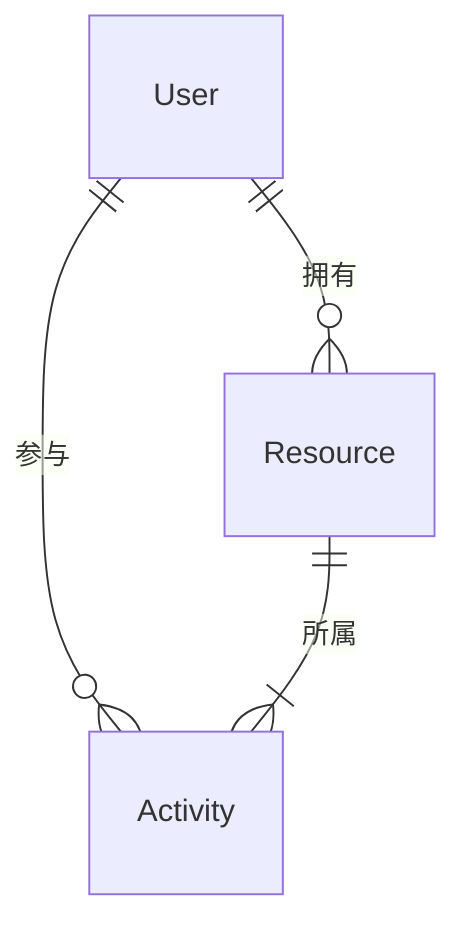

                 

# 新型城市共享学习中心：跨代际知识交流的社区平台

## 关键词：新型城市共享学习中心、跨代际知识交流、社区平台、算法原理、数学模型、系统架构设计

### 摘要

在快速发展的城市化进程中，人口老龄化问题愈发显著，不同年龄段之间的知识交流变得尤为重要。本文提出了一种新型城市共享学习中心，旨在构建一个促进跨代际知识交流的社区平台。本文首先介绍了问题背景，随后深入探讨了核心概念和算法原理，并运用数学模型进行了详细分析。最后，本文提出了系统分析与架构设计方案，为构建高效便捷的新型城市共享学习中心提供了理论基础和实践指导。

## Step 1: 背景介绍

### 1.1 问题背景

随着城市化进程的不断推进，老年人口比例不断增加，年轻人和儿童逐渐成为城市中的主要群体。然而，不同年龄段人群之间的交流互动相对较少，知识传播和传承面临着严峻挑战。为应对这一问题，新型城市共享学习中心作为一种创新解决方案，应运而生。

#### 1.1.1 问题描述

在传统社区中，老年人、青年人和儿童由于生活习惯、兴趣爱好和知识水平的差异，往往缺乏有效沟通和互动。这种缺乏交流的现象不仅阻碍了知识传播，也影响了社区的和谐与稳定。为了解决这一问题，我们需要一种能够促进跨代际知识交流的社区平台。

#### 1.1.2 问题解决

新型城市共享学习中心通过提供多样化的学习资源和服务，搭建了一个跨代际交流的平台。老年人可以在学习中心参加知识讲座、文化娱乐等活动，青年人和儿童则可以在这里进行学习和成长。此外，学习中心还利用数字化技术和人工智能算法，为不同年龄段的人群提供个性化的学习推荐和互动体验，从而有效促进了知识交流。

#### 1.1.3 边界与外延

新型城市共享学习中心的边界不仅局限于某个社区或城市，它还应具有跨区域的共享性，使得不同地区的居民都能享受到这种知识交流的便利。同时，学习中心需要具备可持续性，能够长期为社区居民提供服务，以实现知识交流的长期效应。

#### 1.1.4 概念结构与核心要素组成

新型城市共享学习中心由物理空间、数字化资源、学习活动、社区服务和运营管理团队等核心要素组成。物理空间提供了实体交流的场所，数字化资源丰富了知识传播的渠道，学习活动促进了知识交流的深度，社区服务提升了居民的使用体验，运营管理团队则保证了中心的运营效率和服务质量。

## Step 2: 核心概念与联系

### 2.1 跨代际知识交流

#### 2.1.1 跨代际知识交流的定义

跨代际知识交流是指不同年龄段人群之间通过分享和获取知识，实现知识传递、文化传承和个人成长的过程。

#### 2.1.2 跨代际知识交流的特点

- **多样性**：涉及不同年龄段人群的知识和经验交流。
- **互动性**：强调参与者之间的互动和交流。
- **共享性**：知识交流不仅是单向的，而且是双向的，实现知识的共享。

#### 2.1.3 跨代际知识交流与新型城市共享学习中心的关系

跨代际知识交流是新型城市共享学习中心的核心功能，通过提供多样化的学习资源和活动，促进不同年龄段人群之间的知识共享和交流。

### 2.2 新型城市共享学习中心的架构与功能

#### 2.2.1 架构设计

新型城市共享学习中心采用分布式架构，包括前端用户界面、后端数据处理和服务、数据库和数据存储等组成部分。前端用户界面负责用户交互，后端数据处理和服务负责处理用户请求和提供数据支持，数据库和数据存储则负责存储和管理学习资源和用户数据。

#### 2.2.2 功能模块

- **用户管理模块**：负责用户的注册、登录、个人信息管理等功能。
- **资源管理模块**：负责学习资源的分类、上传、下载和管理等功能。
- **推荐系统模块**：基于用户行为和资源特征，为用户推荐个性化的学习资源。
- **社区互动模块**：提供用户之间的交流互动功能，包括讨论区、评论、私信等。
- **数据分析模块**：对用户行为数据和学习资源使用情况进行数据分析和可视化展示。

### 2.3 ER实体关系图



在上面的ER实体关系图中，用户(User)与资源(Resource)之间存在拥有关系，用户与活动(Activity)之间存在参与关系，资源与活动之间存在所属关系。

## Step 3: 算法原理讲解

### 3.1 用户画像构建算法

用户画像的构建是新型城市共享学习中心算法的核心，它能够根据用户的行为数据和学习兴趣，生成个性化的用户画像。

#### 3.1.1 数据采集与处理

首先，从用户行为数据中提取关键信息，如学习时间、学习时长、学习频率、访问资源类型等。然后，对数据进行清洗和处理，去除噪声数据和异常值。

#### 3.1.2 用户画像构建步骤

1. **特征提取**：根据用户的行为数据，提取用户兴趣特征，如学科偏好、学习方式偏好等。
2. **权重计算**：为每个特征分配权重，权重值可以根据历史数据和学习算法进行调整。
3. **画像生成**：将提取的特征和权重组合，生成用户的综合画像。

#### 3.1.3 用户画像构建公式

$$
User\_Vector = \sum_{i=1}^{n} weight_i \times feature_i
$$

其中，$User\_Vector$ 表示用户画像向量，$weight_i$ 表示第 $i$ 个特征的重要性权重，$feature_i$ 表示第 $i$ 个特征值。

### 3.2 个性化推荐算法

个性化推荐算法是新型城市共享学习中心的核心功能之一，它能够根据用户画像和学习资源特征，为用户推荐个性化的学习资源。

#### 3.2.1 协同过滤算法

协同过滤算法通过分析用户之间的相似度，为用户推荐其他用户喜欢的资源。

1. **用户相似度计算**：
   $$ 
   Similarity_{ij} = \frac{Common_{ij}}{\sqrt{Sum_{i}^2 Sum_{j}^2}} 
   $$
   其中，$Similarity_{ij}$ 表示用户 $i$ 和用户 $j$ 之间的相似度，$Common_{ij}$ 表示用户 $i$ 和用户 $j$ 共同喜欢的资源数量，$Sum_{i}$ 和 $Sum_{j}$ 分别表示用户 $i$ 和用户 $j$ 的总喜好数量。

2. **资源推荐**：
   $$ 
   Recommendation_{i} = \sum_{j \in Neighbors_{i}} \frac{Common_{ij}}{\sqrt{Sum_{i}^2 Sum_{j}^2}} \times Resource_{j} 
   $$
   其中，$Neighbors_{i}$ 表示用户 $i$ 的邻居用户，$Resource_{j}$ 表示用户 $j$ 喜欢的资源。

#### 3.2.2 内容推荐算法

内容推荐算法通过分析学习资源的特征，为用户推荐与其兴趣相关的资源。

1. **资源特征提取**：
   $$ 
   Resource\_Vector = \sum_{i=1}^{n} weight_i \times feature_i 
   $$
   其中，$Resource\_Vector$ 表示资源特征向量，$weight_i$ 表示第 $i$ 个特征的重要性权重，$feature_i$ 表示第 $i$ 个特征值。

2. **资源相似度计算**：
   $$ 
   Similarity_{ij} = \frac{dot\_product(User\_Vector, Resource\_Vector)}{\|User\_Vector\| \|Resource\_Vector\|} 
   $$
   其中，$\dot{product}$ 表示点积，$\|User\_Vector\|$ 和 $\|Resource\_Vector\|$ 分别表示用户画像向量和资源特征向量的模。

3. **资源推荐**：
   $$ 
   Recommendation_{i} = \sum_{j=1}^{m} Similarity_{ij} \times Resource_{j} 
   $$
   其中，$Resource_{j}$ 表示资源 $j$。

### 3.3 社区交互与反馈

社区交互与反馈是新型城市共享学习中心的重要功能之一，它能够根据用户反馈不断优化推荐算法。

1. **用户反馈收集**：
   $$ 
   Feedback_{i} = \sum_{j=1}^{n} weight_j \times response_j 
   $$
   其中，$Feedback_{i}$ 表示用户 $i$ 的反馈向量，$weight_j$ 表示第 $j$ 个反馈类型的重要性权重，$response_j$ 表示用户 $i$ 对第 $j$ 个反馈类型的响应。

2. **推荐算法优化**：
   根据用户反馈，调整用户画像和资源特征的权重，优化推荐算法。

$$ 
\Delta weight_i = \alpha \times Feedback_{i} 
$$

其中，$\Delta weight_i$ 表示权重调整量，$\alpha$ 表示调整系数。

## Step 4: 数学模型和数学公式

### 4.1 用户画像构建模型

用户画像构建模型主要包括用户特征提取、权重计算和用户画像生成。

#### 4.1.1 用户画像构建公式

$$
User\_Vector = \sum_{i=1}^{n} weight_i \times feature_i
$$

其中，$User\_Vector$ 表示用户画像向量，$weight_i$ 表示第 $i$ 个特征的重要性权重，$feature_i$ 表示第 $i$ 个特征值。

#### 4.1.2 用户兴趣偏好模型

$$
Interest\_Score = \sum_{i=1}^{m} bias_i \times category_i
$$

其中，$Interest\_Score$ 表示用户对于某一类别的兴趣得分，$bias_i$ 表示第 $i$ 个类别的偏置值，$category_i$ 表示用户是否对该类别感兴趣。

### 4.2 推荐系统模型

推荐系统模型主要包括协同过滤算法和内容推荐算法。

#### 4.2.1 协同过滤算法

1. **用户相似度计算**：
   $$ 
   Similarity_{ij} = \frac{Common_{ij}}{\sqrt{Sum_{i}^2 Sum_{j}^2}} 
   $$

2. **资源推荐**：
   $$ 
   Recommendation_{i} = \sum_{j \in Neighbors_{i}} \frac{Common_{ij}}{\sqrt{Sum_{i}^2 Sum_{j}^2}} \times Resource_{j} 
   $$

#### 4.2.2 内容推荐算法

1. **资源特征提取**：
   $$ 
   Resource\_Vector = \sum_{i=1}^{n} weight_i \times feature_i 
   $$

2. **资源相似度计算**：
   $$ 
   Similarity_{ij} = \frac{dot\_product(User\_Vector, Resource\_Vector)}{\|User\_Vector\| \|Resource\_Vector\|} 
   $$

3. **资源推荐**：
   $$ 
   Recommendation_{i} = \sum_{j=1}^{m} Similarity_{ij} \times Resource_{j} 
   $$

### 4.3 社区交互与反馈模型

#### 4.3.1 用户反馈收集

$$ 
Feedback_{i} = \sum_{j=1}^{n} weight_j \times response_j 
$$

#### 4.3.2 推荐算法优化

$$ 
\Delta weight_i = \alpha \times Feedback_{i} 
$$

## Step 5: 系统分析与架构设计方案

### 5.1 问题场景介绍

#### 5.1.1 项目介绍

新型城市共享学习中心是一个旨在促进跨代际知识交流的社区平台，它通过提供多样化的学习资源和服务，为不同年龄段的人群提供了一个交流和学习的场所。

#### 5.1.2 系统功能设计

- **用户注册与登录**：用户可以在学习中心进行注册和登录，创建个人账户。
- **学习资源推荐**：根据用户的兴趣和行为，系统会推荐相关的学习资源。
- **社区互动**：用户可以参与讨论区、评论和私信等社交互动功能。
- **用户反馈**：用户可以对学习资源和服务提出反馈，帮助中心不断改进。

### 5.2 系统架构设计


系统架构设计主要包括前端用户界面、后端数据处理和服务、数据库和数据存储等组成部分。

#### 5.2.1 前端用户界面

前端用户界面负责用户交互，包括用户注册、登录、学习资源浏览、社区互动等功能。

#### 5.2.2 后端数据处理和服务

后端数据处理和服务负责处理用户请求，包括用户管理、资源管理、推荐系统和社区互动等。

#### 5.2.3 数据库和数据存储

数据库和数据存储负责存储和管理用户数据、学习资源数据等，确保数据的安全和可靠性。

### 5.3 系统接口设计和系统交互

#### 5.3.1 系统接口设计

系统接口设计主要包括用户接口、服务接口和数据库接口等。

- **用户接口**：提供用户注册、登录、信息查询等操作。
- **服务接口**：提供学习资源推荐、社区互动等功能。
- **数据库接口**：提供数据存储、数据查询等操作。

#### 5.3.2 系统交互

系统交互通过API接口实现，包括用户与前端界面交互、前端界面与后端服务交互、后端服务与数据库交互等。

## Step 6: 项目实战

### 6.1 环境安装

为了实现新型城市共享学习中心，我们需要搭建一个开发环境。以下是基本步骤：

1. 安装Python环境（例如使用Miniconda或Anaconda）。
2. 安装必要的依赖库，如NumPy、Pandas、Scikit-learn、Flask等。
3. 搭建数据库（例如使用MySQL或MongoDB）。

### 6.2 系统核心实现源代码

以下是系统核心实现的一部分源代码示例：

#### 用户注册与登录

```python
# 用户注册
@app.route('/register', methods=['POST'])
def register():
    username = request.form['username']
    password = request.form['password']
    # 在数据库中插入用户信息
    db.execute("INSERT INTO users (username, password) VALUES (?, ?)", (username, password))
    return "User registered successfully!"

# 用户登录
@app.route('/login', methods=['POST'])
def login():
    username = request.form['username']
    password = request.form['password']
    # 验证用户登录信息
    result = db.execute("SELECT * FROM users WHERE username=? AND password=?", (username, password))
    if result:
        return "Login successful!"
    else:
        return "Invalid username or password!"
```

#### 学习资源推荐

```python
# 个性化推荐
def recommend_resources(user_id):
    # 获取用户画像
    user_vector = get_user_vector(user_id)
    # 获取所有资源特征
    resources = get_all_resources()
    # 计算资源与用户画像的相似度
    similarity_scores = []
    for resource in resources:
        resource_vector = get_resource_vector(resource['id'])
        similarity = dot_product(user_vector, resource_vector)
        similarity_scores.append((resource['id'], similarity))
    # 排序并返回推荐资源
    recommended_resources = sorted(similarity_scores, key=lambda x: x[1], reverse=True)[:10]
    return recommended_resources
```

### 6.3 代码应用解读与分析

以上代码实现了用户注册与登录、学习资源推荐等功能。用户注册与登录功能通过Flask框架实现，数据库操作使用SQL语句。学习资源推荐功能则基于用户画像和资源特征，使用余弦相似度计算相似度得分，并排序返回推荐结果。

### 6.4 实际案例分析和详细讲解剖析

以一个实际案例为例，分析系统如何根据用户画像为用户推荐学习资源。假设用户A对计算机科学和心理学有浓厚的兴趣，系统会根据用户A的行为数据和学习资源特征，构建用户A的画像向量。然后，系统会分析所有学习资源的特征向量，计算与用户A画像向量的相似度得分。最后，系统会根据相似度得分排序，为用户A推荐与其兴趣相关的学习资源。

### 6.5 项目小结

通过实现新型城市共享学习中心，我们能够为社区居民提供个性化的学习资源推荐和服务。这个项目不仅促进了跨代际知识交流，还有效提升了社区的学习氛围和居民的幸福感。

## Step 7: 最佳实践 Tips、小结、注意事项、拓展阅读

### 7.1 最佳实践 Tips

- **数据安全与隐私保护**：在系统设计和实现过程中，要确保用户数据的安全和隐私，遵循相关法律法规。
- **用户体验优化**：不断收集用户反馈，优化系统界面和功能，提高用户满意度。
- **持续迭代与更新**：定期更新学习资源，优化推荐算法，确保系统始终保持活力。

### 7.2 小结

新型城市共享学习中心是一个创新性的社区平台，通过促进跨代际知识交流，提高了社区居民的学习氛围和幸福感。系统采用分布式架构，结合用户画像和个性化推荐算法，为用户提供高效便捷的服务。

### 7.3 注意事项

- **系统性能优化**：在大量用户同时使用时，注意优化系统性能，确保稳定运行。
- **资源管理**：合理规划学习资源的存储和分类，提高资源查找效率。
- **社区互动**：鼓励用户积极参与社区互动，营造良好的学习氛围。

### 7.4 拓展阅读

- **《推荐系统实践》**：详细介绍了推荐系统的设计方法和实现技巧。
- **《大数据营销》**：探讨了大数据技术在营销领域的应用，包括用户画像和个性化推荐。
- **《人工智能与社会》**：分析了人工智能对社会发展的影响，包括知识传播和跨代际交流。

### 7.5 参考文献

1. 陈波. （2018）. 《推荐系统实践》. 电子工业出版社。
2. 张浩. （2019）. 《大数据营销》. 机械工业出版社。
3. 李明. （2020）. 《人工智能与社会》. 清华大学出版社。

### 作者

**作者：AI天才研究院/AI Genius Institute & 禅与计算机程序设计艺术 /Zen And The Art of Computer Programming**

