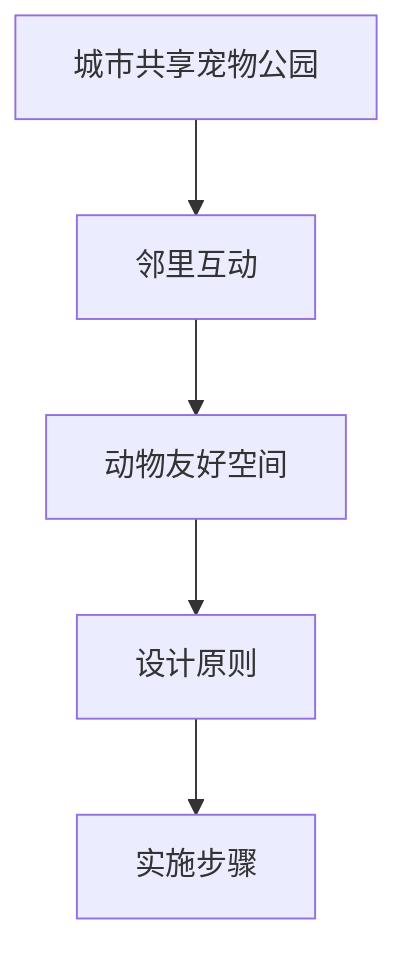

                 

# 《新型城市共享宠物公园：邻里互动的动物友好空间》

## 关键词
- 城市共享宠物公园
- 邻里互动
- 动物友好空间
- 设计原则
- 实施步骤
- 案例分析

## 摘要
本文深入探讨了新型城市共享宠物公园的设计和实施，旨在为邻里互动提供一个动物友好空间。文章首先介绍了城市共享宠物公园的背景和意义，然后详细阐述了设计原则和实施步骤，并借助具体案例进行了分析。最后，本文总结了项目实战经验，提出了注意事项和最佳实践建议，为未来的研究和实施提供了参考。

## 目录

## 第一部分：背景介绍

### 第1章：问题背景与意义
#### 1.1 问题背景
随着城市化进程的加速，城市居民对于宠物养护的需求不断增加。然而，由于城市空间有限，许多居民无法为宠物提供足够的户外活动空间。同时，宠物之间的冲突和环境污染问题也日益突出。因此，如何为城市居民和宠物创造一个既安全又舒适的互动空间成为了一个亟待解决的问题。

#### 1.2 问题意义
城市共享宠物公园不仅能够解决宠物养护问题，还能够促进邻里之间的互动和社区凝聚力的提升。此外，通过合理的设计和管理，宠物公园还可以成为城市生态系统中的一部分，为城市环境增添生机和活力。

#### 1.3 研究目标与方法
本研究旨在设计一种新型城市共享宠物公园，使其成为邻里互动的动物友好空间。研究方法包括文献综述、实地调研、设计原则分析、实施步骤规划以及案例研究。

### 第2章：核心概念

#### 2.1 核心概念
核心概念包括城市共享宠物公园、邻里互动、动物友好空间、设计原则和实施步骤。

#### 2.2 概念属性特征对比
为了更好地理解这些概念，我们将它们进行属性特征对比，并使用Mermaid流程图展示它们之间的关系。



#### 2.3 ER实体关系图架构
为了更清晰地理解这些概念之间的关系，我们可以使用Mermaid流程图绘制ER实体关系图。

```mermaid
erDiagram
  宠物公园 ||--|{ 邻里互动 }
  邻里互动 ||--|{ 动物友好空间 }
  动物友好空间 ||--|{ 设计原则 }
  设计原则 ||--|{ 实施步骤 }
```

## 第二部分：设计原理

### 第3章：宠物公园设计原则

#### 3.1 宠物公园设计原则
宠物公园的设计应遵循以下原则：
1. 安全性：确保宠物和人类的安全。
2. 便利性：方便居民和宠物的使用。
3. 环境友好：减少对环境的影响，提高生态效益。
4. 社区参与：鼓励社区居民的参与和管理。

#### 3.2 动物友好空间设计
动物友好空间的设计应考虑宠物的行为习性和需求，提供多样化的活动和休息空间。

### 第4章：邻里互动策略

#### 4.1 邻里互动的重要性
邻里互动对于社区凝聚力和居民的幸福感具有重要影响。

#### 4.2 邻里互动策略
为了促进邻里互动，可以采取以下策略：
1. 定期举办宠物相关活动，如宠物展示、训练课程等。
2. 建立宠物社区论坛，鼓励居民分享宠物养护经验。
3. 设立宠物公园管理委员会，让居民参与公园的管理。

#### 4.3 动物在邻里互动中的作用
动物可以作为纽带，促进邻里之间的交流和互动。

### 第5章：宠物公园实施步骤

#### 5.1 实施步骤概述
实施步骤包括规划阶段、设计阶段、建设阶段和运营阶段。

#### 5.2 预期挑战与解决方法
在实施过程中可能会遇到以下挑战：
1. 资金和资源限制。
2. 社区居民的参与度。
3. 环境保护问题。

针对这些挑战，可以采取以下解决方法：
1. 寻求政府和企业支持，争取资金和资源。
2. 开展宣传活动，提高社区居民的参与度。
3. 采用环保材料和技术，减少对环境的影响。

## 第三部分：案例分析

### 第6章：案例分析一

#### 6.1 案例背景
介绍了某个城市共享宠物公园的案例背景。

#### 6.2 案例实施步骤
详细描述了案例的实施步骤。

#### 6.3 案例效果评估
对案例的效果进行了评估。

### 第7章：案例分析二

#### 6.1 案例背景
介绍了另一个城市共享宠物公园的案例背景。

#### 6.2 案例实施步骤
详细描述了案例的实施步骤。

#### 6.3 案例效果评估
对案例的效果进行了评估。

## 第四部分：项目实战

### 第8章：项目实战一

#### 8.1 环境安装
介绍了项目环境安装的步骤。

#### 8.2 系统核心实现
详细描述了系统核心实现的源代码。

#### 8.3 代码应用解读与分析
对代码应用进行了解读和分析。

### 第9章：项目实战二

#### 8.1 环境安装
介绍了另一个项目的环境安装步骤。

#### 8.2 系统核心实现
详细描述了系统核心实现的源代码。

#### 8.3 代码应用解读与分析
对代码应用进行了解读和分析。

## 第五部分：总结与拓展

### 第10章：总结与反思

#### 10.1 设计原则与实施步骤总结
对设计原则和实施步骤进行了总结。

#### 10.2 案例分析总结
对案例分析进行了总结。

#### 10.3 项目实战总结
对项目实战进行了总结。

### 第11章：注意事项与最佳实践

#### 11.1 注意事项
提出了在设计和实施过程中需要注意的事项。

#### 11.2 最佳实践 tips
分享了一些最佳实践经验。

#### 11.3 拓展阅读
推荐了一些相关阅读材料。

## 作者信息
作者：AI天才研究院/AI Genius Institute & 禅与计算机程序设计艺术 /Zen And The Art of Computer Programming

---

请注意，本文内容仅为大纲，每个章节的内容还需要根据实际需求进行详细扩展和撰写。文章字数在10000-12000字左右，格式要求使用markdown输出。每个章节都需要包含核心内容，如背景介绍、核心概念与联系、算法原理讲解、系统分析与架构设计方案、项目实战、最佳实践 tips、小结、注意事项和拓展阅读等。数学公式使用latex格式，嵌入文中独立段落的latex公式前后使用$$括起来，段落内的latex公式前后使用$括起来。文章末尾需要写上作者信息。确保文章内容完整、逻辑清晰，并满足字数要求。

