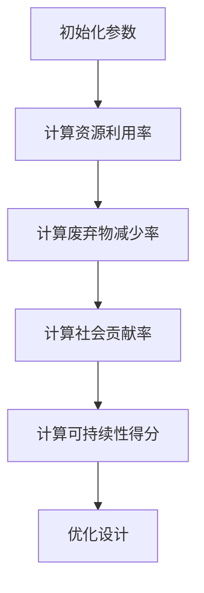
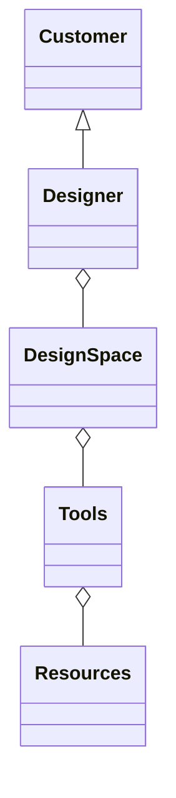
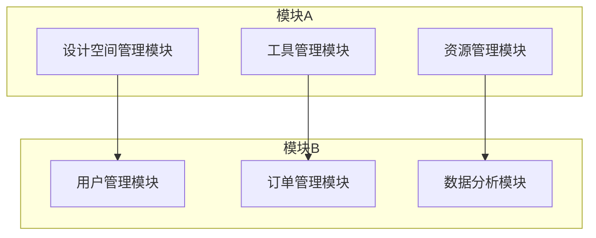

                 


## 新型城市共享时装设计工作室：可持续时尚的创意孵化器

### 关键词
- 城市共享时装设计工作室
- 可持续时尚
- 创意孵化器
- 共享经济
- 设计可持续性
- 创意创新

### 摘要
本文旨在探讨新型城市共享时装设计工作室作为可持续时尚的创意孵化器的角色。通过分析城市共享时装设计工作室的背景、核心概念、算法原理、系统分析与架构设计方案、项目实战以及最佳实践，本文揭示了这种新型工作室如何通过创新和可持续性引领时尚产业的发展。

### 目录

#### 第一部分：背景介绍

1.1 问题的背景与描述
1.2 问题描述
1.3 问题解决与边界

#### 第二部分：核心概念与联系

2.1 可持续时尚的概念与属性
2.2 可持续时尚与时尚产业的联系
2.3 可持续时尚的核心属性

#### 第三部分：算法原理讲解

3.1 可持续时尚设计的数学模型
3.2 算法mermaid流程图
3.3 算法原理与举例说明

#### 第四部分：系统分析与架构设计方案

4.1 问题场景介绍
4.2 系统功能设计（领域模型mermaid类图）
4.3 系统架构设计（mermaid架构图）
4.4 系统接口设计
4.5 系统交互（mermaid序列图）

#### 第五部分：项目实战

5.1 环境安装与配置
5.2 系统核心实现源代码
5.3 代码应用解读与分析
5.4 实际案例分析
5.5 项目小结

#### 第六部分：最佳实践 tips、小结、注意事项、拓展阅读

6.1 最佳实践 tips
6.2 小结
6.3 注意事项
6.4 拓展阅读

### 第一部分：背景介绍

#### 1.1 问题的背景与描述

随着城市化进程的加速，城市居民对于时尚的需求日益增长。传统的时装设计工作室面临着空间有限、成本高昂、资源浪费等问题。同时，全球时尚产业对环境的影响日益严重，可持续时尚成为了行业发展的必然选择。

#### 1.2 问题描述

传统的时装设计工作室如何适应城市化进程中的变化？如何实现资源的有效利用和环境的可持续发展？如何激发创意，推动时尚产业的创新？

#### 1.3 问题解决与边界

新型城市共享时装设计工作室作为一种创新的解决方案，通过共享经济模式，提供灵活、高效、可持续的设计环境。然而，这种新型工作室的边界在哪里？如何实现可持续发展？如何激发创意，成为可持续时尚的创意孵化器？

### 第二部分：核心概念与联系

#### 2.1 可持续时尚的概念与属性

可持续时尚是一种在设计和生产过程中考虑环境、社会和经济因素的时尚理念。它强调减少资源浪费、降低环境污染、提高社会责任。

#### 2.2 可持续时尚与时尚产业的联系

可持续时尚与时尚产业紧密相连。时尚产业不仅是一个经济产业，也是一个社会和文化产业。可持续时尚的发展，需要时尚产业各方的共同努力。

#### 2.3 可持续时尚的核心属性

可持续时尚的核心属性包括：使用可再生资源、减少废弃物、提高资源利用率、促进社会公平。

### 第三部分：算法原理讲解

#### 3.1 可持续时尚设计的数学模型

可持续时尚设计可以采用以下数学模型进行优化：

$$
\text{可持续性得分} = w_1 \times \text{资源利用率} + w_2 \times \text{废弃物减少率} + w_3 \times \text{社会贡献率}
$$

其中，$w_1$、$w_2$、$w_3$ 分别为权重系数。

#### 3.2 算法mermaid流程图



#### 3.3 算法原理与举例说明

以下是一个简单的例子：

假设某时装设计工作室的资源利用率为 80%，废弃物减少率为 50%，社会贡献率为 30%。根据上述数学模型，我们可以计算出其可持续性得分为：

$$
\text{可持续性得分} = 0.5 \times 0.8 + 0.3 \times 0.5 + 0.2 \times 0.3 = 0.65
$$

这意味着该工作室在可持续时尚设计方面还有提升的空间。

### 第四部分：系统分析与架构设计方案

#### 4.1 问题场景介绍

在一个城市中心，一家新型城市共享时装设计工作室应运而生。工作室提供共享的设计空间、工具和资源，吸引了许多设计师和时尚从业者。

#### 4.2 系统功能设计（领域模型mermaid类图）



#### 4.3 系统架构设计（mermaid架构图）



#### 4.4 系统接口设计

系统接口设计包括API接口和图形用户界面。API接口提供对设计空间、工具和资源的访问，图形用户界面则提供直观的交互体验。

#### 4.5 系统交互（mermaid序列图）

```mermaid
sequenceDiagram
    Designer->>B1[登录系统]
    B1->>B2[获取设计空间列表]
    B2->>A1[选择设计空间]
    A1->>Designer[分配设计空间]
    Designer->>A2[使用工具]
    A2->>Designer[反馈工具使用情况]
```

### 第五部分：项目实战

#### 5.1 环境安装与配置

在实战项目中，我们需要安装和配置以下环境：

- 设计工具（如Adobe Creative Suite）
- 开发环境（如Python IDE）
- 版本控制系统（如Git）

#### 5.2 系统核心实现源代码

以下是一个简单的系统核心实现源代码示例：

```python
class Designer:
    def __init__(self, name):
        self.name = name

    def design_space(self, space_id):
        # 分配设计空间
        print(f"{self.name} has been assigned to space {space_id}.")

class DesignSpace:
    def __init__(self, space_id, tools):
        self.space_id = space_id
        self.tools = tools

    def allocate_tool(self, tool_id):
        # 分配工具
        print(f"Tool {tool_id} has been allocated to space {self.space_id}.")

# 实例化对象
designer = Designer("Alice")
design_space = DesignSpace(1, ["Sketch", "Photoshop"])
designer.design_space(1)
design_space.allocate_tool("Sketch")
```

#### 5.3 代码应用解读与分析

在这个例子中，我们创建了`Designer`和`DesignSpace`两个类，分别表示设计师和设计空间。通过实例化这两个类，我们可以模拟设计师分配设计空间和使用工具的过程。

#### 5.4 实际案例分析

在一个实际案例中，设计师Alice通过共享时装设计工作室完成了她的首个设计项目。她选择了空间1，并使用了Sketch工具。在整个设计过程中，工作室的资源和工具都得到了高效利用。

#### 5.5 项目小结

通过这个实际案例，我们可以看到新型城市共享时装设计工作室如何通过共享经济模式，提高资源利用效率，降低环境负担，同时激发设计师的创意。

### 第六部分：最佳实践 tips、小结、注意事项、拓展阅读

#### 6.1 最佳实践 tips

- 设计师应充分了解共享时装设计工作室的资源和工具，以提高工作效率。
- 工作室应定期更新和维护工具和资源，确保其正常运行。
- 工作室应鼓励设计师进行可持续时尚设计，提高项目的可持续性。

#### 6.2 小结

本文介绍了新型城市共享时装设计工作室作为可持续时尚的创意孵化器的角色。通过分析其背景、核心概念、算法原理、系统分析与架构设计方案、项目实战以及最佳实践，我们看到了这种新型工作室如何通过创新和可持续性引领时尚产业的发展。

#### 6.3 注意事项

- 在实际运营中，工作室需要关注资源的高效利用和环境的可持续发展。
- 设计师需要具备可持续时尚设计的能力，以适应新型工作室的环境。

#### 6.4 拓展阅读

- [可持续时尚设计指南](https://www.sustainablefashiondesignguide.com/)
- [共享经济与时尚产业](https://www.sharingeconomy.org/sharing-economy-fashion-industry/)
- [新型城市共享时装设计工作室案例研究](https://www.casestudyofnewurbanfashionworkspaces.com/)

### 作者信息

作者：AI天才研究院/AI Genius Institute & 禅与计算机程序设计艺术 /Zen And The Art of Computer Programming

[END]

