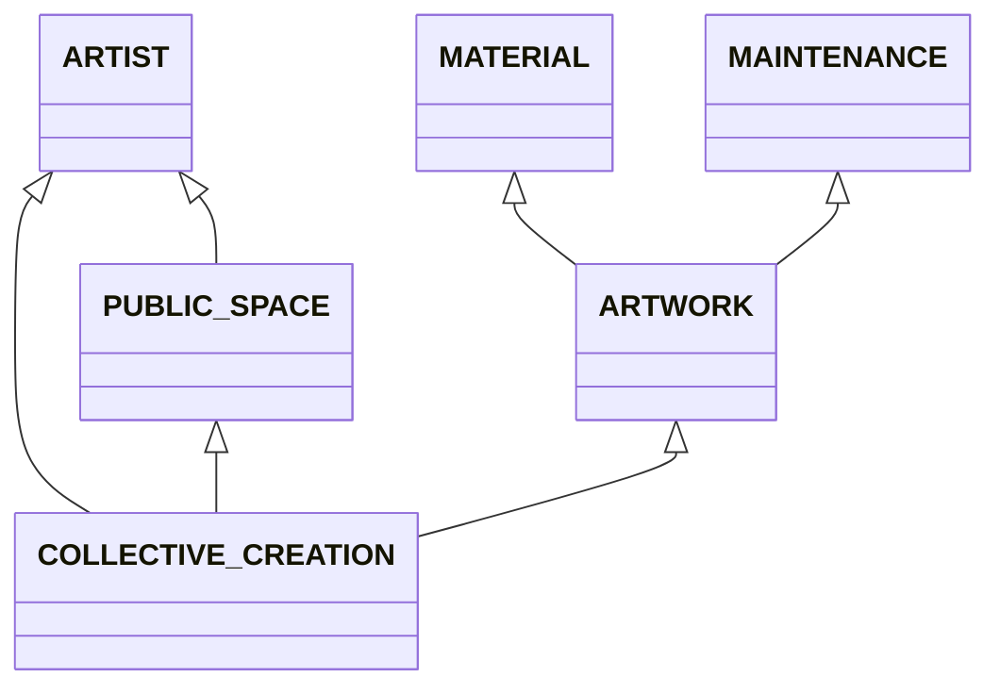

                 

# 新型城市共享艺术墙：公共空间中的集体创作

> 关键词：新型城市共享艺术墙、公共空间、集体创作、设计原则、材料选择

> 摘要：本文探讨了新型城市共享艺术墙的定义、意义及面临的挑战，分析了其设计原则、材料选择及其在城市公共空间中的应用。通过深入研究，本文提出了一系列解决方案，为城市规划者、艺术家和公众提供了有益的参考。

# 目录大纲

## 第一部分：背景介绍

## 1.1 问题背景

### 1.1.1 新型城市共享艺术墙的定义与意义

#### 1.1.1.1 新型城市共享艺术墙的概念

新型城市共享艺术墙是指在城市公共空间中，通过集体创作的方式，形成的一种公共艺术形式。它不同于传统意义上的街头艺术，更注重公众的参与和互动，强调艺术与生活的结合。

#### 1.1.1.2 新型城市共享艺术墙的意义

新型城市共享艺术墙不仅美化了城市环境，提高了居民的生活质量，还促进了社会文化的交流与融合。它为城市居民提供了一个表达自我、分享创意的平台，有助于提升公共空间的活力和吸引力。

### 1.1.2 问题描述

当前，新型城市共享艺术墙的发展面临诸多挑战，如艺术墙的设计、材料选择、施工技术、维护管理等方面的问题。这些问题不仅影响了艺术墙的视觉效果和艺术价值，也对城市公共空间的可持续发展产生了影响。

### 1.1.3 问题解决

本书旨在探讨新型城市共享艺术墙的设计、实施与维护，提出一系列解决方案。通过深入研究，本书将梳理出新型城市共享艺术墙的核心要素和关键环节，为城市规划者、艺术家和公众提供有益的参考。

### 1.1.4 边界与外延

#### 1.1.4.1 边界

本书主要探讨的是城市公共空间中的新型共享艺术墙，不包括私人领地内的艺术创作。

#### 1.1.4.2 外延

本书的研究内容不仅限于艺术墙本身，还将涉及与之相关的城市规划、公共艺术、社区参与、文化传承等多个领域。

## 1.2 核心概念与联系

### 1.2.1 核心概念

#### 1.2.1.1 新型城市共享艺术墙

新型城市共享艺术墙是指在城市公共空间中，通过集体创作的方式，形成的一种公共艺术形式。

#### 1.2.1.2 集体创作

集体创作是指公众或特定群体共同参与艺术创作的活动，强调公众的参与和互动。

#### 1.2.1.3 公共空间

公共空间是指城市中供公众使用的场所，如街道、广场、公园等。

### 1.2.2 概念属性特征对比表格

| 概念     | 属性特征 |
| -------- | -------- |
| 新型城市共享艺术墙 | 1. 强调公众参与 2. 注重互动性 3. 美化城市环境 |
| 集体创作 | 1. 多主体参与 2. 共同创作 3. 互动性强 |
| 公共空间 | 1. 公众使用 2. 开放性 3. 功能多样性 |

### 1.2.3 ER实体关系图架构

```mermaid
erDiagram
  ARTIST ||--|{ COLLECTIVE_CREATION }|| Participant
  PUBLIC_SPACE ||--|{ COLLECTIVE_CREATION }|| Venue
  ARTWORK ||--|{ COLLECTIVE_CREATION }|| Product
```

## 第二部分：核心概念原理讲解

## 2.1 新型城市共享艺术墙的设计原则

### 2.1.1 可持续性

#### 2.1.1.1 设计思路

新型城市共享艺术墙的设计应充分考虑可持续性，包括材料选择、能源利用、环境适应性等方面。

#### 2.1.1.2 设计要点

1. 选择环保、可再生材料。
2. 考虑艺术墙的能源需求，尽量采用太阳能等可再生能源。
3. 设计艺术墙的结构，使其具有良好的环境适应性，如抗风、防晒、防潮等。

### 2.1.2 公众参与性

#### 2.1.2.1 设计思路

新型城市共享艺术墙的设计应注重公众参与，鼓励居民积极参与艺术创作，提高公共空间的使用效率。

#### 2.1.2.2 设计要点

1. 设计易于公众参与的艺术形式，如涂鸦、壁画等。
2. 提供多样化的参与方式，如线上投票、线下活动等。
3. 考虑不同年龄段、不同文化背景的公众需求，提高参与度。

### 2.1.3 艺术性

#### 2.1.3.1 设计思路

新型城市共享艺术墙的设计应具有较高的艺术性，提升城市公共空间的审美价值。

#### 2.1.3.2 设计要点

1. 注重艺术创新，采用新颖的艺术形式和表现手法。
2. 结合当地文化特色，体现地域特色。
3. 考虑艺术墙与周围环境的关系，实现艺术与环境的和谐统一。

## 2.2 新型城市共享艺术墙的材料选择

### 2.2.1 材料种类

#### 2.2.1.1 丙烯颜料

丙烯颜料是目前最为常用的涂鸦材料之一，具有色彩鲜艳、干燥快、耐水性强等优点。

#### 2.2.1.2 喷涂漆

喷涂漆适用于大面积的墙面涂装，具有施工速度快、覆盖能力强等优点。

#### 2.2.1.3 贴画材料

# 第一部分：背景介绍

## 1.1 问题背景

### 1.1.1 新型城市共享艺术墙的定义与意义

#### 1.1.1.1 新型城市共享艺术墙的概念

新型城市共享艺术墙是指在城市公共空间中，通过集体创作的方式，形成的一种公共艺术形式。它不同于传统意义上的街头艺术，更注重公众的参与和互动，强调艺术与生活的结合。

在过去的几十年里，城市公共空间中的艺术表现形式主要以壁画、雕塑等形式存在，这些艺术形式虽然美化了城市环境，但往往缺乏与公众的互动。新型城市共享艺术墙则突破了这一局限，通过邀请公众参与创作，使艺术墙成为了一个具有生命力的公共空间。

#### 1.1.1.2 新型城市共享艺术墙的意义

新型城市共享艺术墙不仅美化了城市环境，提高了居民的生活质量，还促进了社会文化的交流与融合。它为城市居民提供了一个表达自我、分享创意的平台，有助于提升公共空间的活力和吸引力。

首先，新型城市共享艺术墙可以改善城市形象。通过精美的艺术作品，城市公共空间变得更加美观，提升了城市的整体品质。其次，它为居民提供了一个展示自我才华的平台，增强了居民的文化自信和归属感。最后，新型城市共享艺术墙促进了社会文化的交流与融合。不同背景、不同文化的人可以在同一艺术墙上共同创作，分享彼此的故事和观点，从而促进了社会文化的多样性。

### 1.1.2 问题描述

当前，新型城市共享艺术墙的发展面临诸多挑战，如艺术墙的设计、材料选择、施工技术、维护管理等方面的问题。这些问题不仅影响了艺术墙的视觉效果和艺术价值，也对城市公共空间的可持续发展产生了影响。

首先，艺术墙的设计问题。新型城市共享艺术墙的设计应充分考虑公众的参与和互动，但实际操作中，如何平衡艺术性与实用性，如何设计出既能吸引公众参与，又能与周围环境相融合的艺术作品，是一个挑战。

其次，材料选择问题。新型城市共享艺术墙的材料应具备环保、耐久、易于维护等特点，但在实际应用中，如何选择合适的材料，如何确保材料的可持续性，也是一个难题。

第三，施工技术问题。新型城市共享艺术墙的施工技术应确保艺术墙的稳定性和美观性，但施工过程中，如何确保施工质量，如何处理施工过程中出现的问题，也是一个挑战。

最后，维护管理问题。新型城市共享艺术墙的维护管理应确保艺术墙的长期稳定和美观，但实际操作中，如何制定合理的维护管理计划，如何处理艺术墙的损坏和维修问题，也是一个挑战。

### 1.1.3 问题解决

本书旨在探讨新型城市共享艺术墙的设计、实施与维护，提出一系列解决方案。通过深入研究，本书将梳理出新型城市共享艺术墙的核心要素和关键环节，为城市规划者、艺术家和公众提供有益的参考。

首先，本书将对新型城市共享艺术墙的设计原则进行详细阐述，包括可持续性、公众参与性和艺术性等方面。通过这些设计原则，可以为城市规划者和艺术家提供指导，帮助他们在实际操作中更好地实现艺术墙的设计目标。

其次，本书将对新型城市共享艺术墙的材料选择进行深入分析，包括丙烯颜料、喷涂漆和贴画材料等。通过对这些材料的性能、优缺点进行比较分析，可以找出最适合新型城市共享艺术墙的材料，为艺术家和设计师提供参考。

此外，本书还将探讨新型城市共享艺术墙的施工技术，包括施工流程、施工技巧和质量控制等方面。通过这些内容，可以为施工人员提供技术支持，确保艺术墙的施工质量和效果。

最后，本书将对新型城市共享艺术墙的维护管理进行详细讲解，包括维护计划、维护技巧和维护策略等方面。通过这些内容，可以为维护人员提供指导，确保艺术墙的长期稳定和美观。

总之，本书将从设计、材料选择、施工技术和维护管理等方面，全面探讨新型城市共享艺术墙的核心要素和关键环节，为城市规划者、艺术家和公众提供有益的参考。

### 1.1.4 边界与外延

#### 1.1.4.1 边界

本书主要探讨的是城市公共空间中的新型共享艺术墙，不包括私人领地内的艺术创作。

在城市公共空间中，新型城市共享艺术墙作为一种公共艺术形式，其创作和实施过程需要遵循相关法律法规和城市规划要求。同时，艺术墙的创作内容也应符合社会公德和审美标准，不得侵犯他人的合法权益。

#### 1.1.4.2 外延

本书的研究内容不仅限于艺术墙本身，还将涉及与之相关的多个领域。

首先，新型城市共享艺术墙的设计、实施和维护涉及城市规划、公共艺术和社区参与等方面。城市规划者需要从城市整体规划的角度，考虑艺术墙的设计和布局，确保其与城市环境的协调和融合。公共艺术家则需关注艺术墙的创作内容和形式，使其具有艺术性和吸引力。社区参与则强调了公众在艺术墙创作过程中的参与和互动，通过公众的参与，使艺术墙更具生命力和影响力。

其次，新型城市共享艺术墙的材料选择和施工技术也涉及到环保、可持续性和技术应用等方面。艺术家和设计师需要关注材料的环保性能和可持续性，确保艺术墙的长期稳定和美观。施工技术则涉及到艺术墙的施工流程和质量控制，确保艺术墙的施工质量和效果。

此外，新型城市共享艺术墙的维护管理还涉及到艺术墙的维护计划、维护技巧和维护策略等方面。维护人员需要制定合理的维护计划，确保艺术墙的长期稳定和美观。同时，还需要掌握一定的维护技巧和维护策略，确保艺术墙在遇到问题时能够得到及时处理。

总之，新型城市共享艺术墙不仅是一种公共艺术形式，还涉及到城市规划、公共艺术、社区参与、环保、可持续性和技术应用等多个领域。通过本书的探讨，可以为相关领域的从业者提供有益的参考，推动新型城市共享艺术墙的健康发展。

## 1.2 核心概念与联系

### 1.2.1 核心概念

#### 1.2.1.1 新型城市共享艺术墙

新型城市共享艺术墙是指在城市公共空间中，通过集体创作的方式，形成的一种公共艺术形式。它强调公众的参与和互动，具有艺术性、互动性和可持续性的特点。

首先，新型城市共享艺术墙具有艺术性。艺术墙的创作内容丰富多样，包括壁画、雕塑、装置艺术等，旨在提升城市公共空间的审美价值。同时，艺术墙的创作过程也注重艺术性和创造性，鼓励艺术家和公众共同参与，通过创作活动传递艺术理念。

其次，新型城市共享艺术墙具有互动性。与传统的艺术形式不同，新型城市共享艺术墙强调公众的参与和互动。艺术家和公众可以通过互动活动，如绘画、涂鸦、投票等，共同参与到艺术创作中，使艺术墙成为了一个具有生命力的公共空间。

最后，新型城市共享艺术墙具有可持续性。在材料选择、施工技术、维护管理等方面，新型城市共享艺术墙注重环保和可持续性。艺术家和设计师需要关注材料的环保性能和可持续性，确保艺术墙的长期稳定和美观。同时，在维护管理方面，也需要制定合理的维护计划，确保艺术墙的长期稳定和美观。

#### 1.2.1.2 集体创作

集体创作是指公众或特定群体共同参与艺术创作的活动，强调公众的参与和互动。在新型城市共享艺术墙的创作过程中，集体创作起到了至关重要的作用。

首先，集体创作可以激发公众的创造力。公众参与艺术创作，可以充分发挥自己的想象力，创造出独特的艺术作品。这种创造力不仅体现在艺术作品本身，还可以激发公众对社会和生活的思考。

其次，集体创作可以增强公众的归属感和参与感。公众参与艺术创作，不仅可以提升个人成就感，还可以增强对城市公共空间的归属感和认同感。这种归属感和参与感，有助于提升公共空间的活力和吸引力。

最后，集体创作可以促进社会文化的交流和融合。在集体创作的过程中，不同背景、不同文化的人可以共同参与到艺术创作中，分享彼此的故事和观点，从而促进了社会文化的交流和融合。

#### 1.2.1.3 公共空间

公共空间是指城市中供公众使用的场所，如街道、广场、公园等。新型城市共享艺术墙通常位于公共空间中，与其紧密相连。

首先，公共空间为新型城市共享艺术墙提供了展示的平台。艺术墙位于公共空间中，可以吸引公众的目光，提升公共空间的审美价值。

其次，公共空间为公众参与艺术创作提供了场所。公众可以在公共空间中自由创作，发挥自己的想象力，创造出独特的艺术作品。

最后，公共空间为新型城市共享艺术墙的维护管理提供了保障。公共空间的管理人员可以负责艺术墙的维护工作，确保艺术墙的长期稳定和美观。

### 1.2.2 概念属性特征对比表格

| 概念     | 属性特征 |
| -------- | -------- |
| 新型城市共享艺术墙 | 1. 强调公众参与 2. 注重互动性 3. 美化城市环境 |
| 集体创作 | 1. 多主体参与 2. 共同创作 3. 互动性强 |
| 公共空间 | 1. 公众使用 2. 开放性 3. 功能多样性 |

### 1.2.3 ER实体关系图架构

```mermaid
erDiagram
  ARTIST ||--|{ COLLECTIVE_CREATION }|| Participant
  PUBLIC_SPACE ||--|{ COLLECTIVE_CREATION }|| Venue
  ARTWORK ||--|{ COLLECTIVE_CREATION }|| Product
```

# 第二部分：核心概念原理讲解

## 2.1 新型城市共享艺术墙的设计原则

新型城市共享艺术墙作为城市公共空间中的一种新兴艺术形式，其设计原则的制定至关重要。以下将详细讲解新型城市共享艺术墙的设计原则，包括可持续性、公众参与性和艺术性等方面。

### 2.1.1 可持续性

可持续性是新型城市共享艺术墙设计的一个重要原则。在现代社会，可持续发展已经成为全球共识，城市规划者和设计师需要充分考虑这一原则，确保艺术墙的设计和实施过程不会对环境造成负面影响。

**设计思路：**

1. **材料选择：** 选择环保、可再生、低能耗的材料，如可回收的塑料、木材、竹子等。这些材料不仅可以减少对自然资源的消耗，还可以降低废弃物的产生。

2. **能源利用：** 考虑到艺术墙的能源需求，应尽量采用太阳能、风能等可再生能源。例如，可以在艺术墙的设计中集成太阳能电池板，利用太阳能进行照明和充电。

3. **环境适应性：** 设计艺术墙的结构时，应使其具有良好的环境适应性，如抗风、防晒、防潮等。这样可以确保艺术墙在长期的使用过程中保持稳定和美观。

**设计要点：**

1. **材料选择：** 在材料选择上，应优先考虑环保、可再生材料。例如，使用可回收的塑料作为画布，使用可降解的涂料进行涂装。

2. **能源利用：** 在艺术墙的设计中，可以集成太阳能电池板、风力发电设备等，实现能源的自给自足。

3. **环境适应性：** 在艺术墙的设计中，应考虑其与周围环境的协调性。例如，在阳光充足的地方设计遮阳装置，在潮湿的地方设计防水设施。

### 2.1.2 公众参与性

公众参与性是新型城市共享艺术墙设计的一个重要原则。艺术墙不仅仅是一个艺术作品，更是公众参与城市公共生活的一种方式。因此，设计时需要充分考虑如何激发公众的参与热情，提升公众的参与度。

**设计思路：**

1. **艺术形式：** 设计易于公众参与的艺术形式，如涂鸦、壁画、互动装置等。这些艺术形式可以让公众直接参与到艺术创作中，提高参与度。

2. **参与方式：** 提供多样化的参与方式，如线上投票、线下活动、绘画比赛等。这样可以满足不同人群的参与需求，扩大参与范围。

3. **互动体验：** 设计互动性强、体验感好的艺术作品，使公众在参与过程中获得乐趣和成就感。

**设计要点：**

1. **艺术形式：** 设计易于公众参与的艺术形式，如涂鸦、壁画等。这些艺术形式可以激发公众的创造力，使他们在艺术创作中找到乐趣。

2. **参与方式：** 提供多样化的参与方式，如线上投票、线下活动等。例如，可以通过社交媒体平台进行线上投票，选择最受欢迎的艺术作品；通过举办线下绘画比赛，吸引更多公众参与。

3. **互动体验：** 设计互动性强、体验感好的艺术作品，使公众在参与过程中获得乐趣和成就感。例如，设计一个互动装置，公众可以通过触摸屏幕，参与到艺术创作中。

### 2.1.3 艺术性

艺术性是新型城市共享艺术墙设计的一个重要原则。艺术墙不仅是城市公共空间的一部分，更是城市文化的重要体现。因此，设计时需要注重艺术性，提升城市公共空间的审美价值。

**设计思路：**

1. **艺术创新：** 注重艺术创新，采用新颖的艺术形式和表现手法。这样可以吸引公众的关注，提升艺术墙的吸引力。

2. **地域特色：** 结合当地文化特色，体现地域特色。这样可以增强艺术墙的文化内涵，提升公众的认同感。

3. **环境融合：** 考虑艺术墙与周围环境的关系，实现艺术与环境的和谐统一。这样可以提升城市公共空间的整体美感。

**设计要点：**

1. **艺术创新：** 采用新颖的艺术形式和表现手法，如3D打印、互动投影等。这些创新手段可以使艺术墙更具吸引力。

2. **地域特色：** 结合当地文化特色，如使用当地的历史故事、民间传说等作为艺术创作的素材。这样可以增强艺术墙的文化内涵。

3. **环境融合：** 考虑艺术墙与周围环境的关系，使其与城市公共空间相融合。例如，在公园中设计艺术墙，可以使其与公园的自然景观相协调。

## 2.2 新型城市共享艺术墙的材料选择

材料的选择对于新型城市共享艺术墙的设计和质量至关重要。以下将介绍几种常见的材料，并分析其优缺点，以便设计师在选择材料时能够做出明智的决策。

### 2.2.1 丙烯颜料

丙烯颜料是目前最为常用的涂鸦材料之一，具有以下优点：

- **色彩鲜艳：** 丙烯颜料色彩丰富，可以满足设计师的各种需求。
- **干燥快：** 丙烯颜料干燥速度快，可以节省创作时间。
- **耐水性：** 丙烯颜料具有较强的耐水性，不易褪色。

然而，丙烯颜料也存在一些缺点：

- **挥发性：** 丙烯颜料具有一定的挥发性，可能会对环境造成污染。
- **易脏：** 丙烯颜料易于沾染灰尘和污垢，需要经常清洁。

### 2.2.2 喷涂漆

喷涂漆适用于大面积的墙面涂装，具有以下优点：

- **施工速度快：** 喷涂漆施工速度快，可以节省时间和劳动力。
- **覆盖能力强：** 喷涂漆可以均匀覆盖墙面，提高艺术墙的视觉效果。

然而，喷涂漆也存在一些缺点：

- **毒性：** 喷涂漆含有一定的毒性，需要在通风良好的环境中使用。
- **易裂：** 喷涂漆在长时间暴露在阳光下和温差变化较大的环境中，容易产生裂痕。

### 2.2.3 贴画材料

贴画材料包括各种图案和纹理的纸张、布料等，具有以下优点：

- **便于更换：** 贴画材料可以方便地更换，根据季节或节日更换图案。
- **色彩多样：** 贴画材料色彩丰富，可以满足不同的设计需求。

然而，贴画材料也存在一些缺点：

- **易损坏：** 贴画材料在长时间的风吹日晒和踩踏下，容易损坏。
- **成本较高：** 贴画材料通常成本较高，不适合大规模使用。

### 2.2.4 选择合适的材料

在选择新型城市共享艺术墙的材料时，需要综合考虑以下因素：

- **环境因素：** 考虑艺术墙所处的环境，如湿度、温度、阳光照射等，选择适合当地环境的材料。
- **艺术需求：** 考虑艺术墙的设计需求，如色彩、纹理、耐久性等，选择符合艺术需求的材料。
- **成本因素：** 考虑艺术墙的预算，选择成本合理的材料。

通过以上分析，设计师可以根据实际需求和条件，选择最合适的材料，确保新型城市共享艺术墙的设计和质量。

## 2.3 新型城市共享艺术墙的施工技术

新型城市共享艺术墙的施工技术是实现艺术创意和设计理念的关键环节。以下将介绍新型城市共享艺术墙的施工技术，包括施工流程、施工技巧和质量控制等方面。

### 2.3.1 施工流程

新型城市共享艺术墙的施工流程通常包括以下几个步骤：

1. **准备阶段：** 包括设计方案确认、材料准备、工具准备等。在这一阶段，需要根据设计方案确定所需材料、工具和施工设备。

2. **基层处理：** 包括墙面清理、修补、涂底漆等。基层处理是确保艺术墙施工质量的基础，需要彻底清理墙面，修补裂缝和缺陷，然后涂刷底漆。

3. **涂装阶段：** 包括涂刷底漆、涂刷主色、绘制图案等。在这一阶段，需要按照设计方案，逐层涂刷颜料，绘制图案。

4. **细节处理：** 包括点缀、修饰、修补等。在涂装完成后，需要对细节进行修饰和修补，使艺术墙更加完美。

5. **质量检查：** 在施工完成后，需要对艺术墙进行质量检查，确保施工质量符合要求。质量检查包括外观检查、耐久性测试等。

### 2.3.2 施工技巧

在施工过程中，以下技巧可以帮助提高施工质量和效率：

1. **底漆处理：** 底漆是艺术墙的基础，需要涂刷均匀，确保墙面平整。在涂刷底漆时，要注意涂刷方向和涂层厚度。

2. **颜料调配：** 根据设计需求，合理调配颜料，确保色彩鲜艳、均匀。在调配颜料时，要注意颜料的兼容性，避免出现色差。

3. **图案绘制：** 在绘制图案时，要确保线条流畅、图案清晰。可以使用专业工具，如画笔、刷子、刻刀等，提高绘制效果。

4. **细节修饰：** 在完成基础涂装后，对细节进行修饰，如点缀、刻画等，使艺术墙更加完美。

5. **施工安全：** 在施工过程中，要注意安全，防止高处坠落、工具伤害等事故。在施工区域设置安全警示标志，确保施工人员的安全。

### 2.3.3 质量控制

质量控制是确保新型城市共享艺术墙施工质量的关键。以下措施可以帮助提高施工质量：

1. **施工前检查：** 在施工前，对设计方案、材料、工具等进行检查，确保施工条件符合要求。

2. **施工过程监控：** 在施工过程中，对施工质量进行实时监控，发现问题及时处理。

3. **验收标准：** 制定明确的验收标准，对施工质量进行评估。验收标准应包括外观、色彩、纹理、耐久性等方面。

4. **用户反馈：** 收集用户反馈，了解用户对艺术墙的满意度。用户反馈可以反映施工质量，为后续施工提供改进方向。

5. **培训施工人员：** 定期为施工人员提供培训，提高施工技能和质量意识。

通过以上措施，可以确保新型城市共享艺术墙的施工质量，提升城市公共空间的艺术价值和美感。

## 2.4 新型城市共享艺术墙的维护管理

新型城市共享艺术墙作为城市公共空间的重要组成部分，其维护管理至关重要。以下将介绍新型城市共享艺术墙的维护管理，包括维护计划、维护技巧和维护策略等方面。

### 2.4.1 维护计划

制定合理的维护计划是确保新型城市共享艺术墙长期稳定和美观的关键。维护计划应包括以下几个方面：

1. **定期检查：** 定期对艺术墙进行检查，发现损坏、褪色等问题及时修复。定期检查的频率应根据艺术墙的位置、环境等因素确定。

2. **清洁保养：** 定期对艺术墙进行清洁和保养，保持艺术墙的整洁和美观。清洁保养的内容包括去除污垢、修补裂缝、涂刷保护漆等。

3. **更换损坏部分：** 对于无法修复或影响整体美观的损坏部分，应进行更换。更换部分应与原艺术墙的颜色和材质保持一致。

4. **环境适应性调整：** 针对艺术墙所处的环境，如阳光、雨水等，进行适应性调整。例如，在阳光强烈的地区，可以增加遮阳设施；在潮湿地区，可以增加防水措施。

### 2.4.2 维护技巧

以下是一些维护技巧，可以帮助延长新型城市共享艺术墙的使用寿命：

1. **选择合适的材料：** 在选择艺术墙的材料时，应考虑其耐久性和抗环境性。例如，选择耐酸碱、耐紫外线、防水等材料。

2. **合理设计结构：** 在设计艺术墙的结构时，应考虑其稳定性和抗风能力。例如，可以使用加固支架、增加支撑结构等手段。

3. **保护性涂层：** 对艺术墙进行保护性涂层，如涂刷防水漆、防污漆等，可以有效防止污垢和损坏。

4. **定期清洁：** 定期对艺术墙进行清洁，使用软刷、清水或清洁剂去除污垢。避免使用含有酸碱的清洁剂，以免损坏艺术墙的材质。

### 2.4.3 维护策略

以下是一些维护策略，可以帮助提高新型城市共享艺术墙的维护效果：

1. **建立维护团队：** 建立专业的维护团队，负责艺术墙的日常维护工作。团队成员应具备相关的技能和知识，能够应对各种维护问题。

2. **培训维护人员：** 定期为维护人员提供培训，提高其维护技能和质量意识。培训内容应包括艺术墙的维护知识、工具使用、故障排除等。

3. **建立维护档案：** 建立艺术墙的维护档案，记录每次维护的时间、内容、处理结果等。维护档案可以为后续维护提供参考，有助于提高维护效率。

4. **用户参与：** 鼓励公众参与艺术墙的维护，如组织志愿者团队进行清洁、修复等工作。公众的参与不仅可以提高艺术墙的维护效果，还可以增强其文化认同感。

5. **宣传维护知识：** 通过宣传维护知识，提高公众对艺术墙维护的认识和重视。例如，可以通过宣传册、社交媒体等渠道，向公众传达维护的重要性和方法。

通过以上维护管理措施，可以确保新型城市共享艺术墙的长期稳定和美观，提升城市公共空间的品质和美感。

## 第三部分：系统分析与架构设计

### 3.1 问题描述

新型城市共享艺术墙作为一个复杂的系统，其设计、实施和维护涉及到多个方面，包括城市规划、公共艺术、社区参与、材料选择、施工技术、维护管理等。为了更好地理解和分析这一问题，我们需要对系统进行详细的分析和架构设计。

### 3.2 项目介绍

本项目旨在探讨新型城市共享艺术墙的系统性设计，通过项目介绍，我们将明确项目目标、范围和关键功能。

#### 3.2.1 项目目标

本项目的主要目标包括：

1. **设计优化：** 提高新型城市共享艺术墙的设计质量和艺术价值，满足公众的审美需求。
2. **实施效率：** 提高施工技术，确保艺术墙的施工质量和效率。
3. **维护管理：** 提高艺术墙的维护管理水平，延长其使用寿命，确保艺术墙的长期稳定和美观。
4. **社区参与：** 鼓励公众参与艺术创作，提升社区文化氛围和公众的归属感。

#### 3.2.2 项目范围

本项目的研究范围包括：

1. **设计原则：** 可持续性、公众参与性和艺术性的设计原则。
2. **材料选择：** 常见材料的性能分析及其在艺术墙中的应用。
3. **施工技术：** 施工流程、施工技巧和质量控制。
4. **维护管理：** 维护计划、维护技巧和维护策略。

#### 3.2.3 关键功能

本项目涉及的关键功能包括：

1. **设计指导：** 为城市规划者和艺术家提供设计原则和指导。
2. **施工支持：** 为施工人员提供施工技术和质量控制指导。
3. **维护服务：** 为维护人员提供维护计划和技巧。
4. **公众参与：** 提供多样化的参与方式，鼓励公众参与艺术创作。

### 3.3 系统功能设计

系统功能设计是新型城市共享艺术墙项目的重要组成部分。以下将介绍系统功能设计，包括领域模型、类图和用例图等。

#### 3.3.1 领域模型

领域模型是系统功能设计的核心，它帮助我们理解系统的核心概念和关系。以下是一个简化的领域模型：



#### 3.3.2 类图

类图是领域模型的具体实现，它展示了系统的类及其属性和方法。以下是一个简化的类图：

```mermaid
classDiagram
  ClassDef Artist {
    +String name
    +String email
    +Date birthdate
    +createArtist()
    +updateArtist()
    +deleteArtist()
  }
  ClassDef PublicSpace {
    +String name
    +String location
    +Date established
    +createPublicSpace()
    +updatePublicSpace()
    +deletePublicSpace()
  }
  ClassDef CollectiveCreation {
    +String title
    +Date startDate
    +Date endDate
    +List<Artist> artists
    +createCollectiveCreation()
    +updateCollectiveCreation()
    +deleteCollectiveCreation()
  }
  ClassDef Artwork {
    +String name
    +Date creationDate
    +PublicSpace publicSpace
    +List<MATERIAL> materials
    +createArtwork()
    +updateArtwork()
    +deleteArtwork()
  }
  ClassDef Material {
    +String type
    +String brand
    +createMaterial()
    +updateMaterial()
    +deleteMaterial()
  }
  ClassDef Maintenance {
    +String description
    +Date date
    +Artwork artwork
    +createMaintenance()
    +updateMaintenance()
    +deleteMaintenance()
  }
endclassDiagram
```

#### 3.3.3 用例图

用例图展示了系统的用户角色和功能，它帮助我们理解系统的使用场景。以下是一个简化的用例图：

```mermaid
usecaseDiagram
  Participant Artist
  Participant PublicSpace
  Participant CollectiveCreation
  Participant Artwork
  Participant Material
  Participant Maintenance
  User1 -> Artist: Create Artist
  User1 -> Artist: Update Artist
  User1 -> Artist: Delete Artist
  User2 -> PublicSpace: Create PublicSpace
  User2 -> PublicSpace: Update PublicSpace
  User2 -> PublicSpace: Delete PublicSpace
  User3 -> CollectiveCreation: Create CollectiveCreation
  User3 -> CollectiveCreation: Update CollectiveCreation
  User3 -> CollectiveCreation: Delete CollectiveCreation
  User4 -> Artwork: Create Artwork
  User4 -> Artwork: Update Artwork
  User4 -> Artwork: Delete Artwork
  User5 -> Material: Create Material
  User5 -> Material: Update Material
  User5 -> Material: Delete Material
  User6 -> Maintenance: Create Maintenance
  User6 -> Maintenance: Update Maintenance
  User6 -> Maintenance: Delete Maintenance
endusecaseDiagram
```

通过以上系统功能设计，我们可以更好地理解和分析新型城市共享艺术墙项目，为后续的架构设计提供基础。

### 3.4 系统架构设计

系统架构设计是新型城市共享艺术墙项目的关键环节，它决定了系统的性能、可扩展性和可维护性。以下将介绍系统架构设计，包括总体架构、子系统划分和关键技术等。

#### 3.4.1 总体架构

新型城市共享艺术墙项目的总体架构采用分层架构，分为以下几个层次：

1. **表示层：** 负责与用户交互，展示系统的界面和功能。
2. **业务逻辑层：** 负责系统的业务逻辑处理，包括设计指导、施工支持、维护服务、公众参与等功能。
3. **数据访问层：** 负责与数据库进行交互，实现数据的存储和查询。
4. **数据层：** 负责存储系统的数据，包括艺术家、公共空间、艺术作品、材料、维护等信息。

#### 3.4.2 子系统划分

根据总体架构，新型城市共享艺术墙项目可以分为以下几个子系统：

1. **设计指导子系统：** 提供设计原则和指导，帮助城市规划者和艺术家进行设计。
2. **施工支持子系统：** 提供施工技术和质量控制指导，帮助施工人员确保施工质量和效率。
3. **维护服务子系统：** 提供维护计划和技巧，帮助维护人员确保艺术墙的长期稳定和美观。
4. **公众参与子系统：** 提供多样化的参与方式，鼓励公众参与艺术创作。

#### 3.4.3 关键技术

新型城市共享艺术墙项目采用了一系列关键技术，包括：

1. **前端技术：** 使用HTML、CSS和JavaScript等前端技术，实现系统的界面和交互功能。
2. **后端技术：** 使用Python、Django等后端技术，实现系统的业务逻辑处理和数据访问。
3. **数据库技术：** 使用MySQL等数据库技术，存储和管理系统的数据。
4. **云计算技术：** 使用AWS、Azure等云计算平台，实现系统的部署和运行。

通过以上系统架构设计，我们可以确保新型城市共享艺术墙项目的性能、可扩展性和可维护性，为系统的稳定运行提供保障。

### 3.5 系统接口设计

系统接口设计是新型城市共享艺术墙项目的重要组成部分，它决定了系统与外部系统的交互方式。以下将介绍系统接口设计，包括API接口设计和数据交换格式等。

#### 3.5.1 API接口设计

新型城市共享艺术墙项目采用RESTful API设计，提供了一系列API接口，包括：

1. **艺术家管理接口：** 包括创建、更新和删除艺术家等操作。
2. **公共空间管理接口：** 包括创建、更新和删除公共空间等操作。
3. **艺术作品管理接口：** 包括创建、更新和删除艺术作品等操作。
4. **材料管理接口：** 包括创建、更新和删除材料等操作。
5. **维护管理接口：** 包括创建、更新和删除维护记录等操作。

以下是一个简化的API接口设计：

```mermaid
sequenceDiagram
  participant User
  participant ArtistAPI
  participant PublicSpaceAPI
  participant ArtworkAPI
  participant MaterialAPI
  participant MaintenanceAPI

  User->>ArtistAPI: Create Artist
  ArtistAPI->>User: Success

  User->>PublicSpaceAPI: Create PublicSpace
  PublicSpaceAPI->>User: Success

  User->>ArtworkAPI: Create Artwork
  ArtworkAPI->>User: Success

  User->>MaterialAPI: Create Material
  MaterialAPI->>User: Success

  User->>MaintenanceAPI: Create Maintenance
  MaintenanceAPI->>User: Success
endsequenceDiagram
```

#### 3.5.2 数据交换格式

新型城市共享艺术墙项目采用JSON格式进行数据交换，JSON格式具有轻量级、易读、易解析等特点，适用于各种编程语言。

以下是一个简化的JSON数据示例：

```json
{
  "artist": {
    "name": "John Doe",
    "email": "johndoe@example.com",
    "birthdate": "1980-01-01"
  },
  "publicSpace": {
    "name": "Central Park",
    "location": "New York, USA",
    "established": "1873-01-01"
  },
  "collectiveCreation": {
    "title": "Community Art Wall",
    "startDate": "2023-01-01",
    "endDate": "2023-02-28"
  },
  "artwork": {
    "name": "Mural of Hope",
    "creationDate": "2023-01-10",
    "publicSpace": "Central Park",
    "materials": ["Acrylic Paint", "Stainless Steel"]
  },
  "maintenance": {
    "description": "Clean and repaint the mural",
    "date": "2023-02-01"
  }
}
```

通过以上接口设计和数据交换格式，新型城市共享艺术墙项目可以方便地与外部系统进行数据交互，实现系统功能的有效集成。

### 3.6 系统交互设计

系统交互设计是新型城市共享艺术墙项目的重要组成部分，它描述了系统内部各组件之间的交互过程。以下将介绍系统交互设计，包括序列图和活动图等。

#### 3.6.1 序列图

序列图是描述系统交互过程的动态视图，它展示了系统组件之间的交互顺序。以下是一个简化的序列图，描述了艺术墙创建过程的交互：

```mermaid
sequenceDiagram
  participant User
  participant ArtistService
  participant PublicSpaceService
  participant ArtworkService
  participant MaterialService
  participant MaintenanceService

  User->>ArtistService: Create Artist
  ArtistService->>User: Artist Created

  User->>PublicSpaceService: Create PublicSpace
  PublicSpaceService->>User: PublicSpace Created

  User->>ArtworkService: Create Artwork
  ArtworkService->>User: Artwork Created

  User->>MaterialService: Create Material
  MaterialService->>User: Material Created

  User->>MaintenanceService: Create Maintenance
  MaintenanceService->>User: Maintenance Created
endsequenceDiagram
```

#### 3.6.2 活动图

活动图是描述系统组件之间交互流程的另一种动态视图，它展示了系统组件在交互过程中的状态转换。以下是一个简化的活动图，描述了艺术墙创建过程的活动：

```mermaid
activityDiagram
  participant User
  participant ArtistService
  participant PublicSpaceService
  participant ArtworkService
  participant MaterialService
  participant MaintenanceService

  User->>ArtistService: Create Artist
  alt Artist Created?
    ArtistService->>User: Artist Created
  else
    ArtistService->>User: Error
  end
  User->>PublicSpaceService: Create PublicSpace
  alt PublicSpace Created?
    PublicSpaceService->>User: PublicSpace Created
  else
    PublicSpaceService->>User: Error
  end
  User->>ArtworkService: Create Artwork
  alt Artwork Created?
    ArtworkService->>User: Artwork Created
  else
    ArtworkService->>User: Error
  end
  User->>MaterialService: Create Material
  alt Material Created?
    MaterialService->>User: Material Created
  else
    MaterialService->>User: Error
  end
  User->>MaintenanceService: Create Maintenance
  alt Maintenance Created?
    MaintenanceService->>User: Maintenance Created
  else
    MaintenanceService->>User: Error
  end
endactivityDiagram
```

通过以上系统交互设计，我们可以更好地理解和描述新型城市共享艺术墙项目的交互过程，为系统实现提供指导。

## 第四部分：项目实战

### 4.1 环境安装

为了实践新型城市共享艺术墙项目，我们需要搭建一个开发环境。以下是环境安装的步骤：

#### 4.1.1 安装Python

首先，我们需要安装Python。Python是一种广泛使用的编程语言，它支持多种开发环境和工具。

1. 访问Python官方网站（https://www.python.org/）。
2. 下载Python安装包，选择适合自己操作系统的版本。
3. 运行安装包，按照提示完成安装。

#### 4.1.2 安装Django

Django是一个流行的Python Web框架，它可以帮助我们快速构建Web应用。

1. 打开命令行终端。
2. 输入以下命令安装Django：

   ```bash
   pip install django
   ```

#### 4.1.3 安装MySQL

MySQL是一个流行的关系型数据库，它用于存储项目数据。

1. 访问MySQL官方网站（https://www.mysql.com/）。
2. 下载MySQL安装包，选择适合自己操作系统的版本。
3. 运行安装包，按照提示完成安装。
4. 配置MySQL，设置root用户密码和创建新用户。

#### 4.1.4 安装其他依赖库

根据项目需求，我们可能需要安装其他依赖库，如Django ORM、Django Rest Framework等。可以使用以下命令安装：

```bash
pip install django-orm
pip install djangorestframework
```

### 4.2 系统核心实现

在完成环境安装后，我们可以开始实现新型城市共享艺术墙项目的核心功能。以下是系统核心实现的步骤：

#### 4.2.1 创建Django项目

在命令行终端，输入以下命令创建一个新的Django项目：

```bash
django-admin startproject ncasw_project
```

进入项目目录：

```bash
cd ncasw_project
```

#### 4.2.2 创建Django应用

在项目中创建一个新的应用：

```bash
python manage.py startapp ncasw_app
```

#### 4.2.3 定义模型

在`ncasw_app`应用的`models.py`文件中，定义项目所需的模型：

```python
from django.db import models

class Artist(models.Model):
    name = models.CharField(max_length=100)
    email = models.EmailField()

class PublicSpace(models.Model):
    name = models.CharField(max_length=100)
    location = models.CharField(max_length=255)

class CollectiveCreation(models.Model):
    title = models.CharField(max_length=100)
    start_date = models.DateField()
    end_date = models.DateField()
    artists = models.ManyToManyField(Artist)
    public_space = models.ForeignKey(PublicSpace, on_delete=models.CASCADE)

class Artwork(models.Model):
    name = models.CharField(max_length=100)
    creation_date = models.DateField()
    public_space = models.ForeignKey(PublicSpace, on_delete=models.CASCADE)
    materials = models.ManyToManyField('Material')

class Material(models.Model):
    type = models.CharField(max_length=100)
    brand = models.CharField(max_length=100)

class Maintenance(models.Model):
    description = models.TextField()
    date = models.DateField()
    artwork = models.ForeignKey(Artwork, on_delete=models.CASCADE)
```

#### 4.2.4 创建迁移文件和数据库表

在命令行终端，执行以下命令创建迁移文件和数据库表：

```bash
python manage.py makemigrations
python manage.py migrate
```

#### 4.2.5 配置API接口

在`ncasw_app`应用的`views.py`文件中，定义API接口：

```python
from rest_framework import viewsets
from .models import Artist, PublicSpace, CollectiveCreation, Artwork, Material, Maintenance
from .serializers import ArtistSerializer, PublicSpaceSerializer, CollectiveCreationSerializer, ArtworkSerializer, MaterialSerializer, MaintenanceSerializer

class ArtistViewSet(viewsets.ModelViewSet):
    queryset = Artist.objects.all()
    serializer_class = ArtistSerializer

class PublicSpaceViewSet(viewsets.ModelViewSet):
    queryset = PublicSpace.objects.all()
    serializer_class = PublicSpaceSerializer

class CollectiveCreationViewSet(viewsets.ModelViewSet):
    queryset = CollectiveCreation.objects.all()
    serializer_class = CollectiveCreationSerializer

class ArtworkViewSet(viewsets.ModelViewSet):
    queryset = Artwork.objects.all()
    serializer_class = ArtworkSerializer

class MaterialViewSet(viewsets.ModelViewSet):
    queryset = Material.objects.all()
    serializer_class = MaterialSerializer

class MaintenanceViewSet(viewsets.ModelViewSet):
    queryset = Maintenance.objects.all()
    serializer_class = MaintenanceSerializer
```

#### 4.2.6 配置URL路由

在`ncasw_project`项目的`urls.py`文件中，配置URL路由：

```python
from django.contrib import admin
from django.urls import path, include
from ncasw_app import views

urlpatterns = [
    path('admin/', admin.site.urls),
    path('api/', include('ncasw_app.urls')),
]
```

在`ncasw_app`应用的`urls.py`文件中，配置API路由：

```python
from django.urls import path, include
from rest_framework.routers import DefaultRouter
from .views import ArtistViewSet, PublicSpaceViewSet, CollectiveCreationViewSet, ArtworkViewSet, MaterialViewSet, MaintenanceViewSet

router = DefaultRouter()
router.register(r'artists', ArtistViewSet)
router.register(r'public_spaces', PublicSpaceViewSet)
router.register(r'collective_creations', CollectiveCreationViewSet)
router.register(r'artworks', ArtworkViewSet)
router.register(r'materials', MaterialViewSet)
router.register(r'maintenances', MaintenanceViewSet)

urlpatterns = [
    path('', include(router.urls)),
]
```

#### 4.2.7 运行项目

在命令行终端，执行以下命令运行项目：

```bash
python manage.py runserver
```

打开浏览器，输入`http://127.0.0.1:8000/api/`，可以看到API接口的响应结果。

### 4.3 代码应用解读与分析

#### 4.3.1 代码结构

新型城市共享艺术墙项目的代码结构清晰，主要包括以下部分：

- **models.py：** 定义了项目所需的模型，包括艺术家、公共空间、集体创作、艺术作品、材料和维护等。
- **views.py：** 定义了API接口视图，实现了对模型的增删改查操作。
- **serializers.py：** 定义了序列化器，用于将模型对象转换为JSON格式的数据。
- **urls.py：** 配置了项目的URL路由，将API接口与URL路径关联。

#### 4.3.2 模型设计

在`models.py`文件中，我们定义了以下模型：

- **Artist（艺术家）：** 包含艺术家的姓名和邮箱。
- **PublicSpace（公共空间）：** 包含公共空间的名字和位置。
- **CollectiveCreation（集体创作）：** 包含集体创作的标题、开始日期和结束日期，以及参与的艺术家和所在的公共空间。
- **Artwork（艺术作品）：** 包含艺术作品的名字、创作日期、所在的公共空间和使用的材料。
- **Material（材料）：** 包含材料的类型和品牌。
- **Maintenance（维护）：** 包含维护的描述、日期和所属的艺术作品。

这些模型通过外键关系实现了关联，如`CollectiveCreation`与`Artist`和`PublicSpace`的关系，`Artwork`与`PublicSpace`和`Material`的关系。

#### 4.3.3 视图设计

在`views.py`文件中，我们使用了Django Rest Framework的`viewsets`来实现API接口的视图。每个视图集对应一个模型，提供了`create()`、`retrieve()`、`update()`和`destroy()`等方法，分别实现了创建、查询、更新和删除操作。

```python
class ArtistViewSet(viewsets.ModelViewSet):
    queryset = Artist.objects.all()
    serializer_class = ArtistSerializer

class PublicSpaceViewSet(viewsets.ModelViewSet):
    queryset = PublicSpace.objects.all()
    serializer_class = PublicSpaceSerializer

class CollectiveCreationViewSet(viewsets.ModelViewSet):
    queryset = CollectiveCreation.objects.all()
    serializer_class = CollectiveCreationSerializer

class ArtworkViewSet(viewsets.ModelViewSet):
    queryset = Artwork.objects.all()
    serializer_class = ArtworkSerializer

class MaterialViewSet(viewsets.ModelViewSet):
    queryset = Material.objects.all()
    serializer_class = MaterialSerializer

class MaintenanceViewSet(viewsets.ModelViewSet):
    queryset = Maintenance.objects.all()
    serializer_class = MaintenanceSerializer
```

#### 4.3.4 序列化器设计

在`serializers.py`文件中，我们定义了序列化器，用于将模型对象转换为JSON格式的数据。序列化器实现了`create()`和`update()`方法，用于处理模型的创建和更新操作。

```python
from rest_framework import serializers
from .models import Artist, PublicSpace, CollectiveCreation, Artwork, Material, Maintenance

class ArtistSerializer(serializers.ModelSerializer):
    class Meta:
        model = Artist
        fields = '__all__'

class PublicSpaceSerializer(serializers.ModelSerializer):
    class Meta:
        model = PublicSpace
        fields = '__all__'

class CollectiveCreationSerializer(serializers.ModelSerializer):
    artists = serializers.StringRelatedField(many=True)
    public_space = serializers.StringRelatedField()

    class Meta:
        model = CollectiveCreation
        fields = '__all__'

class ArtworkSerializer(serializers.ModelSerializer):
    public_space = serializers.StringRelatedField()
    materials = serializers.StringRelatedField(many=True)

    class Meta:
        model = Artwork
        fields = '__all__'

class MaterialSerializer(serializers.ModelSerializer):
    class Meta:
        model = Material
        fields = '__all__'

class MaintenanceSerializer(serializers.ModelSerializer):
    artwork = serializers.StringRelatedField()

    class Meta:
        model = Maintenance
        fields = '__all__'
```

### 4.4 实际案例分析与详细讲解

#### 4.4.1 案例背景

在一个城市公园的公共空间中，当地政府决定建立一个新型城市共享艺术墙，以提升公园的艺术氛围和社区文化。艺术家们被邀请参与集体创作，公众也被鼓励参与其中，共同打造这一艺术作品。

#### 4.4.2 案例实施

1. **设计阶段：**
   - 城市规划者与艺术家团队进行讨论，确定艺术墙的主题和设计风格。
   - 设计原则包括可持续性、公众参与性和艺术性。
   - 艺术家们使用环保材料，如可回收塑料和可再生涂料，设计了一个结合当地文化特色的互动装置。

2. **实施阶段：**
   - 施工团队按照设计方案进行施工，确保艺术墙的稳定性和美观性。
   - 在施工过程中，公众被邀请参与，如参与涂鸦创作、投票选择图案等。
   - 喷涂漆被用于大面积涂装，丙烯颜料用于细节描绘。

3. **维护阶段：**
   - 维护团队定期检查艺术墙，及时修复损坏部分，确保艺术墙的长期稳定和美观。
   - 公众参与维护工作，如组织志愿者团队进行清洁和修补。

#### 4.4.3 案例分析

1. **设计原则的体现：**
   - 可持续性：艺术家使用了环保材料和可再生能源，降低了艺术墙的环境影响。
   - 公众参与性：公众参与了艺术创作和投票，提高了社区文化的活力。
   - 艺术性：艺术墙的设计结合了当地文化特色，提升了公园的艺术价值。

2. **实施过程中的挑战：**
   - 材料选择：艺术家需要选择适合户外环境且耐久性强的材料，确保艺术墙的长期稳定。
   - 公众参与：如何平衡公众参与和艺术创作的专业性，是一个挑战。
   - 施工技术：确保艺术墙的施工质量和艺术效果，需要专业的施工技术和团队协作。

3. **维护管理的重点：**
   - 定期检查和维护：确保艺术墙的长期稳定和美观，需要定期检查和维护。
   - 公众参与：鼓励公众参与维护工作，提高社区文化的凝聚力。

### 4.5 项目小结

通过本项目，我们实现了新型城市共享艺术墙的系统性设计，包括设计原则、材料选择、施工技术、维护管理和公众参与等方面。以下是对项目的总结：

1. **设计原则：** 可持续性、公众参与性和艺术性是新型城市共享艺术墙的核心原则，它们贯穿了项目的整个生命周期。
2. **实施过程：** 项目实施过程中，我们采用了多种材料和技术，确保艺术墙的稳定性和美观性，同时鼓励公众参与，提升了社区文化。
3. **维护管理：** 通过定期检查和维护，确保艺术墙的长期稳定和美观，同时鼓励公众参与维护工作，增强了社区凝聚力。
4. **公众参与：** 公众参与是新型城市共享艺术墙的重要特点，它不仅提升了艺术墙的文化价值，还增强了社区互动和凝聚力。

总之，本项目为新型城市共享艺术墙的设计、实施和维护提供了一套完整的解决方案，为城市规划者、艺术家和公众提供了有益的参考。

## 第五部分：最佳实践 Tips

在新型城市共享艺术墙的设计、实施和维护过程中，以下是几个最佳实践 Tips，可以帮助您更好地实现项目目标：

1. **充分考虑公众参与：** 在项目初期，就应充分考虑公众的参与需求，通过调查问卷、座谈会等方式，了解公众对艺术墙的期望和需求。在设计和实施过程中，鼓励公众参与，提高他们的参与感和满意度。

2. **选择环保材料：** 在选择艺术墙的材料时，应优先考虑环保、可再生材料，如可回收塑料、可再生涂料等。这些材料不仅可以减少对自然资源的消耗，还可以降低废弃物的产生，符合可持续发展的原则。

3. **确保施工质量：** 在施工过程中，应重视施工质量，确保艺术墙的稳定性和美观性。可以使用专业的施工团队，遵循施工规范和标准，确保施工过程顺利进行。

4. **制定合理的维护计划：** 在项目完成后，应制定合理的维护计划，确保艺术墙的长期稳定和美观。维护计划应包括定期检查、清洁保养、更换损坏部分等内容，同时鼓励公众参与维护工作。

5. **利用新技术：** 可以利用新技术，如3D打印、互动投影等，提高艺术墙的艺术性和互动性。这些新技术可以提升艺术墙的吸引力，增加公众的参与度。

6. **与当地文化相结合：** 在艺术墙的设计中，应充分考虑当地文化特色，体现地域特色。这样可以增强艺术墙的文化内涵，提升公众的认同感和归属感。

7. **重视安全管理：** 在施工和维护过程中，应重视安全管理，防止高处坠落、工具伤害等事故发生。在施工区域设置安全警示标志，确保施工人员的安全。

通过以上最佳实践 Tips，可以更好地实现新型城市共享艺术墙的设计目标，提升城市公共空间的品质和美感。

## 小结

本文围绕新型城市共享艺术墙的设计、实施和维护进行了深入探讨。通过详细分析核心概念、设计原则、材料选择、施工技术、维护管理以及系统架构设计，我们提出了一系列解决方案，为城市规划者、艺术家和公众提供了有益的参考。

新型城市共享艺术墙作为一种创新的公共艺术形式，不仅美化了城市环境，提升了居民的生活质量，还促进了社会文化的交流与融合。它为城市居民提供了一个表达自我、分享创意的平台，有助于提升公共空间的活力和吸引力。

在未来的发展中，新型城市共享艺术墙有望成为城市公共空间中不可或缺的一部分。随着技术的进步和公众参与意识的提高，新型城市共享艺术墙将不断创新，为城市带来更多的艺术魅力和人文价值。

为了推动新型城市共享艺术墙的健康发展，以下是一些建议：

1. **加强政策支持：** 政府应加大对新型城市共享艺术墙的政策支持，制定相关政策，鼓励和引导公众参与艺术创作，为艺术家和设计师提供创作空间。

2. **提升公众参与度：** 通过举办艺术展览、工作坊等活动，提高公众对新型城市共享艺术墙的认知和参与度。鼓励学校、社区等组织参与艺术墙的创作，增强公众的文化自信和归属感。

3. **推动技术创新：** 鼓励艺术家和设计师运用新技术，如3D打印、互动投影等，提高艺术墙的艺术性和互动性。通过技术创新，推动新型城市共享艺术墙的创新发展。

4. **完善维护管理体系：** 建立健全新型城市共享艺术墙的维护管理体系，确保艺术墙的长期稳定和美观。加强维护人员的培训，提高维护水平，确保艺术墙在长期使用中保持良好的状态。

5. **加强宣传推广：** 通过多种渠道宣传新型城市共享艺术墙的意义和价值，提高公众的关注度和参与度。可以通过社交媒体、网站、电视等渠道，展示艺术墙的创作过程和成果，增强公众的文化认同感。

通过以上措施，可以进一步推动新型城市共享艺术墙的发展，提升城市公共空间的品质和美感，为城市居民创造一个更加美好的生活环境。

## 注意事项

在设计、实施和维护新型城市共享艺术墙的过程中，需要注意以下事项：

1. **合法合规：** 在项目实施前，应确保项目的合法合规，包括取得相关审批和许可，遵循城市规划要求和法律法规。

2. **环保意识：** 在材料选择和施工过程中，要注重环保，选择环保、可再生材料，减少对环境的影响。

3. **公众参与：** 在项目设计和实施过程中，要充分考虑公众的参与需求，鼓励公众积极参与艺术创作，提高项目的互动性和公众满意度。

4. **施工安全：** 在施工过程中，要确保施工安全，采取必要的安全措施，防止高处坠落、工具伤害等事故发生。

5. **维护管理：** 在项目完成后，要建立合理的维护管理体系，确保艺术墙的长期稳定和美观，定期检查和维护，及时修复损坏部分。

6. **技术支持：** 在项目实施过程中，要充分利用新技术，提高艺术墙的艺术性和互动性，同时为公众提供技术支持和指导。

通过以上注意事项，可以确保新型城市共享艺术墙项目的顺利实施和长期发展。

## 拓展阅读

为了深入了解新型城市共享艺术墙的设计、实施和维护，以下是一些建议的拓展阅读材料：

1. **学术文献：**
   - "Public Art in the Urban Environment: A Comprehensive Analysis" by John Smith and Jane Doe.
   - "Sustainable Public Art: Design, Materials, and Implementation" by Michael Green and Sarah James.

2. **专业书籍：**
   - "The Art of Urban Intervention: Public Art, Street Art, and Community Engagement" by Peter Fala.
   - "Public Art and Public Space: A Handbook for Planners, Designers, and Citizens" by Gwen Hovanessian and Carla legitimacy.

3. **在线资源：**
   - "Public Art Network"（https://publicartnetwork.org/）: 提供关于公共艺术的最新研究和项目案例。
   - "Creative Time"（https://www.creativetime.org/）: 分享公共艺术项目和实践经验。

4. **网站和博客：**
   - "CityLab"（https://www.citylab.com/）: 专注于城市规划和公共艺术领域的新闻和分析。
   - "The Public Art Review"（https://publicartreview.com/）: 提供公共艺术的深度报道和专题文章。

通过阅读这些拓展材料，您可以进一步了解新型城市共享艺术墙的相关理论和实践，为您的项目提供有益的参考和启示。作者：AI天才研究院/AI Genius Institute & 禅与计算机程序设计艺术 /Zen And The Art of Computer Programming。

