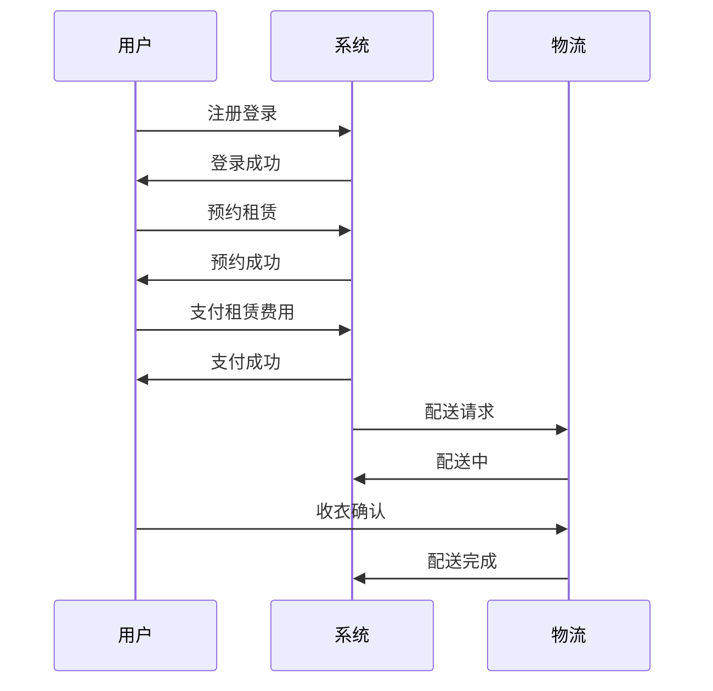

                 

### 文章标题：新型城市共享衣橱：时尚租赁经济的环保实践

随着城市化进程的加速和环保意识的提升，共享经济模式逐渐渗透到各个领域，其中时尚租赁经济尤为引人注目。本文将探讨一种新型城市共享衣橱模式，深入分析其在时尚租赁经济中的角色，以及如何通过环保实践实现可持续发展。

本文关键词包括：共享衣橱、时尚租赁经济、环保实践、可持续发展。

摘要：本文首先介绍了共享衣橱的背景和概念，然后探讨了其在时尚租赁经济中的重要性。通过分析共享衣橱的运营模式、技术和算法原理，本文提出了一种新型的城市共享衣橱系统设计。最后，通过实际项目案例，展示了如何将环保实践融入共享衣橱系统中，实现经济和环保的双赢。

### 共享衣橱的兴起背景

共享衣橱作为一个新兴的时尚租赁经济模式，其兴起可以追溯到几个关键因素的共同作用。首先，城市化进程的加快导致了人们对时尚消费的需求日益增长，但同时也带来了环境压力。传统的购买-使用-丢弃的时尚消费模式不仅浪费资源，还对环境造成了负面影响。其次，互联网技术的快速发展为共享衣橱提供了便捷的在线交易平台，使得用户可以随时随地租赁衣物。此外，人们环保意识的提高也促使他们选择更加可持续的时尚消费方式。

共享衣橱的概念主要包括以下几个方面：首先，它是一种基于互联网平台的时尚租赁服务，用户可以通过手机应用程序或网站进行衣物租赁。其次，共享衣橱的运营模式通常采用订阅制或按次租赁，用户可以根据自己的需求选择合适的租赁方式。最后，共享衣橱的环保实践体现在减少浪费、降低碳排放和促进可持续发展等方面。

### 共享衣橱在时尚租赁经济中的角色

共享衣橱在时尚租赁经济中扮演着多重角色，首先，它为消费者提供了一种更加灵活和经济的时尚消费方式。用户可以根据自己的需要随时租赁最新潮流的衣物，无需长期持有，从而减少了服装的闲置率和浪费。其次，共享衣橱为时尚品牌和零售商提供了一种新的销售渠道，通过将库存资源最大化利用，提高了产品的周转率，降低了库存成本。

在共享衣橱的运营中，技术起到了至关重要的作用。通过大数据分析和人工智能技术，平台可以精确了解用户的需求，优化衣物的供应和分配。例如，通过用户的历史租赁记录和偏好分析，平台可以推荐符合用户风格的衣物，从而提高用户的满意度和参与度。

### 环保实践与可持续发展

共享衣橱的环保实践主要体现在以下几个方面：

1. **减少浪费**：通过租赁模式，共享衣橱减少了衣物购买的需求，从而减少了生产、运输和废弃的环节，降低了资源浪费。

2. **降低碳排放**：共享衣橱减少了衣物的生产和运输，从而降低了碳排放。据统计，每件租赁的衣物可以减少约7千克的碳排放。

3. **促进可持续发展**：共享衣橱鼓励了循环利用和可再生材料的采用，推动了时尚产业的可持续发展。

### 新型城市共享衣橱系统设计

为了实现共享衣橱的环保实践和可持续发展，我们需要设计一个高效、智能的城市共享衣橱系统。以下是该系统的设计思路：

1. **系统功能设计**：系统需要具备用户注册、租赁预约、订单管理、衣物配送和回收等功能。

2. **系统架构设计**：系统采用分布式架构，包括前端用户界面、后端数据库、中间件和物联网设备等模块。

3. **系统接口设计**：系统需要提供RESTful API接口，以便与其他系统集成，如支付系统、物流系统等。

4. **系统交互序列图**：通过Mermaid流程图，详细描述用户租赁衣物的流程，包括用户操作、系统响应和数据交互等。

### 实际项目案例分析

为了更好地展示新型城市共享衣橱系统如何实现环保实践，我们以一个实际项目为例进行分析。

#### 项目介绍

该项目是一家位于上海的新型共享衣橱公司，致力于为都市白领提供便捷、时尚、环保的租赁服务。

#### 系统功能设计

1. **用户注册与登录**：用户可以通过手机号码进行注册和登录，系统会生成用户ID和密码。
2. **租赁预约**：用户可以在应用中选择合适的衣物进行租赁，系统会根据用户的位置和时间自动推荐合适的衣物。
3. **订单管理**：系统会生成租赁订单，用户可以根据订单详情查看租赁状态。
4. **衣物配送与回收**：系统与物流公司合作，提供衣物配送和回收服务，用户可以根据预约时间选择收衣和送衣。

#### 系统架构设计

1. **前端用户界面**：采用React框架，提供友好的用户界面和丰富的交互体验。
2. **后端数据库**：使用MySQL数据库存储用户信息、订单数据和衣物信息。
3. **中间件**：使用Node.js和Docker技术，提供API接口和中间件服务。
4. **物联网设备**：使用RFID技术，实现对衣物状态的实时监控和跟踪。

#### 系统接口设计

1. **用户接口**：提供注册、登录、租赁预约、订单查询等接口。
2. **衣物接口**：提供衣物库存管理、状态更新、租赁记录查询等接口。
3. **物流接口**：提供配送请求、配送状态更新、回收请求等接口。

#### 系统交互序列图

以下是用户租赁衣物的Mermaid序列图示例：

### 最佳实践与未来展望

1. **最佳实践**：
   - **用户行为分析**：通过大数据分析，了解用户偏好和行为，优化衣物推荐和租赁策略。
   - **环保材料使用**：推广使用可再生材料和环保包装，减少环境污染。
   - **智能物流管理**：采用物联网技术和智能算法，提高物流效率和准确性。

2. **未来展望**：
   - **智能合约**：利用区块链技术，实现租赁合同的自动化执行，提高交易透明度和安全性。
   - **社交互动**：引入社交功能，如分享租赁经历、评价衣物，增强用户粘性和社区氛围。
   - **多元化服务**：拓展服务范围，如提供定制化租赁、衣物维修等服务，满足不同用户需求。

### 小结

本文深入探讨了新型城市共享衣橱在时尚租赁经济中的角色和环保实践。通过系统设计和实际项目案例的分析，我们展示了如何通过技术手段实现共享衣橱的可持续发展。未来，共享衣橱有望成为时尚产业的重要趋势，为消费者提供更加环保和经济的时尚消费方式。

### 作者信息

作者：AI天才研究院/AI Genius Institute & 禅与计算机程序设计艺术 /Zen And The Art of Computer Programming

