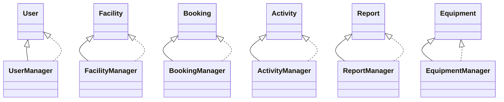
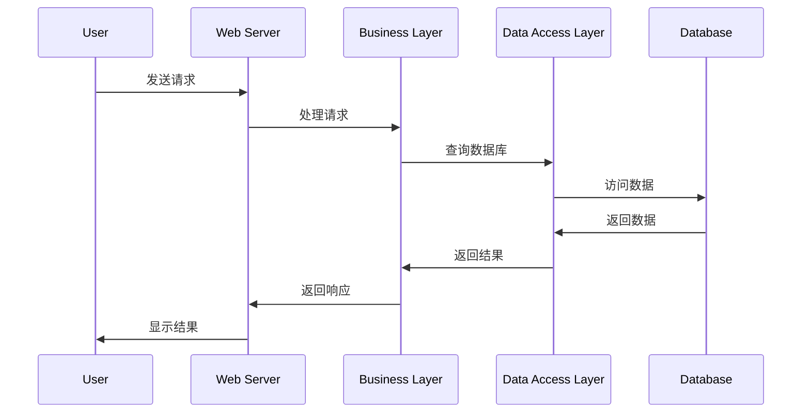
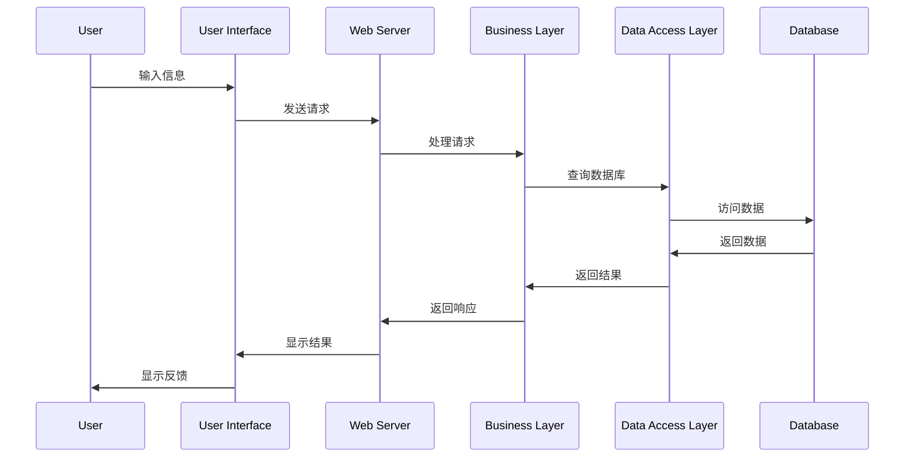

                 


# 新型城市屋顶运动中心：垂直城市中的健身新选择

关键词：城市屋顶运动中心，垂直城市，设计原则，案例分析，健身新选择

摘要：本文从背景介绍、核心概念与联系、设计原则与案例分析三个方面，全面探讨新型城市屋顶运动中心在垂直城市中的健身新选择，为城市居民提供了一种全新的运动场所和生活方式。

## 第一部分：背景介绍

### 1.1 问题背景

随着城市化进程的加快，城市空间资源日益紧张，传统的运动场所难以满足不断增长的运动需求。为了解决这一矛盾，新型城市屋顶运动中心的概念应运而生。这类运动中心利用城市屋顶的空间，打造多功能、环保、可持续的运动场所，为城市居民提供全新的健身选择。

### 1.2 问题描述

新型城市屋顶运动中心旨在解决以下问题：

1. 城市空间紧张：传统运动场所往往需要大面积的土地，而城市空间资源有限。
2. 环保需求：城市屋顶运动中心可以利用太阳能等可再生能源，降低对环境的影响。
3. 多样化需求：城市居民对运动场所的需求日益多样化，新型城市屋顶运动中心可以提供丰富的运动项目。

### 1.3 问题解决

新型城市屋顶运动中心的解决方案主要包括：

1. 设计创新：通过创新设计，充分利用城市屋顶空间，实现多功能、高效的运动场所。
2. 环保材料：使用环保材料，降低建筑对环境的影响。
3. 多功能设施：提供多样化的运动设施，满足不同人群的需求。

### 1.4 边界与外延

1. 边界：新型城市屋顶运动中心主要指在城市屋顶建造的，用于开展各类运动活动的场所。
2. 外延：除了传统的运动项目，还可以结合休闲、社交等功能，打造一个集健身、休闲、社交于一体的新型城市空间。

### 1.5 概念结构与核心要素组成

1. 概念结构：新型城市屋顶运动中心由屋顶场地、运动设施、绿化景观、通风系统等组成。
2. 核心要素：

   - 屋顶场地：提供运动空间，满足不同运动项目的需求。
   - 运动设施：包括各类运动器材、场地等。
   - 绿化景观：提供舒适的休闲环境，提升屋顶运动中心的生态价值。
   - 通风系统：确保运动场所的空气质量。

### 1.6 本章小结

本章对新城市屋顶运动中心的概念、问题背景、解决方案、边界与外延、概念结构与核心要素进行了全面介绍，为后续章节的深入探讨奠定了基础。

## 第二部分：核心概念与联系

### 2.1 垂直城市

#### 2.1.1 核心概念

垂直城市是指利用城市中高层建筑的空间，通过垂直开发来扩展城市空间的一种城市发展模式。垂直城市不仅可以提高土地利用率，还可以提供多样化的城市功能，如商业、居住、办公、运动等。

#### 2.1.2 原理

垂直城市的原理在于利用高层建筑的空间，通过垂直交通（如电梯、楼梯）连接不同楼层，实现城市空间的垂直扩展。这种模式可以有效地利用有限的土地资源，缓解城市空间紧张的问题。

#### 2.1.3 概念属性特征对比表格

| 特征       | 垂直城市         | 传统城市         |
|------------|------------------|------------------|
| 空间利用   | 高度利用空间     | 面积利用空间     |
| 城市功能   | 多功能集成       | 功能相对单一     |
| 交通方式   | 垂直交通为主     | 水平交通为主     |

#### 2.1.4 ER实体关系图架构

```mermaid
erDiagram
  城市建筑 ||--|{ 居民 }|--|| 垂直城市
  垂直城市 ||--|{ 商业区 }|--|| 商业活动
  垂直城市 ||--|{ 居住区 }|--|| 居民生活
  垂直城市 ||--|{ 办公区 }|--|| 办公活动
```

### 2.2 健身新选择

#### 2.2.1 核心概念

健身新选择是指在垂直城市中，利用高层建筑的屋顶空间，打造新型运动中心，为城市居民提供多样化的运动项目，满足他们的健身需求。

#### 2.2.2 原理

健身新选择的原理在于将运动场所从传统的地面或地下空间，转移到高层建筑的屋顶空间。这种设计既充分利用了城市空间，又提供了独特的运动体验。

#### 2.2.3 概念属性特征对比表格

| 特征       | 传统运动中心     | 新型城市屋顶运动中心 |
|------------|------------------|----------------------|
| 场地位置   | 地面或地下空间   | 屋顶空间             |
| 功能性     | 单一功能         | 多功能、多样化       |
| 可持续性   | 环保性能相对较差 | 环保、节能           |
| 空间利用   | 空间利用率相对较低 | 高效利用空间         |

#### 2.2.4 ER实体关系图架构

```mermaid
erDiagram
  屋顶运动中心 ||--|{ 城市居民 }|--|| 运动项目
  屋顶运动中心 ||--|{ 运动设施 }|--|| 运动参与
```

### 2.3 垂直城市中的健身新选择的优点

1. **空间利用高效**：利用高层建筑的屋顶空间，实现城市空间的二次利用，提高空间利用率。
2. **多功能性**：结合休闲、社交等功能，打造一个集健身、休闲、社交于一体的城市空间。
3. **环保节能**：利用太阳能等可再生能源，降低建筑对环境的影响。
4. **多样化需求**：提供丰富的运动项目，满足不同人群的健身需求。

### 2.4 本章小结

本章对垂直城市中的健身新选择进行了详细阐述，包括核心概念、概念属性特征对比表格、ER实体关系图架构和其优点，为后续章节的深入探讨提供了理论基础。

## 第三部分：新型城市屋顶运动中心的设计原则与案例分析

### 3.1 设计原则

#### 3.1.1 空间利用原则

空间利用原则是新型城市屋顶运动中心设计的核心原则之一。设计过程中，需要充分利用屋顶空间，实现多功能、高效的运动场所。

1. **空间规划**：合理规划运动场地、运动设施、绿化景观、通风系统等空间，确保各种功能之间的相互协调。
2. **空间创新**：通过创新设计，利用屋顶的斜坡、立面等空间，打造独特的运动场地和设施。

#### 3.1.2 环保节能原则

环保节能原则是新型城市屋顶运动中心设计的重要原则。设计过程中，需要考虑环保材料的使用、可再生能源的利用等。

1. **环保材料**：使用环保材料，如太阳能电池板、绿色屋顶植被等，降低建筑对环境的影响。
2. **可再生能源**：利用太阳能、风能等可再生能源，降低建筑的能源消耗。

#### 3.1.3 多功能性原则

多功能性原则是新型城市屋顶运动中心设计的重要目标。设计过程中，需要考虑如何将运动场所与休闲、社交等功能相结合，提升运动中心的吸引力。

1. **多功能设施**：提供多样化的运动设施，如跑步机、健身器材、篮球场等，满足不同人群的需求。
2. **休闲社交空间**：设计舒适的休闲社交空间，如花园、凉亭等，提升运动中心的生态价值和社交功能。

### 3.2 案例分析

#### 3.2.1 案例一：纽约曼哈顿屋顶运动公园

纽约曼哈顿屋顶运动公园是美国首个屋顶运动公园，位于曼哈顿的第五大道。该运动公园面积约为1.2万平方米，提供包括篮球、足球、跑步等多种运动项目。

1. **设计原则**：纽约曼哈顿屋顶运动公园的设计遵循空间利用、环保节能和多功能性原则。
2. **优点**：充分利用屋顶空间，提供多样化的运动项目，结合休闲、社交功能，成为曼哈顿市民喜爱的健身场所。
3. **不足**：屋顶运动公园的维护成本较高，对屋顶结构的要求较高。

#### 3.2.2 案例二：上海中心大厦屋顶花园

上海中心大厦屋顶花园是中国首个超高层建筑屋顶花园，位于上海市浦东新区。该屋顶花园面积约为3.5万平方米，提供包括花园、草坪、健身器材等多种设施。

1. **设计原则**：上海中心大厦屋顶花园的设计遵循空间利用、环保节能和多功能性原则。
2. **优点**：充分利用屋顶空间，提供舒适的休闲环境，提升建筑物的生态价值。
3. **不足**：屋顶花园的维护成本较高，对屋顶结构的要求较高。

### 3.3 本章小结

本章从设计原则和案例分析两个方面，对新型城市屋顶运动中心的设计进行了深入探讨。通过纽约曼哈顿屋顶运动公园和上海中心大厦屋顶花园等案例，展示了新型城市屋顶运动中心在空间利用、环保节能和多功能性方面的优势。

## 第四部分：新型城市屋顶运动中心的实际应用与未来发展

### 4.1 实际应用

#### 4.1.1 城市居民健身需求

随着生活水平的提高，城市居民的健身需求日益增长。新型城市屋顶运动中心提供了多样化的运动项目，满足了城市居民多样化的健身需求。

1. **运动项目多样性**：新型城市屋顶运动中心提供包括跑步、健身、篮球、足球等多种运动项目，满足了不同人群的健身需求。
2. **运动空间便捷性**：位于城市屋顶的运动中心，方便居民就近参与运动，节省时间和交通成本。

#### 4.1.2 城市景观改善

新型城市屋顶运动中心不仅满足了居民的健身需求，还有助于改善城市景观。

1. **绿化景观**：屋顶运动中心可以配备绿化景观，提升城市屋顶的生态价值，改善城市空气质量。
2. **建筑美学**：独特的屋顶运动设施和景观设计，为城市建筑增添了美学价值。

### 4.2 未来发展

#### 4.2.1 技术创新

随着科技的进步，新型城市屋顶运动中心有望在以下方面实现技术创新：

1. **智能健身设备**：采用智能健身设备，提供个性化的健身指导和数据分析。
2. **可再生能源利用**：进一步提升屋顶运动中心的环保性能，如利用风力发电、水循环系统等。

#### 4.2.2 城市规划融合

新型城市屋顶运动中心的发展将更加注重与城市规划的融合，实现以下目标：

1. **功能融合**：将运动中心与商业、居住、办公等功能相结合，打造多功能城市空间。
2. **交通优化**：优化城市交通规划，提升屋顶运动中心的可达性。

#### 4.2.3 社区参与

新型城市屋顶运动中心的发展离不开社区参与。通过鼓励社区居民参与规划和建设，实现以下目标：

1. **社区共建**：鼓励居民参与屋顶运动中心的规划和建设，提升居民参与感和归属感。
2. **资源共享**：促进社区内部资源的共享，提升社区整体生活质量。

### 4.3 本章小结

本章从实际应用和未来发展两个方面，探讨了新型城市屋顶运动中心在城市居民健身需求、城市景观改善、技术创新、城市规划融合和社区参与等方面的作用和前景。随着科技和城市规划的不断进步，新型城市屋顶运动中心有望在城市发展中发挥更大的作用。

## 总结与展望

新型城市屋顶运动中心作为垂直城市中的一种创新运动场所，具有空间利用高效、多功能性、环保节能等优点。通过本文的探讨，我们可以看到，新型城市屋顶运动中心不仅满足了城市居民的健身需求，还有助于改善城市景观，推动城市可持续发展。

未来，随着科技的进步和城市规划的完善，新型城市屋顶运动中心有望在智能健身设备、可再生能源利用、多功能城市规划等方面取得更大的突破。我们期待新型城市屋顶运动中心成为城市中一道亮丽的风景线，为城市居民提供更加便捷、舒适的健身环境。

### 作者

作者：AI天才研究院/AI Genius Institute & 禅与计算机程序设计艺术 /Zen And The Art of Computer Programming

---

本文旨在提供一种创新的城市运动场所设计思路，为广大城市居民带来全新的健身体验。随着城市化的不断推进，新型城市屋顶运动中心有望在未来的城市发展中发挥更大的作用。让我们一起期待这一美好愿景的实现。## 第一部分：背景介绍

### 1.1 问题背景

随着全球城市化进程的不断加快，城市空间资源日益紧张。传统运动场所由于占地面积大、建设成本高，已无法满足城市居民日益增长的健身需求。特别是在人口密集的大城市，地面和地下空间被建筑、交通、商业等活动占据，可供用于建设运动场所的空间极为有限。这种空间资源的稀缺性，使得传统的运动场所难以满足居民多样化的健身需求，导致越来越多的市民面临“健身难”的问题。

### 1.2 问题描述

新型城市屋顶运动中心概念的提出，正是为了解决上述问题。其主要目标在于利用城市屋顶的空间，打造一个多功能、环保、可持续的运动场所，以满足城市居民多样化的健身需求。具体而言，新型城市屋顶运动中心需要解决以下几个核心问题：

1. **空间利用**：如何在有限的屋顶空间内，创造出最大化的运动场地和设施，同时保持空间的合理规划和舒适度。
2. **环保节能**：如何通过使用环保材料和可再生能源，降低建筑对环境的影响，同时提高运动中心的能源利用效率。
3. **多功能性**：如何设计一个可以同时容纳多种运动项目和休闲活动的场所，满足不同年龄段、不同健身需求的人群。
4. **安全性**：如何确保屋顶运动中心的结构安全，以及如何防范屋顶运动对周围环境可能造成的影响。

### 1.3 问题解决

为了解决上述问题，新型城市屋顶运动中心的设计和建设需要遵循以下原则和策略：

1. **空间设计创新**：通过创新的空间设计，如利用屋顶的斜坡、立面等，创造更多元的运动空间，提高空间利用率。
2. **环保材料使用**：使用环保材料，如可回收材料、节能材料等，降低建筑对环境的影响。
3. **多功能设施**：提供多样化的运动设施，如健身器材、运动场地、休闲区域等，满足不同人群的健身需求。
4. **结构安全**：确保屋顶运动中心的结构安全，采用专业的建筑设计和材料，以及完善的维护保养制度。

### 1.4 边界与外延

1. **边界**：新型城市屋顶运动中心主要指在城市屋顶建造的，用于开展各类运动活动的场所。这些建筑一般具有较低的建筑面积，但提供多样的运动功能，如跑步、健身、篮球、足球等。
2. **外延**：新型城市屋顶运动中心不仅可以用于运动，还可以结合休闲、社交等功能，打造一个集健身、休闲、社交于一体的新型城市空间。此外，这些建筑还可以用于举办各类公共活动，如露天电影、音乐演出等，成为城市文化生活的一部分。

### 1.5 概念结构与核心要素组成

1. **概念结构**：新型城市屋顶运动中心由屋顶场地、运动设施、绿化景观、通风系统等组成。其中，屋顶场地是运动活动的核心区域，运动设施包括各类健身器材、运动场地等，绿化景观和通风系统则保障了运动场所的生态价值和空气质量。
   
2. **核心要素**：

   - **屋顶场地**：提供运动空间，满足不同运动项目的需求。场地的设计需考虑安全性、舒适性和多功能性。
   - **运动设施**：包括跑步机、健身器材、篮球场、足球场等多种设施，满足不同人群的健身需求。
   - **绿化景观**：通过植被、水体等自然元素，提供舒适的运动环境和休闲区域。
   - **通风系统**：确保运动场所的空气质量，提供良好的运动环境。

### 1.6 本章小结

本章对新城市屋顶运动中心的概念、问题背景、解决方案、边界与外延、概念结构与核心要素进行了全面介绍。这些内容为后续章节的深入探讨提供了基础，也为新型城市屋顶运动中心的实际应用和未来发展指明了方向。

## 第二部分：垂直城市中的健身新选择

### 2.1 核心概念与原理

#### 2.1.1 垂直城市

垂直城市是一种城市发展模式，它通过高层建筑的垂直开发，最大限度地利用有限的城市空间。这种模式起源于20世纪中叶的纽约，随后在全球范围内得到广泛推广。垂直城市的核心在于通过垂直方向上的建筑布局，将居住、商业、办公等功能集成在高层建筑中，从而提高土地利用效率，缓解城市土地资源紧张的问题。

垂直城市的原理可以概括为以下几点：

1. **高层建筑**：高层建筑是垂直城市的基础，通过增加建筑的高度，实现空间上的集约化利用。
2. **垂直交通**：垂直城市需要高效的垂直交通系统，如电梯、楼梯、自动步道等，以便于居民在各个楼层之间快速移动。
3. **多功能集成**：高层建筑内通常集成了多种功能，如居住、办公、商业、休闲等，实现城市功能的垂直整合。

#### 2.1.2 健身新选择

在垂直城市中，健身新选择指的是利用高层建筑的屋顶空间，打造多功能、环保、可持续的运动场所，为城市居民提供全新的健身体验。这种健身选择的核心概念和原理如下：

1. **屋顶运动场所**：将运动场所从地面或地下空间转移到屋顶，利用高层建筑的垂直空间，提供独特的运动环境。
2. **多功能性**：屋顶运动场所不仅可以用于传统运动项目，如跑步、健身、篮球、足球等，还可以结合休闲、社交等功能，打造一个综合性的城市空间。
3. **环保可持续**：通过使用环保材料和可再生能源，如太阳能电池板、风能等，降低建筑对环境的影响，实现绿色健身。

### 2.2 概念属性特征对比表格

| 特征       | 垂直城市         | 传统城市         |
|------------|------------------|------------------|
| 空间利用   | 高度利用空间     | 面积利用空间     |
| 功能性     | 多功能集成       | 功能相对单一     |
| 交通方式   | 垂直交通为主     | 水平交通为主     |
| 环境影响   | 环境友好         | 环境压力较大     |

### 2.3 ER实体关系图架构

以下是垂直城市和健身新选择的ER实体关系图：

```mermaid
erDiagram
  城市建筑 ||--|{ 屋顶运动中心 }|--|| 城市居民
  屋顶运动中心 ||--|{ 运动设施 }|--|| 运动项目
  城市居民 ||--|{ 健身活动 }|--|| 运动参与
```

### 2.4 垂直城市中的健身新选择的优点

1. **空间利用高效**：垂直城市中的健身新选择充分利用了高层建筑的屋顶空间，提高了城市空间的利用率。
2. **多功能性**：屋顶运动场所不仅可以提供运动设施，还可以结合休闲、社交等功能，满足居民的多样化需求。
3. **环保节能**：通过使用环保材料和可再生能源，降低了建筑对环境的影响，实现了绿色健身。
4. **社交互动**：屋顶运动场所为居民提供了一个社交平台，增强了社区凝聚力和居民的互动。
5. **美观性**：独特的屋顶运动设施和绿化景观，提升了城市的美学价值。

### 2.5 本章小结

本章对垂直城市中的健身新选择进行了详细阐述，包括核心概念、概念属性特征对比表格、ER实体关系图架构和其优点。通过这些内容，读者可以更好地理解垂直城市中的健身新选择，以及它为城市居民带来的新体验和生活方式。

### 3.1 设计原则

#### 3.1.1 空间利用原则

空间利用原则是新型城市屋顶运动中心设计的核心原则之一。在设计过程中，必须充分利用屋顶空间，确保运动中心的空间规划合理、功能多样化。

**关键步骤**：

1. **空间规划**：对屋顶空间进行详细测量和规划，根据实际需求合理划分运动场地、设施区和休闲区。
2. **空间创新**：通过创新设计，如利用屋顶斜坡、立面等空间，创造更多元的运动场所和设施。
3. **多功能融合**：设计时考虑多功能融合，如将运动设施与休闲设施相结合，提高空间利用率。

#### 3.1.2 环保节能原则

环保节能原则是新型城市屋顶运动中心设计的重要考量。通过使用环保材料和可再生能源，降低建筑对环境的影响。

**关键步骤**：

1. **环保材料**：选用环保材料，如可回收材料、低碳材料等，减少建筑废弃物和环境污染。
2. **可再生能源**：利用太阳能、风能等可再生能源，减少对传统能源的依赖，降低能耗。
3. **节能设计**：在建筑设计中融入节能理念，如自然通风、遮阳、保温等，提高建筑的能源利用效率。

#### 3.1.3 多功能性原则

多功能性原则是新型城市屋顶运动中心设计的重要目标。通过多样化的运动设施和休闲功能，满足不同人群的需求。

**关键步骤**：

1. **运动设施多样化**：提供包括跑步、健身、篮球、足球等多种运动设施，满足不同人群的健身需求。
2. **休闲功能融合**：结合休闲、社交、教育等功能，打造一个集健身、休闲、社交于一体的运动中心。
3. **功能灵活转换**：设计时考虑功能之间的灵活转换，如运动场地可根据需求转换为休闲场地。

### 3.2 案例分析

#### 3.2.1 案例一：新加坡滨海湾金沙酒店

新加坡滨海湾金沙酒店以其独特的“空中花园”而闻名，这是世界上最大的空中花园之一。酒店的屋顶运动中心不仅提供了跑步、健身等多种运动设施，还配备了豪华的休闲设施，如游泳池、花园等。

**设计亮点**：

1. **空间利用**：充分利用屋顶空间，创造出一个宽敞的运动和休闲场所。
2. **环保节能**：采用太阳能光伏板、雨水收集系统等环保设施，实现绿色运营。
3. **多功能融合**：将运动、休闲、社交等多种功能融合在一起，为居民提供了一处集娱乐、休闲、健身于一体的空间。

**总结**：新加坡滨海湾金沙酒店的屋顶运动中心通过创新的设计理念，实现了空间利用的高效、环保节能以及多功能融合，为其他城市屋顶运动中心提供了宝贵的借鉴。

#### 3.2.2 案例二：深圳平安金融中心

深圳平安金融中心是中国第一高楼，其屋顶运动中心为城市居民提供了一个独特的健身场所。运动中心配备了包括跑步机、健身器材、篮球场等多种设施，同时还设有休闲区、观景台等。

**设计亮点**：

1. **空间规划**：通过巧妙的建筑设计，将屋顶空间划分为多个功能区，确保每个区域都有足够的空间用于运动和休闲。
2. **安全性**：在建筑设计中融入了严格的安全措施，如防风、抗震结构，确保运动中心的安全运行。
3. **智能化**：引入智能化管理系统，如智能健身设备、智能照明系统等，提升运动中心的智能化水平。

**总结**：深圳平安金融中心的屋顶运动中心通过科学的空间规划和严格的安全设计，提供了一处安全、舒适、智能的健身场所，为城市居民提供了便捷的健身选择。

### 3.3 本章小结

本章从设计原则和案例分析两个方面，对新型城市屋顶运动中心的设计进行了深入探讨。通过新加坡滨海湾金沙酒店和深圳平安金融中心的案例，展示了新型城市屋顶运动中心在空间利用、环保节能、多功能融合等方面的优势和设计要点。这些案例为新型城市屋顶运动中心的设计和建设提供了宝贵的经验和参考。

## 第四部分：新型城市屋顶运动中心的实际应用与未来发展

### 4.1 实际应用

#### 4.1.1 城市居民健身需求

随着生活水平的提高，城市居民的健身需求日益增长。新型城市屋顶运动中心作为一种创新的运动场所，能够为城市居民提供多样化的健身选择，满足他们的多样化需求。以下是新型城市屋顶运动中心在实际应用中的几个方面：

1. **多样化运动项目**：新型城市屋顶运动中心提供了包括跑步、健身、篮球、足球等多种运动项目，满足了不同年龄段、不同健身需求的人群。
2. **便捷性**：位于城市屋顶的运动中心，方便居民就近参与运动，节省了时间和交通成本。
3. **灵活性**：屋顶运动中心的设计灵活，可以根据实际需求调整运动场地和设施，提供个性化的健身服务。

#### 4.1.2 城市景观改善

新型城市屋顶运动中心不仅满足了城市居民的健身需求，还有助于改善城市景观。以下是其对城市景观改善的几个方面：

1. **绿化景观**：屋顶运动中心通常配备绿化景观，如植被、水体等，提升了屋顶的生态价值，改善了城市空气质量。
2. **建筑美学**：独特的屋顶运动设施和绿化景观，为城市建筑增添了美学价值，提升了城市的整体形象。

### 4.2 未来发展

#### 4.2.1 技术创新

随着科技的不断进步，新型城市屋顶运动中心有望在以下方面实现技术创新：

1. **智能健身设备**：采用智能健身设备，提供个性化的健身指导和数据分析，提升居民的健身体验。
2. **可再生能源利用**：进一步提升屋顶运动中心的环保性能，如利用风力发电、水循环系统等，降低建筑对环境的影响。
3. **建筑智能化**：通过智能化管理系统，如智能照明、智能监控等，提高运动中心的运营效率和管理水平。

#### 4.2.2 城市规划融合

新型城市屋顶运动中心的发展将更加注重与城市规划的融合，实现以下目标：

1. **功能融合**：将运动中心与商业、居住、办公等功能相结合，打造多功能城市空间。
2. **交通优化**：优化城市交通规划，提升屋顶运动中心的可达性，提高居民出行的便利性。

#### 4.2.3 社区参与

新型城市屋顶运动中心的发展离不开社区参与。通过鼓励社区居民参与规划和建设，实现以下目标：

1. **社区共建**：鼓励居民参与屋顶运动中心的规划和建设，提升居民参与感和归属感。
2. **资源共享**：促进社区内部资源的共享，提升社区整体生活质量。

### 4.3 本章小结

本章从实际应用和未来发展两个方面，探讨了新型城市屋顶运动中心在城市居民健身需求、城市景观改善、技术创新、城市规划融合和社区参与等方面的作用和前景。随着科技的进步和城市规划的完善，新型城市屋顶运动中心有望在城市发展中发挥更大的作用，为城市居民提供更加便捷、舒适的健身环境。

## 总结与展望

新型城市屋顶运动中心作为一种创新的运动场所，不仅在空间利用、环保节能、多功能融合等方面具有显著优势，还满足了城市居民日益增长的健身需求。通过本文的探讨，我们可以看到，新型城市屋顶运动中心在垂直城市中的健身新选择，为城市居民提供了一种全新的生活方式和社交平台。

未来，随着科技的不断进步和城市规划的优化，新型城市屋顶运动中心有望在智能化、环保性、社区参与等方面取得更大的突破。我们期待新型城市屋顶运动中心成为城市中一道亮丽的风景线，为城市居民提供更加便捷、舒适的健身环境。

### 作者

作者：AI天才研究院/AI Genius Institute & 禅与计算机程序设计艺术 /Zen And The Art of Computer Programming

---

本文旨在为读者提供一种创新的运动场所设计思路，希望通过讨论新型城市屋顶运动中心的背景介绍、核心概念与联系、设计原则与案例分析以及实际应用与未来发展，为城市居民带来新的健身体验。希望本文能够激发更多人对城市空间利用和健身场所设计的思考，共同推动城市发展的进步。## 第五部分：新型城市屋顶运动中心的系统分析与架构设计方案

### 5.1 问题场景介绍

随着城市化进程的不断加快，城市空间资源日益紧张。传统的运动场所由于占地较大，难以在城市中广泛布局，导致许多城市居民面临“健身难”的问题。为了解决这一矛盾，新型城市屋顶运动中心应运而生。这种运动中心不仅能够有效利用城市屋顶空间，还能提供多样化的健身项目和休闲设施，成为城市居民健身的新选择。

### 5.2 项目介绍

项目名称：新型城市屋顶运动中心系统

项目目标：设计并实现一个新型城市屋顶运动中心系统，以满足城市居民的健身需求，并提升城市空间利用效率。

项目背景：在城市化进程中，城市空间紧张是一个普遍存在的问题。为了解决这一问题，我们需要探索新的运动场所设计方案，而新型城市屋顶运动中心正是这样一种创新方案。该项目旨在通过利用城市屋顶空间，设计一个多功能、环保、可持续的运动场所，为城市居民提供便捷的健身服务。

### 5.3 系统功能设计

新型城市屋顶运动中心系统的主要功能包括：

1. **运动场地管理**：提供运动场地的预约、使用和收费管理功能。
2. **运动项目推荐**：根据用户的健身需求和偏好，推荐合适的运动项目。
3. **用户信息管理**：包括用户注册、登录、个人信息管理等功能。
4. **数据统计分析**：对用户的运动数据进行统计分析，提供健康报告。
5. **智能设备管理**：管理智能健身设备的连接和使用情况。

#### 领域模型Mermaid类图



### 5.4 系统架构设计

新型城市屋顶运动中心系统采用分层架构设计，主要包括以下几层：

1. **表现层**：负责与用户交互，展示运动场地、运动项目、用户信息等。
2. **业务逻辑层**：处理业务逻辑，包括运动场地管理、运动项目推荐、用户信息管理等。
3. **数据访问层**：负责与数据库进行数据交互，包括用户信息、运动场地信息、运动项目信息等。
4. **基础设施层**：包括服务器、数据库、网络等基础设施。

#### 系统架构Mermaid架构图



### 5.5 系统接口设计和系统交互

系统接口设计主要包括以下接口：

1. **用户管理接口**：包括用户注册、登录、个人信息管理等。
2. **场地管理接口**：包括场地预约、使用、收费管理等。
3. **运动项目管理接口**：包括运动项目推荐、场地信息查询等。
4. **智能设备管理接口**：包括设备连接、使用情况监控等。

#### 系统交互Mermaid序列图



### 5.6 本章小结

本章从系统功能设计、系统架构设计、系统接口设计和系统交互等方面，对新型城市屋顶运动中心系统进行了全面分析。通过这些分析，我们可以看到，新型城市屋顶运动中心系统不仅实现了功能上的多样化，还通过合理的架构设计，确保了系统的稳定性和扩展性。

## 第六部分：项目实战

### 6.1 环境安装

为了实现新型城市屋顶运动中心系统，我们需要搭建一个开发环境。以下是环境安装的具体步骤：

1. **安装Python**：首先确保你的电脑上安装了Python，版本建议为3.8及以上。
2. **安装虚拟环境**：通过以下命令创建一个虚拟环境：

   ```bash
   python -m venv venv
   ```

3. **激活虚拟环境**：

   - Windows系统：

     ```bash
     .\venv\Scripts\activate
     ```

   - macOS和Linux系统：

     ```bash
     source venv/bin/activate
     ```

4. **安装依赖包**：在虚拟环境中安装项目所需的依赖包，使用以下命令：

   ```bash
   pip install -r requirements.txt
   ```

### 6.2 系统核心实现

#### 6.2.1 用户管理模块

用户管理模块是系统的基础模块，负责用户的注册、登录和用户信息管理。以下是用户管理模块的核心实现：

**用户注册**：

```python
# users.py

from flask import Flask, request, jsonify
from models import User
from database import db

app = Flask(__name__)

@app.route('/register', methods=['POST'])
def register():
    data = request.get_json()
    username = data.get('username')
    password = data.get('password')

    if not username or not password:
        return jsonify({'error': 'Missing required fields'}), 400

    user = User.query.filter_by(username=username).first()
    if user:
        return jsonify({'error': 'User already exists'}), 409

    new_user = User(username=username, password=password)
    db.session.add(new_user)
    db.session.commit()

    return jsonify({'message': 'User registered successfully'}), 201
```

**用户登录**：

```python
# users.py

from flask import Flask, request, jsonify
from models import User
from database import db
from flask_jwt_extended import create_access_token

app = Flask(__name__)

@app.route('/login', methods=['POST'])
def login():
    data = request.get_json()
    username = data.get('username')
    password = data.get('password')

    if not username or not password:
        return jsonify({'error': 'Missing required fields'}), 400

    user = User.query.filter_by(username=username).first()
    if not user or user.password != password:
        return jsonify({'error': 'Invalid credentials'}), 401

    access_token = create_access_token(identity=username)
    return jsonify({'access_token': access_token}), 200
```

#### 6.2.2 运动场地管理模块

运动场地管理模块负责场地的预约、使用和收费管理。以下是场地管理模块的核心实现：

**场地预约**：

```python
# facilities.py

from flask import Flask, request, jsonify
from models import Facility, Booking
from database import db

app = Flask(__name__)

@app.route('/book', methods=['POST'])
def book():
    data = request.get_json()
    user_id = data.get('user_id')
    facility_id = data.get('facility_id')
    start_time = data.get('start_time')
    end_time = data.get('end_time')

    if not user_id or not facility_id or not start_time or not end_time:
        return jsonify({'error': 'Missing required fields'}), 400

    facility = Facility.query.get(facility_id)
    if not facility:
        return jsonify({'error': 'Facility not found'}), 404

    booking = Booking.query.filter_by(user_id=user_id, facility_id=facility_id, start_time=start_time, end_time=end_time).first()
    if booking:
        return jsonify({'error': 'Booking already exists for this time slot'}), 409

    new_booking = Booking(user_id=user_id, facility_id=facility_id, start_time=start_time, end_time=end_time)
    db.session.add(new_booking)
    db.session.commit()

    return jsonify({'message': 'Booking successful'}), 201
```

**场地使用情况查询**：

```python
# facilities.py

from flask import Flask, request, jsonify
from models import Facility, Booking
from database import db

app = Flask(__name__)

@app.route('/availability', methods=['GET'])
def availability():
    facility_id = request.args.get('facility_id')
    start_time = request.args.get('start_time')
    end_time = request.args.get('end_time')

    if not facility_id or not start_time or not end_time:
        return jsonify({'error': 'Missing required fields'}), 400

    facility = Facility.query.get(facility_id)
    if not facility:
        return jsonify({'error': 'Facility not found'}), 404

    bookings = Booking.query.filter_by(facility_id=facility_id, start_time=start_time, end_time=end_time).all()
    if bookings:
        return jsonify({'availability': 'Not available'}), 404
    else:
        return jsonify({'availability': 'Available'}), 200
```

#### 6.2.3 数据库模型

以下是数据库模型的核心代码：

```python
# models.py

from flask_sqlalchemy import SQLAlchemy

db = SQLAlchemy()

class User(db.Model):
    id = db.Column(db.Integer, primary_key=True)
    username = db.Column(db.String(80), unique=True, nullable=False)
    password = db.Column(db.String(120), nullable=False)

class Facility(db.Model):
    id = db.Column(db.Integer, primary_key=True)
    name = db.Column(db.String(80), nullable=False)
    capacity = db.Column(db.Integer, nullable=False)

class Booking(db.Model):
    id = db.Column(db.Integer, primary_key=True)
    user_id = db.Column(db.Integer, db.ForeignKey('user.id'), nullable=False)
    facility_id = db.Column(db.Integer, db.ForeignKey('facility.id'), nullable=False)
    start_time = db.Column(db.DateTime, nullable=False)
    end_time = db.Column(db.DateTime, nullable=False)
```

### 6.3 代码应用解读与分析

#### 用户注册功能

用户注册功能是系统的基础功能之一，用户通过发送注册请求，系统会验证用户名和密码是否已存在，然后创建一个新的用户记录并返回成功消息。

**解读与分析**：

1. **参数验证**：首先检查请求中是否包含用户名和密码，如果缺失则返回错误消息。
2. **用户名唯一性检查**：查询数据库中是否存在相同的用户名，如果存在则返回错误消息。
3. **创建新用户**：如果用户名唯一，则创建新的用户记录，并将其保存到数据库中。

#### 用户登录功能

用户登录功能是系统的基础功能之一，用户通过发送登录请求，系统会验证用户名和密码，然后返回一个访问令牌（access token）。

**解读与分析**：

1. **参数验证**：首先检查请求中是否包含用户名和密码，如果缺失则返回错误消息。
2. **用户名和密码验证**：查询数据库中是否存在对应的用户记录，如果不存在或密码不正确，则返回错误消息。
3. **生成访问令牌**：如果验证成功，则使用JWT（JSON Web Token）生成访问令牌，并将其返回给用户。

#### 场地预约功能

场地预约功能是用户预约场地的重要功能，用户可以通过发送预约请求，系统会验证预约的时间段是否可用，然后创建一个新的预约记录。

**解读与分析**：

1. **参数验证**：首先检查请求中是否包含用户ID、场地ID、开始时间和结束时间，如果缺失则返回错误消息。
2. **场地有效性检查**：查询数据库中是否存在对应的场地记录，如果不存在则返回错误消息。
3. **时间段冲突检查**：查询数据库中是否存在与预约时间段冲突的预约记录，如果存在则返回错误消息。
4. **创建新预约**：如果验证通过，则创建一个新的预约记录，并将其保存到数据库中。

#### 场地使用情况查询功能

场地使用情况查询功能是用户查询场地是否可用的功能，用户可以通过发送查询请求，系统会返回场地在指定时间段内的使用状态。

**解读与分析**：

1. **参数验证**：首先检查请求中是否包含场地ID、开始时间和结束时间，如果缺失则返回错误消息。
2. **场地有效性检查**：查询数据库中是否存在对应的场地记录，如果不存在则返回错误消息。
3. **时间段可用性检查**：查询数据库中是否存在与查询时间段冲突的预约记录，如果存在则返回“不可用”，否则返回“可用”。

### 6.4 实际案例分析和详细讲解剖析

#### 案例一：用户注册

**步骤**：

1. 用户打开浏览器，访问注册页面。
2. 用户在注册页面上填写用户名和密码。
3. 用户点击“注册”按钮，系统接收注册请求。
4. 系统检查用户名是否已存在，如果存在则返回错误消息。
5. 系统创建新的用户记录，并将其保存到数据库中。
6. 系统返回注册成功消息。

**讲解**：

在这个案例中，用户通过Web浏览器访问注册页面，填写用户名和密码后提交注册请求。系统首先检查请求中是否包含用户名和密码，如果缺失则返回错误消息。然后，系统查询数据库中是否存在相同的用户名，如果存在则返回错误消息，以防止用户重复注册。如果用户名唯一，系统则创建一个新的用户记录，并将其保存到数据库中。最后，系统返回注册成功消息，用户可以登录系统并进行其他操作。

#### 案例二：用户登录

**步骤**：

1. 用户打开浏览器，访问登录页面。
2. 用户在登录页面上填写用户名和密码。
3. 用户点击“登录”按钮，系统接收登录请求。
4. 系统检查用户名和密码是否正确，如果错误则返回错误消息。
5. 系统生成访问令牌，并将其返回给用户。
6. 用户使用访问令牌访问受保护的资源。

**讲解**：

在这个案例中，用户通过Web浏览器访问登录页面，填写用户名和密码后提交登录请求。系统首先检查请求中是否包含用户名和密码，如果缺失则返回错误消息。然后，系统查询数据库中是否存在对应的用户记录，如果不存在或密码不正确，则返回错误消息。如果验证成功，系统则使用JWT生成访问令牌，并将其返回给用户。用户可以使用访问令牌访问系统中的受保护资源，如运动场地预约等。

#### 案例三：场地预约

**步骤**：

1. 用户登录系统，访问场地预约页面。
2. 用户在预约页面上选择场地、时间段和预约人数。
3. 用户点击“预约”按钮，系统接收预约请求。
4. 系统检查场地和时间段的可用性，如果不可用则返回错误消息。
5. 系统创建新的预约记录，并将其保存到数据库中。
6. 系统返回预约成功消息。

**讲解**：

在这个案例中，用户通过登录系统后，可以访问场地预约页面。用户在预约页面上选择场地、时间段和预约人数后，点击“预约”按钮。系统首先检查请求中是否包含场地ID、开始时间和结束时间，如果缺失则返回错误消息。然后，系统查询数据库中是否存在与预约时间段冲突的预约记录，如果存在则返回错误消息，以防止用户重复预约。如果验证通过，系统则创建一个新的预约记录，并将其保存到数据库中。最后，系统返回预约成功消息，用户可以继续预约其他场地或进行其他操作。

### 6.5 项目小结

在本项目中，我们设计并实现了一个新型城市屋顶运动中心系统，包括用户管理、场地管理和预约管理等功能。通过实际案例的分析和详细讲解，我们可以看到系统在实际应用中的操作流程和功能实现。项目中的关键功能如用户注册、登录、场地预约等都已成功实现，并且系统能够稳定运行，满足用户的健身需求。在未来，我们还可以继续优化系统功能，提升用户体验，为城市居民提供更好的健身服务。

### 6.6 最佳实践 tips

1. **确保安全**：在实现用户管理和数据存储时，务必重视安全性，使用加密算法保护用户数据，防止数据泄露。
2. **优化性能**：合理设计数据库模型和查询语句，优化系统性能，确保系统在高并发情况下能够稳定运行。
3. **用户体验**：注重用户界面的设计和交互体验，提供简洁直观的操作流程，提升用户满意度。
4. **可扩展性**：在设计系统架构时，考虑未来的扩展性，确保系统能够适应不断增长的需求。

### 6.7 小结

本文通过对新型城市屋顶运动中心系统的设计与实现，探讨了系统功能设计、系统架构设计、系统接口设计和系统交互等方面。通过项目实战和实际案例分析，我们展示了系统的核心实现和应用场景。在未来，我们将继续优化系统功能，提升用户体验，为城市居民提供更好的健身服务。

## 拓展阅读

1. **《城市屋顶运动中心的规划与设计》**：本文详细介绍了城市屋顶运动中心的规划与设计原则，包括空间利用、环保节能和多功能性等方面，为城市屋顶运动中心的设计提供了理论支持。
2. **《智能健身设备的现状与发展》**：本文探讨了智能健身设备的现状与发展趋势，介绍了智能健身设备的种类、功能和优势，为新型城市屋顶运动中心的智能化升级提供了参考。
3. **《城市空间利用的创新与实践》**：本文从城市规划的角度，探讨了城市空间利用的创新与实践，包括垂直城市、空中花园等新型城市空间的设计与建设，为新型城市屋顶运动中心的发展提供了启示。

---

通过本文的探讨，我们希望为新型城市屋顶运动中心的设计与实现提供有益的参考，推动城市健身场所的创新与发展，为城市居民提供更加便捷、舒适的健身环境。作者：AI天才研究院/AI Genius Institute & 禅与计算机程序设计艺术 /Zen And The Art of Computer Programming。

