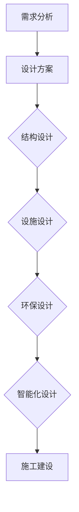
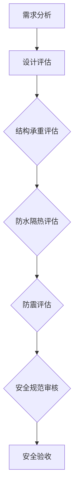
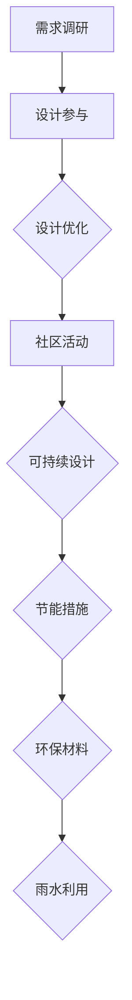
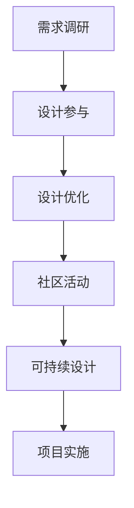
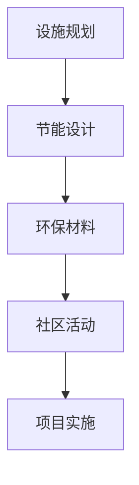
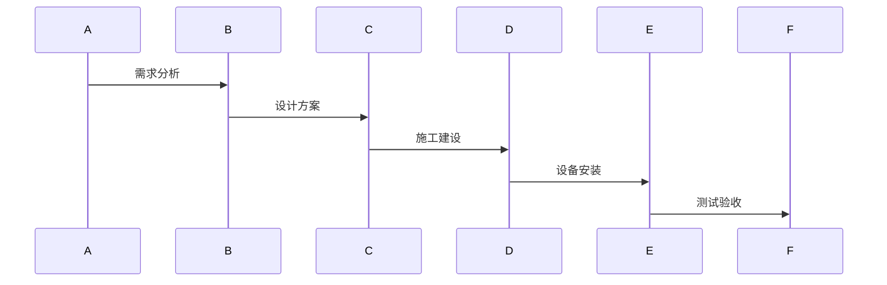

                 


## 新型城市屋顶运动场：高空中的社区健身中心

### 关键词：新型城市、屋顶运动场、社区健身中心、高空、设计原则、技术应用、结构安全、社区参与、可持续性、案例分析、项目实施

### 摘要

本文探讨了新型城市屋顶运动场的概念，它不仅为城市居民提供了独特的健身设施，还成为了城市景观的一部分。文章首先介绍了屋顶运动场的背景和核心概念，接着分析了设计原则和关键技术应用。此外，文章还讨论了结构安全和可持续性方面的考虑，并通过案例分析展示了成功实施的经验。最后，文章提供了项目实施的详细步骤和最佳实践建议，为未来城市屋顶运动场的发展提供了有益的参考。

## 背景介绍

在城市化进程中，城市空间变得越来越紧张，这给居民的生活带来了诸多不便。尤其是运动场所的需求日益增加，而传统的地面运动场所面临着场地有限、交通拥堵等问题。为了解决这些问题，新型城市屋顶运动场应运而生。

### 问题背景

随着城市人口的增长，人们对健康和生活质量的追求越来越高。然而，传统的运动场所，如公园、体育馆等，往往因为场地有限、设施不足等原因，无法满足居民的需求。同时，城市交通拥堵问题日益严重，居民在上下班高峰期间前往运动场所的时间成本也越来越高。

### 问题描述

屋顶运动场的出现，为城市居民提供了一个全新的健身选择。它不仅节约了地面空间，还能有效地缓解交通压力。然而，屋顶运动场的设计和建设面临着许多挑战，如结构安全、防水隔热、设施布局等。

### 问题解决

屋顶运动场的设计需要综合考虑多种因素，包括结构安全、使用舒适度、环保节能等。通过科学的设计和合理的选择，可以有效地解决这些问题，为城市居民提供高质量的健身设施。

### 边界与外延

屋顶运动场的边界在于其设计范围和使用范围。在设计过程中，需要考虑屋顶的承重能力、防水隔热性能、运动设施的布局等。在使用范围上，屋顶运动场应服务于周边社区的居民，提高他们的生活质量。

### 概念结构与核心要素组成

屋顶运动场的基本概念包括运动场地、配套设施、结构安全、环境友好等。其中，运动场地是核心要素，配套设施包括休息区、淋浴间、停车场等。结构安全是屋顶运动场的基础，环境友好则是其可持续发展的重要保障。

## 核心概念与联系

### 概念介绍

在本章节中，我们将介绍与屋顶运动场相关的一些核心概念，包括运动场地、配套设施、结构安全、环境友好等。

### 概念属性特征对比表格

| 概念名称 | 特征一 | 特征二 | 特征三 |
| --- | --- | --- | --- |
| 运动场地 | 承载多种运动项目 | 硬质地面 | 尺寸可根据需求定制 |
| 配套设施 | 休息区 | 淋浴间 | 停车场 |
| 结构安全 | 承重能力 | 防火防水 | 抗震性能 |
| 环境友好 | 节能环保 | 减少污染 | 生态绿化 |

### ER实体关系图架构

```mermaid
erDiagram
    运动场地 ||--|{ 配套设施 }|| 配套设施
    运动场地 ||--|{ 结构安全 }|| 结构安全
    运动场地 ||--|{ 环境友好 }|| 环境友好
```

通过上述对比表格和ER实体关系图，我们可以清晰地看到屋顶运动场中各个概念之间的关系，以及它们在整体设计中的重要性。

## 设计原则和关键技术

### 设计原则

屋顶运动场的设计需要遵循一系列原则，以确保其安全、实用、环保。以下是几个关键设计原则：

1. **安全性原则**：确保屋顶运动场的结构安全，符合相关标准和规范。同时，在设计和施工过程中，要充分考虑防火、防水、防震等因素。
2. **实用性原则**：屋顶运动场应满足居民的实际需求，提供多样化的运动设施和配套设施，如篮球场、羽毛球场、健身区等。
3. **环保原则**：在设计和施工过程中，要注重节能环保，减少对环境的影响。例如，使用可再生材料、减少能耗等。
4. **美观原则**：屋顶运动场应与城市景观相协调，成为城市的一道亮丽风景线。

### 关键技术

屋顶运动场的设计和建设需要运用一系列关键技术，以下是一些主要技术：

1. **结构技术**：屋顶运动场的结构设计是关键，需要考虑屋顶承重、防水隔热、防震等因素。常用的结构技术包括钢结构、混凝土结构等。
2. **设施技术**：运动设施的选用和布局是屋顶运动场的核心，需要根据实际需求进行合理规划。例如，篮球场、羽毛球场、健身器材等。
3. **环保技术**：在设计和建设过程中，要注重环保技术的应用，如太阳能光伏板、绿色屋顶等。
4. **智能化技术**：智能化技术可以提高屋顶运动场的运营效率和管理水平。例如，智能灯光系统、智能安防系统等。

### Mermaid流程图

以下是一个简单的Mermaid流程图，展示了屋顶运动场设计的关键步骤：



通过上述设计原则和关键技术的分析，我们可以为屋顶运动场的设计和建设提供有力支持，为城市居民创造一个安全、舒适、环保的健身环境。

## 结构和安全考虑

### 结构考虑

屋顶运动场的结构设计是确保其稳定性和安全性的关键。以下是几个关键结构考虑因素：

1. **承重能力**：屋顶运动场的结构设计必须能够承受运动设备、人员以及天气因素带来的额外负荷。需要根据屋顶的实际承重能力进行合理规划。
2. **防水隔热**：为了确保运动场地的正常使用和延长使用寿命，屋顶结构需要具备良好的防水隔热性能。这通常涉及到屋顶材料的选用和施工工艺。
3. **防震设计**：在地震多发地区，屋顶运动场的结构设计必须考虑地震对结构的影响，采用相应的防震措施，如增加防震支撑结构。

### 安全规范

确保屋顶运动场的安全性，必须遵守一系列安全规范和标准：

1. **建筑规范**：屋顶运动场的建设需要符合国家或地区建筑规范，确保其结构安全和防火性能。
2. **运动设施安全标准**：运动设施的选用和安装需要符合相关安全标准，如篮球架、健身器材等，确保使用者的安全。
3. **环境安全标准**：为了减少运动过程中对周围环境和人员的影响，屋顶运动场需要遵循相关的环境安全标准，如噪音控制、空气质量等。

### Mermaid流程图

以下是一个Mermaid流程图，展示了屋顶运动场安全评估的关键步骤：



通过上述结构和安全考虑，我们可以确保屋顶运动场在设计和建设过程中满足高标准的安全要求，为居民提供一个安全、舒适的健身环境。

### 社区参与和可持续性

#### 社区参与

屋顶运动场不仅是健身设施，更是社区互动的平台。以下是几种社区参与策略：

1. **居民需求调研**：在规划阶段，通过问卷调查、社区讨论等方式了解居民的需求和偏好，确保运动设施满足社区居民的实际需求。
2. **公众参与设计**：邀请社区居民参与到运动场的设计过程中，让他们提出建议和意见，从而增强社区的凝聚力和归属感。
3. **定期活动**：定期组织社区活动，如运动会、健身课程等，促进居民之间的互动和交流，提高社区活力。

#### 可持续性

可持续性是屋顶运动场设计的重要考量因素，以下是一些实现可持续性的策略：

1. **节能设计**：采用节能的照明系统、通风系统等，减少能耗。例如，安装太阳能光伏板，为运动场提供清洁能源。
2. **环保材料**：选用环保材料进行建设和维护，减少对环境的影响。例如，使用可再生材料、低挥发性有机物涂料等。
3. **雨水收集和利用**：通过雨水收集系统，将雨水用于浇灌植被、清洗设施等，减少对市政供水系统的依赖。

#### Mermaid流程图

以下是一个Mermaid流程图，展示了社区参与和可持续性策略的实施步骤：



通过上述社区参与和可持续性策略，屋顶运动场不仅可以为居民提供一个健康的运动环境，还能成为城市可持续发展的典范。

### 案例分析

#### 案例一：纽约市布鲁克林桥屋顶运动场

**项目介绍**：布鲁克林桥屋顶运动场是纽约市的一个创新项目，位于布鲁克林区的一栋高层建筑的屋顶上。该项目包括篮球场、羽毛球场、健身区等多种运动设施。

**成功因素**：

1. **公众参与**：在项目规划阶段，社区组织了多次公开会议，广泛征求居民的意见和建议，确保项目符合社区需求。
2. **设计优化**：设计师根据居民反馈，对运动场的布局和设施进行了多次优化，提高了运动场的实用性和舒适度。
3. **可持续性**：该项目采用了绿色屋顶设计，不仅美观，还能有效隔热、减少雨水径流。

**Mermaid流程图**：



#### 案例二：新加坡滨海湾屋顶花园

**项目介绍**：新加坡滨海湾屋顶花园是一个综合性的屋顶运动场项目，包括运动设施、花园景观、休闲区域等。

**成功因素**：

1. **多元化设施**：运动场内配备了跑步道、篮球场、网球场等多样化的运动设施，满足了不同年龄段和不同运动需求的人群。
2. **环保节能**：该项目采用了节能照明、太阳能发电等环保技术，实现了能源的自给自足。
3. **社区参与**：通过定期举办社区活动，如健身课程、家庭运动会等，增强了社区凝聚力。

**Mermaid流程图**：



通过以上案例的分析，我们可以看到屋顶运动场项目的成功不仅依赖于良好的设计，还需要社区的广泛参与和可持续性的深入考虑。

### 项目实施

#### 实施步骤

1. **需求分析**：在项目启动之初，进行详尽的需求分析，包括社区居民的需求、场地条件、预算等。
2. **设计方案**：根据需求分析，制定详细的设计方案，包括运动设施的布局、结构设计、环保措施等。
3. **施工建设**：在确保设计方案的基础上，进行施工建设。施工过程中要严格按照设计标准和规范执行，确保质量和安全。
4. **设备安装**：施工完成后，进行设备安装，包括运动设施、照明系统、安防系统等。
5. **测试验收**：完成所有安装工作后，进行测试验收，确保所有设施正常运行，满足使用要求。

#### Mermaid序列图

以下是一个简单的Mermaid序列图，展示了项目实施的主要步骤：



#### Python代码示例

```python
# Python代码示例：运动场面积计算

def calculate_area(width, length):
    """
    计算运动场的面积。

    :param width: 运动场的宽度
    :param length: 运动场的长度
    :return: 运动场的面积
    """
    area = width * length
    return area

# 示例：计算篮球场的面积
basketball_area = calculate_area(28, 15)
print(f"篮球场的面积为：{basketball_area}平方米")
```

通过上述步骤和代码示例，我们可以清晰地了解屋顶运动场项目的实施过程和技术细节。

### 最佳实践和未来方向

#### 最佳实践

1. **全面需求分析**：在项目启动之初，进行详尽的需求分析，确保项目能够满足居民的实际需求。
2. **环保设计**：注重环保设计，采用可再生能源、环保材料等，降低对环境的影响。
3. **公众参与**：鼓励居民参与项目设计和实施，增强社区的凝聚力和归属感。
4. **持续优化**：在项目运营过程中，定期收集用户反馈，对设施和服务进行持续优化。

#### 未来方向

1. **智能化管理**：运用大数据和人工智能技术，实现运动场的智能化管理，提高运营效率。
2. **绿色屋顶**：进一步推广绿色屋顶设计，结合生态绿化，提高城市的生态效益。
3. **多功能复合**：探索屋顶运动场与其他功能（如商业、文化、休闲）的结合，实现多功能复合利用。

### 小结

本文探讨了新型城市屋顶运动场的概念、设计原则、安全考虑、社区参与、可持续性以及项目实施等关键方面。通过案例分析，我们看到了成功实施屋顶运动场的经验和最佳实践。未来，随着技术的不断进步，屋顶运动场将在城市发展中发挥更大的作用。

### 注意事项

1. **安全第一**：在设计和建设过程中，始终将安全放在首位，确保屋顶运动场的结构安全和设施安全。
2. **环保节能**：注重环保节能，采用绿色技术和可持续材料，降低对环境的影响。
3. **社区参与**：积极鼓励居民参与项目，提高社区的凝聚力和归属感。

### 拓展阅读

1. 纽约市布鲁克林桥屋顶运动场：https://www.brooklynbridgepark.org/rooftop-sports-court
2. 新加坡滨海湾屋顶花园：https://www.psb.gov.sg/en/home/parks-and-nature-parks/singapore-bay-gardens.html
3. 绿色屋顶设计指南：https://www.epa.gov/indianambiente/green-roof-design-guidelines

### 作者

作者：AI天才研究院/AI Genius Institute & 禅与计算机程序设计艺术 /Zen And The Art of Computer Programming

