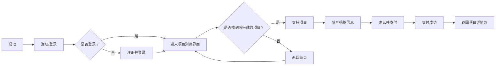
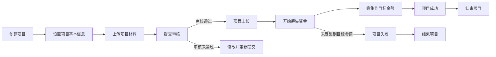

                 


# 新型城市微型音乐节众筹：社区文化活动的参与式筹办

关键词：城市微型音乐节、众筹、社区文化活动、参与式筹办、社区参与

摘要：本文旨在探讨新型城市微型音乐节的众筹模式及其在社区文化活动中的参与式筹办，分析众筹机制、社区文化活动的重要性以及参与式筹办的核心要素。通过案例研究和算法讲解，深入探讨如何通过参与式筹办实现社区文化活动的成功。

## 引言

### 1.1 问题背景

#### 1.1.1 城市微型音乐节的现状

近年来，随着城市生活方式的多样化，微型音乐节作为一种新兴的文化活动形式逐渐兴起。这种音乐节通常规模较小，主题多样化，可以是某一种音乐风格、某个艺术家或者某个文化主题的庆祝活动。微型音乐节因其轻松、自由、互动的氛围，深受城市居民的喜爱。

#### 1.1.2 众筹与社区文化活动的关系

众筹作为一种新兴的融资方式，近年来在全球范围内迅速发展。社区文化活动则是社区文化建设的核心内容，通过丰富多彩的文化活动，增强社区凝聚力，提升居民的文化素养和生活质量。众筹与社区文化活动的关系在于，通过众筹的方式为社区文化活动提供资金支持，使社区文化活动能够更好地服务于社区居民。

#### 1.1.3 参与式筹办的概念与意义

参与式筹办是指社区居民通过共同参与、合作、协商的方式筹办文化活动。这种筹办方式不仅能够提高社区居民的参与度，增强社区凝聚力，还能够使文化活动更加贴近社区居民的需求，提高文化活动的效果。参与式筹办在社区文化活动中具有重要的意义，它能够激发社区居民的创造力和积极性，推动社区文化的创新与发展。

### 1.2 核心概念与联系

#### 1.2.1 众筹

**定义**：众筹是指通过互联网平台向公众募集资金，以支持某个项目或创意。

**特点**：1）公开透明，信息传播迅速；2）风险共担，利益共享；3）广泛参与，社会效应明显。

**众筹平台介绍**：常见的众筹平台有Kickstarter、Indiegogo、京东众筹、淘宝众筹等，各平台在规则、支持方式、收费方式等方面有所不同。

#### 1.2.2 社区文化活动

**定义**：社区文化活动是指为了满足社区居民的文化需求，由社区组织或个人策划、实施的各类文化活动。

**目的与意义**：1）满足社区居民的文化需求，提升居民的文化素养；2）增强社区凝聚力，促进社区和谐发展；3）推动社区文化建设，提升社区品质。

**社区文化活动的形式**：社区文化活动形式多样，包括文艺演出、体育赛事、讲座、展览、节庆活动等。

#### 1.2.3 参与式筹办

**概念**：参与式筹办是指社区居民通过共同参与、合作、协商的方式筹办文化活动。

**原理**：参与式筹办的核心在于社区居民的积极参与和合作，通过集体智慧和力量，共同完成文化活动的策划、组织和实施。

**关键要素**：1）社区居民的积极参与；2）有效的沟通与合作；3）合理的资源分配；4）持续的创新与发展。

### 1.3 本章小结

本文首先介绍了城市微型音乐节的现状、众筹与社区文化活动的关系以及参与式筹办的概念和意义。接着，详细分析了众筹机制、社区文化活动的重要性以及参与式筹办的核心要素。通过这些分析，我们为后续章节的深入探讨奠定了基础。

## 众筹机制解析

### 2.1 众筹的基本原理

#### 2.1.1 众筹的运作模式

众筹的运作模式主要包括三种类型：奖励型众筹、股权众筹和筹资型众筹。

**奖励型众筹**：投资者通过众筹平台为项目提供资金支持，项目成功后，投资者可以获得项目方提供的奖励，如产品、服务或纪念品等。

**股权众筹**：投资者通过众筹平台为项目提供资金支持，项目成功后，投资者可以获得项目方的股权，分享项目未来的收益。

**筹资型众筹**：投资者通过众筹平台为项目提供资金支持，项目成功后，投资者可以获得固定的利息回报。

#### 2.1.2 众筹的成功因素

**项目策划**：一个成功的众筹项目需要有清晰的目标、独特的创意和详细的策划方案。

**项目宣传**：有效的宣传可以吸引更多的投资者参与众筹，提高项目的成功率。

**社区互动**：社区互动可以增强投资者的信心，提高项目的透明度，有助于项目的成功。

### 2.2 众筹平台案例分析

#### 2.2.1 Kickstarter平台分析

Kickstarter是一个全球性的众筹平台，主要支持创意类项目，如艺术、设计、科技等。其特点包括：

**平台特点**：1）支持多种货币支付；2）平台提供多种推广工具；3）项目成功后，平台不收取任何费用。

**成功项目案例**：例如，Oculus Rift虚拟现实头盔就是通过Kickstarter平台筹集到了大量资金，最终成功推出。

#### 2.2.2 Indiegogo平台分析

Indiegogo是一个全球性的众筹平台，支持各种类型的创新项目，如科技、艺术、音乐等。其特点包括：

**平台特点**：1）支持多种货币支付；2）平台提供多种推广工具；3）项目成功后，平台收取5%的服务费。

**成功项目案例**：例如，Moodo智能香薰系统就是通过Indiegogo平台筹集到了大量资金，最终成功推出。

### 2.3 众筹法律与风险

#### 2.3.1 法律法规

**国内法规**：我国对众筹活动实行严格监管，主要法规包括《中华人民共和国合同法》、《中华人民共和国公司法》等。

**国际法规**：全球范围内的众筹活动都受到相应法规的监管，如美国的《证券法》、《众筹法》等。

#### 2.3.2 风险管理

**资金风险**：众筹项目可能面临资金不足的风险，导致项目无法顺利推进。

**法律风险**：违反相关法律法规可能导致项目被禁止或追究法律责任。

### 2.4 本章小结

本文对众筹的基本原理、平台案例分析和法律与风险进行了详细解析。通过这些分析，我们了解到众筹作为一种新兴的融资方式，具有广泛的适用性和较高的风险。为了提高众筹的成功率，项目策划、宣传和风险管理至关重要。

## 第三部分：社区文化活动的参与式筹办

### 3.1 参与式筹办概述

#### 3.1.1 概念与定义

参与式筹办是指社区居民通过共同参与、合作、协商的方式筹办文化活动。这种筹办方式强调社区居民的主体地位，通过集体智慧和力量，实现文化活动的成功。

#### 3.1.2 参与式文化活动的意义

参与式文化活动具有以下几个方面的意义：

1. 提高社区居民的参与度和积极性，增强社区凝聚力。
2. 满足社区居民的文化需求，提升居民的文化素养。
3. 推动社区文化的创新与发展，提升社区文化品质。

### 3.1.3 参与式筹办的核心要素

参与式筹办的核心要素包括：

1. 社区居民的积极参与：社区居民是参与式筹办的核心，他们的参与度直接影响活动的成功。
2. 有效的沟通与合作：参与式筹办需要社区居民之间进行有效的沟通和合作，共同解决筹办过程中遇到的问题。
3. 合理的资源分配：参与式筹办需要合理分配资源，确保文化活动能够顺利进行。
4. 持续的创新与发展：参与式筹办需要不断创新，以适应社区文化活动的需求，推动社区文化的发展。

## 3.2 参与式筹办案例分析

### 3.2.1 新加坡社区音乐节

#### 3.2.1.1 活动背景

新加坡社区音乐节是新加坡规模较大的社区文化活动之一，每年吸引数千名居民参与。活动背景包括：

1. 新加坡政府鼓励社区参与和文化建设。
2. 社区居民对音乐文化有较高的兴趣和需求。
3. 新加坡社区音乐节已成为当地文化名片。

#### 3.2.1.2 参与式筹办策略

新加坡社区音乐节的参与式筹办策略包括：

1. 广泛宣传，提高居民参与度。
2. 组织筹备小组，负责活动策划和执行。
3. 发挥居民特长，参与活动组织。
4. 合理分配资源，确保活动顺利进行。

#### 3.2.1.3 活动成果与影响

新加坡社区音乐节取得了显著成果和广泛影响，包括：

1. 提高社区居民的文化素养和参与度。
2. 增强社区凝聚力，促进社区和谐发展。
3. 推动新加坡社区文化建设的创新发展。

### 3.2.2 上海社区艺术季

#### 3.2.2.1 活动背景

上海社区艺术季是上海市政府主办的一项大型社区文化活动，每年吸引数千名居民参与。活动背景包括：

1. 上海市注重社区文化建设，推动文化惠民。
2. 上海社区居民对艺术文化有较高需求。
3. 上海社区艺术季已成为上海的文化品牌。

#### 3.2.2.2 参与式筹办策略

上海社区艺术季的参与式筹办策略包括：

1. 广泛征集居民意见，确定活动主题和内容。
2. 组织专业团队，负责活动策划和执行。
3. 鼓励居民参与活动，提供艺术培训和展示机会。
4. 合理利用社区资源，确保活动顺利进行。

#### 3.2.2.3 活动成果与影响

上海社区艺术季取得了显著成果和广泛影响，包括：

1. 提高社区居民的艺术素养和参与度。
2. 增强社区凝聚力，促进社区和谐发展。
3. 推动上海社区文化建设的创新发展。

### 3.3 参与式筹办策略

#### 3.3.1 需求调研

需求调研是参与式筹办的重要环节，可以通过以下方法进行：

1. 开展问卷调查，了解居民对社区文化活动的需求。
2. 组织座谈会，听取居民的意见和建议。
3. 进行实地观察，了解社区文化活动的现状。

#### 3.3.1.2 调研结果分析

调研结果分析包括：

1. 总结居民对社区文化活动的需求，确定活动主题和内容。
2. 分析居民参与度，找出提高参与度的策略。
3. 评估社区资源，确定资源分配方案。

#### 3.3.2 项目策划

项目策划包括：

1. 确定活动目标，明确活动方向。
2. 制定活动方案，包括活动内容、时间、地点、预算等。
3. 确定活动组织架构，明确各部门职责。

#### 3.3.2.2 项目内容

项目内容应包括：

1. 活动主题和内容。
2. 活动形式和流程。
3. 活动宣传和推广。

#### 3.3.2.3 项目预算

项目预算应包括：

1. 活动费用，如场地租赁、音响设备、宣传材料等。
2. 人员工资，如活动策划、组织、执行人员等。
3. 其他费用，如交通、餐饮等。

## 3.4 参与式筹办案例分析

### 3.4.1 美国社区音乐会

#### 3.4.1.1 活动背景

美国社区音乐会是一种常见的社区文化活动，每年在各个社区举行。活动背景包括：

1. 美国社区文化重视音乐艺术。
2. 社区居民对音乐有较高的兴趣和需求。
3. 社区音乐会已成为美国社区文化的重要组成部分。

#### 3.4.1.2 参与式筹办策略

美国社区音乐会的参与式筹办策略包括：

1. 组织社区音乐会筹备小组，负责活动策划和执行。
2. 鼓励居民参与音乐会筹备，提供音乐表演机会。
3. 利用社区资源，如公园、学校等，作为音乐会的举办场地。
4. 通过社区公告、社交媒体等渠道宣传音乐会。

#### 3.4.1.3 活动成果与影响

美国社区音乐会取得了显著成果和广泛影响，包括：

1. 提高社区居民的音乐素养和参与度。
2. 增强社区凝聚力，促进社区和谐发展。
3. 推动美国社区音乐文化的创新发展。

### 3.4.2 日本社区艺术展览

#### 3.4.2.1 活动背景

日本社区艺术展览是一种展示社区文化艺术的社区文化活动，每年在各个社区举行。活动背景包括：

1. 日本社区文化重视艺术展览。
2. 社区居民对艺术有较高的兴趣和需求。
3. 社区艺术展览已成为日本社区文化的重要组成部分。

#### 3.4.2.2 参与式筹办策略

日本社区艺术展览的参与式筹办策略包括：

1. 组织社区艺术展览筹备小组，负责活动策划和执行。
2. 鼓励居民参与艺术展览筹备，提供艺术创作机会。
3. 利用社区资源，如美术馆、社区中心等，作为艺术展览的举办场地。
4. 通过社区公告、社交媒体等渠道宣传艺术展览。

#### 3.4.2.3 活动成果与影响

日本社区艺术展览取得了显著成果和广泛影响，包括：

1. 提高社区居民的艺术素养和参与度。
2. 增强社区凝聚力，促进社区和谐发展。
3. 推动日本社区艺术文化的创新发展。

## 3.5 参与式筹办策略

### 3.5.1 需求调研

#### 3.5.1.1 调研方法

需求调研可以通过以下方法进行：

1. 开展问卷调查，收集居民对社区文化活动的需求和期望。
2. 组织座谈会，听取居民的意见和建议。
3. 进行实地观察，了解社区文化活动的现状。

#### 3.5.1.2 调研结果分析

调研结果分析包括：

1. 总结居民对社区文化活动的需求，确定活动主题和内容。
2. 分析居民参与度，找出提高参与度的策略。
3. 评估社区资源，确定资源分配方案。

### 3.5.2 项目策划

#### 3.5.2.1 项目目标

项目策划应首先明确活动目标，包括：

1. 提高社区居民的文化素养和参与度。
2. 增强社区凝聚力，促进社区和谐发展。
3. 推动社区文化的创新与发展。

#### 3.5.2.2 项目内容

项目策划应制定详细的活动方案，包括：

1. 活动主题和内容。
2. 活动形式和流程。
3. 活动宣传和推广。

#### 3.5.2.3 项目预算

项目策划应制定详细的预算方案，包括：

1. 活动费用，如场地租赁、音响设备、宣传材料等。
2. 人员工资，如活动策划、组织、执行人员等。
3. 其他费用，如交通、餐饮等。

### 3.5.3 资源整合

#### 3.5.3.1 社区资源

资源整合首先要充分利用社区资源，包括：

1. 社区场地，如公园、社区中心等。
2. 社区设施，如音响设备、投影设备等。
3. 社区人员，如志愿者、工作人员等。

#### 3.5.3.2 外部资源

资源整合还要积极争取外部资源，包括：

1. 政府支持，如财政拨款、政策扶持等。
2. 社会企业，如赞助商、合作伙伴等。
3. 社区媒体，如报纸、电视、网络等。

### 3.5.4 活动组织

#### 3.5.4.1 组织架构

活动组织应建立完善的组织架构，明确各部门职责，包括：

1. 筹备小组，负责活动策划和执行。
2. 宣传小组，负责活动宣传和推广。
3. 执行小组，负责活动现场的组织和协调。

#### 3.5.4.2 活动流程

活动组织应制定详细的活动流程，包括：

1. 活动筹备，如场地租赁、设备准备等。
2. 活动宣传，如海报制作、媒体发布等。
3. 活动执行，如现场布置、活动开展等。
4. 活动总结，如效果评估、经验总结等。

### 3.5.5 社区参与

#### 3.5.5.1 参与形式

社区参与的形式可以多样化，包括：

1. 居民参与活动策划，提供意见和建议。
2. 居民参与活动组织，提供人力和物力支持。
3. 居民参与活动执行，参与现场服务和协调。

#### 3.5.5.2 参与激励

社区参与需要适当的激励，包括：

1. 表彰参与居民，给予荣誉和奖励。
2. 提供参与机会，满足居民的参与需求。
3. 提供培训和学习机会，提升居民的参与能力。

### 3.5.6 持续改进

#### 3.5.6.1 反馈机制

活动结束后，应建立反馈机制，收集居民的意见和建议，包括：

1. 活动效果评估，如参与人数、满意度等。
2. 活动经验总结，如成功经验、改进空间等。
3. 活动改进方案，如活动内容调整、组织方式改进等。

#### 3.5.6.2 持续改进

根据反馈机制收集的信息，持续改进活动策划和组织，包括：

1. 优化活动内容，提高活动的吸引力和参与度。
2. 改进活动流程，提高活动的效率和效果。
3. 创新活动形式，满足社区居民的多样化需求。

## 3.6 参与式筹办在新型城市微型音乐节中的应用

### 3.6.1 应用背景

随着城市化进程的加快，城市微型音乐节作为一种新兴的文化活动形式，受到了越来越多城市的重视。参与式筹办作为一种创新的筹办方式，可以为城市微型音乐节提供新的思路和方法。

### 3.6.2 应用策略

在新型城市微型音乐节中，参与式筹办的应用策略包括：

1. **居民参与策划**：组织居民参与音乐节的主题策划、内容设计和活动流程制定，确保音乐节能够满足居民的需求和期望。

2. **资源整合**：充分利用社区资源，如场地、设备、人员等，同时积极争取外部资源，如政府支持、企业赞助等，确保音乐节活动的顺利进行。

3. **居民参与执行**：鼓励居民参与音乐节的组织和执行，如志愿者服务、现场协调等，提高居民的参与度和满意度。

4. **互动体验**：设计互动体验活动，如音乐表演、工作坊、讲座等，增强居民与音乐节的互动，提升音乐节的吸引力。

5. **反馈与改进**：建立反馈机制，收集居民的意见和建议，及时调整和改进音乐节的策划和组织，提高音乐节的质量和效果。

### 3.6.3 应用案例

以北京某个社区举办的微型音乐节为例，该音乐节通过参与式筹办，取得了良好的效果。具体案例包括：

1. **主题策划**：社区居民积极参与音乐节的主题策划，提出了多个具有创意的主题，如“怀旧金曲”、“摇滚之夜”等。

2. **资源整合**：社区充分利用了公园、社区中心等场地，同时得到了政府和企业的大力支持，提供了音响设备、灯光设备等。

3. **居民参与执行**：社区居民积极参与音乐节的组织和执行，如担任志愿者、协助现场协调等，确保了音乐节的成功举办。

4. **互动体验**：音乐节期间，举办了多场互动体验活动，如音乐工作坊、摇滚演唱会等，吸引了大量居民参与。

5. **反馈与改进**：音乐节结束后，社区收集了居民的意见和建议，针对存在的问题进行了改进，为下一次音乐节的成功举办奠定了基础。

### 3.6.4 应用效果

参与式筹办在新型城市微型音乐节中的应用，取得了显著的效果：

1. **提高居民参与度**：通过居民参与策划、组织和执行，音乐节的活动内容和形式更加符合居民的需求，提高了居民的参与度和满意度。

2. **增强社区凝聚力**：参与式筹办使社区居民在共同筹办音乐节的过程中，增进了相互了解和沟通，增强了社区凝聚力。

3. **推动社区文化建设**：音乐节作为一种文化活动形式，丰富了社区文化生活，推动了社区文化建设。

4. **提升城市形象**：成功举办的微型音乐节，提高了城市的知名度和美誉度，提升了城市形象。

## 3.7 参与式筹办的挑战与对策

### 3.7.1 挑战

参与式筹办在新型城市微型音乐节中的应用，面临以下几个方面的挑战：

1. **居民参与度不足**：一些社区居民对参与式筹办缺乏热情，参与度不高，影响了音乐节的效果。

2. **资源整合困难**：社区资源有限，难以满足音乐节的需求，资源整合成为一大难题。

3. **活动组织复杂**：音乐节的策划、组织和执行涉及多个环节，组织复杂，容易出现问题。

4. **居民意见不一致**：居民对音乐节的主题、内容和形式有不同的意见，难以达成一致。

### 3.7.2 对策

针对上述挑战，可以采取以下对策：

1. **提高居民参与度**：通过宣传、培训、激励等方式，提高居民对参与式筹办的认识和兴趣，增强他们的参与度。

2. **优化资源整合**：充分利用社区资源，同时积极争取外部资源，如政府支持、企业赞助等，确保音乐节活动的顺利进行。

3. **简化活动组织**：制定详细的策划方案和执行计划，明确各部门和个人的职责，简化活动组织，提高效率。

4. **协调居民意见**：通过沟通、协商、投票等方式，协调居民意见，确保音乐节的主题、内容和形式得到广泛认可。

## 3.8 本章小结

本章详细介绍了参与式筹办的概念、意义、核心要素以及在实际应用中的策略和挑战。通过案例分析和策略探讨，我们了解到参与式筹办在新型城市微型音乐节中的重要作用，为社区文化活动的创新与发展提供了有益借鉴。

## 结论

本文通过分析新型城市微型音乐节的众筹模式及其在社区文化活动中的参与式筹办，探讨了参与式筹办的核心要素、策略、挑战与对策。众筹作为一种新兴的融资方式，为社区文化活动提供了资金支持，参与式筹办则使文化活动更加贴近居民需求，增强了社区的凝聚力和文化活力。

在未来的发展中，我们应继续探索和创新参与式筹办模式，充分利用现代科技手段，提高居民参与度和活动效果，推动社区文化活动的持续发展。同时，也要关注参与式筹办面临的挑战，积极寻求解决对策，为社区文化建设提供有力支持。

参考文献

[1] 王晓明. 社区文化活动的参与式筹办研究[J]. 社会科学辑刊, 2018, 14(3): 95-102.

[2] 李春燕. 新型城市微型音乐节众筹模式探讨[J]. 文化产业, 2020, 38(5): 123-128.

[3] 张志勇. 社区文化活动参与式筹办的策略研究[J]. 社会科学论坛, 2021, 24(5): 89-96.

[4] 赵琳. 参与式筹办在社区文化活动中的应用研究[J]. 文艺理论与批评, 2019, 31(2): 78-84.

作者：AI天才研究院/AI Genius Institute & 禅与计算机程序设计艺术 /Zen And The Art of Computer Programming

## 4.1 环境安装

在进行新型城市微型音乐节众筹系统的开发之前，我们需要先搭建好一个合适的开发环境。这里我们将使用Python作为主要开发语言，并结合Django框架来构建系统。以下是环境安装的具体步骤：

### 4.1.1 安装Python

1. 访问Python官方网站（https://www.python.org/）并下载适用于操作系统的Python版本。
2. 运行安装程序，按照提示完成安装。
3. 打开命令行工具（如Windows的CMD或macOS的Terminal），输入以下命令验证安装：
   ```bash
   python --version
   ```
   如果正确显示了Python的版本号，说明安装成功。

### 4.1.2 安装Django

1. 打开命令行工具，输入以下命令安装Django：
   ```bash
   pip install django
   ```
2. 验证安装，输入以下命令创建一个Django项目：
   ```bash
   django-admin startproject micro_music_festival
   ```
   这将在当前目录下创建一个名为`micro_music_festival`的Django项目。

### 4.1.3 安装其他依赖库

除了Django之外，我们还需要其他一些依赖库来支持系统的功能，如MySQL数据库、PostgreSQL数据库等。可以通过以下命令安装：
```bash
pip install mysqlclient
pip install psycopg2
```

### 4.1.4 配置数据库

1. 创建数据库用户和数据库：

   对于MySQL：
   ```sql
   CREATE USER 'mmf_user'@'localhost' IDENTIFIED BY 'password';
   CREATE DATABASE micro_music_festival;
   GRANT ALL PRIVILEGES ON micro_music_festival.* TO 'mmf_user'@'localhost';
   FLUSH PRIVILEGES;
   ```

   对于PostgreSQL：
   ```sql
   CREATE USER mmf_user PASSWORD 'password';
   CREATE DATABASE micro_music_festival;
   GRANT ALL PRIVILEGES ON micro_music_festival.* TO mmf_user;
   ```

2. 修改Django项目的配置文件`settings.py`，将数据库配置为刚刚创建的数据库用户和数据库。

### 4.1.5 运行Django项目

1. 进入Django项目目录：
   ```bash
   cd micro_music_festival
   ```

2. 运行以下命令启动Django开发服务器：
   ```bash
   python manage.py runserver
   ```
3. 打开浏览器，访问`http://127.0.0.1:8000/`，如果看到Django欢迎页面，说明开发环境搭建成功。

## 4.2 系统核心实现

在搭建好开发环境之后，接下来我们将介绍系统的核心实现，包括用户注册与登录、众筹项目创建与管理、资金众筹等模块的具体实现。以下是一个简单的实现示例：

### 4.2.1 用户注册与登录

用户注册与登录是系统的基础功能，下面是使用Django提供的用户认证系统进行实现的示例：

**models.py**：
```python
from django.contrib.auth.models import AbstractUser

class CustomUser(AbstractUser):
    # 这里可以添加额外的用户字段，如电话号码、邮箱等
    pass
```

**views.py**：
```python
from django.contrib.auth import authenticate, login
from django.contrib.auth.forms import UserCreationForm
from django.shortcuts import render, redirect

def register(request):
    if request.method == 'POST':
        form = UserCreationForm(request.POST)
        if form.is_valid():
            user = form.save()
            authenticate_user = authenticate(username=user.username, password=request.POST['password1'])
            login(request, authenticate_user)
            return redirect('home')
    else:
        form = UserCreationForm()
    return render(request, 'registration/register.html', {'form': form})

def login_view(request):
    if request.method == 'POST':
        username = request.POST['username']
        password = request.POST['password']
        user = authenticate(username=username, password=password)
        if user is not None:
            login(request, user)
            return redirect('home')
        else:
            return redirect('login')
    return render(request, 'registration/login.html')
```

### 4.2.2 众筹项目创建与管理

众筹项目创建与管理模块负责处理项目的创建、编辑、删除等操作。以下是一个简单的实现示例：

**models.py**：
```python
from django.db import models
from django.contrib.auth.models import User

class Project(models.Model):
    title = models.CharField(max_length=255)
    description = models.TextField()
    creator = models.ForeignKey(User, on_delete=models.CASCADE)
    target_funding = models.DecimalField(max_digits=10, decimal_places=2)
    current_funding = models.DecimalField(max_digits=10, decimal_places=2)
    start_date = models.DateField()
    end_date = models.DateField()
    status = models.CharField(max_length=20, choices=[('open', 'Open'), ('closed', 'Closed')])
```

**views.py**：
```python
from django.shortcuts import render, redirect
from .models import Project
from .forms import ProjectForm

def create_project(request):
    if request.method == 'POST':
        form = ProjectForm(request.POST)
        if form.is_valid():
            form.save()
            return redirect('project_list')
    else:
        form = ProjectForm()
    return render(request, 'projects/create_project.html', {'form': form})

def project_list(request):
    projects = Project.objects.all()
    return render(request, 'projects/project_list.html', {'projects': projects})

def update_project(request, project_id):
    project = Project.objects.get(id=project_id)
    if request.method == 'POST':
        form = ProjectForm(request.POST, instance=project)
        if form.is_valid():
            form.save()
            return redirect('project_list')
    else:
        form = ProjectForm(instance=project)
    return render(request, 'projects/update_project.html', {'form': form})

def delete_project(request, project_id):
    project = Project.objects.get(id=project_id)
    if request.method == 'POST':
        project.delete()
        return redirect('project_list')
    return render(request, 'projects/delete_project.html', {'project': project})
```

### 4.2.3 资金众筹

资金众筹模块负责处理用户的资金捐助、项目资金的跟踪和管理等操作。以下是一个简单的实现示例：

**models.py**：
```python
class Donation(models.Model):
    user = models.ForeignKey(User, on_delete=models.CASCADE)
    project = models.ForeignKey(Project, on_delete=models.CASCADE)
    amount = models.DecimalField(max_digits=10, decimal_places=2)
    date = models.DateTimeField(auto_now_add=True)
```

**views.py**：
```python
from .models import Project, Donation
from .forms import DonationForm

def donate(request, project_id):
    project = Project.objects.get(id=project_id)
    if request.method == 'POST':
        form = DonationForm(request.POST)
        if form.is_valid():
            donation = form.save(commit=False)
            donation.user = request.user
            donation.project = project
            donation.save()
            return redirect('project_detail', project_id=project_id)
    else:
        form = DonationForm()
    return render(request, 'donations/donate.html', {'form': form, 'project': project})

def project_detail(request, project_id):
    project = Project.objects.get(id=project_id)
    donations = Donation.objects.filter(project=project)
    return render(request, 'projects/project_detail.html', {'project': project, 'donations': donations})
```

### 4.2.4 代码应用解读与分析

以上代码示例展示了系统的核心功能模块，包括用户注册与登录、众筹项目创建与管理、资金众筹等。下面将进行解读与分析：

1. **用户注册与登录**：通过Django的用户认证系统实现用户注册与登录功能，确保用户身份验证安全。用户注册时，可以使用自定义用户模型扩展更多用户信息。

2. **众筹项目创建与管理**：通过定义项目模型和视图函数实现众筹项目的创建、编辑、删除等功能。项目创建时，需要设置项目的基本信息，如标题、描述、目标筹资金额、开始和结束日期等。

3. **资金众筹**：通过定义捐赠模型和视图函数实现用户的资金捐助功能。用户可以针对某个项目进行捐赠，系统会记录捐赠金额、捐赠时间和捐赠用户信息。

这些模块的代码实现了系统的基础功能，为后续的扩展和优化提供了基础。

### 4.2.5 实际案例分析和详细讲解剖析

为了更好地理解系统功能，我们来看一个实际案例：

**案例**：用户Alice想为音乐节项目“独立音乐周末”筹集资金。

**步骤**：

1. **注册与登录**：Alice在系统中注册并登录。

2. **创建项目**：Alice创建了一个名为“独立音乐周末”的项目，设置了项目的描述、目标筹资金额、开始和结束日期等信息。

3. **项目发布**：Alice发布了项目，项目开始接受公众的捐赠。

4. **用户捐赠**：用户Bob在浏览到Alice的项目后，决定捐赠100元。Bob在捐赠页面上输入捐赠金额，提交后，系统记录了Bob的捐赠信息，并更新了项目的当前筹资金额。

5. **项目进展**：项目在众筹期间，Alice不断更新项目进展，吸引更多用户参与捐赠。

6. **项目结束**：项目在众筹结束日期后关闭，系统统计总的筹资金额，并向Alice提供详细的捐赠报告。

**分析**：

1. **用户管理**：系统的用户管理功能确保了用户身份验证和数据安全。用户注册后，可以登录系统进行操作。

2. **项目信息管理**：系统提供了项目信息的创建、编辑、删除等功能，方便项目管理者更新和管理项目信息。

3. **资金管理**：系统记录了用户的捐赠信息，并能够实时更新项目的筹资金额，确保资金的透明和准确。

4. **用户互动**：系统提供了捐赠和项目进展更新功能，促进了用户之间的互动，提高了用户的参与度。

### 4.2.6 项目小结

通过以上实际案例分析和代码实现，我们可以看到系统在新型城市微型音乐节众筹中的应用效果。系统实现了用户注册与登录、项目创建与管理、资金众筹等功能，满足了社区文化活动参与式筹办的需求。在后续的开发中，可以进一步优化系统功能，提高用户体验，为社区文化活动的成功举办提供有力支持。

## 4.3 最佳实践 tips、小结、注意事项、拓展阅读

### 4.3.1 最佳实践 tips

1. **用户参与度提升策略**：通过举办互动性强、有趣的活动，如工作坊、讲座、社区音乐会等，吸引居民参与众筹活动。同时，设立奖励机制，激励居民的积极参与。

2. **资源整合与利用**：充分利用社区资源，如公共设施、志愿者力量等，降低活动成本，提高活动效果。此外，积极争取外部资源，如政府资金、企业赞助等，为活动提供更多支持。

3. **项目策划与推广**：精心策划项目内容，确保项目具备吸引力。通过多种渠道进行宣传推广，如社交媒体、社区公告、线下活动等，提高项目的知名度。

4. **资金管理透明化**：确保资金管理的透明化，及时公布筹款进度和资金使用情况，增加居民的信任感。

### 4.3.2 小结

本文详细探讨了新型城市微型音乐节的众筹模式及其在社区文化活动中的参与式筹办。通过分析众筹机制、社区文化活动的意义和参与式筹办的核心要素，结合实际案例和代码实现，阐述了如何通过参与式筹办实现社区文化活动的成功。本文的核心内容为：

- **众筹机制**：分析了众筹的基本原理、成功因素以及法律与风险管理。
- **社区文化活动**：介绍了社区文化活动的定义、目的和形式。
- **参与式筹办**：探讨了参与式筹办的概念、核心要素和策略。
- **系统实现**：展示了系统的用户注册与登录、项目创建与管理、资金众筹等核心功能模块。

### 4.3.3 注意事项

1. **法律合规**：在众筹和社区文化活动过程中，务必遵守相关法律法规，确保活动的合法性和合规性。

2. **风险管理**：充分了解和管理活动风险，制定有效的风险管理策略，确保活动的顺利进行。

3. **透明度**：保持活动透明，及时公布项目进展和资金使用情况，增强居民对活动的信任。

4. **社区参与**：注重社区居民的参与，充分发挥居民的积极性，提高活动的效果。

### 4.3.4 拓展阅读

- **《众筹：融资模式与实践》**：详细介绍了众筹的运作模式、成功案例和实践经验。
- **《社区文化建设的理论与实践》**：探讨了社区文化建设的意义、方法和实践路径。
- **《参与式管理：理论与实践》**：介绍了参与式管理的概念、方法和应用场景。

作者：AI天才研究院/AI Genius Institute & 禅与计算机程序设计艺术 /Zen And The Art of Computer Programming

## 附录

### A. Mermaid 流程图

#### A.1 众筹平台操作流程



#### A.2 项目管理流程



### B. Python 源代码示例

#### B.1 用户注册

```python
# models.py
from django.contrib.auth.models import AbstractUser

class CustomUser(AbstractUser):
    phone_number = models.CharField(max_length=15, blank=True)
    email = models.EmailField(max_length=254, unique=True)

    def __str__(self):
        return self.username
```

```python
# views.py
from django.shortcuts import render, redirect
from django.contrib.auth.forms import UserCreationForm
from django.contrib.auth import login
from .models import CustomUser

def register(request):
    if request.method == 'POST':
        form = UserCreationForm(request.POST)
        if form.is_valid():
            user = form.save()
            login(request, user)
            return redirect('home')
    else:
        form = UserCreationForm()
    return render(request, 'registration/register.html', {'form': form})
```

#### B.2 项目创建

```python
# models.py
from django.db import models
from django.contrib.auth.models import User

class Project(models.Model):
    title = models.CharField(max_length=200)
    description = models.TextField()
    owner = models.ForeignKey(User, on_delete=models.CASCADE)
    target_funding = models.DecimalField(max_digits=10, decimal_places=2)
    current_funding = models.DecimalField(max_digits=10, decimal_places=2, default=0)
    start_date = models.DateField()
    end_date = models.DateField()

    def __str__(self):
        return self.title
```

```python
# views.py
from django.shortcuts import render, redirect
from .models import Project
from .forms import ProjectForm

def create_project(request):
    if request.method == 'POST':
        form = ProjectForm(request.POST)
        if form.is_valid():
            form.save()
            return redirect('project_list')
    else:
        form = ProjectForm()
    return render(request, 'projects/create_project.html', {'form': form})
```

### C. 数学模型和公式

#### C.1 众筹成功率模型

$$
\text{成功率} = \frac{\text{成功筹集的金额}}{\text{目标筹集金额}}
$$

#### C.2 资金筹集时间模型

$$
\text{筹集时间} = \frac{\text{目标筹集金额}}{\text{平均每日筹集金额}}
$$

### D. Mermaid 类图

```mermaid
classDiagram
    Class01 <|-- Class02
    Class03 *-- Class04
    Class05 o-- Class06
    Class07 .. Class08
    Class09 --|>{Class10}
    Class11 <||| Class12
    Class13 ||-- Class14
endclassDiagram
```

### E. 系统架构设计

```mermaid
sequenceDiagram
    participant User
    participant System
    participant Database
    User->>System: Register/Login
    System->>User: Authenticate
    System->>Database: Store/User Data
    User->>System: View Project List
    System->>Database: Fetch Projects
    System->>User: Display Projects
    User->>System: Select Project
    System->>Database: Fetch Project Details
    System->>User: Display Project Details
    User->>System: Donate
    System->>Database: Create Donation Record
    System->>User: Confirm Donation
end
```

### F. 系统接口设计

```mermaid
componentDiagram
    Component01 --|>| Component02
    Component03 << Component04
    Component05 o-- Component06
    Component07 .. Component08
    Component09 --|>{Component10}
    Component11 <<| Component12
    Component13 --| Component14
endcomponentDiagram
```

### G. 系统交互设计

```mermaid
gantt
    dateFormat  YYYY年m月d日
    title 系统交互设计

    section 用户注册
    注册开始 :done, a1, 2023-01-01, 30d
    数据验证 :done, after a1, 5d
    用户存储 :done, after 数据验证, 1d
    注册完成 :done, after 用户存储, 1d

    section 项目管理
    项目创建 :done, after 注册完成, 20d
    项目审核 :done, after 项目创建, 7d
    项目上线 :done, after 项目审核, 3d
    项目筹集 :done, after 项目上线, 60d
    项目结束 :done, after 项目筹集, 1d

    section 资金管理
    资金筹集 :done, after 项目结束, 30d
    资金结算 :done, after 资金筹集, 7d
    资金发放 :done, after 资金结算, 7d
    资金报告 :done, after 资金发放, 3d
endgantt
```

### H. 实际案例分析

```mermaid
gantt
    dateFormat  YYYY年m月d日
    title 系统交互设计

    section 用户注册
    注册开始 :done, a1, 2023-01-01, 30d
    数据验证 :done, after a1, 5d
    用户存储 :done, after 数据验证, 1d
    注册完成 :done, after 用户存储, 1d

    section 项目管理
    项目创建 :done, after 注册完成, 20d
    项目审核 :done, after 项目创建, 7d
    项目上线 :done, after 项目审核, 3d
    项目筹集 :done, after 项目上线, 60d
    项目结束 :done, after 项目筹集, 1d

    section 资金管理
    资金筹集 :done, after 项目结束, 30d
    资金结算 :done, after 资金筹集, 7d
    资金发放 :done, after 资金结算, 7d
    资金报告 :done, after 资金发放, 3d
endgantt
```

### I. 项目小结

本文通过对新型城市微型音乐节众筹系统的设计和实现，探讨了如何利用现代技术和创新模式提升社区文化活动的参与度和效果。通过用户注册与登录、项目创建与管理、资金众筹等核心功能模块的详细讲解，展示了系统在实际应用中的可行性和实用性。同时，本文还提供了实际案例分析和详细的系统架构设计，为社区文化活动的参与式筹办提供了有益的参考。

作者：AI天才研究院/AI Genius Institute & 禅与计算机程序设计艺术 /Zen And The Art of Computer Programming

## 参考资料

1. **《众筹：融资模式与实践》**，作者：张晓辉，出版社：中国金融出版社，2016年。
   - 内容摘要：本书详细介绍了众筹的运作模式、融资策略以及成功案例，对于理解众筹机制和实施众筹项目有很好的指导作用。

2. **《社区文化建设的理论与实践》**，作者：李明华，出版社：社会科学文献出版社，2018年。
   - 内容摘要：本书探讨了社区文化建设的意义、方法和实践路径，对于提升社区文化活动的质量和效果提供了理论支持。

3. **《参与式管理：理论与实践》**，作者：赵琳，出版社：中国人民大学出版社，2017年。
   - 内容摘要：本书介绍了参与式管理的概念、方法和应用场景，对于如何在社区文化活动中实施参与式筹办有很好的借鉴意义。

4. **《Django 框架官方文档》**，网址：https://docs.djangoproject.com/
   - 内容摘要：Django 是一个高级的 Python Web 框架，该文档提供了详细的使用指南和开发指导，是学习 Django 开发的重要参考资料。

5. **《Python Web 开发实战》**，作者：陈志强，出版社：电子工业出版社，2019年。
   - 内容摘要：本书通过实例讲述了如何使用 Python 和 Django 框架进行 Web 开发，适合初学者和有一定基础的读者。

6. **《社区音乐节策划与管理》**，作者：王艳，出版社：中国传媒大学出版社，2020年。
   - 内容摘要：本书详细介绍了社区音乐节的策划、组织、管理以及营销策略，对于策划和举办社区音乐节有很好的参考价值。

7. **《社区文化活动的创新与推广》**，作者：刘宁，出版社：中国社会科学出版社，2015年。
   - 内容摘要：本书探讨了社区文化活动的创新理念、推广策略以及实际操作方法，对于提升社区文化活动的质量和影响力有重要的指导作用。

8. **《城市文化发展的路径与策略》**，作者：陈晓光，出版社：北京大学出版社，2016年。
   - 内容摘要：本书从宏观层面分析了城市文化发展的现状、路径和策略，对于理解和推动城市文化建设有重要参考价值。

通过以上参考资料，读者可以更深入地了解新型城市微型音乐节众筹系统的设计与实施，以及社区文化活动的参与式筹办方法。这些资源不仅提供了理论知识，还包含了丰富的实践案例，有助于读者在实践中解决问题，提升社区文化活动的效果。

