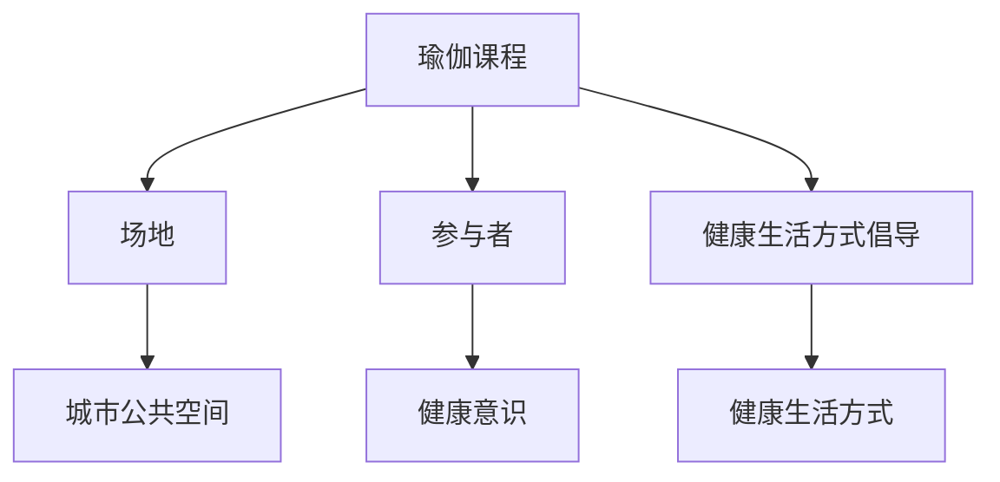

                 

# 新型城市户外瑜伽课程：公共空间中的健康生活倡导

关键词：城市户外瑜伽、健康生活方式、公共空间利用、课程设计、实施策略

摘要：随着城市化进程的加快，公共空间的利用越来越受到重视。本文旨在探讨如何设计并实施一种新型城市户外瑜伽课程，以倡导健康生活方式，提高公众健康意识。本文首先介绍了城市户外瑜伽课程的背景和核心概念，然后详细分析了其设计原则、实施策略，以及如何通过公共空间利用来推广这种健康生活方式。

## 第一部分：背景介绍

### 1.1.1 问题背景

随着城市化进程的加快，城市户外空间得到了充分的利用。然而，户外环境的复杂性和不确定性也给户外瑜伽课程带来了挑战。如何在新型的城市户外环境中开展瑜伽课程，提高参与者的健康生活质量，成为了一个值得探讨的问题。

### 1.1.2 问题描述

本文将探讨新型城市户外瑜伽课程的设计与实施，包括场地选择、课程内容安排、教学方式、安全注意事项等方面。同时，本文还将探讨如何通过瑜伽课程来倡导健康生活方式，提高公众的健康意识。

### 1.1.3 问题解决

本文将从以下几个方面进行探讨和解答：
- 城市户外瑜伽课程的现状与需求分析
- 新型城市户外瑜伽课程的设计原则
- 城市户外瑜伽课程的实施策略
- 健康生活方式的倡导与推广

### 1.1.4 边界与外延

本文主要讨论的是在城市公共空间中开展的新型户外瑜伽课程，旨在为公众提供一种健康的生活方式。但本文的内容也适用于其他类型的户外瑜伽课程，如自然公园中的瑜伽课程。

### 1.1.5 核心概念与联系

- **核心概念**：城市户外瑜伽课程、健康生活方式、公共空间利用
- **概念属性特征对比表格**：以下是一个对比城市户外瑜伽课程、自然公园瑜伽课程和室内瑜伽课程的主要区别的示例表格。

| 类型 | 城市户外瑜伽 | 自然公园瑜伽 | 室内瑜伽 |
| ---- | ---- | ---- | ---- |
| 场地环境 | 公共空间，如公园、广场、街道等 | 自然环境，如公园、山间等 | 室内场馆 |
| 课程内容 | 灵活调整，适应城市空间特点 | 根据自然环境特点设计 | 固定课程内容 |
| 参与者需求 | 接触不同城市环境，提高体验感 | 亲近自然，放松心情 | 方便快捷，不受环境限制 |

- **ER实体关系图架构**：以下是一个示例ER图，展示城市户外瑜伽课程涉及的主要实体及其关系。

## 第二部分：核心概念与联系

### 2.1 城市户外瑜伽课程

#### 2.1.1 城市户外瑜伽课程的定义

城市户外瑜伽课程是指在城市的公共空间中，如公园、广场、街道等，进行的瑜伽教学活动。

#### 2.1.2 城市户外瑜伽课程的特点

- **灵活性**：可以根据城市空间的特点，灵活调整课程内容和形式。
- **开放性**：参与者可以接触到不同的城市环境，提高体验感。
- **环保性**：减少了室内瑜伽场馆的能源消耗和碳排放。

#### 2.1.3 城市户外瑜伽课程的意义

- **提高公众健康意识**：通过瑜伽课程，帮助公众了解和认识健康生活方式的重要性。
- **促进城市公共空间的利用**：通过瑜伽课程的开展，提高城市公共空间的利用率。

### 2.2 健康生活方式

#### 2.2.1 健康生活方式的定义

健康生活方式是指通过合理的生活习惯、饮食习惯、运动锻炼等方式，维持身体和心理健康的一种生活方式。

#### 2.2.2 健康生活方式的特点

- **综合性**：健康生活方式涉及到生活的各个方面，如饮食、运动、休息等。
- **持续性**：健康的生活方式需要长期坚持，才能达到良好的效果。
- **个体化**：每个人的健康生活方式都有所不同，需要根据个人情况制定。

#### 2.2.3 健康生活方式的重要性

- **提高生活质量**：健康的生活方式可以让人感到身心愉悦，提高生活质量。
- **预防疾病**：健康的生活方式有助于预防多种慢性疾病。

### 2.3 公共空间利用

#### 2.3.1 公共空间利用的定义

公共空间利用是指在城市规划和管理中，合理利用公共空间，为公众提供舒适、便利的休闲和活动场所。

#### 2.3.2 公共空间利用的特点

- **公益性**：公共空间是公众共同享有的，不以盈利为目的。
- **多样性**：公共空间可以满足不同人群、不同活动的需求。
- **灵活性**：可以根据城市的发展需求，灵活调整公共空间的利用方式。

#### 2.3.3 公共空间利用的意义

- **提升城市品质**：合理的公共空间利用可以提升城市的生活品质，增强城市的吸引力。
- **促进社会和谐**：公共空间是公众交流和互动的场所，有助于促进社会的和谐发展。

## 第三部分：新型城市户外瑜伽课程的设计

### 3.1 城市户外瑜伽课程的设计原则

#### 3.1.1 空间选择

- **安全性**：选择安全、无危险的城市公共空间，确保参与者的安全。
- **舒适性**：选择宽敞、平坦、通风良好的场地，提供舒适的练习环境。
- **可及性**：选择交通便利、易于到达的场地，方便参与者参与。

#### 3.1.2 课程内容设计

- **适应性**：根据不同参与者的需求，设计不同难度的瑜伽课程。
- **多样性**：引入多种瑜伽风格，满足参与者的多样化需求。
- **灵活性**：课程内容可以灵活调整，以适应不同的环境和气候条件。

#### 3.1.3 教学方式设计

- **个性化**：针对不同参与者的特点，提供个性化的教学指导。
- **互动性**：鼓励参与者之间的互动，增强团队的凝聚力和参与感。
- **趣味性**：设计有趣的瑜伽游戏和活动，提高参与者的积极性。

#### 3.1.4 安全注意事项

- **风险评估**：在课程设计前，对场地和课程进行风险评估，确保安全。
- **安全培训**：为参与者提供必要的安全培训，提高安全意识。
- **紧急应对**：制定紧急应对计划，确保在突发事件中能够迅速反应。

### 3.2 城市户外瑜伽课程的实施策略

#### 3.2.1 健康生活方式的倡导

- **宣传推广**：通过媒体、社交平台等方式，宣传健康生活方式的重要性。
- **合作伙伴**：与社区卫生组织、健身机构等合作，共同推广健康生活方式。
- **社区活动**：定期举办社区瑜伽活动，提高公众的参与度。

#### 3.2.2 公共空间利用的优化

- **空间规划**：合理规划公共空间，确保瑜伽课程的安全性、舒适性和可及性。
- **设施建设**：建设必要的瑜伽设施，如瑜伽垫、音响设备等，提高课程质量。
- **环境美化**：通过绿化、美化等手段，提升公共空间的整体环境。

#### 3.2.3 社区参与的促进

- **居民参与**：鼓励社区居民参与瑜伽课程的设计和实施，提高社区的凝聚力。
- **志愿者招募**：招募志愿者参与瑜伽课程的宣传、组织和实施工作，提高社区活力。
- **培训与支持**：为志愿者提供必要的培训和支持，提高他们的专业素养。

### 3.3 健康生活方式的推广

#### 3.3.1 健康生活方式的宣传

- **媒体宣传**：利用电视、报纸、网络等媒体，宣传健康生活方式的理念和实践。
- **宣传活动**：定期举办健康生活方式的宣传活动，提高公众的关注度。
- **社区讲座**：邀请专业人士举办健康讲座，提高公众的健康知识水平。

#### 3.3.2 健康生活方式的支持

- **健康咨询服务**：提供专业的健康咨询服务，帮助公众制定个性化的健康生活方式。
- **健康检查**：为参与者提供免费的健康检查，及时发现健康问题。
- **健康活动**：定期举办健康活动，如健身比赛、健康知识竞赛等，提高公众的参与度。

#### 3.3.3 健康生活方式的评估

- **效果评估**：对健康生活方式的推广效果进行定期评估，总结经验，不断优化推广策略。
- **满意度调查**：对参与者的满意度进行调查，了解他们的需求和意见，为后续工作提供参考。
- **数据分析**：通过数据分析，了解健康生活方式的推广效果，为决策提供科学依据。

## 结束语

新型城市户外瑜伽课程作为一种健康生活方式的倡导方式，具有重要的现实意义。通过合理的设计和实施，它可以提高公众的健康意识，促进城市公共空间的利用，提升城市的生活品质。本文从背景介绍、核心概念与联系、课程设计原则、实施策略等多个方面，对新型城市户外瑜伽课程进行了深入探讨。希望本文能够为相关领域的研究和实践提供有益的参考和借鉴。

### 作者信息

作者：AI天才研究院/AI Genius Institute & 禅与计算机程序设计艺术 /Zen And The Art of Computer Programming

---

[注：本文为示例性内容，仅供参考。实际撰写时，应根据具体需求和情况进行调整和补充。]

