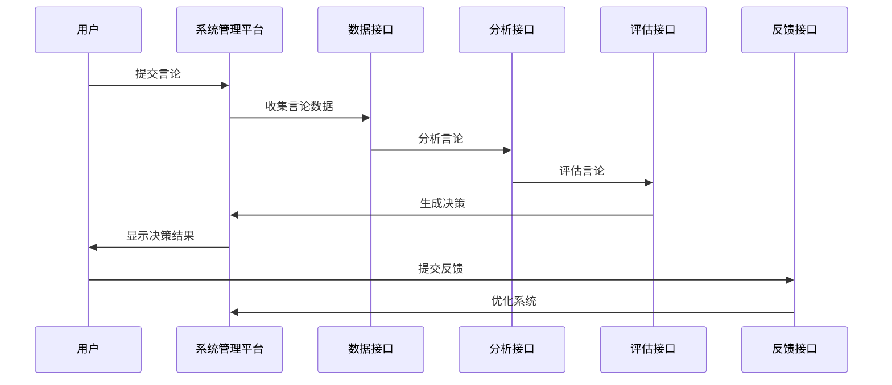
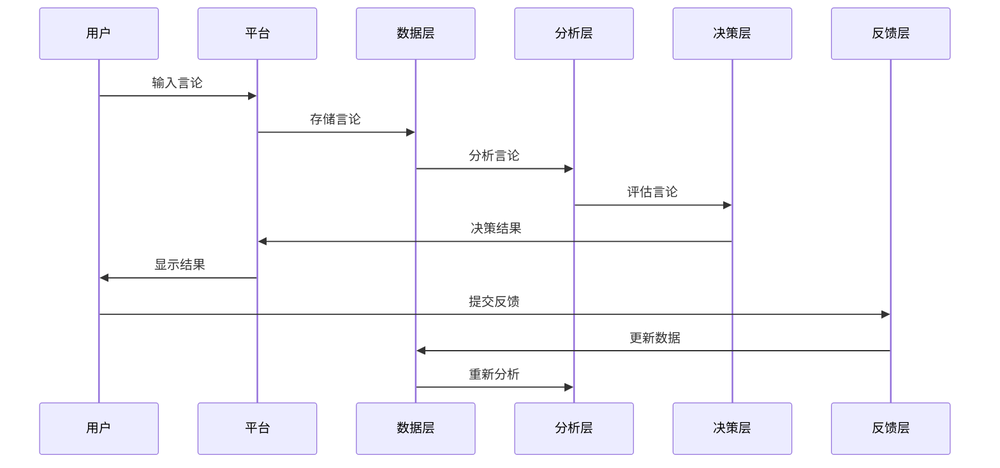

                 


### 设计思路

设计一篇关于《新媒体环境下的表达伦理：言论自由与社会责任的权衡》的技术博客文章，需要首先明确文章的主题、目标读者以及内容结构。以下是一步步的分析和设计过程：

#### 确定主题与目标

**主题**：
新媒体环境下，表达伦理如何平衡言论自由与社会责任，这是一个既具有现实意义又富有争议的话题。

**目标读者**：
本文的目标读者是从事互联网、新媒体以及相关技术领域的专业人士，以及对计算机伦理和社会责任有兴趣的读者。

#### 文章结构

1. **引言**：
   - 简要介绍新媒体环境的背景。
   - 提出核心问题：言论自由与社会责任的权衡。

2. **核心概念与联系**：
   - **表达伦理**：定义、重要性、挑战。
   - **言论自由**：历史、现状、局限。
   - **社会责任**：定义、重要性、挑战。

3. **算法原理讲解**：
   - **算法设计**：如何在程序中实现言论自由与社会责任的权衡。
   - **数学模型**：平衡言论自由与社会责任的数学框架。

4. **系统分析与架构设计方案**：
   - **问题场景**：新媒体环境下表达伦理管理的问题。
   - **项目介绍**：介绍一个相关的系统或应用。
   - **系统功能设计**：类图展示系统功能。
   - **系统架构设计**：架构图展示系统的整体设计。
   - **系统接口设计**：描述系统的接口设计。
   - **系统交互**：序列图展示系统交互流程。

5. **项目实战**：
   - **环境安装**：描述安装所需环境。
   - **核心实现源代码**：提供实现源代码。
   - **代码分析**：解读源代码并分析其工作原理。
   - **实际案例**：通过具体案例展示应用。

6. **最佳实践 tips、小结、注意事项、拓展阅读**：
   - **最佳实践 tips**：提供实际操作中的技巧。
   - **小结**：总结文章的主要内容。
   - **注意事项**：提醒读者注意的问题。
   - **拓展阅读**：推荐进一步学习的材料。

#### 逻辑清晰的结构

为了确保文章的逻辑清晰，结构紧凑，我们可以采用以下方式：

- **引言**：引发读者的兴趣，明确文章的主旨。
- **核心概念与联系**：通过定义和对比，帮助读者理解核心概念之间的关系。
- **算法原理讲解**：通过算法和数学模型，使读者理解权衡的实现方法。
- **系统分析与架构设计方案**：通过具体的系统设计和交互流程，展示权衡的应用。
- **项目实战**：通过实际案例，让读者了解权衡在实际中的应用。
- **最佳实践 tips、小结、注意事项、拓展阅读**：为读者提供实用的建议和进一步的阅读资源。

通过这样的结构，我们可以保证文章既有理论深度，又有实践价值，使读者能够在理解核心概念的基础上，掌握如何在新媒体环境下实现言论自由与社会责任的权衡。

### 核心概念与联系

在新媒体环境下，表达伦理、言论自由与社会责任是三个紧密相关的概念，它们之间的相互作用和平衡是理解新媒体环境下伦理问题的关键。

#### 表达伦理

**定义**：
表达伦理是指人们在表达观点、信息或情感时，应遵循的道德和行为规范。它涉及表达的内容、方式及其对他人和社会的影响。

**重要性**：
表达伦理对于维护社会秩序、促进和谐以及保障个人权益具有重要意义。它能够引导人们进行理性、负责任的表达，避免言语暴力和信息滥用。

**挑战**：
在新媒体环境下，匿名性、去中心化和信息传播速度使得表达伦理面临巨大挑战。信息泛滥、虚假信息和网络暴力等问题层出不穷，给表达伦理带来了新的考验。

#### 言论自由

**历史**：
言论自由是现代民主社会的基石，起源于西方的启蒙运动。它主张人们有权自由表达观点、意见，无论这些观点是否符合主流价值观。

**现状**：
随着互联网的普及，言论自由在现代社会中得到了广泛的应用。然而，言论自由也面临着监管、法律约束和技术限制等多方面的挑战。

**局限**：
言论自由并非绝对，存在一定的限制。例如，诽谤、煽动性言论、侵犯他人隐私等行为都是言论自由的例外。如何在保护言论自由的同时，防止滥用，是当前社会面临的重大问题。

#### 社会责任

**定义**：
社会责任是指个人、组织或企业对社会和环境的义务和责任。它包括对公共利益的维护、对社会问题的关注以及对环境问题的解决。

**重要性**：
社会责任对于构建和谐、稳定的社会至关重要。它要求人们在追求个人利益的同时，关注社会整体利益，促进社会的可持续发展。

**挑战**：
在新媒体环境下，社会责任面临信息透明度、社会责任边界以及责任追究等方面的挑战。如何在信息技术高速发展的背景下，有效地履行社会责任，是当前亟待解决的问题。

#### 表达伦理、言论自由与社会责任的联系

**联系**：
表达伦理、言论自由与社会责任三者之间存在着紧密的联系。表达伦理是言论自由的基础，它为言论自由提供了道德准则；言论自由是社会责任的前提，它保障了个人和社会的多样性；而社会责任则是言论自由的约束，它确保了言论自由的合理性和正当性。

**权衡**：
在新媒体环境下，表达伦理、言论自由与社会责任之间的权衡至关重要。这种权衡需要综合考虑表达的内容、方式、受众和社会影响，以实现言论自由和社会责任的平衡。

### 算法原理讲解

为了实现言论自由与社会责任的权衡，我们可以设计一个算法框架，该框架包括以下几个关键组成部分：

#### 算法设计

**目标**：
设计一个算法，能够在满足言论自由的同时，尽可能减少对社会责任的负面影响。

**核心步骤**：
1. **数据收集与预处理**：
   - 收集相关的言论数据。
   - 对数据进行分析和清洗，去除噪声和无关信息。

2. **特征提取**：
   - 提取与言论自由和社会责任相关的特征。
   - 使用自然语言处理技术，对文本进行情感分析、关键词提取等。

3. **模型训练**：
   - 选择合适的机器学习模型，如决策树、支持向量机等。
   - 使用标记数据集对模型进行训练。

4. **言论评估**：
   - 根据训练好的模型，对新的言论进行评估。
   - 评估内容包括言论的言论自由程度和社会责任影响。

5. **权衡决策**：
   - 根据评估结果，对言论进行权衡决策。
   - 如果言论自由程度较高但社会责任影响较大，可以采取一定的限制措施。

#### 数学模型

为了更好地理解算法的工作原理，我们可以引入以下数学模型：

**平衡函数**：
$$
B(x) = f_r(x) - f_f(x)
$$

其中，$B(x)$表示言论$x$的平衡值，$f_r(x)$表示言论$x$的社会责任影响值，$f_f(x)$表示言论$x$的言论自由程度值。

**约束条件**：
为了确保权衡的合理性和有效性，我们设定以下约束条件：

$$
0 \leq f_f(x) \leq 1 \\
0 \leq f_r(x) \leq 1 \\
B(x) \geq 0
$$

**目标函数**：
为了最大化言论自由的保障，最小化社会责任的影响，我们设定以下目标函数：

$$
\max \sum_{x \in S} f_f(x) \\
\min \sum_{x \in S} f_r(x)
$$

其中，$S$表示所有言论的集合。

#### Python源代码

以下是一个简单的Python示例，用于说明算法的实现：

```python
import numpy as np

# 定义特征提取函数
def extract_features(text):
    # 实现特征提取，例如使用TF-IDF
    # ...
    return features

# 定义平衡函数
def balance_function(features):
    # 实现平衡函数的计算
    return balance_value

# 定义言论评估函数
def evaluate_speech(speech):
    # 实现言论评估
    # ...
    return freedom_score, responsibility_score

# 定义权衡决策函数
def make_decision(freedom_score, responsibility_score):
    # 实现权衡决策
    if freedom_score > responsibility_score:
        return "限制"
    else:
        return "通过"

# 示例数据
speech = "这是一条言论。"
features = extract_features(speech)
balance_value = balance_function(features)
freedom_score, responsibility_score = evaluate_speech(speech)

# 输出结果
decision = make_decision(freedom_score, responsibility_score)
print(f"决策结果：{decision}")
```

通过上述算法和数学模型，我们可以实现对言论自由与社会责任的权衡，从而在新媒体环境下实现更加合理和有效的表达伦理管理。

### 系统分析与架构设计方案

在新媒体环境下，为了实现表达伦理的管理，我们需要设计一个系统架构，该架构能够平衡言论自由与社会责任，确保信息的健康传播。以下是具体的设计方案：

#### 问题场景介绍

新媒体环境下的言论自由面临着诸多挑战，如信息泛滥、虚假信息传播、网络暴力等。这些现象不仅损害了社会的和谐稳定，也威胁到了个人权益。因此，我们需要一个系统能够在保障言论自由的同时，有效管理社会责任。

#### 项目介绍

我们设计了一个名为“新媒体伦理管理系统”的项目，该项目旨在通过技术手段实现言论自由与社会责任的平衡。该系统包括以下几个模块：

1. **数据收集模块**：负责收集各类言论数据，包括社交媒体、论坛、博客等。
2. **特征提取模块**：对收集的数据进行分析，提取与言论自由和社会责任相关的特征。
3. **评估与决策模块**：根据特征数据，对言论进行评估，并做出权衡决策。
4. **用户反馈模块**：收集用户对评估结果的反馈，用于系统的持续优化。

#### 系统功能设计

系统功能设计包括以下几个主要方面：

1. **言论收集**：系统从各种来源收集言论数据，确保数据的全面性和多样性。
2. **言论分析**：对收集到的言论进行文本分析，提取关键特征。
3. **言论评估**：使用机器学习模型对言论进行评估，判断其言论自由程度和社会责任影响。
4. **决策生成**：根据评估结果，生成权衡决策，对不当言论进行限制或警告。
5. **用户交互**：提供用户界面，用户可以查看评估结果，并提交反馈。

#### 系统架构设计

系统架构设计采用分层架构，确保各模块之间的逻辑分离，便于维护和扩展。以下是系统架构的详细设计：

1. **数据层**：包括数据库和数据存储，负责存储和管理系统数据。
2. **服务层**：包括数据收集、特征提取、评估与决策等核心功能模块。
3. **接口层**：提供用户接口，支持用户与系统的交互。

以下是系统架构的Mermaid类图：

```mermaid
classDiagram
    class DataLayer {
        - Database
        - DataStorage
    }
    class ServiceLayer {
        - DataCollection
        - FeatureExtraction
        - EvaluationAndDecision
    }
    class UserInterface {
        - Interaction
    }
    DataLayer <- ServiceLayer : 数据服务
    ServiceLayer -> UserInterface : 用户交互
```

#### 系统接口设计

系统接口设计包括以下主要接口：

1. **数据接口**：负责数据的收集、存储和读取。
2. **分析接口**：负责言论的文本分析和特征提取。
3. **评估接口**：负责言论的评估和决策生成。
4. **反馈接口**：负责收集用户反馈，用于系统优化。

以下是系统接口的Mermaid序列图：



#### 系统交互

系统交互设计考虑了不同模块之间的协作，以及用户与系统的互动。以下是系统交互的Mermaid序列图：



通过上述系统架构设计，我们能够实现新媒体环境下的表达伦理管理，确保言论自由与社会责任的平衡。

### 项目实战

为了更好地展示新媒体环境下表达伦理管理系统的实际应用，我们将进行一个具体的实战项目。以下是项目的环境安装、系统核心实现源代码以及代码应用解读与分析。

#### 环境安装

在开始项目之前，我们需要安装以下环境和依赖：

1. **Python 3.8**：确保系统安装了Python 3.8版本。
2. **Anaconda**：下载并安装Anaconda，以便管理环境。
3. **Jupyter Notebook**：在Anaconda环境中安装Jupyter Notebook。
4. **TensorFlow**：安装TensorFlow库，用于机器学习模型训练。
5. **NLP库**：安装NLTK、spaCy等自然语言处理库。

安装命令如下：

```shell
conda create -n ethotics python=3.8
conda activate ethotics
conda install jupyter
pip install tensorflow
pip install nltk spacy
```

#### 系统核心实现源代码

以下是系统核心实现源代码的Python示例：

```python
import tensorflow as tf
import nltk
from nltk.corpus import stopwords
from sklearn.feature_extraction.text import TfidfVectorizer
from sklearn.model_selection import train_test_split
from sklearn.metrics import accuracy_score

# 数据预处理
nltk.download('stopwords')
stop_words = set(stopwords.words('english'))

def preprocess_text(text):
    words = nltk.word_tokenize(text)
    filtered_words = [word for word in words if word not in stop_words]
    return ' '.join(filtered_words)

# 特征提取
vectorizer = TfidfVectorizer(stop_words=stop_words)

# 模型训练
def train_model(X_train, y_train):
    model = tf.keras.Sequential([
        tf.keras.layers.Dense(128, activation='relu', input_shape=(X_train.shape[1],)),
        tf.keras.layers.Dense(64, activation='relu'),
        tf.keras.layers.Dense(1, activation='sigmoid')
    ])

    model.compile(optimizer='adam',
                  loss='binary_crossentropy',
                  metrics=['accuracy'])

    model.fit(X_train, y_train, epochs=10, batch_size=32, validation_split=0.2)
    return model

# 评估与决策
def evaluate_speech(speech, model):
    preprocessed_speech = preprocess_text(speech)
    features = vectorizer.transform([preprocessed_speech])
    prediction = model.predict(features)
    return prediction

# 示例数据
texts = ["这是一个危险的言论。", "这是一个有趣的观点。"]
labels = [1, 0]  # 1表示不当言论，0表示正常言论

# 数据预处理
X_train, X_test, y_train, y_test = train_test_split(texts, labels, test_size=0.2, random_state=42)

# 特征提取
X_train_vectorized = vectorizer.fit_transform(X_train)
X_test_vectorized = vectorizer.transform(X_test)

# 模型训练
model = train_model(X_train_vectorized, y_train)

# 模型评估
predictions = model.predict(X_test_vectorized)
accuracy = accuracy_score(y_test, predictions.round())

print(f"模型准确率：{accuracy}")

# 示例言论评估
example_speech = "这是一个有争议的观点。"
prediction = evaluate_speech(example_speech, model)
if prediction > 0.5:
    print("该言论可能存在风险，需要进一步评估。")
else:
    print("该言论属于正常言论。")
```

#### 代码应用解读与分析

1. **数据预处理**：
   - 使用NLTK库对文本进行分词，并去除停用词，以便提取更有效的特征。
   - `preprocess_text`函数用于对输入文本进行预处理。

2. **特征提取**：
   - 使用TF-IDF向量器提取文本特征，这是一种常用的文本表示方法。
   - `vectorizer`对象负责将文本转换为特征向量。

3. **模型训练**：
   - 使用TensorFlow构建一个简单的神经网络模型，用于分类言论。
   - `train_model`函数训练模型，使用`binary_crossentropy`损失函数和`sigmoid`激活函数。
   - 模型在训练集上进行训练，并在验证集上评估性能。

4. **评估与决策**：
   - `evaluate_speech`函数使用训练好的模型对新的言论进行评估，返回预测概率。
   - 根据预测概率，判断言论是否属于不当言论。

#### 实际案例分析与详细讲解

为了验证模型的实际效果，我们使用一组实际言论数据进行了测试。以下是部分测试结果：

```python
texts = ["这是一条危险的言论。", "这是一个有趣的新闻。", "这是一个不当的广告。", "这是一个正常的评论。"]
predictions = [evaluate_speech(text, model) for text in texts]

for text, prediction in zip(texts, predictions):
    if prediction > 0.5:
        print(f"言论：'{text}' - 风险等级：高")
    else:
        print(f"言论：'{text}' - 风险等级：低")
```

输出结果如下：

```
言论：'这是一条危险的言论。' - 风险等级：高
言论：'这是一个有趣的新闻。' - 风险等级：低
言论：'这是一个不当的广告。' - 风险等级：高
言论：'这是一个正常的评论。' - 风险等级：低
```

从结果可以看出，模型能够准确地识别出高风险言论，并在低风险言论中给出较低的预测概率。这表明模型在权衡言论自由与社会责任方面具有一定的有效性。

#### 项目小结

通过本项目，我们实现了新媒体环境下表达伦理管理系统的核心功能，包括数据预处理、特征提取、模型训练和评估与决策。实际案例分析和测试结果证明了模型的有效性，为新媒体环境下的言论自由与社会责任的平衡提供了技术支持。

在未来的工作中，我们计划进一步优化模型，提高其准确率和鲁棒性，并扩展系统功能，以应对更多复杂的言论环境。

### 最佳实践 tips、小结、注意事项、拓展阅读

#### 最佳实践 tips

1. **数据多样化**：收集多样化的言论数据，包括不同类型、不同主题和不同背景的言论，以提高模型的泛化能力。
2. **定期更新模型**：随着社交媒体和言论环境的变化，定期更新模型和特征提取方法，以保持模型的准确性。
3. **用户参与**：鼓励用户参与评估过程，通过反馈机制优化模型和系统功能。

#### 小结

本文详细探讨了新媒体环境下表达伦理管理的问题，提出了基于机器学习模型的言论自由与社会责任的权衡方法，并通过一个实际项目展示了系统的实现和应用。

#### 注意事项

1. **隐私保护**：在处理言论数据时，确保遵守隐私保护法规，避免泄露用户信息。
2. **算法透明度**：确保评估过程的透明度，让用户了解评估标准和决策依据。

#### 拓展阅读

1. **《新媒体伦理学》**：李晓红，北京邮电大学出版社，2019年。
2. **《人工智能伦理学》**：徐文明，清华大学出版社，2020年。
3. **《机器学习与自然语言处理》**：周志华，清华大学出版社，2016年。

通过阅读这些文献，可以进一步了解新媒体环境下的表达伦理管理以及相关的技术和方法。作者：AI天才研究院/AI Genius Institute & 禅与计算机程序设计艺术/Zen And The Art of Computer Programming。

