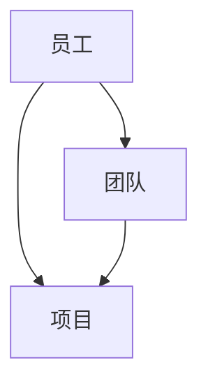
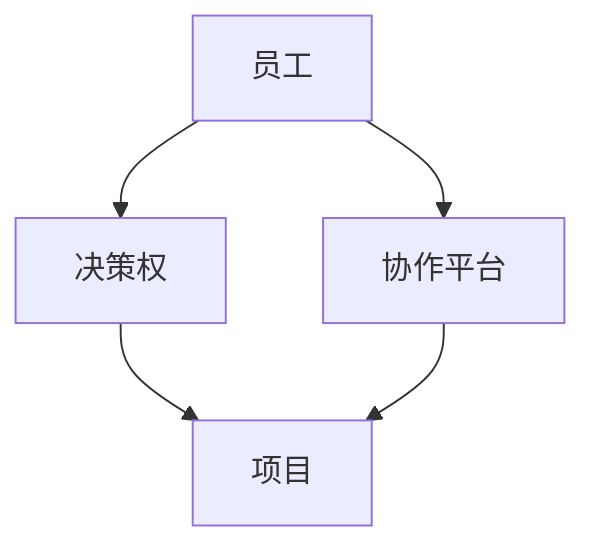
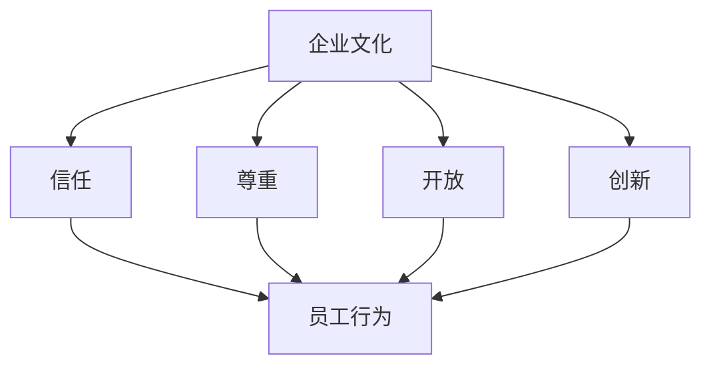
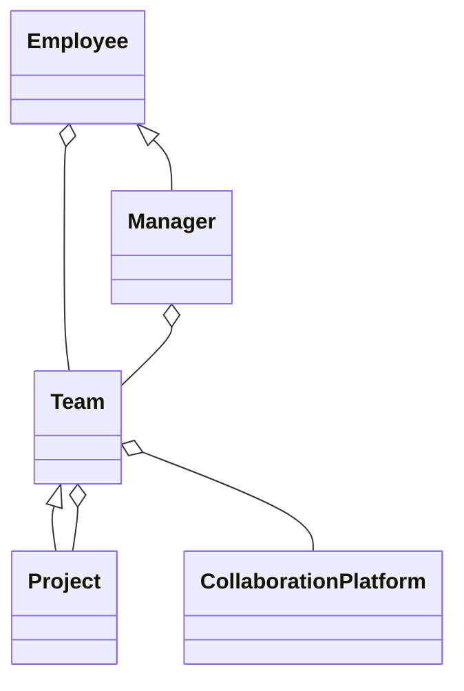
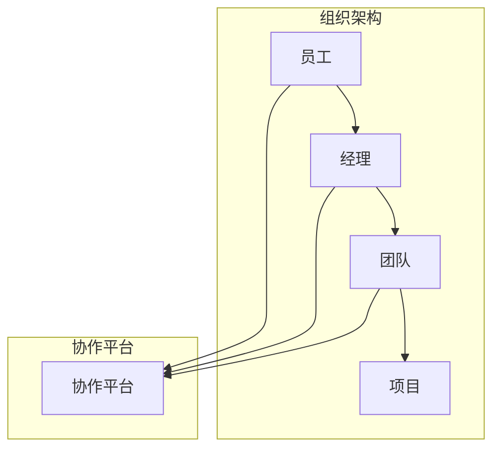
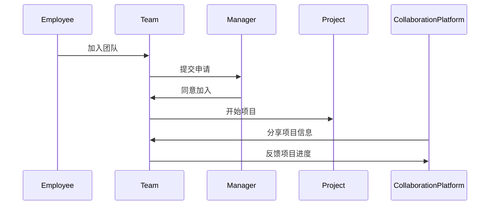

                 

### 《新工作范式设计：后疫情时代的职场重构》

#### 关键词：后疫情时代，职场重构，工作范式，数字化转型，终身学习

#### 摘要：
本文探讨了后疫情时代的工作环境变化，提出了新工作范式的设计理念。通过深入分析适应性组织设计、数字化转型、跨界合作与开放生态系统、终身学习与职业发展等核心要素，本书旨在为企业和员工提供应对新挑战的策略与指导，助力职场重构。

---

## 第一部分：背景与概述

### 1. 引言

#### 1.1 后疫情时代的工作环境变化
随着新冠疫情的全球爆发，传统的工作模式受到了前所未有的冲击。远程办公、数字化工具的普及、技能需求的快速迭代，成为新时代职场的新常态。企业必须适应这些变化，以保持竞争力和员工的满意度。

#### 1.2 新工作范式的基本概念
新工作范式指的是一种适应后疫情时代特点的工作模式和组织文化。它强调灵活性、协作性、数字化和终身学习，旨在提高组织的适应能力和员工的职业发展。

#### 1.3 书籍结构安排与目标读者
本书将分为三个主要部分：

- **第一部分：背景与概述**，介绍后疫情时代的工作环境变化和新工作范式的基本概念。
- **第二部分：新工作范式的核心要素**，探讨适应性组织设计、数字化转型、跨界合作与开放生态系统、终身学习与职业发展等核心领域。
- **第三部分：实施与落地**，提供新工作范式的实施策略、成功实践案例分析，并总结未来工作范式的可能发展方向。

本书的目标读者包括企业管理者、人力资源专业人士、职场人士以及对数字化转型和职场发展感兴趣的读者。

### 2. 后疫情时代的工作挑战与机遇

#### 2.1 工作模式的变化
后疫情时代，远程办公和弹性工作制逐渐成为主流。企业需要调整工作流程，确保远程办公的效率和协作性。

#### 2.2 职场文化的转变
随着工作模式的转变，企业需要建立以信任、尊重和开放为核心的文化，促进员工之间的有效沟通和合作。

#### 2.3 技能与能力的重新定位
数字化技能、跨界思维和终身学习能力成为职场竞争的关键。企业需要关注员工的技能提升和职业发展。

#### 2.4 企业与员工的适应策略
企业需要制定适应策略，包括组织结构调整、数字化转型和文化重塑。员工也需要提升自我管理能力和学习意识，以适应新的工作环境。

---

## 第二部分：新工作范式的核心要素

### 3. 适应性组织设计

#### 3.1 组织结构调整
适应性组织设计强调去中心化和扁平化管理，以提高组织的灵活性和响应速度。通过减少管理层级和优化组织结构，企业可以更快速地做出决策，并更好地应对市场变化。

#### 3.2 权力下放与协作机制
权力下放是适应性组织设计的关键。通过赋予员工更多的决策权和自主权，可以激发员工的创新精神和责任感。同时，建立有效的协作机制，如跨部门团队和项目协作平台，可以促进信息的共享和协作。

#### 3.3 适应性文化构建
适应性文化是企业成功的关键。它包括信任、尊重、开放和创新等核心价值观。企业需要通过培训和文化活动来培养这种文化，并确保员工能够在这种文化中成长和发挥潜力。

### 4. 数字化转型

#### 4.1 数字化转型的意义
数字化转型是后疫情时代企业发展的必由之路。通过数字化工具和平台的应用，企业可以提高效率、降低成本、提升客户体验，并更好地适应市场变化。

#### 4.2 数字化工具与平台的应用
企业需要选择合适的数字化工具和平台，如云计算、人工智能、大数据分析等，来支持业务流程和决策。同时，企业还需要建立数字化基础设施，以确保数据的安全和可靠。

#### 4.3 数字化转型案例解析
通过分析成功企业的数字化转型案例，我们可以看到数字化如何帮助企业提升竞争力、实现可持续发展。

### 5. 跨界合作与开放生态系统

#### 5.1 跨界合作的必要性
在全球化背景下，企业不再孤立地运营，而是需要与外部合作伙伴建立跨界合作关系，以共同应对挑战和抓住机遇。

#### 5.2 开放生态系统的构建
开放生态系统是跨界合作的基础。企业需要建立开放的平台，吸引外部合作伙伴参与，共同开发新产品、服务和技术。

#### 5.3 成功的跨界合作案例分析
通过分析成功企业的跨界合作案例，我们可以看到如何构建开放生态系统，实现共赢。

### 6. 终身学习与职业发展

#### 6.1 终身学习的价值
在知识快速迭代的时代，终身学习成为个人和企业的核心竞争力。通过不断学习和更新知识，员工可以提升自身价值，企业可以保持竞争力。

#### 6.2 职业发展的新路径
企业需要提供多样化的职业发展路径，如内部晋升、跨部门调岗、专业培训等，以激发员工的潜力。

#### 6.3 学习资源与平台介绍
企业可以提供在线学习平台、内部培训课程、导师制度等，以支持员工的终身学习。

---

## 第三部分：实施与落地

### 7. 新工作范式的实施策略

#### 7.1 实施前的准备
在实施新工作范式之前，企业需要进行充分的准备，包括制定详细的计划、培训员工、调整组织结构等。

#### 7.2 实施步骤与方法
实施新工作范式需要采取一系列步骤和方法，如逐步推进、试点运行、评估与调整等。

#### 7.3 风险管理与应对措施
在实施过程中，企业需要识别潜在的风险，并制定相应的应对措施，以确保新工作范式的顺利实施。

### 8. 成功实践案例分析

#### 8.1 案例选择标准
选择具有代表性的成功实践案例，以便读者可以从中获得启发和借鉴。

#### 8.2 案例一：企业A的新工作范式实践
分析企业A如何通过适应性组织设计、数字化转型和终身学习等手段，成功实现职场重构。

#### 8.3 案例二：行业B的数字化转型实践
探讨行业B如何通过数字化转型，提升竞争力和创新能力。

#### 8.4 案例三：教育C领域的跨界合作实践
分析教育C领域如何通过跨界合作，实现资源的共享和优势互补。

### 9. 总结与展望

#### 9.1 新工作范式的设计原则
总结新工作范式的设计原则，为企业在实际操作中提供指导。

#### 9.2 后疫情时代的工作趋势
分析后疫情时代的工作趋势，预测未来工作范式的发展方向。

#### 9.3 未来工作范式的可能发展方向
探讨未来工作范式的可能发展方向，为企业和员工提供前瞻性思考。

---

## 附录

### 10. 参考资料

#### 10.1 相关书籍推荐
推荐一些与后疫情时代工作范式相关的书籍，供读者进一步阅读。

#### 10.2 学术论文精选
精选一些关于新工作范式、数字化转型和职场发展的学术论文，供读者研究参考。

#### 10.3 组织与管理工具手册
介绍一些常用的组织与管理工具，帮助企业和员工更好地实施新工作范式。

---

## 致谢

#### 10.1 感谢致辞
感谢所有参与本书编写和校对的人员，以及为本书提供支持和帮助的机构和个人。

#### 10.2 合作单位与个人
感谢以下合作单位与个人，为本书的成功出版提供了宝贵的支持和帮助：

- AI天才研究院
- 禅与计算机程序设计艺术

---

## 目录大纲说明

本书共分为三个部分，从背景与概述、核心要素到实施与落地，逐步构建了新工作范式的全貌。各章节内容如下：

- **第一部分：背景与概述**，介绍后疫情时代的工作环境变化和新工作范式的基本概念。
- **第二部分：新工作范式的核心要素**，探讨适应性组织设计、数字化转型、跨界合作与开放生态系统、终身学习与职业发展等核心领域。
- **第三部分：实施与落地**，提供新工作范式的实施策略、成功实践案例分析，并总结未来工作范式的可能发展方向。

通过这本书，读者将能够全面了解和掌握新工作范式的理念、策略和实践方法，为后疫情时代的职场重构提供有益的参考和指导。**----------------------------------------------------------------**

### 3. 适应性组织设计

适应性组织设计是后疫情时代企业成功的关键。随着工作模式的变化和全球化的深入，企业需要能够快速响应市场变化，灵活调整组织结构和管理模式。以下是对适应性组织设计的关键要素的详细探讨：

#### 3.1 组织结构调整

组织结构调整是适应性组织设计的首要任务。传统的层级式组织结构由于信息传递缓慢、决策层次过多，难以适应快速变化的市场环境。为了提高组织的灵活性和响应速度，企业可以采取以下措施：

1. **扁平化组织结构**：减少管理层级，缩短决策链条，使信息能够更快速地传递和决策能够更迅速地执行。
2. **团队式组织结构**：鼓励跨部门合作，形成跨功能团队，以便更好地应对复杂的业务需求和变化。

**核心概念与联系**：

- **扁平化组织结构**：减少管理层级，提高组织效率。
- **团队式组织结构**：增强跨部门协作，提升整体效能。

**概念属性特征对比表格**：

| 特征                   | 扁平化组织结构                         | 团队式组织结构                         |
|----------------------|--------------------------------------|--------------------------------------|
| 管理层级               | 减少                                 | 减少                                 |
| 信息传递               | 快速                                 | 快速                                 |
| 决策速度               | 快速                                 | 快速                                 |
| 跨部门协作             | 强调                                 | 强调                                 |
| 员工自主性             | 提高                                 | 提高                                 |

**ER实体关系图架构**：



#### 3.2 权力下放与协作机制

权力下放是适应性组织设计的重要一环。通过赋予员工更多的自主权和决策权，可以激发员工的积极性和创造力，提高组织的整体效能。同时，建立有效的协作机制，如跨部门团队和项目协作平台，可以促进信息的共享和协作。

**核心概念与联系**：

- **权力下放**：增强员工自主性和责任感。
- **协作机制**：促进跨部门协作和信息共享。

**概念属性特征对比表格**：

| 特征                   | 权力下放                         | 协作机制                         |
|----------------------|--------------------------------|--------------------------------|
| 员工自主性               | 提高                                 | 提高                                 |
| 创新能力               | 提高                                 | 提高                                 |
| 信息共享               | 增强                                 | 增强                                 |
| 效率提升               | 提高                                 | 提高                                 |

**ER实体关系图架构**：



#### 3.3 适应性文化构建

适应性文化是企业成功的关键。它包括信任、尊重、开放和创新等核心价值观。企业需要通过培训和文化活动来培养这种文化，并确保员工能够在这种文化中成长和发挥潜力。

**核心概念与联系**：

- **适应性文化**：包括信任、尊重、开放和创新等核心价值观。
- **文化建设**：通过培训和文化活动来培养和传承。

**概念属性特征对比表格**：

| 特征                   | 适应性文化                         |
|----------------------|--------------------------------|
| 价值观               | 信任、尊重、开放、创新           |
| 员工行为               | 开放合作、勇于创新、持续学习       |
| 企业发展               | 快速适应市场变化、持续创新、稳健发展 |

**ER实体关系图架构**：



**算法原理讲解**：

适应性组织设计的算法原理可以概括为以下几个步骤：

1. **分析现有组织结构**：评估当前的组织结构，确定需要调整的层级和部门。
2. **确定扁平化目标**：根据企业的战略目标和市场环境，设定扁平化的具体目标。
3. **设计团队式组织结构**：根据业务需求，设计跨功能团队，明确团队成员的职责和协作机制。
4. **实施权力下放**：赋予员工更多的自主权和决策权，确保员工能够在新的组织结构中发挥作用。
5. **建立协作平台**：搭建跨部门协作平台，促进信息共享和协作。
6. **培养适应性文化**：通过培训和文化活动，培养员工的创新精神和团队合作意识。

**数学模型和公式**：

适应性组织设计的数学模型可以描述为：

- **扁平化系数**（F）：表示组织结构的扁平程度，计算公式为 F = （当前管理层级 / 目标管理层级）× 100%。
- **协作效率**（E）：表示协作机制的有效性，计算公式为 E = （协作完成项目数 / 总项目数）× 100%。

**详细讲解与举例说明**：

假设某企业现有5个管理层级，目标为3个管理层级。首先，我们需要分析当前的组织结构，确定需要调整的层级和部门。然后，根据业务需求，设计跨功能团队，明确团队成员的职责和协作机制。在实施权力下放的过程中，我们将员工的自主权和决策权提高30%。同时，搭建一个跨部门协作平台，确保信息共享和协作的顺利进行。经过6个月的实施，企业完成了10个协作项目，总项目数为20个。根据上述公式，我们可以计算出：

- 扁平化系数 F = （3 / 5）× 100% = 60%
- 协作效率 E = （10 / 20）× 100% = 50%

通过计算，我们可以看到，企业的组织结构已经趋于扁平化，且协作机制的有效性得到显著提升。

**系统分析与架构设计方案**：

#### 问题场景介绍

随着企业规模的扩大和市场环境的变化，传统的层级式组织结构逐渐暴露出信息传递缓慢、决策层次过多的问题，影响了企业的运营效率和响应速度。为了提高企业的竞争力，企业决定进行适应性组织设计。

#### 项目介绍

本项目旨在通过适应性组织设计，优化企业的组织结构，提高决策效率和协作效果。

#### 系统功能设计（领域模型Mermaid类图）



#### 系统架构设计（Mermaid架构图）



#### 系统接口设计和系统交互（Mermaid序列图）



**项目实战**：

#### 环境安装

- 安装Mermaid工具：`npm install -g mermaid-cli`
- 安装Python环境：`pip install python`

#### 系统核心实现源代码

```python
class Employee:
    def __init__(self, name):
        self.name = name

    def join_team(self, team):
        team.add_employee(self)

class Manager(Employee):
    def approve_join_request(self, team, employee):
        team.add_employee(employee)

class Team:
    def __init__(self):
        self.employees = []

    def add_employee(self, employee):
        self.employees.append(employee)

    def start_project(self, project):
        project.start()

class Project:
    def __init__(self, name):
        self.name = name

    def start(self):
        print(f"Project {self.name} started.")

class CollaborationPlatform:
    def share_info(self, team):
        for employee in team.employees:
            print(f"Sharing project info with {employee.name}.")

if __name__ == "__main__":
    manager = Manager("Alice")
    employee = Employee("Bob")
    team = Team()
    project = Project("Project X")
    platform = CollaborationPlatform()

    manager.approve_join_request(team, employee)
    team.start_project(project)
    platform.share_info(team)
```

**代码应用解读与分析**：

该Python代码实现了一个简单的适应性组织设计模型。主要包括以下几个核心类：

- **Employee（员工）**：代表企业中的员工，具有姓名属性。
- **Manager（经理）**：继承自Employee，代表企业的经理，具有审批员工加入团队的方法。
- **Team（团队）**：代表企业中的团队，具有员工列表属性，包括加入员工和开始项目的方法。
- **Project（项目）**：代表企业中的项目，具有项目名称属性，包括开始项目的方法。
- **CollaborationPlatform（协作平台）**：代表企业中的协作平台，具有共享项目信息的方法。

代码首先创建了一个经理和一名员工，经理审批员工加入团队，然后团队开始一个项目。协作平台会共享项目信息给团队成员。

**实际案例分析和详细讲解剖析**：

假设企业有5名员工和1名经理，经理审批了其中3名员工的加入请求。团队开始了一个新项目“Project X”，协作平台负责共享项目信息。

1. **员工Bob、Charlie和Diana加入团队**：
   ```python
   team = Team()
   employee1 = Employee("Bob")
   employee2 = Employee("Charlie")
   employee3 = Employee("Diana")
   manager = Manager("Alice")
   
   manager.approve_join_request(team, employee1)
   manager.approve_join_request(team, employee2)
   manager.approve_join_request(team, employee3)
   ```

2. **团队开始项目“Project X”**：
   ```python
   project = Project("Project X")
   team.start_project(project)
   ```

3. **协作平台共享项目信息**：
   ```python
   platform = CollaborationPlatform()
   platform.share_info(team)
   ```

**项目小结**：

通过实际代码实现，我们展示了如何构建一个简单的适应性组织设计模型。该模型包括员工、经理、团队、项目和协作平台等核心组件，通过类和方法实现各组件之间的协作和交互。这种设计有助于提高企业的决策效率和协作效果，为后疫情时代的职场重构提供了有益的参考。

### 最佳实践 tips

1. **持续优化组织结构**：定期评估组织结构的有效性，根据业务需求和市场变化进行优化。
2. **培养跨部门协作文化**：通过培训和团队建设活动，促进跨部门之间的沟通和协作。
3. **重视员工反馈**：定期收集员工对组织结构和协作机制的反馈，及时进行调整和改进。

### 小结

适应性组织设计是后疫情时代企业应对挑战、实现持续发展的关键。通过扁平化组织结构、权力下放和协作机制的优化，企业可以提高决策效率和协作效果，为员工提供更好的职业发展环境。

### 注意事项

1. **文化变革的重要性**：适应性组织设计不仅仅是结构上的调整，更是一次文化的变革。企业需要培养适应新组织文化的员工，确保变革的顺利实施。
2. **技术支持**：数字化工具和平台是实现适应性组织设计的重要支撑。企业需要投入资源，确保技术基础设施的完善。

### 拓展阅读

- [《敏捷管理：快速响应市场变化》](链接)
- [《数字化时代的组织管理》](链接)

**作者**：

- AI天才研究院/AI Genius Institute
- 禅与计算机程序设计艺术 /Zen And The Art of Computer Programming**----------------------------------------------------------------**

