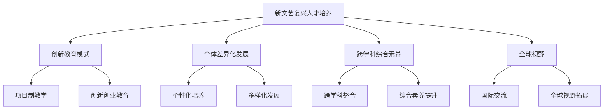

                 

# 新文艺复兴人才培养：全方位发展的教育模式

## 关键词：新文艺复兴，人才培养，全方位发展，教育模式，创新实践

### 摘要：

本文以新文艺复兴人才培养为核心，探讨了全方位发展的教育模式。通过对当前教育体系面临的挑战进行分析，提出了新文艺复兴人才培养的目标与原则，以及全方位发展教育模式的设计理念与实践路径。通过具体的教学方法与案例分析，本文揭示了新文艺复兴人才培养的实际操作方法，并对人才培养效果进行评估与改进。旨在为我国教育改革提供理论支持和实践参考。

## 第一部分：新文艺复兴人才培养背景与概述

### 第1章：问题背景与核心概念

#### 1.1 问题背景

##### 1.1.1 当前教育体系面临的挑战

随着社会的快速变化，传统教育体系在知识传授方面显得滞后。同时，人才培养与市场需求之间的脱节，导致毕业生难以适应职场需求。此外，个体差异化发展的需求与统一化教育模式的矛盾，使得教育体系难以满足学生的多样化发展需求。

##### 1.1.2 新文艺复兴的提出

新文艺复兴的概念源于欧洲文艺复兴时期，强调人文精神与科学技术的融合。在现代社会，新文艺复兴被赋予了新的内涵，即培养具有创新精神、跨学科综合素养和全球视野的人才。这一理念对于解决当前教育体系面临的挑战具有重要意义。

##### 1.1.3 教育模式的转型需求

教育模式需要从知识传授向能力培养转变，强调创新创业精神的培养与传承。同时，跨学科综合素养的全面提升成为教育模式转型的重要目标。

#### 1.2 核心概念

##### 1.2.1 新文艺复兴人才培养

新文艺复兴人才培养是指以培养具有创新精神、跨学科综合素养和全球视野的人才为目标，通过创新教育模式，实现个体差异化发展的教育过程。

##### 1.2.2 全方位发展的教育模式

全方位发展的教育模式是一种以知识、技能、创新、实践、个性、社会性全面发展为目标，注重个体差异化发展的教育模式。

#### 1.3 关键要素

##### 1.3.1 问题解决

针对当前教育体系面临的挑战，新文艺复兴人才培养提出以下具体措施：

1. 创新教育模式，实现个体差异化发展。
2. 强化创新创业教育，提升学生的实践能力。
3. 跨学科整合，提高学生的综合素养。
4. 引入项目制教学，培养学生的项目管理和团队协作能力。

##### 1.3.2 边界与外延

新文艺复兴人才培养适用于各个教育阶段，包括基础教育、职业教育和高等教育。同时，它与其他教育模式相互关联，共同推动教育改革。

##### 1.3.3 概念结构与核心要素组成

图1-1 新文艺复兴人才培养的概念结构图

表1-1 核心要素属性特征对比表格

| 核心要素 | 属性特征 |
| :--: | :--: |
| 新文艺复兴人才培养 | 强调个体差异化发展、跨学科综合素养、全球视野 |
| 全方位发展教育模式 | 知识、技能、创新、实践、个性、社会性全面发展 |

#### 1.4 本章小结

本章介绍了新文艺复兴人才培养的背景与核心概念，分析了当前教育体系面临的挑战，并提出了新文艺复兴人才培养的目标与原则。通过关键要素的分析，为后续章节的内容提供了引导和铺垫。

## 第二部分：全方位发展的教育模式实施策略

### 第2章：全方位发展教育模式的设计理念与实践路径

#### 2.1 设计理念

##### 2.1.1 知识与技能并重

全方位发展教育模式强调知识体系的完善，同时注重学生技能的培养。知识体系包括基础学科知识和跨学科知识，而技能培养则包括创新能力、实践能力、沟通能力和团队合作能力。

##### 2.1.2 创新与实践并重

全方位发展教育模式注重创新能力的培养，鼓励学生独立思考、提出问题、解决问题。同时，通过实践活动，提升学生的实际操作能力，将理论知识转化为实际成果。

##### 2.1.3 个性与社会性并重

全方位发展教育模式尊重学生的个性发展，鼓励学生发掘自身潜力。同时，培养学生的社会责任感，使其具备为社会服务的意识和能力。

#### 2.2 实践路径

##### 2.2.1 教育目标设定

教育目标应明确培养具备创新精神、实践能力、跨学科综合素养和全球视野的人才。具体目标可根据不同教育阶段和学科特点进行细化和分解。

##### 2.2.2 课程体系构建

课程体系应包括基础课程、专业课程、选修课程和实践活动。基础课程注重基础知识的教育，专业课程强调专业知识的深入，选修课程丰富学生的兴趣和特长，实践活动提升学生的实际操作能力。

##### 2.2.3 教学方法创新

教学方法应从传统的讲授式转向探究式、讨论式和项目式教学。通过引入案例教学、翻转课堂、在线学习等新型教学方法，激发学生的学习兴趣，提高教学效果。

##### 2.2.4 评价体系构建

评价体系应注重过程评价和结果评价的结合，关注学生的综合素质和创新能力。评价方式应多样化，包括考试、论文、项目展示、实践操作等。

#### 2.3 核心案例

##### 2.3.1 案例一：某某学校的全方位发展教育模式实践

- 案例背景与目标
  某某学校是一所综合性高中，面临着教育改革的需求。学校提出了全方位发展教育模式的改革目标，旨在培养具有创新精神、实践能力和跨学科综合素养的学生。

- 实践过程与成果
  学校通过以下措施推进全方位发展教育模式：
  1. 设计了符合学生个性化发展的课程体系，包括基础课程、专业课程和选修课程。
  2. 引入了项目制教学，让学生参与真实的项目，提升实践能力。
  3. 开展了跨学科实践活动，培养学生的综合素养。
  4. 建立了多元化的评价体系，关注学生的综合素质和创新能力。
  实践成果显著，学生的创新意识和实践能力得到了提高，升学和就业率也取得了明显提升。

##### 2.3.2 案例二：某某公司的校企合作新模式

- 校企合作的背景与模式
  某某公司是一家高科技企业，面临着人才短缺的问题。为了解决这一问题，公司与某知名高校建立了合作关系，共同推进全方位发展教育模式的实施。

- 校企合作的成果与启示
  1. 公司为学生提供了实习和就业机会，让学生在实践中提升能力。
  2. 学校为企业提供了人才和技术支持，帮助企业解决技术难题。
  3. 双方共同制定了人才培养计划，注重学生的个性化发展和创新能力培养。
  4. 校企合作模式取得了良好效果，为企业输送了具备实际操作能力的高素质人才，也为学生提供了更好的就业前景。

#### 2.4 本章小结

本章介绍了全方位发展教育模式的设计理念和实践路径。通过设计理念的分析，明确了知识、技能、创新、实践、个性和社会性的并重。通过实践路径的阐述，为教育模式的实施提供了具体的操作方法。案例部分的介绍，为全方位发展教育模式的实践提供了有益的借鉴。

## 第三部分：新文艺复兴人才培养的实际操作

### 第3章：新文艺复兴人才培养的教学方法与案例分析

#### 3.1 教学方法

##### 3.1.1 项目制教学

项目制教学是一种以项目为导向的教学模式，通过让学生参与实际项目，培养他们的实践能力和团队合作精神。项目制教学的优势在于能够将理论知识与实际应用相结合，提高学生的实际操作能力。然而，项目制教学也面临着项目选择、项目管理、项目评价等方面的挑战。

##### 3.1.2 创新实验课程

创新实验课程是一种以培养学生的创新能力为目标的教学模式，通过设置实验课题，引导学生进行科学探究和创新实践。创新实验课程的设计理念在于激发学生的创造力，培养他们的科学精神和实践能力。然而，创新实验课程也面临着实验资源、实验安全、实验评价等方面的挑战。

##### 3.1.3 跨学科学习

跨学科学习是一种以培养学生跨学科综合素养为目标的教学模式，通过整合多学科知识，培养学生的综合思维能力和创新能力。跨学科学习的意义在于拓宽学生的知识视野，提升他们的综合素质。然而，跨学科学习也面临着学科整合、师资力量、教学资源等方面的挑战。

#### 3.2 案例分析

##### 3.2.1 案例一：某大学新文艺复兴人才培养项目

- 项目背景与目标
  某大学是一所综合性大学，为了培养具有创新精神和跨学科综合素养的人才，学校提出了新文艺复兴人才培养项目。

- 项目实施过程
  1. 设计了项目制教学课程，让学生参与实际项目，提升实践能力。
  2. 开设了创新实验课程，引导学生进行科学探究和创新实践。
  3. 推行跨学科学习，整合多学科知识，培养学生的综合思维能力。
  4. 建立了多元化的评价体系，关注学生的综合素质和创新能力。

- 项目成果与评价
  项目实施后，学生的创新能力和实践能力得到了显著提高，跨学科综合素养也得到了提升。学校通过项目成果展示、学术论文发表、创新创业项目获奖等方式对项目成果进行评价。

##### 3.2.2 案例二：某高中新文艺复兴教育模式的实践

- 学校背景与教育改革目标
  某高中是一所普通高中，面临着教育改革的需求。学校提出了新文艺复兴教育模式的改革目标，旨在培养学生的创新精神、实践能力和跨学科综合素养。

- 教育改革的具体措施
  1. 设计了项目制教学课程，让学生参与实际项目，提升实践能力。
  2. 开设了创新实验课程，引导学生进行科学探究和创新实践。
  3. 推行跨学科学习，整合多学科知识，培养学生的综合思维能力。
  4. 建立了多元化的评价体系，关注学生的综合素质和创新能力。

- 教育改革的效果与反思
  教育改革实施后，学生的创新能力和实践能力得到了显著提高，跨学科综合素养也得到了提升。学校通过学生项目成果展示、学术论文发表、创新创业项目获奖等方式对教育改革效果进行评价。同时，学校也反思了教育改革中存在的问题，如师资力量不足、教学资源有限等，为后续教育改革提供了参考。

##### 3.2.3 案例三：某企业的新文艺复兴人才培养计划

- 企业背景与人才需求
  某企业是一家高科技企业，面临着人才短缺的问题。为了解决这一问题，企业提出了新文艺复兴人才培养计划，旨在通过创新教育模式，培养具备实际操作能力和创新精神的人才。

- 人才培养计划的实施
  1. 与高校合作，共同制定人才培养方案，注重学生的个性化发展和创新能力培养。
  2. 引入项目制教学，让学生参与实际项目，提升实践能力。
  3. 开设创新实验课程，引导学生进行科学探究和创新实践。
  4. 建立了多元化的评价体系，关注学生的综合素质和创新能力。

- 人才培养的效果与影响
  人才培养计划实施后，企业的人才储备得到了显著提高，员工的创新能力和实践能力也得到了提升。企业通过人才培养计划，不仅解决了人才短缺的问题，还为企业的技术创新和业务发展提供了有力支持。

#### 3.3 本章小结

本章介绍了新文艺复兴人才培养的教学方法与案例分析。通过项目制教学、创新实验课程和跨学科学习等教学方法，培养了学生的实践能力和创新能力。案例分析展示了新文艺复兴人才培养在实际操作中的成功经验和不足之处，为新文艺复兴人才培养的深入推进提供了有益的借鉴。

## 第四部分：新文艺复兴人才培养的评估与改进

### 第4章：新文艺复兴人才培养效果的评估指标与改进策略

#### 4.1 评估指标

新文艺复兴人才培养效果的评估指标应包括以下几个方面：

1. **知识掌握度**：通过考试、论文、报告等形式，评估学生对专业知识的掌握程度。
2. **技能水平**：通过实践活动、项目完成情况等，评估学生的实践能力和技能水平。
3. **创新能力**：通过创新实验、项目创新点等，评估学生的创新能力。
4. **跨学科素养**：通过跨学科课程完成情况、跨学科项目参与度等，评估学生的跨学科素养。
5. **综合素质**：通过团队协作、沟通能力、社会责任感等，评估学生的综合素质。

#### 4.2 评估方法

1. **过程评估**：通过观察、记录学生的学习过程，评估学生的学习态度、参与度等。
2. **结果评估**：通过考试、项目成果等，评估学生的学习成果。
3. **自我评估**：通过学生的自我反思和自我评估，了解自我进步和存在的问题。
4. **同行评估**：通过学生之间的互评，促进学生之间的相互学习和交流。

#### 4.3 改进策略

1. **课程优化**：根据评估结果，对课程内容进行优化，增加实践环节，提高课程的实用性和针对性。
2. **教学方法改进**：根据评估结果，改进教学方法，采用更多以学生为中心的教学模式，如项目制教学、翻转课堂等。
3. **师资力量提升**：加强师资队伍建设，提高教师的综合素质和教学能力。
4. **评价体系完善**：建立科学、全面的评价体系，关注学生的个性化发展，注重过程评价和结果评价的结合。
5. **资源投入**：加大教育资源的投入，提高教学设施和实验条件，为学生提供更好的学习环境。

### 4.4 本章小结

本章介绍了新文艺复兴人才培养效果的评估指标与改进策略。通过建立科学、全面的评估指标体系，采用多样化的评估方法，可以全面了解学生的培养效果。根据评估结果，采取相应的改进策略，可以不断优化教育模式，提高人才培养质量。

## 结语

新文艺复兴人才培养是我国教育改革的重要方向。通过全方位发展的教育模式，我们可以培养出具有创新精神、实践能力和跨学科综合素养的高素质人才。本文从背景介绍、核心概念、设计理念、实践路径、教学方法、案例分析、评估与改进等方面进行了详细探讨。希望本文能为我国教育改革提供有益的参考，助力新文艺复兴人才培养的实现。

### 作者信息

**作者：AI天才研究院/AI Genius Institute & 禅与计算机程序设计艺术 /Zen And The Art of Computer Programming**

**本文由AI天才研究院和禅与计算机程序设计艺术共同撰写，旨在探讨新文艺复兴人才培养的全方位发展教育模式，为我国教育改革提供理论支持和实践参考。**

