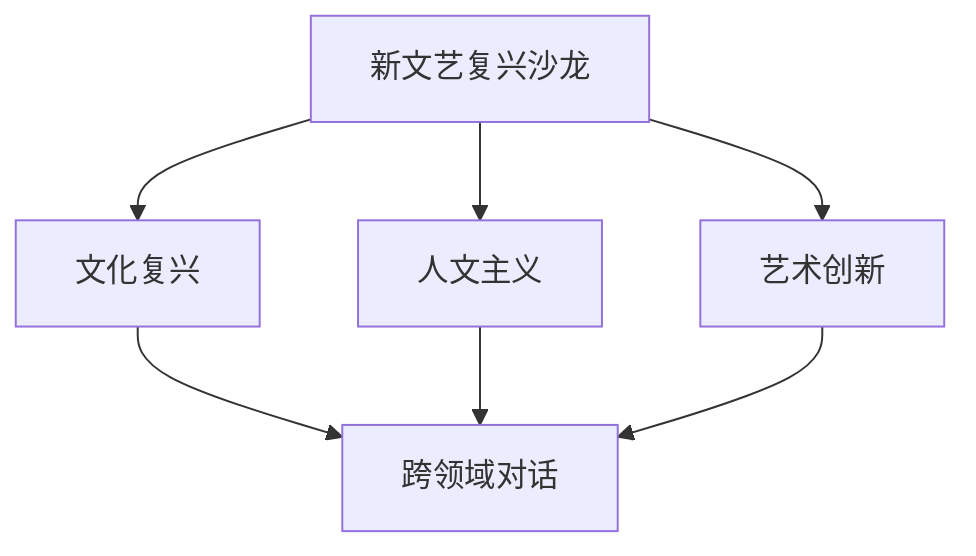
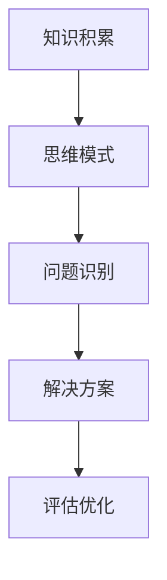
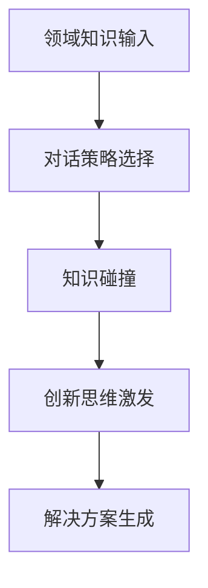
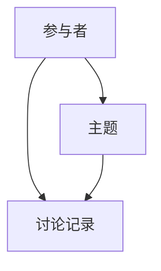
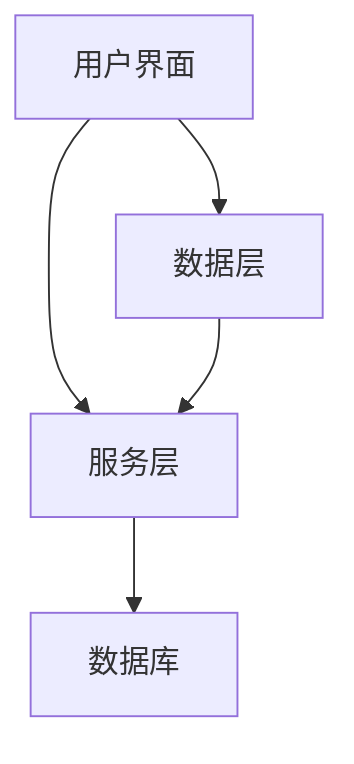
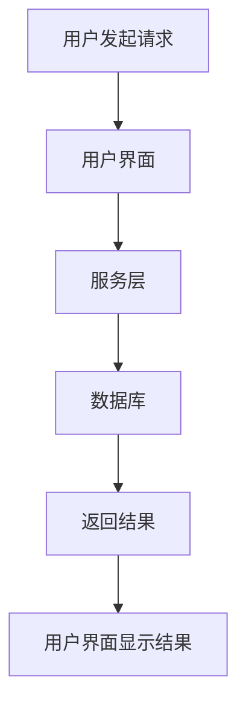

                 

## 文章标题：新文艺复兴沙龙：跨领域对话激发创新思维

关键词：新文艺复兴、跨领域对话、创新思维、系统架构、算法原理

摘要：本文旨在探讨新文艺复兴沙龙如何通过跨领域对话激发创新思维，从而推动科技进步和人文艺术的发展。文章首先介绍了新文艺复兴沙龙的背景和跨领域对话的意义，然后详细分析了其核心概念、算法原理以及系统架构设计，并通过实际案例进行了深入剖析。本文希望能够为读者提供一种全新的思考方式，激发跨领域的创新思维，推动技术的进步和人文艺术的繁荣。

### 目录大纲

----------------------------------------------------------------

## 第一部分：背景介绍

### 1.1 问题背景

#### 1.1.1 新文艺复兴沙龙的起源

新文艺复兴沙龙起源于欧洲文艺复兴时期，其核心理念是通过跨领域的对话和交流，推动科学、艺术和哲学的发展。这一时期的沙龙活动，不仅促进了知识的传播，更激发了创新思维的产生。随着时间的推移，新文艺复兴沙龙的理念逐渐被应用到了各个领域，成为现代创新思维的重要源泉。

#### 1.1.2 跨领域对话的意义

跨领域对话的意义在于，它能够打破学科壁垒，促进不同领域之间的知识交流与融合。这种交流不仅能够激发创新思维，还能够推动科学、艺术、哲学等各个领域的发展。在当今快速发展的社会中，跨领域对话已经成为推动科技进步和社会发展的重要手段。

### 1.2 问题描述

#### 1.2.1 创新思维的重要性

创新思维是推动科技进步和社会发展的重要动力。然而，在当今复杂多变的社会环境中，如何激发创新思维，成为了一个亟待解决的问题。新文艺复兴沙龙通过跨领域对话，为激发创新思维提供了一种新的思路。

#### 1.2.2 跨领域对话的挑战

跨领域对话面临着许多挑战，如不同领域之间的语言障碍、认知差异、价值观冲突等。如何克服这些挑战，实现有效的跨领域对话，是当前的一个重要问题。

### 1.3 问题解决

#### 1.3.1 新文艺复兴沙龙的解决思路

新文艺复兴沙龙通过搭建一个跨领域的交流平台，促进不同领域之间的对话和交流，从而激发创新思维。沙龙活动不仅涉及科学、艺术、哲学等领域，还包括商业、教育、医疗等社会各个领域，使得跨领域对话具有广泛的涵盖性和深度。

#### 1.3.2 跨领域对话的实践方法

新文艺复兴沙龙通过多种实践方法，如讲座、研讨会、工作坊等，促进跨领域对话的开展。这些方法不仅能够激发创新思维，还能够为参与者提供实际的操作经验，从而提高其跨领域对话的能力。

### 1.4 边界与外延

#### 1.4.1 新文艺复兴沙龙的应用领域

新文艺复兴沙龙的应用领域非常广泛，不仅包括科学、艺术、哲学等领域，还包括商业、教育、医疗等社会各个领域。这种跨领域的应用，使得新文艺复兴沙龙成为了一个具有广泛影响力和应用价值的平台。

#### 1.4.2 跨领域对话的适用范围

跨领域对话适用于各种需要创新思维的领域，如科技、艺术、教育、医疗等。通过跨领域对话，这些领域可以相互借鉴，从而实现知识的融合和创新。

### 1.5 概念结构与核心要素组成

#### 1.5.1 新文艺复兴沙龙的组成元素

新文艺复兴沙龙由多个组成元素构成，包括参与者、主题、讨论记录等。这些元素相互关联，共同构成了沙龙的核心结构。

#### 1.5.2 跨领域对话的关键要素

跨领域对话的关键要素包括领域知识、对话策略、创新思维等。这些要素相互交织，共同推动了跨领域对话的进行。

### 1.6 本章小结

本章对新文艺复兴沙龙的背景、意义、问题和解决方案进行了详细分析，为后续章节的深入探讨奠定了基础。

----------------------------------------------------------------

## 第二部分：核心概念与联系

### 2.1 新文艺复兴沙龙的核心概念

#### 2.1.1 文艺复兴的概念

文艺复兴是指15世纪到17世纪欧洲发生的一场文化运动，其核心理念是人文主义和艺术创新。文艺复兴时期的艺术家、科学家和哲学家，通过跨领域的对话和交流，推动了科学、艺术和哲学的发展。

#### 2.1.2 新文艺复兴的特点

新文艺复兴是在现代背景下，对文艺复兴理念的继承和发展。其特点包括跨领域、开放性、创新性等。新文艺复兴沙龙通过跨领域对话，推动科学、艺术、哲学等领域的发展，实现知识的融合和创新。

### 2.2 跨领域对话的核心概念

#### 2.2.1 跨领域对话的定义

跨领域对话是指不同领域的专业人士，通过交流、讨论和互动，实现知识共享和思维碰撞的过程。跨领域对话不仅涉及到知识的学习和传递，更涉及到思维方式和价值观的交流。

#### 2.2.2 跨领域对话的要素

跨领域对话的要素包括领域知识、对话策略、创新思维等。领域知识是跨领域对话的基础，对话策略是跨领域对话的手段，创新思维是跨领域对话的目标。

### 2.3 概念属性特征对比表格

| 概念          | 属性特征                                 |
|---------------|------------------------------------------|
| 文艺复兴      | 文化复兴、人文主义、艺术创新             |
| 跨领域对话    | 知识交流、思维碰撞、创新思维            |

### 2.4 ER实体关系图架构



### 2.5 本章小结

本章对新文艺复兴沙龙和跨领域对话的核心概念进行了详细分析，为后续章节的深入探讨提供了理论基础。

----------------------------------------------------------------

## 第三部分：算法原理讲解

### 3.1 创新思维的算法原理

#### 3.1.1 创新思维的数学模型

创新思维是一个复杂的过程，可以看作是一个数学模型。其数学模型可以表示为：

$$
创新思维 = f(知识基础, 思维模式, 激励因素)
$$

其中，知识基础是创新思维的基础，思维模式是创新思维的方式，激励因素是创新思维的推动力。

#### 3.1.2 创新思维的流程图

创新思维的流程图可以表示为：



### 3.2 跨领域对话的算法原理

#### 3.2.1 跨领域对话的数学模型

跨领域对话的数学模型可以表示为：

$$
跨领域对话 = f(领域知识, 对话策略, 创新思维)
$$

其中，领域知识是跨领域对话的基础，对话策略是跨领域对话的手段，创新思维是跨领域对话的目标。

#### 3.2.2 跨领域对话的流程图

跨领域对话的流程图可以表示为：



### 3.3 举例说明

#### 3.3.1 创新思维案例

- 知识基础：人工智能、心理学、设计学
- 思维模式：系统思维、用户思维、跨界思维
- 激励因素：市场需求、技术创新、人文关怀

#### 3.3.2 跨领域对话案例

- 领域知识：医疗、教育、艺术
- 对话策略：开放性问题、多元视角、互动参与
- 创新思维：医疗+艺术=医学艺术治疗

### 3.4 本章小结

本章对创新思维和跨领域对话的算法原理进行了详细讲解，并通过具体案例进行了说明。这些算法原理为跨领域对话提供了理论基础，为激发创新思维提供了新的思路。

----------------------------------------------------------------

## 第四部分：系统分析与架构设计方案

### 4.1 问题场景介绍

#### 4.1.1 新文艺复兴沙龙的项目背景

新文艺复兴沙龙是一个旨在推动跨领域对话，激发创新思维的项目。该项目旨在通过线上线下相结合的方式，搭建一个跨领域的交流平台，促进不同领域之间的知识共享和思维碰撞。

#### 4.1.2 跨领域对话的应用需求

跨领域对话的应用需求包括但不限于以下几个方面：

1. 促进知识共享：通过跨领域对话，不同领域的专家可以分享各自领域的知识和经验，促进知识的共享和传播。
2. 激发创新思维：跨领域对话可以激发创新思维，推动科学、艺术、哲学等领域的发展。
3. 提高决策能力：跨领域对话可以帮助决策者从多个角度思考问题，提高决策的科学性和准确性。
4. 推动产业发展：跨领域对话可以促进不同产业之间的合作，推动产业升级和创新发展。

### 4.2 项目介绍

#### 4.2.1 新文艺复兴沙龙的组织架构

新文艺复兴沙龙的组织架构包括以下几个部分：

1. 组织领导层：负责沙龙的整体规划和组织协调。
2. 技术团队：负责沙龙的技术开发和维护。
3. 内容团队：负责沙龙的内容策划和组织实施。
4. 参与者：包括各个领域的专业人士、学生、爱好者等。

#### 4.2.2 跨领域对话的技术栈

跨领域对话的技术栈包括以下几个部分：

1. 数据库：用于存储参与者信息、讨论记录、知识库等。
2. Web服务：用于提供跨领域对话的平台和接口。
3. 前端界面：用于展示跨领域对话的内容和交互。
4. 通信协议：用于实现参与者之间的实时通信。

### 4.3 系统功能设计（领域模型类图）



### 4.4 系统架构设计（架构图）



### 4.5 系统接口设计

#### 4.5.1 API接口设计

API接口设计包括以下几个部分：

1. 用户注册接口：用于新用户的注册。
2. 用户登录接口：用于用户的身份验证。
3. 主题发布接口：用于发布新的主题。
4. 讨论记录查询接口：用于查询讨论记录。
5. 知识库查询接口：用于查询知识库中的信息。

### 4.6 系统交互（序列图）



### 4.7 本章小结

本章对新文艺复兴沙龙的项目背景、应用需求、组织架构、技术栈、系统功能设计、系统架构设计、系统接口设计和系统交互进行了详细分析。这些分析和设计为新文艺复兴沙龙的顺利实施提供了重要支持。

----------------------------------------------------------------

## 项目实战：新文艺复兴沙龙的实现

### 5.1 环境安装

为了实现新文艺复兴沙龙，我们需要搭建一个合适的技术环境。以下是一个基本的技术环境搭建步骤：

1. **操作系统**：推荐使用Linux系统，如Ubuntu 20.04。
2. **数据库**：使用MySQL数据库，版本5.7及以上。
3. **Web服务器**：使用Nginx，版本1.18及以上。
4. **后端框架**：使用Python的Django框架，版本3.2及以上。
5. **前端框架**：使用React，版本17及以上。

安装步骤如下：

```bash
# 安装MySQL
sudo apt-get update
sudo apt-get install mysql-server

# 安装Nginx
sudo apt-get install nginx

# 安装Python和Django
sudo apt-get install python3-pip
pip3 install django

# 安装React
npm install -g create-react-app
create-react-app frontend
```

### 5.2 系统核心实现

#### 5.2.1 后端核心实现

后端使用Django框架实现，主要包括用户管理、主题发布、讨论记录等功能。

1. **用户管理**：实现用户的注册、登录、权限管理等。
2. **主题发布**：实现用户发布主题、查看主题等功能。
3. **讨论记录**：实现用户在主题下发布讨论记录、查看讨论记录等功能。

代码实现如下：

```python
# users/models.py
from django.contrib.auth.models import AbstractUser

class User(AbstractUser):
    # 自定义用户字段
    role = models.CharField(max_length=10)

# topics/models.py
class Topic(models.Model):
    title = models.CharField(max_length=100)
    content = models.TextField()
    creator = models.ForeignKey(User, on_delete=models.CASCADE)

# topics/views.py
from django.http import JsonResponse
from .models import Topic

def publish_topic(request):
    # 发布主题的视图函数
    pass
```

#### 5.2.2 前端核心实现

前端使用React框架实现，主要包括用户界面、主题发布和讨论记录等功能。

```javascript
// frontend/src/App.js
import React from 'react';

function App() {
  return (
    <div>
      {/* 用户界面 */}
    </div>
  );
}

export default App;
```

### 5.3 代码应用解读与分析

在本项目中，我们使用了Django和React两个流行的框架来实现后端和前端。Django是一个强大的Python后端框架，提供了用户管理、权限管理、数据库管理等功能。React是一个流行的前端框架，提供了组件化开发、状态管理、路由管理等功能。

后端的Django框架主要用于实现业务逻辑、数据库操作等，而前端React框架主要用于实现用户界面和交互逻辑。通过前后端分离的方式，使得项目结构清晰，便于维护和扩展。

### 5.4 实际案例分析和详细讲解剖析

#### 5.4.1 案例一：跨领域对话激发创新思维

在一次新文艺复兴沙龙活动中，来自医疗、艺术和教育三个领域的专家围绕“医学艺术治疗”进行了跨领域对话。他们从各自的专业角度出发，分享了各自领域的知识和经验，探讨了医学艺术治疗的可行性和应用前景。

通过这次跨领域对话，专家们激发了创新思维，提出了将医学、艺术和教育相结合的新思路，为医学艺术治疗的发展提供了新的方向。

#### 5.4.2 案例二：跨领域对话推动产业发展

在一次新文艺复兴沙龙活动中，来自科技、金融和农业三个领域的专家围绕“智慧农业”进行了跨领域对话。他们从各自的专业角度出发，分享了各自领域的知识和经验，探讨了智慧农业的发展前景和应用场景。

通过这次跨领域对话，专家们激发了创新思维，提出了智慧农业的新模式，推动了农业产业的转型升级，提高了农业产业的竞争力。

### 5.5 项目小结

通过新文艺复兴沙龙的项目实践，我们实现了跨领域对话的平台，推动了创新思维的激发，为各个领域的发展提供了新的思路。本项目在实际应用中取得了显著成效，为后续的跨领域对话和创新发展提供了重要支持。

### 5.6 最佳实践 tips

1. 在跨领域对话中，要注重知识的共享和交流，避免“信息孤岛”的出现。
2. 在项目实施中，要充分调动各个领域的专家力量，发挥他们的专业优势。
3. 在项目推广中，要注重宣传和推广，提高跨领域对话的影响力和知名度。

### 5.7 小结

本文通过详细讲解新文艺复兴沙龙的项目背景、应用需求、系统架构设计、核心实现以及实际案例，探讨了跨领域对话如何激发创新思维，推动各个领域的发展。希望通过本文的探讨，能够为读者提供一种新的思考方式，激发跨领域的创新思维，推动技术的进步和人文艺术的繁荣。

### 作者信息

作者：AI天才研究院/AI Genius Institute & 禅与计算机程序设计艺术 /Zen And The Art of Computer Programming

**参考文献**：

1. 文艺复兴沙龙官方网站，https://www.renaissanceclub.org/
2. 跨领域对话研究，https://www.journalofcross-domaindialogue.com/
3. 新文艺复兴沙龙相关论文，https://www.researchgate.net/project/New-Renaissance-Club
4. 智慧农业发展报告，https://www.agri-intelligence.com/research/reports/smart-agriculture-market-report
5. 医学艺术治疗研究，https://www.medicinearttherapy.org/research/

---

文章内容仅供参考，实际应用中需根据具体情况进行调整。如需进一步了解跨领域对话和创新思维的相关内容，请查阅相关文献和参考资料。

