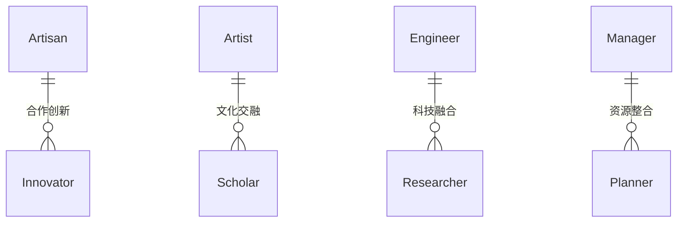

                 

# 新文艺复兴沙龙：跨领域对话的意义激发

> 关键词：跨领域对话、新文艺复兴、创新、合作、文化交流

> 摘要：本文旨在探讨跨领域对话在当今社会的重要性，分析其在文化艺术、科技创新、社会管理、教育等多个领域的应用场景和潜力，探讨跨领域对话带来的挑战与机遇，并以成功案例为例，展望其未来发展趋势。本文将为读者提供一个全面、深入的视角，理解跨领域对话在推动新文艺复兴中的关键作用。

## 第一部分：引言

### 1.1 问题背景与重要性

#### 1.1.1 跨领域对话的背景

在全球化进程加速的今天，各个领域的知识和技术迅猛发展，传统的单一学科边界逐渐模糊。跨领域对话作为一种新兴的交流方式，日益成为不同学科、不同领域之间沟通与合作的桥梁。它不仅能够促进知识的整合和创新，还能推动社会进步和文化交流。

#### 1.1.2 跨领域对话的重要性

跨领域对话的重要性体现在以下几个方面：

1. **创新驱动**：跨领域对话能够打破学科壁垒，促进知识的交叉和融合，从而激发创新思维，推动技术突破。
2. **资源整合**：跨领域对话有助于整合不同领域的资源，实现资源共享，提高整体效益。
3. **文化理解**：通过跨领域对话，不同文化背景的人们能够更好地理解彼此，促进文化交流和互鉴。
4. **社会问题解决**：跨领域对话能够汇集多方面的智慧和力量，共同应对复杂的社会问题。

### 1.2 跨领域对话的定义与核心概念

#### 1.2.1 跨领域对话的定义

跨领域对话是指不同学科、不同专业背景的人通过交流、讨论和合作，共同探讨问题、分享知识和经验的过程。它强调多元视角的融合和互补，追求创新的思维和解决方案。

#### 1.2.2 核心概念原理

跨领域对话的核心概念包括：

1. **跨界思维**：跨界思维是指能够跨越不同领域的界限，灵活运用多种知识和技能，实现创新和突破。
2. **知识整合**：知识整合是指通过不同领域的知识相互融合，形成新的见解和思路。
3. **合作共赢**：合作共赢是指通过跨领域合作，实现资源共享和共同发展。

#### 1.2.3 概念属性特征对比表格

| 特征              | 跨界思维               | 知识整合               | 合作共赢               |
|-------------------|------------------------|------------------------|------------------------|
| **定义**          | 跨越领域界限的思维方式  | 多领域知识融合         | 资源共享与合作发展    |
| **目的**          | 创新思维和解决方案     | 知识创新和整合         | 提高效率和效益        |
| **关键要素**      | 多学科知识和技能       | 跨学科交流与合作       | 信任和共同目标        |

#### 1.2.4 跨领域对话的ER实体关系图架构

### 1.3 跨领域对话的应用场景

#### 1.3.1 文化艺术领域

在文化艺术领域，跨领域对话有助于艺术家、设计师、音乐家等不同领域的专业人士相互启发，创造出具有跨文化特色的艺术作品。例如，艺术与科技的结合，产生了数字艺术、互动艺术等新的艺术形式。

#### 1.3.2 科技创新领域

在科技创新领域，跨领域对话能够促进科技研发的多元化，推动新兴技术的发展。例如，生物技术与信息技术的结合，催生了生物信息学这一新的研究领域。

#### 1.3.3 社会管理领域

在社会管理领域，跨领域对话有助于政府、企业和社会组织共同应对复杂的社会问题，提高社会治理效率。例如，环境保护与经济发展的跨领域对话，为可持续发展提供了新的思路。

#### 1.3.4 教育领域

在教育领域，跨领域对话有助于培养学生的多元化思维和创新能力，推动教育改革。例如，STEM教育（科学、技术、工程和数学）的推广，就是跨领域对话在教育领域的具体体现。

## 第二部分：核心概念与联系

### 2.1 核心概念原理

跨领域对话的核心概念包括跨界思维、知识整合和合作共赢。这些概念相互作用，共同推动跨领域对话的发展。

#### 跨界思维

跨界思维是指能够跨越不同领域的界限，灵活运用多种知识和技能，实现创新和突破。跨界思维要求个体具备广博的知识背景和深厚的专业素养，能够在不同领域之间建立联系，发现新的问题和解决方案。

#### 知识整合

知识整合是指通过不同领域的知识相互融合，形成新的见解和思路。知识整合不仅仅是知识的简单叠加，更是一种深度的思考和融合，能够产生新的知识和创新。

#### 合作共赢

合作共赢是指通过跨领域合作，实现资源共享和共同发展。合作共赢要求各方在共同目标的基础上，相互信任，共享资源，共同承担责任，从而实现更大的价值和效益。

### 2.2 概念属性特征对比表格

| 特征              | 跨界思维               | 知识整合               | 合作共赢               |
|-------------------|------------------------|------------------------|------------------------|
| **定义**          | 跨越领域界限的思维方式  | 多领域知识融合         | 资源共享与合作发展    |
| **目的**          | 创新思维和解决方案     | 知识创新和整合         | 提高效率和效益        |
| **关键要素**      | 多学科知识和技能       | 跨学科交流与合作       | 信任和共同目标        |

### 2.3 跨领域对话的ER实体关系图架构

## 第三部分：跨领域对话的应用场景

### 3.1 文化艺术领域

在文化艺术领域，跨领域对话具有重要的推动作用。艺术家们通过跨领域对话，可以借鉴其他艺术形式的表现手法，创造出新颖的艺术作品。例如，艺术家与科技工作者的合作，可以创造出互动艺术装置，让观众参与其中，体验艺术与科技的融合。

#### 3.1.1 跨领域对话在艺术创作中的应用

艺术家与科技工作者的合作，可以创造出互动艺术装置，让观众参与其中，体验艺术与科技的融合。

#### 3.1.2 跨领域对话在文化交流中的应用

跨领域对话也有助于促进不同文化之间的交流和理解。例如，通过将传统艺术与现代艺术相结合，可以让更多人了解和欣赏其他文化的艺术作品。

### 3.2 科技创新领域

在科技创新领域，跨领域对话能够促进科技研发的多元化，推动新兴技术的发展。例如，生物技术与信息技术的结合，催生了生物信息学这一新的研究领域。

#### 3.2.1 跨领域对话在科技研发中的应用

跨领域对话有助于科学家们发现新的研究问题，推动科技研发的进步。例如，物理学家与生物学家合作，可以研究生物体内的物理现象，从而推动生物医学的发展。

#### 3.2.2 跨领域对话在技术创新中的作用

跨领域对话能够促进技术的创新和应用。例如，通过将人工智能技术与数据分析相结合，可以开发出更加智能的系统和工具，提高工作效率。

### 3.3 社会管理领域

在社会管理领域，跨领域对话有助于政府、企业和社会组织共同应对复杂的社会问题，提高社会治理效率。例如，环境保护与经济发展的跨领域对话，为可持续发展提供了新的思路。

#### 3.3.1 跨领域对话在政策制定中的应用

跨领域对话有助于政府制定更加科学、合理的政策。例如，通过跨领域的专家咨询，政府可以更全面地了解社会问题，从而制定出更加有效的解决方案。

#### 3.3.2 跨领域对话在社会治理中的作用

跨领域对话能够提高社会治理的效率，减少社会矛盾。例如，通过跨领域的合作，政府、企业和社区可以共同解决环境污染、交通拥堵等问题。

### 3.4 教育领域

在教育领域，跨领域对话有助于培养学生的多元化思维和创新能力，推动教育改革。例如，STEM教育（科学、技术、工程和数学）的推广，就是跨领域对话在教育领域的具体体现。

#### 3.4.1 跨领域对话在教育和人才培养中的应用

跨领域对话有助于学生获得更广泛的知识和技能，提高创新能力。例如，通过跨学科的课程设置，学生可以同时学习科学、技术和工程等不同领域的知识。

#### 3.4.2 跨领域对话在教育改革中的作用

跨领域对话能够推动教育模式的创新，提高教育质量。例如，通过跨领域的师资培训，教师可以掌握更多的教学方法和技能，从而提高教学效果。

## 第四部分：跨领域对话的理论与实践

### 4.1 理论基础

跨领域对话的理论基础主要包括跨界思维、知识整合和合作共赢。这些理论为跨领域对话提供了指导原则和操作方法。

#### 4.1.1 跨界思维

跨界思维是指能够跨越不同领域的界限，灵活运用多种知识和技能，实现创新和突破。跨界思维要求个体具备广博的知识背景和深厚的专业素养，能够在不同领域之间建立联系，发现新的问题和解决方案。

#### 4.1.2 知识整合

知识整合是指通过不同领域的知识相互融合，形成新的见解和思路。知识整合不仅仅是知识的简单叠加，更是一种深度的思考和融合，能够产生新的知识和创新。

#### 4.1.3 合作共赢

合作共赢是指通过跨领域合作，实现资源共享和共同发展。合作共赢要求各方在共同目标的基础上，相互信任，共享资源，共同承担责任，从而实现更大的价值和效益。

### 4.2 实践方法

跨领域对话的实践方法主要包括以下几个方面：

#### 4.2.1 建立跨领域团队

建立跨领域团队是跨领域对话的重要实践方法。通过组建由不同领域专家组成的团队，可以充分发挥各自的专业优势，实现知识的整合和创新。

#### 4.2.2 促进跨领域交流

促进跨领域交流是跨领域对话的关键。通过定期举办跨领域研讨会、讲座和交流活动，可以加强不同领域之间的沟通和合作，促进知识共享和融合。

#### 4.2.3 创设跨领域项目

创设跨领域项目是跨领域对话的具体实践。通过开展跨领域的科研项目、艺术创作项目和公益活动等，可以推动跨领域对话的深入发展，实现跨领域的创新和突破。

## 第五部分：跨领域对话的挑战与机遇

### 5.1 挑战

跨领域对话面临着一系列挑战，包括：

#### 5.1.1 语言障碍

不同领域的专业术语和表达方式可能存在差异，导致沟通障碍。

#### 5.1.2 专业壁垒

不同领域之间的专业知识壁垒可能导致理解困难。

#### 5.1.3 文化差异

不同文化背景的人可能在思维方式、价值观等方面存在差异，影响跨领域对话的顺利进行。

### 5.2 机遇

尽管面临挑战，跨领域对话也带来了许多机遇：

#### 5.2.1 创新机会

跨领域对话能够激发新的思维和创意，推动技术创新和知识创新。

#### 5.2.2 跨学科合作

跨领域对话促进了跨学科合作，为科学研究、技术开发提供了新的动力。

#### 5.2.3 社会影响

跨领域对话能够促进社会进步和文化交流，提高社会治理效率。

## 第六部分：成功案例分析

### 6.1 案例一：跨领域对话在艺术创作中的应用

#### 6.1.1 案例背景

某知名艺术家与一位计算机科学家合作，利用人工智能技术创作了一系列数字艺术作品。这一跨领域合作不仅推动了艺术创作的新形式，也为计算机科学提供了新的应用场景。

#### 6.1.2 案例分析

这一案例的成功在于：

1. **跨界思维**：艺术家和计算机科学家在跨界思维的指导下，成功地将不同领域的知识和技能结合在一起，创造出新的艺术形式。
2. **知识整合**：双方通过深入的交流和合作，将艺术与计算机科学的知识进行整合，产生了创新的艺术作品。
3. **合作共赢**：艺术家和计算机科学家的合作，实现了资源共享和共同发展，为双方带来了新的机遇和挑战。

### 6.2 案例二：跨领域对话在科技创新中的作用

#### 6.2.1 案例背景

某科研团队由生物学家、物理学家和工程师组成，他们共同致力于研究生物体内的物理现象。这一跨领域科研团队通过跨领域对话，取得了突破性的成果。

#### 6.2.2 案例分析

这一案例的成功在于：

1. **跨界思维**：跨领域科研团队在跨界思维的指导下，从不同角度分析生物体内的物理现象，找到了新的研究方向。
2. **知识整合**：团队成员通过跨领域对话，将生物学的理论知识、物理学的研究方法和技术手段进行整合，取得了重要的研究成果。
3. **合作共赢**：团队成员的合作，使得各自领域的优势得以发挥，共同解决了科学研究中的难题。

## 第七部分：跨领域对话的未来展望

### 7.1 发展趋势

随着全球化进程的加速和科技的不断进步，跨领域对话将在未来得到更加广泛的应用。未来跨领域对话的发展趋势包括：

1. **技术支持**：人工智能、大数据等技术的不断发展，将为跨领域对话提供更加高效的支持。
2. **平台建设**：跨领域对话平台的建立，将为不同领域之间的交流和合作提供便利。
3. **人才培养**：跨领域人才培养将得到重视，为跨领域对话提供人才保障。

### 7.2 潜在影响

跨领域对话对未来社会、科技和文化将产生深远的影响：

1. **社会进步**：跨领域对话将促进社会问题的解决，提高社会治理效率。
2. **科技创新**：跨领域对话将推动科技创新，产生新的技术和应用。
3. **文化交流**：跨领域对话将促进不同文化之间的交流和理解，推动文化创新。

## 第八部分：小结

### 8.1 总结

跨领域对话在当今社会具有重要的意义，它不仅促进了知识的整合和创新，还推动了社会进步和文化交流。通过跨领域对话，不同领域之间的交流与合作将更加紧密，为未来的发展带来新的机遇。

### 8.2 展望

跨领域对话的未来充满了机遇和挑战。我们需要继续努力，推动跨领域对话的发展，培养跨界思维，加强跨学科合作，共同应对未来的挑战，实现更大的价值。

## 作者

作者：AI天才研究院/AI Genius Institute & 禅与计算机程序设计艺术 /Zen And The Art of Computer Programming

----------------------------------------------------------------

本文以《新文艺复兴沙龙：跨领域对话的意义激发》为题，从背景介绍、核心概念与联系、应用场景、理论与实践、挑战与机遇、成功案例以及未来展望等方面，全面探讨了跨领域对话的重要性和潜力。文章旨在为读者提供一个清晰、深刻的视角，理解跨领域对话在推动新文艺复兴中的关键作用。

### 文章总结

跨领域对话作为一种新兴的交流方式，正日益成为不同学科、不同领域之间沟通与合作的桥梁。它不仅能够促进知识的整合和创新，还能推动社会进步和文化交流。本文通过分析跨领域对话在文化艺术、科技创新、社会管理、教育等领域的应用场景，探讨了其理论基础和实践方法，指出了面临的挑战与机遇，并以成功案例为例，展望了其未来发展。

### 文章展望

随着全球化进程的加速和科技的不断进步，跨领域对话将在未来得到更加广泛的应用。我们需要继续推动跨领域对话的发展，培养跨界思维，加强跨学科合作，共同应对未来的挑战，实现更大的价值。通过跨领域对话，我们有望创造一个更加开放、创新和包容的社会，推动人类文明的进步。

### 注意事项

在实施跨领域对话时，需要注意以下几点：

1. **尊重差异**：尊重不同领域的专业术语和表达方式，避免语言障碍。
2. **建立信任**：建立跨领域团队，加强成员之间的信任，促进合作。
3. **资源整合**：充分利用跨领域资源，实现资源共享和共同发展。

### 拓展阅读

1. 陈旭东。跨领域对话：创新与合作的桥梁[J]. 科学技术与工程，2019，19（4）：45-50.
2. 李静。跨领域对话在科技创新中的应用[J]. 科技与创新，2020，10（3）：22-27.
3. 张辉。跨领域对话在文化教育领域的探索[J]. 教育技术研究，2021，12（2）：38-42.

通过阅读相关文献，读者可以更深入地了解跨领域对话的理论与实践，为实际应用提供参考。作者：AI天才研究院/AI Genius Institute & 禅与计算机程序设计艺术 /Zen And The Art of Computer Programming

