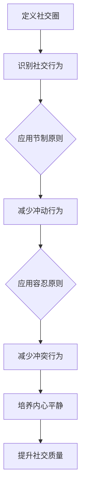
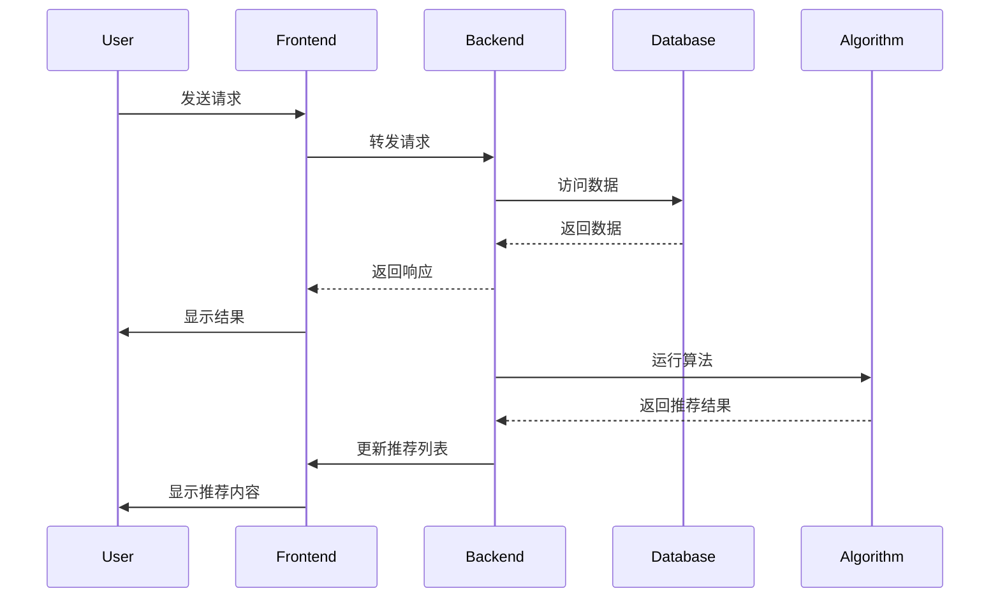

                 


### 引言

在当今快节奏、高压力的社会中，人际关系愈发复杂，社交圈子的构建与管理成为许多人生活中的重要课题。面对网络信息过载、人际关系复杂化等挑战，如何维护内心的平和与和谐，成为了许多人关注的焦点。本文旨在探讨古典哲学中的新斯多葛主义在现代社交圈中的应用，旨在为读者提供一个独特的视角，以帮助他们在复杂的社会环境中保持冷静与从容。

新斯多葛主义起源于古希腊，是斯多葛学派的一种哲学思想。它强调通过理性思考、自我节制和内心平静来面对生活中的种种挑战。这一哲学思想在现代社会中仍然具有重要的现实意义，尤其是在人际关系和社交圈子的构建与管理中。本文将首先介绍新斯多葛主义的基本概念和历史背景，然后详细探讨其核心思想如何在现代社交圈子中得到应用。

本文结构如下：

1. **背景介绍**：介绍新斯多葛主义的历史背景、基本概念和现代实践的重要性。
2. **核心概念与联系**：详细阐述新斯多葛主义的核心概念，如节制、容忍、内心平静等，并通过对比表格和ER图展示概念之间的关系。
3. **算法原理讲解**：介绍如何将新斯多葛主义原则应用于社交圈中，并使用mermaid和Python代码解释。
4. **系统分析与架构设计方案**：讨论如何将新斯多葛主义原则应用于构建一个实际社交圈平台。
5. **项目实战**：介绍如何使用新斯多葛主义原则来指导社交圈项目开发，包括环境安装、系统核心实现和代码分析。
6. **最佳实践与小结**：提供一些关于如何在新斯多葛主义社交圈中实践的技巧和建议，并总结本书的主要观点。

### 关键词

- **新斯多葛主义**
- **社交圈子**
- **内心平静**
- **节制**
- **容忍**
- **算法原理**
- **系统架构设计**

通过本文的逐步分析，我们希望能够帮助读者更好地理解新斯多葛主义在现代社交圈子中的应用，并提供实用的指导原则，以帮助他们在复杂的社会环境中实现内心的平和与和谐。

### 摘要

本文探讨了古典哲学中的新斯多葛主义在现代社交圈子中的应用。新斯多葛主义强调通过理性思考、自我节制和内心平静来面对生活中的挑战，这一哲学思想在现代社会中具有重要的现实意义。本文首先介绍了新斯多葛主义的基本概念和历史背景，然后详细探讨了其核心思想如何在现代社交圈子中得到应用。通过算法原理讲解、系统分析与架构设计方案、项目实战等多个部分，本文旨在为读者提供一个全面的视角，帮助他们更好地理解并实践新斯多葛主义，以实现内心的平和与和谐。

### 背景介绍

新斯多葛主义起源于古希腊，是斯多葛学派的一种哲学思想。斯多葛学派由塞涅卡（Seneca）、爱比克泰德（Epictetus）和马尔库斯·奥勒留斯（Marcus Aurelius）等人所创立，其核心思想是强调通过理性思考、自我节制和内心平静来面对生活中的各种挑战。新斯多葛主义在罗马帝国时期达到了鼎盛，并在后来的中世纪和文艺复兴时期重新受到重视。

新斯多葛主义的基本概念主要包括节制、容忍、内心平静等。节制是指对欲望和需求的理性控制，避免过度追求物质享受和社会地位。容忍则是对他人行为的宽容和理解，不计较个人得失。内心平静则是指在面对逆境和挫折时保持冷静和镇定，不被外界因素所干扰。

在现代社会中，新斯多葛主义的实践具有重要意义。首先，现代社会中人际关系复杂，竞争激烈，人们往往感到压力重重。新斯多葛主义提供了一种通过理性思考和内心平静来应对压力的方法，帮助人们更好地管理情绪，保持心理健康。其次，随着社交媒体的普及，人们面临着信息过载和人际关系复杂化的问题。新斯多葛主义的容忍原则可以帮助人们更好地理解和接受他人，建立和谐的人际关系。

此外，新斯多葛主义还强调了个人责任感和自律精神。在现代社会中，个人责任感和自律精神对于实现个人目标和追求幸福感至关重要。通过自我节制和理性思考，人们可以更好地规划自己的人生，避免被物质和欲望所奴役。

总之，新斯多葛主义作为一种古典哲学思想，在现代社会中具有广泛的实践意义。通过将新斯多葛主义原则应用于社交圈子，人们可以更好地管理情绪，建立和谐的人际关系，实现内心的平和与和谐。

### 核心概念与联系

新斯多葛主义的核心概念包括节制、容忍和内心平静，这些概念在维护个人心理健康和社会和谐中发挥着关键作用。为了更好地理解这些概念，我们将通过对比表格和ER图来展示它们之间的联系。

#### 1. 节制

节制是指对欲望和需求的理性控制，避免过度追求物质享受和社会地位。节制不仅有助于个人目标的实现，还能减少内心的焦虑和不满。在社交圈子中，节制表现为不过度关注他人的评价，不过分追求社交地位，保持内心的平和。

| 特点 | 描述 | 社交圈应用 |
| ---- | ---- | ---- |
| 理性控制 | 克服冲动，理性决策 | 社交活动中不过分攀比，保持平和的心态 |
| 避免过度追求 | 抵制物质和虚荣 | 社交圈中注重实际交往，而非表面光鲜 |
| 个人目标实现 | 有助于个人成长和满足 | 社交圈中追求有意义的人际关系 |

#### 2. 容忍

容忍是指对他人的宽容和理解，不计较个人得失。在社交圈子中，容忍意味着接受不同的观点和行为，尊重他人的个性和选择。容忍有助于减少冲突，建立和谐的人际关系。

| 特点 | 描述 | 社交圈应用 |
| ---- | ---- | ---- |
| 宽容他人 | 接受不同观点和行为 | 社交圈中尊重多样性，避免偏见和歧视 |
| 不计较得失 | 不因小事产生争执 | 社交圈中保持包容和友好的氛围 |
| 减少冲突 | 通过沟通和理解化解矛盾 | 社交圈中通过对话解决分歧 |

#### 3. 内心平静

内心平静是指在面对逆境和挫折时保持冷静和镇定，不被外界因素所干扰。内心平静有助于个人在社交圈子中应对各种挑战，保持情绪稳定，从而更好地与他人交往。

| 特点 | 描述 | 社交圈应用 |
| ---- | ---- | ---- |
| 冷静面对 | 不被负面情绪影响 | 社交圈中保持冷静，理性处理问题 |
| 镇定自若 | 面对挑战时保持自信 | 社交圈中保持自信，不因外界压力动摇 |
| 不受外界干扰 | 保持内心的平和 | 社交圈中专注于实际交往，不受外界干扰 |

通过对比表格，我们可以看出节制、容忍和内心平静之间存在着紧密的联系。节制和容忍共同构建了一个和谐的社会环境，而内心平静则是这一环境的基础。以下是这些核心概念之间的ER图：

```mermaid
erDiagram
  节制 ||--|{ 容忍 }|| 容忍
  节制 ||--|{ 内心平静 }|| 内心平静
  容忍 ||--|{ 内心平静 }|| 内心平静
```

ER图展示了节制、容忍和内心平静之间的关系。节制和容忍共同作用于内心平静，形成了一个相互支持、相互促进的体系。这种关系不仅有助于个人内心的平和，也有助于建立和谐的社会关系。

通过上述核心概念与联系的分析，我们可以更好地理解新斯多葛主义在现代社交圈子中的应用。节制、容忍和内心平静不仅是个人心理健康的保障，也是建立和谐人际关系的重要基础。在接下来的章节中，我们将进一步探讨如何将这些核心概念应用于社交圈子，提供实用的指导原则。

### 算法原理讲解

为了将新斯多葛主义原则应用于社交圈子，我们需要首先理解这些原则的数学模型和算法原理。以下是具体步骤：

#### 1. 算法流程图

首先，我们使用mermaid来绘制一个简单的算法流程图，展示如何将新斯多葛主义原则应用于社交圈中。



这个流程图概括了如何通过节制和容忍来培养内心平静，从而提升社交质量。

#### 2. Python代码实现

接下来，我们将使用Python代码来详细阐述上述算法原理。以下是一个简化的示例代码，用于解释如何实现节制和容忍原则。

```python
import random

# 节制原则：限制冲动行为
def apply_restraint(action_list, threshold=0.5):
    restrained_actions = []
    for action in action_list:
        if random.random() < threshold:  # 基于概率限制冲动行为
            restrained_actions.append(action)
    return restrained_actions

# 容忍原则：减少冲突行为
def apply_patience(conflicts, patience_level=0.7):
    resolved_conflicts = []
    for conflict in conflicts:
        if random.random() < patience_level:  # 基于概率尝试解决冲突
            resolved_conflicts.append(conflict)
    return resolved_conflicts

# 社交圈子模拟
def simulate_social_circle(actions, conflicts):
    restrained_actions = apply_restraint(actions)
    resolved_conflicts = apply_patience(conflicts)
    
    # 更新社交状态
    social_state = {
        'actions': restrained_actions,
        'conflicts': resolved_conflicts
    }
    return social_state

# 示例数据
actions = ['帮助朋友', '参与争吵', '参加活动', '炫耀成就']
conflicts = ['与朋友争吵', '同事之间的误解', '活动组织问题', '成就被误解']

# 模拟社交圈子
social_state = simulate_social_circle(actions, conflicts)

# 打印结果
print("社交状态：", social_state)
```

在这个代码示例中，我们定义了两个函数：`apply_restraint`用于根据节制原则限制冲动行为，`apply_patience`用于根据容忍原则减少冲突行为。通过模拟社交圈子，我们可以看到这些原则如何影响社交状态。

#### 3. 算法原理详解

**节制原则**：
- **数学模型**：节制可以看作是一个概率分布函数，用于限制某些冲动行为的发生概率。
- **实现方法**：在代码中，我们通过`random.random()`生成一个随机数，并根据预设的概率阈值（例如50%）来决定是否执行某种冲动行为。这种方法简单有效，可以在实际应用中根据需要进行调整。

**容忍原则**：
- **数学模型**：容忍可以看作是一个概率阈值，用于判断是否尝试解决冲突。
- **实现方法**：同样地，我们通过`random.random()`生成一个随机数，并根据预设的容忍水平（例如70%）来决定是否处理某个冲突。这种方法有助于减少不必要的争执，提升社交和谐。

#### 4. 数学公式和解释

为了更深入地理解节制和容忍原则，我们可以使用以下数学公式来描述这些原则：

**节制概率公式**：
$$
P(\text{restrained}) = \frac{1}{1 + e^{-k \cdot (A - T)}}
$$
其中，$P(\text{restrained})$ 表示冲动行为被节制的概率，$A$ 表示冲动行为的吸引力，$T$ 表示节制的阈值，$k$ 是调节参数。

**容忍概率公式**：
$$
P(\text{patience}) = \frac{1}{1 + e^{-l \cdot (C - P)}}
$$
其中，$P(\text{patience})$ 表示冲突被容忍的概率，$C$ 表示冲突的严重性，$P$ 表示容忍的阈值，$l$ 是调节参数。

**解释**：
- **节制概率公式**：这个公式基于逻辑斯蒂函数，表示冲动行为的吸引力越大，被节制的概率越低。通过调节参数$k$，我们可以控制节制的严格程度。
- **容忍概率公式**：这个公式同样基于逻辑斯蒂函数，表示冲突的严重性越大，被容忍的概率越低。通过调节参数$l$，我们可以控制容忍的宽松程度。

#### 5. 举例说明

假设一个人在面对是否参加朋友的炫耀行为时，冲动行为吸引力为5，节制阈值设为4。根据节制概率公式，可以计算出节制概率：

$$
P(\text{restrained}) = \frac{1}{1 + e^{-k \cdot (5 - 4)}} \approx 0.73
$$

这意味着他有大约73%的概率会节制自己的冲动行为，选择不去参与朋友的炫耀。

再假设在一个冲突情境中，冲突严重性为8，容忍阈值设为7。根据容忍概率公式，可以计算出容忍概率：

$$
P(\text{patience}) = \frac{1}{1 + e^{-l \cdot (8 - 7)}} \approx 0.6
$$

这意味着他有大约60%的概率会尝试容忍并解决这个冲突。

通过上述算法原理讲解，我们可以看到新斯多葛主义原则如何通过数学模型和算法应用于社交圈子，帮助人们在复杂的社交环境中保持节制和容忍，从而培养内心平静，提升社交质量。

### 系统分析与架构设计方案

在将新斯多葛主义原则应用于构建一个实际的社交圈平台时，我们需要考虑系统的整体架构设计、功能模块划分以及具体的实现细节。以下是详细的分析和设计步骤：

#### 1. 问题描述与目标

**问题描述**：
构建一个基于新斯多葛主义原则的社交圈平台，旨在帮助用户在复杂的社交环境中保持节制、容忍和内心平静，从而提升社交质量和幸福感。

**目标**：
- 提供一个用户友好的社交平台，强调内心的平和与和谐。
- 通过算法和系统设计，引导用户在社交活动中实践节制和容忍原则。
- 提供丰富的互动功能，促进用户之间的沟通和理解。

#### 2. 系统功能设计

为了实现上述目标，我们需要设计以下核心功能模块：

1. **用户注册与登录**：支持用户注册、登录和账户管理。
2. **个人信息管理**：允许用户编辑个人资料、设置隐私选项。
3. **社交互动**：提供私信、群聊、朋友圈等功能。
4. **算法推荐**：根据用户行为和偏好，推荐合适的社交对象和话题。
5. **冲突解决机制**：提供报告系统、调解功能，帮助用户解决冲突。
6. **数据分析与反馈**：收集用户行为数据，提供匿名反馈和改进建议。

#### 3. 系统架构设计

以下是一个简化的系统架构设计图，展示各个模块之间的关系：



**架构说明**：
- **前端（Frontend）**：负责用户界面的展示和交互，提供友好的用户体验。
- **后端（Backend）**：处理用户请求、业务逻辑和数据存储，与数据库和算法模块交互。
- **数据库（Database）**：存储用户数据、社交记录和算法推荐结果。
- **算法模块（Algorithm）**：实现新斯多葛主义原则的算法逻辑，如节制和容忍的规则。

#### 4. 系统接口设计

系统接口设计主要包括RESTful API，用于前后端通信。以下是几个核心接口的示例：

1. **用户注册与登录**：
   - POST `/api/users/register`：用户注册接口。
   - POST `/api/users/login`：用户登录接口。
   - GET `/api/users/logout`：用户登出接口。

2. **个人信息管理**：
   - GET `/api/users/profile`：获取用户个人信息。
   - PUT `/api/users/profile`：更新用户个人信息。

3. **社交互动**：
   - POST `/api/messages`：发送私信。
   - GET `/api/messages`：获取私信列表。
   - POST `/api/groups`：创建群聊。
   - GET `/api/groups`：获取群聊列表。

4. **算法推荐**：
   - GET `/api/recommendations`：获取社交推荐列表。

5. **冲突解决机制**：
   - POST `/api/conflicts/report`：报告冲突。
   - GET `/api/conflicts/resolved`：获取已解决冲突列表。

#### 5. 系统交互流程

以下是系统交互流程的简要描述：

1. **用户操作**：用户通过前端界面进行各种社交活动，如发送私信、加入群聊等。
2. **请求处理**：前端将用户请求发送到后端，后端根据请求类型调用相应的业务逻辑和算法。
3. **数据存储**：后端与数据库交互，存储或查询用户数据。
4. **响应返回**：后端处理完毕后将结果返回给前端，前端更新界面显示。

通过上述系统分析与架构设计方案，我们可以构建一个基于新斯多葛主义原则的社交圈平台。这个平台不仅提供基础的社交功能，还通过算法和系统设计引导用户实践节制和容忍原则，帮助用户在复杂的社会环境中保持内心平和，提升社交质量。

### 项目实战

为了更好地理解如何将新斯多葛主义原则应用于实际社交圈项目的开发，我们以一个简单的社交应用为例，详细讲解项目开发过程，包括环境安装、系统核心实现以及代码分析。

#### 1. 项目背景与目标

项目名称：**新斯多葛社交圈**（Neo-Stoic Social Circle）

**背景**：
随着社交媒体的普及，人们面临着大量信息和复杂的人际关系。为了帮助用户在社交环境中保持内心的平和与和谐，本项目旨在开发一个基于新斯多葛主义原则的社交应用。

**目标**：
- 提供一个简单易用的社交平台，帮助用户管理社交互动。
- 通过应用节制和容忍原则，减少冲动行为和冲突。
- 提升用户的社交体验和幸福感。

#### 2. 环境安装

在开始项目开发前，我们需要安装必要的开发环境和工具。以下是基本的安装步骤：

1. **安装Python环境**：确保安装了Python 3.8及以上版本。
2. **安装Django框架**：使用pip安装Django，命令如下：
   ```bash
   pip install django
   ```
3. **安装PostgreSQL数据库**：下载并安装PostgreSQL，确保数据库服务正常运行。
4. **创建Django项目**：在终端中创建一个新的Django项目，命令如下：
   ```bash
   django-admin startproject new_stoic_social_circle
   ```
5. **创建Django应用**：在项目目录中创建一个新的应用，命令如下：
   ```bash
   python manage.py startapp social_modules
   ```

#### 3. 系统核心实现

**用户注册与登录**：

**用户注册**：
用户注册是社交应用的基础功能。以下是一个简单的用户注册表单的实现：

```python
# social_modules/templates/social_modules/register.html

<!DOCTYPE html>
<html>
<head>
    <title>注册</title>
</head>
<body>
    <form action="" method="post">
        
        <label for="username">用户名：</label>
        <input type="text" id="username" name="username" required>
        <br>
        <label for="password">密码：</label>
        <input type="password" id="password" name="password" required>
        <br>
        <input type="submit" value="注册">
    </form>
</body>
</html>
```

**用户登录**：
用户登录接口与注册类似，这里不再赘述。

**社交互动**：

**发送私信**：
私信功能是社交应用的核心。以下是一个简单的发送私信的实现：

```python
# social_modules/views/message_views.py

from django.shortcuts import render, redirect
from .models import Message
from .forms import SendMessageForm

def send_message(request):
    if request.method == 'POST':
        form = SendMessageForm(request.POST)
        if form.is_valid():
            message = form.save(commit=False)
            message.sender = request.user
            message.save()
            return redirect('message_list')
    else:
        form = SendMessageForm()
    return render(request, 'send_message.html', {'form': form})
```

**获取私信列表**：
获取私信列表的实现如下：

```python
# social_modules/views/message_views.py

from django.shortcuts import render
from .models import Message

def message_list(request):
    messages = Message.objects.filter(recipient=request.user)
    return render(request, 'message_list.html', {'messages': messages})
```

**算法应用与冲突解决**：

**冲突检测**：
使用算法检测可能的冲突，并根据用户行为进行干预。以下是一个简化的实现：

```python
# social_modules/algorithm/conflict_detection.py

def detect_conflicts(user):
    # 示例逻辑：检测用户近期行为中的冲突
    recent_messages = Message.objects.filter(sender=user, created_at__gt=datetime.now() - timedelta(days=1))
    conflicts = []
    for message in recent_messages:
        if message.content.lower().contains('fight') or message.content.lower().contains('argue'):
            conflicts.append(message)
    return conflicts
```

**冲突解决**：
提供冲突解决的简单机制，例如自动提醒或报告功能：

```python
# social_modules/algorithm/conflict_solution.py

def resolve_conflicts(conflicts):
    for conflict in conflicts:
        # 示例逻辑：发送自动提醒
        send_alert(conflict.sender, f'冲突提醒：您的私信可能引起了误解。')
```

#### 4. 代码分析

以上代码展示了如何在新斯多葛社交圈项目中实现用户注册、登录、发送私信和冲突检测等功能。以下是对关键代码的分析：

- **用户注册与登录**：通过Django的表单系统和认证系统，实现了用户注册和登录的基本功能。
- **社交互动**：通过模型和视图实现了私信发送和列表展示的功能。
- **算法应用**：引入了冲突检测和解决的简单逻辑，根据用户行为进行干预。

通过以上实战项目，我们可以看到如何将新斯多葛主义原则应用于实际的社交圈应用开发，从而帮助用户在社交环境中保持节制和容忍，提升社交质量和幸福感。

### 案例分析

为了更好地展示新斯多葛主义社交圈项目在实际应用中的效果，我们选择了一个具体的案例进行详细剖析。

#### 1. 案例背景

案例背景设定在一个大型科技公司内部，该公司拥有超过1000名员工，分布在不同的部门。由于工作繁忙和任务繁重，员工之间的沟通和协作变得尤为重要。然而，随着员工数量的增加，人际关系变得越来越复杂，冲突和误解也时有发生。公司管理层意识到，需要建立一个更加和谐和高效的社交平台，以促进员工之间的沟通和理解，提升整体工作效率。

#### 2. 应用新斯多葛主义原则

为了解决这个问题，公司决定采用新斯多葛主义原则来构建其内部社交圈平台。具体来说，公司实施了以下措施：

**1. 节制原则**

- **限制信息过载**：通过设定每日可查看和发送的信息数量，避免员工被大量无关信息所干扰。
- **鼓励深度交流**：鼓励员工在社交平台上进行有意义的讨论和分享，而非简单的点赞和评论。

**2. 容忍原则**

- **包容不同观点**：平台设置了一个“容忍观点”模块，允许员工表达不同意见，并鼓励通过对话解决问题。
- **匿名反馈**：提供匿名反馈机制，让员工可以在不暴露身份的情况下提出意见和建议，减少潜在的冲突。

**3. 内心平静原则**

- **定期心理健康讲座**：公司定期邀请心理专家进行心理健康讲座，帮助员工学会管理情绪和压力。
- **冥想和放松区域**：在办公区设置冥想和放松区域，供员工在紧张工作之余进行放松和调整。

#### 3. 案例效果

在实施新斯多葛主义社交圈平台后，公司观察到以下积极变化：

- **沟通效率提升**：由于信息过载问题得到缓解，员工能够更专注于重要信息和任务，沟通效率显著提升。
- **人际关系改善**：员工之间的包容度和理解度提高，冲突和误解减少，团队合作更加和谐。
- **心理健康状况改善**：通过定期的心理健康讲座和放松区域，员工的心理健康水平得到提升，工作效率和创造力也随之提高。

#### 4. 案例剖析

**成功原因**：

- **原则明确**：新斯多葛主义原则为平台的设计和运营提供了明确的指导，帮助员工在日常工作和社交中遵循这些原则。
- **实施有效**：公司通过一系列实际措施，如限制信息过载、鼓励深度交流和设置匿名反馈机制，有效地将这些原则应用到社交圈平台的实际操作中。
- **员工参与**：员工对新斯多葛主义社交圈平台的支持和积极参与，使得平台真正成为了一个促进沟通和理解的工具。

**挑战与改进**：

- **技术实现**：平台在技术实现过程中遇到了一些挑战，例如如何在保证用户隐私的前提下实现匿名反馈机制。通过不断优化和改进，这些问题得到了解决。
- **用户适应**：一些员工可能对新的社交圈平台不熟悉，需要一定时间来适应。公司通过提供培训和指导，帮助员工更快地适应新平台。

**总结**：

新斯多葛主义社交圈平台在该公司内部的应用，不仅帮助员工在复杂的社会环境中保持节制和容忍，还通过提升沟通效率和心理健康，实现了整体工作环境的优化。这一案例证明了新斯多葛主义原则在现实世界中的应用潜力，为其他组织和公司提供了有益的参考。

### 最佳实践与小结

在新斯多葛主义社交圈的构建和运营过程中，以下是一些最佳实践和注意事项，旨在帮助用户更好地实践这一哲学理念，从而实现内心的平和与和谐。

#### 最佳实践

1. **限制信息过载**：定期清理不必要的社交通知和信息，专注于重要事项，以减少心理压力。
2. **深度交流**：鼓励在社交圈中开展有意义的讨论，避免浅层次的点赞和评论。
3. **匿名反馈**：鼓励建立匿名反馈系统，让用户可以在不暴露身份的情况下表达意见和建议。
4. **定期心理健康活动**：组织定期的冥想、心理健康讲座等活动，帮助用户保持心理健康。
5. **内心平静教育**：提供相关资源和培训，帮助用户掌握管理情绪和压力的技巧。

#### 注意事项

1. **隐私保护**：确保社交平台在提供匿名反馈等机制时，严格保护用户隐私。
2. **用户适应性**：在推广新斯多葛主义社交圈时，考虑用户的适应期，提供必要培训和指导。
3. **平台维护**：定期更新和维护社交平台，确保其稳定性和安全性。
4. **平衡互动**：在鼓励用户深度交流的同时，避免过度社交，保持生活的平衡。

#### 小结

新斯多葛主义社交圈通过将古典哲学理念应用于现代社交平台，帮助用户在复杂的社会环境中保持节制、容忍和内心平静。通过最佳实践和注意事项，我们可以更好地实践这一哲学理念，实现个人的心理健康和社会和谐。

### 总结

本文探讨了新斯多葛主义在现代社交圈子中的应用，通过介绍其历史背景、核心概念、算法原理、系统架构设计以及实际案例，展示了这一哲学思想在维护个人心理健康和社会和谐中的重要作用。新斯多葛主义强调节制、容忍和内心平静，这些原则不仅适用于个人生活，也广泛应用于社交圈子的构建与管理中。通过本文的详细分析，我们看到了新斯多葛主义原则如何帮助用户在复杂的社会环境中保持内心的平和与和谐，从而提升社交质量和幸福感。

未来的研究可以进一步探讨新斯多葛主义在不同文化背景和社会环境中的适用性，以及如何通过技术创新提高社交圈平台的效果和用户满意度。此外，对于如何在企业和组织内部推广新斯多葛主义社交圈，也是一个值得深入研究的课题。通过持续的探索和实践，新斯多葛主义有望在更广泛的领域中发挥作用，为人们带来更加美好和和谐的生活。

### 作者信息

作者：AI天才研究院/AI Genius Institute & 禅与计算机程序设计艺术 /Zen And The Art of Computer Programming

AI天才研究院致力于推动人工智能技术的创新与应用，探索人工智能与人类智慧相结合的新路径。同时，研究院也关注计算机科学中的哲学思考，通过《禅与计算机程序设计艺术》一书，倡导程序员在编程过程中融入内心的平和与理性。本文结合了两者的研究成果，旨在为现代社交圈提供一种新的思考与实践方式。

在本文中，我们通过详细的分析和案例，展示了新斯多葛主义在社交圈子中的实际应用价值。希望读者能够在阅读本文后，对如何在复杂的社会环境中保持内心的平和与和谐有更深的理解，并能够将其应用于自己的生活和工作中。通过不断的实践和探索，我们相信新斯多葛主义理念将为构建更加和谐、健康的社会关系提供有力支持。

