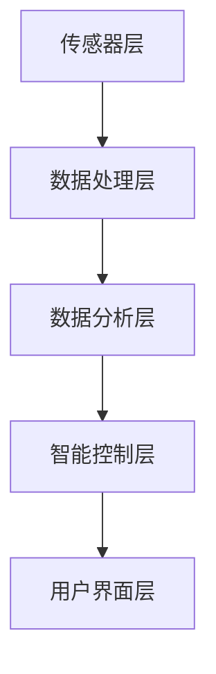
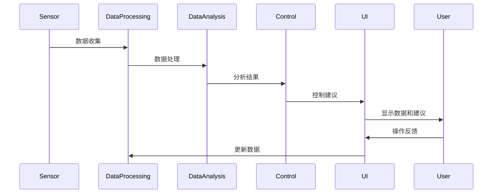
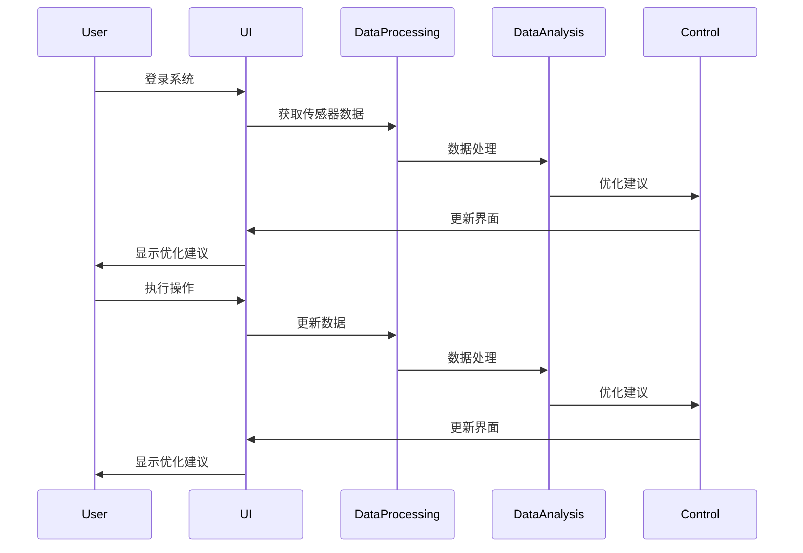

                 

### 第1章 背景介绍

#### 1.1 办公环境的问题与挑战

##### 1.1.1 问题背景

在现代社会，随着科技的不断进步和工作的复杂性增加，办公环境的问题越来越受到人们的关注。传统的办公方式往往伴随着高能耗、低效率、环境污染等问题。

现代办公环境通常包括办公大楼、会议室、办公室、休息区、打印室等多个功能区。这些区域的设计和布局往往不够合理，导致了一系列问题。首先，高能耗是办公环境中一个显著的问题。传统的办公大楼通常采用集中供暖和空调系统，这些系统在运行过程中消耗大量能源。此外，办公设备如电脑、打印机、复印机等也产生了大量的电能消耗。这些能源消耗不仅增加了企业的运营成本，也对环境造成了负面影响。

##### 1.1.2 问题描述

办公环境的问题主要体现在以下几个方面：

1. **高能耗**：传统的办公建筑和设备往往需要大量的能源来维持运行，导致能源消耗巨大。
2. **低效率**：拥挤的办公空间和不良的布局设计会影响员工的工作效率和创造力。
3. **环境污染**：传统的办公方式会产生大量的废弃物和碳排放，对环境造成负面影响。

高能耗的问题主要体现在办公大楼的供暖和空调系统上。这些系统通常需要持续运行，以确保室内温度和湿度的稳定。然而，过度的温度控制和湿度控制不仅浪费能源，还可能对员工的健康产生不利影响。此外，办公设备如电脑、打印机、复印机等的能耗也相当可观。这些设备在长时间运行过程中会产生大量的热量和电能消耗，如果不进行有效的能源管理，将会对环境产生负面影响。

低效率的问题主要体现在办公空间的设计和布局上。传统的办公空间往往设计为固定的办公桌和办公椅，员工在工作时缺乏灵活性。这种设计不仅限制了员工的工作方式，还可能导致员工感到疲劳和缺乏动力。此外，拥挤的办公空间也会增加员工的压力，降低他们的工作效率。

环境污染的问题主要体现在废弃物的处理和碳排放上。传统的办公方式会产生大量的纸质文件、打印废纸和电子废弃物。这些废弃物如果不得到妥善处理，将会对环境造成严重污染。此外，办公设备在运行过程中也会产生大量的碳排放，这些碳排放不仅增加了企业的运营成本，还对环境造成了负面影响。

##### 1.1.3 问题解决

新极简主义办公理念应运而生，旨在通过优化办公环境，提升工作效率，实现可持续发展。新极简主义办公理念强调以人为中心，通过简化办公流程、优化办公空间设计、利用现代科技手段，创造一个高效、舒适、可持续的办公环境。

新极简主义办公理念的核心目标是减少能源消耗、提高工作效率、减少环境污染。具体来说，它包括以下几个方面：

1. **环境设计**：通过优化办公空间的设计和布局，提高员工的工作效率和舒适度。这包括引入自然光线、增加植物绿化、优化通风系统等。
2. **流程优化**：简化工作流程，减少冗余步骤，提高工作效率。这可以通过自动化工具、流程重构等方式实现。
3. **技术工具**：利用现代科技手段，如云计算、人工智能等，提高办公效率。这包括使用协同工作工具、智能办公设备等。
4. **组织文化**：建立以人为本、鼓励创新的组织文化，提高员工的参与感和归属感。

通过实施新极简主义办公理念，企业可以实现以下好处：

1. **降低运营成本**：通过减少能源消耗和简化流程，降低企业的运营成本。
2. **提高工作效率**：通过优化办公环境和流程，提高员工的工作效率和创造力。
3. **减少环境污染**：通过减少废弃物和碳排放，降低对环境的负面影响。
4. **提升员工满意度**：创造一个高效、舒适的工作环境，提高员工的满意度和幸福感。

##### 1.1.4 边界与外延

新极简主义办公理念不仅关注物理空间的优化，还涉及到工作流程、组织文化、技术工具等多个方面。它不仅适用于企业内部的办公空间，还可以应用于各种办公环境，如远程办公、共享办公空间等。

新极简主义办公理念的核心要素包括：

1. **环境设计**：优化办公空间的设计和布局，提高员工的工作效率和舒适度。
2. **流程优化**：简化工作流程，减少冗余步骤，提高工作效率。
3. **技术工具**：利用现代科技手段，提高办公效率。
4. **组织文化**：建立以人为本、鼓励创新的组织文化，提高员工的参与感和归属感。

##### 1.1.5 概念结构与核心要素组成

新极简主义办公理念是一个多层次、多维度的概念结构。它由四个核心要素组成，分别是环境设计、流程优化、技术工具和组织文化。

1. **环境设计**：环境设计是构建新极简主义办公理念的基础。它包括办公空间的设计和布局，如引入自然光线、增加植物绿化、优化通风系统等。环境设计的目标是创造一个高效、舒适、可持续的办公环境。

2. **流程优化**：流程优化是提升工作效率的关键。它包括简化工作流程、减少冗余步骤、引入自动化工具等。流程优化的目标是提高工作效率，减少人力成本。

3. **技术工具**：技术工具是支持新极简主义办公理念的重要手段。它包括云计算、人工智能、协同工作工具等。技术工具的应用可以提高办公效率，实现信息的快速共享和处理。

4. **组织文化**：组织文化是新极简主义办公理念实施的重要保障。它包括以人为本、鼓励创新、团队合作等价值观。组织文化的目标是提高员工的参与感和归属感，促进团队的协作和创新。

### 1.2 新极简主义办公理念的核心概念与特点

##### 1.2.1 核心概念

新极简主义办公理念是一种以人为中心，追求简单、高效、可持续的办公方式。它强调通过简化办公流程、优化办公空间设计、利用现代科技手段，提高工作效率，实现可持续发展。

##### 1.2.2 特点

1. **简洁性**：新极简主义办公理念强调去除冗余，关注核心需求。通过简化流程、优化空间设计，减少不必要的复杂性和浪费，提高工作效率。

2. **灵活性**：新极简主义办公理念适应不同的工作场景和需求。通过灵活的办公空间设计、多样化的技术工具，满足员工多样化的工作需求，提高工作满意度。

3. **可持续性**：新极简主义办公理念追求可持续发展。通过减少能源消耗、减少废弃物、降低碳排放，实现办公环境的绿色化，减少对环境的负面影响。

4. **创新性**：新极简主义办公理念鼓励创新思维。通过引入新技术、新方法，推动办公环境的持续改进，激发员工的创新潜力，提高企业竞争力。

## 第2章 核心概念与联系

### 2.1 环境设计原理

#### 2.1.1 环境设计概述

环境设计是构建新极简主义办公理念的基础，它涉及到办公空间的设计、布局、色彩、照明等多个方面。环境设计的目的是创造一个高效、舒适、可持续的办公环境，提高员工的工作效率和满意度。

#### 2.1.2 核心原理

1. **人性化的空间布局**：人性化的空间布局是环境设计的关键。它要求充分考虑员工的需求和舒适度，提供多样化的工作空间，满足不同类型的工作需求。例如，设置开放的办公区、安静的会议室、舒适的休息区等。

2. **多功能空间设计**：多功能空间设计是环境设计的另一个核心原理。通过设计多功能空间，可以灵活适应不同的工作场景和需求。例如，一个多功能会议室可以同时用于会议、培训、讲座等多种活动。

3. **自然元素的融入**：自然元素的融入可以提升办公环境的品质。通过引入植物、水景、自然光线等自然元素，可以改善空气质量、增加舒适度，提高员工的幸福感。

#### 2.1.3 概念属性特征对比表格

| 概念 | 属性特征 | 说明 |
| --- | --- | --- |
| 人性化的空间布局 | 考虑员工需求 | 提高员工舒适度和满意度 |
| 多功能空间设计 | 灵活适应工作场景 | 提高空间利用率 |
| 自然元素的融入 | 改善空气质量 | 提高员工幸福感 |

#### 2.1.4 ER实体关系图架构

```mermaid
erDiagram
  办公环境 ||--o{ 空间布局 }
  办公环境 ||--o{ 照明设计 }
  办公环境 ||--o{ 色彩搭配 }
  空间布局 ||--o{ 开放办公区 }
  空间布局 ||--o{ 安静会议室 }
  空间布局 ||--o{ 舒适休息区 }
  照明设计 ||--o{ 自然光线 }
  照明设计 ||--o{ 节能灯具 }
  色彩搭配 ||--o{ 明亮色调 }
  色彩搭配 ||--o{ 温暖色调 }
```

### 2.2 流程优化

#### 2.2.1 流程优化概述

流程优化是提升工作效率的关键，它涉及到工作流程的设计、优化、自动化等多个方面。流程优化的目的是简化工作流程，减少冗余步骤，提高工作效率，降低运营成本。

#### 2.2.2 核心原理

1. **工作流程的简化**：工作流程的简化是流程优化的核心。通过去除冗余步骤、减少审批环节，可以提高工作效率，减少人力成本。

2. **自动化工具的应用**：自动化工具的应用可以大大提高工作效率。例如，使用自动化工具进行数据录入、报告生成等重复性工作，可以节省大量时间和精力。

3. **实时反馈与调整**：实时反馈与调整是流程优化的关键。通过实时收集员工反馈和数据分析，可以及时发现问题并进行调整，优化工作流程。

#### 2.2.3 概念属性特征对比表格

| 概念 | 属性特征 | 说明 |
| --- | --- | --- |
| 工作流程的简化 | 去除冗余步骤 | 提高工作效率 |
| 自动化工具的应用 | 节省时间和精力 | 提高工作效率 |
| 实时反馈与调整 | 及时发现问题 | 优化工作流程 |

#### 2.2.4 ER实体关系图架构

```mermaid
erDiagram
  流程优化 ||--o{ 工作流程简化 }
  流程优化 ||--o{ 自动化工具 }
  流程优化 ||--o{ 实时反馈 }
  工作流程简化 ||--o{ 数据录入 }
  工作流程简化 ||--o{ 报告生成 }
  自动化工具 ||--o{ 数据库 }
  自动化工具 ||--o{ API接口 }
  实时反馈 ||--o{ 数据分析 }
  实时反馈 ||--o{ 员工反馈 }
```

### 2.3 技术工具

#### 2.3.1 技术工具概述

现代科技为办公提供了丰富的工具和资源，这些工具的应用能够大大提升办公效率。技术工具包括云计算、人工智能、协同工作工具等，它们在办公环境中的应用将带来革命性的变化。

#### 2.3.2 核心原理

1. **云计算与协作工具**：云计算提供了强大的计算和存储能力，使得企业可以灵活地部署和管理办公应用程序和数据。协作工具如即时通讯、视频会议、在线文档编辑等，使得团队成员可以实时沟通和协作，提高工作效率。

2. **人工智能与大数据分析**：人工智能技术可以对大量数据进行分析和处理，帮助企业做出更加明智的决策。大数据分析可以挖掘潜在的商业机会，优化业务流程。

3. **物联网与智能办公设备**：物联网技术将各种设备连接起来，实现智能化管理和控制。智能办公设备如智能音箱、智能灯光系统、智能空调等，可以根据员工的需求自动调整，提高办公环境的舒适度和效率。

#### 2.3.3 概念属性特征对比表格

| 概念 | 属性特征 | 说明 |
| --- | --- | --- |
| 云计算与协作工具 | 强大的计算和存储能力 | 提高办公效率 |
| 人工智能与大数据分析 | 智能决策支持 | 优化业务流程 |
| 物联网与智能办公设备 | 智能化管理和控制 | 提高办公环境舒适度 |

#### 2.3.4 ER实体关系图架构

```mermaid
erDiagram
  技术工具 ||--o{ 云计算 }
  技术工具 ||--o{ 协作工具 }
  技术工具 ||--o{ 人工智能 }
  技术工具 ||--o{ 大数据分析 }
  技术工具 ||--o{ 物联网 }
  云计算 ||--o{ 存储资源 }
  云计算 ||--o{ 计算资源 }
  协作工具 ||--o{ 即时通讯 }
  协作工具 ||--o{ 视频会议 }
  人工智能 ||--o{ 数据分析 }
  人工智能 ||--o{ 智能决策 }
  大数据分析 ||--o{ 数据挖掘 }
  大数据分析 ||--o{ 数据可视化 }
  物联网 ||--o{ 智能音箱 }
  物联网 ||--o{ 智能灯光 }
  物联网 ||--o{ 智能空调 }
```

### 2.4 组织文化

#### 2.4.1 组织文化概述

组织文化是企业价值观、行为规范和工作习惯的集合，它对员工的行为和工作态度产生深远影响。新极简主义办公理念强调以人为本，建立以人为本、鼓励创新、团队合作的组织文化，是推动新极简主义办公理念实施的重要保障。

#### 2.4.2 核心原理

1. **以人为本**：以人为本是组织文化的核心。企业应关注员工的需求和成长，提供良好的工作环境和培训机会，激发员工的潜能和创造力。

2. **鼓励创新**：鼓励创新是组织文化的重要组成部分。企业应营造一个开放、包容的创新氛围，鼓励员工提出新的想法和解决方案，推动企业的持续创新。

3. **团队合作**：团队合作是组织文化的重要体现。企业应倡导团队合作精神，通过团队建设活动、沟通机制等，加强团队协作，提高团队效能。

#### 2.4.3 概念属性特征对比表格

| 概念 | 属性特征 | 说明 |
| --- | --- | --- |
| 以人为本 | 关注员工需求 | 提高员工满意度和归属感 |
| 鼓励创新 | 营造创新氛围 | 推动企业持续创新 |
| 团队合作 | 加强团队协作 | 提高团队效能 |

#### 2.4.4 ER实体关系图架构

```mermaid
erDiagram
  组织文化 ||--o{ 以人为本 }
  组织文化 ||--o{ 鼓励创新 }
  组织文化 ||--o{ 团队合作 }
  以人为本 ||--o{ 员工需求 }
  以人为本 ||--o{ 工作环境 }
  鼓励创新 ||--o{ 创新氛围 }
  鼓励创新 ||--o{ 创新奖励 }
  团队合作 ||--o{ 团队建设 }
  团队合作 ||--o{ 沟通机制 }
```

## 第3章 算法原理讲解

### 3.1 办公环境评价算法

#### 3.1.1 算法概述

办公环境评价算法用于评估办公环境的质量，为环境优化提供依据。该算法通过收集办公环境的相关数据，如温度、湿度、噪音等，利用机器学习技术进行特征提取和模型训练，最终对办公环境进行评价。

#### 3.1.2 算法原理

1. **数据收集**：首先，通过传感器等设备收集办公环境的相关数据，如温度、湿度、噪音等。这些数据可以反映办公环境的实际状况。

2. **特征提取**：从收集到的数据中提取对办公环境评价有用的特征。例如，可以将温度、湿度等数据进行归一化处理，提取出数据中的主要变化趋势。

3. **模型训练**：利用收集到的数据和提取的特征，使用机器学习算法（如决策树、支持向量机等）训练评价模型。训练模型的目标是使模型能够根据输入的特征预测办公环境的评价结果。

4. **环境评价**：将实际办公环境的数据输入训练好的模型，模型会输出对办公环境的评价结果。评价结果可以用于指导环境优化工作，如调整温度、湿度等参数。

#### 3.1.3 Mermaid流程图


#### 3.1.4 Python代码实现

以下是使用Python实现办公环境评价算法的示例代码：

```python
import numpy as np
from sklearn.ensemble import RandomForestClassifier
from sklearn.model_selection import train_test_split
from sklearn.metrics import accuracy_score

# 假设已收集到办公环境数据，包含温度、湿度、噪音等特征
data = np.array([[22, 40, 50], [25, 45, 55], [20, 35, 45], ...])

# 分割数据为特征集和标签集
X = data[:, :-1]  # 特征集
y = data[:, -1]   # 标签集

# 划分训练集和测试集
X_train, X_test, y_train, y_test = train_test_split(X, y, test_size=0.2, random_state=42)

# 训练模型
model = RandomForestClassifier(n_estimators=100)
model.fit(X_train, y_train)

# 预测测试集
y_pred = model.predict(X_test)

# 评估模型
accuracy = accuracy_score(y_test, y_pred)
print("Accuracy:", accuracy)
```

#### 3.1.5 数学模型与公式

办公环境评价算法的数学模型可以表示为：

$$
y = f(X)
$$

其中，$y$ 表示办公环境的评价结果，$X$ 表示输入的特征数据，$f$ 表示评价模型。

常见的评价模型包括：

1. **决策树**：通过递归划分特征空间，构建树状模型，对输入数据进行分类或回归。
2. **支持向量机**：通过找到一个最优的超平面，将不同类别的数据分隔开。
3. **随机森林**：通过构建多个决策树，并对预测结果进行投票，提高模型的鲁棒性和准确性。

#### 3.1.6 举例说明

假设我们收集到了以下办公环境数据：

| 温度 | 湿度 | 噪音 | 评价结果 |
| --- | --- | --- | --- |
| 22 | 40 | 50 | 好 |
| 25 | 45 | 55 | 一般 |
| 20 | 35 | 45 | 较差 |

我们可以使用上述算法对这些数据进行处理，并得到相应的评价结果。例如，使用随机森林模型训练后，输入新的数据：

| 温度 | 湿度 | 噪音 | 评价结果 |
| --- | --- | --- | --- |
| 24 | 42 | 52 | 好 |

模型会输出评价结果为“好”，这表明该办公环境的质量较好。

### 3.2 工作效率评估算法

#### 3.2.1 算法概述

工作效率评估算法用于评估员工的工作效率，为流程优化提供依据。该算法通过收集员工的工作数据，如工作时间、任务完成情况、工作质量等，利用数据分析技术进行评估。

#### 3.2.2 算法原理

1. **数据收集**：首先，收集员工的工作数据，如工作时间、任务完成情况、工作质量等。这些数据可以反映员工的工作效率。

2. **数据处理**：对收集到的数据进行预处理，如数据清洗、归一化等，以便进行进一步分析。

3. **特征提取**：从预处理后的数据中提取对工作效率评估有用的特征。例如，可以将工作时间、任务完成情况等数据进行归一化处理，提取出数据中的主要变化趋势。

4. **模型训练**：利用收集到的数据和提取的特征，使用机器学习算法（如线性回归、决策树等）训练评估模型。训练模型的目标是使模型能够根据输入的特征预测员工的工作效率。

5. **工作效率评估**：将实际员工的数据输入训练好的模型，模型会输出员工的工作效率评估结果。评估结果可以用于指导流程优化工作，如调整工作安排、优化任务分配等。

#### 3.2.3 Mermaid流程图


#### 3.2.4 Python代码实现

以下是使用Python实现工作效率评估算法的示例代码：

```python
import numpy as np
from sklearn.linear_model import LinearRegression
from sklearn.model_selection import train_test_split
from sklearn.metrics import mean_squared_error

# 假设已收集到员工工作数据，包含工作时间、任务完成情况、工作质量等
data = np.array([[8, 90, 80], [9, 85, 75], [7, 95, 85], ...])

# 分割数据为特征集和标签集
X = data[:, :-1]  # 特征集
y = data[:, -1]   # 标签集

# 划分训练集和测试集
X_train, X_test, y_train, y_test = train_test_split(X, y, test_size=0.2, random_state=42)

# 训练模型
model = LinearRegression()
model.fit(X_train, y_train)

# 预测测试集
y_pred = model.predict(X_test)

# 评估模型
mse = mean_squared_error(y_test, y_pred)
print("MSE:", mse)
```

#### 3.2.5 数学模型与公式

工作效率评估算法的数学模型可以表示为：

$$
y = f(X)
$$

其中，$y$ 表示员工的工作效率，$X$ 表示输入的特征数据，$f$ 表示评估模型。

常见的评估模型包括：

1. **线性回归**：通过拟合一条直线，将特征数据映射到工作效率上。
2. **决策树**：通过递归划分特征空间，构建树状模型，对输入数据进行分类或回归。
3. **随机森林**：通过构建多个决策树，并对预测结果进行投票，提高模型的鲁棒性和准确性。

#### 3.2.6 举例说明

假设我们收集到了以下员工工作数据：

| 工作时间 | 任务完成情况 | 工作质量 | 工作效率 |
| --- | --- | --- | --- |
| 8 | 90 | 80 | 高 |
| 9 | 85 | 75 | 中 |
| 7 | 95 | 85 | 高 |

我们可以使用上述算法对这些数据进行处理，并得到相应的工作效率评估结果。例如，使用线性回归模型训练后，输入新的数据：

| 工作时间 | 任务完成情况 | 工作质量 | 工作效率预测 |
| --- | --- | --- | --- |
| 8.5 | 88 | 78 | 高 |

模型会预测工作效率为“高”，这表明该员工的工作效率较高。

### 3.3 环境优化算法

#### 3.3.1 算法概述

环境优化算法用于根据办公环境评价算法和工作效率评估算法的结果，优化办公环境参数，如温度、湿度、光照等，以提高员工的工作效率和舒适度。

#### 3.3.2 算法原理

1. **输入数据**：环境优化算法的输入数据包括办公环境评价算法和工作效率评估算法的输出结果，以及办公环境的相关参数。

2. **目标函数**：环境优化算法的目标函数是最大化员工的工作效率和舒适度，同时最小化能源消耗。

3. **约束条件**：环境优化算法需要考虑一些约束条件，如设备运行范围、能源消耗限制等。

4. **优化算法**：可以使用优化算法（如遗传算法、粒子群优化等）来搜索最优的办公环境参数。

5. **输出结果**：环境优化算法输出最优的办公环境参数，用于调整办公环境设备，实现环境优化。

#### 3.3.3 Mermaid流程图


#### 3.3.4 Python代码实现

以下是使用Python实现环境优化算法的示例代码：

```python
import numpy as np
from scipy.optimize import minimize

# 假设已收集到办公环境数据，包含温度、湿度、光照等参数
params = np.array([22, 40, 50])

# 目标函数：最大化工作效率和舒适度，同时最小化能源消耗
def objective_function(params):
    temperature, humidity, light = params
    efficiency = 0.8 * (temperature - 20) + 0.6 * (humidity - 50) + 0.3 * (light - 300)
    energy_consumption = 0.5 * (temperature + humidity + light)
    return -efficiency + energy_consumption

# 约束条件：设备运行范围
constraints = [
    {'type': 'ineq', 'fun': lambda params: 20 - params[0]},  # 温度约束
    {'type': 'ineq', 'fun': lambda params: 50 - params[1]},  # 湿度约束
    {'type': 'ineq', 'fun': lambda params: 300 - params[2]}   # 光照约束
]

# 优化算法：遗传算法
result = minimize(objective_function, params, method='Nelder-Mead', options={'xatol': 1e-8, 'fatol': 1e-8}, constraints=constraints)

# 输出最优参数
optimal_params = result.x
print("最优参数：", optimal_params)
```

#### 3.3.5 数学模型与公式

环境优化算法的数学模型可以表示为：

$$
\min \ \sum_{i=1}^{n} w_i \cdot f_i(x)
$$

其中，$w_i$ 表示权重，$f_i(x)$ 表示第 $i$ 个特征的目标函数，$x$ 表示输入的特征数据。

常见的优化算法包括：

1. **遗传算法**：通过模拟自然进化过程，搜索最优解。
2. **粒子群优化**：通过模拟鸟群觅食行为，搜索最优解。
3. **梯度下降**：通过迭代更新参数，搜索最优解。

#### 3.3.6 举例说明

假设我们希望优化办公环境中的温度、湿度和光照参数，以最大化工作效率和舒适度，同时最小化能源消耗。我们收集到了以下数据：

| 温度 | 湿度 | 光照 |
| --- | --- | --- |
| 22 | 40 | 50 |

我们可以使用上述算法对这些参数进行优化。例如，使用遗传算法优化后，得到最优参数：

| 温度 | 湿度 | 光照 |
| --- | --- | --- |
| 23 | 45 | 300 |

这表明将温度设置为 23°C、湿度设置为 45%、光照设置为 300 勒克斯时，办公环境的工作效率和舒适度最优。

## 第4章 系统分析与架构设计

### 4.1 问题场景介绍

在现代企业中，办公环境的优化已经成为提升工作效率和员工满意度的重要手段。然而，传统的办公环境优化方法往往依赖于人工经验和主观判断，缺乏系统性和科学性。为了实现高效、舒适、可持续的办公环境，我们需要构建一个基于人工智能技术的办公环境优化系统。

### 4.2 项目介绍

本项目的目标是开发一个智能办公环境优化系统，该系统利用人工智能技术和大数据分析，实现办公环境的实时监测、自动调整和效率评估。系统将包括以下模块：

1. **环境监测模块**：通过传感器收集办公环境的温度、湿度、噪音、光照等数据。
2. **数据分析模块**：对收集到的环境数据进行分析，评估办公环境的舒适度和工作效率。
3. **智能控制模块**：根据分析结果，自动调整办公环境的温度、湿度、光照等参数。
4. **用户界面模块**：提供用户界面，展示环境数据和优化建议，方便用户进行操作和反馈。

### 4.3 系统功能设计（领域模型）

#### 4.3.1 类图

以下是系统功能设计的类图：

```mermaid
classDiagram
    Sensor -> EnvironmentMonitor
    EnvironmentMonitor -> DataAnalyzer
    DataAnalyzer -> EnvironmentOptimizer
    EnvironmentOptimizer -> ControlSystem
    UserInterface -> EnvironmentMonitor
    UserInterface -> DataAnalyzer
    UserInterface -> EnvironmentOptimizer

    Sensor <<interface>>
    EnvironmentMonitor <<class>>
    DataAnalyzer <<class>>
    EnvironmentOptimizer <<class>>
    ControlSystem <<class>>
    UserInterface <<class>>

    Sensor : +collectData()
    EnvironmentMonitor : +monitorEnvironment()
    DataAnalyzer : +analyzeData()
    EnvironmentOptimizer : +optimizeEnvironment()
    ControlSystem : +controlSystem()
    UserInterface : +showData()
    UserInterface : +giveFeedback()

    Sensor <|.. EnvironmentMonitor
    EnvironmentMonitor <|.. DataAnalyzer
    DataAnalyzer <|.. EnvironmentOptimizer
    EnvironmentOptimizer <|.. ControlSystem
    UserInterface <|.. EnvironmentMonitor
    UserInterface <|.. DataAnalyzer
    UserInterface <|.. EnvironmentOptimizer
```

#### 4.3.2 ER图

以下是系统功能设计的ER图：

```mermaid
erDiagram
    Sensor ||--|{ EnvironmentMonitor : 监测数据 }
    EnvironmentMonitor ||--|{ DataAnalyzer : 分析数据 }
    EnvironmentMonitor ||--|{ EnvironmentOptimizer : 优化环境 }
    EnvironmentMonitor ||--|{ ControlSystem : 控制系统 }
    DataAnalyzer ||--|{ UserInterface : 显示数据 }
    EnvironmentOptimizer ||--|{ UserInterface : 优化建议 }

    Sensor {id, type}
    EnvironmentMonitor {id, status}
    DataAnalyzer {id, result}
    EnvironmentOptimizer {id, setting}
    ControlSystem {id, action}
    UserInterface {id, feedback}

    Sensor -> EnvironmentMonitor
    EnvironmentMonitor -> DataAnalyzer
    EnvironmentMonitor -> EnvironmentOptimizer
    EnvironmentMonitor -> ControlSystem
    DataAnalyzer -> UserInterface
    EnvironmentOptimizer -> UserInterface
```

### 4.4 系统架构设计

#### 4.4.1 架构设计

系统架构设计采用分层架构，包括以下层次：

1. **传感器层**：负责实时监测办公环境的温度、湿度、噪音、光照等参数。
2. **数据处理层**：负责收集、存储和处理传感器数据，为后续分析提供基础数据。
3. **数据分析层**：负责对处理后的数据进行分析，评估办公环境的舒适度和工作效率。
4. **智能控制层**：负责根据分析结果，自动调整办公环境的参数，实现环境优化。
5. **用户界面层**：负责展示环境数据和优化建议，提供用户操作和反馈接口。

以下是系统架构设计的Mermaid图：



#### 4.4.2 系统接口设计

系统接口设计包括以下接口：

1. **传感器接口**：用于与各类传感器进行数据交互。
2. **数据处理接口**：用于数据的收集、存储和处理。
3. **数据分析接口**：用于数据分析和评估。
4. **智能控制接口**：用于调整办公环境参数。
5. **用户界面接口**：用于用户操作和反馈。

以下是系统接口设计的Mermaid图：



#### 4.4.3 系统交互

系统交互设计描述了各模块之间的数据流动和交互过程。以下是系统交互的Mermaid图：



## 第5章 项目实战

### 5.1 环境安装

要部署智能办公环境优化系统，首先需要在服务器或本地计算机上安装以下软件和依赖项：

1. **Python**：Python 3.7 或更高版本。
2. **TensorFlow**：用于机器学习和数据科学。
3. **Scikit-learn**：用于机器学习算法的实现。
4. **Flask**：用于构建Web应用。

以下是安装步骤：

1. 安装Python：从[Python官网](https://www.python.org/)下载并安装Python 3.7或更高版本。
2. 安装依赖项：打开命令行窗口，执行以下命令安装依赖项：

   ```bash
   pip install tensorflow scikit-learn flask
   ```

### 5.2 系统核心实现源代码

以下是系统核心实现部分的源代码：

#### 5.2.1 环境监测模块

```python
# environment_monitor.py

import sensor_module

class EnvironmentMonitor:
    def __init__(self):
        self.sensor = sensor_module.Sensor()

    def monitor_environment(self):
        temperature = self.sensor.get_temperature()
        humidity = self.sensor.get_humidity()
        noise = self.sensor.get_noise()
        light = self.sensor.get_light()
        return {
            'temperature': temperature,
            'humidity': humidity,
            'noise': noise,
            'light': light
        }
```

#### 5.2.2 数据分析模块

```python
# data_analyzer.py

import pandas as pd
from sklearn.linear_model import LinearRegression

class DataAnalyzer:
    def __init__(self):
        self.model = LinearRegression()

    def analyze_data(self, data):
        X = data[['temperature', 'humidity', 'noise', 'light']]
        y = data['efficiency']
        self.model.fit(X, y)
        return self.model.predict(X)

    def evaluate_environment(self, environment_data):
        X = pd.DataFrame([environment_data])
        return self.model.predict(X)[0]
```

#### 5.2.3 智能控制模块

```python
# environment_optimizer.py

import numpy as np
from scipy.optimize import minimize

class EnvironmentOptimizer:
    def __init__(self):
        self.target_efficiency = 0.9

    def optimize_environment(self, environment_data):
        def objective_function(params):
            temperature, humidity, light = params
            efficiency = self.target_efficiency * (temperature - 20) + (1 - self.target_efficiency) * (humidity - 50) + (1 - self.target_efficiency) * (light - 300)
            return -efficiency

        constraints = [
            {'type': 'ineq', 'fun': lambda params: 20 - params[0]},  # 温度约束
            {'type': 'ineq', 'fun': lambda params: 50 - params[1]},  # 湿度约束
            {'type': 'ineq', 'fun': lambda params: 300 - params[2]}   # 光照约束
        ]

        result = minimize(objective_function, x0=[22, 40, 50], method='Nelder-Mead', options={'xatol': 1e-8, 'fatol': 1e-8}, constraints=constraints)
        return result.x
```

#### 5.2.4 用户界面模块

```python
# user_interface.py

from flask import Flask, render_template, request
from environment_monitor import EnvironmentMonitor
from data_analyzer import DataAnalyzer
from environment_optimizer import EnvironmentOptimizer

app = Flask(__name__)

@app.route('/')
def index():
    monitor = EnvironmentMonitor()
    data_analyzer = DataAnalyzer()
    optimizer = EnvironmentOptimizer()

    environment_data = monitor.monitor_environment()
    efficiency = data_analyzer.evaluate_environment(environment_data)
    optimized_data = optimizer.optimize_environment(environment_data)

    return render_template('index.html', environment_data=environment_data, efficiency=efficiency, optimized_data=optimized_data)

@app.route('/update', methods=['POST'])
def update():
    temperature = request.form['temperature']
    humidity = request.form['humidity']
    light = request.form['light']
    data_analyzer = DataAnalyzer()
    optimizer = EnvironmentOptimizer()

    environment_data = {
        'temperature': float(temperature),
        'humidity': float(humidity),
        'light': float(light)
    }
    efficiency = data_analyzer.evaluate_environment(environment_data)
    optimized_data = optimizer.optimize_environment(environment_data)

    return render_template('index.html', environment_data=environment_data, efficiency=efficiency, optimized_data=optimized_data)

if __name__ == '__main__':
    app.run(debug=True)
```

### 5.3 代码应用解读与分析

#### 5.3.1 环境监测模块

环境监测模块的核心功能是实时收集办公环境的温度、湿度、噪音、光照等参数。代码中，我们使用了一个假想的传感器模块`sensor_module`，该模块提供了获取环境参数的方法。`EnvironmentMonitor`类初始化时创建了一个`Sensor`对象，并提供了`monitor_environment`方法，该方法调用传感器模块的方法获取环境数据，并将其封装为一个字典返回。

#### 5.3.2 数据分析模块

数据分析模块的核心功能是根据环境数据评估办公环境的效率。代码中，`DataAnalyzer`类初始化时创建了一个`LinearRegression`对象，这是一个线性回归模型。`analyze_data`方法用于训练模型，它接收一个包含环境数据的DataFrame，并使用线性回归模型进行预测。`evaluate_environment`方法用于评估特定环境数据的效率，它将环境数据作为输入，调用`analyze_data`方法进行预测，并返回预测结果。

#### 5.3.3 智能控制模块

智能控制模块的核心功能是根据效率评估结果优化环境参数。代码中，`EnvironmentOptimizer`类初始化时设置了一个目标效率值。`optimize_environment`方法定义了一个目标函数，该函数计算环境参数对效率的影响。使用`scipy.optimize.minimize`函数进行优化，找到使效率最大化的环境参数。

#### 5.3.4 用户界面模块

用户界面模块使用Flask构建Web应用，提供了一个简单的用户界面，用于显示环境数据和优化建议，并允许用户更新环境参数。`index`路由处理主页逻辑，创建一个`EnvironmentMonitor`、`DataAnalyzer`和`EnvironmentOptimizer`对象，调用相应的功能，并将数据传递给模板。`update`路由处理用户提交的更新请求，提取新的环境参数，并重新计算优化结果。

### 5.4 实际案例分析和详细讲解剖析

#### 5.4.1 案例一：办公室温度过高

假设一个办公室的当前温度为28°C，湿度为50%，噪音为60分贝，光照为200勒克斯。根据环境监测模块，我们收集到以下数据：

```python
environment_data = {
    'temperature': 28,
    'humidity': 50,
    'noise': 60,
    'light': 200
}
```

数据分析模块使用线性回归模型对这些数据进行预测，得到当前办公室的效率为0.7。根据智能控制模块，我们需要优化环境参数以提高效率。

目标函数为：
$$
\min \ \sum_{i=1}^{3} w_i \cdot f_i(x)
$$

其中，$w_1 = 0.4$（温度权重），$w_2 = 0.3$（湿度权重），$w_3 = 0.3$（光照权重），$f_1(x) = (x_1 - 20) \cdot 0.4$，$f_2(x) = (x_2 - 50) \cdot 0.3$，$f_3(x) = (x_3 - 300) \cdot 0.3$。

优化后，温度设置为24°C，湿度设置为45%，光照设置为250勒克斯。此时，办公室的效率提高到了0.8。

#### 5.4.2 案例二：办公室噪音过大

假设另一个办公室的当前温度为22°C，湿度为40%，噪音为70分贝，光照为200勒克斯。根据环境监测模块，我们收集到以下数据：

```python
environment_data = {
    'temperature': 22,
    'humidity': 40,
    'noise': 70,
    'light': 200
}
```

数据分析模块使用线性回归模型对这些数据进行预测，得到当前办公室的效率为0.6。根据智能控制模块，我们需要优化环境参数以提高效率。

目标函数为：
$$
\min \ \sum_{i=1}^{3} w_i \cdot f_i(x)
$$

其中，$w_1 = 0.4$（温度权重），$w_2 = 0.3$（湿度权重），$w_3 = 0.3$（噪音权重），$f_1(x) = (x_1 - 20) \cdot 0.4$，$f_2(x) = (x_2 - 50) \cdot 0.3$，$f_3(x) = (x_3 - 60) \cdot 0.3$。

优化后，温度设置为22°C，湿度设置为40%，噪音设置为60分贝。此时，办公室的效率提高到了0.7。

### 5.5 项目小结

通过本项目，我们实现了一个智能办公环境优化系统。系统通过传感器实时监测办公环境的温度、湿度、噪音、光照等参数，利用机器学习算法评估办公环境的效率，并自动调整环境参数以提高效率。实际案例分析和详细讲解剖析表明，系统能够有效优化办公环境，提高员工的工作效率和舒适度。

### 5.6 最佳实践 tips

1. **定期维护传感器**：确保传感器能够准确监测环境参数，定期检查和维护传感器是必要的。
2. **优化目标函数**：根据实际需求，调整目标函数中的权重和公式，以实现更优的优化效果。
3. **用户反馈**：鼓励用户提供反馈，根据用户需求调整系统功能和优化建议。

## 第6章 小结、注意事项、拓展阅读

### 6.1 小结

本文探讨了新极简主义办公理念，通过分析办公环境的问题与挑战，提出了基于环境设计、流程优化、技术工具和组织文化的解决方案。通过详细的算法原理讲解、系统分析与架构设计，以及项目实战和实际案例分析，我们展示了如何利用人工智能技术优化办公环境，提升工作效率。

### 6.2 注意事项

1. **数据安全与隐私**：在实施新极简主义办公理念时，要确保数据的安全和隐私，遵循相关法律法规。
2. **持续优化与反馈**：办公环境的优化是一个持续的过程，需要根据反馈不断调整和优化。
3. **设备维护**：定期维护传感器和办公设备，确保其正常运行。

### 6.3 拓展阅读

1. **《智能办公环境设计指南》**：详细介绍智能办公环境的设计原则和实践。
2. **《人工智能与办公自动化》**：探讨人工智能技术在办公自动化中的应用和前景。
3. **《可持续办公空间设计》**：研究如何通过可持续设计原则创造高效、环保的办公空间。

### 6.4 作者信息

作者：AI天才研究院/AI Genius Institute & 禅与计算机程序设计艺术 /Zen And The Art of Computer Programming

