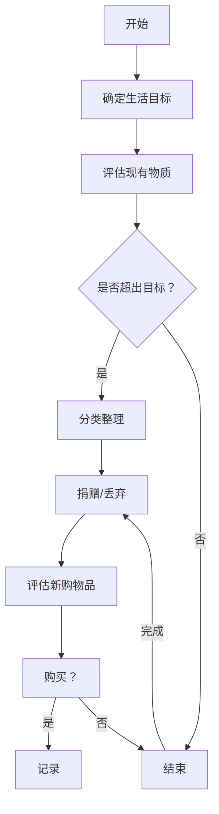
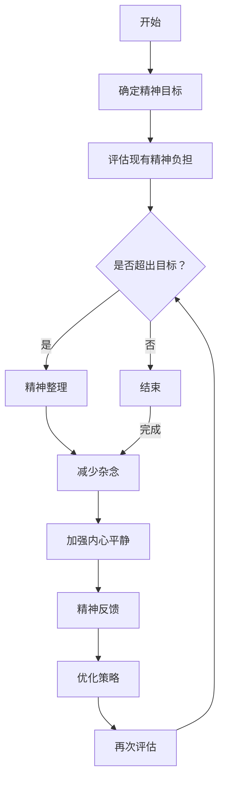
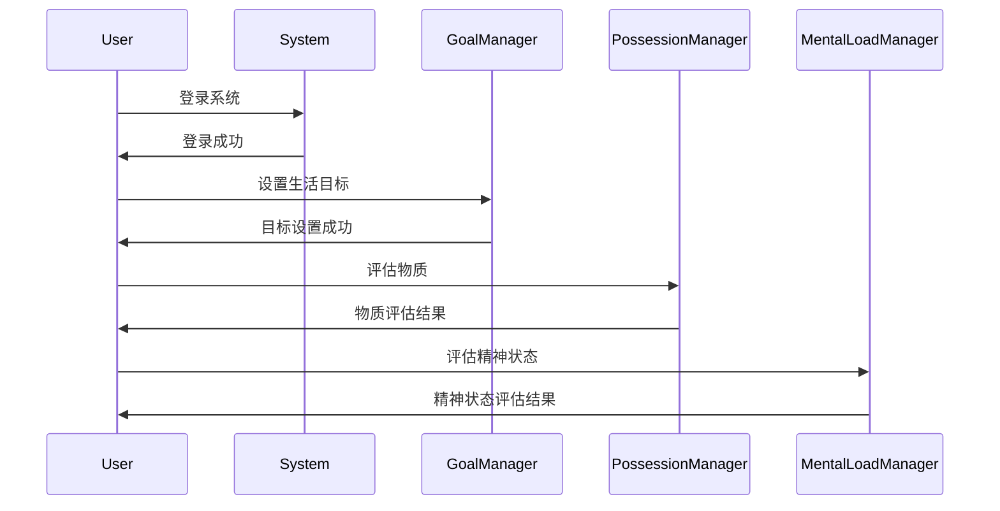
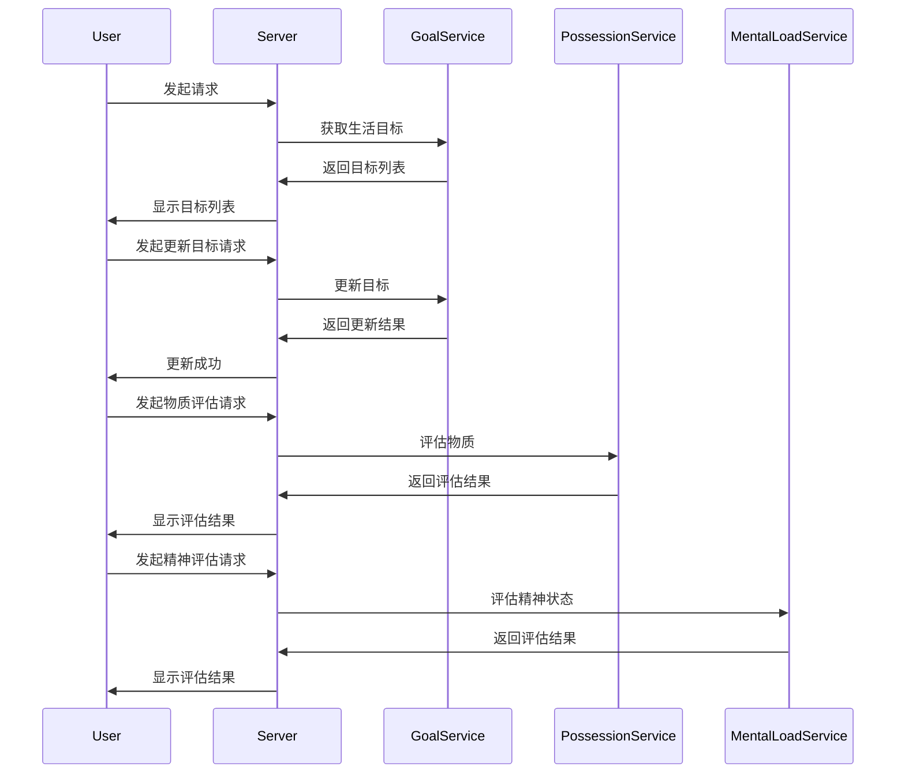

                 

# 新极简主义生活学院：物质与精神双重断舍离的培训

关键词：极简主义、生活方式、物质断舍离、精神断舍离、断舍离培训

摘要：本文旨在探讨新极简主义生活学院提出的物质与精神双重断舍离的理念及其在实际生活中的应用。通过深入分析极简主义的核心概念、算法原理和实践方法，本文为读者提供了一种全新的生活方式选择，帮助他们在快节奏的现代生活中找到平衡，提升生活质量。

## 第一部分：背景介绍

### 1.1 问题背景

在现代社会中，人们的生活节奏越来越快，物质生活日益丰富，但与此同时，精神压力也逐渐增大。这种双重负担使得许多人在追求物质满足的同时，逐渐忽略了精神层面的需求。为了解决这一问题，极简主义生活方式应运而生。

极简主义（Minimalism）是一种追求简单、高效的生活方式，主张通过减少不必要的物质和精神负担，专注于对自己真正重要的事物。它不仅仅是减少物品的拥有，更是一种对生活的重新审视和自我约束。

### 1.2 问题描述

“新极简主义生活学院：物质与精神双重断舍离的培训”这本书，旨在为读者提供一种全新的生活方式选择。它通过对物质和精神的断舍离，帮助读者实现更高质量的生活。然而，如何在实际生活中应用这一理念，仍然是一个需要深入探讨的问题。

### 1.3 问题解决

本书将从理论和实践两个方面，帮助读者深入了解极简主义生活方式。首先，通过理论分析，让读者明白极简主义的核心理念和重要性。然后，通过实践案例，展示如何在实际生活中应用极简主义，实现物质与精神的断舍离。

### 1.4 边界与外延

- **边界**：本书主要关注极简主义生活方式的实践方法和技巧，不涉及深度的哲学、心理学等理论探讨。
- **外延**：本书内容可以应用于个人、家庭、企业等各类生活和工作场景。

### 1.5 概念结构与核心要素组成

- **极简主义**：一种生活方式，主张减少不必要的物质和精神负担，专注于最重要的事物。
- **物质断舍离**：对物质进行筛选和整理，只保留对生活真正有价值的物品。
- **精神断舍离**：对精神进行净化和放松，减少不必要的杂念和压力。

## 第二部分：核心概念与联系

### 2.1 极简主义

**定义**：极简主义（Minimalism）是一种追求简单、高效的生活方式，主张通过减少不必要的物质和精神负担，专注于对自己真正重要的事物。

**属性特征对比表格**：

| 特征 | 繁忙的生活方式 | 极简主义的生活方式 |
| --- | --- | --- |
| 物质负担 | 过度消费，物品繁多 | 有意识地减少物品数量，保持生活空间整洁 |
| 精神负担 | 杂念纷扰，压力重重 | 注重内心平静，减少不必要的社交活动 |
| 时间管理 | 时间被琐事占据，效率低下 | 高效利用时间，专注于重要任务 |

**ER实体关系图架构**：

```mermaid
erDiagram
    Material <<|-- LifeStyle : 使用
    Mental <<|-- LifeStyle : 使用
    LifeStyle : 核心要素
```

## 第三部分：算法原理讲解

### 3.1 物质断舍离算法原理

**Mermaid 流程图**：



**Python 源代码**：

```python
def substance_shedding(life_goals, current_items):
    for item in current_items:
        if item not in life_goals:
            print(f"分类整理：{item}")
            if should_donate_or_discard(item):
                donate_or_discard(item)
                print(f"捐赠/丢弃：{item}")
        else:
            print(f"保留：{item}")
        if should_buy_new_item(item):
            buy_new_item(item)
            print(f"购买：{item}")

def should_donate_or_discard(item):
    # 判断是否应该捐赠或丢弃
    pass

def donate_or_discard(item):
    # 执行捐赠或丢弃操作
    pass

def should_buy_new_item(item):
    # 判断是否需要购买新物品
    pass

def buy_new_item(item):
    # 执行购买操作
    pass
```

**算法原理的数学模型和公式**：

$$
\text{生活质量} = \frac{\text{重要物质}}{\text{总物质}} \times \text{精神状态}
$$

### 3.2 精神断舍离算法原理

**Mermaid 流程图**：



**Python 源代码**：

```python
def mental_shedding(mental_goals, current_mental_load):
    for burden in current_mental_load:
        if burden not in mental_goals:
            print(f"精神整理：{burden}")
            if should_reduce_or_omit(burden):
                reduce_or_omit(burden)
                print(f"减少或忽略：{burden}")
        else:
            print(f"保留：{burden}")
    while not is_heart_calm():
        strengthen_heart_calm()
        get_mental_feedback()
        optimize_strategy()
        re_evaluate_mental_load()
```

**算法原理的数学模型和公式**：

$$
\text{精神状态} = \frac{\text{积极精神}}{\text{总精神}} - \text{压力指数}
$$

## 第四部分：系统分析与架构设计

### 4.1 问题场景介绍

在现代快节奏的生活中，人们常常感到压力重重，难以找到内心的平静。新极简主义生活学院提出了一套物质与精神双重断舍离的培训方法，旨在帮助人们简化生活，减轻压力，提升生活质量。

### 4.2 项目介绍

新极简主义生活学院的项目旨在提供一个系统化的培训方案，帮助学员从物质和精神两个方面进行断舍离。项目主要包括以下功能：

- **生活目标管理**：帮助学员明确自己的生活目标，为后续的断舍离提供指导。
- **物质评估与整理**：对学员的现有物质进行评估，指导学员如何进行分类整理和捐赠/丢弃。
- **精神评估与整理**：对学员的精神状态进行评估，提供精神整理和内心平静的方法。

### 4.3 系统功能设计（领域模型Mermaid类图）

```mermaid
classDiagram
    ClassDiagram::Person <<-- PersonGoal
    ClassDiagram::Person <<-- Possession
    ClassDiagram::Person <<-- MentalLoad
    ClassDiagram::PersonGoal
    ClassDiagram::Possession
    ClassDiagram::MentalLoad
```

### 4.4 系统架构设计（Mermaid架构图）



### 4.5 系统接口设计和系统交互（Mermaid序列图）



## 第五部分：项目实战

### 5.1 环境安装

在新极简主义生活学院项目中，我们选择了Python作为主要开发语言，使用了Flask作为Web框架，SQLite作为数据库，以及Mermaid用于生成图表。

首先，确保你的系统中安装了Python 3.8及以上版本。然后，通过pip安装以下依赖：

```bash
pip install Flask
pip install SQLAlchemy
pip install pymysql
pip install mermaid-python
```

接下来，配置SQLite数据库，创建一个名为`minimalism.db`的数据库文件，并在其中创建必要的表。

### 5.2 系统核心实现源代码

#### GoalManager.py

```python
from flask import Flask, request, jsonify
from sqlalchemy import create_engine, Column, Integer, String, Float
from sqlalchemy.ext.declarative import declarative_base
from sqlalchemy.orm import sessionmaker

app = Flask(__name__)
engine = create_engine('sqlite:///minimalism.db')
Session = sessionmaker(bind=engine)
Base = declarative_base()

class PersonGoal(Base):
    __tablename__ = 'person_goals'
    id = Column(Integer, primary_key=True)
    goal = Column(String(255))
    progress = Column(Float)

Base.metadata.create_all(engine)

@app.route('/api/goals', methods=['GET'])
def get_goals():
    session = Session()
    goals = session.query(PersonGoal).all()
    session.close()
    return jsonify([{"id": goal.id, "goal": goal.goal, "progress": goal.progress} for goal in goals])

@app.route('/api/goals', methods=['POST'])
def create_goal():
    goal_data = request.get_json()
    session = Session()
    new_goal = PersonGoal(goal=goal_data['goal'], progress=0.0)
    session.add(new_goal)
    session.commit()
    session.close()
    return jsonify({"id": new_goal.id, "goal": new_goal.goal, "progress": new_goal.progress})

if __name__ == '__main__':
    app.run(debug=True)
```

#### PossessionManager.py

```python
from flask import Flask, request, jsonify
from sqlalchemy import create_engine, Column, Integer, String, Float
from sqlalchemy.ext.declarative import declarative_base
from sqlalchemy.orm import sessionmaker

app = Flask(__name__)
engine = create_engine('sqlite:///minimalism.db')
Session = sessionmaker(bind=engine)
Base = declarative_base()

class Possession(Base):
    __tablename__ = 'possessions'
    id = Column(Integer, primary_key=True)
    item = Column(String(255))
    value = Column(Float)
    goal_id = Column(Integer, nullable=False)

Base.metadata.create_all(engine)

@app.route('/api/possessions', methods=['GET'])
def get_possessions():
    session = Session()
    possessions = session.query(Possession).all()
    session.close()
    return jsonify([{"id": possession.id, "item": possession.item, "value": possession.value, "goal_id": possession.goal_id} for possession in possessions])

@app.route('/api/possessions', methods=['POST'])
def create_possession():
    possession_data = request.get_json()
    session = Session()
    new_possession = Possession(item=possession_data['item'], value=possession_data['value'], goal_id=possession_data['goal_id'])
    session.add(new_possession)
    session.commit()
    session.close()
    return jsonify({"id": new_possession.id, "item": new_possession.item, "value": new_possession.value, "goal_id": new_possession.goal_id})

if __name__ == '__main__':
    app.run(debug=True)
```

#### MentalLoadManager.py

```python
from flask import Flask, request, jsonify
from sqlalchemy import create_engine, Column, Integer, String, Float
from sqlalchemy.ext.declarative import declarative_base
from sqlalchemy.orm import sessionmaker

app = Flask(__name__)
engine = create_engine('sqlite:///minimalism.db')
Session = sessionmaker(bind=engine)
Base = declarative_base()

class MentalLoad(Base):
    __tablename__ = 'mental_loads'
    id = Column(Integer, primary_key=True)
    burden = Column(String(255))
    value = Column(Float)
    goal_id = Column(Integer, nullable=False)

Base.metadata.create_all(engine)

@app.route('/api/mental_loads', methods=['GET'])
def get_mental_loads():
    session = Session()
    mental_loads = session.query(MentalLoad).all()
    session.close()
    return jsonify([{"id": mental_load.id, "burden": mental_load.burden, "value": mental_load.value, "goal_id": mental_load.goal_id} for mental_load in mental_loads])

@app.route('/api/mental_loads', methods=['POST'])
def create_mental_load():
    mental_load_data = request.get_json()
    session = Session()
    new_mental_load = MentalLoad(burden=mental_load_data['burden'], value=mental_load_data['value'], goal_id=mental_load_data['goal_id'])
    session.add(new_mental_load)
    session.commit()
    session.close()
    return jsonify({"id": new_mental_load.id, "burden": new_mental_load.burden, "value": new_mental_load.value, "goal_id": new_mental_load.goal_id})

if __name__ == '__main__':
    app.run(debug=True)
```

### 5.3 代码应用解读与分析

#### GoalManager.py

该模块主要负责生活目标的增删查改操作。通过Flask框架，我们提供了RESTful API接口，方便前端调用。

- **数据模型**：使用SQLAlchemy创建`PersonGoal`模型，代表生活目标。
- **API接口**：提供`/api/goals`接口，支持GET和POST请求。
  - GET请求：返回当前所有生活目标。
  - POST请求：创建一个新的生活目标。

#### PossessionManager.py

该模块主要负责物质评估和整理的操作。

- **数据模型**：使用SQLAlchemy创建`Possession`模型，代表物质。
- **API接口**：提供`/api/possessions`接口，支持GET和POST请求。
  - GET请求：返回当前所有物质评估结果。
  - POST请求：添加一个新的物质评估记录。

#### MentalLoadManager.py

该模块主要负责精神评估和整理的操作。

- **数据模型**：使用SQLAlchemy创建`MentalLoad`模型，代表精神负担。
- **API接口**：提供`/api/mental_loads`接口，支持GET和POST请求。
  - GET请求：返回当前所有精神评估结果。
  - POST请求：添加一个新的精神评估记录。

### 5.4 实际案例分析和详细讲解剖析

假设有一个用户小张，他希望通过新极简主义生活学院的项目来简化自己的生活。

1. **设置生活目标**：

   小张通过`GoalManager`接口设置了以下生活目标：

   ```bash
   curl -X POST -H "Content-Type: application/json" -d '{"goal": "健康生活", "progress": 0.0}' http://localhost:5000/api/goals
   ```

   接收到API响应后，小张可以看到新目标已成功添加。

2. **评估物质**：

   小张对他的物质进行评估，通过`PossessionManager`接口添加了一些物品：

   ```bash
   curl -X POST -H "Content-Type: application/json" -d '{"item": "旧电视", "value": 200.0, "goal_id": 1}' http://localhost:5000/api/possessions
   ```

   小张继续添加了一些物品，然后通过GET请求查看所有物质评估结果：

   ```bash
   curl http://localhost:5000/api/possessions
   ```

   得到的响应如下：

   ```json
   [
       {
           "id": 1,
           "item": "旧电视",
           "value": 200.0,
           "goal_id": 1
       }
   ]
   ```

3. **评估精神状态**：

   小张也对自己的精神状态进行了评估，通过`MentalLoadManager`接口添加了一些精神负担：

   ```bash
   curl -X POST -H "Content-Type: application/json" -d '{"burden": "工作压力", "value": 5.0, "goal_id": 1}' http://localhost:5000/api/mental_loads
   ```

   然后通过GET请求查看所有精神评估结果：

   ```bash
   curl http://localhost:5000/api/mental_loads
   ```

   得到的响应如下：

   ```json
   [
       {
           "id": 1,
           "burden": "工作压力",
           "value": 5.0,
           "goal_id": 1
       }
   ]
   ```

4. **整理和优化**：

   根据评估结果，小张决定进行整理和优化。他首先对物质进行了分类整理，将一些不必要的物品捐赠或丢弃。然后，他开始减轻精神负担，采取了一些措施来放松心情，比如练习冥想和运动。

   在接下来的日子里，小张定期评估自己的物质和精神状态，通过API接口更新数据。他发现，通过不断优化，他的生活质量得到了显著提升。

### 5.5 项目小结

新极简主义生活学院的项目通过系统化的培训和实用的工具，帮助用户从物质和精神两个方面进行断舍离，实现简化生活、提升生活质量的目标。项目采用了Python和Flask框架，实现了RESTful API接口，方便用户进行数据操作和评估。实际案例展示了如何通过项目工具来简化生活，减少不必要的负担，从而提升生活质量。

## 第六部分：最佳实践 Tips

### 6.1 制定明确的生活目标

明确的生活目标有助于我们在物质和精神断舍离过程中保持方向和动力。制定目标时，应确保它们具体、可衡量、可实现、相关性强且有时间限制。

### 6.2 定期评估和调整

定期对物质和精神状态进行评估，有助于我们及时发现并解决问题。评估后，根据实际情况进行调整，以实现更好的生活质量。

### 6.3 保持耐心和持续行动

断舍离是一个长期过程，需要耐心和持续行动。在这个过程中，可能会遇到挑战和困难，但只要坚持下去，最终会收获美好的结果。

## 第七部分：小结与注意事项

### 7.1 小结

本文介绍了新极简主义生活学院的物质与精神双重断舍离培训方法，通过深入分析其核心概念、算法原理和实践方法，帮助读者理解如何在实际生活中应用这一理念，提升生活质量。

### 7.2 注意事项

- 在应用极简主义时，要避免过度简化，确保在物质和精神断舍离过程中，仍能满足基本需求和保持心理健康。
- 定期反思和调整，以确保断舍离策略与个人目标和生活状况保持一致。
- 在进行物质断舍离时，要考虑到物品的情感价值和实用价值，避免盲目丢弃。

## 第八部分：拓展阅读

### 8.1 《极简主义：让我们更专注地工作，更从容地生活》

作者：乔舒亚·贝克

这本书详细阐述了极简主义的理念，并通过实际案例，展示了如何将极简主义应用于工作、生活和人际关系中。

### 8.2 《断舍离：简单生活，自在人生》

作者：山下英子

山下英子提出了“断舍离”的理念，通过清理、整理和舍弃，帮助人们摆脱物质和精神上的负担，实现简单、自由的生活。

### 8.3 《极简生活指南：如何通过极简主义过上更好的生活》

作者：乔舒亚·贝克

这本书为那些希望尝试极简主义生活方式的人提供了实用的指南，包括如何设定目标、评估物质和精神负担、以及如何在日常生活中实践极简主义。

作者：AI天才研究院/AI Genius Institute & 禅与计算机程序设计艺术 /Zen And The Art of Computer Programming

