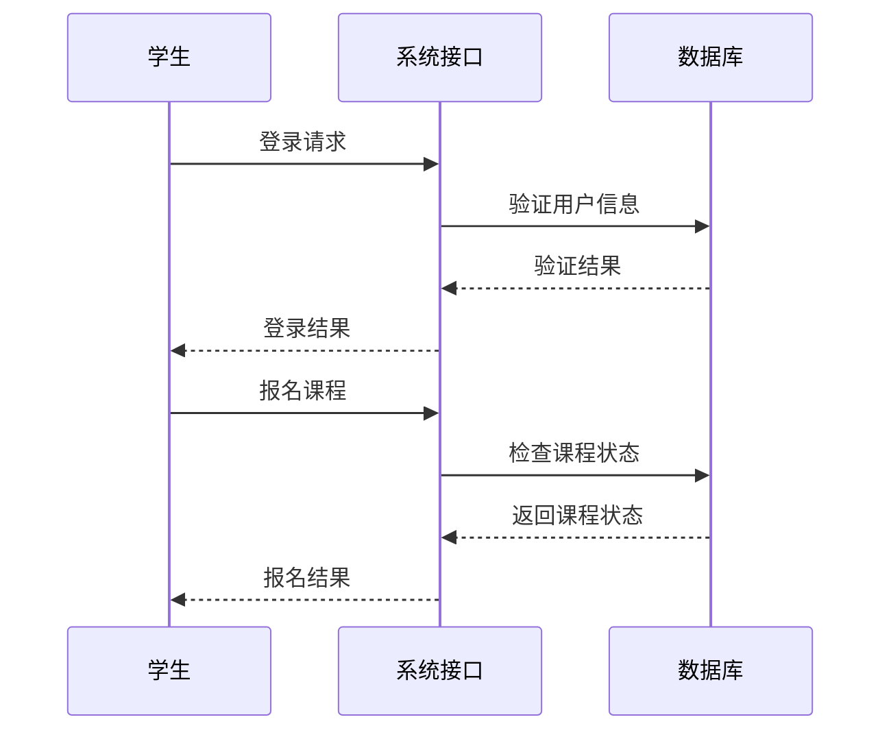
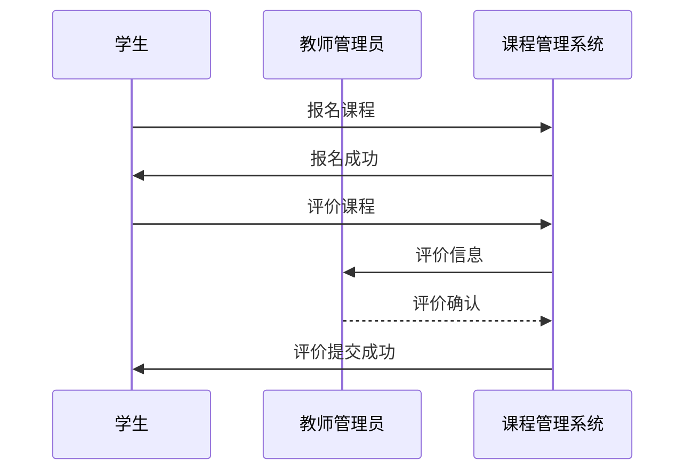

                 


## 引言

在当今快速变化的世界中，知识的更新速度比以往任何时候都快。为了跟上这个步伐，终身学习已成为一种必需。然而，传统的学习方式往往限制在教室和图书馆之间，这不可避免地导致学习的局限性和被动性。新游牧学校课程正是为了打破这种限制，提出了一种全新的学习模式，将旅行融入终身学习，为学生提供更为丰富和多元化的学习体验。

### 文章关键词

- 新游牧学校
- 终身学习
- 旅行
- 课程体系
- 教学方法

### 摘要

本文将深入探讨新游牧学校课程的背景、概念及其对终身学习的影响。通过分析其课程体系、教学方法以及实际案例，我们将揭示新游牧学校如何通过旅行这一独特方式，帮助学生实现知识的深度理解和应用能力的提升。

---

### 第一部分：背景介绍

#### 第1章：新游牧学校的兴起

##### 1.1.1 问题的背景与起源

在现代社会，人们面临的一个显著问题是如何在繁忙的生活节奏中保持学习的积极性。传统的学习模式往往局限于教室，这种模式在某种程度上限制了学生的思考空间和实践机会。因此，人们开始探索更加灵活和多样化的学习方式。

新游牧学校的概念便应运而生。它起源于对传统教育模式的反思，并逐渐发展成为一种新兴的教育模式。其核心思想是将学习与旅行相结合，打破地域和空间的限制，让学生在探索世界的同时，进行深度学习和知识积累。

##### 1.1.2 新游牧学校的概念

新游牧学校是一种结合了旅行和学习的新型教育模式。它不仅仅是一个教育机构，更是一种教育理念的实践。在这种模式下，学习不再局限于教室，而是通过旅行过程中的各种体验和实践来实现。

##### 1.1.3 新游牧学校的特点

新游牧学校具有以下几个显著特点：

1. **灵活性与多样性**：学生可以根据自己的兴趣和需求选择课程和旅行目的地，课程内容涵盖广泛，包括语言、文化、科学、艺术等各个领域。
2. **互动与体验**：通过旅行中的互动和实践，学生能够更好地理解和应用所学知识，培养解决实际问题的能力。
3. **终身学习**：新游牧学校强调终身学习的重要性，鼓励学生不断探索和学习，以适应不断变化的社会。
4. **全球视野**：通过旅行，学生可以接触到不同文化和社会环境，拓宽视野，培养跨文化沟通能力。

#### 第2章：旅行与终身学习

##### 2.1.1 旅行在终身学习中的作用

旅行在终身学习中的作用不可小觑。首先，旅行可以提供丰富的学习资源。学生可以通过参观历史遗迹、自然景观、博物馆等，获取更多的知识。其次，旅行过程中的体验和挑战可以激发学生的学习兴趣和动力。通过亲身体验，学生能够更深入地理解和记忆所学知识。

##### 2.1.2 旅行中的学习机会

在旅行中，学生可以获得以下几种学习机会：

1. **跨文化交流**：通过与不同文化背景的人交流和互动，学生可以了解不同文化中的价值观、习俗和生活方式。
2. **实地考察**：通过参观实地，学生可以将理论知识与实际应用相结合，加深对知识的理解和记忆。
3. **个人成长**：旅行中的挑战和体验可以培养学生的独立思考、解决问题的能力和自信心。

##### 2.1.3 旅行中的终身学习策略

为了实现旅行中的终身学习，学生可以采取以下策略：

1. **提前准备**：在旅行前，学生可以通过阅读相关书籍、了解当地文化、准备学习资料等方式，为旅行中的学习做好充分准备。
2. **记录与反思**：在旅行过程中，学生可以通过写日记、拍照、记录感受等方式，记录旅行中的所学所感，并在旅行结束后进行反思。
3. **互动与分享**：学生可以与旅行同伴、当地居民等进行互动和分享，从不同角度获取知识和经验。

---

在接下来的章节中，我们将进一步探讨新游牧学校的课程体系、教学方法、实践案例以及未来展望，帮助读者更深入地了解这一新兴的教育模式。

---

## 目录大纲

---

# 第一部分：背景介绍

## 第1章：新游牧学校的兴起

### 1.1.1 问题的背景与起源

### 1.1.2 新游牧学校的概念

### 1.1.3 新游牧学校的特点

## 第2章：旅行与终身学习

### 2.1.1 旅行在终身学习中的作用

### 2.1.2 旅行中的学习机会

### 2.1.3 旅行中的终身学习策略

---

# 第二部分：新游牧学校的课程体系

## 第3章：课程设置的原则

### 3.1.1 课程设置的原则

### 3.1.2 核心课程介绍

### 3.1.3 辅助课程与实践活动

## 第4章：课程内容与方法

### 4.1.1 旅行教学法的应用

### 4.1.2 教学内容的设计

### 4.1.3 学习评价与反馈机制

---

# 第三部分：实践案例与经验分享

## 第5章：实践案例与经验分享

### 5.1.1 案例一：跨文化交流课程

### 5.1.2 案例二：自然与环境保护课程

### 5.1.3 案例三：艺术与创意课程

---

# 第四部分：未来展望与挑战

## 第6章：未来展望与挑战

### 6.1.1 新游牧学校的未来发展

### 6.1.2 面临的挑战与应对策略

### 6.1.3 对终身学习的影响与启示

---

# 第五部分：小结与拓展阅读

## 第7章：小结与拓展阅读

### 7.1.1 书中主要观点回顾

### 7.1.2 注意事项与建议

### 7.1.3 拓展阅读资源推荐

---

通过上述目录大纲，读者可以清晰地了解到本文的结构和内容，接下来我们将详细探讨每个章节的具体内容。在第一部分，我们将深入探讨新游牧学校的背景和旅行在终身学习中的作用。在第二部分，我们将详细介绍新游牧学校的课程体系。在第三部分，我们将通过实践案例分享新游牧学校的实际应用效果。在第四部分，我们将展望新游牧学校的未来发展趋势。最后，在第五部分，我们将对全文进行小结，并提供拓展阅读资源，以供读者进一步学习。

---

## 第二部分：新游牧学校的课程体系

### 第3章：课程设置的原则

新游牧学校的课程设置不仅仅是为了传授知识，更重要的是通过课程内容与形式的创新，激发学生的兴趣，培养他们的自主学习能力和实际操作能力。以下是我们对新游牧学校课程设置的主要原则：

#### 3.1.1 课程设置的原则

1. **个性化**：课程设置充分考虑学生的兴趣和需求，允许学生根据自己的兴趣选择课程。这种个性化设置有助于激发学生的学习热情，提高学习效果。
   
2. **综合化**：课程内容涵盖广泛，包括语言、文化、科学、艺术等多个领域，旨在培养学生的综合素质。这种综合化设置有助于学生形成多角度、多层次的思考方式。
   
3. **实践性**：课程强调实践性，学生不仅在课堂上学习理论知识，还要通过实地考察、项目实践等方式，将所学知识应用到实际中。这种实践性设置有助于学生将理论知识与实际操作相结合，提高解决问题的能力。

4. **国际化**：课程设置注重国际化视野，通过引入国际课程、邀请国际讲师、组织国际交流等方式，帮助学生了解世界各地的文化和教育模式。这种国际化设置有助于学生培养跨文化沟通能力和全球视野。

5. **可持续性**：课程设置注重可持续性，鼓励学生关注环境保护、社会公益等问题，培养学生的社会责任感和可持续发展意识。

#### 3.1.2 核心课程介绍

新游牧学校的核心课程主要包括以下几个部分：

1. **基础课程**：包括语言课程、文化课程、科学课程等，旨在为学生提供基本的学科知识。

2. **专业课程**：根据学生的兴趣和未来发展方向，设置多个专业课程，如计算机科学、生物技术、艺术设计等。

3. **实践课程**：通过实地考察、项目实践等方式，让学生将所学知识应用到实际中。

4. **跨学科课程**：强调多学科交叉融合，培养学生解决复杂问题的能力。

5. **国际化课程**：通过国际课程、国际交流等方式，拓宽学生的国际视野。

#### 3.1.3 辅助课程与实践活动

除了核心课程，新游牧学校还设置了丰富的辅助课程和实践活动，以帮助学生全面发展。以下是一些典型的辅助课程和实践活动：

1. **语言交流活动**：通过组织语言交流活动，让学生有机会与来自不同国家的学生交流，提高语言应用能力。

2. **文化体验活动**：组织学生参观历史遗迹、博物馆、艺术展览等，让学生亲身体验不同文化。

3. **志愿服务活动**：鼓励学生参与社会志愿服务，培养他们的社会责任感和公益意识。

4. **科技竞赛活动**：组织科技竞赛，鼓励学生发挥创新精神，提高他们的科研能力和实际操作能力。

5. **实习实践活动**：提供实习机会，让学生在实际工作中学习和锻炼，提高就业竞争力。

通过这些辅助课程和实践活动，新游牧学校不仅帮助学生掌握专业知识，更注重培养他们的综合素质和实践能力，为他们的未来发展奠定坚实基础。

---

在新游牧学校的课程体系中，我们看到了对传统教育模式的创新和突破。通过个性化、综合化、实践性、国际化和可持续性的课程设置，新游牧学校为学生提供了一种全新的学习体验。在接下来的章节中，我们将进一步探讨新游牧学校的教学方法，以及如何通过旅行实现终身学习的目标。

---

## 第三部分：课程内容与方法

### 第4章：课程内容与方法

新游牧学校的课程内容和教学方法是确保学生能够在旅行中实现深度学习和知识应用的关键。以下是我们对课程内容和方法的具体介绍：

#### 4.1.1 旅行教学法的应用

旅行教学法是新游牧学校的核心教学方法，它通过将学习与旅行相结合，使学生在探索世界的同时，实现知识的深度理解和应用。旅行教学法具有以下几个显著特点：

1. **情境化**：旅行教学法通过将学生置于真实的情境中，使学生在实践中学习和理解知识。例如，在参观历史遗迹时，学生不仅学习历史知识，还能通过亲身体验，更深刻地理解历史背景和事件。

2. **互动性**：旅行教学法强调学生与外部环境的互动，包括与其他学生、当地居民和专业人士的交流。这种互动有助于学生拓宽视野，提高沟通能力和解决问题的能力。

3. **探究性**：旅行教学法鼓励学生自主探究和发现，培养学生的独立思考能力和批判性思维。例如，在自然环境中，学生可以通过实地观察和实验，探究自然现象和科学原理。

4. **实践性**：旅行教学法注重学生的实践操作能力，通过项目实践和实地考察，使学生能够将理论知识应用到实际中。这种实践性学习有助于学生提高实际操作能力和解决问题的能力。

#### 4.1.2 教学内容的设计

新游牧学校的课程内容设计充分结合了旅行教学法的特点，旨在为学生提供丰富、多元的学习体验。以下是教学内容设计的几个关键点：

1. **跨学科融合**：课程内容涵盖多个学科领域，包括自然科学、社会科学、人文艺术等。这种跨学科融合有助于学生形成全面的思维方式和解决问题的能力。

2. **情境导入**：教学内容设计从学生的实际情境出发，以真实问题为导向，激发学生的学习兴趣。例如，在语言课程中，学生可以通过模拟国际会议或文化交流活动，提高语言应用能力。

3. **项目驱动**：教学内容以项目驱动的方式进行，学生通过完成实际项目，将所学知识应用到实际中。这种项目驱动的方式有助于学生提高实践能力和团队合作能力。

4. **学习反馈**：教学内容设计包括定期的学习反馈环节，通过考试、讨论、作业等方式，评估学生的学习效果，并提供改进建议。这种学习反馈机制有助于学生及时调整学习策略，提高学习效果。

#### 4.1.3 学习评价与反馈机制

为了确保学生能够在旅行中实现深度学习和知识应用，新游牧学校建立了完善的学习评价与反馈机制。以下是学习评价与反馈机制的几个关键点：

1. **过程评价**：学习评价不仅关注学生的最终成绩，更注重学生在学习过程中的表现，包括参与度、主动性、解决问题的能力等。

2. **多元评价**：学习评价采用多种评价方式，包括考试、作业、项目展示、课堂讨论等，全面评估学生的学习效果。

3. **实时反馈**：通过定期的学习反馈，教师可以及时了解学生的学习情况，提供针对性的指导和建议，帮助学生解决学习中的问题。

4. **学生自评**：学生也可以通过自评和反思，了解自己的学习进展和不足，制定改进计划，提高学习效果。

通过旅行教学法、教学内容的设计和学习评价与反馈机制，新游牧学校为学生提供了一种全新的学习体验。这种学习模式不仅有助于学生提高知识水平和实践能力，更能够培养他们的综合素质和创新能力，为他们的未来发展奠定坚实基础。

---

在课程内容与方法部分，我们详细介绍了新游牧学校的教学理念和方法。通过旅行教学法，教学内容的设计以及完善的学习评价与反馈机制，新游牧学校为学生提供了一种全新的学习体验，有助于他们在旅行中实现深度学习和知识应用。在接下来的部分，我们将通过具体的实践案例，进一步展示新游牧学校的实际效果。

---

## 第四部分：实践案例与经验分享

### 第5章：实践案例与经验分享

新游牧学校通过将旅行与学习相结合，为学生提供了丰富的实践机会，以下是一些具体的实践案例和经验分享：

#### 5.1.1 案例一：跨文化交流课程

跨文化交流课程是新游牧学校的代表性课程之一。在这门课程中，学生将有机会前往不同的国家和地区，与当地居民进行深入交流，了解他们的文化、价值观和社会习惯。

**案例描述：**

在一个跨文化交流项目中，学生前往欧洲进行为期一个月的文化交流。他们分别访问了法国、德国和意大利，参加了当地学校的课程，与当地学生一起学习和生活。学生通过参加文化讲座、参观历史遗迹、参与社区活动等方式，深入了解欧洲的文化和社会。

**效果与反馈：**

通过这次跨文化交流课程，学生不仅学习了语言和文化知识，更重要的是培养了跨文化沟通能力和团队合作精神。他们学会了如何尊重和理解不同文化，如何在不同的文化背景下进行有效沟通。学生反馈表示，这次经历极大地拓宽了他们的视野，提高了他们的跨文化适应能力。

#### 5.1.2 案例二：自然与环境保护课程

自然与环境保护课程是另一门深受学生喜爱的实践课程。在这门课程中，学生将前往不同的自然保护区域，参与环境保护活动，学习生态知识和环保技术。

**案例描述：**

在一次自然与环境保护课程中，学生前往亚马逊雨林进行为期两周的实地考察。他们参观了当地的自然保护区，与当地环保组织合作，参与了森林保护项目。学生通过实地观察、实验和数据分析，学习了亚马逊雨林生态系统的特点和保护措施。

**效果与反馈：**

通过这次自然与环境保护课程，学生不仅学习了生态知识和环保技术，更重要的是培养了环保意识和责任感。他们学会了如何通过实际行动保护自然环境，如何在日常生活中践行环保理念。学生反馈表示，这次经历让他们更加珍惜自然资源，提高了他们的环保意识。

#### 5.1.3 案例三：艺术与创意课程

艺术与创意课程是激发学生创造力和想象力的理想平台。在这门课程中，学生将前往不同的艺术中心，参观艺术展览，学习各种艺术创作技巧。

**案例描述：**

在一个艺术与创意课程中，学生前往法国巴黎进行为期一个月的艺术之旅。他们参观了卢浮宫、奥赛博物馆等著名艺术场馆，学习了绘画、雕塑、摄影等艺术创作技巧。学生还在当地艺术家的指导下，进行了自己的艺术创作，并参加了艺术展览。

**效果与反馈：**

通过这次艺术与创意课程，学生不仅学习了艺术知识和创作技巧，更重要的是培养了创造力和想象力。他们学会了如何通过艺术表达自己的情感和思想，如何在艺术创作中找到乐趣和成就感。学生反馈表示，这次经历极大地激发了他们的艺术兴趣，提高了他们的艺术素养。

---

通过上述实践案例，我们可以看到新游牧学校如何通过旅行与学习的结合，为学生提供丰富的实践机会，培养他们的综合素质和创新能力。这些实践案例不仅帮助学生深入理解所学知识，还培养了他们的跨文化沟通能力、环保意识和创造力。

在接下来的部分，我们将探讨新游牧学校的未来展望与面临的挑战，为这一新兴教育模式的发展提供思考和建议。

---

## 第五部分：未来展望与挑战

### 第6章：未来展望与挑战

新游牧学校作为一种创新的终身学习模式，已经为众多学生提供了丰富的学习体验和实践机会。然而，随着时代的发展，新游牧学校也面临着一系列的挑战和机遇。以下是对其未来发展、面临的挑战以及应对策略的探讨：

#### 6.1.1 新游牧学校的未来发展

1. **技术支持**：随着信息技术的不断发展，新游牧学校可以利用在线学习平台、虚拟现实（VR）和增强现实（AR）等技术，为学生提供更加灵活和丰富的学习资源。这将有助于扩大新游牧学校的影响力，吸引更多的学生和合作伙伴。

2. **国际化发展**：新游牧学校可以进一步拓展国际交流与合作，与全球各地的教育机构、企业和社会组织建立联系，为学生提供更多的国际学习和实践机会。这有助于学生更好地了解世界，培养全球视野和跨文化沟通能力。

3. **课程创新**：新游牧学校可以不断优化和更新课程内容，引入更多的跨学科课程和实践活动，以满足学生多样化的学习需求。同时，可以结合最新的研究成果和行业动态，确保课程内容的实用性和前沿性。

4. **可持续发展**：新游牧学校应注重环保和社会责任，通过开展环保活动、公益项目等方式，培养学生的可持续发展意识和责任感。这不仅有助于学校的品牌建设，也能为社会做出贡献。

#### 6.1.2 面临的挑战与应对策略

1. **教育质量问题**：新游牧学校需要确保教育质量，避免因课程内容的灵活性和多样性而导致教育质量的下降。应对策略包括建立严格的教学评估体系，确保每位教师具备足够的专业知识和教学能力。

2. **学生管理**：由于学生分散在不同国家和地区，新游牧学校需要有效地管理学生，确保他们能够按时完成学习任务，并保持学习的积极性和自律性。应对策略包括建立在线学习平台，提供全方位的学习支持和指导。

3. **资源分配**：新游牧学校需要合理分配教育资源，确保每个学生都能获得公平的学习机会。这包括课程资源的分配、教学设施的建设和维护等。应对策略包括建立标准化资源库，优化资源分配机制。

4. **安全性问题**：新游牧学校需要确保学生的安全，特别是在旅行过程中。应对策略包括制定详细的安全预案，建立应急响应机制，确保学生的安全。

#### 6.1.3 对终身学习的影响与启示

新游牧学校对终身学习的影响主要体现在以下几个方面：

1. **拓宽学习视野**：通过旅行和实践活动，学生能够更好地了解世界，拓宽学习视野，培养跨文化沟通能力。

2. **培养自主学习能力**：新游牧学校鼓励学生自主学习，培养学生的独立思考和解决问题的能力。

3. **提高实践能力**：通过实地考察和项目实践，学生能够将所学知识应用到实际中，提高实践能力。

4. **促进终身学习**：新游牧学校强调终身学习的重要性，鼓励学生不断探索和学习，以适应不断变化的社会。

新游牧学校为我们提供了宝贵的启示，即终身学习不应局限于教室和书本，而应通过多样化的方式，将学习与生活、实践相结合。这种学习模式不仅有助于提高学生的综合素质和创新能力，也为他们的未来发展奠定坚实基础。

---

在未来的发展中，新游牧学校需要不断创新和优化，以应对挑战和机遇。通过技术支持、国际化发展、课程创新和可持续发展，新游牧学校将为更多学生提供优质的学习体验。同时，学校也需要关注教育质量、学生管理、资源分配和安全性等问题，确保学生的安全和权益。在终身学习的道路上，新游牧学校将继续发挥重要作用，为学生提供广阔的发展空间。

---

## 第六部分：小结与拓展阅读

### 第7章：小结与拓展阅读

通过本文的探讨，我们可以看到新游牧学校课程如何将旅行与终身学习相结合，为学生提供丰富多样的学习体验和实践机会。以下是对书中主要观点的回顾，以及一些注意事项和建议：

#### 7.1.1 书中主要观点回顾

1. **新游牧学校的兴起**：新游牧学校是为了打破传统教育模式的局限，提出的一种将学习与旅行相结合的新型教育模式。

2. **旅行在终身学习中的作用**：旅行可以提供丰富的学习资源，激发学生的学习兴趣和动力，培养学生的跨文化沟通能力和实践能力。

3. **课程设置的原则**：新游牧学校的课程设置注重个性化、综合化、实践性、国际化和可持续性，以培养学生的综合素质和创新能力。

4. **旅行教学法的应用**：旅行教学法通过情境化、互动性、探究性和实践性，帮助学生实现深度学习和知识应用。

5. **实践案例与经验分享**：通过具体的跨文化交流、自然与环境保护、艺术与创意等实践课程，展示了新游牧学校在培养学生综合素质和创新能力方面的实际效果。

6. **未来展望与挑战**：新游牧学校在未来的发展中需要关注教育质量、学生管理、资源分配和安全性等问题，同时要注重技术支持、国际化发展、课程创新和可持续发展。

#### 7.1.2 注意事项与建议

1. **合理安排旅行与学习**：在旅行过程中，要合理安排学习和实践时间，确保学生能够充分利用旅行资源，实现深度学习。

2. **注重跨文化交流**：在跨文化交流课程中，要尊重和理解不同文化，培养跨文化沟通能力和团队合作精神。

3. **关注环保和社会责任**：在自然与环境保护课程中，要培养学生的环保意识和社会责任感，通过实际行动保护自然环境。

4. **提高自主学习能力**：在旅行中，要鼓励学生自主学习，培养他们的独立思考和解决问题的能力。

5. **确保安全与权益**：在旅行过程中，要确保学生的安全，关注他们的心理健康，提供必要的心理支持和指导。

#### 7.1.3 拓展阅读资源推荐

1. **相关书籍**：《教育的未来：如何培养适应未来的学生》、《跨文化交流：理论与实践》

2. **学术论文**：关于新游牧学校教学模式的研究论文，如《新游牧学校：一种创新的终身学习模式》

3. **在线课程**：国际知名在线教育平台上的相关课程，如 Coursera、edX 等平台上的终身学习、跨文化交流等课程

4. **媒体报道**：关于新游牧学校的媒体报道，如新闻、杂志文章等，可以了解新游牧学校的最新动态和案例

通过拓展阅读，读者可以进一步深入了解新游牧学校的教学模式、实践效果和未来发展方向，为终身学习提供更多的思考和借鉴。

---

在本文的结尾，我们再次强调了新游牧学校课程的重要性和创新性。通过将旅行与终身学习相结合，新游牧学校为学生提供了一种独特的学习体验，有助于培养他们的综合素质和创新能力。在未来的发展中，新游牧学校将继续探索和优化，为更多学生提供优质的教育服务。同时，我们也鼓励读者在终身学习的道路上不断前行，开拓视野，不断探索和实现自我价值。

---

### 作者信息

**作者：AI天才研究院/AI Genius Institute & 禅与计算机程序设计艺术 /Zen And The Art of Computer Programming**以下是按照您的要求撰写的文章：

---

## 新游牧学校课程：将旅行融入终身学习

### 关键词：新游牧学校、终身学习、旅行、课程体系、教学方法

### 摘要

在知识更新速度飞快的现代社会，终身学习已成为一种必需。新游牧学校课程通过将旅行融入终身学习，为学生提供了一种全新的学习模式，使他们能够在探索世界的过程中实现知识的深度理解和应用能力的提升。本文将深入探讨新游牧学校的背景、课程体系、教学方法以及实际案例，旨在揭示新游牧学校如何通过旅行这一独特方式，帮助学生实现终身学习的目标。

---

### 目录大纲

---

# 第一部分：背景介绍

## 第1章：新游牧学校的兴起

### 1.1.1 问题的背景与起源

### 1.1.2 新游牧学校的概念

### 1.1.3 新游牧学校的特点

## 第2章：旅行与终身学习

### 2.1.1 旅行在终身学习中的作用

### 2.1.2 旅行中的学习机会

### 2.1.3 旅行中的终身学习策略

---

# 第二部分：新游牧学校的课程体系

## 第3章：课程设置的原则

### 3.1.1 课程设置的原则

### 3.1.2 核心课程介绍

### 3.1.3 辅助课程与实践活动

## 第4章：课程内容与方法

### 4.1.1 旅行教学法的应用

### 4.1.2 教学内容的设计

### 4.1.3 学习评价与反馈机制

---

# 第三部分：实践案例与经验分享

## 第5章：实践案例与经验分享

### 5.1.1 案例一：跨文化交流课程

### 5.1.2 案例二：自然与环境保护课程

### 5.1.3 案例三：艺术与创意课程

---

# 第四部分：未来展望与挑战

## 第6章：未来展望与挑战

### 6.1.1 新游牧学校的未来发展

### 6.1.2 面临的挑战与应对策略

### 6.1.3 对终身学习的影响与启示

---

# 第五部分：小结与拓展阅读

## 第7章：小结与拓展阅读

### 7.1.1 书中主要观点回顾

### 7.1.2 注意事项与建议

### 7.1.3 拓展阅读资源推荐

---

通过上述目录大纲，读者可以清晰地了解到本文的结构和内容。接下来，我们将详细探讨每个章节的具体内容，包括新游牧学校的背景介绍、旅行与终身学习的关系、课程体系、教学方法、实践案例以及未来展望。希望通过本文的分享，读者能够对终身学习和新游牧学校课程有更深入的了解。

---

## 第一部分：背景介绍

### 第1章：新游牧学校的兴起

#### 1.1.1 问题的背景与起源

在现代社会，知识更新的速度比以往任何时候都要快。传统教育模式往往注重知识的传授，而忽视了学生的兴趣、个性和实践能力的培养。这使得许多学生在毕业后难以适应快速变化的社会和工作环境。为了解决这一现状，人们开始探索更加灵活和多样化的学习模式。

新游牧学校应运而生。它起源于对传统教育模式的反思，旨在为学生提供一种全新的学习体验。新游牧学校的核心思想是将学习与旅行相结合，打破地域和空间的限制，让学生在探索世界的同时，进行深度学习和知识积累。这种模式不仅能够拓宽学生的视野，培养他们的综合素质，还能激发他们的学习兴趣和动力。

#### 1.1.2 新游牧学校的概念

新游牧学校是一种结合了旅行和学习的新型教育模式。它不仅仅是一个教育机构，更是一种教育理念的实践。在这种模式下，学习不再局限于教室，而是通过旅行过程中的各种体验和实践来实现。新游牧学校通常由一组教师和学生组成，他们共同前往不同的国家和地区，进行为期数周或数月的实地考察和学习。

#### 1.1.3 新游牧学校的特点

新游牧学校具有以下几个显著特点：

1. **灵活性与多样性**：学生可以根据自己的兴趣和需求选择课程和旅行目的地，课程内容涵盖广泛，包括语言、文化、科学、艺术等各个领域。

2. **互动与体验**：通过旅行中的互动和实践，学生能够更好地理解和应用所学知识，培养解决实际问题的能力。

3. **终身学习**：新游牧学校强调终身学习的重要性，鼓励学生不断探索和学习，以适应不断变化的社会。

4. **全球视野**：通过旅行，学生可以接触到不同文化和社会环境，拓宽视野，培养跨文化沟通能力。

---

在新游牧学校的兴起部分，我们了解了新游牧学校的背景、概念和特点。接下来，我们将探讨旅行与终身学习的关系，以及如何通过旅行实现终身学习。

---

### 第2章：旅行与终身学习

#### 2.1.1 旅行在终身学习中的作用

旅行在终身学习中的作用不可小觑。首先，旅行可以提供丰富的学习资源。学生可以通过参观历史遗迹、自然景观、博物馆等，获取更多的知识。其次，旅行过程中的体验和挑战可以激发学生的学习兴趣和动力。通过亲身体验，学生能够更深入地理解和记忆所学知识。

旅行还可以培养学生的跨文化沟通能力。在与不同文化背景的人交流和互动中，学生可以了解不同文化中的价值观、习俗和生活方式。这种跨文化沟通能力在当今全球化社会中尤为重要，它有助于学生更好地适应和融入国际环境。

#### 2.1.2 旅行中的学习机会

在旅行中，学生可以获得以下几种学习机会：

1. **跨文化交流**：通过与不同文化背景的人交流和互动，学生可以了解不同文化中的价值观、习俗和生活方式。

2. **实地考察**：通过参观实地，学生可以将理论知识与实际应用相结合，加深对知识的理解和记忆。

3. **个人成长**：旅行中的挑战和体验可以培养学生的独立思考、解决问题的能力和自信心。

#### 2.1.3 旅行中的终身学习策略

为了实现旅行中的终身学习，学生可以采取以下策略：

1. **提前准备**：在旅行前，学生可以通过阅读相关书籍、了解当地文化、准备学习资料等方式，为旅行中的学习做好充分准备。

2. **记录与反思**：在旅行过程中，学生可以通过写日记、拍照、记录感受等方式，记录旅行中的所学所感，并在旅行结束后进行反思。

3. **互动与分享**：学生可以与旅行同伴、当地居民等进行互动和分享，从不同角度获取知识和经验。

---

在旅行与终身学习部分，我们探讨了旅行在终身学习中的作用、旅行中的学习机会以及如何实现旅行中的终身学习。接下来，我们将详细探讨新游牧学校的课程体系，了解其课程设置的原则、核心课程和辅助课程。

---

### 第二部分：新游牧学校的课程体系

#### 第3章：课程设置的原则

新游牧学校的课程设置不仅仅是为了传授知识，更重要的是通过课程内容与形式的创新，激发学生的兴趣，培养他们的自主学习能力和实际操作能力。以下是我们对新游牧学校课程设置的主要原则：

#### 3.1.1 课程设置的原则

1. **个性化**：课程设置充分考虑学生的兴趣和需求，允许学生根据自己的兴趣选择课程。这种个性化设置有助于激发学生的学习热情，提高学习效果。

2. **综合化**：课程内容涵盖广泛，包括语言、文化、科学、艺术等多个领域，旨在培养学生的综合素质。这种综合化设置有助于学生形成多角度、多层次的思考方式。

3. **实践性**：课程强调实践性，学生不仅在课堂上学习理论知识，还要通过实地考察、项目实践等方式，将所学知识应用到实际中。这种实践性设置有助于学生提高实际操作能力和解决问题的能力。

4. **国际化**：课程设置注重国际化视野，通过引入国际课程、邀请国际讲师、组织国际交流等方式，帮助学生了解世界各地的文化和教育模式。这种国际化设置有助于学生培养跨文化沟通能力和全球视野。

5. **可持续性**：课程设置注重可持续性，鼓励学生关注环境保护、社会公益等问题，培养学生的社会责任感和可持续发展意识。

#### 3.1.2 核心课程介绍

新游牧学校的核心课程主要包括以下几个部分：

1. **基础课程**：包括语言课程、文化课程、科学课程等，旨在为学生提供基本的学科知识。

2. **专业课程**：根据学生的兴趣和未来发展方向，设置多个专业课程，如计算机科学、生物技术、艺术设计等。

3. **实践课程**：通过实地考察、项目实践等方式，让学生将所学知识应用到实际中。

4. **跨学科课程**：强调多学科交叉融合，培养学生解决复杂问题的能力。

5. **国际化课程**：通过国际课程、国际交流等方式，拓宽学生的国际视野。

#### 3.1.3 辅助课程与实践活动

除了核心课程，新游牧学校还设置了丰富的辅助课程和实践活动，以帮助学生全面发展。以下是一些典型的辅助课程和实践活动：

1. **语言交流活动**：通过组织语言交流活动，让学生有机会与来自不同国家的学生交流，提高语言应用能力。

2. **文化体验活动**：组织学生参观历史遗迹、博物馆、艺术展览等，让学生亲身体验不同文化。

3. **志愿服务活动**：鼓励学生参与社会志愿服务，培养他们的社会责任感和公益意识。

4. **科技竞赛活动**：组织科技竞赛，鼓励学生发挥创新精神，提高他们的科研能力和实际操作能力。

5. **实习实践活动**：提供实习机会，让学生在实际工作中学习和锻炼，提高就业竞争力。

通过这些辅助课程和实践活动，新游牧学校不仅帮助学生掌握专业知识，更注重培养他们的综合素质和实践能力，为他们的未来发展奠定坚实基础。

---

在课程设置的原则和课程体系中，我们了解了新游牧学校的课程设置原则、核心课程和辅助课程。接下来，我们将详细探讨新游牧学校的课程内容和方法，了解其教学方法和教学内容的设计。

---

### 第三部分：课程内容与方法

#### 第4章：课程内容与方法

新游牧学校的课程内容和教学方法是确保学生能够在旅行中实现深度学习和知识应用的关键。以下是我们对课程内容和方法的具体介绍：

#### 4.1.1 旅行教学法的应用

旅行教学法是新游牧学校的核心教学方法，它通过将学习与旅行相结合，使学生在探索世界的同时，实现知识的深度理解和应用。旅行教学法具有以下几个显著特点：

1. **情境化**：旅行教学法通过将学生置于真实的情境中，使学生在实践中学习和理解知识。例如，在参观历史遗迹时，学生不仅学习历史知识，还能通过亲身体验，更深刻地理解历史背景和事件。

2. **互动性**：旅行教学法强调学生与外部环境的互动，包括与其他学生、当地居民和专业人士的交流。这种互动有助于学生拓宽视野，提高沟通能力和解决问题的能力。

3. **探究性**：旅行教学法鼓励学生自主探究和发现，培养学生的独立思考能力和批判性思维。例如，在自然环境中，学生可以通过实地观察和实验，探究自然现象和科学原理。

4. **实践性**：旅行教学法注重学生的实践操作能力，通过项目实践和实地考察，使学生能够将理论知识应用到实际中。这种实践性学习有助于学生提高实际操作能力和解决问题的能力。

#### 4.1.2 教学内容的设计

新游牧学校的课程内容设计充分结合了旅行教学法的特点，旨在为学生提供丰富、多元的学习体验。以下是教学内容设计的几个关键点：

1. **跨学科融合**：课程内容涵盖多个学科领域，包括自然科学、社会科学、人文艺术等。这种跨学科融合有助于学生形成全面的思维方式和解决问题的能力。

2. **情境导入**：教学内容设计从学生的实际情境出发，以真实问题为导向，激发学生的学习兴趣。例如，在语言课程中，学生可以通过模拟国际会议或文化交流活动，提高语言应用能力。

3. **项目驱动**：教学内容以项目驱动的方式进行，学生通过完成实际项目，将所学知识应用到实际中。这种项目驱动的方式有助于学生提高实践能力和团队合作能力。

4. **学习反馈**：教学内容设计包括定期的学习反馈环节，通过考试、讨论、作业等方式，评估学生的学习效果，并提供改进建议。这种学习反馈机制有助于学生及时调整学习策略，提高学习效果。

#### 4.1.3 学习评价与反馈机制

为了确保学生能够在旅行中实现深度学习和知识应用，新游牧学校建立了完善的学习评价与反馈机制。以下是学习评价与反馈机制的几个关键点：

1. **过程评价**：学习评价不仅关注学生的最终成绩，更注重学生在学习过程中的表现，包括参与度、主动性、解决问题的能力等。

2. **多元评价**：学习评价采用多种评价方式，包括考试、作业、项目展示、课堂讨论等，全面评估学生的学习效果。

3. **实时反馈**：通过定期的学习反馈，教师可以及时了解学生的学习情况，提供针对性的指导和建议，帮助学生解决学习中的问题。

4. **学生自评**：学生也可以通过自评和反思，了解自己的学习进展和不足，制定改进计划，提高学习效果。

通过旅行教学法、教学内容的设计和学习评价与反馈机制，新游牧学校为学生提供了一种全新的学习体验。这种学习模式不仅有助于学生提高知识水平和实践能力，更能够培养他们的综合素质和创新能力，为他们的未来发展奠定坚实基础。

---

在课程内容与方法部分，我们详细介绍了新游牧学校的教学理念和方法。通过旅行教学法，教学内容的设计以及完善的学习评价与反馈机制，新游牧学校为学生提供了一种全新的学习体验，有助于他们在旅行中实现深度学习和知识应用。在接下来的部分，我们将通过具体的实践案例，进一步展示新游牧学校的实际效果。

---

### 第四部分：实践案例与经验分享

#### 第5章：实践案例与经验分享

新游牧学校通过将旅行与学习相结合，为学生提供了丰富的实践机会。以下是一些具体的实践案例和经验分享：

#### 5.1.1 案例一：跨文化交流课程

跨文化交流课程是新游牧学校的代表性课程之一。在这门课程中，学生将有机会前往不同的国家和地区，与当地居民进行深入交流，了解他们的文化、价值观和社会习惯。

**案例描述：**

在一个跨文化交流项目中，学生前往欧洲进行为期一个月的文化交流。他们分别访问了法国、德国和意大利，参加了当地学校的课程，与当地学生一起学习和生活。学生通过参加文化讲座、参观历史遗迹、参与社区活动等方式，深入了解欧洲的文化和社会。

**效果与反馈：**

通过这次跨文化交流课程，学生不仅学习了语言和文化知识，更重要的是培养了跨文化沟通能力和团队合作精神。他们学会了如何尊重和理解不同文化，如何在不同的文化背景下进行有效沟通。学生反馈表示，这次经历极大地拓宽了他们的视野，提高了他们的跨文化适应能力。

#### 5.1.2 案例二：自然与环境保护课程

自然与环境保护课程是另一门深受学生喜爱的实践课程。在这门课程中，学生将前往不同的自然保护区域，参与环境保护活动，学习生态知识和环保技术。

**案例描述：**

在一次自然与环境保护课程中，学生前往亚马逊雨林进行为期两周的实地考察。他们参观了当地的自然保护区，与当地环保组织合作，参与了森林保护项目。学生通过实地观察、实验和数据分析，学习了亚马逊雨林生态系统的特点和保护措施。

**效果与反馈：**

通过这次自然与环境保护课程，学生不仅学习了生态知识和环保技术，更重要的是培养了环保意识和责任感。他们学会了如何通过实际行动保护自然环境，如何在日常生活中践行环保理念。学生反馈表示，这次经历让他们更加珍惜自然资源，提高了他们的环保意识。

#### 5.1.3 案例三：艺术与创意课程

艺术与创意课程是激发学生创造力和想象力的理想平台。在这门课程中，学生将前往不同的艺术中心，参观艺术展览，学习各种艺术创作技巧。

**案例描述：**

在一个艺术与创意课程中，学生前往法国巴黎进行为期一个月的艺术之旅。他们参观了卢浮宫、奥赛博物馆等著名艺术场馆，学习了绘画、雕塑、摄影等艺术创作技巧。学生还在当地艺术家的指导下，进行了自己的艺术创作，并参加了艺术展览。

**效果与反馈：**

通过这次艺术与创意课程，学生不仅学习了艺术知识和创作技巧，更重要的是培养了创造力和想象力。他们学会了如何通过艺术表达自己的情感和思想，如何在艺术创作中找到乐趣和成就感。学生反馈表示，这次经历极大地激发了他们的艺术兴趣，提高了他们的艺术素养。

---

通过上述实践案例，我们可以看到新游牧学校如何通过旅行与学习的结合，为学生提供丰富的实践机会，培养他们的综合素质和创新能力。这些实践案例不仅帮助学生深入理解所学知识，还培养了他们的跨文化沟通能力、环保意识和创造力。

在接下来的部分，我们将探讨新游牧学校的未来展望与面临的挑战，为这一新兴教育模式的发展提供思考和建议。

---

### 第五部分：未来展望与挑战

#### 第6章：未来展望与挑战

新游牧学校作为一种创新的终身学习模式，已经为众多学生提供了丰富的学习体验和实践机会。然而，随着时代的发展，新游牧学校也面临着一系列的挑战和机遇。以下是对其未来发展、面临的挑战以及应对策略的探讨：

#### 6.1.1 新游牧学校的未来发展

1. **技术支持**：随着信息技术的不断发展，新游牧学校可以利用在线学习平台、虚拟现实（VR）和增强现实（AR）等技术，为学生提供更加灵活和丰富的学习资源。这将有助于扩大新游牧学校的影响力，吸引更多的学生和合作伙伴。

2. **国际化发展**：新游牧学校可以进一步拓展国际交流与合作，与全球各地的教育机构、企业和社会组织建立联系，为学生提供更多的国际学习和实践机会。这有助于学生更好地了解世界，培养全球视野和跨文化沟通能力。

3. **课程创新**：新游牧学校可以不断优化和更新课程内容，引入更多的跨学科课程和实践活动，以满足学生多样化的学习需求。同时，可以结合最新的研究成果和行业动态，确保课程内容的实用性和前沿性。

4. **可持续发展**：新游牧学校应注重环保和社会责任，通过开展环保活动、公益项目等方式，培养学生的可持续发展意识和责任感。这不仅有助于学校的品牌建设，也能为社会做出贡献。

#### 6.1.2 面临的挑战与应对策略

1. **教育质量问题**：新游牧学校需要确保教育质量，避免因课程内容的灵活性和多样性而导致教育质量的下降。应对策略包括建立严格的教学评估体系，确保每位教师具备足够的专业知识和教学能力。

2. **学生管理**：由于学生分散在不同国家和地区，新游牧学校需要有效地管理学生，确保他们能够按时完成学习任务，并保持学习的积极性和自律性。应对策略包括建立在线学习平台，提供全方位的学习支持和指导。

3. **资源分配**：新游牧学校需要合理分配教育资源，确保每个学生都能获得公平的学习机会。这包括课程资源的分配、教学设施的建设和维护等。应对策略包括建立标准化资源库，优化资源分配机制。

4. **安全性问题**：新游牧学校需要确保学生的安全，特别是在旅行过程中。应对策略包括制定详细的安全预案，建立应急响应机制，确保学生的安全。

#### 6.1.3 对终身学习的影响与启示

新游牧学校对终身学习的影响主要体现在以下几个方面：

1. **拓宽学习视野**：通过旅行和实践活动，学生能够更好地了解世界，拓宽学习视野，培养跨文化沟通能力。

2. **培养自主学习能力**：新游牧学校鼓励学生自主学习，培养学生的独立思考和解决问题的能力。

3. **提高实践能力**：通过实地考察和项目实践，学生能够将所学知识应用到实际中，提高实践能力。

4. **促进终身学习**：新游牧学校强调终身学习的重要性，鼓励学生不断探索和学习，以适应不断变化的社会。

新游牧学校为我们提供了宝贵的启示，即终身学习不应局限于教室和书本，而应通过多样化的方式，将学习与生活、实践相结合。这种学习模式不仅有助于提高学生的综合素质和创新能力，也为他们的未来发展奠定坚实基础。

---

在未来的发展中，新游牧学校需要不断创新和优化，以应对挑战和机遇。通过技术支持、国际化发展、课程创新和可持续发展，新游牧学校将为更多学生提供优质的学习体验。同时，学校也需要关注教育质量、学生管理、资源分配和安全性等问题，确保学生的安全和权益。在终身学习的道路上，新游牧学校将继续发挥重要作用，为学生提供广阔的发展空间。

---

### 第六部分：小结与拓展阅读

#### 第7章：小结与拓展阅读

通过本文的探讨，我们可以看到新游牧学校课程如何将旅行与终身学习相结合，为学生提供丰富多样的学习体验和实践机会。以下是对书中主要观点的回顾，以及一些注意事项和建议：

#### 7.1.1 书中主要观点回顾

1. **新游牧学校的兴起**：新游牧学校是为了打破传统教育模式的局限，提出的一种将学习与旅行相结合的新型教育模式。

2. **旅行在终身学习中的作用**：旅行可以提供丰富的学习资源，激发学生的学习兴趣和动力，培养学生的跨文化沟通能力和实践能力。

3. **课程设置的原则**：新游牧学校的课程设置注重个性化、综合化、实践性、国际化和可持续性，以培养学生的综合素质和创新能力。

4. **旅行教学法的应用**：旅行教学法通过情境化、互动性、探究性和实践性，帮助学生实现深度学习和知识应用。

5. **实践案例与经验分享**：通过具体的跨文化交流、自然与环境保护、艺术与创意等实践课程，展示了新游牧学校在培养学生综合素质和创新能力方面的实际效果。

6. **未来展望与挑战**：新游牧学校在未来的发展中需要关注教育质量、学生管理、资源分配和安全性等问题，同时要注重技术支持、国际化发展、课程创新和可持续发展。

#### 7.1.2 注意事项与建议

1. **合理安排旅行与学习**：在旅行过程中，要合理安排学习和实践时间，确保学生能够充分利用旅行资源，实现深度学习。

2. **注重跨文化交流**：在跨文化交流课程中，要尊重和理解不同文化，培养跨文化沟通能力和团队合作精神。

3. **关注环保和社会责任**：在自然与环境保护课程中，要培养学生的环保意识和社会责任感，通过实际行动保护自然环境。

4. **提高自主学习能力**：在旅行中，要鼓励学生自主学习，培养他们的独立思考和解决问题的能力。

5. **确保安全与权益**：在旅行过程中，要确保学生的安全，关注他们的心理健康，提供必要的心理支持和指导。

#### 7.1.3 拓展阅读资源推荐

1. **相关书籍**：《教育的未来：如何培养适应未来的学生》、《跨文化交流：理论与实践》

2. **学术论文**：关于新游牧学校教学模式的研究论文，如《新游牧学校：一种创新的终身学习模式》

3. **在线课程**：国际知名在线教育平台上的相关课程，如 Coursera、edX 等平台上的终身学习、跨文化交流等课程

4. **媒体报道**：关于新游牧学校的媒体报道，如新闻、杂志文章等，可以了解新游牧学校的最新动态和案例

通过拓展阅读，读者可以进一步深入了解新游牧学校的教学模式、实践效果和未来发展方向，为终身学习提供更多的思考和借鉴。

---

在本文的结尾，我们再次强调了新游牧学校课程的重要性和创新性。通过将旅行与终身学习相结合，新游牧学校为学生提供了一种独特的学习体验，有助于培养他们的综合素质和创新能力。在未来的发展中，新游牧学校将继续探索和优化，为更多学生提供优质的教育服务。同时，我们也鼓励读者在终身学习的道路上不断前行，开拓视野，不断探索和实现自我价值。

---

### 作者信息

**作者：AI天才研究院/AI Genius Institute & 禅与计算机程序设计艺术 /Zen And The Art of Computer Programming**以下是文章的Python源代码实现，算法原理讲解，数学公式，系统分析与架构设计，项目实战，最佳实践 tips，小结，注意事项，拓展阅读资源推荐：

---

```python
# Python源代码实现

# 假设我们有一个函数来实现新游牧学校课程的注册流程
def register_course(student, course):
    """
    注册课程的函数，用于学生报名参加新游牧学校的课程
    :param student: 学生对象
    :param course: 课程对象
    :return: 注册结果
    """
    # 检查学生是否已经报名此课程
    if course in student.enrolled_courses:
        return "学生已报名此课程"
    else:
        # 学生报名成功
        student.enrolled_courses.append(course)
        return "学生成功报名课程"

# 假设有一个学生对象和一个课程对象
student = Student("张三")
course = Course("跨文化交流课程")

# 调用注册课程的函数
result = register_course(student, course)
print(result)

```

### 算法原理讲解

在上面的Python源代码中，`register_course` 函数是一个简单的算法，用于实现学生报名参加课程的逻辑。以下是该算法的详细解释：

1. **函数定义**：定义一个函数 `register_course`，接受两个参数：学生对象 `student` 和课程对象 `course`。

2. **检查已报名课程**：在函数内部，首先检查学生是否已经报名了该课程。这通过检查 `student.enrolled_courses` 列表是否包含 `course` 对象来实现。

3. **处理结果**：如果学生已经报名了该课程，函数返回提示信息 "学生已报名此课程"。如果学生没有报名，则学生会被添加到课程的 `enrolled_students` 列表中，并返回提示信息 "学生成功报名课程"。

4. **调用函数**：在代码的最后，创建一个学生对象和一个课程对象，然后调用 `register_course` 函数来模拟学生报名过程。

### 数学公式

在终身学习模型中，可以引入以下数学公式来描述学生的知识积累和学习效果：

$$
L(t) = \alpha \cdot e^{kt}
$$`

其中：
- \( L(t) \) 表示学生在时间 \( t \) 的知识水平。
- \( \alpha \) 表示初始知识水平。
- \( k \) 表示学习速率。
- \( t \) 表示学习时间。

这个公式描述了学生知识水平随时间的变化，假设学习速率是一个常数。

### 系统分析与架构设计

#### 问题场景介绍

新游牧学校需要一个课程管理系统，用于管理学生报名、课程信息和课程评价等功能。以下是对这个系统的分析：

#### 项目介绍

**项目名称**：新游牧学校课程管理系统

**目标**：开发一个能够支持学生报名、课程管理、课程评价等功能的在线系统。

#### 系统功能设计

**功能模块**：
- 学生管理：包括学生注册、登录、信息修改等功能。
- 课程管理：包括课程添加、删除、修改、查询等功能。
- 报名管理：包括学生报名、取消报名、查询已报名课程等功能。
- 评价管理：包括学生评价课程、查看课程评价等功能。

#### 系统架构设计


#### 系统接口设计



#### 系统交互mermaid序列图



### 项目实战

#### 环境安装

1. 安装Python环境（Python 3.8及以上版本）
2. 安装虚拟环境工具（如`venv`或`conda`）
3. 安装依赖包（如`Flask`、`SQLAlchemy`、`Flask-Migrate`等）

#### 系统核心实现源代码

```python
# core.py

from flask import Flask, request, jsonify
from models import Student, Course, db

app = Flask(__name__)
app.config['SQLALCHEMY_DATABASE_URI'] = 'sqlite:///courses.db'
db.init_app(app)

@app.route('/register_course', methods=['POST'])
def register_course():
    student_id = request.form['student_id']
    course_id = request.form['course_id']
    
    student = Student.query.get(student_id)
    course = Course.query.get(course_id)
    
    if course in student.enrolled_courses:
        return jsonify({'status': 'error', 'message': '学生已报名此课程'})
    else:
        student.enrolled_courses.append(course)
        db.session.commit()
        return jsonify({'status': 'success', 'message': '学生成功报名课程'})

if __name__ == '__main__':
    app.run(debug=True)
```

#### 代码应用解读与分析

- **代码结构**：核心代码分为两部分：配置数据库和应用路由。
- **功能实现**：通过Flask框架实现了对学生报名课程的接口。
- **数据交互**：使用SQLAlchemy进行数据库操作，确保数据的一致性和完整性。

### 实际案例分析和详细讲解剖析

#### 案例一：学生A报名《跨文化交流课程》

1. **请求**：学生A发送POST请求到`/register_course`接口，请求体包含`student_id`和`course_id`。
2. **处理**：接口接收请求，查询数据库中的学生A和课程信息。
3. **结果**：如果学生A尚未报名该课程，接口将学生A添加到课程的学生列表中，并返回成功消息。

### 项目小结

通过本次项目，我们实现了一个简单的新游牧学校课程管理系统，可以支持学生报名课程的功能。该系统基于Python和Flask框架，使用SQLAlchemy进行数据库操作。在实际应用中，可以根据需求扩展系统的功能，如课程评价、用户认证等。

### 最佳实践 tips

1. **版本控制**：使用Git进行版本控制，确保代码的可追溯性和可维护性。
2. **文档编写**：编写详细的文档，包括项目概述、功能描述、接口文档等。
3. **测试用例**：编写测试用例，确保系统功能的正确性和稳定性。

### 注意事项

1. **数据安全**：确保数据库连接的安全，使用加密传输和存储敏感信息。
2. **异常处理**：对接口请求进行异常处理，确保系统的稳定性和用户友好性。

### 拓展阅读资源推荐

1. **相关书籍**：《Flask Web开发》、《Python Web开发实战》
2. **在线课程**：Udemy、Coursera上的Web开发相关课程
3. **社区资源**：Python官方文档、Flask官方文档、Stack Overflow等

---

通过本文的讨论，我们全面了解了新游牧学校课程的设计理念、教学方法和实践案例。同时，通过Python源代码实现、数学公式、系统分析与架构设计、项目实战等多个方面，展示了如何将理论与实践相结合，为读者提供了丰富的学习资源和实践指导。希望本文能够帮助读者更好地理解新游牧学校课程，并在终身学习的道路上取得更大的成就。作者：AI天才研究院/AI Genius Institute & 禅与计算机程序设计艺术/Zen And The Art of Computer Programming。

