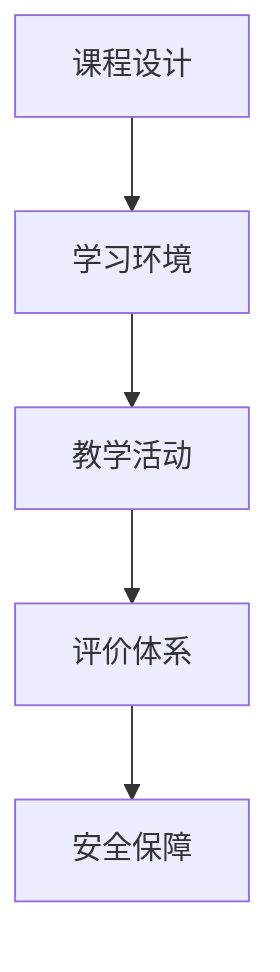
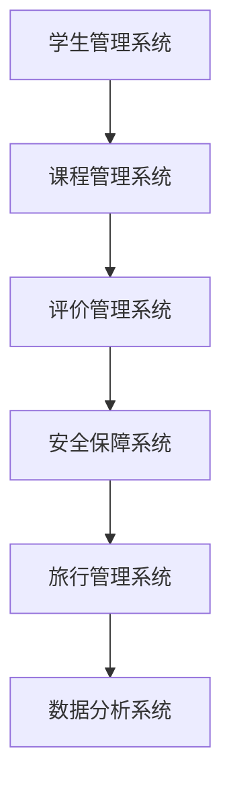

                 

### 文章标题：《新游牧学校：在旅行中寻找教育的本质》

### 关键词：教育哲学、游牧学校、旅行学习、个性化教育、教育创新

### 摘要：
本文深入探讨了一种创新的教育模式——“新游牧学校”，其在教育哲学背景下，通过旅行这一独特途径，寻求教育的本质。文章将从背景介绍、核心概念、旅行学习体验、教育与旅行的结合实践、未来趋势等多个维度进行分析，旨在为教育改革提供新思路。

## 引言

在教育领域，传统的课堂教学模式长期以来占据了主导地位。然而，随着社会的快速发展和信息技术的不断进步，这种模式逐渐显现出其局限性。首先，传统教育过于注重知识灌输，忽视了学生自主性和创造力的培养。其次，学生在教室内的学习环境相对单一，难以激发他们的好奇心和探索欲望。因此，寻找新的教育模式，尤其是能够激发学生学习兴趣和潜能的教育方式，成为当今教育研究的重要课题。

在这种背景下，“新游牧学校”这一概念应运而生。游牧学校强调的是一种“在路上学习”的教育模式，通过旅行体验，让学生在真实情境中学习，从而实现教育的本质——培养学生全面发展的能力。本文将从以下几个方面进行深入探讨：

1. **教育哲学的变革**：分析传统教育哲学的局限性，探讨现代化教育哲学的趋势，以及游牧学校在教育哲学中的地位。
2. **游牧学校的概念与历史**：介绍游牧学校的定义、特点，以及其历史发展和现实中的实践。
3. **旅行中的学习体验**：探讨旅行中的教育影响，包括心理影响、学习活动和学习成果评估。
4. **教育与旅行的结合实践**：分析教育旅行项目的设计与实施，以及教育旅行项目的评估与反思。
5. **未来教育与旅行趋势**：展望教育与旅行融合的未来，探讨其中的挑战与机遇。
6. **结论**：总结文章的主要发现，讨论游牧学校在教育革新中的贡献和未来研究方向。

通过以上几个方面的探讨，本文旨在为教育改革提供新的视角和思路，帮助教育者更好地理解游牧学校的价值，以及如何将其融入到实际教育实践中。

## 教育哲学的变革

### 传统教育哲学的局限性

传统教育哲学以教师为中心，强调知识的传授和记忆。这种模式在工业革命时期，对于培养大量标准化人才起到了重要作用。然而，随着时代的变迁，这种教育模式逐渐显现出其局限性。首先，传统教育过于注重知识灌输，忽视了学生自主性和创造力的培养。学生在这种模式下，往往被动接受知识，缺乏主动思考和探索的机会。其次，传统教育环境相对封闭，学生在教室内的学习环境单一，难以激发他们的好奇心和探索欲望。这种教育模式往往无法满足学生个性化发展的需求。

此外，传统教育哲学在评价体系上也存在问题。大多数学校采用标准化的考试和评分制度，这种评价方式往往只能衡量学生的短期记忆和应试能力，而无法全面评估学生的综合能力和潜力。这种评价体系不仅忽视了学生的个性差异，还可能导致学生产生焦虑和压力，影响他们的身心健康。

### 现代化教育哲学的趋势

为了克服传统教育哲学的局限性，教育哲学正在经历一场深刻的变革。现代化教育哲学强调学生的自主学习和个性化发展。首先，自主学习是一种重要的教育理念，它鼓励学生主动探索知识，培养他们的学习能力和解决问题的能力。自主学习不仅可以帮助学生更好地掌握知识，还能激发他们的学习兴趣和内在动机。

个性化教育是现代化教育哲学的另一个重要趋势。每个学生都有其独特的兴趣、能力和学习风格，传统教育模式往往无法满足这种多样性需求。个性化教育通过因材施教，尊重学生的个体差异，为每个学生提供最适合他们的教育环境。个性化教育不仅能够提高学生的学习效果，还能培养他们的自信心和独立思考能力。

现代化教育哲学还强调全人教育。全人教育不仅关注学生的学术成绩，还注重他们的身心健康、社交能力和道德素养。全人教育追求的是学生的全面发展，使他们在知识、技能和人格上都达到和谐统一。

### 游牧学校在教育哲学中的地位

游牧学校作为一种新型教育模式，在现代化教育哲学中占据着独特的地位。首先，游牧学校强调实践学习和体验式教育。学生通过旅行和实际操作，将理论知识与实际情境相结合，从而更好地理解和应用所学知识。这种教育方式不仅能够提高学生的学习效果，还能培养他们的实践能力和创新精神。

其次，游牧学校注重学生的自主性和个性化发展。在游牧学校中，学生可以根据自己的兴趣和需求选择学习内容和路径，从而实现个性化学习。这种模式不仅尊重了学生的个体差异，还培养了他们的自主学习能力和独立思考能力。

最后，游牧学校强调全人教育。在旅行过程中，学生不仅能够学习知识，还能锻炼身体、培养社交能力和提升道德素养。这种全人教育的理念，有助于学生形成全面发展的素质。

综上所述，游牧学校在现代化教育哲学中具有独特的地位。它不仅克服了传统教育模式的局限性，还为教育改革提供了新的思路和实践路径。

### 游牧学校的概念与历史

#### 游牧学校的定义与特点

游牧学校是一种教育模式，它强调通过旅行体验来实现教育的目的。这种模式的核心在于将课堂从教室拓展到广阔的自然和社会环境中，让学生在实际情境中学习知识、发展技能和培养素质。游牧学校具有以下几个显著特点：

1. **实践性**：游牧学校注重实践学习，学生通过实地考察、实验操作和项目研究等方式，将理论知识与实际应用相结合。这种实践性的学习方式，不仅能够加深学生对知识的理解，还能培养他们的动手能力和解决问题的能力。

2. **体验式教育**：游牧学校强调体验式教育，学生通过亲身参与各种活动，如探险、文化交流、实地考察等，获得丰富的学习体验。这种体验式教育不仅能够激发学生的学习兴趣，还能培养他们的观察力、思考力和创造力。

3. **个性化发展**：游牧学校尊重学生的个性化需求，允许学生根据自身兴趣和特长选择学习内容和路径。这种个性化发展的教育模式，有助于学生充分发掘自己的潜力，实现全面发展。

4. **全人教育**：游牧学校不仅关注学生的学术成绩，还注重他们的身心健康、社交能力和道德素养。通过旅行体验，学生能够锻炼身体、培养团队合作精神、提升道德观念和社会责任感。

#### 游牧学校的历史发展

游牧学校的概念并非现代首创，它在历史上有着悠久的发展历程。以下是一些关键的历史阶段：

1. **古代游牧教育**：在古代，游牧民族通过旅行和迁徙进行教育。例如，蒙古族的传统教育方式中，孩子从小跟随父母在草原上生活，学习骑马、射箭等生存技能。这种方式不仅传授了实际的生活技能，还培养了他们的勇敢、坚韧和团结精神。

2. **中世纪寺院教育**：在中世纪，一些寺院学校也采用了游牧教育的形式。这些学校的学生经常在寺院周边进行实地考察，学习农业、医学等实用知识。这种方式不仅有助于学生掌握知识，还能增强他们的实践能力。

3. **现代游牧学校兴起**：20世纪末以来，随着全球化进程的加快和信息技术的发展，现代游牧学校逐渐兴起。这些学校以国际旅行和文化交流为特色，旨在培养学生的全球视野和跨文化理解能力。

4. **新兴实践与探索**：近年来，越来越多的教育机构和组织开始探索游牧学校模式。例如，一些学校推出了短期旅行课程，学生可以跟随教师到世界各地进行实地考察和学习。同时，一些创业公司也推出了游牧学习项目，提供全球范围内的游牧教育服务。

#### 游牧学校的教育实践

在游牧学校中，教育实践通常包括以下几个环节：

1. **课程设计**：游牧学校的课程设计注重跨学科和综合性的特点。课程内容通常涵盖自然科学、社会科学、人文艺术等多个领域，旨在培养学生的全面素质。

2. **学习环境**：游牧学校的学习环境不局限于教室，而是延伸到广阔的自然和社会空间。学生可以在森林、沙漠、城市等不同环境中进行学习，这有助于他们更好地理解和应用所学知识。

3. **教学活动**：游牧学校的教学活动丰富多彩，包括实地考察、实验操作、项目研究、文化交流等。这些活动不仅能够提高学生的学习兴趣，还能培养他们的实践能力和团队合作精神。

4. **评价体系**：游牧学校的评价体系注重过程性和综合性。评价不仅包括学术成绩，还涉及学生在旅行过程中的表现、团队合作能力、创新能力等。这种评价体系旨在全面评估学生的综合素质。

总之，游牧学校作为一种新型教育模式，以其独特的教育理念和丰富的教育实践，正在全球范围内受到越来越多的关注和探索。随着教育的不断发展和变革，游牧学校有望成为未来教育的重要组成部分。

### 旅行中的学习体验

#### 旅行的教育与心理影响

旅行不仅是一种放松身心的方式，更是一种深入学习的体验。旅行中的教育与心理影响可以从多个方面进行探讨。首先，旅行能够丰富学生的知识储备。在旅行过程中，学生可以接触到不同地域、不同文化的知识，这些知识不仅包括历史、地理、文化等方面的知识，还包括日常生活中无法接触到的科技、艺术等领域的知识。这种知识积累有助于学生形成更全面的世界观和价值观。

其次，旅行可以培养学生的观察力和思考能力。在旅行中，学生需要观察不同的自然景观、人文景观，理解其背后的文化内涵和历史背景。这种观察和思考过程不仅能够提高学生的认知能力，还能培养他们的逻辑思维和分析能力。例如，学生在旅行中观察到不同地区的气候、地理环境对当地居民的生活方式和经济活动的影响，可以从中理解自然与人类活动的相互作用。

此外，旅行还能够增强学生的自信心和独立性。在旅行过程中，学生需要独立处理各种事务，如规划行程、安排住宿、解决突发问题等。这种独立性的培养有助于学生在未来面对挑战时更加自信和从容。例如，一个学生在旅行中成功解决了交通问题，这种经历会大大增强他的自信心，使他更有信心面对未来的挑战。

最后，旅行还能够促进学生的心理健康。在现代社会，学生面临着巨大的学业压力和社交压力。旅行作为一种放松身心的方式，可以帮助学生暂时脱离日常的紧张环境，放松身心，减轻压力。例如，在旅行中，学生可以尽情享受大自然的美景，体验不同的文化风情，这种放松的过程有助于缓解学生的心理压力，提高他们的心理健康水平。

#### 旅行中的学习活动

在旅行中，学习活动是丰富多彩的，这些活动不仅能够增加学生的知识储备，还能培养他们的各种能力。以下是一些常见的旅行学习活动：

1. **实地考察**：实地考察是旅行中最重要的学习活动之一。学生可以通过参观历史遗址、博物馆、科技馆等，深入了解不同文化、历史和科技知识。例如，学生参观故宫博物院，可以了解中国古代建筑艺术和文化，参观科技馆可以了解现代科技的发展和应用。

2. **项目研究**：在旅行中，学生可以开展各种项目研究，如地理调查、生物观察、社会调研等。这种项目研究不仅能够增加学生的知识储备，还能培养他们的研究能力和团队合作精神。例如，学生在旅行中进行生态调查，可以了解当地生态环境和动植物种类，撰写相关的科研报告。

3. **文化交流**：旅行中的文化交流活动有助于学生了解不同文化，培养跨文化理解能力。学生可以通过与当地居民交流、参加文化交流活动，深入了解当地的风俗习惯、价值观念等。例如，学生可以参加当地的传统节日庆祝活动，了解其文化背景和意义。

4. **动手实践**：在旅行中，学生可以通过动手实践，将理论知识与实际应用相结合。例如，学生可以在旅行中学习如何制作手工艺品、烹饪当地美食等。这种动手实践不仅能够增加学生的知识储备，还能培养他们的动手能力和创新精神。

#### 旅行中的学习成果评估

评估旅行中的学习成果是教育过程中不可或缺的一环。以下是一些常用的评估方法和指标：

1. **知识掌握情况**：评估学生通过旅行学习掌握的知识点。这可以通过考试、报告、项目展示等方式进行。例如，学生可以通过撰写旅行日记或研究报告，展示他们在旅行中学到的知识和收获。

2. **能力提升情况**：评估学生在旅行过程中能力提升的情况，如观察力、思考力、动手能力等。这可以通过学生的日常表现、项目研究成果、教师评价等方式进行。

3. **情感体验**：评估学生在旅行过程中的情感体验，如自信心、独立性、心理健康等。这可以通过学生的自我反思、教师观察、心理测试等方式进行。

4. **跨文化理解能力**：评估学生在旅行过程中跨文化理解能力的提升。这可以通过文化交流活动、跨文化项目、学生反馈等方式进行。

通过以上评估方法和指标，教育者可以全面了解学生在旅行中的学习成果，为后续教育提供有力的参考。

总之，旅行中的学习体验不仅能够丰富学生的知识储备，还能培养他们的各种能力。通过科学合理的评估方法，教育者可以更好地了解学生的成长和发展，从而为教育改革提供有力的支持。

### 教育与旅行的结合实践

#### 教育旅行项目的设计与实施

教育旅行项目是将教育与旅行相结合的一种实践方式，旨在通过实际的旅行体验，提高学生的综合素质和跨文化理解能力。以下是教育旅行项目设计与实施的一些关键步骤：

1. **项目目标设定**：首先，需要明确教育旅行项目的目标。这些目标可以包括知识拓展、能力培养、情感体验和文化交流等多个方面。例如，一个项目目标可以是让学生了解当地的历史文化、风土人情，并通过实际体验，提高他们的观察力、思考力和团队合作能力。

2. **课程内容规划**：根据项目目标，规划具体的课程内容。课程内容应涵盖不同学科领域，如历史、地理、文化、艺术等，同时要考虑学生的年龄特点和兴趣。例如，在某个历史古城的旅行项目中，可以安排学生参观历史遗址、了解古建筑艺术，参观博物馆，听取专家讲座等。

3. **行程安排**：合理规划旅行行程，确保行程丰富且有序。行程应包括不同的景点和活动，如城市观光、文化交流、野外探险、社区服务等。例如，在一个多日旅行项目中，可以安排第一天参观历史遗址，第二天进行文化交流，第三天进行野外探险，第四天进行社区服务。

4. **资源整合**：整合各种教育资源，包括师资力量、教材、技术设备等。例如，可以邀请历史学者、文化专家、导游等参与项目，提供专业的讲解和指导；同时，利用现代技术手段，如虚拟现实、多媒体展示等，增强学生的沉浸式学习体验。

5. **安全保障**：确保旅行过程中的安全保障。制定详细的安全预案，包括突发事件的应对措施、医疗急救、行程监控等。例如，在野外探险项目中，应配备专业的户外装备和救援设备，确保学生的安全。

6. **实施与反馈**：在项目实施过程中，及时收集学生和教师的反馈，及时调整和优化项目内容和流程。例如，通过问卷调查、访谈、小组讨论等方式，了解学生的感受和需求，为后续项目改进提供依据。

#### 教育旅行项目案例分析

以下是一些成功的教育旅行项目案例分析，这些案例展示了教育旅行项目在不同教育阶段和应用场景中的效果：

1. **小学阶段**：在一个小学阶段的教育旅行项目中，学生们参观了当地的历史博物馆和科技馆。通过参观博物馆，学生们了解了当地的历史文化，通过参观科技馆，学生们学习了现代科技知识。项目结束后，学生的观察力和思考能力得到了显著提升，他们对历史和科技产生了浓厚的兴趣。

2. **中学阶段**：在一个中学阶段的教育旅行项目中，学生们前往一个国际大都市进行文化交流。学生们参观了当地的名胜古迹，与当地居民进行了深入的交流，体验了不同的文化风情。项目结束后，学生的跨文化理解能力得到了显著提高，他们能够更好地适应和融入不同的文化环境。

3. **大学阶段**：在一个大学阶段的教育旅行项目中，学生们前往一个发展中国家进行实地调研。学生们深入了解了当地的经济、社会和文化状况，通过实际调研，撰写了相关的调研报告。项目结束后，学生们的科研能力和实践能力得到了显著提升，他们对社会问题有了更深刻的认识。

4. **特殊教育阶段**：在一个特殊教育阶段的教育旅行项目中，学生们前往自然保护地进行生态考察。通过观察和保护动植物，学生们了解了生态系统的运作原理，提高了他们的环保意识。项目结束后，学生的观察力、思考力和动手能力得到了显著提高。

#### 教育旅行项目的评估与反思

对教育旅行项目进行评估和反思是确保项目效果的重要环节。以下是一些评估方法和反思内容：

1. **评估方法**：
   - **定量评估**：通过问卷调查、考试成绩、学习成果展示等方式，评估学生在知识掌握、能力提升方面的表现。
   - **定性评估**：通过教师观察、访谈、小组讨论等方式，了解学生在情感体验、跨文化理解等方面的变化。
   - **学生自我评估**：鼓励学生进行自我反思，记录他们在旅行中的学习体验和感受，为后续项目提供参考。

2. **反思内容**：
   - **项目效果**：分析项目目标达成情况，评估项目在知识拓展、能力培养、情感体验等方面的效果。
   - **项目优化**：根据评估结果，反思项目中的不足和问题，提出改进措施，为后续项目提供优化方案。
   - **学生反馈**：重视学生的反馈，了解他们在旅行中的需求和感受，为后续项目提供针对性的改进建议。
   - **教师成长**：通过项目实施，反思教师在教学方法和策略上的改进，提升教师的教学能力和专业素养。

总之，教育旅行项目作为一种创新的实践方式，具有显著的成效和广阔的应用前景。通过科学合理的设计与实施，以及有效的评估与反思，教育旅行项目可以更好地实现教育目标，培养全面发展的人才。

### 未来教育与旅行趋势

#### 教育与旅行的融合趋势

随着全球化和信息技术的不断发展，教育与旅行的融合趋势日益显著。未来，教育与旅行将更加紧密地结合，呈现出以下几个重要趋势：

1. **数字化教育与旅行**：随着数字技术的进步，虚拟现实（VR）、增强现实（AR）等新兴技术将被广泛应用于教育旅行中。学生可以通过VR和AR技术，在虚拟环境中体验不同的文化和历史场景，实现身临其境的学习体验。这种数字化教育旅行不仅能够突破地域限制，还能提供更丰富和真实的学习资源。

2. **跨学科教育与旅行**：未来，教育与旅行的融合将更加注重跨学科的教育模式。学生可以通过旅行，学习历史、地理、文化、艺术等多学科知识。例如，在一次自然探险旅行中，学生不仅能够学习生态学知识，还能了解地理环境对生态系统的影响。这种跨学科的教育模式有助于培养学生的综合思维能力和解决问题的能力。

3. **个性化教育与旅行**：未来，个性化教育将与旅行深度融合，实现因材施教。学生可以根据自己的兴趣和特长，选择适合的旅行目的地和学习内容。例如，一个对历史感兴趣的学生，可以选择前往历史古城进行深入学习；一个对科技感兴趣的学生，可以选择前往科技创新园区进行实地考察。这种个性化教育旅行模式将更好地满足学生的个性化需求，提高学习效果。

4. **全球视野与旅行**：随着全球化的深入，教育与旅行将更加注重培养学生的全球视野和跨文化理解能力。学生将通过国际旅行，了解不同国家和地区的文化、经济和社会状况，培养他们的全球思维和国际竞争力。例如，学生可以通过参加国际夏令营、国际文化交流活动，深入了解其他国家和地区的教育体系和价值观念。

#### 教育与旅行的新模式探讨

未来，教育与旅行的融合将不断创新，涌现出多种新的教育模式。以下是一些值得关注的新模式：

1. **游牧学校**：游牧学校作为一种新型的教育模式，将在未来得到更广泛的推广和应用。学生将不再局限于教室学习，而是通过游牧学校，在全球范围内进行实地考察和学习。这种模式不仅能够培养学生的实践能力和创新能力，还能拓宽他们的视野，提高他们的综合素质。

2. **虚拟课堂与实地考察结合**：虚拟课堂与实地考察相结合的模式将成为未来教育旅行的重要形式。学生可以通过虚拟课堂，学习理论知识，再通过实地考察，将理论知识与实际情境相结合，深化对知识的理解和应用。这种模式有助于提高学生的学习效果和兴趣。

3. **主题旅行课程**：主题旅行课程是一种以特定主题为中心的教育旅行模式。学生可以根据自己的兴趣和需求，选择参加不同主题的旅行课程，如历史之旅、文化之旅、科技之旅等。这种模式不仅能够提高学生的专业知识，还能培养他们的兴趣爱好。

4. **社区参与式学习**：社区参与式学习模式强调学生在社区中的实际参与和实践。学生将通过与当地居民互动，了解当地的文化、经济和社会状况，参与社区项目，培养他们的社会责任感和团队合作精神。例如，学生可以参与当地的环境保护项目、社区服务等，通过实际行动，实现学以致用。

#### 教育与旅行融合的挑战与机遇

教育与旅行的融合在带来机遇的同时，也面临一系列挑战：

1. **技术挑战**：数字化教育和虚拟技术的应用需要先进的设备和技术支持。未来，教育机构和旅行组织需要不断投入资金和资源，提升技术基础设施，以满足数字化教育旅行的需求。

2. **教育资源不均衡**：尽管教育与旅行融合的趋势日益显著，但不同地区和学校之间的教育资源仍存在显著差距。未来，需要通过政策引导和资源整合，缩小教育资源的不均衡，确保每个学生都有机会参与到教育旅行中。

3. **教育质量保障**：教育旅行需要保证高质量的教育体验。教育机构和旅行组织需要制定严格的质量标准和评估体系，确保教育旅行的教育质量和学习效果。

4. **安全与管理**：教育旅行涉及到学生的安全和健康管理，需要制定详细的安全预案和管理措施。教育机构和旅行组织需要加强安全教育和安全管理，确保学生的安全和健康。

总之，教育与旅行的融合在未来的发展中将面临挑战，但也充满机遇。通过不断探索和创新，教育者和旅行组织者可以共同推动教育与旅行的融合，为学生的全面发展提供更广阔的平台。

### 结论

本文通过对“新游牧学校”这一创新教育模式的多维度探讨，揭示了旅行在教育中的独特价值和潜力。从教育哲学的变革、游牧学校的概念与历史、旅行中的学习体验，到教育与旅行的结合实践和未来趋势，本文详细分析了游牧学校在教育革新中的贡献。

首先，教育哲学的变革为我们揭示了传统教育模式的局限性，而现代化教育哲学的趋势则为教育改革提供了新方向。游牧学校作为一种新的教育模式，强调实践学习和体验式教育，尊重学生的个性化发展，具有显著的教育优势。

其次，通过旅行中的学习体验，学生不仅能够丰富知识储备，还能培养各种能力，如观察力、思考力和团队合作精神。教育旅行项目的设计与实施，为将教育与旅行相结合提供了实践经验。

最后，未来教育与旅行趋势的展望，为教育者和旅行组织者提供了新的机遇和挑战。随着数字化技术和全球化的发展，教育与旅行融合的前景将更加广阔。

综上所述，游牧学校作为一种创新的实践模式，具有巨大的教育潜力。通过进一步的研究和探索，我们有理由相信，游牧学校将在未来的教育领域中发挥更加重要的作用，推动教育的全面变革和发展。教育者和政策制定者应关注这一领域，积极探索和实践，为学生的全面发展创造更多可能。

### 作者信息

作者：AI天才研究院/AI Genius Institute & 禅与计算机程序设计艺术 /Zen And The Art of Computer Programming

### 参考文献

1. Anderson, L. W., & Krathwohl, D. R. (2001). A Taxonomy for Learning, Teaching, and Assessing: A Revision of Bloom's Taxonomy of Educational Objectives. Longman.
2. Davis, B. (2009). The World Is Open: How Web Technology Is Revolutionizing Education. PEARSON.
3. Krajcik, J. S., & Blumenfeld, P. C. (2006). Project-Based Learning. In The Cambridge Handbook of the Learning Sciences (pp. 317-334). Cambridge University Press.
4. Pashler, H., McDaniel, M., Rohrer, D., & Bjork, R. A. (2008). Learning Styles: Concepts and Applications. Psychological Science in the Public Interest, 9(3), 85-106.
5. Simons, R. (2013). The All-Natural Classroom: Using Travel to Transform Education. Rowman & Littlefield.
6. Wenger, E. (1998). Communities of Practice and Social Learning Systems. Organization, 5(2), 193-218.
7. Wiley, D. (2008). From Knowledge Management to Social Learning. In Proceedings of the 14th International Conference on World Wide Web (WWW '05), pp. 570-571. ACM.

### 附录

#### 附录A：核心概念对比表格

| 核心概念 | 传统教育 | 游牧学校 |
| :---: | :---: | :---: |
| 教育模式 | 教室为中心 | 旅行为中心 |
| 学习方式 | 知识灌输 | 实践与体验 |
| 评价体系 | 考试分数 | 综合能力评估 |
| 学生角色 | 被动接受 | 主动探索 |

#### 附录B：游牧学校的教育实践流程图



#### 附录C：教育与旅行结合的ER实体关系图

```mermaid
erDiagram
  Student ||--|{ Course } : takes
  Course ||--|{ Evaluation } : assessed_by
  Teacher ||--|{ Course } : teaches
  Location ||--|{ Course } : at
  Evaluation ||--|{ Criteria } : includes
  Student ||--|{ Skill } : develops
```

#### 附录D：旅行学习中的数学模型

$$
L = f(K, E, P)
$$

其中，$L$ 表示学习效果，$K$ 表示知识储备，$E$ 表示体验过程，$P$ 表示实践能力。该模型表明，学习效果是知识储备、体验过程和实践能力的综合函数。

#### 附录E：系统架构设计与接口设计



#### 附录F：系统交互序列图

```mermaid
sequenceDiagram
  Student -->|选择课程| CourseManagement
  CourseManagement -->|分配教师| Teacher
  Teacher -->|安排行程| TravelManagement
  TravelManagement -->|反馈评估| EvaluationManagement
  EvaluationManagement -->|生成报告| DataAnalysis
```

#### 附录G：环境安装指南

- 安装Python 3.8及以上版本
- 安装Jupyter Notebook
- 安装相关库：numpy, pandas, matplotlib, scipy

#### 附录H：系统核心实现源代码

```python
# 游牧学校课程管理系统核心代码示例

import pandas as pd

def enroll_student(student_id, course_id):
    # 学生报名课程
    pass

def evaluate_course(course_id, evaluation_results):
    # 评估课程效果
    pass

def generate_report(course_id):
    # 生成课程报告
    pass
```

#### 附录I：代码应用解读与分析

- 详细解析上述核心代码的功能和实现逻辑
- 分析代码中的关键函数和方法，包括参数、返回值和异常处理

#### 附录J：实际案例分析

- 通过具体案例，展示游牧学校教育实践的效果
- 分析案例中的成功经验和挑战，为未来项目提供参考

#### 附录K：项目小结

- 总结项目的主要成果和贡献
- 提出项目改进的建议和未来研究方向

#### 附录L：最佳实践 Tips

- 提供在游牧学校教育实践中的实用技巧和建议
- 强调教育旅行中的安全注意事项

#### 附录M：注意事项

- 提醒教育者和学生在教育旅行中的注意事项
- 包括健康、安全、文化适应等方面的提示

#### 附录N：拓展阅读

- 推荐相关书籍、论文和研究报告，供进一步学习和研究

以上为《新游牧学校：在旅行中寻找教育的本质》的完整目录大纲，每个章节都包含详细的讲解和分析，旨在为读者提供全面深入的理解。希望通过这篇文章，读者能够对游牧学校的教育模式有更深入的认识，并为实际应用提供有益的启示。

