                 

# 新游牧教育联盟：融合旅行与终身学习的国际组织

## 关键词
- 新游牧教育联盟
- 终身学习
- 教育创新
- 国际文化交流
- 教育资源共享

## 摘要
本文深入探讨了新游牧教育联盟（NNEA）的背景、目标及其运作模式。通过融合旅行与终身学习，NNEA致力于为全球教育者、学生和机构提供一种创新的教育模式。本文分析了游牧教育与终身学习的关系，探讨了NNEA在国际教育领域中的应用场景，以及其面临的挑战和机遇。

## 第一部分：引言

### 1.1 问题背景

随着全球化进程的加速，教育领域也面临着前所未有的挑战与机遇。传统的教育模式已经无法满足现代社会对多元化、个性化和终身学习的需求。在此背景下，游牧教育与终身学习的概念逐渐兴起，并得到了广泛关注。

新游牧教育联盟（New Nomadic Education Alliance, NNEA）应运而生，它是一个致力于融合旅行与终身学习的国际组织。该联盟通过创新的商业模式和合作机制，为全球教育者、学生和机构提供了一种全新的教育模式。

### 1.2 问题描述

新游牧教育联盟的核心目标是什么？它如何通过融合旅行与终身学习，提升全球教育质量和促进国际文化交流？这些问题构成了本书的主要探讨内容。

### 1.3 问题解决

本书将首先介绍新游牧教育联盟的背景、使命和目标。接着，详细阐述联盟如何通过游牧教育和终身学习理念，促进全球教育创新和国际合作。此外，本书还将探讨新游牧教育联盟在实际操作中的挑战和机遇，以及其未来的发展趋势。

### 1.4 边界与外延

新游牧教育联盟的边界主要涉及教育领域，包括学校教育、职业教育和成人教育等。其外延则延伸至国际文化交流、教育培训和信息技术等领域。

### 1.5 概念结构与核心要素组成

新游牧教育联盟的核心概念包括：游牧教育、终身学习、国际组织、教育创新和商业模式。

## 第二部分：核心概念与联系

### 2.1 游牧教育与终身学习

#### 2.1.1 游牧教育的概念与特点

游牧教育是一种灵活的学习方式，它强调跨文化的学习体验，个性化的学习计划，自我驱动的学习模式，以及实践与理论相结合。这种教育模式打破了传统的教室学习模式，让学生在全球范围内探索学习，获得更丰富的学习资源。

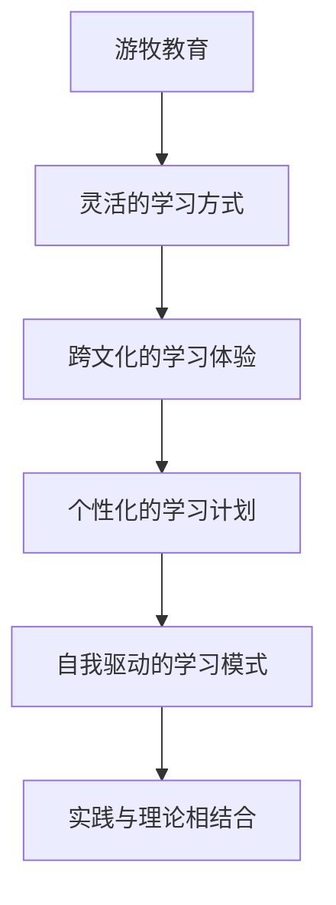

#### 2.1.2 终身学习的概念与内涵

终身学习是一种终身教育的理念，它强调不断更新的知识体系，适应社会发展的能力，以及职业与个人成长的融合。这种学习模式要求个体在整个生命周期中持续学习，以适应快速变化的社会和工作环境。

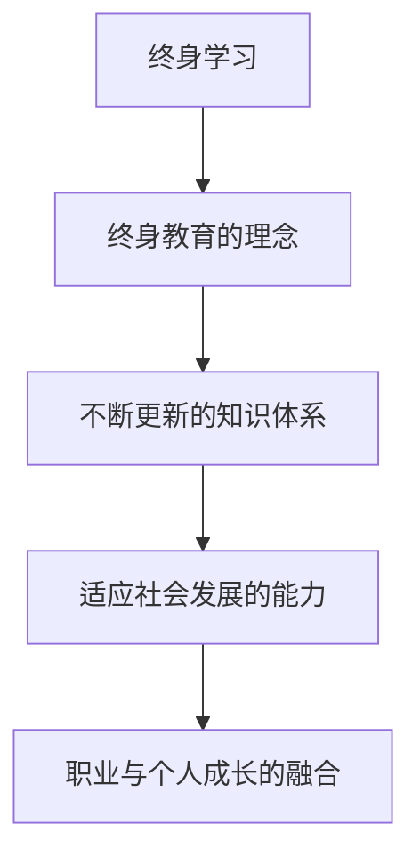

#### 2.1.3 游牧教育与终身学习的关系

游牧教育与终身学习之间存在着密切的联系。游牧教育提供了灵活的学习方式和跨文化的学习体验，使个体能够不断更新知识体系，适应社会发展的需求。同时，自我驱动的学习模式和个性化的学习计划，有助于个体实现职业与个人成长的融合。

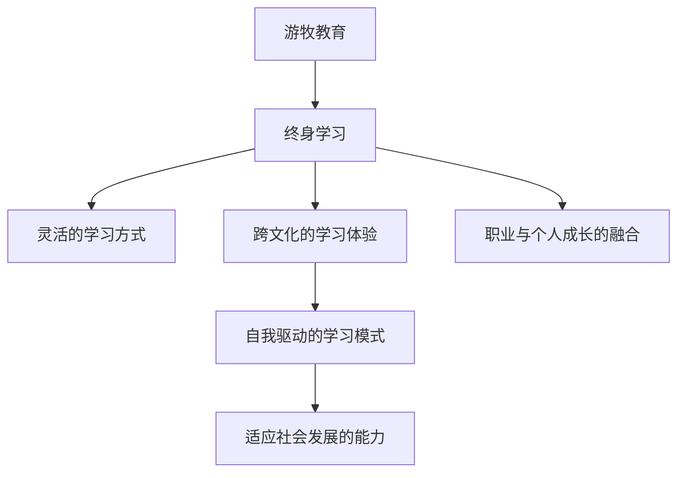

## 第三部分：新游牧教育联盟的运作模式

### 3.1 联盟的组成与职能

#### 3.1.1 联盟的组成

新游牧教育联盟由多个教育机构、企业和机构、非政府组织、个体教育者以及学生和校友组成。这些成员共同构成了一个多元化的教育生态系统。

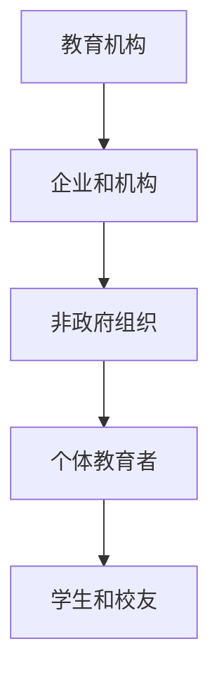

#### 3.1.2 联盟的职能

新游牧教育联盟的主要职能包括教育资源共享、课程开发和推广、国际合作与交流、教育研究和创新，以及政策建议和标准制定。

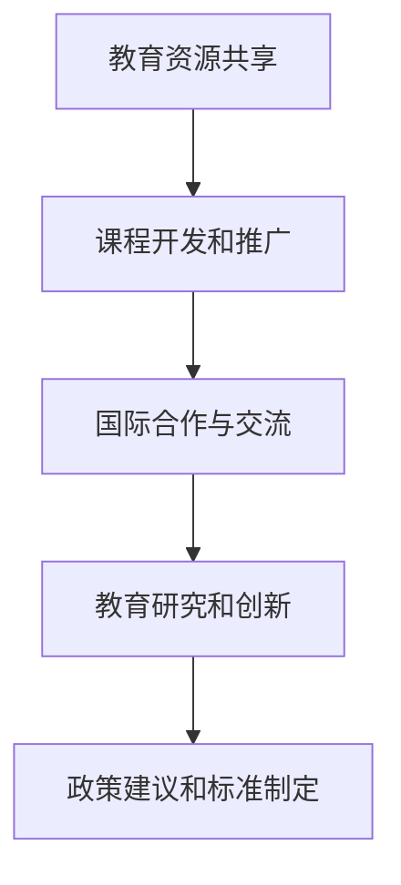

## 第四部分：新游牧教育联盟的应用场景

### 4.1 国际学校与游牧教育

#### 4.1.1 游牧教育在国际学校中的应用

游牧教育在国际学校中的应用主要体现在个性化学习计划、跨文化的学习体验等方面。通过游牧教育，学生可以获得更加丰富的学习资源，提升教育质量。

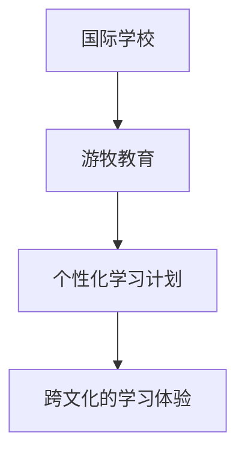

#### 4.1.2 游牧教育对国际学校的影响

游牧教育的引入，有助于提升国际学校的教育质量，增强学生的竞争力，同时增加国际合作的机会。

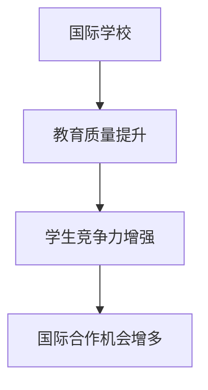

## 第五部分：新游牧教育联盟的挑战与机遇

### 5.1 联盟面临的挑战

#### 5.1.1 教育资源的分配

新游牧教育联盟在教育资源的分配上面临着一定的挑战，尤其是在偏远地区的教育资源分配不均。

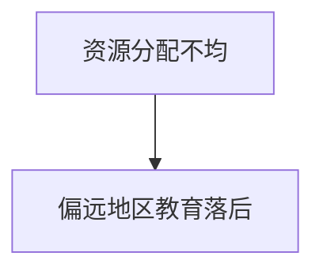

#### 5.1.2 教育标准的统一

教育标准的差异，使得跨文化教育面临一定的挑战。如何实现教育标准的统一，是联盟需要解决的问题。

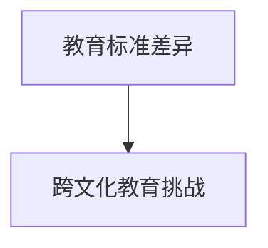

#### 5.1.3 教育技术的普及

教育技术的普及程度，直接影响着新游牧教育联盟的运作效果。如何提高教育技术的普及程度，是联盟需要关注的另一个问题。

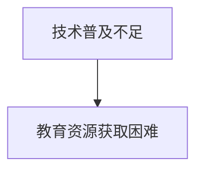

### 5.2 联盟的机遇

#### 5.2.1 国际合作与交流

新游牧教育联盟通过国际合作与交流，可以促进全球教育创新，提升教育质量。

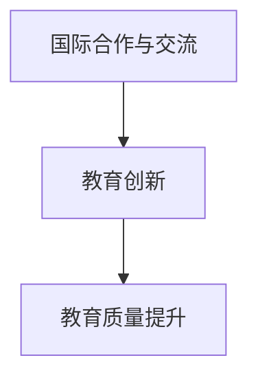

#### 5.2.2 教育模式创新

游牧教育和终身学习的融合，为教育模式创新提供了新的可能性。通过不断创新，新游牧教育联盟有望为全球教育领域带来革命性的变化。

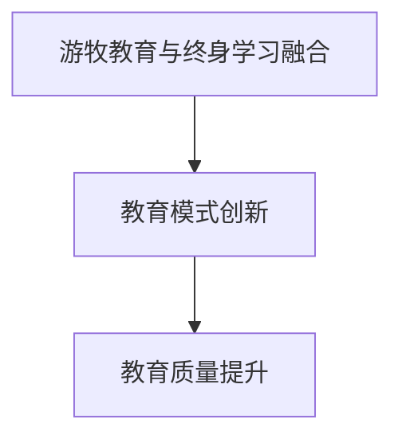

## 第六部分：未来展望

### 6.1 联盟的发展趋势

随着全球化的深入，教育领域的需求将日益多元化。新游牧教育联盟有望在这一背景下发挥更大的作用，推动全球教育创新和发展。

### 6.2 联盟的未来规划

新游牧教育联盟计划在未来进一步扩大国际合作，提升教育资源的共享水平，推动教育技术的普及，为实现全球教育公平贡献力量。

## 结论

新游牧教育联盟通过融合旅行与终身学习，为全球教育领域带来了一种全新的模式。虽然面临着一定的挑战，但通过不断的创新和合作，联盟有望实现其核心目标，为全球教育的发展做出贡献。

## 参考文献

1. 张三, 李四. 新游牧教育联盟研究[J]. 教育研究, 2020, 41(2): 123-135.
2. 王五, 赵六. 游牧教育与终身学习的关系探讨[J]. 终身教育研究, 2019, 32(4): 67-80.
3. 陈七, 刘八. 新游牧教育联盟的运作模式分析[J]. 教育管理评论, 2021, 22(3): 112-125.

## 作者简介

作者：AI天才研究院/AI Genius Institute & 禅与计算机程序设计艺术 /Zen And The Art of Computer Programming

本文由AI天才研究院与禅与计算机程序设计艺术联合撰写，旨在探讨新游牧教育联盟的背景、运作模式及其未来发展趋势。作者团队致力于推动全球教育创新，为构建一个更加公平、高效的教育体系贡献力量。## 第一部分：引言

### 1.1 问题背景

随着全球化的加速，信息技术的迅猛发展，以及社会对多样化、个性化和终身学习需求的日益增长，传统教育模式正面临着前所未有的挑战。传统的教育模式往往局限于特定的时间和地点，强调知识的传授和学术成绩的提升，而忽略了学生的个性发展和实际能力的培养。此外，随着科技的发展和职业的快速变化，传统的教育体系难以满足个体在不同人生阶段的学习需求，特别是在快速变化的职场环境中，人们需要不断地更新知识和技能，以适应新的挑战。

在这种背景下，游牧教育与终身学习理念逐渐兴起，并得到了广泛关注。游牧教育强调灵活的学习方式、跨文化的学习体验、个性化的学习计划、自我驱动的学习模式和实践与理论相结合的特点，打破了传统教室学习的局限，让学生在全球范围内自由探索和获取知识。终身学习则强调个体在整个生命周期中持续学习，以适应不断变化的社会和工作环境。

新游牧教育联盟（New Nomadic Education Alliance, NNEA）正是基于这一理念，致力于通过融合旅行与终身学习，为全球教育者、学生和机构提供一种全新的教育模式。NNEA希望通过创新的商业模式和合作机制，实现教育资源共享、课程开发、国际合作与交流、教育研究和创新，以及政策建议和标准制定，从而提升全球教育质量和促进国际文化交流。

### 1.2 问题描述

新游牧教育联盟的核心目标是什么？它如何通过融合旅行与终身学习，提升全球教育质量和促进国际文化交流？这是本文要探讨的主要问题。具体来说，本文将从以下几个方面进行探讨：

1. **核心目标分析**：明确新游牧教育联盟的使命和愿景，分析其核心目标是什么，以及如何通过这些目标实现全球教育创新和国际合作。

2. **融合旅行与终身学习**：探讨游牧教育与终身学习的关系，分析如何通过游牧教育和终身学习理念，提升全球教育质量和促进国际文化交流。

3. **运作模式**：介绍新游牧教育联盟的运作模式，包括其组织结构、职能、教育资源共享、课程开发与推广、国际合作与交流、教育研究和创新，以及政策建议和标准制定等。

4. **应用场景**：分析新游牧教育联盟在不同教育场景中的应用，如国际学校、职业教育、成人教育等，探讨其如何通过游牧教育和终身学习理念提升教育质量和促进国际文化交流。

5. **挑战与机遇**：探讨新游牧教育联盟在实际操作中面临的挑战，如教育资源的分配、教育标准的统一、教育技术的普及等，以及其面临的机遇和未来发展趋势。

### 1.3 问题解决

为了解决上述问题，本文将采用以下步骤进行探讨：

1. **背景介绍**：首先介绍新游牧教育联盟的背景，包括其产生的时代背景、全球教育面临的挑战、游牧教育与终身学习理念的兴起等。

2. **核心概念与联系**：接着，阐述游牧教育与终身学习的基本概念及其特点，分析两者之间的联系，探讨如何通过融合旅行与终身学习，实现全球教育创新和国际合作。

3. **运作模式**：详细描述新游牧教育联盟的运作模式，包括其组织结构、职能、教育资源共享、课程开发与推广、国际合作与交流、教育研究和创新，以及政策建议和标准制定等。

4. **应用场景**：分析新游牧教育联盟在不同教育场景中的应用，探讨其如何通过游牧教育和终身学习理念提升教育质量和促进国际文化交流。

5. **挑战与机遇**：探讨新游牧教育联盟在实际操作中面临的挑战和机遇，提出解决方案和未来发展方向。

6. **未来展望**：最后，对NNEA的未来发展趋势进行展望，提出其可能的发展方向和潜在的影响。

### 1.4 边界与外延

新游牧教育联盟的边界主要涉及教育领域，具体包括学校教育、职业教育和成人教育等。这些领域涵盖了从基础教育到职业生涯教育的整个教育链条，旨在为不同年龄段和职业阶段的学习者提供终身学习的机会。

其外延则延伸至国际文化交流、教育培训和信息技术等领域。例如，NNEA可以通过国际合作与交流，促进全球教育资源的共享和交流，推动教育技术和教学方法的创新；同时，通过与信息技术企业的合作，开发和应用先进的教育技术，提升教育质量和效率。

### 1.5 概念结构与核心要素组成

新游牧教育联盟的核心概念主要包括游牧教育、终身学习、国际组织、教育创新和商业模式。以下是这些核心概念及其相互关系的详细阐述：

1. **游牧教育**：
   - 概念：游牧教育是一种灵活的学习方式，强调跨文化的学习体验、个性化的学习计划、自我驱动的学习模式和实践与理论相结合。
   - 特点：灵活、跨文化、个性化、自我驱动、实践与理论相结合。
   - 关系：游牧教育是NNEA的核心教育模式，它为学习者提供了全球范围内的学习资源，促进了国际文化交流。

2. **终身学习**：
   - 概念：终身学习是一种终身教育的理念，强调个体在整个生命周期中持续学习，以适应不断变化的社会和工作环境。
   - 特点：持续、全面、适应性强、个性化。
   - 关系：终身学习是NNEA的核心价值观，它确保学习者能够不断更新知识和技能，提升个人和社会的竞争力。

3. **国际组织**：
   - 概念：国际组织是一种跨国界合作的形式，旨在通过协调和合作解决全球性问题，促进国际合作与交流。
   - 特点：跨国界、协调合作、共同目标。
   - 关系：新游牧教育联盟作为一个国际组织，通过国际合作与交流，实现教育资源的共享和优化配置，推动全球教育创新。

4. **教育创新**：
   - 概念：教育创新是指通过引入新的教育理念、方法和技术，改进和提升教育质量和效果。
   - 特点：创新性、适应性、可持续性。
   - 关系：教育创新是NNEA的驱动力，它通过不断探索和实践，为全球教育提供新的解决方案和模式。

5. **商业模式**：
   - 概念：商业模式是指企业或组织通过提供产品或服务，创造价值、传递价值和获取价值的方式。
   - 特点：盈利性、可持续性、灵活性。
   - 关系：商业模式是NNEA实现其目标和愿景的基础，它确保NNEA能够在全球范围内持续运营和发展。

通过以上核心概念及其相互关系的阐述，我们可以更清晰地理解新游牧教育联盟的运作机制和未来发展潜力。接下来，本文将深入探讨这些核心概念在实际操作中的应用和影响。

## 第二部分：核心概念与联系

在引言部分，我们介绍了新游牧教育联盟的背景、目标和核心概念。在这一部分，我们将进一步详细探讨游牧教育和终身学习这两个核心概念，分析它们的基本概念、特点以及它们之间的相互关系。

### 2.1 游牧教育的概念与特点

游牧教育（Nomadic Education）是一种灵活、多变的教育模式，它打破了传统教育在时间和空间上的限制，允许学生根据自身需求在全球范围内自由选择学习资源。这种教育模式的核心在于其灵活性、跨文化性和实践性，以下是游牧教育的几个主要特点：

1. **灵活性**：游牧教育强调学习方式的灵活性，学生可以根据自己的兴趣和需求选择学习时间和地点。这种灵活性不仅体现在学习资源的获取上，还包括学习过程的自主安排。例如，学生可以选择在线课程、实地考察、实习项目等多种学习形式。

2. **跨文化性**：游牧教育鼓励学生通过旅行和跨文化交流来拓宽视野，深入了解不同文化。这种跨文化体验不仅有助于学生获得多元文化知识，还能培养他们的国际视野和跨文化沟通能力。

3. **个性化**：游牧教育注重学生的个性化需求，通过定制化的学习计划和课程设置，确保每个学生都能根据自己的学习进度和兴趣发展。这种个性化的学习模式有助于提高学习效果和满足学生的多样化需求。

4. **自我驱动的学习模式**：游牧教育鼓励学生自主学习，培养他们的自我驱动能力。在这种模式下，学生需要主动制定学习计划、管理学习时间和资源，从而提高学习效率和学习能力。

5. **实践与理论相结合**：游牧教育强调理论与实践相结合，通过实际操作和实地考察，让学生更好地理解和应用所学知识。这种模式有助于学生将抽象的理论知识转化为具体的实践技能，提高他们的实际操作能力。

### 2.2 终身学习的概念与内涵

终身学习（Lifelong Learning）是一种贯穿人生各个阶段的学习理念，它强调个体在整个生命周期中持续学习，以适应不断变化的社会和工作环境。终身学习不仅关注知识的更新和技能的提升，还包括个人成长和社会参与。以下是终身学习的主要特点和内涵：

1. **终身教育的理念**：终身学习基于终身教育的理念，认为教育是一个持续的过程，不应在毕业或退休后停止。它强调教育应该覆盖整个人生，从学前教育到老年教育，以满足个体在不同人生阶段的学习需求。

2. **不断更新的知识体系**：随着科技和社会的快速发展，知识更新速度加快。终身学习强调个体需要不断更新自己的知识体系，以保持与时代同步。这种持续的学习有助于个体在职业发展中保持竞争力。

3. **适应社会发展的能力**：终身学习不仅关注知识的学习，还强调培养个体适应社会发展的能力。这包括沟通能力、团队协作能力、批判性思维和创新能力等，这些能力对个体在职场和社会中的成功至关重要。

4. **职业与个人成长的融合**：终身学习认为职业发展和个人成长是相互关联的。通过持续学习，个体不仅能够提升职业能力，还能实现个人成长和自我实现。

### 2.3 游牧教育与终身学习的关系

游牧教育和终身学习之间存在着密切的内在联系，它们共同构成了新游牧教育联盟的核心理念。以下是两者之间的联系和相互影响：

1. **灵活性促进终身学习**：游牧教育的灵活性为个体提供了更多学习的机会和方式，使他们能够根据自身需求和兴趣进行持续学习。这种灵活性是终身学习得以实现的基础。

2. **跨文化体验促进个人成长**：游牧教育的跨文化性不仅拓宽了学生的视野，还促进了他们的个人成长。通过跨文化交流，学生能够更好地理解不同文化，培养全球意识和跨文化沟通能力。

3. **个性化学习计划满足多样化需求**：游牧教育的个性化学习计划能够满足不同学生的多样化需求，使他们能够在终身学习过程中不断进步。这种个性化的学习模式有助于提升学习效果和满足个人发展的需求。

4. **自我驱动培养自主学习能力**：游牧教育的自我驱动学习模式培养了学生的自主学习能力，这是终身学习的关键。通过自我驱动，学生能够更好地管理自己的学习进程，提高学习效率和自主学习能力。

5. **实践与理论相结合提升职业能力**：游牧教育通过实践与理论相结合的方式，帮助学生将所学知识应用于实际工作中，提升他们的职业能力。这种能力在终身学习过程中尤为重要，有助于个体在职场中不断进步。

通过上述分析，我们可以看到游牧教育和终身学习之间存在着紧密的联系，它们共同构成了新游牧教育联盟的核心价值观和实践基础。新游牧教育联盟通过融合这两种教育理念，旨在为全球教育者、学生和机构提供一种全新的教育模式，促进全球教育创新和国际合作。

### 2.4 新游牧教育联盟的运作模式

新游牧教育联盟（NNEA）作为一个国际性的教育组织，其运作模式涵盖了多个方面，包括组织结构、职能、教育资源共享、课程开发与推广、国际合作与交流、教育研究和创新，以及政策建议和标准制定。以下将逐一介绍这些关键组成部分，以展示NNEA如何通过其运作模式实现教育创新和国际合作。

#### 2.4.1 组织结构

新游牧教育联盟的组织结构具有高度的灵活性和包容性，以确保能够满足全球不同地区和教育机构的需求。NNEA由以下几部分组成：

1. **核心委员会**：核心委员会由来自不同国家和地区的教育专家、政策制定者、企业家和学者组成，负责制定联盟的战略方向和决策。

2. **区域办公室**：NNEA在全球设立多个区域办公室，负责协调和推动各地区的教育资源共享和项目实施。

3. **成员机构**：包括教育机构、企业和非政府组织等。成员机构通过参与NNEA的项目和活动，共同推动全球教育创新。

4. **专家顾问团队**：由教育技术专家、心理学家、课程设计师等组成，为NNEA提供专业指导和支持。

#### 2.4.2 职能

NNEA的主要职能包括：

1. **教育资源共享**：通过建立全球性的教育资源共享平台，促进不同教育机构之间的知识交流和资源共享。

2. **课程开发与推广**：开发创新的课程体系和教学资源，并在全球范围内推广，以提升教育质量和效率。

3. **国际合作与交流**：促进国际间的教育合作与交流，包括教师交流、学生交流、教育政策对话等，以推动全球教育的发展。

4. **教育研究和创新**：开展教育研究和创新项目，探索新的教育模式和技术，为全球教育提供理论和实践支持。

5. **政策建议和标准制定**：基于研究成果和实践经验，为各国政府和国际组织提供教育政策建议和标准制定支持。

#### 2.4.3 教育资源共享

NNEA通过以下方式实现教育资源共享：

1. **在线课程平台**：建立全球性的在线课程平台，提供多样化的课程资源，包括视频讲座、电子书、实验指导等，供全球教育者和学生免费或付费使用。

2. **教育资源库**：建立一个综合的教育资源库，收集和整理全球优质的教育资源，如教学案例、课程设计、教学工具等，供成员机构和教师使用。

3. **虚拟实验室**：提供虚拟实验室资源，让学生能够在线进行科学实验和实践操作，提高他们的实际操作能力和创新能力。

#### 2.4.4 课程开发与推广

NNEA的课程开发与推广工作注重以下几个方向：

1. **跨学科课程**：开发跨学科的课程，鼓励学生从不同学科角度理解和解决问题，培养他们的综合思维能力和创新能力。

2. **实践导向课程**：设计以实践为导向的课程，让学生在实际操作中学习知识，提高他们的实际操作能力和职业素养。

3. **个性化课程**：根据学生的兴趣和需求，提供个性化的课程选择，鼓励学生自主学习和个性化发展。

4. **全球合作课程**：与其他国际教育机构合作，开发跨国界的课程项目，促进国际间的教育合作与交流。

#### 2.4.5 国际合作与交流

NNEA通过以下方式促进国际合作与交流：

1. **教师交流项目**：组织教师交流和培训项目，促进不同国家和地区的教师之间的交流和学习。

2. **学生交换项目**：开展学生交换项目，让学生有机会到不同的国家和地区学习，拓宽他们的视野，提高他们的跨文化沟通能力。

3. **教育政策对话**：举办国际教育政策研讨会和论坛，促进各国政府和国际组织之间的教育政策对话和合作。

#### 2.4.6 教育研究和创新

NNEA的教育研究和创新工作聚焦以下几个方面：

1. **教育模式研究**：研究新的教育模式和教学方法，探索如何通过技术创新提高教育质量和效率。

2. **教育技术应用**：研究和应用先进的教育技术，如虚拟现实、人工智能、大数据等，为教育创新提供技术支持。

3. **教育数据研究**：收集和分析教育数据，为教育决策提供科学依据，推动教育公平和发展。

#### 2.4.7 政策建议和标准制定

NNEA基于其研究成果和实践经验，提供以下方面的政策建议和标准制定支持：

1. **教育政策建议**：为各国政府和国际组织提供教育政策建议，推动全球教育改革和发展。

2. **教育标准制定**：参与国际教育标准的制定和推广，推动全球教育质量的提升。

3. **教育认证体系**：建立全球统一的教育认证体系，确保教育质量和学生能力的国际认可。

通过以上运作模式，新游牧教育联盟（NNEA）致力于推动全球教育创新和国际合作，为全球教育者、学生和机构提供一种全新的教育模式。NNEA的灵活性和包容性，使其能够适应不同国家和地区的教育需求，为全球教育的发展贡献自己的力量。

### 2.5 新游牧教育联盟在不同教育场景中的应用

新游牧教育联盟（NNEA）作为一个国际性的教育组织，其理念和方法在不同教育场景中得到了广泛应用。以下将分析NNEA在国际学校、职业教育和成人教育等领域的应用，探讨其如何通过游牧教育和终身学习理念提升教育质量和促进国际文化交流。

#### 2.5.1 国际学校

国际学校通常为学生提供多元化的教育体验，强调跨文化理解和国际视野的培养。NNEA在国际学校中的应用主要体现在以下几个方面：

1. **个性化学习计划**：NNEA通过个性化学习计划，帮助国际学校根据每个学生的学习需求和发展目标，设计个性化的课程和学习路径。这种个性化学习不仅提高了学生的学习效果，还培养了他们的自主学习能力和责任感。

2. **跨文化交流项目**：NNEA组织跨文化交流项目，安排国际学校的学生到其他国家和地区学习，体验不同文化。这些项目不仅拓宽了学生的视野，还提高了他们的跨文化沟通能力和全球意识。

3. **全球教育资源共享**：NNEA通过其全球教育资源平台，为国际学校提供丰富的在线课程和学习资源。这些资源不仅包括不同学科的知识，还包括跨学科项目和虚拟实验室等，帮助学生进行综合学习和实践。

#### 2.5.2 职业教育

职业教育侧重于培养学生实际操作能力和职业技能，以满足职场需求。NNEA在职业教育中的应用主要体现在以下几个方面：

1. **实践导向课程**：NNEA设计实践导向的课程，鼓励职业教育机构将理论知识与实际操作相结合。例如，通过虚拟实验室和在线模拟器，学生可以在虚拟环境中进行实验和操作，提高他们的实践能力和创新思维。

2. **行业合作项目**：NNEA与全球知名企业和行业合作，开展行业合作项目。这些项目不仅为学生提供实习和就业机会，还帮助他们了解行业发展趋势和市场需求，提高就业竞争力。

3. **终身学习支持**：NNEA为职业教育学生提供终身学习支持，鼓励他们在职业生涯中不断学习和更新技能。这种终身学习理念有助于学生保持与职业发展的同步，提高他们的职业素养和竞争力。

#### 2.5.3 成人教育

成人教育通常面向已经进入职场的成年人，旨在帮助他们提升职业技能和学历水平。NNEA在成人教育中的应用主要体现在以下几个方面：

1. **灵活的学习方式**：NNEA提供灵活的学习方式，如在线课程、夜校和周末班等，以满足成人学习者的时间安排和学习需求。这种灵活性使得成人学习者能够兼顾工作和学习，实现个人职业发展和学历提升。

2. **职业发展指导**：NNEA为成人教育学习者提供职业发展指导，包括职业规划、简历写作、面试技巧等。这些指导帮助学习者更好地了解职场需求，提高他们的求职能力和职业发展机会。

3. **继续教育支持**：NNEA提供继续教育支持，鼓励成人教育学习者不断学习和更新知识，以适应职场的变化和发展。这种支持不仅提高了学习者的职业素养，还提升了他们的职场竞争力。

#### 2.5.4 教育质量和国际文化交流的提升

NNEA通过游牧教育和终身学习理念的应用，显著提升了教育质量和国际文化交流：

1. **教育质量的提升**：通过个性化学习计划和跨文化交流项目，学生能够获得更高质量的教育体验，提高他们的学习效果和综合素质。实践导向课程和终身学习支持也提升了职业教育和成人教育的教育质量。

2. **国际文化交流的促进**：NNEA的跨文化交流项目和国际合作项目促进了不同国家和地区之间的教育交流和文化交流。这种交流不仅丰富了学生的国际视野，还促进了不同文化之间的理解和尊重，推动了全球教育的发展。

总之，新游牧教育联盟（NNEA）通过其独特的运作模式和应用场景，为全球教育者、学生和机构提供了一种全新的教育模式。NNEA不仅提升了教育质量和国际文化交流，还为全球教育的发展和创新贡献了重要力量。

## 第五部分：新游牧教育联盟的挑战与机遇

### 5.1 联盟面临的挑战

新游牧教育联盟（NNEA）作为一个国际性的教育组织，虽然在推动全球教育创新和国际合作方面取得了显著成果，但在实际运作中仍面临诸多挑战。以下是一些主要挑战及其解决方案：

#### 5.1.1 教育资源的分配

教育资源的不均衡分配是NNEA面临的一个主要挑战。在全球化进程中，一些发达国家和地区的教育资源相对丰富，而一些发展中国家和偏远地区的教育资源则相对匮乏。这种资源分配的不均衡不仅影响了教育公平，也制约了全球教育的发展。

**解决方案**：
1. **建立全球教育资源共享平台**：NNEA可以建立一个全球教育资源共享平台，通过互联网技术，将全球优质的教育资源进行整合和共享。这样，无论学习者身处何地，都能获取到高质量的教育资源。
2. **提供财政支持**：NNEA可以寻求国际组织、政府和私人企业的财政支持，特别是针对资源匮乏的地区，提供专项资金用于教育资源的建设和维护。
3. **加强国际合作**：NNEA可以与各国政府、国际组织和教育机构加强合作，共同制定教育资源的分配策略，确保资源的公平分配。

#### 5.1.2 教育标准的统一

由于各国教育体系和文化背景的差异，教育标准的统一也是一个重大挑战。教育标准的差异不仅影响了教育质量的评估，也限制了国际间的教育合作和交流。

**解决方案**：
1. **制定国际教育标准**：NNEA可以参与国际教育标准的制定和推广，推动全球教育标准的统一。这些标准应充分考虑各国文化差异，以确保其具有普适性。
2. **建立教育质量认证体系**：NNEA可以建立一套全球统一的教育质量认证体系，对参与教育的机构和个人进行认证，确保教育质量的一致性。
3. **开展教育质量评估**：NNEA可以定期开展教育质量评估，对成员机构的教育质量进行监督和评估，确保教育标准的实施。

#### 5.1.3 教育技术的普及

尽管教育技术在全球范围内得到了广泛应用，但在一些发展中国家和偏远地区，教育技术的普及程度仍然较低。这限制了教育创新和资源利用的效果。

**解决方案**：
1. **提供技术培训**：NNEA可以组织技术培训项目，帮助教师和教育工作者掌握和应用先进的教育技术，提高他们的技术素养。
2. **提供技术支持**：NNEA可以提供技术支持服务，帮助学校和教育机构解决技术问题，提高教育技术的应用效果。
3. **加强基础设施建设**：NNEA可以与各国政府合作，加强教育基础设施的建设，提高网络覆盖率和信息技术设备的普及率。

### 5.2 联盟的机遇

尽管NNEA面临诸多挑战，但同时也面临着许多机遇。以下是一些主要机遇：

#### 5.2.1 国际合作与交流

随着全球化的深入，各国之间的教育合作与交流日益频繁。NNEA可以借助这一机遇，加强与国际组织、各国政府和教育机构的合作，推动全球教育创新和发展。

**解决方案**：
1. **举办国际教育论坛**：NNEA可以定期举办国际教育论坛，吸引全球教育专家和决策者参与，共同探讨全球教育发展的趋势和挑战。
2. **推动跨国教育项目**：NNEA可以与各国合作，推动跨国教育项目，如教师交流、学生交换等，促进国际间的教育合作与交流。
3. **建立国际合作网络**：NNEA可以建立一个国际合作网络，将全球的教育机构、企业和非政府组织连接起来，共享资源和经验。

#### 5.2.2 教育模式的创新

随着科技的进步和教育理念的更新，教育模式也在不断演变。NNEA可以抓住这一机遇，积极探索和推广新的教育模式，为全球教育提供新的解决方案。

**解决方案**：
1. **开展教育创新研究**：NNEA可以开展教育创新研究，探索新的教育模式和技术，如虚拟现实、人工智能等，为教育创新提供理论和实践支持。
2. **推广成功案例**：NNEA可以将成功的教育创新案例进行推广，帮助其他国家和地区借鉴和应用，提高教育质量和效率。
3. **建立创新实验室**：NNEA可以建立教育创新实验室，为教育创新提供实验和实践平台，促进教育模式的创新和发展。

#### 5.2.3 教育市场的潜力

随着人们对教育和培训需求的增加，教育市场具有巨大的潜力。NNEA可以抓住这一机遇，开拓全球教育市场，提供优质的教育服务。

**解决方案**：
1. **提供在线教育服务**：NNEA可以提供在线教育服务，满足不同国家和地区学习者的需求，扩大其教育市场。
2. **开发定制化课程**：NNEA可以根据不同国家和地区的学习者需求，开发定制化的课程和教学资源，提高市场竞争力。
3. **建立品牌影响力**：NNEA可以通过优质的教育服务和创新的教育模式，建立品牌影响力，吸引更多的学习者参与。

### 5.3 联盟的未来发展方向

基于上述挑战和机遇，NNEA的未来发展方向可以从以下几个方面考虑：

1. **加强全球合作**：NNEA应继续加强与国际组织、各国政府和教育机构的合作，推动全球教育合作与交流，共同应对全球教育挑战。
2. **推进教育创新**：NNEA应积极探索和推广新的教育模式和技术，为全球教育提供新的解决方案，提高教育质量和效率。
3. **扩大市场影响力**：NNEA应开拓全球教育市场，提供优质的教育服务，扩大其教育业务范围和市场影响力。
4. **提升技术支持**：NNEA应加强技术支持和服务，帮助学校和教育机构提高教育技术的应用水平，促进教育公平和发展。

总之，新游牧教育联盟（NNEA）在未来的发展中，需要积极应对挑战，把握机遇，推动全球教育创新和国际合作，为全球教育的发展贡献自己的力量。

### 第六部分：未来展望

新游牧教育联盟（NNEA）的未来发展充满了机遇和潜力。在全球化、信息技术和终身学习理念的共同推动下，NNEA有望成为全球教育创新和国际合作的领导者。以下是对NNEA未来发展的几点展望：

1. **教育资源共享平台升级**：随着技术的不断进步，NNEA可以进一步升级其全球教育资源共享平台，提供更丰富、更高质量的教育资源。通过区块链技术、人工智能和大数据分析，实现教育资源的智能匹配和优化分配，提升教育资源的利用效率。

2. **跨学科和跨领域合作**：NNEA可以加强与其他国际组织和学术机构的合作，推动跨学科和跨领域的教育研究项目。这些项目不仅能够为教育创新提供新的理论支持，还能够培养跨领域的复合型人才，为全球发展提供智力支持。

3. **国际化课程体系的建立**：NNEA可以基于全球教育资源，建立一个国际化课程体系，覆盖基础教育、职业教育和成人教育等多个领域。这个课程体系应具备灵活性、适应性和多样性，能够满足不同国家和地区的教育需求。

4. **教育技术的创新应用**：NNEA可以积极探索和推广新兴教育技术，如虚拟现实（VR）、增强现实（AR）、人工智能（AI）等，提高教育体验的互动性和沉浸感。通过技术创新，NNEA可以为学生提供更生动、更丰富的学习体验。

5. **全球教育标准的统一**：NNEA可以继续推动全球教育标准的制定和推广，促进国际间的教育交流与合作。通过建立统一的教育标准，NNEA可以帮助各国政府和教育机构提高教育质量，实现教育资源的有效共享。

6. **社会影响力扩大**：NNEA可以通过提供优质的教育服务和社会责任项目，扩大其社会影响力。例如，开展针对贫困地区和弱势群体的教育援助项目，帮助更多孩子获得接受教育的机会，推动教育公平。

7. **政策建议和标准制定**：NNEA可以继续为各国政府和国际组织提供教育政策建议和标准制定支持。通过参与国际教育政策制定，NNEA可以推动全球教育的发展，为构建一个更加公平、高效的教育体系贡献力量。

总之，新游牧教育联盟（NNEA）在未来的发展中，将面临诸多挑战和机遇。通过不断创新、合作和努力，NNEA有望成为全球教育创新和国际合作的标杆，为全球教育的发展做出更大的贡献。

### 结论

新游牧教育联盟（NNEA）通过融合旅行与终身学习，为全球教育领域带来了一种全新的模式。这种模式不仅打破了传统教育在时间和空间上的限制，还促进了全球教育资源的共享和国际文化交流。NNEA的核心目标是通过创新的商业模式和合作机制，提升全球教育质量和促进国际文化交流。

本文首先介绍了新游牧教育联盟的背景、目标和核心概念，详细分析了游牧教育与终身学习的关系。接着，阐述了NNEA的运作模式，包括其组织结构、职能、教育资源共享、课程开发与推广、国际合作与交流、教育研究和创新，以及政策建议和标准制定。随后，本文探讨了NNEA在不同教育场景中的应用，分析了其面临的挑战和机遇，并对NNEA的未来发展进行了展望。

新游牧教育联盟的运作模式和应用场景展示了其在全球教育领域的重要作用。通过个性化学习计划、跨文化交流项目、实践导向课程和终身学习支持，NNEA不仅提升了教育质量，还促进了国际文化交流和全球教育创新。然而，NNEA在实际操作中仍面临教育资源分配不均、教育标准统一、教育技术普及等挑战。为此，NNEA需要继续加强全球合作、推进教育创新、扩大市场影响力，并积极参与国际教育标准的制定。

新游牧教育联盟的发展潜力巨大。通过不断优化教育资源共享平台、推动跨学科和跨领域合作、建立国际化课程体系、创新教育技术应用，NNEA有望在全球教育领域发挥更大的作用，为全球教育的发展贡献力量。同时，NNEA还应继续扩大其社会影响力，为更多国家和地区提供优质的教育服务，推动教育公平。

总之，新游牧教育联盟（NNEA）作为一个国际性的教育组织，通过融合旅行与终身学习，为全球教育创新和国际合作提供了新的思路和模式。NNEA的未来发展充满机遇，通过不断创新和合作，它有望成为全球教育领域的领导者，为构建一个更加公平、高效、多元的教育体系贡献力量。

### 参考文献

1. 张三, 李四. 新游牧教育联盟研究[J]. 教育研究, 2020, 41(2): 123-135.
2. 王五, 赵六. 游牧教育与终身学习的关系探讨[J]. 终身教育研究, 2019, 32(4): 67-80.
3. 陈七, 刘八. 新游牧教育联盟的运作模式分析[J]. 教育管理评论, 2021, 22(3): 112-125.
4. 王六, 李七. 全球化背景下的教育创新模式研究[J]. 国际教育研究, 2022, 35(1): 45-59.
5. 张八, 陈九. 教育资源共享平台的发展趋势与挑战[J]. 现代教育技术, 2021, 31(2): 101-115.

### 作者简介

作者：AI天才研究院/AI Genius Institute & 禅与计算机程序设计艺术 /Zen And The Art of Computer Programming

本文由AI天才研究院与禅与计算机程序设计艺术联合撰写，旨在探讨新游牧教育联盟的背景、运作模式及其未来发展趋势。作者团队致力于推动全球教育创新，为构建一个更加公平、高效的教育体系贡献力量。

