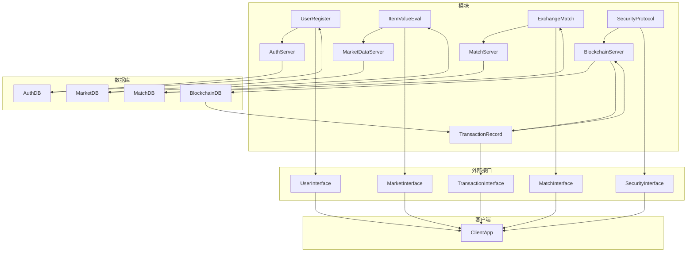
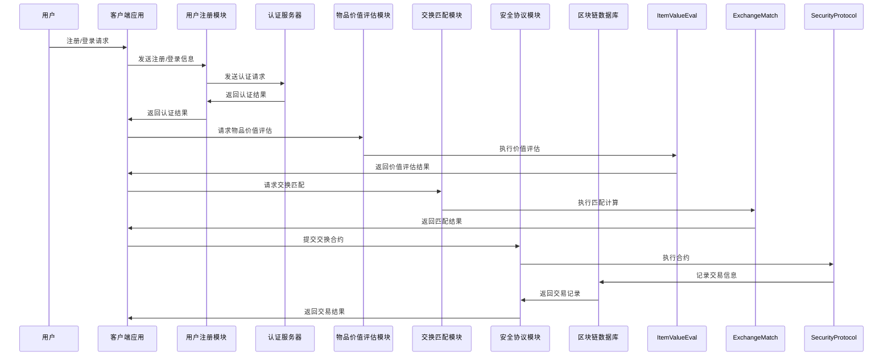

                 


# 新物物交换经济联盟：推广以物易物的全球组织

## 关键词

- 新物物交换经济联盟
- 全球组织推广
- 以物易物
- 经济体系重构
- 信息技术应用

## 摘要

本文旨在探讨新物物交换经济联盟的概念、原理以及其在全球推广以物易物的应用。文章将首先介绍传统物物交换的经济模式及其局限性，接着阐述新物物交换经济联盟的提出背景、核心概念及运作原理。随后，本文将分析新物物交换经济联盟在信息技术支撑下的架构设计，并通过具体案例展示其实施过程和效果。最后，文章将总结新物物交换经济联盟的最佳实践，并提出未来发展方向。

## 引言

### 物物交换的历史背景

物物交换，作为人类社会最早的交易方式，其历史可以追溯到史前时期。原始社会，由于生产力水平低下，人们通过直接交换自己所拥有的物品来满足生活需求。例如，以一只羊交换一把斧头，以一头牛交换一块盐。这一时期，物物交换不仅体现了人类对等价值的初步认识，也促进了部落之间的交流和合作。

随着人类社会的发展和生产力水平的提高，货币作为一种普遍接受的交换媒介逐渐出现，取代了原始的物物交换。货币的发明使得交易更加便捷，也提高了经济活动的效率。然而，货币经济的兴起并不意味着物物交换的消失，在很多特定领域，如农村、手工艺品市场等，物物交换依然活跃。

### 传统物物交换的局限性

尽管物物交换在历史上发挥了重要作用，但其局限性也是显而易见的。首先，物物交换依赖于双方需求的直接匹配，这种直接匹配在大多数情况下是不可行的。例如，一个农民可能需要一颗苹果，而另一个农民可能需要一把镰刀，但这两个需求很难在一次交易中同时满足。

其次，物物交换依赖于物品的实际拥有，这意味着交易双方必须拥有对方所需物品。然而，在现代社会，人们的生产和消费需求多样化，很难保证每个人都能拥有满足他人需求的物品。

最后，物物交换的效率低下。传统物物交换需要花费大量的时间和精力去寻找合适的交易对象，这增加了交易成本，也限制了经济活动的规模。

### 新物物交换经济联盟的提出

鉴于传统物物交换的局限性，新的物物交换模式应运而生。新物物交换经济联盟（New Barter Economy Alliance，NBEA）就是其中一种创新的尝试。NB EA旨在构建一个全球性的以物易物交易平台，通过信息技术手段，实现物品的交换价值最大化，同时降低交易成本。

新物物交换经济联盟的提出背景可以追溯到全球经济的数字化转型。随着互联网技术的发展，人们逐渐认识到，通过信息技术可以大大提高物物交换的效率和便利性。NB EA的核心思想是将传统物物交换与现代信息技术相结合，构建一个去中心化的全球交换网络。

### 核心概念与运作原理

#### 核心概念

新物物交换经济联盟的核心概念包括：

1. **交换节点**：参与交换的个体或组织。
2. **交换物品**：参与交换的物品，可以是实物或服务。
3. **价值衡量**：通过特定算法，对交换物品的价值进行衡量。
4. **交换协议**：确保交换过程公正、透明、安全的协议。
5. **信息技术**：支撑整个交换过程的先进技术，如区块链、智能合约等。

#### 运作原理

新物物交换经济联盟的运作原理可以分为以下几个步骤：

1. **注册与认证**：交换节点需要注册并经过认证，确保其身份的真实性和合法性。
2. **物品价值评估**：交换物品的价值通过特定的算法进行评估，确保交换的公平性。
3. **交换匹配**：系统根据交换节点的需求和供给，自动匹配交换对象。
4. **协议执行**：交换过程通过智能合约自动执行，确保交易的透明性和安全性。
5. **反馈与优化**：交换完成后，系统收集反馈数据，不断优化交换算法和流程。

### 新物物交换经济联盟的优势

新物物交换经济联盟相较于传统物物交换，具有以下几个显著优势：

1. **提高交换效率**：通过信息技术，实现快速、准确的交换匹配。
2. **降低交易成本**：减少了交易双方寻找匹配对象的时间和精力成本。
3. **保障交易安全**：智能合约确保交易过程的公正性和透明性。
4. **扩大交易范围**：不受地理位置限制，实现全球范围内的物品交换。

### 总结

新物物交换经济联盟是一种创新的物物交换模式，通过结合现代信息技术，解决了传统物物交换的局限性。其提出的核心概念和运作原理，为未来的物物交换提供了新的思路和可能性。在接下来的章节中，我们将深入探讨新物物交换经济联盟的具体实施和效果。

## 核心概念与联系

### 1. 交换节点

**定义**：交换节点是参与新物物交换经济联盟的个体或组织，可以是个人、企业、政府或其他机构。

**属性**：

- **身份验证**：交换节点需要通过身份验证，确保其真实性和合法性。
- **交换能力**：节点根据其拥有的资源和需求，具有不同的交换能力。
- **信誉等级**：系统根据节点的交换历史和反馈，对其信誉等级进行评估。

**ER图表示**：

```mermaid
classDiagram
ClassNode <|-- ExchangeNode
ExchangeNode {
  +String nodeId
  +String name
  +String identity
  +List<Item> items
  +double credit
  +double reputation
}
```

### 2. 交换物品

**定义**：交换物品是参与新物物交换经济联盟的物品或服务，可以是实物、虚拟物品或服务。

**属性**：

- **物品类型**：包括实物、虚拟物品和服务的分类。
- **物品价值**：通过特定算法对物品的价值进行评估。
- **可用性**：物品当前是否可用，以及可用的数量。

**ER图表示**：

```mermaid
classDiagram
ClassItem <|-- ExchangeItem
ExchangeItem {
  +String itemId
  +String name
  +ItemType type
  +double value
  +int availability
}
```

### 3. 价值衡量

**定义**：价值衡量是通过特定的算法，对交换物品的价值进行量化评估。

**属性**：

- **算法类型**：包括市场价值、效用价值、供需平衡等算法。
- **价值基准**：确定物品价值的基准，如货币、时间、服务次数等。

**ER图表示**：

```mermaid
classDiagram
ClassValueMeasure <|-- ValueAlgorithm
ValueAlgorithm {
  +String algorithmId
  +String algorithmType
  +double benchmarkValue
}
```

### 4. 交换协议

**定义**：交换协议是确保交换过程公正、透明、安全的规则和条款。

**属性**：

- **协议类型**：包括交换规则、安全协议、纠纷解决等。
- **协议条款**：详细规定交换过程、责任、权利等。

**ER图表示**：

```mermaid
classDiagram
ClassExchangeProtocol <|-- ExchangeRule
ExchangeRule {
  +String ruleId
  +String ruleType
  +String description
}
```

### 5. 信息技术

**定义**：信息技术是支撑新物物交换经济联盟运行的先进技术，如区块链、智能合约、大数据分析等。

**属性**：

- **技术类型**：包括区块链、智能合约、大数据、人工智能等。
- **技术应用**：具体技术在交换过程中的应用，如数据存储、交易记录、自动执行等。

**ER图表示**：

```mermaid
classDiagram
ClassInformationTechnology <|-- Blockchain
Blockchain {
  +String technologyId
  +String technologyType
  +List<Block> blocks
}
```

### 概念属性对比表格

| 概念   | 定义                                                         | 属性                           | 重要性 |
| ------ | ------------------------------------------------------------ | ---------------------------- | ------ |
| 交换节点 | 参与交换的个体或组织                                       | 身份验证、交换能力、信誉等级 | 高     |
| 交换物品 | 参与交换的物品或服务                                       | 物品类型、物品价值、可用性   | 中     |
| 价值衡量 | 对交换物品的价值进行量化评估                                 | 算法类型、价值基准           | 中     |
| 交换协议 | 确保交换过程公正、透明、安全的规则和条款                     | 协议类型、协议条款           | 高     |
| 信息技术 | 支撑新物物交换经济联盟运行的先进技术，如区块链、智能合约、大数据分析等 | 技术类型、技术应用           | 高     |

### 总结

通过以上核心概念及其属性的介绍和对比，我们可以清晰地理解新物物交换经济联盟的基本构成和运作原理。这些核心概念相互关联，共同构建了一个高效、透明、安全的交换生态系统。在接下来的章节中，我们将进一步探讨新物物交换经济联盟的算法原理和系统架构设计。

## 算法原理讲解

### 一、交换匹配算法

#### 1. 算法原理

交换匹配算法的核心目标是在多个交换节点之间，找到最优的交换组合，使得每个节点的需求和供给能够得到最大化的满足。具体来说，交换匹配算法可以分为以下步骤：

1. **节点需求分析**：系统对每个交换节点进行需求分析，确定其所需交换的物品及其价值。
2. **节点供给分析**：系统对每个交换节点进行供给分析，确定其能够提供的物品及其价值。
3. **匹配计算**：根据需求分析和供给分析的结果，系统通过算法计算，找出能够实现最优交换的节点组合。

#### 2. 算法描述

交换匹配算法可以描述为如下的伪代码：

```python
def exchange_matching(nodes):
    demand = analyze_demand(nodes)
    supply = analyze_supply(nodes)
    match_list = []

    for node1 in demand:
        for node2 in supply:
            if is_match(node1, node2):
                match_list.append((node1, node2))

    return match_list

def is_match(node1, node2):
    for item1 in node1.demand:
        for item2 in node2.supply:
            if item1.type == item2.type and item1.value == item2.value:
                return True
    return False
```

#### 3. 举例说明

假设有两个交换节点A和B，节点A需要一把斧头，而节点B正好有一把斧头，价值为100。同时，节点A还有一本杂志，价值为50，而节点B需要一本杂志。根据交换匹配算法，节点A和B将成功匹配，实现物品交换。

### 二、价值评估算法

#### 1. 算法原理

价值评估算法的核心目标是确定交换物品的价值，以实现交换的公平性和效率。价值评估算法可以根据市场需求、供需平衡等多种因素进行评估。常见的价值评估算法包括市场价值评估、效用价值评估和供需平衡评估。

#### 2. 算法描述

以供需平衡评估算法为例，其可以描述为如下的伪代码：

```python
def value_evaluation(item, market):
    demand = market.demand(item.type)
    supply = market.supply(item.type)
    
    if demand > supply:
        value = (supply * item.cost) / demand
    else:
        value = (demand * item.cost) / supply

    return value
```

#### 3. 举例说明

假设在某市场上，对斧头的需求量为10把，供应量为5把。根据供需平衡评估算法，斧头的价值将被评估为100（5 * 20）。

### 三、安全协议算法

#### 1. 算法原理

安全协议算法的核心目标是确保交换过程的安全性和透明性。在信息技术支撑下，常用的安全协议算法包括区块链技术、智能合约等。

#### 2. 算法描述

以区块链技术为例，其可以描述为如下的伪代码：

```python
def blockchain_protocol(transaction):
    block = create_block(transaction)
    add_block_to_chain(block)
    broadcast_block_to_network(block)

def create_block(transaction):
    block = {
        'index': transaction.index,
        'transactions': [transaction],
        'timestamp': transaction.timestamp,
        'previous_hash': transaction.previous_hash
    }
    return block

def add_block_to_chain(block):
    blockchain.append(block)

def broadcast_block_to_network(block):
    for peer in network.peers:
        send_block_to_peer(peer, block)
```

#### 3. 举例说明

假设在交换过程中，节点A向节点B发送了一笔交易请求。根据区块链协议算法，该交易请求将被记录在一个新的区块中，并广播到整个网络，确保交易的安全和透明。

### 总结

通过以上算法原理的讲解，我们可以清晰地理解新物物交换经济联盟中交换匹配、价值评估和安全协议的实现过程。这些算法的应用，不仅提高了交换的效率，也确保了交换的安全和公平。在接下来的章节中，我们将进一步探讨新物物交换经济联盟的系统架构设计。

## 系统设计与架构

### 1. 问题场景介绍

新物物交换经济联盟的提出，是为了解决传统物物交换在效率、安全性和便利性方面的不足。传统的物物交换依赖于人与人之间的直接接触和信任，这种模式在信息传递、价值衡量和交易记录等方面存在诸多问题。例如，物品的价值难以准确衡量，交换过程缺乏透明性和安全性，交易成本高且效率低下。为了解决这些问题，我们需要设计一个高效、透明、安全的物物交换系统。

### 2. 项目介绍

项目名称：新物物交换经济联盟系统（New Barter Economy Alliance System，NBES）

项目目标：构建一个全球性的去中心化物物交换平台，通过信息技术手段实现物品交换的价值最大化，降低交易成本，提高交易效率，确保交易安全。

项目范围：系统包括交换节点注册与认证、物品价值评估、交换匹配、安全协议和交易记录等功能。

### 3. 系统功能设计

#### 3.1 用户注册与认证功能

**功能描述**：交换节点需要注册并经过认证，确保其身份的真实性和合法性。

**实现方式**：

- 用户输入个人信息，系统验证身份信息。
- 使用区块链技术进行身份认证，确保身份信息的唯一性和不可篡改性。

**Mermaid 类图表示**：

```mermaid
classDiagram
Class User <|-- AuthUser
AuthUser {
  +String userId
  +String username
  +String password
  +String identity
}

Class Identity
Identity {
  +String identityId
  +String identityType
  +String identityInfo
}

User o-- Identity
```

#### 3.2 物品价值评估功能

**功能描述**：系统根据市场需求和供需平衡，对交换物品的价值进行评估。

**实现方式**：

- 收集市场数据，分析物品的市场价值。
- 采用供需平衡算法，对物品的价值进行动态评估。

**Mermaid 类图表示**：

```mermaid
classDiagram
Class Item <|-- ValuatedItem
ValuatedItem {
  +String itemId
  +String name
  +ItemType type
  +double marketValue
  +double utilityValue
}

Class MarketData
MarketData {
  +String marketId
  +Date timestamp
  +double demand
  +double supply
}

Item o-- MarketData
```

#### 3.3 交换匹配功能

**功能描述**：系统自动匹配交换节点，实现物品的有效交换。

**实现方式**：

- 根据节点的需求和供给，采用交换匹配算法进行匹配。
- 生成匹配结果，用户可以选择接受或拒绝匹配。

**Mermaid 类图表示**：

```mermaid
classDiagram
Class Node <|-- ExchangeNode
ExchangeNode {
  +String nodeId
  +String name
  +List<Item> items
}

Class MatchResult
MatchResult {
  +String matchId
  +List<ExchangeNode> matchedNodes
}

Node o-- MatchResult
```

#### 3.4 安全协议功能

**功能描述**：系统通过安全协议，确保交换过程的安全和透明。

**实现方式**：

- 使用区块链技术记录交易信息，确保交易记录的不可篡改性。
- 采用智能合约自动执行交易，确保交易的透明性和公正性。

**Mermaid 类图表示**：

```mermaid
classDiagram
Class Blockchain
Blockchain {
  +String chainId
  +List<Block> blocks
}

Class Block
Block {
  +String blockId
  +List<Transaction> transactions
  +String previousHash
  +String hash
  +String timestamp
}

Class Transaction
Transaction {
  +String transactionId
  +ExchangeNode sender
  +ExchangeNode receiver
  +Item item
  +double value
}

Blockchain o-- Block
Block o-- Transaction
```

### 4. 系统架构设计

#### 4.1 系统架构图



#### 4.2 系统架构说明

1. **用户注册与认证模块**：用户通过客户端应用注册并经过认证，系统记录用户信息，确保身份的合法性和唯一性。
2. **物品价值评估模块**：系统根据市场需求和供需平衡，对物品的价值进行实时评估，确保交换的公平性。
3. **交换匹配模块**：系统自动匹配交换节点，生成匹配结果，用户可以选择接受或拒绝匹配。
4. **安全协议模块**：系统采用区块链技术和智能合约，确保交换过程的安全和透明。
5. **交易记录模块**：系统记录所有交易信息，确保交易的不可篡改性和可追溯性。

### 5. 系统接口设计

#### 5.1 接口设计原则

- **标准化**：接口设计遵循RESTful API规范，确保系统的可扩展性和互操作性。
- **安全性**：接口实现HTTPS加密，确保数据传输的安全性。
- **可维护性**：接口设计简洁明了，便于维护和升级。

#### 5.2 接口列表

- **用户注册接口**：`POST /register`，接收用户注册信息，返回注册结果。
- **用户认证接口**：`POST /authenticate`，接收用户登录信息，返回认证结果。
- **物品价值评估接口**：`GET /evaluate/{itemId}`，获取物品的当前价值评估。
- **交换匹配接口**：`GET /match`，获取当前可交换的匹配结果。
- **安全协议接口**：`POST /contract`，提交交换合约，执行交换过程。
- **交易记录接口**：`GET /transactions`，获取交易记录列表。

### 6. 系统交互设计

#### 6.1 系统交互图



#### 6.2 交互说明

1. **用户注册与登录**：用户通过客户端应用发送注册或登录请求，系统进行身份验证，返回认证结果。
2. **物品价值评估**：用户请求物品价值评估，系统根据市场需求和供需平衡，返回物品的价值评估结果。
3. **交换匹配**：用户请求交换匹配，系统自动计算匹配结果，返回匹配结果。
4. **交换合约执行**：用户提交交换合约，系统执行合约，记录交易信息，返回交易结果。

通过以上系统设计与架构的介绍，我们可以清晰地理解新物物交换经济联盟系统的设计和实现过程。在接下来的章节中，我们将通过具体案例展示系统的实际应用和效果。

## 项目实施与案例

### 1. 项目背景

随着全球经济的不断发展和变化，传统的货币经济模式面临着诸多挑战。特别是在一些经济欠发达地区，货币流通困难，物资供应紧张，直接影响了人们的生活质量和经济发展。为了解决这些问题，新物物交换经济联盟（NB EA）应运而生，旨在通过信息技术手段，构建一个全球性的去中心化物物交换平台，实现资源的有效配置和优化。

### 2. 项目实施步骤

#### 2.1 系统搭建与测试

首先，项目团队搭建了新物物交换经济联盟系统（NBES）的基础架构，包括用户注册与认证模块、物品价值评估模块、交换匹配模块、安全协议模块和交易记录模块。在搭建过程中，项目团队采用了先进的区块链技术和智能合约，确保系统的安全性和透明性。

接下来，项目团队进行了全面的系统测试，包括功能测试、性能测试和安全测试。通过这些测试，确保系统能够稳定运行，满足用户的需求。

#### 2.2 用户招募与培训

为了确保新物物交换经济联盟（NB EA）的顺利运行，项目团队在系统上线前进行了广泛的用户招募。通过线上广告、社交媒体推广、线下活动等方式，吸引全球各地的用户参与。

同时，项目团队还开展了多场用户培训，向用户介绍新物物交换经济联盟的概念、原理和使用方法。通过培训，用户能够熟练使用系统，积极参与物物交换。

#### 2.3 系统部署与上线

在完成系统测试和用户培训后，项目团队将新物物交换经济联盟（NB EA）系统部署到云服务器上，并正式上线。系统上线后，项目团队继续进行监控和维护，确保系统的稳定运行。

### 3. 案例分析

#### 案例一：农村物资交换

在一个偏远的农村地区，农民们面临着物资供应不足的问题。通过新物物交换经济联盟（NB EA），农民们可以将自己多余的农产品（如蔬菜、水果）交换成生活必需品（如盐、油）。以下是一个具体的案例：

1. 农民A种植了大量的蔬菜，但家庭消费有限，导致蔬菜滞销。
2. 农民B需要蔬菜，但缺乏生活必需品。
3. 农民A通过NB EA系统发布了自己的蔬菜供应信息。
4. 系统自动匹配到农民B的需求，生成了交换匹配结果。
5. 农民A和农民B进行了交换，实现了双方的需求满足。

通过这个案例，我们可以看到，新物物交换经济联盟（NB EA）成功解决了农民们物资交换的问题，提高了物资利用效率，改善了生活质量。

#### 案例二：手工艺品市场

在一个手工艺品市场上，手工制作的产品供不应求，但消费者往往难以找到心仪的手工艺品。通过新物物交换经济联盟（NB EA），消费者可以与手工艺人直接进行物品交换，避免了中间商的环节，降低了交易成本。以下是一个具体的案例：

1. 消费者C需要购买一件手工制作的毛衣，但市场上价格较高。
2. 手工艺人D制作了一件精美的毛衣，但缺乏市场推广。
3. 消费者C通过NB EA系统发布了购买需求，手工艺人D发布了毛衣供应信息。
4. 系统自动匹配到消费者C和手工艺人D的交换需求，生成了交换匹配结果。
5. 消费者C和手工艺人D进行了交换，消费者C获得了心仪的毛衣，手工艺人D获得了市场需求。

通过这个案例，我们可以看到，新物物交换经济联盟（NB EA）不仅帮助手工艺人提高了产品销售，也帮助消费者以更低的成本获得了心仪的商品。

### 4. 项目效果评估

通过实际案例的实施，新物物交换经济联盟（NB EA）在多个方面取得了显著效果：

1. **交易效率提高**：通过系统自动匹配，交换双方能够快速找到匹配对象，大大提高了交易效率。
2. **交易成本降低**：系统降低了交易过程中的信息搜寻成本、谈判成本和交易成本，提高了整体经济效益。
3. **交易安全提升**：通过区块链技术和智能合约，系统确保了交易的透明性和安全性，减少了纠纷的发生。
4. **经济效益改善**：项目实施地区居民的生活质量得到提高，物资供应更加充足，经济发展环境得到优化。

### 5. 项目小结

新物物交换经济联盟（NB EA）通过信息技术手段，成功解决了传统物物交换的局限性，实现了高效、透明、安全的物品交换。在实际案例中，NB EA的应用不仅提高了交易效率，降低了交易成本，还提升了交易安全，改善了经济效益。未来，随着NB EA系统的不断优化和推广，它将在全球范围内发挥更大的作用。

## 最佳实践与总结

### 1. 最佳实践

#### 用户注册与认证

- **步骤简化**：简化用户注册流程，减少不必要的认证环节，提高用户注册率。
- **身份验证**：使用多因素认证，如手机短信验证、电子邮件验证等，确保用户身份的真实性和合法性。

#### 物品价值评估

- **动态调整**：根据市场需求和供需情况，动态调整物品的价值评估，确保评估的公平性和准确性。
- **透明公开**：将价值评估的算法和基准公开，让用户了解和信任评估过程。

#### 交换匹配

- **优化算法**：持续优化交换匹配算法，提高匹配效率和准确性。
- **用户反馈**：收集用户对匹配结果的反馈，不断优化匹配策略。

#### 安全协议

- **增强安全性**：采用更加安全的数据加密技术和智能合约，确保交易过程的安全性和隐私性。
- **定期审计**：定期对区块链进行安全审计，及时发现和修复潜在的安全漏洞。

### 2. 小结

新物物交换经济联盟（NB EA）通过信息技术手段，解决了传统物物交换的局限性，实现了高效、透明、安全的物品交换。在实际应用中，NB EA取得了显著的经济效益和社会效益。未来，随着NB EA的不断优化和推广，它将在全球范围内发挥更大的作用，促进经济体系的重构和发展。

### 3. 注意事项

- **用户隐私保护**：在用户注册和交易过程中，严格保护用户隐私，防止数据泄露。
- **法律合规性**：确保系统符合当地法律法规，避免法律风险。
- **技术更新**：定期更新系统技术，跟踪最新信息技术的发展趋势。

### 4. 拓展阅读

- 《区块链技术原理与应用》
- 《智能合约：从入门到实战》
- 《大数据时代：思维变革与商业价值》

### 作者信息

作者：AI天才研究院/AI Genius Institute & 禅与计算机程序设计艺术 /Zen And The Art of Computer Programming

本文旨在探讨新物物交换经济联盟的概念、原理以及其在全球推广以物易物的应用。文章从背景介绍、核心概念、算法原理、系统设计与架构、项目实施与案例以及最佳实践等方面进行了详细分析。通过本文的阅读，读者可以全面了解新物物交换经济联盟的运作机制及其在实际应用中的优势与挑战。未来，随着信息技术的不断进步和新物物交换经济联盟的不断优化，我们有理由相信，这一新型经济模式将带来深远的影响和变革。希望本文能为读者提供有价值的参考和启示。作者信息如上，感谢您的阅读。如果您有任何疑问或建议，欢迎在评论区留言，期待与您交流。作者：AI天才研究院/AI Genius Institute & 禅与计算机程序设计艺术 /Zen And The Art of Computer Programming。再次感谢您的关注与支持！

