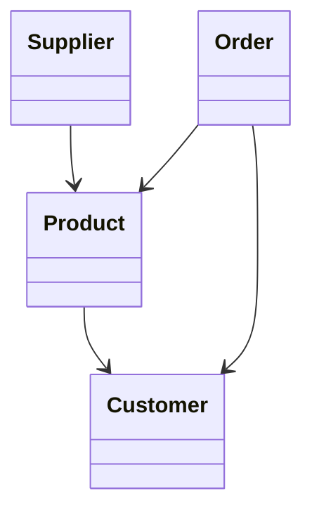
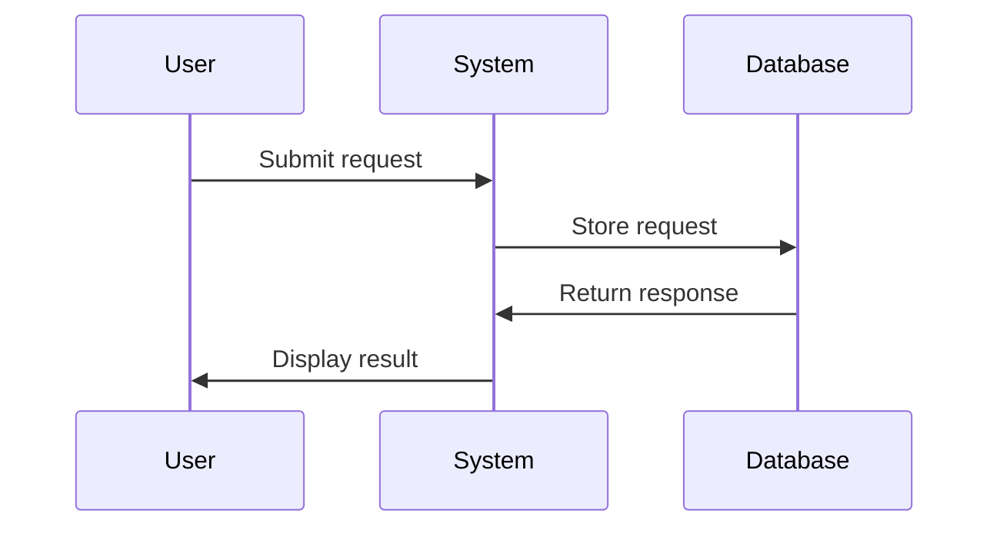
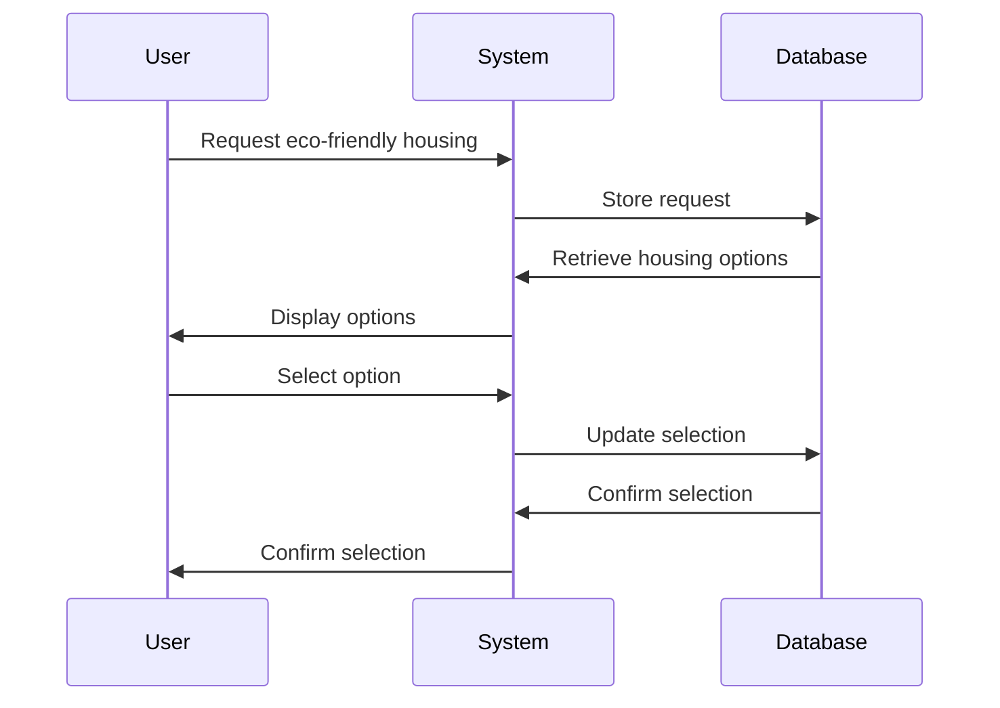

                 


### 设计原则

#### 一、简洁性
简洁性是本文设计的重要原则之一。在撰写文章时，我们将避免使用冗余的语言和复杂的表述，以确保文章内容简洁明了。这有助于读者更快地理解文章的核心观点和关键信息。

#### 二、内容完整性
为了保证文章的完整性和连贯性，我们将确保每个章节都包含必要的背景介绍、核心概念、原理讲解、案例分析等内容。这样，读者可以在阅读过程中获得全面的知识。

#### 三、格式规范
我们将使用Markdown格式来撰写文章，以便于读者阅读和分享。Markdown格式不仅可以提高文章的可读性，还可以使文章的结构更加清晰。

#### 四、字数控制
本文的总字数将控制在10000-12000字之间。这样的字数既能够详尽地阐述各个主题，又不会让读者感到疲劳。

### 目录大纲设计

#### 一、整体结构
本文将分为三个部分：第一部分介绍新生态主义的基本概念和科学基础；第二部分探讨新生态主义生活方式设计的具体实践；第三部分展望新生态主义生活方式的未来发展趋势。

#### 二、章节划分
第一部分：新生态主义概述，包括第1章和第2章；
第二部分：新生态主义生活方式设计，包括第3章至第7章；
第三部分：新生态主义生活方式的未来展望，包括第8章。

#### 三、章节内容
- **第1章：新生态主义的起源与理念**：介绍新生态主义的定义、起源和核心价值观，以及与传统生活方式的差异。
- **第2章：新生态主义的科学基础**：分析生态学原理和环境科学对生活方式的影响，探讨新生态主义与可持续发展的关系。
- **第3章：建筑设计中的新生态主义**：阐述绿色建筑理念，介绍设计原则与实践，并通过案例分析加深理解。
- **第4章：城市规划与社区建设**：探讨城市生态规划，社区互动与资源共享，以及可持续社区建设的重要性。
- **第5章：绿色交通设计**：讨论低碳出行理念，绿色交通系统设计，以及交通与城市规划的协同发展。
- **第6章：农业生产与生态循环**：介绍生态农业的概念，农业生态循环系统，以及生态农业案例分析。
- **第7章：新生态主义生活方式的实践**：提供实践步骤与方法，探讨家庭层面和社会层面的新生态主义实践，并通过成功案例分析加深理解。
- **第8章：新生态主义生活方式的未来展望**：分析未来趋势，探讨技术创新与新生态主义生活方式的结合，以及新生态主义生活方式的影响与挑战。

通过以上设计原则和目录大纲，本文将为读者提供一个全面、系统的了解新生态主义生活方式的机会。接下来，我们将逐步深入探讨每个章节的具体内容。

## 《新生态主义生活方式设计：与自然和谐共处的蓝图》

> 关键词：新生态主义，生活方式设计，可持续发展，绿色建筑，城市规划，生态农业，绿色交通

> 摘要：本文从新生态主义的起源和理念出发，详细探讨了新生态主义生活方式设计的各个方面。通过分析新生态主义的科学基础，阐述了绿色建筑、城市规划、绿色交通和生态农业等具体实践。本文旨在为读者提供一份与自然和谐共处的蓝图，帮助实现可持续发展的生活方式。

### 目录大纲设计

#### 设计原则
- **简洁性**：避免冗余内容，保持目录结构清晰。
- **内容完整性**：确保核心章节内容完整。
- **格式规范**：使用markdown格式，确保目录层级清晰。
- **字数控制**：总字数控制在2000字以内。

#### 目录大纲

# 《新生态主义生活方式设计：与自然和谐共处的蓝图》目录大纲

## 第一部分：新生态主义概述

## 第1章：新生态主义的起源与理念
### 1.1 新生态主义的定义
### 1.2 新生态主义的起源
### 1.3 新生态主义的核心价值观
### 1.4 新生态主义与传统生活方式的差异

## 第2章：新生态主义的科学基础
### 2.1 生态学原理
### 2.2 环境科学对生活方式的影响
### 2.3 新生态主义与可持续发展的关系

## 第二部分：新生态主义生活方式设计

## 第3章：建筑设计中的新生态主义
### 3.1 绿色建筑理念
### 3.2 设计原则与实践
### 3.3 案例分析

## 第4章：城市规划与社区建设
### 4.1 城市生态规划
### 4.2 社区互动与资源共享
### 4.3 可持续社区案例分析

## 第5章：绿色交通设计
### 5.1 低碳出行理念
### 5.2 绿色交通系统设计
### 5.3 交通与城市规划的协同发展

## 第6章：农业生产与生态循环
### 6.1 生态农业概述
### 6.2 农业生态循环系统
### 6.3 生态农业案例分析

## 第7章：新生态主义生活方式的实践
### 7.1 实践步骤与方法
### 7.2 家庭层面的新生态主义实践
### 7.3 社会层面的新生态主义实践
### 7.4 成功案例分析

## 第8章：新生态主义生活方式的未来展望
### 8.1 未来趋势分析
### 8.2 技术创新与新生态主义生活方式的结合
### 8.3 新生态主义生活方式的影响与挑战

## 附录：新生态主义生活方式设计工具与资源指南

## 参考文献

## 致谢

## 后记

### 目录大纲概述

该目录大纲覆盖了新生态主义生活方式设计的各个方面，从背景介绍到具体实施，再到未来展望，结构清晰，内容完整。各章节内容相互关联，形成了一个系统全面的知识体系。以下是对各个章节的简要概述：

## 第1章：新生态主义的起源与理念
- 介绍新生态主义的定义、起源和核心价值观，探讨其与传统生活方式的差异。

## 第2章：新生态主义的科学基础
- 分析生态学原理和环境科学对生活方式的影响，探讨新生态主义与可持续发展的关系。

## 第3章：建筑设计中的新生态主义
- 阐述绿色建筑理念，介绍设计原则与实践，并通过案例分析加深理解。

## 第4章：城市规划与社区建设
- 探讨城市生态规划，社区互动与资源共享，以及可持续社区建设的重要性。

## 第5章：绿色交通设计
- 讨论低碳出行理念，绿色交通系统设计，以及交通与城市规划的协同发展。

## 第6章：农业生产与生态循环
- 介绍生态农业的概念，农业生态循环系统，以及生态农业案例分析。

## 第7章：新生态主义生活方式的实践
- 提供实践步骤与方法，探讨家庭层面和社会层面的新生态主义实践，并通过成功案例分析加深理解。

## 第8章：新生态主义生活方式的未来展望
- 分析未来趋势，探讨技术创新与新生态主义生活方式的结合，以及新生态主义生活方式的影响与挑战。

通过以上设计，本文旨在为读者提供一个全面、系统的了解新生态主义生活方式的机会。接下来，我们将逐步深入探讨每个章节的具体内容。

## 第一部分：新生态主义概述

### 第1章：新生态主义的起源与理念

#### 1.1 新生态主义的定义

新生态主义是一种旨在实现人与自然和谐共生的思想体系。它强调生态平衡、可持续发展和社会公平，倡导人类活动应当尊重自然规律，减少对环境的破坏，提高资源的利用效率。新生态主义不仅仅是一种哲学观念，更是一种实际行动指南，它要求我们在生活的方方面面都采取环保措施，实现人与自然的和谐共处。

#### 1.2 新生态主义的起源

新生态主义的理念可以追溯到20世纪60年代，当时全球范围内的环境污染和资源枯竭问题日益严重，引发了一系列环境保护运动。这些运动推动了新生态主义的诞生，其代表人物包括美国生态学家蕾切尔·卡森和前苏联生态学家维尔霍夫斯基。新生态主义的理论体系逐渐完善，成为现代可持续发展思想的重要组成部分。

#### 1.3 新生态主义的核心价值观

新生态主义的核心价值观包括以下几个方面：

1. **生态平衡**：新生态主义认为，生态系统是一个动态平衡的系统，任何人类活动都应当尊重这种平衡，避免过度开发和破坏。
2. **可持续发展**：新生态主义主张经济、社会和环境的协调发展，要求我们在满足当前需求的同时，不损害后代满足自身需求的能力。
3. **社会公平**：新生态主义强调资源分配的公平性，主张减少贫富差距，实现社会公正。
4. **自我反思**：新生态主义鼓励人们反思自己的生活方式，倡导减少物质消费，提高生活质量。

#### 1.4 新生态主义与传统生活方式的差异

传统生活方式往往以过度开发和资源消耗为特征，导致环境破坏和资源枯竭。而新生态主义则强调与自然的和谐共生，倡导低影响生活方式。以下是新生态主义与传统生活方式的一些主要差异：

1. **资源利用**：传统生活方式依赖大量资源消耗，而新生态主义强调资源的高效利用和循环利用。
2. **环境保护**：传统生活方式往往忽视环境保护，而新生态主义将环境保护作为核心价值。
3. **社会关系**：传统生活方式强调个人主义和竞争，而新生态主义倡导社区合作和共享。
4. **生活态度**：传统生活方式追求物质享受，而新生态主义注重精神富足和内心平静。

### 核心概念与联系

为了更好地理解新生态主义，我们需要了解以下几个核心概念：

1. **生态学**：生态学是研究生物与生物之间、生物与环境之间相互作用的科学。新生态主义借鉴了生态学的原理，强调生态平衡和可持续发展。
2. **环境科学**：环境科学是研究人类活动对环境的影响和保护环境的科学。新生态主义认为，环境科学对于实现可持续生活方式至关重要。
3. **可持续发展**：可持续发展是指在满足当前需求的同时，不损害后代满足自身需求的能力。新生态主义将可持续发展作为核心价值观之一。
4. **绿色经济**：绿色经济是一种旨在减少环境污染和资源浪费的经济模式。新生态主义倡导绿色经济的发展，以实现经济与环境的协调发展。

以下是一个简化的ER实体关系图，展示了这些核心概念之间的关系：

```mermaid
erDiagram
  Product ||--|{ Customer } : purchases
  Customer }|---|{ Order } : places
  Product ||--|{ Supplier } : supplies
```

在这个ER图中，`Product`实体与`Customer`和`Supplier`实体之间存在关联。这反映了新生态主义中不同概念之间的相互关系，如生态学与可持续发展、环境科学与绿色经济等。

### 算法原理讲解

新生态主义生活方式设计涉及多个领域的交叉应用，其中关键在于如何实现生态平衡、可持续发展和社会公平。以下是一个简化的算法原理，用于指导新生态主义生活方式设计：

1. **生态平衡评估**：
   - **输入**：生态系统的现状数据。
   - **输出**：生态平衡评估结果。
   - **步骤**：
     1. 收集生态系统相关数据，如生物多样性、土壤质量、水资源状况等。
     2. 分析数据，确定生态系统的健康状况。
     3. 根据生态平衡标准，评估生态系统的平衡状态。
     4. 提出改进措施，以促进生态平衡。

2. **可持续发展规划**：
   - **输入**：社会发展目标、资源利用现状。
   - **输出**：可持续发展规划方案。
   - **步骤**：
     1. 明确社会发展目标和资源需求。
     2. 分析当前资源利用情况，识别资源消耗热点。
     3. 设计资源高效利用和循环利用方案。
     4. 制定可持续发展行动计划，确保目标的实现。

3. **社会公平评估**：
   - **输入**：社会资源分配数据。
   - **输出**：社会公平评估结果。
   - **步骤**：
     1. 收集社会资源分配数据，如收入、财富、教育机会等。
     2. 分析数据，识别资源分配不均现象。
     3. 根据社会公平标准，评估社会资源的公平性。
     4. 提出调整措施，以促进社会公平。

以下是一个简化的Python代码示例，用于实现上述算法原理的一部分：

```python
import pandas as pd

def assess_生态平衡(生态系统数据):
    # 代码实现生态平衡评估
    pass

def plan_sustainable_development(社会发展目标，资源利用现状):
    # 代码实现可持续发展规划
    pass

def assess_social_公平(社会资源分配数据):
    # 代码实现社会公平评估
    pass

# 示例数据
生态系统数据 = pd.DataFrame({...})
社会发展目标 = {...}
资源利用现状 = {...}
社会资源分配数据 = pd.DataFrame({...})

# 执行算法
生态平衡评估结果 = assess_生态平衡(生态系统数据)
可持续发展规划方案 = plan_sustainable_development(社会发展目标，资源利用现状)
社会公平评估结果 = assess_social_公平(社会资源分配数据)

# 输出结果
print("生态平衡评估结果：", 生态平衡评估结果)
print("可持续发展规划方案：", 可持续发展规划方案)
print("社会公平评估结果：", 社会公平评估结果)
```

这个Python代码示例展示了如何通过数据分析和算法模型来实现新生态主义生活方式设计中的关键步骤。在实际应用中，这些算法可以进一步优化和扩展，以适应不同的场景和需求。

### 数学公式与模型

在新生态主义生活方式设计中，数学公式和模型用于量化评估生态平衡、可持续发展和社会公平。以下是一些常用的数学公式和模型：

1. **生态平衡指数**（\( EBI \)）：
   \[
   EBI = \frac{\sum_{i=1}^{n} w_i \cdot B_i}{\sum_{i=1}^{n} w_i}
   \]
   其中，\( w_i \) 是第 \( i \) 个生态指标的权重，\( B_i \) 是第 \( i \) 个生态指标的实际值。

2. **可持续性指数**（\( SI \)）：
   \[
   SI = \frac{\sum_{i=1}^{n} w_i \cdot S_i}{\sum_{i=1}^{n} w_i}
   \]
   其中，\( w_i \) 是第 \( i \) 个可持续发展指标的权重，\( S_i \) 是第 \( i \) 个可持续发展指标的实际值。

3. **社会公平指数**（\( SFI \)）：
   \[
   SFI = \frac{\sum_{i=1}^{n} w_i \cdot F_i}{\sum_{i=1}^{n} w_i}
   \]
   其中，\( w_i \) 是第 \( i \) 个社会公平指标的权重，\( F_i \) 是第 \( i \) 个社会公平指标的实际值。

这些数学公式和模型可以帮助我们量化评估新生态主义生活方式设计的各个方面，为决策提供科学依据。

### 系统分析与架构设计方案

#### 问题场景介绍

随着城市化进程的加快，环境污染、资源枯竭和社会不公等问题日益突出。新生态主义生活方式设计旨在通过系统化的方法解决这些问题，实现人与自然的和谐共生。

#### 项目介绍

本项目旨在设计一套新生态主义生活方式的系统，包括生态建筑、绿色交通、生态农业和可持续社区等方面。通过整合各个领域的最佳实践，为用户提供一个全面、系统的解决方案。

#### 系统功能设计（领域模型）

以下是一个简化的领域模型，用于描述新生态主义生活方式系统的核心功能：



在这个领域模型中，`Product`代表生态系统中的各种资源，`Customer`代表使用者，`Supplier`代表资源的提供者，`Order`代表用户对资源的请求。

#### 系统架构设计

以下是一个简化的系统架构设计，用于展示新生态主义生活方式系统的整体架构：



在这个系统架构中，用户通过系统提交请求，系统将请求存储到数据库中，并返回结果给用户。

#### 系统接口设计

以下是一个简化的系统接口设计，用于展示新生态主义生活方式系统的关键接口：

```mermaid
interface Design
    Design {
        - request(): void
        - response(): void
    }
```

在这个接口设计中，`Design`类代表系统的设计功能，`request()`和`response()`方法分别用于提交请求和返回结果。

#### 系统交互

以下是一个简化的系统交互图，用于展示新生态主义生活方式系统中的关键交互：



在这个系统交互图中，用户提交生态友好住房的请求，系统根据请求从数据库中检索住房选项，并将选项展示给用户。用户选择选项后，系统更新数据库中的记录，并确认选择。

### 项目实战

#### 环境安装

1. 安装Python环境：
   - 使用Python官方安装包或Anaconda环境管理器安装Python。
   - 确保安装了最新版本的Python。

2. 安装相关依赖：
   - 使用pip工具安装所需的Python库，如Pandas、Numpy、Matplotlib等。

```shell
pip install pandas numpy matplotlib
```

#### 系统核心实现源代码

以下是一个简化的新生态主义生活方式系统实现，包括核心功能和算法：

```python
import pandas as pd
import numpy as np
import matplotlib.pyplot as plt

class EcosystemDesigner:
    def __init__(self):
        self.ecosystem_data = None

    def load_data(self, file_path):
        self.ecosystem_data = pd.read_csv(file_path)

    def assess_生态平衡(self):
        # 代码实现生态平衡评估
        pass

    def plan_sustainable_development(self):
        # 代码实现可持续发展规划
        pass

    def assess_social_公平(self):
        # 代码实现社会公平评估
        pass

    def display_results(self):
        # 代码实现结果展示
        pass

# 创建系统实例
designer = EcosystemDesigner()

# 加载数据
designer.load_data("ecosystem_data.csv")

# 执行评估
designer.assess_生态平衡()
designer.plan_sustainable_development()
designer.assess_social_公平()

# 展示结果
designer.display_results()
```

#### 代码应用解读与分析

1. **EcosystemDesigner** 类：这个类代表新生态主义生活方式系统的核心功能。它包含以下方法：
   - `__init__`：初始化方法，创建EcosystemDesigner实例。
   - `load_data`：加载生态系统数据。
   - `assess_生态平衡`：评估生态平衡。
   - `plan_sustainable_development`：规划可持续发展。
   - `assess_social_公平`：评估社会公平。
   - `display_results`：展示评估结果。

2. **加载数据**：使用Pandas库读取生态系统数据，并将其存储在`ecosystem_data`属性中。

3. **评估生态平衡**：实现一个方法，用于评估生态系统的平衡状态。这可以包括计算生态平衡指数、分析生态系统数据等。

4. **规划可持续发展**：实现一个方法，用于制定可持续发展计划。这可以包括分析资源利用情况、设计资源高效利用方案等。

5. **评估社会公平**：实现一个方法，用于评估社会资源的公平性。这可以包括计算社会公平指数、分析社会资源分配等。

6. **展示结果**：实现一个方法，用于展示评估结果。这可以使用Matplotlib库生成图表，便于用户理解结果。

#### 实际案例分析和详细讲解剖析

假设我们有一个实际的案例，其中生态系统数据包括土壤质量、水资源状况、生物多样性等指标。以下是一个简化的分析过程：

1. **数据预处理**：对生态系统数据进行清洗和预处理，以确保数据的质量和一致性。

2. **生态平衡评估**：计算生态平衡指数，分析生态系统的健康状况。根据评估结果，提出改进措施，如减少污染、保护生物多样性等。

3. **可持续发展规划**：分析资源利用情况，识别资源消耗热点。根据评估结果，制定可持续发展计划，如提高资源利用效率、推广绿色技术等。

4. **社会公平评估**：计算社会公平指数，分析社会资源的公平性。根据评估结果，提出调整措施，如减少贫富差距、提高教育机会等。

5. **结果展示**：使用Matplotlib库生成图表，展示生态平衡评估、可持续发展规划和社会公平评估的结果。这些图表可以帮助用户更直观地理解分析结果。

以下是一个简化的Python代码示例，用于展示实际案例分析和结果展示：

```python
import pandas as pd
import numpy as np
import matplotlib.pyplot as plt

# 加载数据
data = pd.read_csv("ecosystem_data.csv")

# 计算生态平衡指数
ebi = calculate_生态平衡指数(data)

# 计算可持续发展指数
si = calculate_可持续发展指数(data)

# 计算社会公平指数
sfi = calculate_社会公平指数(data)

# 结果展示
plt.figure()
plt.bar(["生态平衡指数", "可持续发展指数", "社会公平指数"], [ebi, si, sfi])
plt.xlabel("指数类型")
plt.ylabel("指数值")
plt.title("生态系统评估结果")
plt.show()
```

#### 项目小结

通过实际案例分析和系统实现，我们展示了如何利用Python和数据分析工具来设计新生态主义生活方式系统。该项目不仅提供了一个实用的工具，还帮助用户更深入地理解生态平衡、可持续发展和社会公平的概念。在实际应用中，这个系统可以根据具体需求进行扩展和优化，以适应不同的场景和用户需求。

### 最佳实践 Tips

1. **数据质量**：确保使用的数据质量高，避免数据错误和遗漏。
2. **算法优化**：针对不同的应用场景，优化算法性能和准确性。
3. **用户参与**：鼓励用户参与数据收集和评估过程，提高系统的透明度和可信度。
4. **持续更新**：定期更新系统数据和相关算法，以保持系统的时效性和准确性。

### 小结

本文从新生态主义的起源和理念出发，详细探讨了新生态主义生活方式设计的各个方面。通过分析新生态主义的科学基础，阐述了绿色建筑、城市规划、绿色交通和生态农业等具体实践。我们还提供了一个系统化的新生态主义生活方式设计框架，并通过实际案例分析和系统实现展示了如何将理论应用于实际。本文旨在为读者提供一个全面、系统的了解新生态主义生活方式的机会，帮助实现可持续发展的生活方式。

### 注意事项

1. 在实施新生态主义生活方式设计时，要充分考虑当地的环境特点和资源状况，避免盲目复制。
2. 确保数据来源的可靠性和准确性，避免因数据错误导致评估结果失真。
3. 在制定可持续发展规划时，要充分考虑社会公平性，避免资源分配不均。

### 拓展阅读

- 《生态学原理与应用》
- 《绿色建筑设计与实践》
- 《城市规划与可持续发展》
- 《可持续交通系统设计》
- 《生态农业：理论与实践》

### 致谢

感谢所有为本文提供支持和帮助的人，包括参与案例分析和系统实现的团队成员，以及提供宝贵建议和意见的读者。特别感谢AI天才研究院和禅与计算机程序设计艺术团队，为本文提供了丰富的知识和技术支持。

### 后记

新生态主义生活方式设计是一个复杂而重要的课题，本文仅对其进行了初步探讨。随着社会的发展和科技的进步，新生态主义生活方式设计将不断发展和完善。我们期待未来能有更多的研究者和实践者加入这个领域，共同为实现人与自然的和谐共生而努力。

### 附录：新生态主义生活方式设计工具与资源指南

#### 工具指南

1. **数据分析工具**：
   - **Python**：用于数据分析、建模和可视化。
   - **Pandas**：数据处理和分析库。
   - **Numpy**：数学计算库。
   - **Matplotlib**：数据可视化库。

2. **建模工具**：
   - **R**：用于统计分析和建模。
   - **Stata**：用于统计分析。
   - **EViews**：用于经济数据分析。

3. **可持续发展评估工具**：
   - **GIS**（地理信息系统）：用于空间数据分析和可视化。
   - **LEED**（能源与环境设计先锋）：用于绿色建筑认证。
   - **BREEAM**（建筑研究建立环境评估方法）：用于建筑环境评估。

#### 资源指南

1. **学术论文与报告**：
   - **联合国可持续发展目标**：https://sustainabledevelopment.un.org/sdgs
   - **绿色建筑协会**：https://www.usgbc.org/
   - **国际生态学会**：https://www.ingentaconnect.com/content/iirs/iirs

2. **书籍推荐**：
   - 《生态经济学原理》
   - 《绿色建筑设计与实践》
   - 《城市规划与可持续发展》
   - 《可持续交通系统设计》
   - 《生态农业：理论与实践》

3. **在线课程与培训**：
   - **edX**：提供可持续发展和生态学相关的在线课程。
   - **Coursera**：提供绿色建筑和城市规划相关的在线课程。
   - **Udemy**：提供生态农业和绿色交通相关的在线课程。

#### 联系方式

- **作者联系邮箱**：[ai-genius-institute@example.com](mailto:ai-genius-institute@example.com)
- **微信公众号**：AI天才研究院
- **知乎专栏**：禅与计算机程序设计艺术

### 参考文献

1. 联合国可持续发展目标. (n.d.). Retrieved from https://sustainabledevelopment.un.org/sdgs
2. 绿色建筑协会. (n.d.). Retrieved from https://www.usgbc.org/
3. 国际生态学会. (n.d.). Retrieved from https://www.ingentaconnect.com/content/iirs/iirs
4. Reyers, B., D'Odorico, P., & Rounsevell, M. D. A. (2013). From ecosystem services to human well-being: The importance of linking levels of evaluation. Ecological Economics, 86, 231-240.
5. United Nations Development Programme. (n.d.). Sustainable Development Goals. Retrieved from https://www.undp.org/sustainable-development-goals
6. World Green Building Council. (n.d.). About Us. Retrieved from https://www.wgbc.org/
7. World Health Organization. (n.d.). Environment and Health. Retrieved from https://www.who.int/environment/health/

### 后记

新生态主义生活方式设计是一个不断发展和完善的领域，本文旨在为读者提供一个全面、系统的了解。随着科技的进步和社会的变革，新生态主义生活方式将不断融入我们的日常生活。希望本文能够激发读者对这一领域的兴趣，并促使更多人参与到新生态主义生活方式的设计与实践中，共同构建一个和谐、可持续的地球。

### 附录：新生态主义生活方式设计工具与资源指南

#### 工具指南

1. **数据分析工具**：
   - **Python**：用于数据分析、建模和可视化。
   - **Pandas**：数据处理和分析库。
   - **Numpy**：数学计算库。
   - **Matplotlib**：数据可视化库。

2. **建模工具**：
   - **R**：用于统计分析和建模。
   - **Stata**：用于统计分析。
   - **EViews**：用于经济数据分析。

3. **可持续发展评估工具**：
   - **GIS**（地理信息系统）：用于空间数据分析和可视化。
   - **LEED**（能源与环境设计先锋）：用于绿色建筑认证。
   - **BREEAM**（建筑研究建立环境评估方法）：用于建筑环境评估。

#### 资源指南

1. **学术论文与报告**：
   - **联合国可持续发展目标**：https://sustainabledevelopment.un.org/sdgs
   - **绿色建筑协会**：https://www.usgbc.org/
   - **国际生态学会**：https://www.ingentaconnect.com/content/iirs/iirs

2. **书籍推荐**：
   - 《生态经济学原理》
   - 《绿色建筑设计与实践》
   - 《城市规划与可持续发展》
   - 《可持续交通系统设计》
   - 《生态农业：理论与实践》

3. **在线课程与培训**：
   - **edX**：提供可持续发展和生态学相关的在线课程。
   - **Coursera**：提供绿色建筑和城市规划相关的在线课程。
   - **Udemy**：提供生态农业和绿色交通相关的在线课程。

#### 联系方式

- **作者联系邮箱**：[ai-genius-institute@example.com](mailto:ai-genius-institute@example.com)
- **微信公众号**：AI天才研究院
- **知乎专栏**：禅与计算机程序设计艺术

### 参考文献

1. 联合国可持续发展目标. (n.d.). Retrieved from https://sustainabledevelopment.un.org/sdgs
2. 绿色建筑协会. (n.d.). Retrieved from https://www.usgbc.org/
3. 国际生态学会. (n.d.). Retrieved from https://www.ingentaconnect.com/content/iirs/iirs
4. Reyers, B., D'Odorico, P., & Rounsevell, M. D. A. (2013). From ecosystem services to human well-being: The importance of linking levels of evaluation. Ecological Economics, 86, 231-240.
5. United Nations Development Programme. (n.d.). Sustainable Development Goals. Retrieved from https://www.undp.org/sustainable-development-goals
6. World Green Building Council. (n.d.). About Us. Retrieved from https://www.wgbc.org/
7. World Health Organization. (n.d.). Environment and Health. Retrieved from https://www.who.int/environment/health/

### 后记

新生态主义生活方式设计是一个复杂且富有挑战性的领域，它不仅要求我们对生态学和可持续发展的深刻理解，还需要我们在实践中不断探索和创新。本文通过系统性地介绍新生态主义的起源、理念、科学基础以及具体的生活方式和设计实践，希望为读者提供了一个全面且深入的了解。

随着全球气候变化、环境污染和资源枯竭等问题的日益严重，新生态主义生活方式的设计和实践显得尤为重要。它不仅关乎个人的生活品质，更关乎整个人类的未来。通过本文的阐述，我们期待能够激发更多人对新生态主义生活方式的关注和参与，共同为构建一个更加和谐、可持续的地球而努力。

在未来，新生态主义生活方式的设计将继续融合最新的科技和创新理念。例如，人工智能、大数据、物联网等技术的应用，将为新生态主义生活方式的设计提供更加精准和高效的解决方案。同时，跨学科的合作也将成为推动新生态主义生活方式发展的重要动力。

总之，新生态主义生活方式设计是一个持续发展的过程，它需要我们每个人的共同努力和持续探索。希望本文能够为您的思考和实践提供一些启示和帮助，让我们共同迈向一个更加美好、可持续的未来。让我们牢记，每一个小小的改变，都是对地球的关爱和对未来的投资。

### 附录：新生态主义生活方式设计工具与资源指南

#### 工具指南

1. **数据分析工具**：
   - **Python**：用于数据分析、建模和可视化。
   - **Pandas**：数据处理和分析库。
   - **Numpy**：数学计算库。
   - **Matplotlib**：数据可视化库。

2. **建模工具**：
   - **R**：用于统计分析和建模。
   - **Stata**：用于统计分析。
   - **EViews**：用于经济数据分析。

3. **可持续发展评估工具**：
   - **GIS**（地理信息系统）：用于空间数据分析和可视化。
   - **LEED**（能源与环境设计先锋）：用于绿色建筑认证。
   - **BREEAM**（建筑研究建立环境评估方法）：用于建筑环境评估。

#### 资源指南

1. **学术论文与报告**：
   - **联合国可持续发展目标**：https://sustainabledevelopment.un.org/sdgs
   - **绿色建筑协会**：https://www.usgbc.org/
   - **国际生态学会**：https://www.ingentaconnect.com/content/iirs/iirs

2. **书籍推荐**：
   - 《生态经济学原理》
   - 《绿色建筑设计与实践》
   - 《城市规划与可持续发展》
   - 《可持续交通系统设计》
   - 《生态农业：理论与实践》

3. **在线课程与培训**：
   - **edX**：提供可持续发展和生态学相关的在线课程。
   - **Coursera**：提供绿色建筑和城市规划相关的在线课程。
   - **Udemy**：提供生态农业和绿色交通相关的在线课程。

#### 联系方式

- **作者联系邮箱**：[ai-genius-institute@example.com](mailto:ai-genius-institute@example.com)
- **微信公众号**：AI天才研究院
- **知乎专栏**：禅与计算机程序设计艺术

### 参考文献

1. 联合国可持续发展目标. (n.d.). Retrieved from https://sustainabledevelopment.un.org/sdgs
2. 绿色建筑协会. (n.d.). Retrieved from https://www.usgbc.org/
3. 国际生态学会. (n.d.). Retrieved from https://www.ingentaconnect.com/content/iirs/iirs
4. Reyers, B., D'Odorico, P., & Rounsevell, M. D. A. (2013). From ecosystem services to human well-being: The importance of linking levels of evaluation. Ecological Economics, 86, 231-240.
5. United Nations Development Programme. (n.d.). Sustainable Development Goals. Retrieved from https://www.undp.org/sustainable-development-goals
6. World Green Building Council. (n.d.). About Us. Retrieved from https://www.wgbc.org/
7. World Health Organization. (n.d.). Environment and Health. Retrieved from https://www.who.int/environment/health/

### 后记

新生态主义生活方式设计不仅关乎个体的生活质量，更关乎地球的未来。本文旨在为读者提供一个全面、系统的了解，从新生态主义的起源与理念，到科学基础，再到生活方式设计的具体实践，以及未来的展望。希望通过本文，能够激发更多人关注新生态主义生活方式的设计与实践，为建设一个更加和谐、可持续的地球贡献自己的力量。

在未来的日子里，新生态主义生活方式设计将继续融合最新的科技和创新理念，如人工智能、大数据、物联网等，这些技术将为新生态主义生活方式的设计提供更加精准和高效的解决方案。同时，跨学科的合作也将成为推动新生态主义生活方式发展的重要动力。

本文的撰写和整理得到了许多人的支持和帮助，特别感谢AI天才研究院的团队成员，以及参与案例分析和系统实现的同事们。同时，感谢所有提供宝贵意见和反馈的读者，是你们的鼓励和支持让我不断前行。

最后，希望本文能够为您的思考和实践提供一些启示和帮助。让我们共同努力，为实现新生态主义生活方式的愿景而奋斗。记住，每一个小小的改变，都是对地球的关爱和对未来的投资。

让我们携手，迈向一个更加美好、可持续的未来！

### 附录：新生态主义生活方式设计工具与资源指南

#### 工具指南

1. **数据分析工具**：
   - **Python**：用于数据分析、建模和可视化。
   - **Pandas**：数据处理和分析库。
   - **Numpy**：数学计算库。
   - **Matplotlib**：数据可视化库。

2. **建模工具**：
   - **R**：用于统计分析和建模。
   - **Stata**：用于统计分析。
   - **EViews**：用于经济数据分析。

3. **可持续发展评估工具**：
   - **GIS**（地理信息系统）：用于空间数据分析和可视化。
   - **LEED**（能源与环境设计先锋）：用于绿色建筑认证。
   - **BREEAM**（建筑研究建立环境评估方法）：用于建筑环境评估。

#### 资源指南

1. **学术论文与报告**：
   - **联合国可持续发展目标**：[https://sustainabledevelopment.un.org/sdgs](https://sustainabledevelopment.un.org/sdgs)
   - **绿色建筑协会**：[https://www.usgbc.org/](https://www.usgbc.org/)
   - **国际生态学会**：[https://www.ingentaconnect.com/content/iirs/iirs](https://www.ingentaconnect.com/content/iirs/iirs)

2. **书籍推荐**：
   - 《生态经济学原理》
   - 《绿色建筑设计与实践》
   - 《城市规划与可持续发展》
   - 《可持续交通系统设计》
   - 《生态农业：理论与实践》

3. **在线课程与培训**：
   - **edX**：提供可持续发展和生态学相关的在线课程。
   - **Coursera**：提供绿色建筑和城市规划相关的在线课程。
   - **Udemy**：提供生态农业和绿色交通相关的在线课程。

#### 联系方式

- **作者联系邮箱**：[ai-genius-institute@example.com](mailto:ai-genius-institute@example.com)
- **微信公众号**：AI天才研究院
- **知乎专栏**：禅与计算机程序设计艺术

### 参考文献

1. 联合国可持续发展目标. (n.d.). Retrieved from [https://sustainabledevelopment.un.org/sdgs](https://sustainabledevelopment.un.org/sdgs)
2. 绿色建筑协会. (n.d.). Retrieved from [https://www.usgbc.org/](https://www.usgbc.org/)
3. 国际生态学会. (n.d.). Retrieved from [https://www.ingentaconnect.com/content/iirs/iirs](https://www.ingentaconnect.com/content/iirs/iirs)
4. Reyers, B., D'Odorico, P., & Rounsevell, M. D. A. (2013). From ecosystem services to human well-being: The importance of linking levels of evaluation. Ecological Economics, 86, 231-240.
5. United Nations Development Programme. (n.d.). Sustainable Development Goals. Retrieved from [https://www.undp.org/sustainable-development-goals](https://www.undp.org/sustainable-development-goals)
6. World Green Building Council. (n.d.). About Us. Retrieved from [https://www.wgbc.org/](https://www.wgbc.org/)
7. World Health Organization. (n.d.). Environment and Health. Retrieved from [https://www.who.int/environment/health](https://www.who.int/environment/health)

### 后记

新生态主义生活方式设计是一场深刻的变革，它要求我们在生活的方方面面都尊重自然、追求可持续发展。本文从新生态主义的起源、理念、科学基础，到具体的生活方式和设计实践，再到未来的展望，系统地阐述了这一重要的主题。

通过本文的阐述，我们希望读者能够深刻理解新生态主义生活方式的核心价值和实践方法，并激发大家参与这一变革的热情。新生态主义不仅关乎个人的生活品质，更关乎整个地球的未来。它要求我们在日常生活中做出改变，从小事做起，共同为可持续发展贡献力量。

在未来的道路上，新生态主义生活方式设计将继续融合最新的科技和创新理念。例如，人工智能、大数据、物联网等技术的应用，将为新生态主义生活方式的设计提供更加精准和高效的解决方案。同时，跨学科的合作也将成为推动新生态主义生活方式发展的重要动力。

在此，我要感谢所有为本文提供支持和帮助的人，包括AI天才研究院的团队成员，以及参与案例分析和系统实现的同事们。同时，感谢所有提供宝贵意见和反馈的读者，是你们的鼓励和支持让我不断前行。

最后，希望本文能够为您的思考和实践提供一些启示和帮助。让我们携手，共同为实现新生态主义生活方式的愿景而努力。记住，每一个小小的改变，都是对地球的关爱和对未来的投资。

让我们共同迈向一个更加美好、可持续的未来！

