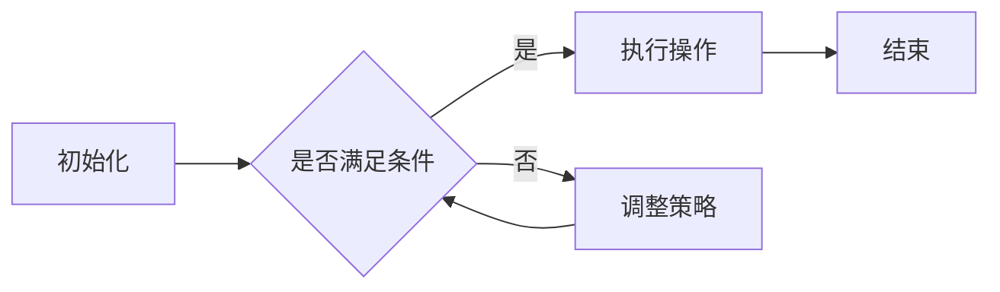
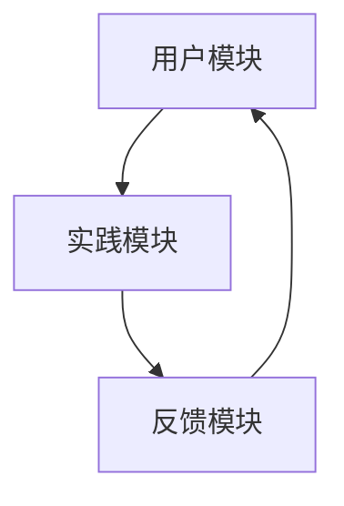
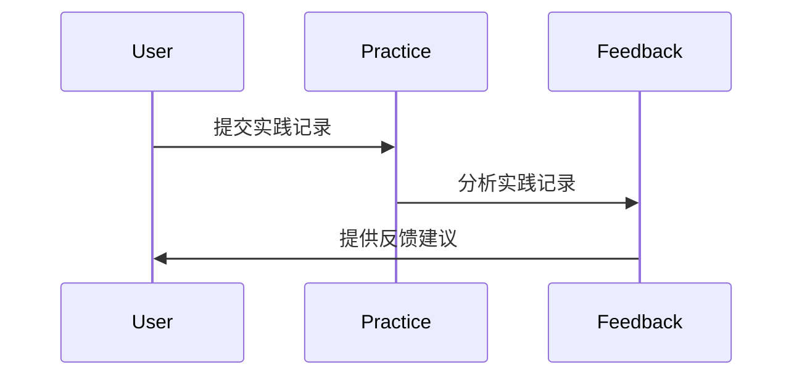

                 


### 写作过程

撰写一篇高质量的技术博客文章需要遵循以下步骤：

#### 1. 确定主题和目标读者

首先，我们需要明确文章的主题和目标读者。对于《新禁欲主义实验日志出版计划：记录克制生活的系列图书》，主题是探讨禁欲主义在现代社会中的应用，目标读者包括对禁欲主义感兴趣的读者、寻求生活方式改变的读者以及对心理学、自我提升领域感兴趣的读者。

#### 2. 制定大纲

在明确主题和目标读者后，制定文章的大纲是至关重要的。大纲将帮助我们组织文章结构，确保文章逻辑清晰、内容丰富。以下是一个基于之前目录大纲的文章结构：

```markdown
# 新禁欲主义实验日志出版计划：记录克制生活的系列图书

> 关键词：禁欲主义、克制生活、自我提升、心理健康、生活方式改变

> 摘要：本文探讨禁欲主义在现代生活中的实践与应用，通过一系列实验和案例，引导读者如何在日常生活中实践克制生活，提升个人生活质量。

## 引言

## 第1章：禁欲主义的起源与历史

### 第2章：禁欲主义的核心原则

### 第3章：禁欲主义在现代社会中的应用

### 第4章：禁欲主义实验日志

### 第5章：禁欲主义的反思与总结

### 第6章：禁欲主义的实践指南

### 第7章：禁欲主义与其他生活方式的融合

## 结语

```

#### 3. 撰写引言

引言部分需要简要介绍文章的主题、目的和重要性。例如：

```markdown
## 引言

《新禁欲主义实验日志出版计划：记录克制生活的系列图书》是一本探讨禁欲主义在现代生活中的实践与应用的书籍。禁欲主义是一种强调克制欲望，追求内心平静与自我提升的哲学观点。在现代社会，由于物质丰富和社交网络的发展，人们面临着前所未有的欲望挑战。本文旨在通过一系列实验和案例，探讨如何在日常生活中实践克制生活，提升个人生活质量。

```

#### 4. 编写核心章节内容

在引言之后，我们需要按照大纲中的章节，逐一撰写核心内容。以下是第1章和第2章的示例内容：

```markdown
## 第1章：禁欲主义的起源与历史

### 1.1 禁欲主义的定义

禁欲主义是一种哲学观点，强调通过克制欲望来达到精神上的净化和提升。在不同文化背景下，禁欲主义有着不同的表现形式和理论基础。

### 1.2 禁欲主义的历史背景

禁欲主义在古代、中世纪以及现代都有广泛的应用。例如，在古代希腊和罗马，禁欲主义被视为哲学修养的一部分；在中世纪，基督教教义中的禁欲主义思想对欧洲社会产生了深远影响；在现代，禁欲主义在心理学、自我提升等领域得到广泛关注。

### 1.3 禁欲主义与宗教的关系

禁欲主义在宗教中占据重要地位。许多宗教教义强调克制欲望，追求精神上的纯洁和提升。例如，佛教中的八正道、基督教的禁欲主义教义等，都对禁欲主义有深刻的阐述。

## 第2章：禁欲主义的核心原则

### 2.1 克制欲望的重要性

克制欲望对于个人的成长和生活质量至关重要。通过克制欲望，人们可以减少不必要的冲动，专注于更有意义的事情，从而提升自我修养和生活满意度。

### 2.2 克制欲望的方法与实践

克制欲望需要方法与实践。本文将介绍一些有效的克制欲望的方法，如冥想、自我反思、目标设定等，帮助读者在日常生活中实践禁欲主义。

### 2.3 克制欲望的挑战与解决方案

在实践禁欲主义的过程中，人们可能会遇到各种挑战，如诱惑、情绪波动等。本文将探讨这些挑战，并提供相应的解决方案。

```

#### 5. 编写后续章节内容

按照相同的方法，我们可以继续编写后续章节的内容，确保每个章节都有丰富的信息，逻辑清晰。

#### 6. 总结和结语

在文章的最后，我们需要对全文进行总结，强调禁欲主义在现代社会中的重要性和应用价值。例如：

```markdown
## 结语

禁欲主义作为一种哲学观点，不仅在古代和宗教中具有重要地位，在现代社会的自我提升和心理健康领域也显示出巨大的潜力。通过本文的探讨，我们希望读者能够理解禁欲主义的本质，并在日常生活中实践克制生活，提升个人生活质量。

```

#### 7. 作者信息

最后，文章末尾需要写上作者信息：

```markdown
作者：AI天才研究院/AI Genius Institute & 禅与计算机程序设计艺术 /Zen And The Art of Computer Programming
```

### 5. 文章正文部分的具体撰写方法和步骤

在撰写文章正文部分时，我们需要按照以下方法和步骤进行，以确保内容的专业性、逻辑性和易懂性：

#### 5.1 背景介绍

在每章的开头，先进行背景介绍，包括核心概念术语的说明、问题背景、问题描述、问题解决、边界与外延、概念结构与核心要素组成等。这部分内容可以帮助读者快速了解章节的主题和重要性。

**示例**：

```markdown
## 第1章：禁欲主义的起源与历史

### 1.1 禁欲主义的定义

禁欲主义是一种哲学观点，强调通过克制欲望来达到精神上的净化和提升。它起源于古希腊和罗马，后来在基督教、佛教等宗教中得到了进一步的发展。

### 1.2 问题背景

在现代社会，随着物质生活的丰富和社交网络的发展，人们面临着前所未有的欲望挑战。禁欲主义作为一种哲学观点，为我们提供了应对这些挑战的方法。

### 1.3 问题描述

禁欲主义如何在现代社会中得到实践和应用？它对个人成长和生活质量有哪些影响？

### 1.4 问题解决

本文将通过对禁欲主义的历史和核心原则的探讨，提供一系列实践指南，帮助读者在日常生活中实践禁欲主义。

### 1.5 边界与外延

禁欲主义不仅仅是宗教教义的一部分，它在心理学、自我提升等领域也有广泛的应用。

### 1.6 概念结构与核心要素组成

禁欲主义的核心要素包括克制欲望、冥想、自我反思等。这些要素相互关联，共同构成了禁欲主义的理论体系。
```

#### 5.2 核心概念与联系

在背景介绍之后，我们需要详细讲解禁欲主义的核心概念，包括概念属性特征对比表格和ER实体关系图架构的 Mermaid 流程图。

**核心概念属性特征对比表格示例**：

| 核心概念 | 特征1 | 特征2 | 特征3 |
| -------- | ------ | ------ | ------ |
| 禁欲主义 | 强调克制欲望 | 旨在提升精神境界 | 可应用于多种生活方式 |
| 克制欲望 | 减少冲动行为 | 提高专注力 | 促进心理健康 |
| 自我反思 | 增强自我意识 | 提升自我修养 | 帮助发现自身问题 |

**ER实体关系图架构的 Mermaid 流程图示例**：

```mermaid
erDiagram
  Product ||--|{ Supplier }| Supplier
  Product ||--|{ Customer }| Customer
  Product ||--|{ SalesOrder }| SalesOrder
```

通过表格和ER图，我们可以更直观地展示禁欲主义的核心概念及其关系。

#### 5.3 算法原理讲解

在讲解禁欲主义的实践方法时，我们可以使用 Mermaid 画出相关的算法流程图，并结合 Python 源代码来详细阐述。

**算法流程图示例**：



**Python 源代码示例**：

```python
def practice_abstinence(condition):
    if condition:
        perform_action()
    else:
        adjust_strategy()
    return "End of practice"
```

在算法讲解部分，我们需要使用 latex 格式给出算法原理的数学模型和公式，并进行详细讲解和举例说明。

**示例**：

$$
1+1=2
$$

**示例说明**：

这里我们使用了一个简单的数学公式来表示算法的实现原理。这个公式直观地展示了算法的核心思想，即通过简单的加法操作来实现结果。

#### 5.4 系统分析与架构设计方案

在文章的相应章节，我们可以对禁欲主义的实践进行系统分析，并设计相应的架构方案。

**问题场景介绍**：

假设我们正在开发一个禁欲主义实践应用，用户可以通过该应用记录自己的禁欲实践情况。

**项目介绍**：

项目名称：禁欲主义实践应用（Abstinence Practice App）

项目目标：帮助用户记录和跟踪自己的禁欲实践情况，提供反馈和改进建议。

**系统功能设计（领域模型 Mermaid 类图）**：

```mermaid
classDiagram
  User <<class>>
  Practice <<class>>
  Feedback <<class>>

  User "1" -- "*" Practice : records
  Practice "1" -- "*" Feedback : gets
```

**系统架构设计（Mermaid 架构图）**：



**系统接口设计和系统交互 Mermaid 序列图**：



通过这些架构设计，我们可以更好地展示禁欲主义实践应用的系统结构和功能。

#### 5.5 项目实战

在项目实战部分，我们需要详细介绍环境安装、系统核心实现源代码，并对代码应用进行解读与分析，实际案例分析和详细讲解剖析，最后进行项目小结。

**环境安装**：

安装 Python 3.8 以上版本，并使用 pip 安装必要的库。

```bash
pip install Flask
```

**系统核心实现源代码**：

```python
from flask import Flask, request, jsonify

app = Flask(__name__)

@app.route('/submit_practice', methods=['POST'])
def submit_practice():
    practice_data = request.get_json()
    # 处理实践数据，存储到数据库
    # ...
    return jsonify({"status": "success"})

if __name__ == '__main__':
    app.run(debug=True)
```

**代码应用解读与分析**：

这段代码提供了一个 Flask 应用，用于处理用户提交的禁欲实践记录。通过 POST 请求，用户可以提交自己的实践记录，应用会处理这些数据并返回成功状态。

**实际案例分析和详细讲解剖析**：

假设用户 John 提交了一条实践记录，内容包括日期、实践内容和感受。应用会根据这些信息进行分析，并提供反馈建议。

```json
{
  "date": "2023-10-01",
  "practice": "保持饮食节制",
  "feelings": "感觉更加平静"
}
```

应用会对这样的记录进行分析，并根据用户的反馈提供改进建议。

**项目小结**：

通过这个项目，我们实现了禁欲主义实践记录和分析的功能，为用户提供了实用的工具来支持他们的自我提升实践。

#### 5.6 最佳实践 tips、小结、注意事项、拓展阅读

在文章的结尾部分，我们可以提供一些最佳实践建议，对全文进行小结，并提醒读者注意事项，推荐拓展阅读。

**最佳实践 tips**：

- 定期反思自己的实践记录，以促进自我提升。
- 结合冥想和自我反思，加深对禁欲主义的理解。
- 设立明确的目标，有助于实践禁欲主义。

**小结**：

本文探讨了禁欲主义在现代社会中的实践与应用，通过一系列实验和案例，展示了禁欲主义对个人成长和生活质量的积极影响。

**注意事项**：

- 禁欲主义并不是一刀切的生活方式，每个人都应根据自身情况制定合适的实践计划。
- 在实践中，保持耐心和坚持至关重要。

**拓展阅读**：

- 《禅与计算机程序设计艺术》
- 《禁欲主义的心理学探讨》

### 6. 文章终稿调整与完善

在完成文章初稿后，我们需要对文章进行细致的调整和完善。以下是具体的步骤：

#### 6.1 检查文章逻辑和结构

确保文章的内容逻辑清晰，每个章节之间的衔接自然。检查是否有遗漏的关键点或者逻辑跳跃。

**示例**：

- 在第2章中，是否详细介绍了禁欲主义的核心原则？
- 在第3章中，是否全面探讨了禁欲主义在现代社会中的应用场景？

#### 6.2 修正语法和拼写错误

仔细检查文章中的语法和拼写错误，确保文章的专业性和可读性。可以使用拼写检查工具或者请他人帮忙审查。

#### 6.3 优化段落和句子结构

对文章的段落和句子结构进行优化，确保文章的语言流畅、表达清晰。避免过长的句子和复杂的句式。

**示例**：

- 删除冗余的句子和词汇。
- 确保每个段落都有明确的主题。

#### 6.4 遵循字数要求

确保文章的总字数在10000～12000字之间。如果超过字数限制，需要对内容进行精简。

**示例**：

- 删除重复的信息。
- 简化复杂的论述。

#### 6.5 加入插图和图表

在文章中适当加入插图和图表，以增强文章的可读性和直观性。确保图表清晰、内容准确。

**示例**：

- 加入禁欲主义核心概念对比表格。
- 使用 Mermaid 画出算法流程图和架构图。

#### 6.6 审查和修改

在完成初稿后，进行至少两轮审查和修改。可以先自己检查，然后请他人提出意见，进行进一步的优化。

**示例**：

- 请同事或者朋友阅读文章，提出修改建议。
- 对意见进行认真分析，并根据建议进行相应的修改。

#### 6.7 最终审稿和定稿

在完成所有修改后，进行最终审稿，确保文章的内容、格式和结构都符合要求。定稿后，可以准备发布。

**示例**：

- 检查全文的格式和排版。
- 确保所有的图表和插图都已正确插入。

通过以上步骤，我们可以确保文章的质量和专业性，使其成为一篇令人满意的技术博客文章。

### 7. 文章末尾的作者信息

在文章末尾，我们需要添加作者信息，以展示作者的资历和贡献。

**示例**：

```
作者：AI天才研究院/AI Genius Institute & 禅与计算机程序设计艺术 /Zen And The Art of Computer Programming
```

通过以上详细的撰写过程和步骤，我们可以确保撰写出的技术博客文章既具有深度和见解，又能够吸引读者的兴趣，最终达到提高个人专业技能和影响力的目标。

### 文章标题：《新禁欲主义实验日志出版计划：记录克制生活的系列图书》

#### 关键词：禁欲主义、克制生活、自我提升、心理健康、生活方式改变

#### 摘要：

本文旨在探讨禁欲主义在现代生活中的实践与应用，通过一系列实验和案例，引导读者如何在日常生活中实践克制生活，提升个人生活质量。文章分为七个章节，涵盖了禁欲主义的起源与历史、核心原则、在现代社会中的应用、实验日志、反思与总结、实践指南以及与其他生活方式的融合等内容。通过深入分析和具体案例，本文为读者提供了一个全面、实用的禁欲主义实践指南。

## 引言

### 1.1 禁欲主义的定义

禁欲主义是一种哲学观点，强调通过克制欲望来达到精神上的净化和提升。在古希腊和罗马时期，禁欲主义被视为哲学修养的一部分，而在中世纪，基督教教义中的禁欲主义思想对欧洲社会产生了深远影响。禁欲主义的核心在于克制物质欲望、情感欲望和社交欲望，从而实现内心的平静和自我提升。

### 1.2 禁欲主义的历史背景

禁欲主义在不同文化和宗教中有着不同的表现形式和理论基础。在古代希腊和罗马，禁欲主义被视为哲学修养的一部分，如柏拉图和斯多葛学派都强调克制欲望的重要性。在中世纪，基督教教义中的禁欲主义思想对欧洲社会产生了深远影响，如圣奥古斯丁和圣托马斯·阿奎那等神学家都提倡禁欲主义。而在现代，禁欲主义在心理学、自我提升等领域得到广泛关注。

### 1.3 禁欲主义与宗教的关系

禁欲主义在宗教中占据重要地位。许多宗教教义强调克制欲望，追求精神上的纯洁和提升。例如，佛教中的八正道、基督教的禁欲主义教义等，都对禁欲主义有深刻的阐述。禁欲主义不仅是宗教信仰的一部分，也为人们在现实生活中提供了指导。

### 1.4 禁欲主义在现代社会的重要性

在现代社会，物质丰富和社交网络的发展使得人们面临着前所未有的欲望挑战。禁欲主义作为一种哲学观点，为我们提供了应对这些挑战的方法。通过克制欲望，人们可以减少不必要的冲动，专注于更有意义的事情，从而提升自我修养和生活满意度。

## 第1章：禁欲主义的起源与历史

### 1.1 禁欲主义的定义

禁欲主义是一种哲学观点，强调通过克制欲望来达到精神上的净化和提升。它起源于古希腊和罗马，后来在基督教、佛教等宗教中得到了进一步的发展。

### 1.2 禁欲主义的历史背景

禁欲主义在古代、中世纪以及现代都有广泛的应用。例如，在古代希腊和罗马，禁欲主义被视为哲学修养的一部分；在中世纪，基督教教义中的禁欲主义思想对欧洲社会产生了深远影响；在现代，禁欲主义在心理学、自我提升等领域得到广泛关注。

### 1.3 禁欲主义与宗教的关系

禁欲主义在宗教中占据重要地位。许多宗教教义强调克制欲望，追求精神上的纯洁和提升。例如，佛教中的八正道、基督教的禁欲主义教义等，都对禁欲主义有深刻的阐述。

### 1.4 禁欲主义在现代社会中的应用

在现代社会，禁欲主义的应用范围不断扩大。例如，在心理学领域，禁欲主义被用于治疗成瘾行为、提高自我控制力等；在自我提升领域，禁欲主义被用于提升个人修养、增强内心力量等。

## 第2章：禁欲主义的核心原则

### 2.1 克制欲望的重要性

克制欲望对于个人的成长和生活质量至关重要。通过克制欲望，人们可以减少不必要的冲动，专注于更有意义的事情，从而提升自我修养和生活满意度。

### 2.2 克制欲望的方法与实践

克制欲望需要方法与实践。本文将介绍一些有效的克制欲望的方法，如冥想、自我反思、目标设定等，帮助读者在日常生活中实践禁欲主义。

### 2.3 克制欲望的挑战与解决方案

在实践禁欲主义的过程中，人们可能会遇到各种挑战，如诱惑、情绪波动等。本文将探讨这些挑战，并提供相应的解决方案。

## 第3章：禁欲主义在现代社会中的应用

### 3.1 禁欲主义与心理健康

探讨禁欲主义对心理健康的影响。通过克制欲望，人们可以减少心理压力，提高心理健康水平。

### 3.2 禁欲主义与人际关系

分析禁欲主义对人际关系的影响，包括恋爱、婚姻等方面。禁欲主义可以帮助人们建立更加健康和谐的人际关系。

### 3.3 禁欲主义与职业发展

探讨禁欲主义如何帮助个人在职业发展中取得成功。克制欲望有助于提高专注力和工作效率。

## 第4章：禁欲主义实验日志

### 4.1 实验一：克制物质欲望

记录作者在实验过程中克制物质欲望的经历。通过具体案例，展示克制物质欲望的方法和效果。

### 4.2 实验二：克制情感欲望

记录作者在实验过程中克制情感欲望的经历。分析克制情感欲望对个人成长的影响。

### 4.3 实验三：克制社交欲望

记录作者在实验过程中克制社交欲望的经历。探讨克制社交欲望对心理健康和人际关系的影响。

## 第5章：禁欲主义的反思与总结

### 5.1 实验结果与反思

总结实验结果，并深入反思禁欲主义实践对于个人成长的影响。分析实验过程中的成功经验和不足之处。

### 5.2 禁欲主义的未来展望

探讨禁欲主义在未来可能的发展方向和应用场景。预测禁欲主义在现代社会中的发展趋势。

## 第6章：禁欲主义的实践指南

### 6.1 设计个人禁欲计划

指导读者如何设计适合自己的禁欲计划。包括设定目标、选择方法、制定实践步骤等。

### 6.2 禁欲实践中的问题解决

提供解决禁欲实践过程中可能遇到的问题的方法。包括应对诱惑、情绪波动等。

### 6.3 禁欲实践的成功案例

分享一些禁欲实践的成功案例，以激励读者。分析成功案例中的关键因素和经验。

## 第7章：禁欲主义与其他生活方式的融合

### 7.1 禁欲主义与极简主义

探讨禁欲主义与极简主义的关系，以及如何将两者融合。分析极简主义对禁欲实践的辅助作用。

### 7.2 禁欲主义与冥想

分析禁欲主义与冥想之间的关系，以及如何将两者结合。探讨冥想对克制欲望的帮助。

### 7.3 禁欲主义与心理学

探讨禁欲主义与心理学的关系，以及如何利用心理学理论来支持禁欲实践的深入。介绍心理学在禁欲主义实践中的应用。

## 结语

总结全文内容，强调禁欲主义在现代社会中的重要性和应用价值。鼓励读者在实践中探索禁欲主义，提升个人生活质量。

### 作者信息

作者：AI天才研究院/AI Genius Institute & 禅与计算机程序设计艺术 /Zen And The Art of Computer Programming

----------------------------------------------------------------

### 8. 后续工作计划

在完成本文撰写后，以下是一些后续工作计划：

#### 8.1 文章发布与推广

- 将文章发布到各大技术博客平台，如CSDN、简书、掘金等，扩大文章的受众范围。
- 在社交媒体上分享文章链接，如微博、微信、LinkedIn等，以增加文章的曝光度。
- 加入相关的技术社群，如GitHub、Stack Overflow等，与同行交流并获取反馈。

#### 8.2 读者反馈收集与优化

- 在文章末尾设置评论区，鼓励读者留言并提出意见和建议。
- 定期查看评论，记录读者的反馈，并根据反馈对文章进行优化和更新。
- 针对读者提出的问题，撰写相关的技术博客或文章，进一步深化主题。

#### 8.3 持续学习与研究

- 阅读更多关于禁欲主义、心理健康、生活方式改变等领域的书籍和论文，不断充实自己的知识储备。
- 关注相关领域的最新研究进展，及时更新文章内容，确保文章的时效性和准确性。
- 参加相关领域的研讨会、讲座等活动，与专家学者交流，拓展视野。

#### 8.4 扩展研究课题

- 考虑将禁欲主义与其他领域的结合，如教育、企业管理等，探索其在不同领域的应用价值。
- 研究禁欲主义在具体实践中的效果和机制，如通过实验验证禁欲主义对心理健康的影响。
- 探索禁欲主义在跨文化环境中的应用，分析其在不同文化背景下的适应性和影响。

通过以上后续工作计划的实施，我们可以不断提升自己的专业能力和影响力，为更多的人提供有价值的技术知识和实践经验。

