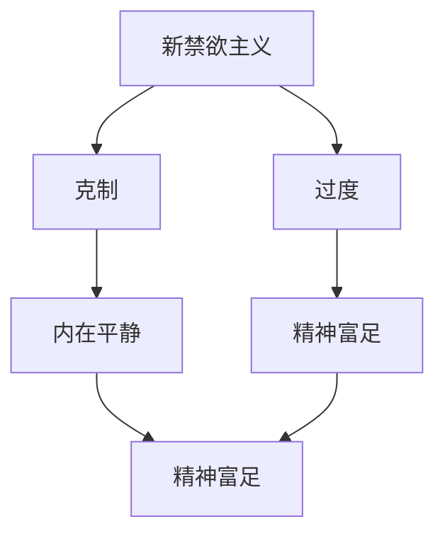

                 

# 新禁欲主义：在过度中寻找克制的意义

## 关键词：新禁欲主义、过度、克制、个人成长、社会影响

### 摘要：本文探讨了新禁欲主义的理念及其在当代社会中的重要性。通过对过度现象的分析，提出了克制的必要性。文章从哲学与心理学角度深入探讨了新禁欲主义的内涵，并分析了其在个人与社会层面的实际应用，最后给出了实践指南和未来研究方向。

## 引言

在当今社会，过度消费、过度娱乐、过度工作等现象普遍存在，这些过度行为不仅对个人的身心健康造成了负面影响，也对社会风气产生了不良影响。为了寻找解决问题的方法，新禁欲主义应运而生。本文将探讨新禁欲主义的理念，分析其背后的哲学与心理学基础，并通过案例和实践指南，阐述如何在实际生活中应用新禁欲主义。

### 1.1 新禁欲主义概览

新禁欲主义（Neo-Puritanism）是一个相对较新的概念，起源于20世纪末。它主张通过克制物质欲望和精神需求，追求内在的平静与精神富足。与传统禁欲主义不同，新禁欲主义不强调对欲望的彻底压制，而是提倡合理节制，寻求在过度中的平衡。

### 1.2 背景介绍

1.2.1 新禁欲主义的起源与发展

新禁欲主义起源于对现代社会过度消费和物质主义的反思。20世纪末，随着科技的进步和经济的快速发展，人们逐渐陷入物质享受的泥潭。新禁欲主义认为，这种过度追求物质满足的生活方式导致了一系列社会问题，如环境污染、社会不公和心理健康问题。因此，它提倡通过节制物质欲望，追求精神层面的富足。

1.2.2 过度现象及其影响

过度现象包括过度消费、过度娱乐、过度工作等。这些现象不仅对个人的身心健康造成了负面影响，还对社会风气产生了不良影响。例如，过度消费导致资源浪费和环境恶化，过度娱乐导致人际关系的疏离，过度工作导致心理健康问题。

1.2.3 克制的必要性与意义

在过度中寻找克制的意义，首先体现在个人层面。克制能够帮助个人摆脱物质欲望的束缚，实现内心的平静与精神富足。此外，在社会层面，克制有助于减少资源浪费，促进社会公平，改善社会风气。

## 核心概念解析

### 2.1 新禁欲主义：理论与实践

2.1.1 新禁欲主义的核心概念

新禁欲主义的核心概念包括克制、内在平静和精神富足。克制是指通过自我控制，避免过度追求物质和精神满足。内在平静是指内心的平和与宁静，不受外界干扰。精神富足是指追求精神层面的满足，而非物质层面的享受。

2.1.2 新禁欲主义的理论基础

新禁欲主义的理论基础包括心理学、哲学和宗教。在心理学领域，自我调节理论和情绪调节理论支持了新禁欲主义的理念。在哲学领域，道德哲学和伦理学为新禁欲主义提供了理论基础。在宗教领域，许多宗教教义也强调了克制和内在平静的重要性。

2.1.3 新禁欲主义与旧禁欲主义的区别

新禁欲主义与旧禁欲主义在目标和手段上存在明显区别。旧禁欲主义强调对欲望的彻底压制，追求精神上的纯净。而新禁欲主义则强调合理节制，追求在过度中的平衡。新禁欲主义认为，完全压制欲望可能会导致心理问题和精神贫乏，因此更注重内在的平和与精神富足。

### 2.2 过度与克制：比较与联系

2.2.1 过度的定义与特征

过度是指对物质和精神需求的过度追求，导致个人和社会的负面影响。过度的特征包括：无节制、依赖、压力、不满等。

2.2.2 克制的定义与特征

克制是指通过自我控制，避免过度追求物质和精神满足。克制的特征包括：理性、自我调节、平和、自律等。

2.2.3 过度与克制的关联

过度与克制是相互关联的。过度行为可能导致克制能力的减弱，而克制能力不足则可能导致过度行为。因此，新禁欲主义提倡通过克制来避免过度，实现内心的平衡。

### 2.3 概念关系图

为了更好地理解新禁欲主义、过度和克制的概念关系，可以使用Mermaid流程图来展示：

## 新禁欲主义的哲学与心理学基础

### 3.1 新禁欲主义的哲学思考

3.1.1 自我控制与道德哲学

新禁欲主义强调自我控制，这与道德哲学中的自律观念密切相关。道德哲学认为，个体应该通过自我控制来实现道德上的完善。新禁欲主义进一步发展了这一观念，认为自我控制不仅是为了道德上的完善，更是为了实现内心的平和与精神富足。

3.1.2 节欲与心灵净化

节欲是新禁欲主义的核心概念之一。它主张通过节制物质和精神需求，实现心灵净化。心灵净化有助于提高个体的精神境界，增强内心的力量，从而更好地应对生活中的挑战。

3.1.3 自我超越与个人成长

自我超越是新禁欲主义追求的目标之一。通过自我超越，个体可以突破自我限制，实现个人成长。自我超越不仅有助于提升个体的心理素质，还能促进社会进步。

### 3.2 新禁欲主义的心理学视角

3.2.1 自我调节心理学

自我调节心理学研究个体如何通过自我控制来实现目标。新禁欲主义认为，自我调节是实现内心平静与精神富足的关键。通过自我调节，个体可以更好地管理情绪，提高生活质量。

3.2.2 压力与应对机制

新禁欲主义认为，压力是过度行为的根源之一。为了应对压力，个体需要建立有效的应对机制。自我调节和心理调适是应对压力的重要手段。通过克制和自我超越，个体可以减轻压力，提高心理韧性。

3.2.3 独立性与依赖性

新禁欲主义强调个体独立性，反对过度依赖。独立性有助于个体实现自我价值，提高生活满意度。然而，独立性并不意味着完全孤立。新禁欲主义提倡在独立性的基础上，建立健康的人际关系。

## 案例分析

### 4.1 新禁欲主义在个人生活中的应用

4.1.1 案例一：自我管理

李明是一位年轻的企业家，他在创业过程中经历了巨大的压力。为了应对压力，他开始实践新禁欲主义。通过克制物质欲望和精神需求，他逐渐找到了内心的平静。他学会了合理安排时间，提高工作效率，从而减轻了工作压力。同时，他还注重锻炼身体，保持良好的生活习惯，从而提升了身心健康。

4.1.2 案例二：情感管理

张婷是一位情感丰富的女性，她经常因为情绪波动而感到困扰。为了管理情感，她开始学习新禁欲主义。通过克制情感需求，她学会了理性看待问题，避免了冲动决策。她逐渐学会了在情感波动的时刻保持冷静，从而提高了情绪调节能力。

4.1.3 案例三：职业规划

王强是一名年轻的工程师，他在职业发展过程中面临了许多选择。为了做出明智的决策，他开始实践新禁欲主义。通过克制物质欲望和精神需求，他能够更加清晰地分析自己的职业方向和目标。他学会了理性评估机会和风险，从而做出了更加合适的职业选择。

### 4.2 新禁欲主义在社会层面的应用

4.2.1 社会运动与政治倡导

新禁欲主义在社会运动和政治倡导中发挥了重要作用。例如，环保运动中的参与者通过克制物质消费，倡导可持续生活方式。政治倡导者通过强调道德自律和社会责任，推动社会公平和进步。

4.2.2 文化产业的影响

文化产业中的创作者和实践者也开始关注新禁欲主义。他们通过克制物质欲望和精神需求，追求艺术创作的高质量和高境界。这种创作风格不仅提升了作品的艺术价值，还引导了社会风气。

4.2.3 教育与实践

教育机构和实践者也开始推广新禁欲主义。他们通过课程设置和实践项目，帮助人们理解和应用新禁欲主义。这种教育方式不仅有助于提高个体的心理素质，还能促进社会风气的改善。

## 社会影响与挑战

### 5.1 新禁欲主义的社会影响

5.1.1 对个人幸福的影响

新禁欲主义强调克制和内在平静，有助于提高个人的幸福感。通过克制物质欲望和精神需求，个体能够更好地管理情绪，减少焦虑和压力，从而提高生活质量。

5.1.2 对社会风气的影响

新禁欲主义提倡合理节制，有助于减少资源浪费和社会不公。通过克制物质欲望，个体能够更加关注社会公益和环保，从而推动社会进步。

5.1.3 对经济发展的潜在影响

新禁欲主义可能对经济发展产生一定影响。通过克制物质欲望，个体能够更加专注于精神追求和内在成长，从而提高个人的创造力和创新能力。这有助于推动经济发展和社会进步。

### 5.2 新禁欲主义的挑战与争议

5.2.1 价值观的冲突

新禁欲主义强调克制和内在平静，与传统价值观中的追求物质满足存在冲突。这种冲突可能导致新禁欲主义在社会中受到质疑和抵制。

5.2.2 实践的难度

新禁欲主义的实践难度较大。克制物质欲望和精神需求需要个体具备较高的自我控制能力。这对于很多人来说是一项艰巨的任务，可能导致实践过程中出现挫折和失败。

5.2.3 道德与伦理的界限

新禁欲主义在道德和伦理方面存在一定的争议。如何界定克制与放纵的界限，如何平衡个人利益与社会利益，是实践新禁欲主义时需要解决的问题。

## 实践指南

### 6.1 个人修养与实践

6.1.1 自我反思与自我认知

个人修养的首要步骤是自我反思和自我认知。通过反思自己的行为和思想，个体可以更好地了解自己的需求和欲望，从而找到克制的方法。

6.1.2 习惯养成与目标设定

习惯养成和目标设定是实践新禁欲主义的重要环节。个体应该通过制定明确的目标和培养良好的习惯，逐步实现内心的平和与精神富足。

6.1.3 情感管理与压力调节

情感管理和压力调节是个人修养的重要组成部分。通过学习情绪调节技巧和压力管理策略，个体可以更好地应对生活中的挑战。

### 6.2 生活方式的改变

6.2.1 健康生活与饮食习惯

健康生活和饮食习惯对于实践新禁欲主义至关重要。个体应该注重锻炼身体，保持良好的饮食习惯，从而提高身心健康。

6.2.2 社交与人际关系

社交和人际关系是个人生活中不可或缺的部分。个体应该通过建立健康的人际关系，获得情感支持和心理满足。

6.2.3 工作与生活平衡

工作与生活平衡是实现新禁欲主义的重要一环。个体应该合理安排工作时间，确保工作与生活的平衡，从而减轻工作压力。

## 结论与展望

新禁欲主义作为一种追求内心平静与精神富足的生活方式，具有重要的现实意义。通过对过度现象的分析和克制的实践，个体可以实现内心的平和，提高生活质量。同时，新禁欲主义也对社会风气和经济发展产生了积极影响。未来，随着社会的不断发展，新禁欲主义有望成为更多人追求的生活方式。

### 作者信息

作者：AI天才研究院/AI Genius Institute & 禅与计算机程序设计艺术 /Zen And The Art of Computer Programming

---

### 附录：术语解释

- **新禁欲主义**：一种追求内心平静与精神富足的生活方式，强调克制物质欲望和精神需求。
- **过度**：对物质和精神需求的过度追求，导致个人和社会的负面影响。
- **克制**：通过自我控制，避免过度追求物质和精神满足。
- **内在平静**：内心的平和与宁静，不受外界干扰。
- **精神富足**：追求精神层面的满足，而非物质层面的享受。

---

### 拓展阅读

- **《简朴生活：幸福之路》**：作者蒂姆·费里斯探讨了如何通过简朴生活实现幸福。
- **《道德经》**：中国古代哲学家老子所著的哲学著作，其中包含了许多关于自我控制和内心平静的智慧。
- **《自控力》**：作者凯利·麦格尼格尔探讨了如何通过自我调节提高自控力，实现个人成长。

---

通过本文的逐步分析，我们希望能够帮助读者更好地理解新禁欲主义的理念，并在实际生活中应用这些理念，实现内心的平和与精神富足。让我们在过度中寻找克制的意义，追求更高质量的生活。

