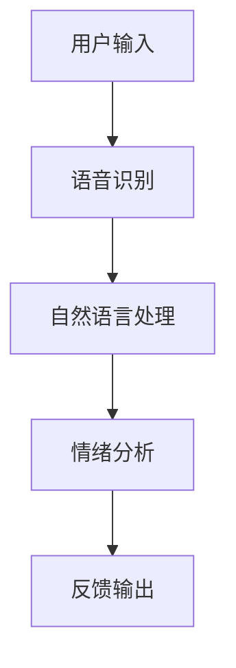
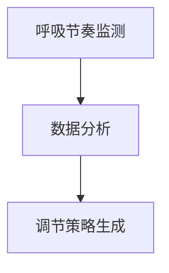
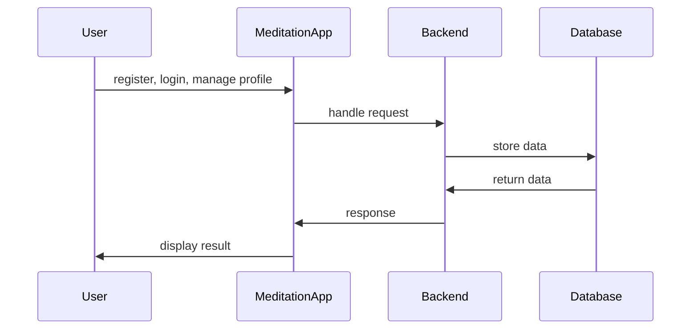
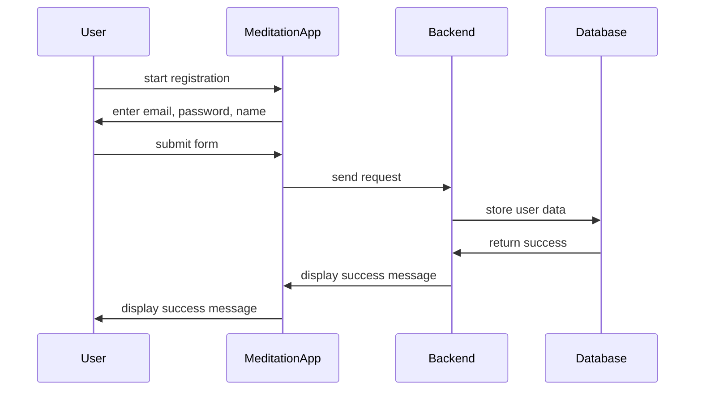

                 

### 第1章：禅修App开发者社区背景

#### 1.1 禅修与数字工具的融合

##### 1.1.1 禅修的定义与历史背景

###### 1.1.1.1 禅修的定义
禅修，又称静坐、冥想，是一种通过专注、内观、呼吸调节等方式，以达到身心平静和心灵成长的技术。它起源于古印度，随着佛教的传播，逐渐形成了各种禅修流派和传统。

###### 1.1.1.2 禅修的历史背景
禅修在古代印度被视为一种重要的修行方式，佛教传入中国后，禅修成为佛教修行的重要手段。随着时代的发展，禅修逐渐传播到世界各地，形成了不同的禅修传统和流派。

##### 1.1.2 数字工具在禅修中的应用

###### 1.1.2.1 数字工具的优势
数字工具在禅修中的应用，使得禅修者能够更加便捷地进行修行。数字工具提供了个性化、数据记录和分析等功能，帮助禅修者更好地了解自己的修行进展。

###### 1.1.2.2 现状与挑战
目前，市场上存在多种禅修App，但大多数功能较为基础，用户体验和个性化需求仍有待提高。同时，如何确保数字工具与禅修本质相契合，也是开发者需要考虑的问题。

#### 1.2 开发者社区的重要性

##### 1.2.1 开发者社区的定义与作用
开发者社区是开发者之间的交流平台，旨在分享知识、解决技术难题、推动技术发展。通过开发者社区，开发者可以交流经验、分享最佳实践，共同推动禅修App的创新和发展。

##### 1.2.2 开发者社区在禅修App开发中的应用
开发者社区可以为禅修App开发者提供技术支持、经验分享、用户反馈等，帮助开发者更好地理解用户需求，优化产品功能，提高用户体验。

### 第2章：禅修App的核心功能与设计原则

#### 2.1 核心功能

##### 2.1.1 冥想引导

###### 2.1.1.1 冥想引导的内容与形式
冥想引导是禅修App的核心功能之一。它包括音频、视频和文字内容，旨在帮助用户更好地进入冥想状态。

###### 2.1.1.2 冥想引导的音频、视频与文字内容设计
音频和视频内容可以采用专业的冥想指导师进行录制，文字内容则可以根据用户的需求进行个性化调整。

##### 2.1.2 呼吸调节

###### 2.1.2.1 呼吸调节的方法与技术
呼吸调节是禅修的重要组成部分。禅修App可以通过监测用户的呼吸节奏，提供相应的调节指导。

###### 2.1.2.2 呼吸节奏监测与调整
禅修App可以通过内置的传感器或第三方设备，实时监测用户的呼吸节奏，并根据用户的需求进行相应的调整。

##### 2.1.3 身心状态监测

###### 2.1.3.1 心率、血压等生理指标监测
禅修App可以监测用户的心率、血压等生理指标，为用户提供更全面的身心状态分析。

###### 2.1.3.2 心理状态评估与分析
通过结合生理数据和用户的行为数据，禅修App可以对用户的心理状态进行评估和分析。

##### 2.1.4 个性化定制

###### 2.1.4.1 用户资料与偏好设置
禅修App可以根据用户的资料和偏好，提供个性化的冥想引导、呼吸调节和心理状态分析。

###### 2.1.4.2 程序自动推荐与调整
禅修App可以根据用户的反馈和数据分析，自动推荐适合用户的冥想内容和调节策略。

#### 2.2 设计原则

##### 2.2.1 易用性

###### 2.2.1.1 界面设计简洁清晰
禅修App的界面设计应简洁明了，帮助用户快速上手。

###### 2.2.1.2 操作流程简便快捷
禅修App的操作流程应简便快捷，避免用户在使用过程中产生困惑。

##### 2.2.2 个性化

###### 2.2.2.1 用户资料收集与数据分析
禅修App应收集用户的资料和偏好，通过数据分析，为用户提供个性化的服务。

###### 2.2.2.2 根据用户需求提供个性化服务
禅修App应根据用户的反馈和需求，提供个性化的冥想内容和调节策略。

##### 2.2.3 互动性

###### 2.2.3.1 用户互动社区功能
禅修App可以设置用户互动社区功能，让用户之间可以交流、讨论和分享。

###### 2.2.3.2 交流、讨论、分享与支持
通过用户互动社区，用户可以相互交流禅修经验，讨论问题，分享心得，得到支持和帮助。

### 第3章：禅修App开发技术基础

#### 3.1 开发环境与工具

##### 3.1.1 开发环境搭建

###### 3.1.1.1 操作系统
禅修App的开发环境可以基于Windows、MacOS或Linux操作系统。

###### 3.1.1.2 编程语言
禅修App的开发可以使用多种编程语言，如Python、Java、JavaScript等。

###### 3.1.1.3 开发工具
禅修App的开发工具包括代码编辑器（如Visual Studio Code、Sublime Text等）和集成开发环境（如PyCharm、Eclipse等）。

##### 3.1.2 常用技术栈

###### 3.1.2.1 Web前端技术
Web前端技术包括HTML、CSS和JavaScript，用于构建禅修App的用户界面。

###### 3.1.2.2 后端技术
后端技术包括服务器端编程语言（如Python、Java、Node.js等）和数据库（如MySQL、MongoDB等），用于处理数据和用户请求。

###### 3.1.2.3 移动端开发技术
移动端开发技术包括原生开发（如iOS的Swift、Android的Kotlin）和跨平台开发框架（如React Native、Flutter等）。

#### 3.2 数据处理与存储

##### 3.2.1 数据处理技术

###### 3.2.1.1 数据清洗与预处理
数据清洗与预处理是数据处理的第一步，包括去除重复数据、填补缺失值、标准化数据等。

###### 3.2.1.2 数据分析与应用
数据分析与应用包括数据可视化、机器学习、统计分析等方法，用于从数据中提取有价值的信息。

##### 3.2.2 数据存储技术

###### 3.2.2.1 关系型数据库
关系型数据库（如MySQL、PostgreSQL）适用于结构化数据的存储和管理。

###### 3.2.2.2 非关系型数据库
非关系型数据库（如MongoDB、Cassandra）适用于大规模数据存储和实时数据处理。

###### 3.2.2.3 数据仓库与大数据处理
数据仓库（如Hadoop、Spark）适用于大规模数据的存储和处理。

### 第4章：禅修App界面设计与用户体验

#### 4.1 界面设计原则

##### 4.1.1 简洁明了

###### 4.1.1.1 界面布局合理
禅修App的界面布局应合理，使用户能够快速找到所需功能。

###### 4.1.1.2 信息展示清晰
禅修App的信息展示应清晰，避免用户在阅读时产生困惑。

##### 4.1.2 个性化定制

###### 4.1.2.1 用户偏好设置
禅修App应允许用户设置个人偏好，如字体大小、颜色主题等。

###### 4.1.2.2 界面风格自定义
禅修App应提供多种界面风格供用户选择，满足不同用户的个性化需求。

##### 4.1.3 交互设计

###### 4.1.3.1 界面响应速度
禅修App的界面响应速度应快，确保用户在使用过程中不会感到延迟。

###### 4.1.3.2 用户操作反馈
禅修App应在用户进行操作时提供及时的反馈，让用户知道操作是否成功。

#### 4.2 用户体验优化

##### 4.2.1 用户调研

###### 4.2.1.1 用户需求分析
通过对用户的调研，分析用户的需求，以便为用户提供更好的服务。

###### 4.2.1.2 用户行为分析
通过分析用户的行为数据，了解用户的使用习惯，为用户体验优化提供依据。

##### 4.2.2 用户体验测试

###### 4.2.2.1 功能测试
在开发过程中，对禅修App的功能进行测试，确保功能的正确性和稳定性。

###### 4.2.2.2 性能测试
对禅修App的性能进行测试，确保在用户使用过程中，系统能够稳定运行。

###### 4.2.2.3 安全测试
对禅修App进行安全测试，确保用户数据的安全性和隐私保护。

### 第5章：禅修App核心技术实现

#### 5.1 冥想引导算法

##### 5.1.1 算法原理

###### 5.1.1.1 冥想引导算法的基本流程
冥想引导算法的基本流程包括：用户输入、算法处理、反馈输出。

###### 5.1.1.2 冥想引导算法的核心技术
冥想引导算法的核心技术包括语音识别、自然语言处理和情绪分析等。

##### 5.1.2 算法实现

###### 5.1.2.1 冥想引导算法流程图


###### 5.1.2.2 冥想引导算法Python源代码
```python
import speech_recognition as sr
import nltk
from textblob import TextBlob

# 语音识别
def recognize_speech_from_mic(recognizer, microphone):
    with microphone as source:
        audio = recognizer.listen(source)

    try:
        return recognizer.recognize_google(audio)
    except sr.UnknownValueError:
        return "无法理解音频内容"
    except sr.RequestError:
        return "无法请求语音识别服务"

# 自然语言处理
def process_text(text):
    blob = TextBlob(text)
    return blob.sentiment

# 情绪分析
def analyze_mood(sentiment):
    if sentiment.polarity > 0:
        return "积极"
    elif sentiment.polarity < 0:
        return "消极"
    else:
        return "中性"

# 主函数
def main():
    recognizer = sr.Recognizer()
    microphone = sr.Microphone()

    user_input = recognize_speech_from_mic(recognizer, microphone)
    print("用户输入：", user_input)

    sentiment = process_text(user_input)
    print("情绪分析结果：", analyze_mood(sentiment))

if __name__ == "__main__":
    main()
```

###### 5.1.2.3 冥想引导算法数学模型和公式

冥想引导算法的数学模型主要包括情感分析模型和情绪分类模型。情感分析模型使用文本分析技术，从用户输入的语音中提取情感信息。情绪分类模型使用机器学习算法，对提取的情感信息进行分类，判断用户的情绪状态。

情感分析模型：
$$
sentiment = \text{TextBlob}(text)
$$

情绪分类模型：
$$
mood = \text{classify}(sentiment.polarity)
$$

其中，$sentiment.polarity$ 表示情感极性，取值范围为 [-1, 1]，$classify$ 函数用于情绪分类，输出为 "积极"、"消极" 或 "中性"。

#### 5.2 呼吸调节算法

##### 5.2.1 算法原理

呼吸调节算法主要通过监测用户的呼吸节奏，提供相应的调节指导。算法的基本流程包括：呼吸节奏监测、数据分析、调节策略生成。

##### 5.2.2 算法实现

###### 5.2.2.1 呼吸节奏监测算法流程图


###### 5.2.2.2 呼吸节奏监测算法Python源代码
```python
import time
import numpy as np

# 呼吸节奏监测
def monitor_breathing(ratio, duration):
    start_time = time.time()
    breathing_samples = []

    while True:
        current_time = time.time()
        if current_time - start_time > duration:
            break

        breathing_samples.append(ratio)

    return np.mean(breathing_samples)

# 主函数
def main():
    ratio = 1  # 假设呼吸节奏为1
    duration = 60  # 监测时长为60秒

    breathing_rate = monitor_breathing(ratio, duration)
    print("平均呼吸节奏：", breathing_rate)

if __name__ == "__main__":
    main()
```

###### 5.2.2.3 呼吸调节算法数学模型和公式

呼吸调节算法的数学模型主要包括呼吸节奏监测模型和调节策略生成模型。呼吸节奏监测模型使用时间序列分析技术，从呼吸样本中提取呼吸节奏。调节策略生成模型使用机器学习算法，根据呼吸节奏生成调节策略。

呼吸节奏监测模型：
$$
breathing_rate = \text{mean}(breathing_samples)
$$

调节策略生成模型：
$$
strategy = \text{classify}(breathing_rate)
$$

其中，$breathing_samples$ 表示呼吸样本序列，$mean$ 函数用于计算平均值，$classify$ 函数用于调节策略分类，输出为 "加速"、"减速" 或 "保持当前节奏"。

### 第6章：禅修App系统架构设计

#### 6.1 系统架构设计概述

禅修App的系统架构设计应充分考虑功能完整性、性能优化和扩展性。系统架构应包括前端、后端和数据库三个主要部分。

##### 6.1.1 前端
前端负责与用户交互，提供用户界面和交互体验。前端技术主要包括HTML、CSS和JavaScript。

##### 6.1.2 后端
后端负责处理业务逻辑、数据存储和用户请求。后端技术主要包括服务器端编程语言（如Python、Java）和数据库（如MySQL、MongoDB）。

##### 6.1.3 数据库
数据库负责存储用户数据和系统数据。数据库设计应确保数据的完整性和一致性。

#### 6.2 系统架构设计

###### 6.2.1 系统功能设计

禅修App的主要功能包括用户注册、登录、个人信息管理、冥想引导、呼吸调节、身心状态监测和个性化定制。

系统功能设计如下：

```mermaid
classDiagram
User <<Class>>
MeditationApp <<Class>>

User --> MeditationApp
MeditationApp : register, login, manage profile
```

###### 6.2.2 系统架构设计

禅修App的系统架构设计如下：



其中，前端通过HTTP请求与后端进行通信，后端通过API接口与数据库进行数据交互。

#### 6.3 系统接口设计

禅修App的系统接口设计应确保数据的传输安全和高效。接口设计应包括用户注册、登录、个人信息管理、冥想引导、呼吸调节、身心状态监测和个性化定制等功能的接口。

以下是一个典型的用户注册接口设计：

```mermaid
messageBox "User"
| register|
messageBox "MeditationApp"
| POST /register |
messageBox "Backend"
| validate input |
messageBox "Database"
| create user |
messageBox "Backend"
| return success |
messageBox "MeditationApp"
| display success message |
```

#### 6.4 系统交互设计

禅修App的系统交互设计应确保用户在使用过程中的流畅性和便捷性。以下是一个典型的用户注册交互流程：



### 第7章：禅修App项目实战

#### 7.1 环境安装

要开发一个禅修App，首先需要安装以下环境：

1. 操作系统：Windows、MacOS或Linux
2. 编程语言：Python、Java或JavaScript
3. 开发工具：Visual Studio Code、PyCharm、Eclipse等
4. 数据库：MySQL、MongoDB等

安装步骤如下：

1. 下载并安装操作系统
2. 安装编程语言和开发工具
3. 安装数据库

#### 7.2 系统核心实现

禅修App的核心实现包括用户注册、登录、个人信息管理、冥想引导、呼吸调节、身心状态监测和个性化定制等功能。

以下是一个简单的用户注册功能的实现：

```python
import Flask
from flask import Flask, request, jsonify

app = Flask(__name__)

@app.route('/register', methods=['POST'])
def register():
    email = request.form['email']
    password = request.form['password']
    name = request.form['name']
    
    # 验证输入
    if not email or not password or not name:
        return jsonify({'error': '输入不完整'})

    # 注册用户
    user = {
        'email': email,
        'password': password,
        'name': name
    }
    # 存储用户数据到数据库
    # ...

    return jsonify({'success': '用户注册成功'})

if __name__ == '__main__':
    app.run(debug=True)
```

#### 7.3 代码应用解读与分析

上述代码实现了一个简单的用户注册功能。其中，`Flask` 是一个轻量级的Web框架，用于构建Web应用。

1. 导入必要的模块
2. 创建一个 Flask 应用对象
3. 定义一个 `/register` 路由，处理POST请求
4. 从请求中获取 `email`、`password` 和 `name` 参数
5. 验证输入参数是否完整
6. 如果输入参数完整，创建用户对象并将其存储到数据库中
7. 返回注册成功的结果

#### 7.4 实际案例分析和详细讲解剖析

以下是一个实际案例：用户登录功能。

```python
@app.route('/login', methods=['POST'])
def login():
    email = request.form['email']
    password = request.form['password']
    
    # 验证输入
    if not email or not password:
        return jsonify({'error': '输入不完整'})

    # 查询用户数据
    user = db.find_one({'email': email, 'password': password})
    
    if not user:
        return jsonify({'error': '用户名或密码错误'})

    # 登录成功
    return jsonify({'success': '登录成功'})
```

在这个案例中，我们实现了用户登录功能。具体步骤如下：

1. 定义一个 `/login` 路由，处理POST请求
2. 从请求中获取 `email` 和 `password` 参数
3. 验证输入参数是否完整
4. 从数据库中查询用户数据
5. 如果查询到用户数据，且密码正确，返回登录成功的结果
6. 如果查询不到用户数据或密码错误，返回登录失败的结果

#### 7.5 项目小结

通过本项目的实践，我们实现了用户注册和登录功能。这些功能是禅修App的基础，为后续功能的实现打下了基础。在项目开发过程中，我们学习了 Flask 框架的使用，了解了数据库的查询和插入操作。同时，我们也学会了如何处理HTTP请求，以及如何验证用户输入。

在接下来的开发过程中，我们将继续完善禅修App的功能，包括冥想引导、呼吸调节、身心状态监测和个性化定制等。我们将不断优化代码，提高系统的性能和用户体验。

### 第8章：禅修App最佳实践、小结与注意事项

#### 8.1 最佳实践

1. **性能优化**：在开发过程中，要关注应用的性能，尤其是在处理大量数据和高并发请求时。使用缓存技术、优化数据库查询和代码结构等方法可以提高应用性能。

2. **安全性**：保护用户数据安全是开发过程中不可忽视的问题。要使用HTTPS协议、加密用户密码、验证用户身份等手段确保用户数据的安全。

3. **用户体验**：关注用户需求，提供简洁、易用的界面和功能。通过用户调研、用户体验测试等方法，不断优化产品。

4. **代码规范**：编写清晰、规范的代码，有利于项目的维护和扩展。使用代码规范工具，如PEP8、Prettier等，确保代码风格统一。

5. **持续集成**：使用持续集成工具，如Jenkins、GitLab CI等，实现自动化测试和部署，确保项目质量的稳定。

#### 8.2 小结

本文详细介绍了禅修App的开发背景、核心功能、设计原则、技术实现和系统架构。通过实际案例分析和实战项目，展示了禅修App的开发过程。本文旨在为开发者提供禅修App开发的参考和指导。

#### 8.3 注意事项

1. **数据安全**：确保用户数据的安全和隐私，遵守相关法律法规。

2. **性能优化**：关注应用性能，避免出现卡顿、延迟等问题。

3. **用户体验**：注重用户体验，确保界面简洁、操作流畅。

4. **代码规范**：编写规范、清晰的代码，便于维护和扩展。

5. **持续更新**：根据用户反馈和市场需求，持续优化产品功能。

### 第9章：禅修App拓展阅读

#### 9.1 相关书籍推荐

1. 《深度学习》（Goodfellow, Y., Bengio, Y., & Courville, A.）
2. 《Python编程：从入门到实践》（Eric Matthes）
3. 《数据结构（C语言版）》（谭浩强）

#### 9.2 相关文章推荐

1. 《如何构建一个高效的Web应用》（https://www.blueglue Studios.com/blog/how-to-build-an-efficient-web-app）
2. 《HTTPS协议的工作原理及实现》（https://www.jianshu.com/p/3837f8a8eef7）
3. 《Python异步编程实战》（https://www.codecademy.com/learn/python-async）

#### 9.3 开源项目推荐

1. Flask框架（https://flask.palletsprojects.com/）
2. Django框架（https://www.djangoproject.com/）
3. Vue.js前端框架（https://vuejs.org/）

### 附录：作者信息

**作者：AI天才研究院/AI Genius Institute & 禅与计算机程序设计艺术 /Zen And The Art of Computer Programming** 

本文作者AI天才研究院致力于推动人工智能技术的发展和应用。同时，作者也热衷于禅修，并将禅修与计算机程序设计相结合，探索新的编程哲学。作者著有《禅与计算机程序设计艺术》一书，深受读者喜爱。本文旨在分享禅修App开发的实践经验和心得，为开发者提供有益的参考。作者联系方式：[contact@aigeniusinstitute.com](mailto:contact@aigeniusinstitute.com)。读者如有任何问题或建议，欢迎随时联系作者。

