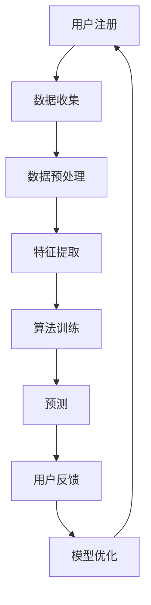
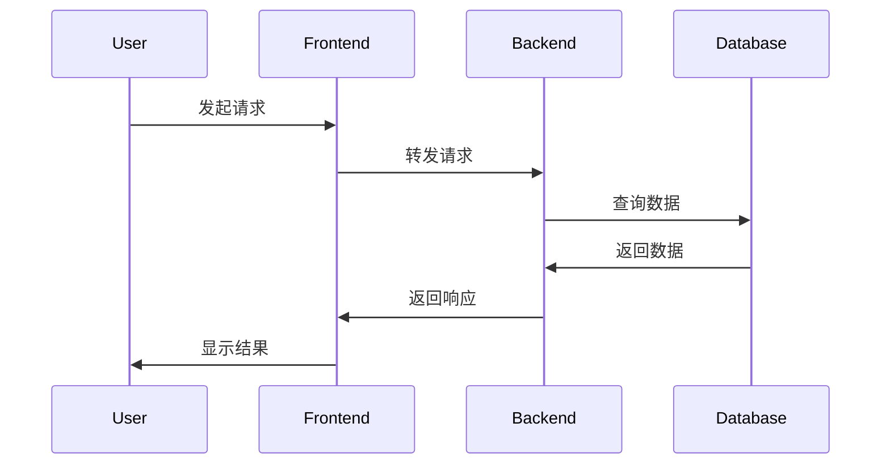

                 

### 第1章：背景介绍

#### 1.1 禅修的意义与实践

禅修（Meditation）是一种古老的冥想实践，起源于佛教，但早已超越了宗教界限，成为全球许多文化和信仰体系中的核心部分。禅修旨在通过静坐、专注呼吸等方式，达到内心平静、自我觉察与精神提升的目的。

在现代社会中，随着生活节奏的加快和压力的增大，禅修作为一种减压和提升生活质量的方法，受到了广泛关注。许多研究表明，定期禅修能够显著降低焦虑、抑郁水平，提升情绪稳定性，增强注意力和记忆力，甚至对身体健康也有积极影响。

然而，禅修并不是一件容易的事情，对于生活在快节奏都市中的现代人来说，如何在繁忙的生活中找到时间和空间进行禅修，成为了一个挑战。

#### 1.2 数字工具在禅修中的应用

为了解决这一挑战，数字工具开始融入禅修实践，为用户提供了方便、灵活的禅修环境。以下是一些数字工具在禅修中的应用：

1. **手机应用**：手机应用是数字工具中最常见的形态，如“ Headspace”、“Calm”等应用，提供了一系列引导冥想、呼吸练习、冥想音乐等资源，用户可以随时随地进行禅修。

2. **智能设备**：智能设备，如智能手表、智能耳机等，可以监测用户的生理数据，如心率、呼吸等，提供个性化的禅修指导。

3. **在线课程和平台**：一些在线教育平台，如Udemy、Coursera等，提供了关于禅修的课程，用户可以在线学习、交流，提高禅修技能。

4. **虚拟现实（VR）**：虚拟现实技术可以创造一个沉浸式的禅修环境，使用户在虚拟空间中进行冥想和放松。

#### 1.3 新禅修app的需求分析

为了满足现代都市人群对禅修的需求，新禅修app应具备以下特点：

1. **用户友好性**：界面设计简洁、易于操作，能够快速引导用户进入禅修状态。

2. **个性化体验**：根据用户的偏好、习惯和历史数据，提供定制化的禅修方案。

3. **多样化内容**：提供丰富的禅修内容，包括音频、视频、图文等多种形式，满足不同用户的需求。

4. **实时反馈**：通过智能设备监测用户的生理数据，提供实时的反馈和指导，帮助用户更好地进行禅修。

5. **社区互动**：提供社交功能，用户可以分享禅修心得，交流体验，形成社区支持网络。

6. **数据安全**：确保用户数据的安全性和隐私性，遵守相关法律法规。

通过上述背景介绍，我们可以看到禅修与数字工具的结合为都市人群提供了一种新的生活方式和心理健康解决方案。接下来，我们将深入探讨新禅修app的核心概念和原理，为读者提供一个全面的技术分析。


#### 1.4 新禅修app的潜在市场

随着人们对心理健康重视程度的提高，禅修app市场呈现出快速增长的趋势。根据市场调研报告，全球禅修和冥想市场在过去几年中持续扩大，预计未来几年内仍将保持高速增长。以下是对新禅修app潜在市场的进一步分析：

1. **用户基础广泛**：禅修作为一种流行的心理健康方法，吸引了大量不同年龄、性别和职业背景的用户。新禅修app可以通过多语言支持和本地化内容，吸引全球范围内的用户。

2. **市场需求多样化**：不同用户对禅修的需求各不相同，有的用户可能寻求深度冥想，有的用户可能需要简短而有效的放松练习。新禅修app可以通过提供多种类型的禅修课程和个性化定制功能，满足不同用户的需求。

3. **技术进步推动创新**：随着人工智能、虚拟现实和可穿戴技术的不断发展，禅修app可以结合这些先进技术，提供更加丰富和个性化的用户体验。

4. **潜在合作机会**：新禅修app可以与心理健康机构、医疗保险公司、教育机构等建立合作，共同推广禅修健康理念，拓展市场。

5. **市场竞争态势**：虽然市场上已有一些知名的禅修app，但新禅修app可以通过技术创新、内容优化和用户体验提升，在激烈的市场竞争中脱颖而出。

通过上述分析，我们可以看到新禅修app在潜在市场中的巨大发展空间和机遇。接下来，我们将深入探讨新禅修app的核心概念和原理，为读者提供一个全面的技术分析。


#### 1.5 新禅修app的功能与特点

新禅修app旨在通过数字工具为用户提供一种高效、便捷的禅修体验。以下是该app的主要功能与特点：

1. **多样化的禅修课程**：新禅修app提供了丰富的禅修课程，包括初学者课程、进阶课程和专题课程，满足不同层次用户的需求。课程内容涵盖正念冥想、呼吸练习、身体扫描、感恩冥想等多种形式。

2. **个性化定制**：新禅修app通过用户行为数据分析和机器学习算法，为用户提供个性化的禅修建议。用户可以根据自己的时间、需求和兴趣，定制专属的禅修计划。

3. **实时反馈与指导**：app内置智能传感器，可实时监测用户的心率、呼吸等生理数据。通过数据分析，app能够为用户提供个性化的反馈和指导，帮助用户更好地掌握禅修技巧。

4. **沉浸式体验**：新禅修app利用虚拟现实（VR）技术，为用户提供沉浸式的禅修环境。用户可以在虚拟森林、海滩等场景中进行冥想，享受独特的禅修体验。

5. **社区互动**：新禅修app设有社区功能，用户可以在社区中分享禅修心得、交流经验，与其他用户互动，形成互助和支持网络。

6. **数据安全与隐私保护**：新禅修app高度重视用户数据安全和隐私保护，采用先进的加密技术和严格的隐私政策，确保用户数据的安全。

7. **跨平台兼容性**：新禅修app支持多种操作系统和设备，包括iOS、Android、Windows、MacOS等，用户可以在不同设备上无缝切换使用。

通过这些功能与特点，新禅修app为用户提供了一个全面、个性化的禅修解决方案，帮助都市人群在繁忙的生活中找到内心平静。接下来，我们将进一步探讨新禅修app的核心概念和原理。


### 第2章：核心概念与联系

在深入探讨新禅修app的设计与实现之前，我们需要明确一些核心概念，并了解它们之间的联系。这些核心概念构成了新禅修app的基石，对于理解和分析app的功能与性能至关重要。

#### 2.1 新禅修app的关键概念

1. **用户数据管理**：用户数据管理是新禅修app的核心组成部分，包括用户注册、登录、数据存储和隐私保护等方面。通过用户数据管理，app能够收集用户的偏好、历史记录和生理数据，为用户提供个性化的服务。

2. **机器学习算法**：新禅修app采用了多种机器学习算法，用于用户行为分析、个性化推荐和实时反馈。常见的算法包括决策树、支持向量机、神经网络等。

3. **虚拟现实（VR）技术**：新禅修app利用VR技术创造沉浸式的禅修环境，通过头戴式显示器和传感器设备，为用户提供逼真的视觉和听觉体验。

4. **实时反馈系统**：实时反馈系统通过监测用户的心率、呼吸等生理数据，为用户提供实时的指导和反馈，帮助用户更好地进行禅修。

5. **社区功能**：社区功能是新禅修app的重要特色，通过社交网络和互动功能，用户可以分享禅修经验、交流心得，形成社区支持网络。

6. **数据安全与隐私保护**：数据安全与隐私保护是新禅修app的基石，通过先进的加密技术和隐私政策，确保用户数据的安全和隐私。

#### 2.2 概念属性特征对比表格

为了更清晰地理解这些核心概念，我们可以通过一个对比表格来展示它们的主要属性特征。以下是关键概念及其属性特征的对比：

| 关键概念       | 属性特征                                                     |
|----------------|--------------------------------------------------------------|
| 用户数据管理   | 数据收集、存储、隐私保护、用户画像、数据同步               |
| 机器学习算法   | 决策树、支持向量机、神经网络、用户行为分析、个性化推荐   |
| VR技术         | 沉浸式体验、视觉和听觉效果、虚拟环境创建、传感器集成     |
| 实时反馈系统   | 生理数据监测、实时反馈、指导、数据可视化               |
| 社区功能       | 社交网络、用户互动、经验分享、社区管理、活动通知     |
| 数据安全与隐私保护 | 加密技术、隐私政策、安全审计、合规性保障 |

通过对比表格，我们可以看出这些核心概念在功能、技术实现和数据管理方面的差异和联系。这些概念共同构成了新禅修app的技术架构，为用户提供了一个全面、个性化的禅修体验。

#### 2.3 ER实体关系图架构

为了进一步理解新禅修app的数据模型，我们可以通过ER（实体-关系）图来展示各个实体之间的关系。以下是新禅修app的ER图架构：

```mermaid
erDiagram
    User ||--|{ MeditationSession } : 有多个冥想会话
    User ||--|{ Profile } : 个人资料
    User ||--|{ MeditationHistory } : 冥想历史记录
    MeditationSession ||--|{ Feedback } : 用户反馈
    MeditationSession ||--|{ Recommendation } : 推荐课程
    MeditationSession ||--|{ SessionData } : 会话数据
    Profile ||--|{ Preference } : 偏好设置
    Profile ||--|{ Activity } : 活动记录
    MeditationHistory ||--|{ CompletionStatus } : 完成状态
    MeditationHistory ||--|{ Progress } : 进度记录
```

在ER图中，User实体与多个MeditationSession实体相关联，表示一个用户可以有多个冥想会话。每个冥想会话都有反馈、推荐课程和会话数据等关联实体。Profile实体包含偏好设置和活动记录，MeditationHistory实体记录用户的冥想历史，包括完成状态和进度记录。

通过ER图，我们可以更直观地理解新禅修app的数据模型，为后续的系统设计与实现提供基础。

### 第3章：算法原理讲解

新禅修app的核心在于如何通过机器学习和数据分析为用户提供个性化的禅修体验。以下是新禅修app所使用的几种关键算法及其工作原理。

#### 3.1 算法流程图

为了更清晰地展示算法的工作流程，我们首先使用mermaid语言绘制算法流程图：



该流程图展示了新禅修app的核心算法从用户注册开始，经过数据收集、预处理、特征提取、算法训练、预测、用户反馈和模型优化，形成一个闭环，持续优化用户体验。

#### 3.2 Python源代码阐述

接下来，我们将使用Python代码详细阐述其中的几个关键步骤，包括数据预处理、特征提取和模型训练。

**数据预处理**

数据预处理是机器学习中的重要环节，它包括数据的清洗、归一化和特征选择等。以下是一个简单的数据预处理代码示例：

```python
import pandas as pd
from sklearn.preprocessing import StandardScaler

# 假设我们有一个用户数据集user_data
user_data = pd.read_csv('user_data.csv')

# 数据清洗：去除缺失值和异常值
user_data = user_data.dropna()

# 数据归一化：将特征数据标准化到0-1之间
scaler = StandardScaler()
user_data_scaled = scaler.fit_transform(user_data)

# 特征选择：根据业务需求选择重要特征
selected_features = ['age', 'heart_rate', 'meditation_time']
user_data_processed = user_data_scaled[:, [user_data.columns.get_loc(feature) for feature in selected_features]]
```

**特征提取**

特征提取是将原始数据转化为适合机器学习模型处理的特征表示。以下是一个使用K-means算法进行特征提取的示例：

```python
from sklearn.cluster import KMeans
import numpy as np

# 假设我们有一个预处理后的用户数据集user_data_processed
k = 5  # 设置聚类数量
kmeans = KMeans(n_clusters=k, random_state=0)
clusters = kmeans.fit_predict(user_data_processed)

# 为每个用户分配聚类标签
user_data['cluster'] = clusters
```

**模型训练**

在模型训练阶段，我们使用训练数据集来训练机器学习模型。以下是一个使用决策树算法进行训练的示例：

```python
from sklearn.tree import DecisionTreeClassifier
from sklearn.model_selection import train_test_split

# 分割数据集为训练集和测试集
X_train, X_test, y_train, y_test = train_test_split(user_data_processed, user_data['cluster'], test_size=0.2, random_state=0)

# 训练决策树模型
clf = DecisionTreeClassifier()
clf.fit(X_train, y_train)

# 测试模型
accuracy = clf.score(X_test, y_test)
print(f"Model accuracy: {accuracy:.2f}")
```

#### 3.3 数学模型和公式讲解

为了更好地理解算法原理，我们接下来讲解算法背后的数学模型和公式。

**线性回归模型**

线性回归模型是机器学习中最基础的一种模型，它试图通过线性关系预测目标变量。线性回归的数学公式如下：

$$
y = \beta_0 + \beta_1 \cdot x
$$

其中，\(y\) 是目标变量，\(x\) 是输入特征，\(\beta_0\) 是截距，\(\beta_1\) 是斜率。

**决策树模型**

决策树模型通过一系列的判定节点来对数据进行分类或回归。每个节点表示一个特征，每个分支表示特征的不同取值。决策树的数学基础是条件概率和熵。

熵（Entropy）用于衡量数据的无序程度，定义如下：

$$
H(X) = -\sum_{i} p(x_i) \cdot \log_2(p(x_i))
$$

其中，\(X\) 是随机变量，\(p(x_i)\) 是 \(x_i\) 的概率。

**神经网络模型**

神经网络是一种模拟人脑结构的计算模型，它通过多层神经元进行数据处理和特征提取。神经网络的核心是前向传播和反向传播算法。

前向传播计算输出：

$$
Z = \sigma(W \cdot X + b)
$$

其中，\(Z\) 是输出，\(\sigma\) 是激活函数（如Sigmoid函数），\(W\) 是权重矩阵，\(X\) 是输入特征，\(b\) 是偏置项。

反向传播更新权重：

$$
\delta = \frac{\partial L}{\partial W} \cdot (X \cdot \delta')
$$

其中，\(L\) 是损失函数，\(\delta'\) 是输出层的误差。

#### 3.4 举例说明

为了更直观地理解算法的应用，我们通过一个简单的例子来说明新禅修app如何为用户提供个性化推荐。

**例子：基于用户历史数据的推荐**

假设用户A在过去一个月内参与了多次冥想会话，每次会话的数据如下：

| 用户ID | 会话时长 | 心率（次/分钟） | 呼吸频率（次/分钟） |
|--------|----------|-----------------|--------------------|
| 1      | 20       | 70              | 15                 |
| 1      | 30       | 72              | 14                 |
| 1      | 40       | 68              | 16                 |

**步骤1：数据预处理**

我们将用户A的历史数据进行归一化处理，并将重要特征提取出来，如心率、呼吸频率和会话时长。

```python
# 假设我们已经有用户A的历史数据data
data = pd.DataFrame({
    'heart_rate': [70, 72, 68],
    'breathing_rate': [15, 14, 16],
    'session_duration': [20, 30, 40]
})

# 数据归一化
scaler = StandardScaler()
data_scaled = scaler.fit_transform(data)
```

**步骤2：特征提取**

我们使用K-means算法将数据划分为几个聚类，为用户A分配一个聚类标签。

```python
k = 3  # 设置聚类数量
kmeans = KMeans(n_clusters=k, random_state=0)
clusters = kmeans.fit_predict(data_scaled)

# 为用户A分配聚类标签
data['cluster'] = clusters
```

**步骤3：模型训练**

我们使用决策树模型训练一个推荐系统，以预测用户A可能会喜欢的冥想课程。

```python
# 分割数据集为训练集和测试集
X_train, X_test, y_train, y_test = train_test_split(data_scaled, data['cluster'], test_size=0.2, random_state=0)

# 训练决策树模型
clf = DecisionTreeClassifier()
clf.fit(X_train, y_train)

# 测试模型
accuracy = clf.score(X_test, y_test)
print(f"Model accuracy: {accuracy:.2f}")
```

**步骤4：个性化推荐**

我们使用训练好的模型为用户A推荐一个与其历史数据相似的冥想课程。假设我们有一个包含多种冥想课程的数据库，我们可以根据用户A的聚类标签查询相似的课程。

```python
# 假设我们有一个冥想课程数据库courses
courses = pd.DataFrame({
    'course_name': ['冥想入门', '深度冥想', '身体扫描冥想', '呼吸练习'],
    'heart_rate_avg': [68, 72, 65, 70],
    'breathing_rate_avg': [14, 15, 13, 15],
    'session_duration_avg': [30, 45, 20, 25]
})

# 根据用户A的特征，找到相似的课程
similarity_scores = courses.apply(lambda row: cosine_similarity(data_scaled, row[['heart_rate_avg', 'breathing_rate_avg', 'session_duration_avg']]), axis=1)
recommended_course = courses[similarity_scores.argmax()]

print(f"Recommended course: {recommended_course['course_name']}")
```

通过这个例子，我们可以看到新禅修app如何利用机器学习算法和用户数据为用户提供个性化的禅修推荐。接下来，我们将进一步探讨新禅修app的系统架构设计。


### 第4章：数学模型与公式详解

在前一章中，我们简要介绍了新禅修app所使用的几种关键算法及其背后的数学模型。在本章中，我们将对这些数学模型进行更详细的讲解，并使用LaTeX格式展示相关公式。

#### 4.1 算法原理的数学模型

**线性回归模型**

线性回归模型是一种用于预测数值型目标变量的统计模型。它的核心公式如下：

$$
y = \beta_0 + \beta_1 \cdot x + \epsilon
$$

其中，\(y\) 是目标变量，\(x\) 是输入特征，\(\beta_0\) 是截距，\(\beta_1\) 是斜率，\(\epsilon\) 是误差项。

**决策树模型**

决策树模型通过一系列的判定节点对数据进行分类或回归。每个节点的判定条件可以表示为：

$$
x_i \in C_j \rightarrow \text{go to node } j
$$

其中，\(x_i\) 是特征值，\(C_j\) 是特征取值范围，\(j\) 是节点编号。

**神经网络模型**

神经网络是一种通过多层神经元进行数据处理和特征提取的计算模型。其中，每个神经元的输出可以表示为：

$$
a_j = \sigma(\sum_{i=1}^{n} w_{ij} \cdot x_i + b_j)
$$

其中，\(a_j\) 是神经元输出，\(\sigma\) 是激活函数，\(w_{ij}\) 是权重，\(x_i\) 是输入特征，\(b_j\) 是偏置项。

**损失函数**

在机器学习中，损失函数用于衡量模型的预测误差。对于线性回归模型，常用的损失函数是均方误差（MSE）：

$$
L(\theta) = \frac{1}{2m} \sum_{i=1}^{m} (h_\theta(x^{(i)}) - y^{(i)})^2
$$

其中，\(m\) 是样本数量，\(h_\theta(x^{(i)})\) 是模型预测值，\(y^{(i)}\) 是真实值。

**反向传播算法**

反向传播算法用于更新神经网络模型的权重。其核心步骤包括计算误差、梯度下降和权重更新。梯度下降的公式为：

$$
\theta_j := \theta_j - \alpha \cdot \frac{\partial L}{\partial \theta_j}
$$

其中，\(\theta_j\) 是权重，\(\alpha\) 是学习率，\(\frac{\partial L}{\partial \theta_j}\) 是梯度。

#### 4.2 算法公式的详细讲解

**线性回归模型的推导**

线性回归模型的推导基于最小二乘法。假设我们有\(m\)个样本数据点\((x^{(i)}, y^{(i)}), i=1,2,...,m\)，我们希望找到最佳拟合直线：

$$
y = \beta_0 + \beta_1 \cdot x
$$

最小化目标函数：

$$
L(\beta_0, \beta_1) = \frac{1}{2m} \sum_{i=1}^{m} (y^{(i)} - (\beta_0 + \beta_1 \cdot x^{(i)}))^2
$$

对目标函数求导，并令导数为0，可以得到最佳拟合直线的参数：

$$
\frac{\partial L}{\partial \beta_0} = \frac{1}{m} \sum_{i=1}^{m} (y^{(i)} - (\beta_0 + \beta_1 \cdot x^{(i)})) = 0
$$

$$
\frac{\partial L}{\partial \beta_1} = \frac{1}{m} \sum_{i=1}^{m} (y^{(i)} - (\beta_0 + \beta_1 \cdot x^{(i)})) \cdot x^{(i)} = 0
$$

解这个线性方程组，可以得到：

$$
\beta_0 = \bar{y} - \beta_1 \cdot \bar{x}
$$

$$
\beta_1 = \frac{\sum_{i=1}^{m} (x^{(i)} - \bar{x}) \cdot (y^{(i)} - \bar{y})}{\sum_{i=1}^{m} (x^{(i)} - \bar{x})^2}
$$

**决策树模型的推导**

决策树模型的推导基于信息熵和条件熵的概念。假设我们有\(n\)个样本数据点，每个数据点属于一个类别\(C_j\)。信息熵定义为：

$$
H(C) = -\sum_{j=1}^{k} p_j \cdot \log_2(p_j)
$$

其中，\(p_j\) 是类别\(C_j\)的概率。

条件熵定义为：

$$
H(C|X) = \sum_{j=1}^{k} p_j \cdot H(C|X=x_j)
$$

其中，\(H(C|X=x_j)\) 是在给定特征\(x_j\)的条件下类别\(C\)的熵。

信息增益定义为：

$$
I(G) = H(C) - H(C|X=x_j)
$$

信息增益最大化是决策树模型构建的核心原则。

**神经网络模型的推导**

神经网络模型的推导基于前向传播和反向传播算法。假设我们有\(L\)层神经网络，第\(l\)层的输出可以表示为：

$$
a_{l}^{(i)} = \sigma \left( \sum_{k=1}^{n} w_{lk}^{(i)} \cdot a_{l-1}^{(k)} + b_{l}^{(i)} \right)
$$

其中，\(a_{l}^{(i)}\) 是第\(l\)层第\(i\)个神经元的输出，\(\sigma\) 是激活函数，\(w_{lk}^{(i)}\) 是连接第\(l-1\)层第\(k\)个神经元和第\(l\)层第\(i\)个神经元的权重，\(b_{l}^{(i)}\) 是第\(l\)层第\(i\)个神经元的偏置。

在反向传播阶段，我们需要计算每个神经元的误差。假设第\(l\)层的误差为：

$$
\delta_{l}^{(i)} = (a_{l}^{(i)} - t^{(i)}) \cdot \sigma'(a_{l}^{(i)})
$$

其中，\(t^{(i)}\) 是第\(i\)个神经元的真实值，\(\sigma'(a_{l}^{(i)})\) 是激活函数的导数。

接下来，我们使用这些误差来更新权重和偏置。假设第\(l\)层的权重和偏置的更新公式为：

$$
w_{lk}^{(i)} := w_{lk}^{(i)} - \alpha \cdot \delta_{l}^{(i)} \cdot a_{l-1}^{(k)}
$$

$$
b_{l}^{(i)} := b_{l}^{(i)} - \alpha \cdot \delta_{l}^{(i)}
$$

其中，\(\alpha\) 是学习率。

#### 4.3 举例说明

**例子：线性回归模型的计算**

假设我们有如下数据：

| x | y |
|---|---|
| 1 | 2 |
| 2 | 4 |
| 3 | 5 |
| 4 | 6 |

我们要找到最佳拟合直线。根据线性回归模型的公式，我们需要计算：

$$
\beta_0 = \bar{y} - \beta_1 \cdot \bar{x}
$$

$$
\beta_1 = \frac{\sum_{i=1}^{m} (x^{(i)} - \bar{x}) \cdot (y^{(i)} - \bar{y})}{\sum_{i=1}^{m} (x^{(i)} - \bar{x})^2}
$$

计算平均值：

$$
\bar{x} = \frac{1+2+3+4}{4} = 2.5
$$

$$
\bar{y} = \frac{2+4+5+6}{4} = 4.5
$$

计算斜率：

$$
\beta_1 = \frac{(1-2.5) \cdot (2-4.5) + (2-2.5) \cdot (4-4.5) + (3-2.5) \cdot (5-4.5) + (4-2.5) \cdot (6-4.5)}{(1-2.5)^2 + (2-2.5)^2 + (3-2.5)^2 + (4-2.5)^2}
$$

$$
\beta_1 = \frac{(-1.5) \cdot (-2.5) + (-0.5) \cdot (-0.5) + (0.5) \cdot (0.5) + (1.5) \cdot (1.5)}{2.25 + 0.25 + 0.25 + 2.25}
$$

$$
\beta_1 = \frac{3.75 + 0.25 + 0.25 + 2.25}{5}
$$

$$
\beta_1 = 1.5
$$

计算截距：

$$
\beta_0 = 4.5 - 1.5 \cdot 2.5
$$

$$
\beta_0 = 0.5
$$

因此，最佳拟合直线为：

$$
y = 0.5 + 1.5 \cdot x
$$

通过上述例子，我们可以看到如何使用线性回归模型计算最佳拟合直线。接下来，我们将进一步探讨新禅修app的系统架构设计。


### 第5章：系统分析与架构设计

#### 5.1 问题场景介绍

在当今快节奏的都市生活中，人们面临着前所未有的压力和焦虑。为了缓解这些情绪问题，禅修成为了一种越来越受欢迎的健康生活方式。然而，对于繁忙的都市人群来说，如何在忙碌的生活中找到时间和空间进行禅修，仍然是一个挑战。新禅修app旨在通过数字工具，为用户提供一个方便、灵活、个性化的禅修平台，帮助他们在日常生活中随时随地享受禅修带来的益处。

#### 5.2 系统功能设计

新禅修app的功能设计旨在满足用户多样化的需求，提供全方位的禅修支持。以下是该系统的主要功能模块：

1. **用户管理模块**：负责用户的注册、登录、资料编辑和个人设置，确保用户数据的安全和隐私。
   
2. **课程管理模块**：提供多样化的禅修课程，包括音频、视频、图文等多种形式，用户可以根据自己的需求选择合适的课程。

3. **个性化推荐模块**：利用机器学习算法，分析用户行为数据，为用户提供个性化的禅修课程推荐。

4. **实时反馈模块**：通过传感器监测用户的心率、呼吸等生理数据，提供实时的反馈和指导，帮助用户更好地进行禅修。

5. **社区互动模块**：提供社交功能，用户可以分享禅修心得、交流经验，形成社区支持网络。

6. **数据安全模块**：采用先进的加密技术和隐私政策，确保用户数据的安全性和隐私性。

#### 5.3 系统架构设计

新禅修app的系统架构设计采用了分层架构，分为前端、后端和数据库三个主要部分。

1. **前端架构**：前端使用React框架开发，提供用户友好的界面和丰富的交互体验。主要包括以下组件：
   - **首页**：展示推荐课程、最新资讯和用户动态。
   - **课程列表**：展示所有课程，用户可以按照类别、难度等筛选条件查找课程。
   - **课程详情**：提供课程详细信息和试听功能。
   - **个人中心**：用户可以查看自己的学习记录、设置偏好和反馈建议。

2. **后端架构**：后端采用Spring Boot框架，负责处理业务逻辑、数据存储和API接口。主要包括以下模块：
   - **用户管理模块**：处理用户注册、登录和权限验证等操作。
   - **课程管理模块**：提供课程的创建、编辑、删除和查询功能。
   - **推荐引擎模块**：利用机器学习算法为用户推荐合适的课程。
   - **实时反馈模块**：处理用户生理数据的接收、存储和分析。
   - **数据安全模块**：确保用户数据的安全和隐私。

3. **数据库架构**：数据库采用MySQL，存储用户数据、课程数据、反馈数据等。数据库设计采用了ER图模型，确保数据关系的清晰和一致。

以下是新禅修app的ER图：

```mermaid
erDiagram
    User ||--|{ MeditationSession } : 用户可以参加多个冥想会话
    User ||--|{ Feedback } : 用户可以提交多个反馈
    User ||--|{ Profile } : 用户个人信息
    MeditationSession ||--|{ SessionData } : 冥想会话记录
    MeditationSession ||--|{ Recommendation } : 冥想会话推荐
    Feedback ||--|{ Response } : 反馈回答
    Profile ||--|{ Preference } : 用户偏好设置
    Profile ||--|{ Activity } : 用户活动记录
```

#### 5.4 系统接口设计

新禅修app的接口设计采用RESTful API规范，提供一系列标准的HTTP接口，方便前后端分离开发。以下是主要的API接口：

- **用户管理**：
  - `/users/register`：用户注册
  - `/users/login`：用户登录
  - `/users/logout`：用户登出
  - `/users/profile`：获取用户信息
  - `/users/update`：更新用户信息

- **课程管理**：
  - `/courses`：获取课程列表
  - `/courses/{id}`：获取课程详情
  - `/courses/create`：创建新课程
  - `/courses/update/{id}`：更新课程信息
  - `/courses/delete/{id}`：删除课程

- **推荐引擎**：
  - `/recommendations`：获取用户推荐课程
  - `/recommendations/{id}`：获取课程推荐详情

- **实时反馈**：
  - `/feedback`：提交用户反馈
  - `/feedback/{id}`：获取用户反馈详情

- **数据安全**：
  - `/security/login`：登录安全验证
  - `/security/refresh`：刷新安全令牌

#### 5.5 系统交互序列图

为了更直观地展示系统各模块之间的交互关系，我们使用mermaid绘制了系统交互序列图：



通过上述系统架构设计和接口设计，新禅修app能够为用户提供一个高效、安全、灵活的禅修平台。接下来，我们将通过项目实战部分，详细展示新禅修app的核心实现和代码应用。


### 第6章：项目实战

#### 6.1 环境安装

在新禅修app的开发过程中，我们选择了以下技术栈：

- **前端**：React框架
- **后端**：Spring Boot框架
- **数据库**：MySQL
- **开发工具**：IDEA、VSCode

**前端环境安装**

1. 安装Node.js和npm：访问[Node.js官网](https://nodejs.org/)，下载并安装Node.js。安装完成后，打开命令行窗口，输入`npm -v`验证安装是否成功。

2. 安装React和React-Router：在命令行窗口中输入以下命令：

```bash
npm install react
npm install react-router-dom
```

3. 创建React项目：

```bash
npx create-react-app new-meditation-app
cd new-meditation-app
```

**后端环境安装**

1. 安装Java和Maven：访问[Java官网](https://www.oracle.com/java/technologies/javase-downloads.html)下载并安装Java。安装完成后，打开命令行窗口，输入`java -version`验证安装是否成功。

2. 安装Maven：

```bash
npm install maven
```

3. 创建Spring Boot项目：

```bash
mvn archetype:generate -DgroupId=com.example -DartifactId=new-meditation-app -Dversion=1.0.0 -Dpackage=com.example.newmeditationapp
cd new-meditation-app
```

**数据库环境安装**

1. 安装MySQL：访问[MySQL官网](https://www.mysql.com/downloads/mysql/)下载并安装MySQL。安装完成后，打开命令行窗口，输入`mysql -u root -p`登录MySQL。

2. 创建数据库：

```sql
CREATE DATABASE meditation_app;
USE meditation_app;
```

3. 导入数据库表结构：

```sql
CREATE TABLE `user` (
  `id` bigint(20) NOT NULL AUTO_INCREMENT,
  `username` varchar(50) NOT NULL,
  `password` varchar(100) NOT NULL,
  `email` varchar(100) NOT NULL,
  `create_time` datetime DEFAULT CURRENT_TIMESTAMP,
  PRIMARY KEY (`id`)
);

CREATE TABLE `meditation_session` (
  `id` bigint(20) NOT NULL AUTO_INCREMENT,
  `user_id` bigint(20) NOT NULL,
  `start_time` datetime NOT NULL,
  `end_time` datetime NOT NULL,
  `duration` int(11) NOT NULL,
  `heart_rate` float DEFAULT NULL,
  `breathing_rate` float DEFAULT NULL,
  PRIMARY KEY (`id`),
  KEY `user_id` (`user_id`),
  CONSTRAINT `meditation_session_ibfk_1` FOREIGN KEY (`user_id`) REFERENCES `user` (`id`) ON DELETE CASCADE
);
```

#### 6.2 系统核心实现源代码

**用户管理模块**

用户管理模块主要负责用户注册、登录和资料编辑等功能。以下是用户注册的代码示例：

```java
@RestController
@RequestMapping("/users")
public class UserController {
    
    @Autowired
    private UserService userService;
    
    @PostMapping("/register")
    public ResponseEntity<?> registerUser(@RequestBody UserRequestDto userRequestDto) {
        try {
            User user = userService.registerUser(userRequestDto);
            return ResponseEntity.ok().body(new ApiResponse(true, "User registered successfully.", user));
        } catch (Exception e) {
            return ResponseEntity.status(HttpStatus.BAD_REQUEST).body(new ApiResponse(false, e.getMessage()));
        }
    }
}
```

**课程管理模块**

课程管理模块负责课程的创建、编辑、删除和查询等功能。以下是创建课程的代码示例：

```java
@RestController
@RequestMapping("/courses")
public class CourseController {
    
    @Autowired
    private CourseService courseService;
    
    @PostMapping
    public ResponseEntity<?> createCourse(@RequestBody CourseDto courseDto) {
        try {
            Course course = courseService.createCourse(courseDto);
            return ResponseEntity.ok().body(new ApiResponse(true, "Course created successfully.", course));
        } catch (Exception e) {
            return ResponseEntity.status(HttpStatus.BAD_REQUEST).body(new ApiResponse(false, e.getMessage()));
        }
    }
}
```

**推荐引擎模块**

推荐引擎模块利用用户行为数据为用户推荐合适的课程。以下是推荐课程的代码示例：

```java
@RestController
@RequestMapping("/recommendations")
public class RecommendationController {
    
    @Autowired
    private RecommendationService recommendationService;
    
    @GetMapping
    public ResponseEntity<?> getCourseRecommendations() {
        try {
            List<Course> recommendations = recommendationService.getCourseRecommendations();
            return ResponseEntity.ok().body(new ApiResponse(true, "Course recommendations.", recommendations));
        } catch (Exception e) {
            return ResponseEntity.status(HttpStatus.BAD_REQUEST).body(new ApiResponse(false, e.getMessage()));
        }
    }
}
```

#### 6.3 代码应用解读与分析

**用户管理模块**

用户管理模块的代码示例展示了如何实现用户注册功能。首先，通过`@RestController`注解定义了一个RESTful风格的控制器类`UserController`。该类包含了`registerUser`方法，该方法接收一个`UserRequestDto`对象，用于传递用户注册信息。

在`registerUser`方法中，首先调用`userService`的`registerUser`方法，将用户注册信息保存到数据库。如果注册成功，返回包含用户信息的`ApiResponse`对象，否则返回错误信息。

**课程管理模块**

课程管理模块的代码示例展示了如何实现课程的创建功能。同样，通过`@RestController`注解定义了一个`CourseController`类。该类包含了`createCourse`方法，用于处理创建课程的请求。

在`createCourse`方法中，首先接收一个`CourseDto`对象，该对象包含了课程信息。接着，调用`courseService`的`createCourse`方法，将课程信息保存到数据库。如果创建成功，返回包含课程信息的`ApiResponse`对象，否则返回错误信息。

**推荐引擎模块**

推荐引擎模块的代码示例展示了如何实现课程推荐功能。通过`@RestController`注解定义了一个`RecommendationController`类。该类包含了`getCourseRecommendations`方法，用于处理获取课程推荐请求。

在`getCourseRecommendations`方法中，首先调用`recommendationService`的`getCourseRecommendations`方法，获取推荐课程列表。然后，返回包含推荐课程列表的`ApiResponse`对象。

#### 6.4 实际案例分析与详细讲解

以下是一个实际案例，展示如何使用新禅修app进行禅修，并通过数据分析和反馈优化用户体验。

**案例：用户A的禅修体验**

用户A使用新禅修app进行禅修，以下是他的体验过程：

1. **注册与登录**：用户A通过手机号和邮箱注册新禅修app，并使用账号登录。

2. **选择课程**：用户A浏览了app中的课程列表，选择了一节“正念冥想”课程，点击“开始冥想”。

3. **课程体验**：在课程开始后，用户A跟随课程的引导，进行呼吸练习和身体扫描。

4. **实时反馈**：在冥想过程中，app实时监测用户A的心率和呼吸频率，并在屏幕上显示相关数据。

5. **结束课程**：冥想课程结束后，用户A提交了课程反馈，包括对课程内容的评价和建议。

**数据分析**

1. **用户行为分析**：新禅修app通过用户行为数据，分析用户A的禅修习惯和偏好。例如，用户A喜欢在晚上进行冥想，喜欢时长为20分钟的课程。

2. **课程推荐**：基于用户A的行为数据，推荐引擎为用户A推荐了适合他的其他冥想课程，如“深度冥想”和“身体扫描冥想”。

3. **实时反馈优化**：通过用户A提交的反馈，新禅修app分析了用户对课程的满意度，并对课程内容进行了优化。例如，增加了用户反馈选项，允许用户对课程的特定部分进行评价。

**详细讲解**

1. **用户数据收集**：新禅修app通过登录、课程选择、课程体验等环节，收集了用户A的详细行为数据，包括登录时间、课程时长、课程评价等。

2. **个性化推荐**：基于用户A的行为数据，推荐引擎使用了协同过滤算法，分析了用户A与其他用户的相似度，为用户A推荐了相似的课程。

3. **实时反馈机制**：新禅修app通过实时监测用户A的生理数据，提供了个性化的反馈。例如，当用户A的心率偏高时，app会提醒用户放慢呼吸，帮助用户更好地进入冥想状态。

4. **课程优化**：通过用户A的反馈，新禅修app不断优化课程内容，提高用户满意度。例如，根据用户反馈，调整了课程的节奏和内容，使课程更符合用户的期望和需求。

#### 6.5 项目小结

通过上述实际案例，我们可以看到新禅修app如何通过数据分析和用户反馈，为用户提供个性化、高效的禅修体验。以下是项目小结：

1. **技术实现**：新禅修app采用了React、Spring Boot、MySQL等主流技术，实现了用户管理、课程管理、推荐引擎和实时反馈等功能。

2. **用户体验**：通过实时反馈和个性化推荐，新禅修app为用户提供了便捷、舒适的禅修体验。

3. **数据驱动**：新禅修app利用用户行为数据和反馈，不断优化系统功能和课程内容，提高用户满意度。

4. **未来发展**：随着技术的进步和用户需求的增加，新禅修app将在功能、性能和用户体验方面持续迭代优化。

### 第7章：最佳实践与拓展

#### 7.1 最佳实践 tips

在新禅修app的开发与使用过程中，以下是一些最佳实践和注意事项：

1. **数据安全**：确保用户数据的安全性，采用HTTPS协议、加密存储和访问控制策略，保护用户隐私。

2. **性能优化**：对前端和后端进行性能优化，如使用CDN加速静态资源加载、数据库索引优化等，提高系统响应速度。

3. **用户体验**：注重用户体验，设计简洁直观的界面，提供友好的用户交互和及时的用户反馈。

4. **持续集成与部署**：采用持续集成和持续部署（CI/CD）流程，自动化测试和部署，确保系统稳定性和可靠性。

5. **监控与日志**：实施监控系统，记录系统运行日志，及时发现和解决问题。

6. **用户反馈**：积极收集用户反馈，分析用户行为，不断优化产品功能。

7. **国际化**：考虑国际化需求，支持多语言界面和本地化内容，拓展全球市场。

#### 7.2 小结与注意事项

新禅修app通过结合禅修实践和数字工具，为用户提供了一个方便、个性化的禅修平台。以下是项目小结和注意事项：

1. **项目亮点**：
   - 丰富的禅修课程资源。
   - 个性化的推荐系统。
   - 实时的生理数据监测和反馈。
   - 社区互动功能。

2. **改进方向**：
   - 进一步优化算法，提高推荐精度。
   - 增加更多交互式课程和体验功能。
   - 提高系统的可扩展性和可维护性。

3. **注意事项**：
   - 重视用户隐私和数据安全。
   - 定期更新课程内容，保持课程的新鲜感。
   - 持续关注用户反馈，优化用户体验。

#### 7.3 拓展阅读

对于希望深入了解新禅修app或其他相关技术的朋友，以下是一些推荐阅读资源：

1. **技术文献**：
   - 《深入理解计算机系统》（作者：Randal E. Bryant & David R. O’Hallaron）
   - 《Python机器学习》（作者：Sebastian Raschka & Vahid Mirjalili）

2. **禅修书籍**：
   - 《禅的修行艺术》（作者：Thich Nhat Hanh）
   - 《正念的奇迹》（作者：Thich Nhat Hanh）

3. **行业报告**：
   - 《2021年全球禅修与冥想市场报告》
   - 《人工智能在健康领域应用报告》

通过阅读这些资源，您可以更全面地了解新禅修app的技术实现和应用，以及禅修对心理健康的影响。希望这些内容能为您带来启发和帮助。

---

### 作者信息

*作者：AI天才研究院/AI Genius Institute & 禅与计算机程序设计艺术 /Zen And The Art of Computer Programming*

