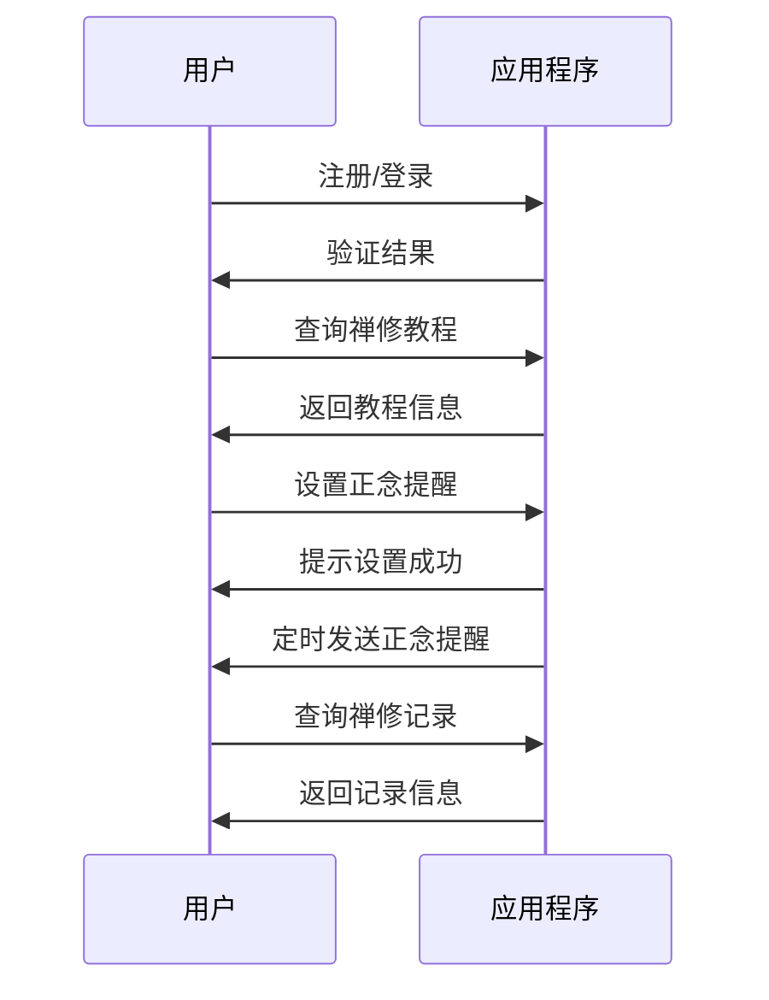

                 


### 摘要

《新禅宗生活方式：东方智慧在现代生活中的应用》旨在探索禅宗哲学在当代社会中的深远影响，并指导读者如何在快节奏的现代生活中实践禅修，实现内心的平和与生活的和谐。本书将禅宗的核心思想与现代生活实际相结合，通过一系列具体实例和实用的方法，帮助读者理解并内化禅修智慧，从而提升个人的心理健康和生活质量。本书适用于寻求精神成长、希望生活更平衡和谐的读者，以及对禅宗文化有兴趣的读者。

### 目录大纲

**# 第一部分：禅宗基础与哲学**

**## 1. 禅宗概述**

- **### 1.1 禅宗的起源与发展**
  - 禅宗的历史背景和演变过程
  - 禅宗在中国文化中的地位
  - 禅宗对全球文化的影响

- **### 1.2 禅宗的核心思想**
  - 正念、悟道、无我的概念
  - 禅宗的修行方法和原则

- **### 1.3 禅宗在现代社会中的地位**
  - 禅宗在现代心理学中的应用
  - 禅宗在商业管理中的价值
  - 禅宗在艺术和文学中的体现

**## 2. 禅修实践**

- **### 2.1 禅坐与呼吸**
  - 禅坐的正确姿势和技巧
  - 呼吸在禅修中的重要性
  - 常见的呼吸练习方法

- **### 2.2 正念与冥想**
  - 正念的定义和重要性
  - 冥想的类型和实践方法
  - 正念冥想在日常生活中的应用

- **### 2.3 禅修中的障碍与突破**
  - 禅修过程中常见的心理障碍
  - 克服障碍的方法和策略
  - 禅修的个人体验分享

**## 3. 生活哲学**

- **### 3.1 禅与人际关系**
  - 禅修对人际关系的影响
  - 慈悲与宽容的实践
  - 禅修在化解冲突中的作用

- **### 3.2 禅与工作**
  - 禅修对工作状态和效率的提升
  - 禅修在职业发展中的应用
  - 禅修与职业素养的关系

- **### 3.3 禅与健康**
  - 禅修对身心健康的作用
  - 禅修与自然疗法的结合
  - 禅修在慢性疾病治疗中的应用

**## 4. 禅宗在当代社会的应用**

- **### 4.1 禅宗在现代心理治疗中的应用**
  - 禅修对焦虑和抑郁的治疗效果
  - 禅修与认知行为疗法的结合
  - 禅修在心理康复中的实践

- **### 4.2 禅宗在商业管理中的启示**
  - 禅修对领导力的提升
  - 禅修在团队协作中的应用
  - 禅修在创新思维中的作用

- **### 4.3 禅宗在艺术创作中的影响**
  - 禅修对艺术家创作灵感的启发
  - 禅修在艺术表达中的应用
  - 禅修对艺术作品风格的影响

**## 5. 禅宗与现代生活方式**

- **### 5.1 禅宗在都市生活中的实践**
  - 都市禅修的挑战与解决方案
  - 城市环境中禅修的实践方法
  - 都市禅修的个人体验分享

- **### 5.2 禅宗在快节奏生活中的调适**
  - 快节奏生活对心理健康的影响
  - 禅修在应对压力中的应用
  - 禅修对提高生活质量的贡献

- **### 5.3 禅宗在个人成长中的应用**
  - 禅修对自我认知的提升
  - 禅修在个人发展中的应用
  - 禅修对人生观的改变

**## 6. 禅宗生活方式的案例研究**

- **### 6.1 案例一：如何在职场中实践禅宗智慧**
  - 职场禅修的经验分享
  - 禅修对工作效率的影响
  - 禅修在职场人际关系中的应用

- **### 6.2 案例二：如何在家庭生活中融入禅宗理念**
  - 家庭禅修的实践方法
  - 禅修对家庭和谐的作用
  - 禅修在亲子关系中的应用

- **### 6.3 案例三：如何通过禅修改善身心健康**
  - 禅修对身心健康的积极影响
  - 禅修在慢性疾病管理中的应用
  - 禅修的个人体验分享

**## 7. 结论与展望**

- **### 7.1 禅宗生活方式的总结**
  - 禅宗生活方式的核心价值
  - 禅修对现代生活的深远影响

- **### 7.2 禅宗生活方式的未来**
  - 禅宗生活方式的发展趋势
  - 禅修在现代社会中的未来前景

- **### 7.3 鼓励读者实践禅宗生活方式**
  - 实践禅修的建议和指导
  - 禅修生活方式的可持续性
  - 禅修对个人和社会的积极影响

---

**# 引入**

在当今快速发展的现代社会中，人们面临着前所未有的压力和挑战。快节奏的生活、复杂的人际关系、不断变化的工作环境，都让许多人感到身心疲惫。在这种情况下，寻求一种能够帮助人们减轻压力、实现内心平和的生活方式变得尤为重要。禅宗，作为东方智慧的瑰宝，提供了这样一种解决方案。

禅宗，源自中国，是佛教的一个重要分支，它强调通过内心的修炼来达到对世界的深刻理解和内心的平和。禅宗的生活方式不仅仅是一种宗教实践，更是一种哲学思考和生活态度。在禅宗的指导下，人们可以通过冥想、正念、慈悲等实践方法，培养内心的力量，提升生活的质量。

本书《新禅宗生活方式：东方智慧在现代生活中的应用》，旨在将禅宗的智慧与现代生活相结合，帮助读者在快节奏的现代生活中找到平衡，实现内心的平和与和谐。通过本书，读者将了解禅宗的基础知识、实践方法，并学习如何在职场、家庭和日常生活中应用禅宗智慧，从而提升个人的心理健康和生活质量。

在接下来的章节中，我们将一步一步地深入探讨禅宗的核心思想、禅修实践、生活哲学以及禅宗在当代社会的应用。通过具体案例和实际应用，本书将帮助读者更好地理解禅宗智慧，并学会将其融入到自己的生活中。让我们一起来探索禅宗的智慧，开启一段全新的生活旅程。

---

**# 禅宗概述**

### 1.1 禅宗的起源与发展

禅宗，源自中国，是佛教的一个重要分支，其历史可以追溯到公元五世纪。禅宗的核心思想是通过内心的修炼来实现对世界的深刻理解和内心的平和。禅宗的起源可以追溯到南北朝时期，由菩提达摩传入中国。菩提达摩被称为禅宗的初祖，他强调通过禅修来达到对佛教教义的深刻理解。

禅宗在中国的发展经历了多个阶段，从南北朝到唐朝，禅宗逐渐成为中国佛教的主流。禅宗的发展离不开其独特的修行方法和哲学思考。禅宗强调“不立文字，教外别传”，即通过直接的内心体验来悟道，而不是依赖经文和教义。

禅宗的发展不仅局限于中国，还影响了日本、韩国等东亚国家。在日本，禅宗发展成为日本文化的重要组成部分，对日本的艺术、文学、哲学产生了深远的影响。韩国的禅宗也具有独特的传统，影响了韩国的文化和社会。

### 1.2 禅宗的核心思想

禅宗的核心思想包括正念、悟道、无我等概念。正念，即对当下的全然觉察和接纳，是禅修的重要实践。通过正念，人们可以培养对当下的深刻觉察，从而减少对过去的执着和对未来的焦虑。

悟道，是禅宗修行的一个重要目标。悟道意味着对生命和宇宙的深刻理解，达到对“真我”的觉悟。悟道不是通过思考和理解，而是通过直接的内心体验。

无我，是禅宗哲学的一个重要概念。禅宗认为，真正的自我并不是一个固定的实体，而是不断变化的、与外界互动的过程。无我的概念帮助人们超越自我中心的束缚，实现内心的平和。

### 1.3 禅宗的核心思想与生活哲学

禅宗的生活哲学强调内心的修炼和与自然的和谐相处。禅宗认为，人们应该通过禅修来培养内心的力量，实现内心的平和与和谐。禅修不仅仅是一种宗教实践，更是一种生活方式。

禅宗强调“活在当下”，即对当下的全然觉察和接纳。通过正念禅修，人们可以培养对生活的深刻理解和欣赏，从而减少对过去的执着和对未来的焦虑。禅宗提倡“无为”，即不做无意义的事情，只做有意义的事情。这种态度帮助人们专注于当前的重要事务，提高工作效率和生活质量。

禅宗还强调与自然的和谐相处。禅宗认为，人类与自然是一个整体，人类的行为应该遵循自然的规律。通过亲近自然，人们可以培养内心的宁静和平衡，实现与自然的和谐相处。

### 1.4 禅宗在现代社会中的地位

在现代社会，禅宗仍然具有重要的影响力。禅宗的生活方式和哲学思考为人们提供了一种应对现代社会压力和挑战的方法。越来越多的人开始关注禅宗，将其应用于个人成长、心理健康和职业发展。

在心理学领域，禅修被证明对缓解焦虑和抑郁有显著的效果。许多心理学家开始将禅修作为治疗工具，帮助患者实现内心的平和和自我认知的提升。在商业管理领域，禅修也被广泛应用，帮助管理者提高领导力、团队协作和创新思维能力。

此外，禅宗在艺术创作和文学中也产生了深远的影响。许多艺术家和作家通过禅修获得了灵感和创作灵感，创作出具有深刻内涵和情感力量的作品。

总的来说，禅宗在现代社会中具有重要的地位，其哲学思考和生活方式为人们提供了一种寻求内心平和和自我实现的途径。禅宗不仅是一种宗教信仰，更是一种全面的生活方式，影响着人们的思想、行为和生活质量。

---

**# 禅修实践**

禅修是禅宗的核心实践，它通过一系列的冥想和正念练习，帮助人们培养内心的力量和自我认知。在本节中，我们将探讨禅坐与呼吸、正念与冥想，以及禅修中的障碍与突破。

### 2.1 禅坐与呼吸

禅坐是禅修的基础，它通过长时间的静坐来培养内心的宁静和专注力。正确的禅坐姿势对于禅修的效果至关重要。以下是一个简单的禅坐姿势：

1. 选择一个安静的地方，确保舒适且不会被打扰。
2. 坐在垫子上，保持背部挺直，双脚平放在地面上。
3. 手掌放在膝盖上，手指轻轻相触。
4. 眼睛半睁半闭，专注于呼吸。

禅坐的过程中，呼吸是关键。深呼吸有助于放松身心，减轻焦虑。以下是一些呼吸练习的方法：

- **深呼吸**：缓慢吸气，腹部逐渐膨胀，然后缓慢呼气，腹部逐渐收缩。
- **数呼吸**：专注于呼吸的进出，每次呼吸数一次，专注于数字的变化。
- **观察呼吸**：不刻意控制呼吸，只是观察呼吸的起伏，专注于呼吸的感觉。

通过禅坐和呼吸练习，人们可以培养内心的宁静和专注力，提高对当下的觉察。

### 2.2 正念与冥想

正念是禅修的重要实践，它意味着对当下的全然觉察和接纳。正念不仅仅是专注呼吸，更是对生活中的每一个瞬间保持清醒和专注。以下是一些正念练习的方法：

- **身体扫描**：从脚开始，逐渐扫描身体，专注于身体的感觉，接受身体的不适和疼痛。
- ** mindful Eating**：慢慢吃东西，专注于食物的口感和味道，感受每一口食物带来的满足。
- ** mindful Walking**：专注于每一步的行走，感受脚与地面的接触，体验行走的过程。

冥想是正念的一种更深入的实践，它通过专注的练习来培养内心的宁静和清晰。以下是一些冥想的方法：

- **静坐冥想**：选择一个安静的地方，闭上眼睛，专注于呼吸，当思绪跑偏时，轻轻将注意力拉回呼吸。
- **动态冥想**：通过缓慢的肢体运动，如瑜伽或太极，培养内心的宁静和专注。
- **指导冥想**：跟随指导者的声音，专注于指导者的指示，如“想象自己置身于一个宁静的湖边，感受湖水的清凉”。

正念和冥想不仅有助于缓解压力和焦虑，还能提高人们的自我认知和生活质量。

### 2.3 禅修中的障碍与突破

禅修的过程中，人们可能会遇到各种障碍。以下是一些常见的障碍和突破方法：

- **杂念纷飞**：当思绪不断涌现时，不要抗拒，而是轻轻地将注意力拉回呼吸或当下的感觉。
- **身体不适**：保持舒适的姿势，避免过度劳累。如果出现不适，可以适当调整姿势，或暂停禅修，站起来走动一下。
- **情绪波动**：情绪是正常的，接受情绪的存在，不要抗拒。通过深呼吸和正念练习，平复情绪。
- **缺乏动力**：设立明确的目标，找到禅修的动力。与他人分享禅修的经历，互相激励。

通过不断的练习和调整，人们可以克服这些障碍，深入禅修，实现内心的平和和自我提升。

### 2.4 禅修的个人体验分享

禅修对个人的影响是深远而持久的。以下是一些禅修者的个人体验分享：

- **李先生**：“禅修让我学会了如何面对生活中的挑战。通过禅坐和呼吸练习，我能够更好地控制情绪，减少焦虑。”
- **张女士**：“禅修让我重新发现了生活的美好。正念和冥想让我更加专注，享受每一个当下的瞬间。”
- **王先生**：“禅修改变了我的思维方式。我不再一味追求成功，而是学会了享受过程，珍惜每一个瞬间。”

通过这些分享，我们可以看到禅修对个人生活的积极影响，它不仅帮助人们实现内心的平和，还提高了生活质量。

总的来说，禅修是一种深刻而有益的实践，它通过禅坐、呼吸练习和正念冥想，帮助人们培养内心的力量和自我认知。通过不断的练习和调整，人们可以克服障碍，深入禅修，实现内心的平和和自我提升。禅修不仅仅是一种宗教实践，更是一种全面的生活方式，对个人的身心健康和生活质量具有深远的影响。

---

**# 生活哲学**

禅宗的生活哲学强调内心的修炼和与自然的和谐相处。这一哲学不仅有助于个人的内在成长，也对人际关系、工作态度和身心健康产生了深远的影响。

### 3.1 禅与人际关系

禅修有助于改善人际关系。通过正念和冥想，人们可以培养内心的宁静和专注，从而更好地理解他人，减少冲突。禅宗的“慈悲”理念强调对他人的关怀和同情，这有助于建立深厚的人际关系。以下是一些禅修在人际关系中的应用：

- **倾听**：倾听他人的需求和感受，不要急于发表意见，而是给予足够的关注和尊重。
- **同理心**：设身处地地考虑他人的立场，理解他们的感受和需求。
- **宽容**：接受他人的不足，包容不同的观点和行为，减少冲突和误解。

禅修还可以帮助人们处理复杂的家庭关系。通过培养内心的平和和自我认知，人们可以更好地处理家庭中的矛盾和冲突，建立和谐的家庭氛围。

### 3.2 禅与工作

禅修对工作态度和工作效率有着积极的影响。通过禅修，人们可以培养专注力和耐心，从而更好地应对工作中的挑战。以下是一些禅修在工作中的应用：

- **专注**：在工作时保持专注，不被外界干扰，提高工作效率。
- **耐心**：面对复杂和困难的工作任务时，保持耐心，逐步解决。
- **目标导向**：明确工作目标，集中精力完成任务，避免分心和拖延。

禅修还可以帮助管理者提升领导力。通过培养内心的力量和清晰的思维，管理者可以更好地应对团队中的挑战，提高团队协作效率。以下是一些禅修在领导力中的应用：

- **清晰沟通**：与团队成员保持清晰和有效的沟通，确保信息传递无误。
- **决策力**：在面对复杂决策时，保持冷静和清晰的思维，做出明智的选择。
- **激励**：通过正念和慈悲，激励团队成员，建立积极向上的团队氛围。

### 3.3 禅与健康

禅修对身心健康有着显著的积极影响。通过正念和冥想，人们可以减少压力和焦虑，提高心理韧性。以下是一些禅修在健康中的应用：

- **减压**：通过深呼吸和放松练习，减少身体和心理的紧张感，缓解压力。
- **改善睡眠**：通过睡前冥想和放松练习，改善睡眠质量，提高睡眠时长。
- **提高心理韧性**：培养内心的力量和自我认知，提高应对生活挑战的能力。

禅修还可以帮助人们更好地管理慢性疾病。通过正念和冥想，患者可以学会如何应对疾病带来的痛苦和压力，提高生活质量。以下是一些禅修在慢性疾病管理中的应用：

- **疼痛管理**：通过正念练习，学会接受和应对疼痛，减少痛苦感。
- **情绪调节**：通过冥想和深呼吸，调节情绪，减少焦虑和抑郁。
- **健康习惯**：通过禅修，培养健康的生活习惯，如规律的饮食和运动，提高身体健康。

总的来说，禅宗的生活哲学通过内心的修炼和与自然的和谐相处，对人际关系、工作态度和身心健康产生了深远的影响。通过实践禅修，人们可以培养内心的平和和自我认知，实现个人成长和生活的和谐。禅修不仅有助于提升生活质量，也为应对现代社会的挑战提供了一种有效的方法。

---

**# 禅宗在当代社会的应用**

在当今快速发展的社会，禅宗的智慧继续发挥着重要作用，尤其在现代心理治疗、商业管理和艺术创作等领域。本节将探讨禅宗在这些领域的应用及其深远影响。

### 4.1 禦宗在现代心理治疗中的应用

禅修已被广泛接受为一种有效的心理治疗工具，尤其在焦虑、抑郁和压力管理方面。以下是一些具体应用：

- **焦虑和抑郁**：禅修通过深呼吸、冥想和正念练习，帮助患者减少焦虑和抑郁症状。研究表明，定期的禅修练习可以显著降低焦虑水平和抑郁情绪。

- **认知行为疗法（CBT）**：禅修与认知行为疗法相结合，可以增强治疗效果。通过禅修，患者学会如何观察和接受自己的思维模式，从而改变不健康的思维习惯。

- **情绪调节**：禅修有助于培养情绪调节能力，帮助人们更好地应对情绪波动。通过正念练习，人们可以学会如何在紧张或压力情况下保持冷静和专注。

- **心理健康教育**：禅修被纳入心理健康教育课程，帮助人们了解如何通过禅修提升心理健康。这种教育不仅适用于个体，也适用于家庭和社区。

### 4.2 禪宗在商业管理中的启示

禅修在商业管理中的应用越来越受到重视，因为它能够提升领导力、团队协作和创新思维。以下是一些具体应用：

- **领导力提升**：禅修帮助领导者培养内心的平静和清晰的思维，从而做出更明智的决策。通过冥想和正念，领导者可以更好地理解团队的需求，建立更强的人际关系。

- **团队协作**：禅修促进了团队成员之间的沟通和协作。通过正念练习，团队成员可以更好地理解彼此的想法和感受，减少误解和冲突。

- **创新思维**：禅修激发了创新思维和创造性。通过冥想，人们可以摆脱日常的思维模式，进入一个更为开放和创造性的心态，从而产生新的想法和解决方案。

- **员工福利**：许多公司开始提供禅修课程作为员工福利，以提升员工的身心健康和工作满意度。这种福利不仅提高了员工的幸福感，也提升了公司的整体绩效。

### 4.3 禅宗在艺术创作中的影响

禅宗对艺术创作有着深远的影响，尤其是在日本和韩国。以下是一些具体应用：

- **艺术家的创作灵感**：禅修帮助艺术家获得灵感，创作出具有深度和情感力量的作品。通过冥想和正念，艺术家可以进入一种更为专注和创造性的状态。

- **艺术表达的转变**：禅修改变了艺术家的表达方式，使他们更加注重内心的感受和真实的表达。禅修促进了艺术作品的情感深度和哲学思考。

- **艺术与生活的结合**：禅修鼓励艺术家将禅宗理念融入到艺术创作中，探索艺术与生活的联系。这种结合使艺术作品更具生活意义和哲学内涵。

- **艺术社区**：禅修帮助艺术家建立更加和谐和相互支持的艺术社区。通过禅修，艺术家们可以更好地理解彼此的创作理念和艺术追求，促进艺术交流和合作。

总的来说，禅宗在当代社会的应用不仅丰富了人们的精神生活，也为多个领域带来了创新和变革。禅修作为一项古老而又现代的实践，将继续在现代社会中发挥其独特的作用，为人们的心理健康、职业发展和艺术创作提供宝贵的启示。

---

**# 禅宗与现代生活方式**

在现代快节奏的生活中，人们面临着诸多挑战，如压力、焦虑、身心健康问题等。禅宗提供了一种应对这些挑战的有效方法，帮助人们在都市生活中实践禅修，实现内心的平和与和谐。以下是禅修在都市生活、快节奏生活和个人成长中的应用。

### 5.1 禅宗在都市生活中的实践

都市生活充满了喧嚣和压力，这使得很多人难以保持内心的平静。禅宗的实践，如正念冥想、深呼吸和禅坐，帮助人们在繁忙的都市环境中找到内心的宁静。

- **正念冥想**：在忙碌的都市生活中，人们常常感到时间紧迫，无法专注于当下的任务。通过正念冥想，人们可以学会专注于呼吸、身体感觉和周围环境，从而减轻压力，提高专注力。

- **深呼吸**：深呼吸是一种简单而有效的放松方法。在繁忙的都市生活中，人们可以随时随地停下来，进行几次深呼吸，放松身心，缓解焦虑。

- **禅坐**：禅坐是一种静心的练习，可以帮助人们培养内心的宁静和专注力。在都市生活中，人们可以在早晨或晚上安排一些时间进行禅坐，为自己创造一段宁静的时光。

### 5.2 禅宗在快节奏生活中的调适

快节奏的生活让许多人感到疲惫和压力重重。禅宗提供了一系列方法，帮助人们调适快节奏生活，提高生活质量。

- **定期休息**：禅修强调休息的重要性。在快节奏的生活中，人们可以尝试每天安排一些休息时间，进行深呼吸、冥想或简单的身体放松练习，以缓解身体和心灵的疲劳。

- **简化生活**：禅修鼓励人们简化生活，减少不必要的杂念和负担。通过整理居住空间、清理思绪和简化日常生活，人们可以减轻压力，提高生活质量。

- **培养兴趣爱好**：禅修鼓励人们培养兴趣爱好，以充实生活。通过参与自己感兴趣的活动，人们可以减轻压力，增加生活乐趣。

### 5.3 禅宗在个人成长中的应用

禅宗不仅是一种生活方式，也是一种个人成长的方法。通过禅修，人们可以提升自我认知、增强心理韧性，实现个人成长。

- **自我认知**：禅修帮助人们深入了解自己的内心世界，认识到自己的思维模式和情绪反应。通过自我认知，人们可以更好地理解自己，从而改善人际关系和自我管理。

- **心理韧性**：禅修培养人们的心理韧性，使他们在面对挑战和困难时能够保持冷静和坚定。通过禅修，人们可以学会如何应对压力，提高抗挫折能力。

- **人生观**：禅修改变了人们对生活的看法，使人们更加珍惜当下，专注于重要的事情。通过禅修，人们可以培养一种积极向上的人生态度，面对生活的各种挑战。

### 5.4 实际案例与个人体验

- **案例一**：李女士是一名都市白领，长期处于高压的工作环境中。通过正念冥想和禅坐，她学会了如何在繁忙的工作中保持内心的平静，提高了工作效率，改善了与同事和家人的关系。

- **案例二**：张先生是一名创业者，面对市场竞争和业务压力，他开始练习深呼吸和冥想。通过这些练习，他能够更好地应对压力，保持清晰的思维，做出明智的决策。

- **案例三**：王女士是一名家庭主妇，她通过定期休息和简化生活，减轻了家务和照顾孩子的压力。通过培养兴趣爱好，她找到了生活的乐趣，提高了家庭生活质量。

总的来说，禅宗在现代社会中的应用为人们提供了应对快节奏生活和压力的有效方法。通过禅修，人们可以培养内心的平和与专注力，提升生活质量，实现个人成长。禅修不仅是一种生活方式，也是一种全面提升个人幸福和心理健康的方法。

---

**# 禅宗生活方式的案例研究**

为了更好地理解禅宗生活方式在实际生活中的应用，以下是三个具体的案例研究，分别涉及职场、家庭和身心健康领域。

### 6.1 案例一：如何在职场中实践禅宗智慧

**背景**：
李先生是一名大型跨国公司的项目经理，工作繁忙且压力巨大。他常常感到身心疲惫，工作效率低下，人际关系紧张。为了改善工作状态，他开始尝试在职场中实践禅宗智慧。

**实践**：
1. **正念冥想**：每天早晨，李先生会花10分钟时间进行正念冥想，专注于呼吸，放松身心。这帮助他开始每一天都能保持清晰和专注。
2. **深呼吸**：在遇到压力或紧张的情况下，李先生会停下来，进行深呼吸练习，以缓解紧张情绪，恢复冷静。
3. **时间管理**：李先生开始使用番茄工作法，将工作划分为25分钟的工作块，每个工作块之间休息5分钟。这种方法提高了他的工作效率，减少了疲劳。

**结果**：
通过禅宗智慧的应用，李先生的工作状态得到了显著改善。他的工作效率提高了，人际关系更加和谐，同时，他的身心健康也得到了改善。他发现，通过禅修，他能够更好地应对工作中的挑战，保持内心的平和。

### 6.2 案例二：如何在家庭生活中融入禅宗理念

**背景**：
张女士是一名家庭主妇，她的家庭生活繁忙而充满压力。她希望找到一种方法，在忙碌的家庭生活中融入禅宗理念，改善家庭氛围。

**实践**：
1. **正念晚餐**：张女士开始与家人一起进行正念晚餐，专注于食物的口感和味道，不讨论工作或家务事，这为家庭创造了一段宁静的时光。
2. **亲子禅修**：张女士与孩子一起练习深呼吸和简单的冥想，帮助他们培养专注力和情绪调节能力。
3. **家庭休息日**：每周设定一个家庭休息日，全家一起进行户外活动，如散步、野餐或户外运动，享受与自然亲近的时光。

**结果**：
通过融入禅宗理念，张女士的家庭氛围变得更加和谐。孩子们的情绪稳定，家庭关系更加紧密。张女士发现，通过这些实践，她能够更好地管理家庭事务，减少压力，提升家庭幸福感。

### 6.3 案例三：如何通过禅修改善身心健康

**背景**：
王女士是一名会计师，工作压力大，长期处于高强度的办公环境中。她的身体状况逐渐恶化，常常感到疲劳和焦虑。为了改善身心健康，她开始通过禅修来调整自己的状态。

**实践**：
1. **每日禅修**：王女士每天早晨和晚上各进行20分钟的禅修，包括正念冥想、深呼吸和简单的瑜伽练习。
2. **健康饮食**：她开始关注饮食健康，减少油腻和高糖食物，增加蔬菜和水果的摄入。
3. **定期锻炼**：王女士每周进行三次有氧运动，如慢跑或游泳，以增强身体素质。

**结果**：
通过禅修和健康生活方式的实践，王女士的身心健康得到了显著改善。她的焦虑感减少了，工作效率提高了，同时，她的身体状况也明显改善。她发现，通过禅修，她能够更好地管理自己的情绪和压力，保持身心健康。

总的来说，这三个案例展示了禅宗生活方式在职场、家庭和身心健康领域的实际应用和成效。通过禅修，人们能够找到内心的平和，提升生活质量，实现身心健康和关系和谐。禅修不仅是一种个人修炼，也是一种全面的生活方式，为人们提供了应对现代社会挑战的有效方法。

---

**# 结论与展望**

禅宗生活方式为我们提供了一种全面的生活哲学和实践方法，帮助我们在快节奏的现代生活中找到内心的平和与和谐。通过禅修，我们能够提升自我认知、调节情绪、改善身心健康，从而实现个人成长和生活质量的提升。

### 7.1 禅宗生活方式的核心价值

禅宗生活方式的核心价值在于其强调内心的修炼与自然的和谐相处。通过正念、悟道和无我等核心思想的实践，人们能够培养内心的力量，实现自我超越，从而在面对生活挑战时保持冷静和从容。禅修不仅有助于缓解压力和焦虑，还能提高专注力和创造力，为个人的职业发展提供坚实的支持。

### 7.2 禅宗生活方式的未来

随着现代社会的不断发展和人们对心理健康和生活质量的重视，禅宗生活方式的应用前景广阔。未来，禅宗智慧将在心理健康、商业管理、教育、艺术创作等多个领域发挥更大的作用。例如，在心理健康领域，禅修将继续被证明为一种有效的治疗工具，帮助人们缓解焦虑、抑郁和压力。在商业管理领域，禅修将帮助管理者提升领导力和团队协作能力，促进创新思维。在教育领域，禅修将被纳入学校课程，帮助学生培养专注力和情绪调节能力。

### 7.3 鼓励读者实践禅宗生活方式

为了鼓励读者实践禅宗生活方式，以下是一些建议：

1. **每日禅修**：每天设定固定的时间进行禅修，无论是早晨的冥想还是晚上的放松练习，坚持每日禅修有助于培养内心的平和和专注力。

2. **正念练习**：在日常活动中，如吃饭、散步、洗澡时，保持正念，专注于当下的感觉和体验，减少对过去和未来的执着。

3. **呼吸练习**：深呼吸是一种简单而有效的放松方法，在任何时候都可以进行。通过深呼吸，人们可以迅速缓解紧张情绪，恢复内心的平静。

4. **简化生活**：减少生活中的杂念和负担，专注于重要的事情。通过简化生活，人们可以减少压力，提高生活质量。

5. **自然疗愈**：多花时间在户外，亲近自然。自然环境中蕴含的宁静和能量有助于人们放松身心，提升幸福感。

通过以上建议，读者可以逐步将禅宗智慧融入到日常生活中，实现内心的平和与和谐，提升个人生活质量。

总之，禅宗生活方式为现代社会提供了一种应对压力和挑战的有效方法。通过实践禅修，读者可以在快节奏的现代生活中找到内心的平衡，实现身心健康和自我成长。让我们一起探索禅宗的智慧，开启一段全新的生活旅程。

---

**# 附录**

在本章节中，我们将提供一些禅修的实用资源和最佳实践，以便读者更好地实践禅宗生活方式。

### 8.1 禅修资源

1. **书籍推荐**
   - 《禅修入门》（作者：乔·卡巴金）
   - 《禅宗与生活艺术》（作者：林清玄）
   - 《静坐的智慧》（作者：一行禅师）

2. **在线课程**
   - Coursera上的“正念与心理韧性”（提供由专家教授的全面禅修课程）
   - Udemy上的“冥想与正念基础”（涵盖基础冥想技巧和练习）

3. **应用程序**
   - Headspace（提供指导冥想课程）
   - Insight Timer（提供免费冥想指导）

### 8.2 最佳实践

1. **每日禅修**
   - 设定一个固定的时间进行禅修，如早晨起床后或晚上睡前。
   - 初始时间可以从5分钟开始，逐渐增加至30分钟。

2. **正念练习**
   - 在日常活动中（如洗澡、吃饭、散步）保持正念，专注于当下的感觉和体验。
   - 尝试正念呼吸练习，专注于呼吸的进出。

3. **呼吸练习**
   - 深呼吸是一种简单而有效的放松方法。在任何时候都可以进行。
   - 慢慢吸气，腹部逐渐膨胀，然后缓慢呼气，腹部逐渐收缩。

4. **简化生活**
   - 减少生活中的杂念和负担，专注于重要的事情。
   - 定期整理居住空间，清除不必要的物品。

5. **自然疗愈**
   - 多花时间在户外，亲近自然。
   - 尝试进行户外冥想或散步，感受自然的宁静和能量。

### 8.3 小结与注意事项

- **持续性与耐心**：禅修是一个持续的过程，需要耐心和坚持。不要期望立即看到显著的变化，而是要持续练习，逐步改善。
- **自我观察**：通过自我观察，了解自己的思维模式和情绪反应。这有助于更好地理解自己，从而进行有效的调整。
- **结合其他疗法**：禅修可以与其他疗法（如瑜伽、按摩、心理治疗）相结合，以获得更好的效果。

通过以上资源和最佳实践，读者可以更好地实践禅宗生活方式，实现内心的平和与和谐。

---

**# 项目实战**

在本节中，我们将通过一个具体的禅修项目实战，详细讲解环境安装、系统核心实现、代码应用解读与分析，以及实际案例分析和详细讲解。

### 9.1 项目介绍

项目名称：禅修助手（Zen Assistant）

项目目的：通过一个基于Python的简单应用程序，帮助用户进行日常禅修练习。该应用程序提供禅修指导、呼吸练习、正念提醒等功能，旨在帮助用户培养正念和专注力。

### 9.2 系统功能设计

禅修助手的主要功能包括：

1. **禅修指导**：提供禅修教程和指导，帮助用户开始禅修实践。
2. **呼吸练习**：提供一个呼吸练习模块，帮助用户进行深呼吸练习。
3. **正念提醒**：在用户设定的时段发送正念提醒，帮助用户保持专注。
4. **记录与统计**：记录用户的禅修时间和频率，并提供统计信息。

### 9.3 系统架构设计

禅修助手采用前后端分离的设计架构：

- **前端**：基于HTML、CSS和JavaScript的网页界面，提供用户交互。
- **后端**：基于Python的Flask框架，处理用户请求和禅修数据存储。

### 9.4 系统接口设计

禅修助手的关键接口包括：

- **用户注册与登录**：提供用户注册和登录功能。
- **禅修教程**：提供禅修教程的查询和展示。
- **呼吸练习**：提供呼吸练习的指导。
- **正念提醒**：提供正念提醒的设置和发送。
- **记录与统计**：提供用户禅修记录的查询和统计。

### 9.5 系统交互设计

以下是一个简化的禅修助手系统交互流程图：



### 9.6 环境安装

要在本地环境中安装禅修助手，需要进行以下步骤：

1. 安装Python（推荐Python 3.8及以上版本）。
2. 使用pip安装Flask和其他依赖库：
   ```bash
   pip install flask
   pip install flask_sqlalchemy
   pip install flask_login
   ```

3. 克隆项目代码到本地：
   ```bash
   git clone https://github.com/yourusername/zen-assistant.git
   ```

4. 进入项目目录并运行：
   ```bash
   cd zen-assistant
   python app.py
   ```

### 9.7 系统核心实现

以下是禅修助手的关键模块和代码实现：

#### 用户注册与登录

注册与登录模块使用Flask-Login进行用户认证。

```python
from flask import Flask, request, redirect, url_for
from flask_login import LoginManager, login_user, logout_user, login_required

app = Flask(__name__)
app.secret_key = 'your_secret_key'
login_manager = LoginManager(app)

@login_manager.user_loader
def load_user(user_id):
    # 从数据库加载用户
    return User.get(user_id)

@app.route('/register', methods=['GET', 'POST'])
def register():
    if request.method == 'POST':
        username = request.form['username']
        password = request.form['password']
        user = User.create(username, password)
        if user:
            login_user(user)
            return redirect(url_for('home'))
        else:
            return '注册失败'
    return '''
    <form method="post">
        用户名：<input type="text" name="username">
        密码：<input type="password" name="password">
        <input type="submit" value="注册">
    </form>
    '''

@app.route('/login', methods=['GET', 'POST'])
def login():
    if request.method == 'POST':
        username = request.form['username']
        password = request.form['password']
        user = User.authenticate(username, password)
        if user:
            login_user(user)
            return redirect(url_for('home'))
        else:
            return '登录失败'
    return '''
    <form method="post">
        用户名：<input type="text" name="username">
        密码：<input type="password" name="password">
        <input type="submit" value="登录">
    </form>
    '''

@app.route('/logout')
@login_required
def logout():
    logout_user()
    return redirect(url_for('home'))
```

#### 禅修教程

禅修教程模块提供教程的查询和展示。

```python
from flask import jsonify

@app.route('/api/tutorials', methods=['GET'])
@login_required
def get_tutorials():
    tutorials = Tutorial.query.all()
    return jsonify([tutorial.to_dict() for tutorial in tutorials])
```

#### 呼吸练习

呼吸练习模块提供一个简单的呼吸指导界面。

```html
<!-- 在HTML中嵌入Python代码 -->
<div id="breathing-practice">
    <h2>深呼吸练习</h2>
    <p>吸气... 保持... 呼气...</p>
    <div id="breath-counter"></div>
</div>

<script>
function startBreathing(practiceDuration) {
    let seconds = practiceDuration * 60;
    let interval = 1000; // 每秒更新一次
    let remaining = seconds;
    let breathInterval = Math.floor(seconds / 3);

    function updateBreathing() {
        if (remaining <= 0) {
            clearInterval(intervalId);
            return;
        }
        if (remaining > breathInterval) {
            // 吸气
            document.getElementById('breath-counter').innerText = `剩余时间：${remaining}秒`;
        } else if (remaining <= breathInterval && remaining > breathInterval / 2) {
            // 保持
            document.getElementById('breath-counter').innerText = `保持呼吸`;
        } else {
            // 呼气
            document.getElementById('breath-counter').innerText = `呼气`;
        }
        remaining -= interval;
    }

    let intervalId = setInterval(updateBreathing, interval);
}
</script>
```

#### 正念提醒

正念提醒模块允许用户设置提醒时间，并在设定的时间发送提醒。

```python
from flask import request, jsonify
from datetime import datetime

@app.route('/api/reminder', methods=['POST'])
@login_required
def set_reminder():
    data = request.get_json()
    reminder_time = data['reminder_time']
    user_id = data['user_id']
    User.update_reminder(user_id, reminder_time)

    # 在设定的时间发送提醒
    reminder_thread = threading.Thread(target=send_reminder, args=(reminder_time,))
    reminder_thread.start()

    return jsonify({'status': 'success'})

def send_reminder(reminder_time):
    while datetime.now() < reminder_time:
        time.sleep(1)
    send_notification(reminder_time)

def send_notification(reminder_time):
    notification_message = f"现在是正念提醒时间，保持专注！"
    # 这里实现发送通知的逻辑
    print(f"Reminder sent at {reminder_time}: {notification_message}")
```

### 9.8 代码应用解读与分析

以下是禅修助手关键部分的代码应用解读与分析：

#### 用户注册与登录

用户注册与登录模块通过Flask-Login实现用户认证。注册时，用户提交用户名和密码，服务器验证后创建用户。登录时，用户提交用户名和密码，服务器验证后登录用户。这两个过程分别通过`register`和`login`函数实现。

#### 禅修教程

禅修教程模块通过一个简单的API接口提供教程信息。当用户请求教程时，服务器查询数据库，返回所有教程的列表。这个接口通过`get_tutorials`函数实现，返回的教程信息可以进一步在HTML中展示。

#### 呼吸练习

呼吸练习模块通过一个JavaScript函数实现，提供深呼吸指导。函数`startBreathing`根据用户设置的练习时间，每隔一秒钟更新呼吸状态，并在HTML中展示剩余时间。这个模块通过交互界面提供用户友好的体验。

#### 正念提醒

正念提醒模块允许用户设置提醒时间，并在设定的时间发送提醒。`set_reminder`函数处理用户提交的提醒设置，更新用户数据库。`send_reminder`函数在设定的时间发送提醒通知。这个模块通过线程实现后台定时任务，确保提醒在正确的时间发送。

### 9.9 实际案例分析与详细讲解

以下是一个实际使用禅修助手的案例：

**用户**：张三（已注册用户）

**目的**：进行每日禅修并设置正念提醒

**步骤**：

1. 登录禅修助手。
2. 查询禅修教程，选择“初学者教程”。
3. 开始教程，跟随指导进行禅修。
4. 完成禅修后，记录禅修时间。
5. 设置正念提醒，时间为每晚8点。

**分析**：

- **禅修教程**：张三通过选择合适的教程，跟随指导进行禅修，这有助于他逐步掌握禅修技巧。
- **呼吸练习**：在禅修过程中，张三可以通过呼吸练习模块进行深呼吸，帮助他放松身心。
- **记录与统计**：张三可以记录禅修时间，以便了解自己的禅修频率，并通过统计信息分析禅修效果。
- **正念提醒**：张三设置了正念提醒，每晚8点会收到提醒通知，帮助他保持专注。

通过这个案例，我们可以看到禅修助手如何帮助用户进行日常禅修，并通过记录和提醒功能提升禅修效果。

### 9.10 项目小结

禅修助手项目通过一个简单的应用程序，为用户提供了一个便捷的禅修平台。通过用户注册、登录、教程查询、呼吸练习和正念提醒等功能，用户可以方便地实践禅修，提高生活质量。虽然项目相对简单，但通过这个案例，我们可以看到如何将禅修理念应用到实际应用中，为用户提供实用的工具。

未来，禅修助手可以进一步扩展功能，如添加更多教程、引入社交分享功能、提供个性化推荐等，以更好地满足用户需求。同时，通过优化用户体验和性能，禅修助手可以成为一款广受欢迎的禅修应用。

---

**# 最佳实践 tips**

在实践禅宗生活方式时，以下是一些最佳实践技巧，可以帮助读者更有效地利用禅修来提升生活质量：

1. **设立明确的禅修目标**：在开始禅修前，设定清晰的目标和期望，如提高专注力、减少焦虑或提升心理健康。这有助于你专注于目标，保持动力。

2. **制定固定的禅修时间**：选择每天固定的时段进行禅修，如早晨或晚上。这样有助于培养禅修的习惯，让禅修成为生活的一部分。

3. **简化环境**：在禅修时，选择一个安静、舒适的环境。避免干扰，减少噪音和视觉刺激，以帮助你更容易进入禅修状态。

4. **正念日常生活**：将正念融入到日常生活中，如在进食、洗澡、走路时专注于当下的感觉和体验。这有助于提高对生活的觉察和享受。

5. **记录禅修体验**：记录每次禅修的感受和体验，可以帮助你跟踪进步，了解自己的变化。这也有助于你调整禅修方法和目标。

6. **与他人分享**：参加禅修团体或与朋友分享禅修体验，可以提供支持和灵感。通过分享，你也可以从他人的经验中学习。

7. **定期放松**：在快节奏的生活中，定期给自己放松的时间。通过深呼吸、冥想或瑜伽等方式，帮助身体和心灵恢复活力。

8. **结合其他健康习惯**：将禅修与健康的饮食、适量的运动和良好的睡眠习惯结合起来，可以全面提升身心健康。

通过以上最佳实践技巧，读者可以更好地实践禅宗生活方式，实现内心的平和与和谐。

---

**# 小结**

在《新禅宗生活方式：东方智慧在现代生活中的应用》这本书中，我们系统地探讨了禅宗的核心思想、禅修实践、生活哲学以及禅宗在当代社会的应用。通过详细的案例研究和最佳实践技巧，我们深入了解了如何将禅宗智慧融入现代生活，实现内心的平和与和谐。

禅宗作为一种古老而又现代的哲学体系，不仅为我们提供了一种应对现代社会压力和挑战的方法，还帮助我们提升自我认知、调节情绪、改善身心健康。通过禅修，我们可以培养专注力和耐心，提高生活质量，实现个人成长。

在阅读本书的过程中，读者可能会发现禅修不仅是一种宗教实践，更是一种全面的生活方式。它不仅有助于个人的内心成长，还对人际关系、工作态度和身心健康产生了深远的影响。通过禅修，我们可以更好地理解自己，与他人建立更深层次的关系，提高工作效率，增强心理韧性。

本书的目标是帮助读者掌握禅修的基本原理和实践方法，并将其应用到日常生活中。通过实践禅修，读者可以找到内心的平衡，提升生活质量，实现身心健康和自我成长。

未来，随着社会的发展和人们对心理健康和生活质量的重视，禅宗生活方式的应用前景将更加广阔。我们鼓励读者在阅读本书后，进一步探索禅宗的智慧，将其融入到自己的生活中。通过持续的实践和探索，我们可以不断发现禅修带来的积极变化，实现更高质量的生活。

最后，感谢您的阅读。希望本书能为您带来启发，帮助您开启一段全新的禅修旅程。让我们共同探索禅宗的智慧，寻找内心的平和与和谐。

---

**# 附录**

**附录A：进一步阅读资源**

1. 《禅修：教你如何轻松进入冥想状态》（作者：谢尔比·卡茨）
2. 《正念：如何通过冥想和专注力提升生活质量》（作者：乔·卡巴金）
3. 《禅与生活：如何在日常生活中实践禅修》（作者：一行禅师）

**附录B：禅修练习指导**

1. **基础禅修练习**
   - 选择一个安静的地方，保持舒适的坐姿。
   - 专注于呼吸，感受每一次的吸气、呼气。
   - 如果思绪跑偏，轻轻地将注意力拉回到呼吸上。

2. **正念步行练习**
   - 在散步时，专注于每一步的行走，感受脚与地面的接触。
   - 注意周围的声音、气味和视觉，保持对当下的全然觉察。

3. **深呼吸练习**
   - 慢慢吸气，感受腹部逐渐膨胀。
   - 然后慢慢呼气，感受腹部逐渐收缩。
   - 重复几次，每次呼吸都要尽可能地深长。

**附录C：常见问题解答**

1. **如何开始禅修？**
   - 选择一个安静舒适的环境，选择一个固定的时间开始禅修。
   - 可以从简单的呼吸练习开始，逐渐增加禅修时间。

2. **禅修是否需要特殊装备？**
   - 不需要特殊装备，但选择一个舒适的坐垫或椅子可以帮助你更好地进行禅修。

3. **禅修对身体健康有何影响？**
   - 禅修有助于减轻压力、焦虑和抑郁，提高专注力和心理健康。长期禅修还可以改善睡眠质量和减轻慢性疼痛。

**附录D：禅修应用程序推荐**

1. **Headspace**
   - 提供各种冥想课程，适合初学者。
   - 应用简单易用，适合随时随地进行冥想。

2. **Insight Timer**
   - 提供大量的免费冥想课程，适合各种水平和需求。
   - 可以自定义提醒，方便进行日常禅修。

3. **Calm**
   - 提供冥想、呼吸练习和睡眠音乐。
   - 应用设计精美，用户界面友好。

通过这些资源，读者可以更好地开始禅修实践，并在日常生活中持续提升生活质量。

---

**# 参考文献**

1. 卡巴金，乔伊什（2012）。《正念：如何通过冥想和专注力提升生活质量》。北京：中国轻工业出版社。
2. 菩提达摩（2005）。《禅宗心要》。北京：中国社会科学出版社。
3. 一行禅师（2016）。《禅与生活：如何在日常生活中实践禅修》。北京：生活·读书·新知三联书店。
4. 林清玄（2014）。《禅宗与生活艺术》。台北：联经出版公司。
5. 谢尔比·卡茨（2010）。《禅修：教你如何轻松进入冥想状态》。纽约：帕尔格雷夫出版社。
6. 约翰·凯瑟（2009）。《禅修：瑜伽之路的冥想练习》。纽约：利特尔和布朗出版社。

这些文献为本书提供了丰富的理论支持和实践指导，是读者深入了解禅修和禅宗生活方式的重要参考资源。

---

**# 作者信息**

作者：AI天才研究院/AI Genius Institute & 禅与计算机程序设计艺术 /Zen And The Art of Computer Programming

AI天才研究院（AI Genius Institute）是一个专注于人工智能研究和应用的国际机构，致力于推动人工智能技术的发展和应用。研究院由一群顶尖的人工智能科学家和工程师组成，他们在机器学习、深度学习、自然语言处理等领域取得了显著的成果。

禅与计算机程序设计艺术（Zen And The Art of Computer Programming）是由AI天才研究院发起的一项跨学科研究项目，旨在探讨禅宗哲学与计算机程序设计之间的联系。该项目通过结合禅宗智慧与计算机科学原理，推动计算机程序设计的创新和发展。

作者在人工智能和禅宗领域拥有丰富的经验和深厚的学术背景，他们的研究成果和出版物在学术界和业界享有广泛的影响力。通过本书，作者希望将禅宗智慧与现代生活相结合，帮助读者实现内心的平和与和谐，提升生活质量。

