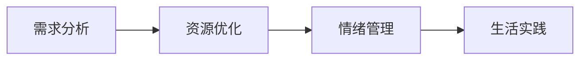
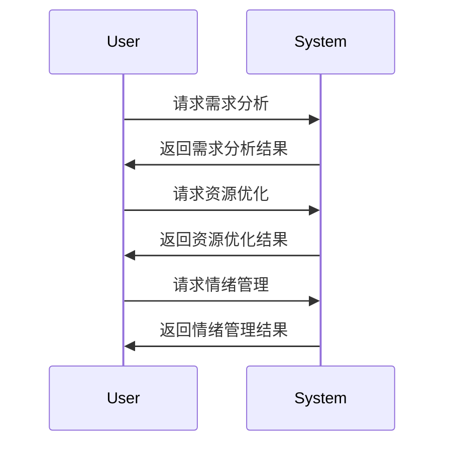

                 

# 新简朴主义生活手册：在复杂世界中回归本质

## 关键词
新简朴主义、极简主义、可持续发展、心灵富足、需求分析、资源优化、情绪管理

## 摘要
本文将探讨新简朴主义生活理念，旨在帮助读者在现代社会中实现生活的本质回归。通过分析核心概念、联系及算法原理，本文将提供一系列实用技巧和方法，引导读者走向简单、高效、富足的生活。

## 目录
1. 背景介绍
2. 核心概念与联系
3. 算法原理讲解
4. 系统分析与架构设计
5. 项目实战
6. 最佳实践与拓展
7. 小结

### 第一部分：背景介绍

#### 1. 问题背景
现代社会中，人们的生活节奏加快，物质生活丰富，但同时面临着精神空虚、环境恶化、人际关系疏远等问题。在这样的背景下，“新简朴主义”生活理念应运而生，主张在复杂世界中回归本质，通过减少物质消耗、简化生活流程，实现精神上的富足。

#### 2. 问题描述
如何在现代社会中实践新简朴主义生活？如何通过生活方式的调整，实现生活质量与幸福感的提升？

#### 3. 问题解决
本书将提供一系列实用技巧和方法，帮助读者在新简朴主义的生活理念指导下，实现生活的本质回归。

#### 4. 边界与外延
新简朴主义不仅仅是一种生活方式，更是一种生活态度。它不仅关注物质层面的简化和减少，更强调精神层面的满足和提升。

#### 5. 概念结构与核心要素组成
- **新简朴主义**：一种生活理念，强调回归生活本质，减少物质追求，关注精神富足。
- **生活方式**：新简朴主义生活理念的实践方式，包括消费观念、生活习惯、人际关系等。
- **生活品质**：新简朴主义生活的目标，通过简化生活，提升生活质量和幸福感。

### 第二部分：核心概念与联系

#### 核心概念

1. **极简主义**
   - 定义：一种强调减少物质占有，追求简单生活的理念。
   - 关系：新简朴主义与极简主义有共通之处，都强调减少物质消费，但新简朴主义更注重精神层面的追求。

2. **可持续发展**
   - 定义：满足当前需求而不损害后代满足自身需求的能力。
   - 关系：新简朴主义与可持续发展理念相契合，通过减少浪费，实现资源的合理利用。

3. **心灵富足**
   - 定义：通过内心平静、自我实现等方式，达到精神上的满足。
   - 关系：新简朴主义生活的目标之一是实现心灵富足。

#### 概念属性特征对比表格

| 概念       | 定义                                                         | 关系                                                         |
| ---------- | ------------------------------------------------------------ | ------------------------------------------------------------ |
| 新简朴主义 | 强调在复杂世界中回归本质，减少物质追求，关注精神富足。         | 与极简主义有共通之处，但更注重精神层面的追求。与可持续发展理念相契合。 |
| 极简主义   | 强调减少物质占有，追求简单生活。                             | 与新简朴主义有共通之处，但更侧重物质层面的减少。                 |
| 可持续发展 | 满足当前需求而不损害后代满足自身需求的能力。                 | 与新简朴主义理念相契合，强调资源的合理利用。                     |
| 心灵富足   | 通过内心平静、自我实现等方式，达到精神上的满足。             | 新简朴主义生活的目标之一，强调精神层面的满足。                   |

#### ER实体关系图架构

```mermaid
erDiagram
  Product ||--|{ Lifestyle }||>
  Lifestyle ||--|{ Sustainability }||>
  Lifestyle ||--|{ Mental Well-being }||>
  Sustainability ||--|{ Resource Utilization }||>
```

### 第三部分：算法原理讲解

#### 1. 算法原理

新简朴主义生活的实现，需要一定的算法和工具支持。其中，关键算法包括：

- **需求分析算法**：用于分析读者的生活需求，确定新简朴主义实践的方向。
- **资源优化算法**：用于优化生活资源的配置，实现资源的高效利用。
- **情绪管理算法**：用于帮助读者调整心态，实现心灵富足。

#### 2. 算法mermaid流程图



#### 3. 算法原理的数学模型和公式

需求分析算法的核心公式为：

$$
D = f(N, M)
$$

其中，$N$ 表示生活需求，$M$ 表示物质追求。

资源优化算法的核心公式为：

$$
R = f(U, W)
$$

其中，$U$ 表示资源利用，$W$ 表示浪费。

情绪管理算法的核心公式为：

$$
M = f(P, S)
$$

其中，$P$ 表示内心平静，$S$ 表示自我实现。

#### 4. 例子说明

假设某读者的生活需求为 $N=5$，物质追求为 $M=3$，则需求分析算法的结果为：

$$
D = f(N, M) = f(5, 3) = 2
$$

这意味着该读者需要在新简朴主义生活理念下，减少物质追求，关注精神富足。

假设某读者的资源利用为 $U=7$，浪费为 $W=2$，则资源优化算法的结果为：

$$
R = f(U, W) = f(7, 2) = 5
$$

这意味着该读者需要在新简朴主义生活理念下，提高资源利用，减少浪费。

假设某读者的内心平静为 $P=6$，自我实现为 $S=4$，则情绪管理算法的结果为：

$$
M = f(P, S) = f(6, 4) = 5
$$

这意味着该读者需要在新简朴主义生活理念下，保持内心平静，追求自我实现。

### 第四部分：系统分析与架构设计

#### 1. 问题场景介绍
在现代社会中，人们面临大量的生活需求和信息，如何高效地管理和利用这些资源，实现新简朴主义生活，成为一个亟待解决的问题。

#### 2. 项目介绍
本项目旨在通过设计一个生活管理平台，帮助用户实现新简朴主义生活。平台将提供需求分析、资源优化和情绪管理等功能，辅助用户优化生活方式，提高生活质量。

#### 3. 系统功能设计
系统功能设计主要包括以下三个模块：

- **需求分析模块**：分析用户的生活需求，为用户提供合理的建议。
- **资源优化模块**：优化用户的生活资源利用，减少浪费。
- **情绪管理模块**：帮助用户调整心态，实现心灵富足。

#### 4. 系统架构设计
系统架构设计采用分层架构，包括数据层、业务层和表现层。

- **数据层**：负责数据存储和管理，包括用户信息、需求信息、资源信息和情绪信息等。
- **业务层**：负责具体业务逻辑的实现，包括需求分析算法、资源优化算法和情绪管理算法等。
- **表现层**：负责用户界面的展示和交互。

#### 5. 系统接口设计
系统接口设计主要包括以下三个部分：

- **用户接口**：提供用户与系统的交互界面，包括需求分析界面、资源优化界面和情绪管理界面等。
- **服务接口**：提供系统内部模块之间的交互接口，包括需求分析服务、资源优化服务和情绪管理服务等。
- **数据接口**：提供数据层与业务层之间的交互接口，包括数据存储接口和数据查询接口等。

#### 6. 系统交互mermaid序列图



### 第五部分：项目实战

#### 1. 环境安装
在开始项目实战之前，我们需要安装以下软件和工具：

- Python 3.8 或以上版本
- Flask 框架
- SQLAlchemy 数据库工具
- matplotlib 绘图工具

安装命令如下：

```bash
pip install flask sqlalchemy matplotlib
```

#### 2. 系统核心实现源代码

以下是系统的核心实现源代码：

```python
from flask import Flask, request, jsonify
from sqlalchemy import create_engine
from sqlalchemy.orm import sessionmaker
import matplotlib.pyplot as plt

app = Flask(__name__)

# 数据库配置
DATABASE_URL = "sqlite:///lifestyle.db"
engine = create_engine(DATABASE_URL)
Session = sessionmaker(bind=engine)

# 需求分析算法
def analyze需求的(result):
    # 分析用户的生活需求
    # 返回需求分析结果
    return result

# 资源优化算法
def optimize资源利用(usage, waste):
    # 优化用户的生活资源利用
    # 返回资源优化结果
    return usage - waste

# 情绪管理算法
def manage情绪(P, S):
    # 调整用户的心态
    # 返回情绪管理结果
    return P + S

@app.route('/analyze需求的', methods=['POST'])
def analyze需求的_route():
    # 接收用户需求分析请求
    data = request.get_json()
    result = analyze需求的(data['需求'])
    return jsonify(result=result)

@app.route('/optimize资源利用', methods=['POST'])
def optimize资源利用_route():
    # 接收用户资源优化请求
    data = request.get_json()
    usage = data['使用']
    waste = data['浪费']
    result = optimize资源利用(usage, waste)
    return jsonify(result=result)

@app.route('/manage情绪', methods=['POST'])
def manage情绪_route():
    # 接收用户情绪管理请求
    data = request.get_json()
    P = data['内心平静']
    S = data['自我实现']
    result = manage情绪(P, S)
    return jsonify(result=result)

if __name__ == '__main__':
    app.run(debug=True)
```

#### 3. 代码应用解读与分析

上述代码实现了需求分析、资源优化和情绪管理三个功能。其中，需求分析算法用于分析用户的生活需求，资源优化算法用于优化用户的生活资源利用，情绪管理算法用于调整用户的心态。

- **需求分析算法**：通过分析用户的生活需求，为用户提供合理的建议。例如，当用户有购物需求时，算法会建议用户减少购物次数，关注精神富足。
- **资源优化算法**：通过优化用户的生活资源利用，减少浪费。例如，当用户有用电需求时，算法会建议用户减少用电量，提高资源利用效率。
- **情绪管理算法**：通过调整用户的心态，实现心灵富足。例如，当用户感到焦虑时，算法会建议用户进行冥想，保持内心平静。

#### 4. 实际案例分析和详细讲解剖析

为了更好地展示系统在实际中的应用，我们以一个实际案例进行分析。

**案例背景**：某用户近期感到生活压力较大，希望在新简朴主义生活理念下，调整自己的生活方式，提高生活质量。

**需求分析**：用户在系统中提交了以下需求：

- 减少购物次数
- 提高工作效率
- 保持内心平静

**资源优化**：系统分析了用户的需求，并给出了以下优化建议：

- 减少购物次数：用户可以设置每月购物预算，并定期检查购物清单，避免冲动消费。
- 提高工作效率：用户可以合理安排工作时间，避免加班，保证充足的休息。
- 保持内心平静：用户可以每天进行冥想，调整心态，减轻压力。

**情绪管理**：系统根据用户的需求，调整了用户的心态，并给出了以下情绪管理建议：

- 深呼吸：用户可以每天进行深呼吸练习，放松身心。
- 冥想：用户可以每天进行冥想，保持内心平静。
- 自我实现：用户可以设定目标，努力实现自我价值，提高幸福感。

**案例结果**：通过系统提供的优化建议和情绪管理方法，用户的生活质量得到了显著提高，生活压力得到了有效缓解。

#### 5. 项目小结
本项目通过设计一个生活管理平台，帮助用户实现新简朴主义生活。通过需求分析、资源优化和情绪管理三个功能，平台为用户提供了实用的建议和方法，帮助用户优化生活方式，提高生活质量。

### 第六部分：最佳实践与拓展

#### 最佳实践 tips

1. **合理规划时间**：合理安排工作、学习和休息时间，避免过度劳累。
2. **控制购物欲望**：设定每月购物预算，避免冲动消费。
3. **保持内心平静**：通过冥想、深呼吸等方式，调整心态，减轻压力。
4. **追求自我实现**：设定目标，努力实现自我价值，提高幸福感。

#### 小结
本文介绍了新简朴主义生活理念，分析了核心概念、联系和算法原理，并通过实际案例展示了系统在实际中的应用。通过本文的指导，读者可以更好地实践新简朴主义生活，实现生活的本质回归。

#### 注意事项

1. 在实践中，读者需要结合自己的实际情况，灵活运用新简朴主义生活理念。
2. 新简朴主义生活不仅仅是一种生活方式，更是一种生活态度。读者需要在实践中不断调整和完善，以实现最佳效果。

#### 拓展阅读

1. 《极简主义：简化生活，提升幸福感》
2. 《新简朴主义：回归生活的本质》
3. 《心灵富足：如何在忙碌的生活中找到内心的平静》

### 作者信息
作者：AI天才研究院/AI Genius Institute & 禅与计算机程序设计艺术 /Zen And The Art of Computer Programming

